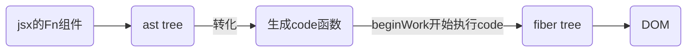
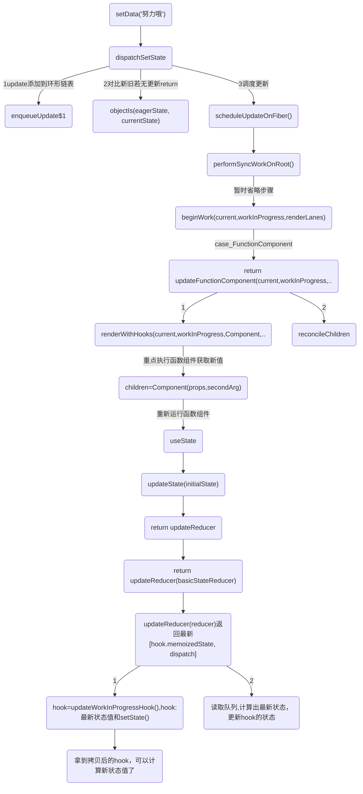

# react 特点
1. 模板引擎:jsx
vue和react同样采用的是虚拟dom 运行时+编译时 都是找出差异修改;


2. 配合ts比较友好,函数式编程是用函数的组合来进行编程,带来的是组件化开发
```
1. 比如区分容器组件和展示组件

2. react提倡把业务拆分更小的组件，使用shouldComponentUpdate(){return true}重新渲染组件或则 React.memo():{return true}不会渲染,进行深层比较去控制组件的渲染
```
4. 可不回答：丰富的技术生态圈,很多大型应用都是react
5. react 渲染/更新方式

## 3.vue和react相同点
1. 虚拟dom,以数据为驱动的开发模式;
2. 单向数据流，单向数据流就是model的更新会触发view的更新，view的更新不会触发model的更新，它们的作用是单向的.

不同：
1.更新方式
2.模板引擎


# 优化方式
* react useMemo 或则旧版shouldComponentUpdate 决定组件是否需要重现渲染
```
api-memo()和shouldComponentUpdate().md
```
* react 改变state 需要this.setState()，react不允许直接更改状态，setState是异步的,会批量地对state进行更新以提高性能的,减少渲染次数.
```
所以，react没办法做到检测属性变化直接驱动render函数的执行，得依赖依赖setState调用.而且所有子组件会刷新。
（如果需要通过setState第二个参数传入callback能让你拿到更新后的state）
```

## 优化1.如果你在渲染期间执行了高开销的计算，则可以使用 `useMemo` 来进行优化。
```
api-useMemo.md
```

## 优化1.减少嵌套节点/组件
因为react 每个节点都会触发beginWork;
vue中,创建好vnode,调用patch进行组件内容的渲染,vnode.children递归调用 patch(null,child,container)
所以减少嵌套组件，嵌套节点很重要

* 或则使用虚拟列表


## 优化.useState同步还是异步? 优化点
### 关于React17的性能优化:React17根据情况而采用不同的更新策略
React17 和 React18 批量更新的策略是不同的。
* React18就统一的采用更新策略，可以不用考虑render渲染次数，带来的性能问题。
* React17根据情况而采用不同的更新策略，
```
1. 只要进入了 react 的调度流程，那就是异步的；只要你没有进入 react 的调度流程，那就是同步的。
2. 什么东西不会进入 react 的调度流程？ setTimeout、 setInterval 、直接在 DOM 上绑定原生事件、Promise 的回调等，这些都不会走 React 的调度流程。在这种情况下调用 setState ，那这次 setState 就是同步的。 否则就是异步的。
3. setState 同步执行的情况下， DOM也会被同步更新，也就意味着如果多次 setState ，会导致多次更新，这是毫无意义并且浪费性能的。
```

在react17中提供了 `unstable_batchedUpdates` 函数，用来合并批量操作。在请求后台接口，返回数据时使用unstable_batchedUpdates函数来减少渲染次数，优化,
```js
const btn2 = () => {
  setTimeout(() => {
    unstable_batchedUpdates(() => {
      setCount(prev => prev + 1)
      setCount(prev => prev + 2)
    })
  }, 0)
}
```

### 类组件中的 this.setState 结论：
在legacy模式中，更新可能为同步，也可能为异步；
在concurrent模式中，一定是异步。

* 1.当直接调用时this.setState时，为异步更新；
```js
const [count, setCount] = useState(0)

如果我们在同步函数或者在异步回调中调用 setCount 后，打印 count，都是旧值。此时，setState 是异步的。
```
* 2.当在异步函数的回调中调用this.setState，则为同步更新；
* 3.当放在自定义 DOM 事件的处理函数中时，也是同步更新。

### 为什么是异步？
setState 里的逻辑其实是同步的，但是，调用 setState 时，react 会对这一系列的 setter 做合并处理，异步更新该函数式组件对应的 hooks 链表里面的值，然后触发重渲染（re-renders），从这个角度上来说，setState 确实是一个"异步"操作；

## legacy 模式和 concurrent 模式(并发，Concurrent)
### concurrent 模式
通过ReactDOM.unstable_createRoot(rootNode).render(<App />)方式创建的应用，则为concurrent模式，这个模式目前只是一个实验阶段的产物

* createRoot调用createRootImpl创建fiberRootNode和rootNode
* 创建完Fiber节点后，调用ReactDOMRoot.prototype.render执行updateContainer，然后scheduleUpdateOnFiber异步调度performConcurrentWorkOnRoot进入render阶段和commit阶段
### legacy 模式
通过ReactDOM.render(<App />, rootNode)方式创建应用，则为 legacy 模式

legacy 模式在合成事件中有自动批处理的功能，但仅限于一个浏览器任务。非 React 事件想使用这个功能必须使用 unstable_batchedUpdates

legacy模式是我们常用的，它构建dom的过程是同步的，所以在render的reconciler中，如果diff的过程特别耗时，那么导致的结果就是js一直阻塞高优先级的任务(例如用户的点击事件)，表现为页面的卡顿，无法响应

* render调用legacyRenderSubtreeIntoContainer，最后createRootImpl会调用到createFiberRoot创建fiberRootNode,然后调用createHostRootFiber创建rootFiber，其中fiberRootNode是整个项目的的根节点，rootFiber是当前应用挂在的节点，也就是ReactDOM.render调用后的根节点

* 创建完Fiber节点后，legacyRenderSubtreeIntoContainer调用updateContainer创建创建Update对象挂载到updateQueue的环形链表上，然后执行scheduleUpdateOnFiber调用performSyncWorkOnRoot进入render阶段和commit阶段

# 两大阶段：render和commit
## render
render阶段是在内存中构建一棵新的fiber树（称为workInProgress树）,构建过程是依照现有fiber树（current树）从root开始深度优先遍历再回溯到root的过程，这个过程中每个fiber节点都会经历两个阶段：beginWork和completeWork。
1. beginWork阶段:将ast树转换为fiber 树。
2. completeWork阶段:生成实例

组件的状态计算、diff的操作:通过 Diff 算法找出所有节点变更，例如节点新增、删除、属性变更等等, 获得需要更新的节点信息，以及render函数的执行，发生在beginWork阶段

### render可调度
在 render 阶段，一个庞大的更新任务被分解为了一个个的工作单元，这些工作单元有着不同的优先级，React 可以根据优先级的高低去实现工作单元的打断和恢复。

异步可中断更新，在构建 workInProgress 的过程中，如果有更高优先级的更新产生， React 会停止 workInProgress fiber tree 的构建，然后开始处理更高优先级的更新，重新构建 workInProgress fiber tree。

等更高优先级的更新处理完毕之后，才会处理原来被中断的更新。

React fiber的构建的过程以每个fiber作为一个工作单元，进行工作循环，工作循环中每次处理一个任务（工作单元），处理完毕有一次喘息的机会：
```js
while (nextUnitOfWork !== null && !shouldYieldToRenderer()) {
  nextUnitOfWork = performUnitOfWork(nextUnitOfWork);
}
```

## commit阶段:可以分为3个阶段：
在render阶段结束后，会进入commit阶段，该阶段不可中断,commit阶段的调度优先级采用的是最高优先级，以保证commit阶段同步执行不可被打断。

主要是去依据workInProgress树中有变化的那些节点（render阶段的completeWork过程收集到的effect链表）,去完成DOM操作，将更新应用到页面上，除此之外，还会异步调度useEffect以及同步执行useLayoutEffect。

相应的节点进行提交，渲染到页面上,在commit阶段就会操作真实节点，将它们插入到dom树中:
* 1.Before mutation 阶段（执行 DOM 操作前）；
    - 对于类组件，执行 getSnapshotBeforeUpdate 生命周期
    - 对于函数组件，异步调用 useEffect

* 2.mutation 阶段（执行 DOM 操作）；
    - 进行真实的 DOM 操作

* 3.layout 阶段（执行 DOM 操作后）
    - 对于类组件，会执行setState的callback
    - 对于函数组件，会执行useLayoutEffect

complete阶段workInProgress节点都是经过diff算法调和过的，也就意味着对于某个节点来说它fiber的形态已经基本确定了，但除此之外还有两点：
* 目前只有fiber形态变了，对于原生DOM组件（HostComponent）和文本节点（HostText）的fiber来说，对应的DOM节点（fiber.stateNode）并未变化。
* 经过Diff生成的新的workInProgress节点持有了flag(即effectTag)

workInProgress节点的completeWork阶段主要做的:
* 真实DOM节点的创建以及挂载
```
构建过程中，会自下而上将子节点的第一层第一层插入到当前节点。
更新过程中，会计算DOM节点的属性，一旦属性需要更新，会为DOM节点对应的workInProgress节点标记Update的effectTag
```
* effectList的收集
```
执行beginWork后会创建子 Fiber 节点，节点上可能存在effectTag。
```
* DOM属性的处理,次要理解
* 错误处理,次要理解

# hook 之 state
beginWork-->children=Component(props,secondArg)--执行函数组件-->dev.useState(initialState)

初始化state:
1. 第一步处理链表
2. 绑定dispatch
3. 返回[hook.memoizedState,dispatch]


## setState 更新,重点在dispatchSetState
当执行setState("努力哦")-->dispatchSetState 其中对比新旧值：
objectIs(eagerState, currentState) 如果有更新：调度更新performSyncWorkOnRoot()

1. 重新执行函数组件，updateReducer(reducer)返回最新[hook.memoizedState, dispatch]

2. reconcileChildren 走上面的更新逻辑

