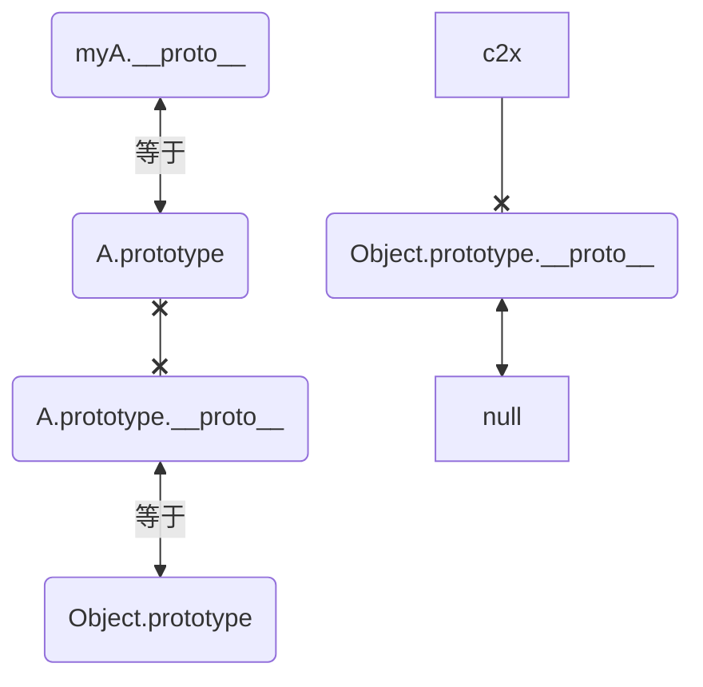

# 原型链
## `__proto__和prototype` 重点
* prototype(原型)是函数才有的，prototype是构造函数的属性，指向属于该`函数的原型对象`,储存着对象的属性和构造函数constructor,在原型对象里有共有的方法，所有构造函数声明的实例都可以共享这个方法。
* `__proto__`(隐式原型)是每个对象都有的一个属性,是任何对象的属性，指向`该对象的构造函数的原型对象`
```
对象的构造函数的prototype
```
```
一个对象的隐式原型指向构造该对象的构造函数的原型，这也保证了实例能够访问在构造函数原型中定义的属性和方法。
```
```js
function A() {}
A.prototype.aPrototype='test';
// ƒ () { [native code] }
console.log('__proto__',A.__proto__)
/*
{
  aPrototype : "test",
  constructor : ƒ A(),
  [[Prototype]] : Object,
}
*/
console.log('prototype',A.prototype)
```
* 当你new fn的时候，产生的实例的`__proto__`指向fn.prototype，两者是同一个东西。
```js
var one = {x: 1};
var two = new Object();
one.__proto__ === Object.prototype // true
two.__proto__ === Object.prototype // true
one.toString === one.__proto__.toString // true
```

## 问题1:原型链
原型链是 js 对象的一种链表结构,`__proto__`是连接每个对象的节点,当寻找一个属性先从本对象找，然后是`myA.__proto__=== A.prototype`，然后是冒泡往原型链寻找`A.prototype.__proto__===Object.prototype`


# 原型
* Object,Function都属于构造函数；
所有的构造函数是Function的实例，也就是说Function.prototype是所有构造函数的原型

* Object是Function的实例对象,Object是Function的实例对象，即:
```js
Object.__proto__.constructor;
//结果：ƒ Function() { [native code] }
```

* Function.prototype是Object的实例对象:
```js
Function.prototype.__proto__.constructor;
//结果：ƒ Object() { [native code] }
```
### 原型链的终点
[](../assets/img-js/myA原型链打印.png)
```js
function A() {}
A.prototype.aPrototype='test';

var myA = new A()
myA.test = 1

/*
注意点：
*/
console.log("myA:", myA);
// {}:A的原型的构造函数指向自己: // ƒ A()
console.log("a-1.prototype.constructor", A.prototype.constructor);
// true
console.log("a-2.是否等", A.prototype.constructor === A);

// undefined 注意：这样访问aPrototype
console.log("0-2.aPrototype:", A.aPrototype);


/*
步骤1：探究A.constructor 和 A.__proto__
*/
function A() {}
A.prototype.aPrototype='test';
// 指向构造A的构造函数Function的原型对象，也就是指向Function.prototype
//ƒ () { [native code] }
console.log("5-.__proto__:", A.__proto__);
// true //所以二者相等
console.log("6.是否等", A.__proto__ === A.constructor.prototype);

/*
步骤2：探究 A.prototype 和 A.prototype.constructor
*/
function A() {}
A.prototype.aPrototype='test';

var myA = new A()
// Object ƒ Object() { [native code] }
console.log("Object", Object);
// true Object是一个构造函数
console.log("8-2",A.prototype.__proto__===Object.prototype)
console.log("8-A:A.prototype",A.prototype)
// null
console.log("8-B",A.prototype.__proto__.__proto__)
// null
console.log("8-3",Object.prototype.__proto__)
```
[](../assets/img-js/A.prototype打印.png)

### 图


不理解看这个例子：
```js
function A() {}
A.prototype.aPrototype='test';

var myA = new A()

// 1: undefined
console.log('1:',myA.prototype)

// myA.__proto__ {aPrototype: 'test', constructor: ƒ}
console.log("myA.__proto__",myA.__proto__)

// A.prototype就是原型对象。原型对象也是对象，所以它也有proto属性，连接它的原型，
// 2: {aPrototype: 'test', constructor: ƒ}
console.log('2:',A.prototype)

/*
3: A:{
    [[Prototype]]: {
                    aPrototype: "test",
                    constructor: ƒ A(),
                    [[Prototype]]: Object
                  }
  }
*/
console.log('3:',myA)

// test,它去proto 找到了 aPrototype
console.log("0-1.myA.aPrototype:", myA.aPrototype);
// undefined 注意：这样访问aPrototype
console.log("0-2.aPrototype:", A.aPrototype);
// test
console.log("0-3.prototype.aPrototype:", A.prototype.aPrototype);

// {}:A的原型的构造函数指向自己
// ƒ A()
console.log("a-1.prototype.constructor", A.prototype.constructor);
// true
console.log("a-2.是否等", A.prototype.constructor === A);

/*
步骤1：探究A.constructor 和 A.__proto__
*/

// ƒ Function() { [native code] } --->A 的构造函数是 Function
console.log("3-A.constructor:", A.constructor);

// ƒ () { [native code] }
console.log("4-A.constructor.prototype:", A.constructor.prototype);

// 指向构造A的构造函数Function的原型对象，也就是指向Function.prototype
//ƒ () { [native code] }
console.log("5-.__proto__:", A.__proto__);
// true //所以二者相等
console.log("6.是否等", A.__proto__ === A.constructor.prototype);

/*
步骤2：探究 A.prototype 和 A.prototype.constructor
*/
// false 肯定不等，两个不是一个东西
console.log("7.是否等", A.prototype === A.__proto__);

console.log("2-1-myA.__proto__:", myA.__proto__);
// true
console.log('2-2-是否:',myA.__proto__=== A.prototype)
console.log("8-1",A.prototype.__proto__)
// Object ƒ Object() { [native code] }
console.log("Object", Object);
// true Object是一个构造函数
console.log("8-2",A.prototype.__proto__===Object.prototype)
// null
console.log("8-3",Object.prototype.__proto__)
```

## new做了什么?
```
见：
01-1-js基础.md

## new 操作符具体干了什么呢?
```

参考：题目 2-3.原型链的终点 
或则：题1_1_prototype能否取到值.js 你就明白了
 


### 例子1
说明：函数的 prototype 属性指向了一个对象，这个对象正是调用该构造函数而创建的实例的原型,也就是这个例子中的 person1 和 person2 的原型。

```js
function Person(){};

Person.prototype.name = 'name';

const person1 = new Person();
const person2 = new Person();

console.log('1:',person1.name) // 1: name
console.log('2:',person2.name) // 2: name
console.log('3:',person2.prototype) // 3: undefined
console.log('4:',person1 instanceof Person) // 4: true

console.log('5:',Person.prototype) // 5: {name: 'name', constructor: ƒ}
console.log('6:',person1.constructor) // 6: ƒ Person(){}
```

### 例子2：
```js
console.log("分割线==========> start");

// 简略代码: myA实例的原型指向构造函数的原型
function FnA() { }

FnA.prototype.aPrototype = "test";

const myA = new FnA();
console.log("1_是否:", myA.__proto__ === FnA.prototype); //true

// -FnA.prototype.constructor (A的原型的构造函数)指向自己
// -FnA 的原型内容
console.log("2-FnA.prototype:", FnA.prototype); // constructor: ƒ, 包括构造函数:而且构造函数是指向它自己,也就是ƒ FnA() {}
console.log("3-FnA.prototype.constructor", FnA.prototype.constructor); // ƒ FnA() {}:FnA的原型的构造函数是指向它自己,所以是点不完的

//-A的原型的原型指向 Object
console.log("4-FnA.prototype.__proto__:", FnA.prototype.__proto__);  // 指向Object:{}
console.log("5-是否等", FnA.prototype.__proto__ === Object.prototype);  // true

// -最终指向null
console.log(
  "6-FnA.prototype.__proto__.__proto__:",
  FnA.prototype.__proto__.__proto__
); // null，所以它就是前面所提到的尽头

console.log("分割线==========> end");
```

总结：


## 创建对象的几种方式
### 3-2.创建对象方式2：字面量,效率比较高
{}是字面量，可以立即求值，而new Object()本质上是方法（只不过这个方法是内置的）调用，既然是方法调用，就涉及到在proto链中遍历该方法，当找到该方法后，又会生产方法调用必须的堆栈信息，方法调用结束后，还要释放该堆栈

### 3-2.Object.create()
Object.create()方法创建一个新对象，使用现有的对象来提供新创建的对象的proto
```js
const person = {
  isHuman: false,
  printIntroduction: function () {
    console.log(`My name is ${this.name}. Am I human? ${this.isHuman}`);
  },
};
const me = Object.create(person);
me.name = "Matthew";
me.isHuman = true;
me.printIntroduction();
```
具体三个步骤就是：
1. 创建一个对象
2. 继承指定父对象
3. 为新对象扩展新属性
```js
// 自己实现一个Object.create()：
Object.myCreate = function (obj, properties)  {
  var F = function ()  {}
  F.prototype = obj
  if (properties) {
     Object.defineProperties(F, properties)
  }
  return new F()
}
Object.myCreate({}, {a: {value: 1}}) //{a: 1}
```

# instancof: 处理对象(person1)和函数的关系
instanceof 是一个二元运算符，如：A instanceof B. 其中，A 必须是一个合法的 JavaScript 对象，B 必须是一个合法的 JavaScript 函数 (function). 判断过程如下：
```
函数 B 在对象 A 的原型链 (prototype chain) 中被发现，

instanceof 返回 true，否则返回 false.
```

注意：instanceof 运算时会递归查找 L 的原型链，即 L.**proto**.**proto**.**proto**.**proto**...直到找到了或者找到顶层为止。

```js
// 1.构造器Function的构造器是它自身
console.log(Function instanceof Object) // true
console.log(Object instanceof Function) // true

// 2.构造器Object的构造器是Function（由此可知所有构造器的constructor都指向Function）
console.log(Object.constructor === Function) // true

// 3.构造器Function的__proto__是一个特殊的匿名函数function() {}
console.log(Function.__proto__);  // function() {}

// 4.这个特殊的匿名函数的__proto__指向Object的prototype原型。
console.log(Function.__proto__.__proto__ === Object.prototype) // true

// 5.Object的__proto__指向Function的prototype，也就是上面③中所述的特殊匿名函数
console.log(Object.__proto__ === Function.prototype) // true

console.log(Function.prototype === Function.__proto__) // true
```
