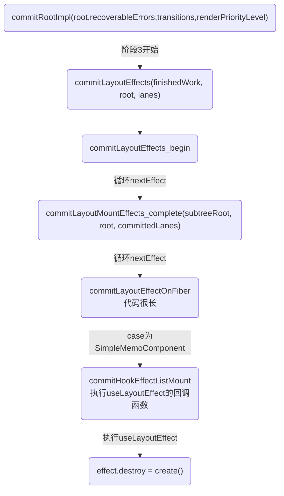
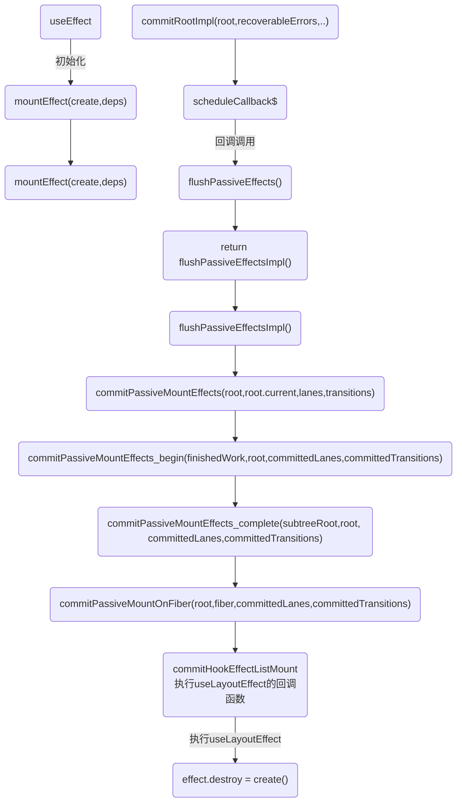

# commit流程图

## 执行useLayoutEffect流程图


## useEffect 流程图


# 入口
commitRoot 方法是commit 阶段工作的起点

## 重点:performConcurrentWorkOnRoot 在render结束之后调用 finishConcurrentRender
`重点函数performConcurrentWorkOnRoot,这个函数在render结束会开启commit阶段`

```js
function performConcurrentWorkOnRoot(root, didTimeout) {

  // 省略...

  var shouldTimeSlice = !includesBlockingLane(root, lanes) && !includesExpiredLane(root, lanes) && (!didTimeout);
  console.log('==render阶段准备:performConcurrentWorkOnRoot调用renderRootSync():同步更新concurrent模式:', { shouldTimeSlice });
  var exitStatus = shouldTimeSlice ? renderRootConcurrent(root, lanes) : renderRootSync(root, lanes);

  if (exitStatus !== RootInProgress) {
    if (exitStatus === RootErrored) {
      // If something threw an error, try rendering one more time. We'll
      // render synchronously to block concurrent data mutations, and we'll
      // includes all pending updates are included. If it still fails after
      // the second attempt, we'll give up and commit the resulting tree.
      var errorRetryLanes = getLanesToRetrySynchronouslyOnError(root);

      if (errorRetryLanes !== NoLanes) {
        lanes = errorRetryLanes;
        exitStatus = recoverFromConcurrentError(root, errorRetryLanes);
      }
    }

    if (exitStatus === RootFatalErrored) {
      var fatalError = workInProgressRootFatalError;
      prepareFreshStack(root, NoLanes);
      markRootSuspended$1(root, lanes);
      ensureRootIsScheduled(root, now());
      throw fatalError;
    }

    if (exitStatus === RootDidNotComplete) {
      // The render unwound without completing the tree. This happens in special
      // cases where need to exit the current render without producing a
      // consistent tree or committing.
      //
      // This should only happen during a concurrent render, not a discrete or
      // synchronous update. We should have already checked for this when we
      // unwound the stack.
      markRootSuspended$1(root, lanes);
    } else {
      // The render completed.
      // Check if this render may have yielded to a concurrent event, and if so,
      // confirm that any newly rendered stores are consistent.
      // TODO: It's possible that even a concurrent render may never have yielded
      // to the main thread, if it was fast enough, or if it expired. We could
      // skip the consistency check in that case, too.
      var renderWasConcurrent = !includesBlockingLane(root, lanes);
      var finishedWork = root.current.alternate;

      if (renderWasConcurrent && !isRenderConsistentWithExternalStores(finishedWork)) {
        // A store was mutated in an interleaved event. Render again,
        // synchronously, to block further mutations.
        exitStatus = renderRootSync(root, lanes); // We need to check again if something threw

        if (exitStatus === RootErrored) {
          var _errorRetryLanes = getLanesToRetrySynchronouslyOnError(root);

          if (_errorRetryLanes !== NoLanes) {
            lanes = _errorRetryLanes;
            exitStatus = recoverFromConcurrentError(root, _errorRetryLanes); // We assume the tree is now consistent because we didn't yield to any
            // concurrent events.
          }
        }

        if (exitStatus === RootFatalErrored) {
          var _fatalError = workInProgressRootFatalError;
          prepareFreshStack(root, NoLanes);
          markRootSuspended$1(root, lanes);
          ensureRootIsScheduled(root, now());
          throw _fatalError;
        }
      } // We now have a consistent tree. The next step is either to commit it,
      // or, if something suspended, wait to commit it after a timeout.


      root.finishedWork = finishedWork;
      root.finishedLanes = lanes;
      console.log(`%c=commit阶段=前=render阶段结束=performConcurrentWorkOnRoot调用finishConcurrentRender-->commitRoot`, 'color:cyan')
      finishConcurrentRender(root, exitStatus, lanes);
    }
  }

  ensureRootIsScheduled(root, now());

  if (root.callbackNode === originalCallbackNode) {
    // The task node scheduled for this root is the same one that's
    // currently executed. Need to return a continuation.
    return performConcurrentWorkOnRoot.bind(null, root);
  }

  return null;
}
```

## 1.初始化时候:finishConcurrentRender-->调用commitRoot 3
```js
function finishConcurrentRender(root, exitStatus, lanes) {
  switch (exitStatus) {
    case RootInProgress:
      // 省略..
    case RootFatalErrored:
      {
        throw new Error('Root did not complete. This is a bug in React.');
      }

    case RootErrored:

    case RootSuspended:
        // 省略..

        console.log(`%c=commit阶段=调用commitRoot 1`, 'color:cyan')
        commitRoot(root, workInProgressRootRecoverableErrors, workInProgressTransitions);
        break;
      }

    case RootSuspendedWithDelay:
        // 省略..
        console.log(`%c=commit阶段=调用commitRoot 2`, 'color:cyan')
        commitRoot(root, workInProgressRootRecoverableErrors, workInProgressTransitions);
        break;
      }

    case RootCompleted:
      {
        // The work completed. Ready to commit.
        console.log(`%c=commit阶段=调用commitRoot 3:finishConcurrentRender函数case RootCompleted,`, 'color:cyan')
        commitRoot(root, workInProgressRootRecoverableErrors, workInProgressTransitions);
        break;
      }

    default:
      {
        throw new Error('Unknown root exit status.');
      }
  }
}
```


## 2.更新时候:performSyncWorkOnRoot-->commitRoot
```js
function performSyncWorkOnRoot(root) {
  {
    syncNestedUpdateFlag();
  }

  if ((executionContext & (RenderContext | CommitContext)) !== NoContext) {
    throw new Error('Should not already be working.');
  }
  console.log(`%c=副作用:performSyncWorkOnRoot调用flushPassiveEffects-7`, 'color:yellow')
  flushPassiveEffects();
  var lanes = getNextLanes(root, NoLanes);

  // 省略

  var finishedWork = root.current.alternate;
  root.finishedWork = finishedWork;
  root.finishedLanes = lanes;
  console.log(`%c=commit阶段=调用commitRoot 4:performSyncWorkOnRoot调用commitRoot`, 'color:cyan')
  commitRoot(root, workInProgressRootRecoverableErrors, workInProgressTransitions); // Before exiting, make sure there's a callback scheduled for the next
  // pending level.

  ensureRootIsScheduled(root, now());
  return null;
}
```

## commitRoot 方法是commit 阶段工作的起点,然后调用commitRootImpl
```js
// commitRoot-->commitRootImpl
function commitRoot(root, recoverableErrors, transitions) {
  // TODO: This no longer makes any sense. We already wrap the mutation and
  // layout phases. Should be able to remove.
  var previousUpdateLanePriority = getCurrentUpdatePriority();
  var prevTransition = ReactCurrentBatchConfig$3.transition;
  console.log('%c=commitRoot===: %c=入口', 'color:red', 'color:blue', { root, recoverableErrors });
  try {
    ReactCurrentBatchConfig$3.transition = null;
    setCurrentUpdatePriority(DiscreteEventPriority);
    commitRootImpl(root, recoverableErrors, transitions, previousUpdateLanePriority);
  } finally {
    ReactCurrentBatchConfig$3.transition = prevTransition;
    setCurrentUpdatePriority(previousUpdateLanePriority);
  }

  return null;
}
```


# commit 阶段
commit阶段的工作主要分为三部分：
* 1.commitBeforeMutationEffects 阶段(befor mutation阶段)：执行DOM操作前的一些相关操作
```
before mutation阶段-执行DOM操作前,这个阶段 DOM 节点还没有被渲染到界面上去，过程中会触发 getSnapshotBeforeUpdate，也会处理 useEffect 钩子相关的调度逻辑。

1. 处理 DOM 节点渲染/删除后的 autoFocus、blur 逻辑；
2. 调用getSnapshotBeforeUpdate 生命周期钩子；
3. 调度useEffect。
```
* 2.commitMutationEffects 阶段(mutation阶段)：执行DOM操作

* 3.commitLayoutEffects 阶段(layout阶段)：执行DOM操作后的一些相关操作
```
mutation 阶段，这个阶段负责 DOM 节点的渲染。在渲染过程中，会遍历 effectList，根据 flags（effectTag）的不同，执行不同的 DOM 操作
```

除此之外，一些生命周期钩子（比如 componentDidXXX）、hook（比如 useEffect）需要在commit 阶段执行。
在 rootFiber.firstEffect 上保存了一条需要执行副作用的 Fiber 节点的单向链表effectList，这些 Fiber 节点的 updateQueue 中保存了变化的 props。

`注意关于useEffect：scheduleCallback将执行useEffect的动作作为一个任务去调度，这个任务会异步调用。`

```js
function commitRootImpl(root, recoverableErrors, transitions, renderPriorityLevel) {
  // ...

  // 这里开始调用 useEffect --> flushPassiveEffects
  if ((finishedWork.subtreeFlags & PassiveMask) !== NoFlags || (finishedWork.flags & PassiveMask) !== NoFlags) {
  if (!rootDoesHavePassiveEffects) {
    rootDoesHavePassiveEffects = true;
    // to store it in pendingPassiveTransitions until they get processed
    // We need to pass this through as an argument to commitRoot
    // because workInProgressTransitions might have changed between
    // the previous render and commit if we throttle the commit
    // with setTimeout

    pendingPassiveTransitions = transitions;
    scheduleCallback$1(NormalPriority, function () {
      console.log(`%c=副作用:commitRootImpl调用flushPassiveEffects-2`, 'color:yellow')
      flushPassiveEffects(); // This render triggered passive effects: release the root cache pool
      // *after* passive effects fire to avoid freeing a cache pool that may
      // be referenced by a node in the tree (HostRoot, Cache boundary etc)

      return null;
    });
  }

  console.log(`%c=commit阶段=1commitBeforeMutationEffects阶段:执行DOM操作前`, 'color:cyan', { root, finishedWork })
  var shouldFireAfterActiveInstanceBlur = commitBeforeMutationEffects(root, finishedWork);

  {
    // Mark the current commit time to be shared by all Profilers in this
    // batch. This enables them to be grouped later.
    recordCommitTime();
  }

  console.log(`%c=commit阶段=2commitMutationEffects阶段:执行DOM操作`, 'color:cyan')
  commitMutationEffects(root, finishedWork, lanes);

  resetAfterCommit(root.containerInfo); // The work-in-progress tree is now the current tree. This must come after
  // the mutation phase, so that the previous tree is still current during
  // componentWillUnmount, but before the layout phase, so that the finished
  // work is current during componentDidMount/Update.

  root.current = finishedWork; // The next phase is the layout phase, where we call effects that read

  {
    markLayoutEffectsStarted(lanes);
  }

  // 这里开始调用flushPassiveEffects -->commitLayoutEffects
  console.log(`%c=commit阶段=3commitLayoutEffects阶段:执行DOM操作后的一些相关操作`, 'color:cyan')
  commitLayoutEffects(finishedWork, root, lanes);
  {
    markLayoutEffectsStopped();
  }
}
```

### appendAllChildren发生在render阶段
appendAllChildren负责将子孙DOM节点插入刚生成的DOM节点中。

beginWork时介绍过，在mount时，为了避免每个fiber节点都需要进行插入操作，在mount时，只有根节点会收集effectTag，
其余节点不会进行effectTag的收集。由于每次执行appendAllChildren后，我们都能得到一棵以当前workInProgress为


render 阶段全部工作完成。在 performSyncWorkOnRoot 函数中 fiberRootNode 被传递给 commitRoot 方法，开启commit 阶段工作流程。

commit 提交阶段(不可中断/同步)：将需要更新的节点一次过批量更新，对应早期版本的 patch 过程。

根节点的DOM树。因此在commit阶段我们只需要对mount的根节点进行一次插入操作就可以了。
```js
appendAllChildren = function (parent, workInProgress, needsVisibilityToggle, isHidden) {
  // We only have the top Fiber that was created but we need recurse down its
  // children to find all the terminal nodes.
  var node = workInProgress.child;

  console.log('==appendAllChildren:parent', { parent });
  console.log('==appendAllChildren:', { workInProgress });

  // 这里采用的是深度优先遍历的方式 此时这里的instance为插入完的dom实例, 并把对应的节点赋值到当前Fiber节点的stateNode上
  while (node !== null) {
    if (node.tag === HostComponent || node.tag === HostText) {
      appendInitialChild(parent, node.stateNode);
    } else if (node.tag === HostPortal); else if (node.child !== null) {
      node.child.return = node;
      node = node.child;
      continue;
    }

    if (node === workInProgress) {
      return;
    }

    while (node.sibling === null) {
      if (node.return === null || node.return === workInProgress) {
        return;
      }

      node = node.return;
    }

    node.sibling.return = node.return;
    node = node.sibling;
  }
};
```


# useLayoutEffect
## useEffect和useLayoutEffect哪个先执行? 两个都是在commitRootImpl开始调用
答案是useLayoutEffect先执行

useLayoutEffect和useEffect的代码是一样的，区别主要是：
* 执行时机不同；
* useEffect是异步， useLayoutEffect是同步，会阻塞渲染

### 1.useLayoutEffect介绍
* 会在commit阶段的layout阶段同步执行
* useLayoutEffect 会同步地执行它的响应函数和上一次的销毁函数，即会阻塞住 DOM渲染。

* useLayoutEffects中适合进行一些可能影响dom的操作，因为在其create中可以获取到最新的dom树且由于此时浏览器未进行绘制（本轮事件循环尚未结束），因此不会有中间状态的产生，可以有效的避免闪动问题。因此当业务中出现需要在effect中修改视图，且执行的上一帧中视图变更，就可以考虑是否将逻辑放入useLayoutEffect中处理。
```
当然，useLayoutEffect的使用也应当是谨慎的。由于js线程和渲染进程是互斥的，因此useLayoutEffects中不宜加入很耗时的计算，否则会导致浏览器没有时间重绘而阻塞渲染，上述使用useLayoutEffect的demo中加入了200ms延迟，可以明显的感受到每次点击更新的延迟。除此之外的绝大部分场景下二者的行为都是一致的，因此业务开发中的大部分场景应优先使用useEffect。
```

### 2.useEffect介绍
* 会在commit阶段的layout阶段异步执行
```
为什么异步调用?

useEffect 异步执行的主要原因是防止同步执行时阻塞浏览器渲染。

摘录自 React 文档 effect 的执行时机 ：
与 componentDidMount、componentDidUpdate 不同的是，在浏览器完成布局与绘制之后，传给 useEffect 的函数会延迟调用。这使得它适用于许多常见的副作用场景，比如设置订阅和事件处理等情况，因此不应在函数中执行阻塞浏览器更新屏幕的操作。
```

* useEffect 会异步地去执行它的响应函数和上一次的销毁函数

详细看下面:useEffect之执行:开始执行和useLayoutEffect 同在commitRootImpl

## useEffect的异步调度和useLayoutEffect 都是开始于commitRootImpl 详细见commitRootImpl函数
与 componentDidMount、componentDidUpdate 不同的是，在浏览器完成布局与绘制之后，传给 useEffect 的函数会延迟调用。 这使得它适用于许多常见的副作用场景，比如设置订阅和事件处理等情况，因此不应在函数中执行阻塞浏览器更新屏幕的操作。

### useLayoutEffect执行:commitLayoutEffects开始执行
```js
function commitLayoutEffects(finishedWork, root, committedLanes) {
  inProgressLanes = committedLanes;
  inProgressRoot = root;
  nextEffect = finishedWork;
  console.log('-副作用,commit第3阶段,处理执行DOM操作后的操作,并调用commitLayoutEffects_begin参数', { finishedWork, root, committedLanes })
  commitLayoutEffects_begin(finishedWork, root, committedLanes);
  inProgressLanes = null;
  inProgressRoot = null;
}
```

### useLayoutEffect执行:commitLayoutEffects_begin
commitLayoutEffects_begin 方法会从上往下遍历 effectList ，最终会执行 commitLayoutMountEffects_complete 方法

根据 nextEffect = fiber.return 这段代码可以看出 commitLayoutMountEffects_complete 会从下往上 遍历 effectList 。在该方法中会执行 commitLayoutEffectOnFiber 方法。
```js
function commitLayoutMountEffects_complete(subtreeRoot, root, committedLanes) {
  while (nextEffect !== null) {
    var fiber = nextEffect;

    if ((fiber.flags & LayoutMask) !== NoFlags) {
      var current = fiber.alternate;
      setCurrentFiber(fiber);

      try {
        console.log('commitLayoutMountEffects_complete循环nextEffect调用:commitLayoutEffectOnFiber')
        commitLayoutEffectOnFiber(root, current, fiber, committedLanes);
      } catch (error) {
        captureCommitPhaseError(fiber, fiber.return, error);
      }

      resetCurrentFiber();
    }

    if (fiber === subtreeRoot) {
      nextEffect = null;
      return;
    }

    var sibling = fiber.sibling;

    if (sibling !== null) {
      sibling.return = fiber.return;
      nextEffect = sibling;
      return;
    }

    nextEffect = fiber.return;
  }
}
```

## useLayoutEffect执行:commitLayoutEffectOnFiber 这个代码很长
commitLayoutEffectOnFiber根据不同tag进入不同case一共做了两件事：
1. 调用生命周期钩子和 hook 相关操作:调用 commitHookEffectListMount
3.  此外还会执行commitUpdateQueue，该方法用于执行我们在this.setState中指定的callback
4. commitAttachRef（赋值 ref）
5. 对于class组件则会根据current是否存在来决定执行ComponentDidMount还是ComponentDidUpdate，
6. 这里传入方法的flag是useLayoutEffect对应的flag，因此我们可以明确，useLayoutEffect的回调函数会在layout阶段同步执行。

以case SimpleMemoComponent 为例子：
```js
function commitLayoutEffectOnFiber(finishedRoot, current, finishedWork, committedLanes) {
  if ((finishedWork.flags & LayoutMask) !== NoFlags) {
    switch (finishedWork.tag) {
      case FunctionComponent:
      case ForwardRef:
      case SimpleMemoComponent:
        {
          if (!offscreenSubtreeWasHidden) {
            // At this point layout effects have already been destroyed (during mutation phase).
            // This is done to prevent sibling component effects from interfering with each other,
            // e.g. a destroy function in one component should never override a ref set
            // by a create function in another component during the same commit.
            if (finishedWork.mode & ProfileMode) {
              try {
                startLayoutEffectTimer();
                // 执行useLayoutEffect的回调
                console.log('commitLayoutEffectOnFiber-case等于SimpleMemoComponent为例：调用commitHookEffectListMount 2')
                commitHookEffectListMount(Layout | HasEffect, finishedWork);
              } finally {
                recordLayoutEffectDuration(finishedWork);
              }
            } else {
              console.log('commitLayoutEffectOnFiber-case等于SimpleMemoComponent为例：调用commitHookEffectListMount 2')
              commitHookEffectListMount(Layout | HasEffect, finishedWork);
            }
          }

          break;
        }

      case ClassComponent:
        {
          var instance = finishedWork.stateNode;

          if (finishedWork.flags & Update) {
            if (!offscreenSubtreeWasHidden) {
              if (current === null) {
                // We could update instance props and state here,
                // but instead we rely on them being set during last render.
                // TODO: revisit this when we implement resuming.
                {
                  if (finishedWork.type === finishedWork.elementType && !didWarnAboutReassigningProps) {
                    if (instance.props !== finishedWork.memoizedProps) {
                      error('Expected %s props to match memoized props before ' + 'componentDidMount. ' + 'This might either be because of a bug in React, or because ' + 'a component reassigns its own `this.props`. ' + 'Please file an issue.', getComponentNameFromFiber(finishedWork) || 'instance');
                    }

                    if (instance.state !== finishedWork.memoizedState) {
                      error('Expected %s state to match memoized state before ' + 'componentDidMount. ' + 'This might either be because of a bug in React, or because ' + 'a component reassigns its own `this.state`. ' + 'Please file an issue.', getComponentNameFromFiber(finishedWork) || 'instance');
                    }
                  }
                }

                if (finishedWork.mode & ProfileMode) {
                  try {
                    startLayoutEffectTimer();
                    // 根据current是否存在执行不同生命周期
                    instance.componentDidMount();
                  } finally {
                    recordLayoutEffectDuration(finishedWork);
                  }
                } else {
                  instance.componentDidMount();
                }
              } else {
                var prevProps = finishedWork.elementType === finishedWork.type ? current.memoizedProps : resolveDefaultProps(finishedWork.type, current.memoizedProps);
                var prevState = current.memoizedState; // We could update instance props and state here,
                // but instead we rely on them being set during last render.
                // TODO: revisit this when we implement resuming.

                {
                  if (finishedWork.type === finishedWork.elementType && !didWarnAboutReassigningProps) {
                    if (instance.props !== finishedWork.memoizedProps) {
                      error('Expected %s props to match memoized props before ' + 'componentDidUpdate. ' + 'This might either be because of a bug in React, or because ' + 'a component reassigns its own `this.props`. ' + 'Please file an issue.', getComponentNameFromFiber(finishedWork) || 'instance');
                    }

                    if (instance.state !== finishedWork.memoizedState) {
                      error('Expected %s state to match memoized state before ' + 'componentDidUpdate. ' + 'This might either be because of a bug in React, or because ' + 'a component reassigns its own `this.state`. ' + 'Please file an issue.', getComponentNameFromFiber(finishedWork) || 'instance');
                    }
                  }
                }

                if (finishedWork.mode & ProfileMode) {
                  try {
                    startLayoutEffectTimer();
                    instance.componentDidUpdate(prevProps, prevState, instance.__reactInternalSnapshotBeforeUpdate);
                  } finally {
                    recordLayoutEffectDuration(finishedWork);
                  }
                } else {
                  instance.componentDidUpdate(prevProps, prevState, instance.__reactInternalSnapshotBeforeUpdate);
                }
              }
            }
          } // TODO: I think this is now always non-null by the time it reaches the
          // commit phase. Consider removing the type check.


          var updateQueue = finishedWork.updateQueue;

          if (updateQueue !== null) {
            {
              if (finishedWork.type === finishedWork.elementType && !didWarnAboutReassigningProps) {
                if (instance.props !== finishedWork.memoizedProps) {
                  error('Expected %s props to match memoized props before ' + 'processing the update queue. ' + 'This might either be because of a bug in React, or because ' + 'a component reassigns its own `this.props`. ' + 'Please file an issue.', getComponentNameFromFiber(finishedWork) || 'instance');
                }

                if (instance.state !== finishedWork.memoizedState) {
                  error('Expected %s state to match memoized state before ' + 'processing the update queue. ' + 'This might either be because of a bug in React, or because ' + 'a component reassigns its own `this.state`. ' + 'Please file an issue.', getComponentNameFromFiber(finishedWork) || 'instance');
                }
              }
            } // We could update instance props and state here,
            // but instead we rely on them being set during last render.
            // TODO: revisit this when we implement resuming.


            commitUpdateQueue(finishedWork, updateQueue, instance);
          }

          break;
        }

      case HostRoot:
        {
          // TODO: I think this is now always non-null by the time it reaches the
          // commit phase. Consider removing the type check.
          var _updateQueue = finishedWork.updateQueue;

          if (_updateQueue !== null) {
            var _instance = null;

            if (finishedWork.child !== null) {
              switch (finishedWork.child.tag) {
                case HostComponent:
                  _instance = getPublicInstance(finishedWork.child.stateNode);
                  break;

                case ClassComponent:
                  _instance = finishedWork.child.stateNode;
                  break;
              }
            }

            commitUpdateQueue(finishedWork, _updateQueue, _instance);
          }

          break;
        }

      case HostComponent:
        {
          var _instance2 = finishedWork.stateNode; // Renderers may schedule work to be done after host components are mounted
          // (eg DOM renderer may schedule auto-focus for inputs and form controls).
          // These effects should only be committed when components are first mounted,
          // aka when there is no current/alternate.

          if (current === null && finishedWork.flags & Update) {
            var type = finishedWork.type;
            var props = finishedWork.memoizedProps;
            commitMount(_instance2, type, props);
          }

          break;
        }

      case HostText:
        {
          // We have no life-cycles associated with text.
          break;
        }

      case HostPortal:
        {
          // We have no life-cycles associated with portals.
          break;
        }

      case Profiler:
        {
          {
            var _finishedWork$memoize2 = finishedWork.memoizedProps,
              onCommit = _finishedWork$memoize2.onCommit,
              onRender = _finishedWork$memoize2.onRender;
            var effectDuration = finishedWork.stateNode.effectDuration;
            var commitTime = getCommitTime();
            var phase = current === null ? 'mount' : 'update';

            {
              if (isCurrentUpdateNested()) {
                phase = 'nested-update';
              }
            }

            if (typeof onRender === 'function') {
              onRender(finishedWork.memoizedProps.id, phase, finishedWork.actualDuration, finishedWork.treeBaseDuration, finishedWork.actualStartTime, commitTime);
            }

            {
              if (typeof onCommit === 'function') {
                onCommit(finishedWork.memoizedProps.id, phase, effectDuration, commitTime);
              } // Schedule a passive effect for this Profiler to call onPostCommit hooks.
              // This effect should be scheduled even if there is no onPostCommit callback for this Profiler,
              // because the effect is also where times bubble to parent Profilers.


              enqueuePendingPassiveProfilerEffect(finishedWork); // Propagate layout effect durations to the next nearest Profiler ancestor.
              // Do not reset these values until the next render so DevTools has a chance to read them first.

              var parentFiber = finishedWork.return;

              outer: while (parentFiber !== null) {
                switch (parentFiber.tag) {
                  case HostRoot:
                    var root = parentFiber.stateNode;
                    root.effectDuration += effectDuration;
                    break outer;

                  case Profiler:
                    var parentStateNode = parentFiber.stateNode;
                    parentStateNode.effectDuration += effectDuration;
                    break outer;
                }

                parentFiber = parentFiber.return;
              }
            }
          }

          break;
        }

      case SuspenseComponent:
        {
          commitSuspenseHydrationCallbacks(finishedRoot, finishedWork);
          break;
        }

      case SuspenseListComponent:
      case IncompleteClassComponent:
      case ScopeComponent:
      case OffscreenComponent:
      case LegacyHiddenComponent:
        {
          break;
        }

      default:
        throw new Error('This unit of work tag should not have side-effects. This error is ' + 'likely caused by a bug in React. Please file an issue.');
    }
  }

  if (!offscreenSubtreeWasHidden) {
    {
      if (finishedWork.flags & Ref) {
        commitAttachRef(finishedWork);
      }
    }
  }
}
```

## useLayoutEffect执行:useLayoutEffect和useEffect 最后都是在 commitHookEffectListMount() 执行
commitHookEffectListMount(Layout | HasEffect, finishedWork)会执行 useLayoutEffect 的回调函数。

# useEffect
所以整个useEffect 异步调用分为三步：
1. before mutation 阶段在scheduleCallback 中调度flushPassiveEffects；
2. layout 阶段之后将effectList赋值给rootWithPendingPassiveEffects；
3. scheduleCallback触发flushPassiveEffects，flushPassiveEffects内部遍历rootWithPendingPassiveEffects。

### 如何异步调度
在这几行代码内，scheduleCallback 方法由Scheduler 模块提供，用于以某个优先级异步调度一个回调函数。
```js
// 调度 useEffect
if ((effectTag & Passive) !== NoEffect) {
  if (!rootDoesHavePassiveEffects) {
    rootDoesHavePassiveEffects = true;
    scheduleCallback(NormalSchedulerPriority, () => {
      // 触发 useEffect
      flushPassiveEffects();
      return null;
    });
  }
}
```
在此处，被异步调度的回调函数就是触发 useEffect 的方法flushPassiveEffects。

在flushPassiveEffects 方法内部会从全局变量rootWithPendingPassiveEffects 获取 effectList。
在我们讲到，effectList中 保存了需要执行副作用的 Fiber 节点。其中副作用包括：
- 插入 DOM 节点（Placement）
- 更新 DOM 节点（Update）
- 删除 DOM 节点（Deletion）

除此外，当一个FunctionComponent含有useEffect或useLayoutEffect，他对应的 Fiber 节点也会被赋值 effectTag。你可以从 这里 看到 hook 相关的 effectTag。

在flushPassiveEffects 方法内部会遍历 rootWithPendingPassiveEffects（即 effectList）执行 effect 回调函数。

如果在此时直接执行，rootWithPendingPassiveEffects === null。

那么 rootWithPendingPassiveEffects 会在何时赋值呢？

在上一节layout 之后的代码片段中会根据 rootDoesHavePassiveEffects === true ? 决定是否赋值 rootWithPendingPassiveEffects。
```js
const rootDidHavePassiveEffects = rootDoesHavePassiveEffects;
if (rootDoesHavePassiveEffects) {
  rootDoesHavePassiveEffects = false;
  rootWithPendingPassiveEffects = root;
  pendingPassiveEffectsLanes = lanes;
  pendingPassiveEffectsRenderPriority = renderPriorityLevel;
}
```


## 1.useEffect初始化
create：使用者传入的回调函数；
deps：使用者传入的数组依赖；
```js
useEffect: function (create, deps) {
  currentHookNameInDev = 'useEffect';
  mountHookTypesDev();
  checkDepsAreArrayDev(deps);
  return mountEffect(create, deps);
}

function mountEffect(create, deps) {
  if ((currentlyRenderingFiber$1.mode & StrictEffectsMode) !== NoMode) {
    return mountEffectImpl(MountPassiveDev | Passive | PassiveStatic, Passive$1, create, deps);
  } else {
    return mountEffectImpl(Passive | PassiveStatic, Passive$1, create, deps);
  }
}
```

```js
function mountEffectImpl(fiberFlags, hookFlags, create, deps) {
  console.log('=副作用:mountEffectImpl-hook初始化')
  var hook = mountWorkInProgressHook();
  console.log('=副作用:mountEffectImpl-判断是否有传入deps，如果有会作为下次更新的deps')
  var nextDeps = deps === undefined ? null : deps;
  console.log('=副作用:mountEffectImpl-给hook所在的fiber打上有副作用的更新的标记')
  currentlyRenderingFiber$1.flags |= fiberFlags;
  console.log('=副作用:mountEffectImpl-将副作用操作存放到fiber.memoizedState.hook.memoizedState中')
  hook.memoizedState = pushEffect(HasEffect | hookFlags, create, undefined, nextDeps);
}
```

### useEffect之pushEffect 存放副作用更新
上面这段代码除了初始化副作用的结构代码外，都是我们前面讲过的操作闭环链表，向链表末尾添加新的effect，该effect.next指向firstEffect，并且链表当前的指针指向最新添加的effect。

useEffect的初始化就这么简单，简单总结一下：给hook所在的fiber打上副作用更新标记，并且fiber.memoizedState.hook.memoizedState和fiber.updateQueue存储了相关的副作用，这些副作用通过闭环链表的结构存储
```js
function pushEffect(tag, create, destroy, deps) {
  var effect = {
    tag: tag,
    create: create,
    destroy: destroy,
    deps: deps,
    // Circular
    next: null
  };
  var componentUpdateQueue = currentlyRenderingFiber$1.updateQueue;

  if (componentUpdateQueue === null) {
    componentUpdateQueue = createFunctionComponentUpdateQueue();
    currentlyRenderingFiber$1.updateQueue = componentUpdateQueue;
    console.log('%c=副作用:pushEffect-effect.next = effect形成环形链表1', 'color:chartreuse')
    componentUpdateQueue.lastEffect = effect.next = effect;
  } else {
    var lastEffect = componentUpdateQueue.lastEffect;

    if (lastEffect === null) {
      console.log('%c=副作用:pushEffect-effect.next = effect形成环形链表2', 'color:chartreuse')
      componentUpdateQueue.lastEffect = effect.next = effect;
    } else {
      console.log('%c=副作用:pushEffect-effect.next = effect形成环形链表3', 'color:chartreuse')
      var firstEffect = lastEffect.next;
      lastEffect.next = effect;
      effect.next = firstEffect;
      componentUpdateQueue.lastEffect = effect;
    }
  }
  console.log('=副作用:pushEffect-返回值', { effect })
  return effect;
}
```

### useEffect之更新useEffect-->不一定会调用updateEffectImpl
updateWorkInProgressHook主要功能就是创建一个带有回调函数的newHook去覆盖之前的hook

它会判断两次依赖数组中的值是否有变化以及deps是否是空数组来决定返回true和false，返回true表明这次不需要调用回调函数。
现在我们明白了两次pushEffect的异同，if内部的pushEffect是不需要调用的回调函数， 外面的pushEffect是需要调用的。

不管useEffect里的deps有没有变化都会为回调函数创建effect并添加到effect链表和fiber.updateQueue中，但是React会根据effect.tag来决定该effect是否要添加到副作用执行队列中去执行。
```js
function updateEffectImpl(fiberFlags, hookFlags, create, deps) {
}
```

## 2.useEffect之执行:开始执行和useLayoutEffect 同在commitRootImpl


首先在mutation之前阶段，基于副作用创建任务并放到taskQueue中，同时会执行requestHostCallback，这个方法就涉及到了异步了，它首先考虑使用MessageChannel实现异步，其次会考虑使用setTimeout实现。使用MessageChannel时，requestHostCallback会马上执行port.postMessage(null);，这样就可以在异步的第一时间执行workLoop，workLoop会遍历taskQueue，执行任务，如果是useEffect的effect任务，会调用flushPassiveEffects。

可能有人会疑惑为什么优先考虑MessageChannel？

回答：首先我们要明白React调度更新的目的是为了时间分片，意思是每隔一段时间就把主线程还给浏览器，避免长时间占用主线程导致页面卡顿。使用MessageChannel和SetTimeout的目的都是为了创建宏任务，因为宏任务会在当前微任务都执行完后，等到浏览器主线程空闲后才会执行。不优先考虑setTimeout的原因是，setTimeout执行时间不准确，会造成时间浪费，即使是setTimeout(fn, 0)。

`scheduleCallback将执行useEffect的动作作为一个任务去调度，这个任务会异步调用`
```js
function commitRootImpl(root, recoverableErrors, transitions, renderPriorityLevel) {
  // 省略
  console.log(`%c=副作用:commitRootImpl务，如果是useEffect的effect任务，会调用flushPassiveEffects`, 'color:yellow', (finishedWork.subtreeFlags & PassiveMask) !== NoFlags || (finishedWork.flags & PassiveMask) !== NoFlags)
  if ((finishedWork.subtreeFlags & PassiveMask) !== NoFlags || (finishedWork.flags & PassiveMask) !== NoFlags) {
    if (!rootDoesHavePassiveEffects) {
      rootDoesHavePassiveEffects = true;
      // to store it in pendingPassiveTransitions until they get processed
      // We need to pass this through as an argument to commitRoot
      // because workInProgressTransitions might have changed between
      // the previous render and commit if we throttle the commit
      // with setTimeout

      pendingPassiveTransitions = transitions;
      scheduleCallback$1(NormalPriority, function () {
        console.log(`%c=副作用:commitRootImpl调用flushPassiveEffects-2`, 'color:yellow')
        flushPassiveEffects(); // This render triggered passive effects: release the root cache pool
        // *after* passive effects fire to avoid freeing a cache pool that may
        // be referenced by a node in the tree (HostRoot, Cache boundary etc)

        return null;
      });
    }
  }
  // 省略
}
```

```js
function scheduleCallback$1(priorityLevel, callback) {
  {
    // If we're currently inside an `act` scope, bypass Scheduler and push to
    // the `act` queue instead.
    var actQueue = ReactCurrentActQueue$1.current;

    if (actQueue !== null) {
      actQueue.push(callback);
      return fakeActCallbackNode;
    } else {
      return scheduleCallback(priorityLevel, callback);
    }
  }
}
```

### useEffect之执行:flushPassiveEffects调用flushPassiveEffects 
```js
function flushPassiveEffects() {
  // Returns whether passive effects were flushed.
  // TODO: Combine this check with the one in flushPassiveEFfectsImpl. We should
  // probably just combine the two functions. I believe they were only separate
  // in the first place because we used to wrap it with
  // `Scheduler.runWithPriority`, which accepts a function. But now we track the
  // priority within React itself, so we can mutate the variable directly.
  console.log(`%c=副作用:flushPassiveEffects return bool`, 'color:yellow', { rootWithPendingPassiveEffects: rootWithPendingPassiveEffects !== null })
  if (rootWithPendingPassiveEffects !== null) {
    var renderPriority = lanesToEventPriority(pendingPassiveEffectsLanes);
    var priority = lowerEventPriority(DefaultEventPriority, renderPriority);
    var prevTransition = ReactCurrentBatchConfig$3.transition;
    var previousPriority = getCurrentUpdatePriority();

    try {
      ReactCurrentBatchConfig$3.transition = null;
      setCurrentUpdatePriority(priority);
      console.log(`%c=副作用:flushPassiveEffects 调用return flushPassiveEffectsImpl()`, 'color:yellow')
      return flushPassiveEffectsImpl();
    } finally {
      setCurrentUpdatePriority(previousPriority);
      ReactCurrentBatchConfig$3.transition = prevTransition; // Once passive effects have run for the tree - giving components a
    }
  }

  return false;
}
```

```js
function commitPassiveMountEffects(root, finishedWork, committedLanes, committedTransitions) {
  nextEffect = finishedWork;
  console.log(`%c=副作用:commitPassiveMountEffects调用commitPassiveMountEffects_begin`, 'color:yellow')
  commitPassiveMountEffects_begin(finishedWork, root, committedLanes, committedTransitions);
}

function commitPassiveMountEffects_begin(subtreeRoot, root, committedLanes, committedTransitions) {
  while (nextEffect !== null) {
    var fiber = nextEffect;
    var firstChild = fiber.child;

    if ((fiber.subtreeFlags & PassiveMask) !== NoFlags && firstChild !== null) {
      firstChild.return = fiber;
      nextEffect = firstChild;
    } else {
      console.log(`%c=副作用:commitPassiveMountEffects_begin调用commitPassiveMountEffects_complete`, 'color:yellow')
      commitPassiveMountEffects_complete(subtreeRoot, root, committedLanes, committedTransitions);
    }
  }
}

function commitPassiveMountEffects_complete(subtreeRoot, root, committedLanes, committedTransitions) {
  while (nextEffect !== null) {
    var fiber = nextEffect;

    if ((fiber.flags & Passive) !== NoFlags) {
      setCurrentFiber(fiber);

      try {
        console.log(`%c=副作用:commitPassiveMountEffects_complete调用commitPassiveMountOnFiber`, 'color:yellow')
        commitPassiveMountOnFiber(root, fiber, committedLanes, committedTransitions);
      } catch (error) {
        captureCommitPhaseError(fiber, fiber.return, error);
      }

      resetCurrentFiber();
    }

    if (fiber === subtreeRoot) {
      nextEffect = null;
      return;
    }

    var sibling = fiber.sibling;

    if (sibling !== null) {
      sibling.return = fiber.return;
      nextEffect = sibling;
      return;
    }

    nextEffect = fiber.return;
  }
}
```

## useEffect之执行:最后一步commitPassiveMountOnFiber
最后一步调用:commitPassiveMountOnFiber-->commitHookEffectListMount-->最后执行 useLayoutEffect 的回调函数。

```js
function commitPassiveMountOnFiber(finishedRoot, finishedWork, committedLanes, committedTransitions) {
  switch (finishedWork.tag) {
    case FunctionComponent:
    case ForwardRef:
    case SimpleMemoComponent:
      {
        if (finishedWork.mode & ProfileMode) {
          startPassiveEffectTimer();

          try {
            console.log(`%c=副作用:commitPassiveMountOnFiber case为SimpleMemoComponent','color:yellow','%c调用commitHookEffectListMount 1`, 'color:red')
            commitHookEffectListMount(Passive$1 | HasEffect, finishedWork);
          } finally {
            recordPassiveEffectDuration(finishedWork);
          }
        } else {
          console.log('%c=副作用:commitPassiveMountOnFiber case为SimpleMemoComponent%c调用commitHookEffectListMount 2', 'color:yellow', 'color:red')
          commitHookEffectListMount(Passive$1 | HasEffect, finishedWork);
        }

        break;
      }
  }
}
```

# commitHookEffectListMount effect的执行函数
```js
function commitHookEffectListMount(flags, finishedWork) {
  var updateQueue = finishedWork.updateQueue;
  var lastEffect = updateQueue !== null ? updateQueue.lastEffect : null;

  if (lastEffect !== null) {
    var firstEffect = lastEffect.next;
    var effect = firstEffect;

    console.log('%ccommitHookEffectListMount开始循环effect !== firstEffect', 'color:red')
    do {
      if ((effect.tag & flags) === flags) {
        {
          if ((flags & Passive$1) !== NoFlags$1) {
            markComponentPassiveEffectMountStarted(finishedWork);
          } else if ((flags & Layout) !== NoFlags$1) {
            markComponentLayoutEffectMountStarted(finishedWork);
          }
        } // Mount

        // create即我们在副作用中指定的回调
        var create = effect.create;

        {
          if ((flags & Insertion) !== NoFlags$1) {
            setIsRunningInsertionEffect(true);
          }
        }
        console.log('commitHookEffectListMount执行Effect:', { create })
        effect.destroy = create();

        {
          if ((flags & Insertion) !== NoFlags$1) {
            setIsRunningInsertionEffect(false);
          }
        }

        {
          if ((flags & Passive$1) !== NoFlags$1) {
            markComponentPassiveEffectMountStopped();
          } else if ((flags & Layout) !== NoFlags$1) {
            markComponentLayoutEffectMountStopped();
          }
        }

        {
          // 执行回调得到销毁函数，赋值给destroy，将来会在commitHookEffectListUnmount中执行
          var destroy = effect.destroy;

          if (destroy !== undefined && typeof destroy !== 'function') {
            var hookName = void 0;

            if ((effect.tag & Layout) !== NoFlags) {
              hookName = 'useLayoutEffect';
            } else if ((effect.tag & Insertion) !== NoFlags) {
              hookName = 'useInsertionEffect';
            } else {
              hookName = 'useEffect';
            }

            var addendum = void 0;

            if (destroy === null) {
              addendum = ' You returned null. If your effect does not require clean ' + 'up, return undefined (or nothing).';
            } else if (typeof destroy.then === 'function') {
              addendum = '\n\nIt looks like you wrote ' + hookName + '(async () => ...) or returned a Promise. ' + 'Instead, write the async function inside your effect ' + 'and call it immediately:\n\n' + hookName + '(() => {\n' + '  async function fetchData() {\n' + '    // You can await here\n' + '    const response = await MyAPI.getData(someId);\n' + '    // ...\n' + '  }\n' + '  fetchData();\n' + "}, [someId]); // Or [] if effect doesn't need props or state\n\n" + 'Learn more about data fetching with Hooks: https://reactjs.org/link/hooks-data-fetching';
            } else {
              addendum = ' You returned: ' + destroy;
            }

            error('%s must not return anything besides a function, ' + 'which is used for clean-up.%s', hookName, addendum);
          }
        }
      }

      effect = effect.next;
    } while (effect !== firstEffect);
  }
}
```

# 一. befor mutation阶段
before mutation 阶段的代码很短，整个过程就是遍历 effectList 并调用commitBeforeMutationEffects 函数处理。
```js
// 保存之前的优先级，以同步优先级执行，执行完毕后恢复之前优先级
const previousLanePriority = getCurrentUpdateLanePriority();
setCurrentUpdateLanePriority(SyncLanePriority);

// 将当前上下文标记为 CommitContext，作为 commit 阶段的标志
const prevExecutionContext = executionContext;
executionContext |= CommitContext;

// 处理 focus 状态
focusedInstanceHandle = prepareForCommit(root.containerInfo);
shouldFireAfterActiveInstanceBlur = false;

// beforeMutation 阶段的主函数
commitBeforeMutationEffects(finishedWork);

focusedInstanceHandle = null;
```

我们重点关注 beforeMutation 阶段的主函数 commitBeforeMutationEffects 做了什么。

<br />

### 3-1.commitBeforeMutationEffects
大体代码逻辑：
```js
function commitBeforeMutationEffects() {
  while (nextEffect !== null) {
    const current = nextEffect.alternate;

    if (!shouldFireAfterActiveInstanceBlur && focusedInstanceHandle !== null) {
      // ...focus blur 相关
    }

    const effectTag = nextEffect.effectTag;

    // 调用 getSnapshotBeforeUpdate
    if ((effectTag & Snapshot) !== NoEffect) {
      commitBeforeMutationEffectOnFiber(current, nextEffect);
    }

    // 调度 useEffect
    if ((effectTag & Passive) !== NoEffect) {
      if (!rootDoesHavePassiveEffects) {
        rootDoesHavePassiveEffects = true;
        scheduleCallback(NormalSchedulerPriority, () => {
          flushPassiveEffects();
          return null;
        });
      }
    }
    nextEffect = nextEffect.nextEffect;
  }
}
```

整体可以分为三部分：
1. 处理 DOM 节点渲染/删除后的 autoFocus、blur 逻辑；
2. 调用getSnapshotBeforeUpdate 生命周期钩子；
3.调度 useEffect。

我们讲解下2、3两点。

### 3-1-1.调用 getSnapshotBeforeUpdate
commitBeforeMutationEffectOnFiber 是 commitBeforeMutationLifeCycles 的别名。

在该方法内会调用getSnapshotBeforeUpdate，你可以在 这里 看到这段逻辑。

从 React 16 开始，componentWillXXX 钩子前增加了UNSAFE_前缀。

究其原因，是因为 Stack Reconciler 重构为 Fiber Reconciler 后，render 阶段的任务可能中断/重新开始，对应的组件在render 阶段的生命周期钩子（即componentWillXXX）可能触发多次。

这种行为和 React 15 不一致，所以标记为UNSAFE_。更详细的解释参照这里

为此，React 提供了替代的生命周期钩子getSnapshotBeforeUpdate。

我们可以看见，getSnapshotBeforeUpdate 是在commit 阶段内的before mutation 阶段调用的，由于commit 阶段是同步的，所以不会遇到多次调用的问题。

## 4.总结
在 before mutation 阶段，会遍历 effectList，依次执行：
1. 处理 DOM 节点渲染/删除后的 autoFocus、blur 逻辑；
2. 调用getSnapshotBeforeUpdate 生命周期钩子；
3. 调度useEffect。

下一步是：mutation 阶段
# 二. mutation阶段
## 1-1.概览
类似 before mutation 阶段，mutation 阶段也是遍历 effectList，执行函数。这里执行的是 commitMutationEffects。
```js
nextEffect = firstEffect;
do {
  try {
      commitMutationEffects(root, renderPriorityLevel);
    } catch (error) {
      invariant(nextEffect !== null, 'Should be working on an effect.');
      captureCommitPhaseError(nextEffect, error);
      nextEffect = nextEffect.nextEffect;
    }
} while (nextEffect !== null);
```

## 2.commitMutationEffects
commitMutationEffects会遍历 effectList，对每个 Fiber 节点执行如下三个操作：
* 根据 ContentReset effectTag 重置文字节点；
* 更新 ref；
* 根据 effectTag 分别处理，其中 effectTag 包括(Placement | Update | Deletion | Hydrating)；

代码如下，你可以在 这里 看到commitMutationEffects 源码：
```js
function commitMutationEffects(root: FiberRoot, renderPriorityLevel) {
  // 遍历 effectList
  while (nextEffect !== null) {

    const effectTag = nextEffect.effectTag;

    // 根据 ContentReset effectTag 重置文字节点
    if (effectTag & ContentReset) {
      commitResetTextContent(nextEffect);
    }

    // 更新 ref
    if (effectTag & Ref) {
      const current = nextEffect.alternate;
      if (current !== null) {
        commitDetachRef(current);
      }
    }

    // 根据 effectTag 分别处理
    const primaryEffectTag =
      effectTag & (Placement | Update | Deletion | Hydrating);
    switch (primaryEffectTag) {
      // 插入 DOM
      case Placement: {
        commitPlacement(nextEffect);
        nextEffect.effectTag &= ~Placement;
        break;
      }
      // 插入 DOM 并 更新 DOM
      case PlacementAndUpdate: {
        // 插入
        commitPlacement(nextEffect);

        nextEffect.effectTag &= ~Placement;

        // 更新
        const current = nextEffect.alternate;
        commitWork(current, nextEffect);
        break;
      }
      // SSR
      case Hydrating: {
        nextEffect.effectTag &= ~Hydrating;
        break;
      }
      // SSR
      case HydratingAndUpdate: {
        nextEffect.effectTag &= ~Hydrating;

        const current = nextEffect.alternate;
        commitWork(current, nextEffect);
        break;
      }
      // 更新 DOM
      case Update: {
        const current = nextEffect.alternate;
        commitWork(current, nextEffect);
        break;
      }
      // 删除 DOM
      case Deletion: {
        commitDeletion(root, nextEffect, renderPriorityLevel);
        break;
      }
    }

    nextEffect = nextEffect.nextEffect;
  }
}
```

我们关注步骤三中的 Placement | Update | Deletion。Hydrating 作为服务端渲染相关，我们先不关注。

### 2-1.Placement effect
当 Fiber 节点含有 Placement effectTag，意味着该 Fiber 节点对应的 DOM 节点需要插入到页面中。
调用的方法为 commitPlacement，你可以在 这里 看到commitPlacement源码。
该方法所做的工作分为三步：
1. 获取父级 DOM 节点。其中 finishedWork 为传入的 Fiber 节点。
```js
const parentFiber = getHostParentFiber(finishedWork);
// 父级 DOM 节点
const parentStateNode = parentFiber.stateNode;
```
2. 获取 Fiber 节点的 DOM 兄弟节点。
```js
const before = getHostSibling(finishedWork);
```
3. 根据 DOM 兄弟节点是否存在决定调用parentNode.insertBefore或parentNode.appendChild执行 DOM 插入操作。
```js
// parentStateNode是否是rootFiber
if (isContainer) {
  insertOrAppendPlacementNodeIntoContainer(finishedWork, before, parent);
} else {
  insertOrAppendPlacementNode(finishedWork, before, parent);
}
```
值得注意的是， getHostSibling （获取兄弟 DOM 节点）的执行很耗时，当在同一个父 Fiber 节点下依次执行多个插入操作，getHostSibling 算法的复杂度为指数级。
这是由于 Fiber 节点不只包括 HostComponent，所以 Fiber 树和渲染的 DOM 树节点并不是一一对应的。要从 Fiber 节点找到 DOM 节点很可能跨层级遍历。

考虑如下例子：
```js
function Item() {
  return <li><li>;
}

function App() {
  return (
    <div>
      <Item/>
    </div>
  )
}
ReactDOM.render(<App/>, document.getElementById('root'));
```

对应的 Fiber 树和 DOM 树结构为：
```
// Fiber 树
          child      child      child       child
rootFiber -----> App -----> div -----> Item -----> li

// DOM 树
#root ---> div ---> li
```

当在 div 的子节点 Item 前插入一个新节点 p，即 App 变为：
```js
function App() {
  return (
    <div>
      <p></p>
      <Item/>
    </div>
  )
}
```
对应的 Fiber 树和 DOM 树结构为：
```
// Fiber 树
          child      child      child
rootFiber -----> App -----> div -----> p 
                                       | sibling       child
                                       | -------> Item -----> li 
// DOM 树
#root ---> div ---> p
             |
               ---> li
```
此时 DOM 节点 p 的兄弟节点为 li，而 Fiber 节点 p 对应的兄弟 DOM 节点为：
```js
fiberP.sibling.child
```
即 fiber p 的兄弟 fiber Item 的子 fiber li。

<br />

### 2-2.Update effect
当 Fiber 节点含有 Update effectTag，意味着该 Fiber 节点需要更新。调用的方法为commitWork，他会根据 Fiber.tag 分别处理。你可以在 这里 看到commitWork 源码。

这里我们主要关注FunctionComponent和HostComponent。

### 2-2-1.FunctionComponent mutation
当 fiber.tag 为 FunctionComponent，会调用commitHookEffectListUnmount。该方法会遍历 effectList，执行所有 useLayoutEffect hook 的销毁函数。你可以在 这里 看到commitHookEffectListUnmount 源码。

所谓销毁函数，见如下例子：
```js
 useLayoutEffect(() => {
  // ...一些副作用逻辑

  return () => {
    // ...这就是销毁函数
  }
})
```
你不需要很了解useLayoutEffect，我们会在下一节详细介绍。你只需要知道在mutation 阶段会执行useLayoutEffect 的销毁函数。

### 2-2-2.HostComponent mutation
当 fiber.tag 为HostComponent，会调用commitUpdate，你可以在 这里 看到commitUpdate 源码。

最终会在updateDOMProperties中将render 阶段 completeWork 中为 Fiber 节点赋值的updateQueue对应的内容渲染在页面上。
```js
for (let i = 0; i < updatePayload.length; i += 2) {
  const propKey = updatePayload[i];
  const propValue = updatePayload[i + 1];

  // 处理 style
  if (propKey === STYLE) {
    setValueForStyles(domElement, propValue);
  // 处理 DANGEROUSLY_SET_INNER_HTML
  } else if (propKey === DANGEROUSLY_SET_INNER_HTML) {
    setInnerHTML(domElement, propValue);
  // 处理 children
  } else if (propKey === CHILDREN) {
    setTextContent(domElement, propValue);
  } else {
  // 处理剩余 props
    setValueForProperty(domElement, propKey, propValue, isCustomComponentTag);
  }
}
```

<br />

### 2-3.Deletion effect
当 Fiber 节点含有 Deletion effectTag，意味着该 Fiber 节点对应的 DOM 节点需要从页面中删除。调用的方法为commitDeletion，你可以在 这里 看到commitDeletion 源码。

该方法会执行如下操作：
1. 递归调用 Fiber 节点及其子孙 Fiber 节点中fiber.tag为ClassComponent的componentWillUnmount 生命周期钩子，从页面移除 Fiber 节点对应 DOM 节点；
2. 解绑 ref；
3. 调度 useEffect 的销毁函数。

<br />

## 总结
从这节我们学到mutation 阶段会遍历effectList，依次执行commitMutationEffects。

该方法的主要工作为“根据 effectTag 调用不同的处理函数处理 Fiber。


# 三. commit 阶段之-layout阶段-执行DOM操作后
该阶段之所以称为 layout，因为该阶段的代码都是在 DOM 渲染完成（mutation 阶段完成）后执行的。

`该阶段触发的生命周期钩子和 hook 可以直接访问到已经改变后的 DOM。`
经过mutation阶段，WIP已经渲染完成，fiberRoot.current就指向了代表当前界面的fiber树，

因此layout阶段触发的生命周期钩子和hook可以直接访问到已经改变后的DOM。

在commit 阶段会触发一些生命周期钩子（如 componentDidXXX）和 hook（如 useLayoutEffect、useEffect）。 在这些回调方法中可能触发新的更新，新的更新会开启新的 render-commit 流程;


```
commitRootImpl-->commitLayoutEffects(finishedWork, root, lanes)-->commitLayoutEffects_begin
-->
```

## 3-1.概览
与前两个阶段类似，layout 阶段也是遍历 effectList，执行函数。

具体执行的函数是commitLayoutEffects。
```js
root.current = finishedWork;

nextEffect = firstEffect;
do {
  try {
    commitLayoutEffects(root, lanes);
  } catch (error) {
    invariant(nextEffect !== null, "Should be working on an effect.");
    captureCommitPhaseError(nextEffect, error);
    nextEffect = nextEffect.nextEffect;
  }
} while (nextEffect !== null);

nextEffect = null;
```

## 3-2.commitLayoutEffects
commitLayoutEffects一共做了两件事：

1. commitLayoutEffectOnFiber（调用生命周期钩子和 hook 相关操作）；
2. commitAttachRef（赋值 ref）。
```js
function commitLayoutEffects(root: FiberRoot, committedLanes: Lanes) {
  while (nextEffect !== null) {
    const effectTag = nextEffect.effectTag;

    // 调用生命周期钩子和 hook
    if (effectTag & (Update | Callback)) {
      const current = nextEffect.alternate;
      commitLayoutEffectOnFiber(root, current, nextEffect, committedLanes);
    }

    // 赋值 ref
    if (effectTag & Ref) {
      commitAttachRef(nextEffect);
    }

    nextEffect = nextEffect.nextEffect;
  }
}
```

### 3-2.commitLayoutEffectOnFiber
commitLayoutEffectOnFiber 方法会根据fiber.tag对不同类型的节点分别处理。

你可以在 这里 看到commitLayoutEffectOnFiber 源码（ commitLayoutEffectOnFiber 为别名，方法原名为 commitLifeCycles）。

对于ClassComponent，他会通过 current === null ? 区分是 mount 还是 update，调用componentDidMount或componentDidUpdate。

触发状态更新的this.setState如果赋值了第二个参数回调函数，也会在此时调用。
```js
this.setState({ xxx: 1 }, () => {
  console.log("i am update~");
});
```

对于FunctionComponent及相关类型，他会调用useLayoutEffect hook的回调函数，调度 useEffect 的销毁与回调函数。

相关类型指特殊处理后的FunctionComponent，比如 ForwardRef、React.memo 包裹的 FunctionComponent。
```js
  switch (finishedWork.tag) {
    // 以下都是 FunctionComponent 及相关类型
    case FunctionComponent:
    case ForwardRef:
    case SimpleMemoComponent:
    case Block: {
      // 执行 useLayoutEffect 的回调函数
      commitHookEffectListMount(HookLayout | HookHasEffect, finishedWork);
      // 调度 useEffect 的销毁函数与回调函数
      schedulePassiveEffects(finishedWork);
      return;
    }
```

在上一节介绍时介绍过，mutation 阶段会执行 useLayoutEffect hook 的销毁函数。

结合这里我们可以发现，useLayoutEffect hook 从上一次更新的销毁函数调用到本次更新的回调函数调用是同步执行的。

而 useEffect 则需要先调度，在Layout 阶段完成后再异步执行。

这就是useLayoutEffect与useEffect的区别。

对于 HostRoot，即 rootFiber，如果赋值了第三个参数回调函数，也会在此时调用。
```js
ReactDOM.render(<App />, document.querySelector("#root"), function() {
  console.log("i am mount~");
});
```

### 3-3.commitAttachRef
commitLayoutEffects会做的第二件事是commitAttachRef，你可以在 这里 看到commitAttachRef 源码。

代码逻辑很简单：获取 DOM 实例，更新 ref。
```js
function commitAttachRef(finishedWork: Fiber) {
  const ref = finishedWork.ref;
  if (ref !== null) {
    const instance = finishedWork.stateNode;

    // 获取DOM实例
    let instanceToUse;
    switch (finishedWork.tag) {
      case HostComponent:
        instanceToUse = getPublicInstance(instance);
        break;
      default:
        instanceToUse = instance;
    }

    if (typeof ref === "function") {
      // 如果ref是函数形式，调用回调函数
      ref(instanceToUse);
    } else {
      // 如果ref是ref实例形式，赋值ref.current
      ref.current = instanceToUse;
    }
  }
}
```

## 4.current Fiber 树切换
至此，整个layout 阶段就结束了。

在我们介绍过，workInProgress Fiber 树在commit 阶段完成渲染后会变为 current Fiber 树。这行代码的作用就是切换 fiberRootNode 指向的 current Fiber树。

那么这行代码为什么在这里呢？（在mutation 阶段结束后，layout 阶段开始前。）
```js
root.current = finishedWork;
```
我们知道componentWillUnmount会在mutation 阶段执行。此时 current Fiber 树还指向前一次更新的 Fiber 树，在生命周期钩子内获取的 DOM 还是更新前的。

componentDidMount和componentDidUpdate会在layout 阶段执行。此时current Fiber 树已经指向更新后的 Fiber 树，在生命周期钩子内获取的 DOM 就是更新后的。

### 总结
layout 阶段会遍历 effectList，依次执行commitLayoutEffects。该方法的主要工作为“根据 effectTag 调用不同的处理函数处理 Fiber 并更新 ref。

# 四.layout之后的逻辑-执行effect
layout阶段的最后会判断rootDoesHavePassiveEffects，即看看是否有未处理的副作用，有则将 rootWithPendingPassiveEffects 赋值为root（整个应用的根节点） 

```js
function commitRootImpl(root, recoverableErrors, transitions, renderPriorityLevel) {

    commitLayoutEffects(finishedWork, root, lanes);
    
    // ...
    
    if (rootDoesHavePassiveEffects) {
        // This commit has passive effects. Stash a reference to them. But don't
        // schedule a callback until after flushing layout work.
        rootDoesHavePassiveEffects = false;
        rootWithPendingPassiveEffects = root;
        pendingPassiveEffectsLanes = lanes;
    } else {

        {
            nestedPassiveUpdateCount = 0;
            rootWithPassiveNestedUpdates = null;
        }
    } // Read this again, since an effect might have updated it
    
    // ...
    
    // 1. 检测常规(异步)任务, 如果有则会发起异步调度
    ensureRootIsScheduled(root, now());
    
    // ...
    
    // 2. 检测同步任务, 如果有则主动调用flushSyncCallbackQueue,再次进入fiber树构造循环
    flushSyncCallbacks();
    // ...
}
```

layout阶段的最后会判断rootDoesHavePassiveEffects，即看看是否有未处理的副作用，有则将rootWithPendingPassiveEffects赋值为root（整个应用的根节点），这有什么用呢？让我们回到commitRootImpl的方法开头，它会循环判断rootWithPendingPassiveEffects，当其不为null时，执行flushPassiveEffects

### 总结 flushPassiveEffects 的功能
就是执行useEffect在上次更新的产生的销毁函数以及本次更新的回调函数。

因此我们可以明确commit阶段开始之前会先清理掉之前遗留的effect，由于effect中又可能触发新的更新而产生新的effect，因此要循环判断rootWithPendingPassiveEffects直到为null。


因此也就明确了我们在useEffect中指定的回调是会在dom渲染后异步执行的，这就有别于useLayoutEffect，

我们不妨来梳理下二者的回调和销毁的执行时机。

- useLayoutEffect的销毁函数在mutation阶段执行
- useLayoutEffect的回调在layout阶段执行

- useEffect的销毁和回调都是在commit阶段后异步执行，先执行上次更新产生的销毁，再执行本次更新的回调。

至此首屏渲染的render与commit的流程完成了。
