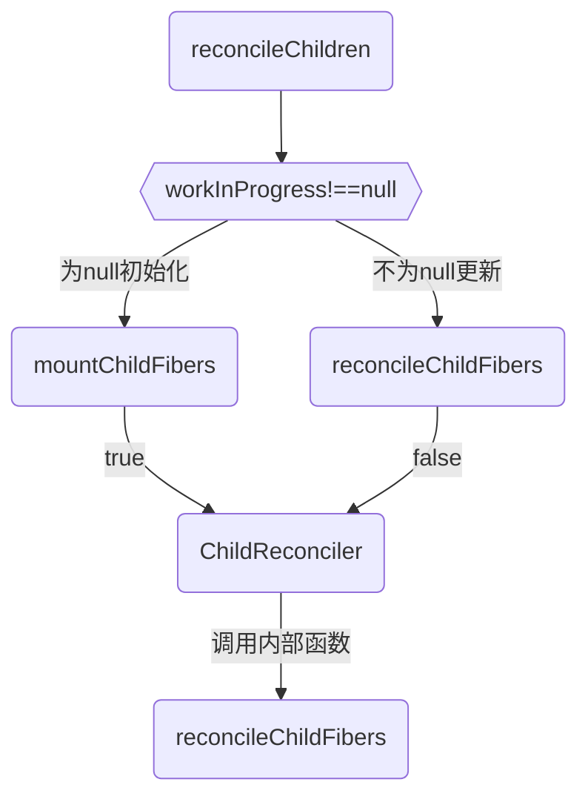

## React Diff算法
将Virtual DOM树转换成actual DOM树的最少操作的过程 称为 协调（Reconciliaton）。 

React Diff三大策略：
1.tree diff;
2.component diff;
3.element diff;
PS: 之前H5开发遇到的State 中变量更新但视图未更新的Bug就是element diff检测导致。解决方案：

1.两种业务场景下的DOM节点尽量避免雷同； 
2.两种业务场景下的DOM节点样式避免雷同；


当前存在一个DOM节点，触发了一次更新，那么在协调的过程中，会有四种节点和该节点相关联：
1. 该DOM节点本身
2. workInProgress fiber，更新过程中产生的workInProgress Tree中的fiber节点（即current fiber.alternate）
3. current fiber，在页面中已经渲染了的DOM节点对应的fiber节点（即workInProgress fiber.alternate，也就是上
   一次更新中产生的workInProgress fiber）
4. ReactElement，更新过程中，ClassComponent的render方法或FunctionComponent的调用结果。 ReactElement中包含描述DOM节点的信息。

```
一棵是在屏幕上显示的dom对应的fiber tree，称为current fiber tree

一棵是当触发新的更新任务时，React在内存中构建的fiber tree，称为workInProgress fiber tree

Diff算法为更新的过程中产生了新的ReactElement,
update的React element与current fiber tree中的节点进行比较，并最终在内存中生成workInProgress fiber tree

此时Renderer会依据workInProgress fiber tree将update渲染到页面上。

同时根节点的current属性会指向workInProgress fiber tree，

此时workInProgress fiber tree就变为current fiber tree。
```
### 1-1.effectTag
用于保存要执行DOM操作的具体类型的。 effectTag通过二进制表示：
```js
//...
// 意味着该Fiber节点对应的DOM节点需要插入到页面中。
export const Placement = /*                    */ 0b000000000000010;
//意味着该Fiber节点需要更新。
export const Update = /*                       */ 0b000000000000100;
export const PlacementAndUpdate = /*           */ 0b000000000000110;
//意味着该Fiber节点对应的DOM节点需要从页面中删除。
export const Deletion = /*                     */ 0b000000000001000;
//...
```

### 1-2.时间复杂度
```
生成将一棵树转换成另一棵树的最小操作次数。即使使用最优的算法，该算法的复杂程度仍为 O(n^3 )，其中 n 是树中元素的数量。
```

### 1-3.基于条件下的 O(n)
React 在以下三个假设的基础之上提出了一套 O(n) :
```
1.只对同级元素进行Diff；

2.两个不同类型的元素会产生出不同的树；

3.开发者可以通过设置 key 属性，来告知渲染哪些子元素在不同的渲染下可以保存不变；
```

## 二.Diff


### 2-1.Diff的入口函数为 reconcileChildren
内部会通过current === null 区分当前fiber节点是mount还是update:
mount-->mountChildFibers
update-->reconcileChildFibers
```js
/*
* shouldTrackSideEffects为true时会为生成的fiber节点收集effectTag属性，反之不会进行收集effectTag属性。
* */
export const reconcileChildFibers = ChildReconciler(true);
export const mountChildFibers = ChildReconciler(false);

function ChildReconciler(shouldTrackSideEffects) {
    //...

    function reconcileChildrenArray(
        returnFiber: Fiber,
        currentFirstChild: Fiber | null,
        newChildren: Array<*>,
        lanes: Lanes,
    ): Fiber | null {
        //...
    }

    function reconcileChildrenIterator(
        returnFiber: Fiber,
        currentFirstChild: Fiber | null,
        newChildrenIterable: Iterable<*>,
        lanes: Lanes,
    ): Fiber | null {
        //...
    }

    function reconcileSingleTextNode(
        returnFiber: Fiber,
        currentFirstChild: Fiber | null,
        textContent: string,
        lanes: Lanes,
    ): Fiber {
        //...
    }

    function reconcileSingleElement(
        returnFiber: Fiber,
        currentFirstChild: Fiber | null,
        element: ReactElement,
        lanes: Lanes,
    ): Fiber {
        //...
    }

    function reconcileSinglePortal(
        returnFiber: Fiber,
        currentFirstChild: Fiber | null,
        portal: ReactPortal,
        lanes: Lanes,
    ): Fiber {
        //...
    }

    // This API will tag the children with the side-effect of the reconciliation
    // itself. They will be added to the side-effect list as we pass through the
    // children and the parent.
    function reconcileChildFibers(
        returnFiber: Fiber,
        currentFirstChild: Fiber | null,
        newChild: any,
        lanes: Lanes,
    ): Fiber | null {
        //...
    }

    return reconcileChildFibers;
}
```
ChildReconciler内部定义了许多协调相关的函数，并将reconcileChildFibers作为函数的返回值。
### reconcileChildFibers 是React Diff真正的入口函数
reconcileChildFibers内部会根据newChild（即新生成的ReactElement）的类型和$$typeof属性调用不同的处理函数。
```js
// 根据newChild进入不同Diff函数处理
function reconcileChildFibers(
  returnFiber: Fiber,
  currentFirstChild: Fiber | null,
  newChild: any,
): Fiber | null {
  //...

  if (typeof newChild === 'object' && newChild !== null) {
    // object类型，可能是 REACT_ELEMENT_TYPE 或 REACT_PORTAL_TYPE
    switch (newChild.$$typeof) {
      case REACT_ELEMENT_TYPE:
        // 调用 reconcileSingleElement 处理
      // ...
    }
  }

  if (typeof newChild === 'string' || typeof newChild === 'number') {
    // 调用 reconcileSingleTextNode 处理
    // ...
  }

  if (isArray(newChild)) {
    // 调用 reconcileChildrenArray 处理
    // ...
  }

  if (getIteratorFn(newChild)) {
    // 调用 reconcileChildrenIterator处理
    // ... 
  }

  // ...

  // 如果以上分支都没有命中，则删除节点
  return deleteRemainingChildren(returnFiber, currentFirstChild);
}
```
据newChild中节点的数量把Diff分为两种类型：
```
1. 当newChild只有一个节点，也即newChild类型为object、number、string时，我们会进入单节点的Diff
2. 当newChild有多个节点，也即类型为Array时，进入多节点的Diff
```

## 三.单节点的Diff
根据newChild（即新生成的ReactElement）为单一节点，但此节点在current fiber tree中对应的层级具有多少个节点我们是不确定的，
因此我们可以根据此节点在current fiber tree中对应的层级的节点数量分为三种场景：
1. 对应层级存在单个旧节点
```
旧： A
新： A'
```
2. 对应层级存在多个旧节点
```
旧： A -> B -> C
新： A'
```
3. 对应层级无旧节点
```
旧： null
新： A'
```
场景1和场景2我们可以归为一类（即在当前层级中，current fiber在sibling方向的链表中至少存在一个节点），
场景3单独为一类（当前层级无current fiber节点）。

### 3-1.当前层级的current fiber在sibling方向的链表不为空
此时我们需要循环遍历当前层级在sibling方向的链表的所有current fiber节点，判断是否可以复用（key相同且type相同）.

当前层级的current fiber节点的stateNode（即复用fiber节点对应的DOM节点）,可以则以current fiber作为副本生成
workInProgress fiber。当前层级所有的current fiber节点都无法复用时，直接生成一个新的fiber节点作为workInProgress fiber。

### 3-2.当前层级的current fiber在sibling方向的链表为空
由于不存在对应的current fiber节点，所以直接生成一个新的fiber节点作为workInProgress fiber。

### 3-2.reconcileSingleElement的具体实现
```js
function reconcileSingleElement(
  returnFiber: Fiber,
  currentFirstChild: Fiber | null,
  element: ReactElement,
  lanes: Lanes,
): Fiber {
  const key = element.key;
  let child = currentFirstChild;
  
  //循环遍历当前这一层级的current fiber节点
  while (child !== null) {
    if (child.key === key) {
      //  key相同, 判断当前 current fiber.elementType 是否等于 ReactElement.type
      switch (child.tag) {
        //...
        default: {
          if (child.elementType === element.type) {
            //  type相同,表示可以复用当前fiber节点, 由于是单节点，所以如果当前节点存在兄弟节点, 需要给兄弟节点打上Deletion effectTag（删除兄弟节点）
            deleteRemainingChildren(returnFiber, child.sibling);
            // 构造workInProgress fiber节点,构造过程中会复用当前fiber节点的stateNode, 即复用DOM对象
            const existing = useFiber(child, element.props);
            existing.ref = coerceRef(returnFiber, child, element);
            existing.return = returnFiber;
            return existing;
          }
          break;
        }
      }
      // key相同但type不相同，则找到了当前节点在上次更新时对应的节点，但两个节点的type已经不一致，并且后续节点也没有可能进行复用，所以删除当前current fiber节点以及节点的剩余兄弟节点
      deleteRemainingChildren(returnFiber, child);
      break;
    } else {
      // key不一致则给当前current fiber节点打上Deletion effectTag，删除当前节点，并继续往下一个兄弟节点遍历，尝试匹配
      deleteChild(returnFiber, child);
    }
    child = child.sibling;
  }

  //DOM节点不可复用 新建fiber作为ReactElement对应的WorkInProgress Fiber
  const created = createFiberFromElement(element, returnFiber.mode, lanes);
  created.ref = coerceRef(returnFiber, currentFirstChild, element);
  created.return = returnFiber;
  return created;
}
```
注意，在为current fiber节点不匹配并打上Deletion effectTag时, 会同时将其添加到父节点的effectList中
(正常effectList的收集是在completeWork中进行的, 但是被删除的节点会脱离fiber树, 
无法进入completeWork的流程, 所以在beginWork阶段提前加入父节点的effectList)；

## 四.多节点的Diff
当newChild为多节点时，以下的几种场景中会触发多节点的Diff。
1. 节点更新
```
//节点属性发生变更；
//旧
<div key="a">a</div>
<div key="b">b</div>
<div key="c">c</div>

//新
<div key="a" className="a">a</div>
<div key="b">b</div>
<div key="c">c</div>

//节点的类型发生变更；
//旧
<div key="a">a</div>
<div key="b">b</div>
<div key="c">c</div>

//新
<span key="a">a</div>
<div key="b">b</div>
<div key="c">c</div>
```
2. 节点的数量发生改变；
```
//节点属性发生变更；
//旧
<div key="a">a</div>
<div key="b">b</div>
<div key="c">c</div>

//新
<div key="a" className="a">a</div>
<div key="b">b</div>
<div key="c">c</div>

//节点的类型发生变更；
//旧
<div key="a">a</div>
<div key="b">b</div>
<div key="c">c</div>

//新
<span key="a">a</div>
<div key="b">b</div>
<div key="c">c</div>
```
3. 节点的位置发生改变；
```
//旧
<div key="a">a</div>
<div key="b">b</div>
<div key="c">c</div>
<div key="e">e</div>

//新
<div key="a">a</div>
<div key="c">c</div>
<div key="b">b</div>
<div key="e">e</div>
```
在reconcileChildFibers的分析中可以看到，React使用两个函数reconcileChildrenArray(针对数组类型)和
reconcileChildrenIterator(针对可迭代类型)来进行多节点的diff，我们重点看看reconcileChildrenArray。
```js
/*
* 其中参数currentFirstChild指的是current fiber tree在该层级中的第一个fiber，通过 fiber.sibling
* 可以得到一条从左到右串联currentFirstChild在当前层级的所有fiber节点的链表，我们使用oldFiber来表示这条链表。
* 
* 参数newChildren是一个数组，包含了当前层级的所有ReactElement对象。
* */
function reconcileChildrenArray(
  returnFiber: Fiber,
  currentFirstChild: Fiber | null,
  newChildren: Array<*>,
  lanes: Lanes,
): Fiber | null {
  //...
}
```
reconcileChildrenArray会对比这两个序列之间的差异，并生成workInProgress fiber tree在当前层级的fiber节点链表，
并使用resultingFirstChild作为头节点。对比的过程会经历两轮的遍历。
### 4-1.第一轮遍历
1. 遍历比较newChildren与oldFiber，判断DOM节点是否可复用。
2. 如果可复用，则复用oldFiber生成newFiber并加入到以resultingFirstChild
   作为头节点的序列（后续我们使用newFiberList表示此序列）中，两个序列都跳到下一个节点。
3. 如果不可复用，分两种情况进行处理：
   - 若key不一致，则立即终止第一轮遍历。
   - 若key相同但type不同，则删除当前oldFiber节点，生成新的fiber节点加入到newFiberList中，两个序列都跳到下一个节点，继续遍历。
4. 当两个序列中的任意一个序列完成遍历（即newIdx >= newChildren.length - 1 || oldFiber.sibling === null），则结束第一轮遍历。

### 4-2.第二轮遍历
第一轮遍历后，会产生四种结果。
1. oldFiber与newChildren都完成遍历了
```
此时本轮diff已经完成了。这种情况是最理想的情况，只需要进行第一轮遍历中对应的更新操作。
```
2. oldFiber遍历完了，但newChildren还没遍历完。
3. newChildren遍历完了，但oldFiber还没遍历完
4. newChildren与oldFiber都没完成遍历

### 4-2-1.oldFiber遍历完了，但newChildren还没遍历完
假设newFiberList中所有节点都可以是可以直接复用的，那么当前场景和我们之前讨论过的新增节点的场景是一致的。
```
//新增节点
//旧
<div key="a">a</div>
<div key="b">b</div>
<div key="c">c</div>

//新
<div key="a">a</div>
<div key="b">b</div>
<div key="c">c</div>
<div key="d">d</div>
<div key="e">e</div>
```
这意味着未遍历完的newChildren节点都是新增的，我们需要遍历剩下的newChildren，生成对应的workInProgress fiber并标记上Placement。
```
此处只是假设第一轮遍历中所有加入到newFiberList的节点都是可以复用的，便于大家理解，但前面我们有分析过，在第一轮遍历中能够加入到
newFiberList的节点有两种：
1. 可以直接复用的节点；
2. key相同但type不同的节点；
```
### 4-2-2 newChildren遍历完了，但oldFiber还没遍历完
我们再次假设加入到newFiberList中所有节点都可以是可以直接复用的，这次就和我们之前讨论过的删除节点的场景是一致的了
```
//旧
<div key="a">a</div>
<div key="b">b</div>
<div key="c">c</div>

//新
<div key="a">a</div>
```
此时newChildren节点都已经找到了可复用的节点，我们需要遍历剩下的oldFiber，并标记上Deletion。

### 4-2-2 newChildren与oldFiber都没完成遍历
这意味着这次更新中有可能存在节点改变了位置。我们以前面提到的位置移动的例子来进行分析。
```
//旧
<div key="a">a</div>
<div key="b">b</div>
<div key="c">c</div>
<div key="e">e</div>

//新
<div key="a">a</div>
<div key="c">c</div>
<div key="b">b</div>
<div key="e">e</div>
```
经过第一轮遍历后，key值为a的节点复用oldFiber节点生成newFiber节点，并加入到了newFiberList中。在进行第二个节点的比较时，
新节点c和旧节点b的key值不一致，此时我们会终止第一轮遍历，进入第二轮遍历。
由于可能存在移动的节点，所以节点的索引值不能够找出两个对应的节点，我们需要一个找到新旧节点对的方法。这时，节点的key值就起作用了。
我们前面提到：
> 开发者可以通过设置 key 属性，来告知渲染哪些子元素在不同的渲染下可以保存不变；

React会将还未处理的oldFiber节点存入以节点key为key，oldFiber为value的Map中。
```
//existingChildren 是一个以节点key为key，oldFiber为value的Map
const existingChildren = mapRemainingChildren(returnFiber, oldFiber);
```
然后继续遍历newChildren序列，并通过newChildren节点的key来查询existingChildren中是否存在key相同的oldFiber节点。

接下来我们需要通过第二轮遍历去标记哪些节点可以复用，哪些节点需要移动。此时我们需要一个参照索引来判断节点是否需要移动。

我们以newFiberList中最靠右的节点对应的oldFiber在oldFiber链表中的位置索引oldIndex作为参照索引，并使用lastPlacedIndex表示参照索引。

上面分析的例子中，在结束第一轮遍历后，lastPlacedIndex就是newFiberList的最右一个节点a的oldIndex，也就是0。

### 然后开始第二轮的遍历
- newChildren节点c

newChildren节点c通过existingChildren查询到了oldFiber节点c，发现oldFiber节点c的索引oldIndex为 2 ，大于lastPlacedIndex=0。

由lastPlacedIndex的定义可知，若当前的oldIndex大于lastPlacedIndex，意味着oldFiber节点c的位置是在newFiberList的最右一个节点对应的
oldFiber节点的右边。同时，由于newChildren序列是按顺序遍历的，所以当前的newChildren生成的newFiber节点一定是在newFiberList的最右一个节点对应的newFiber节点的右边。因此，节点c更新前后的位置没有发生。

此时，因为节点c的oldIndex > lastPlacedIndex，所以我们把lastPlacedIndex的值更新为节点c的oldIndex=2。同时把节点c生成的newFiber加入到newFiberList中，继续遍历。

- newChildren节点b
  newChildren节点b通过existingChildren查询到了oldFiber节点b，发现oldFiber节点b的索引oldIndex为 1，小于lastPlacedIndex=2。oldFiber节点b的位置是在newFiberList的最右一个节点对应的oldFiber节点的左边。但newChildren节点b生成的newFiber节点一定是在newFiberList的最右一个节点对应的newFiber节点的右边的。因此，节点b更新前后的位置会发生变化。
  此时，因为节点b的oldIndex < lastPlacedIndex，所以lastPlacedIndex不变，并把节点b生成的newFiber标记Placement，表示该节点更新前后的位置会发生变化，最后把newFiber加入到newFiberList中，继续遍历。

- newChildren节点d
  newChildren节点d通过existingChildren查询到了oldFiber节点d，发现oldFiber节点d的索引oldIndex为 3 ，大于lastPlacedIndex=3。 处理逻辑与节点c一致，不再展开。

### diff完成，我们也得到了该层级中完整的newFiberList，作为workInProgress fiber tree在该层级的fiber节点。

## reconcileChildrenArray的具体实现
```js
  /* * returnFiber：当前层级的节点的父节点，即currentFirstChild的父级fiber节点
     * currentFirstChild：当前层级的第一个current fiber节点
     * newChildren：当前层级的ReactElement节点
     * lanes：优先级相关
  * */
  function reconcileChildrenArray(
    returnFiber: Fiber,
    currentFirstChild: Fiber | null,
    newChildren: Array<*>,
    lanes: Lanes,
  ): Fiber | null {
    //..

    // workInProgress fiber tree在此层级的第一个fiber节点，即该层级上在fiber.sibling方向的链表的头节点，在上面的分析中我们使用newFiberList来表示此序列
    let resultingFirstChild: Fiber | null = null;
    // previousNewFiber用来将后续的新生成的workInProgress fiber连接到newFiberList中
    let previousNewFiber: Fiber | null = null;

    // oldFiber节点，用于访问workInProgress fiber tree在此层级上在fiber.sibling方向的链表
    let oldFiber = currentFirstChild;
    // 用于存储newFiberList中最右边的节点在oldFiber链表中的index
    let lastPlacedIndex = 0;
    // 存储遍历到newChildren的索引
    let newIdx = 0;
    // 存储当前oldFiber的下一个节点
    let nextOldFiber = null;

    // 第一轮遍历
    for (; oldFiber !== null && newIdx < newChildren.length; newIdx++) {
      if (oldFiber.index > newIdx) {
        nextOldFiber = oldFiber;
        oldFiber = null;
      } else {
        nextOldFiber = oldFiber.sibling;
      }

       // 尝试生成新的节点，如果key不同, 返回null，key相同, 再比较type是否一致。type一致则执行useFiber(update逻辑)，type不一致则运行createXXX(insert逻辑)
      const newFiber = updateSlot(
        returnFiber,
        oldFiber,
        newChildren[newIdx],
        lanes,
      );
      if (newFiber === null) {
      // newFiber为 null说明节点不可复用，中断当前遍历
        if (oldFiber === null) {
          oldFiber = nextOldFiber;
        }
        break;
      }
      if (shouldTrackSideEffects) {
      // shouldTrackSideEffects 为true 代表当前为update阶段
        if (oldFiber && newFiber.alternate === null) {
          // 此时为key相同但type不同，newFiber.alternate为空，删除掉oldFiber
          deleteChild(returnFiber, oldFiber);
        }
      }
      
      //更新记录lastPlacedIndex
      lastPlacedIndex = placeChild(newFiber, lastPlacedIndex, newIdx);

      //将newFiber添加到newFiberList中
      if (previousNewFiber === null) {
        resultingFirstChild = newFiber;
      } else {
        previousNewFiber.sibling = newFiber;
      }
      previousNewFiber = newFiber;
      oldFiber = nextOldFiber;
    }

    if (newIdx === newChildren.length) {
      // newChildren遍历完了，删除oldFiber链中未遍历的节点
      deleteRemainingChildren(returnFiber, oldFiber);
     
      //...
      //结束此次diff
      return resultingFirstChild;
    }

    if (oldFiber === null) {
      // oldFiber遍历完了，新增newChildren未遍历的节点到newFiberList中
      for (; newIdx < newChildren.length; newIdx++) {
        const newFiber = createChild(returnFiber, newChildren[newIdx], lanes);
        if (newFiber === null) {
          continue;
        }
        lastPlacedIndex = placeChild(newFiber, lastPlacedIndex, newIdx);
        if (previousNewFiber === null) {
          resultingFirstChild = newFiber;
        } else {
          previousNewFiber.sibling = newFiber;
        }
        previousNewFiber = newFiber;
      }
      //...
      //结束本次diff
      return resultingFirstChild;
    }

    // newChildren和oldFiber都没有遍历完，将oldFiber剩余序列加入到一个map中，在第二次遍历的过程中能够通过key值找到对应的oldFiber
    const existingChildren = mapRemainingChildren(returnFiber, oldFiber);

    // 第二轮遍历
    for (; newIdx < newChildren.length; newIdx++) {
      const newFiber = updateFromMap(
        existingChildren,
        returnFiber,
        newIdx,
        newChildren[newIdx],
        lanes,
      );
      if (newFiber !== null) {
        if (shouldTrackSideEffects) {
          if (newFiber.alternate !== null) {
            // 如果newFiber是通过复用创建的, 则清理map中对应的老节点
            existingChildren.delete(
              newFiber.key === null ? newIdx : newFiber.key,
            );
          }
        }
        // 判断当前节点是否需要改变位置，并更新记录lastPlacedIndex
        lastPlacedIndex = placeChild(newFiber, lastPlacedIndex, newIdx);
        // 添加newFiber到newFiberList中
        if (previousNewFiber === null) {
          resultingFirstChild = newFiber;
        } else {
          previousNewFiber.sibling = newFiber;
        }
        previousNewFiber = newFiber;
      }
    }

    if (shouldTrackSideEffects) {
      //删除未遍历的oldFiber
      existingChildren.forEach(child => deleteChild(returnFiber, child));
    }

    
    //...

    //结束本次diff
    return resultingFirstChild;
  }

  //此函数用于记录节点在此次更新中是否需要移动，并返回新的lastPlacedIndex 
  function placeChild(
    newFiber: Fiber,
    lastPlacedIndex: number,
    newIndex: number,
  ): number {
    newFiber.index = newIndex;
    
    //...

    const current = newFiber.alternate;
    if (current !== null) {
      const oldIndex = current.index;
      if (oldIndex < lastPlacedIndex) {
        // 此节点需要移动
        newFiber.flags |= Placement;
        return lastPlacedIndex;
      } else {
        // 此节点不需要移动，返回oldIndex作为lastPlacedIndex的值
        return oldIndex;
      }
    } else {
      // 这是插入的逻辑
      newFiber.flags |= Placement;
      return lastPlacedIndex;
    }
  }
```
