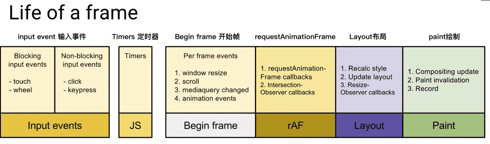
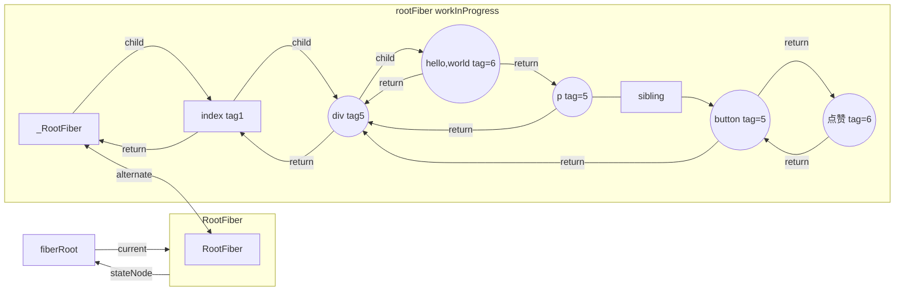
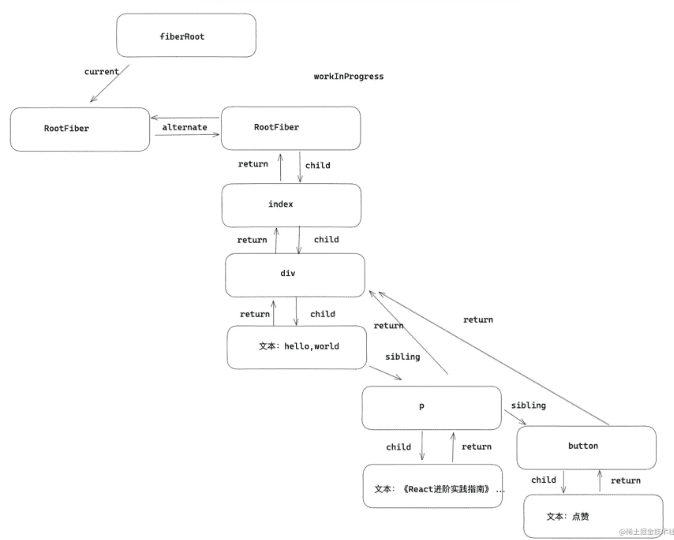

## 1. 渲染帧
在浏览器中，页面是一帧一帧绘制出来的，渲染的帧率与设备的刷新率保持一致。

一般情况下，设备的屏幕刷新率为 1s 60次，当每秒内绘制的帧数（FPS）超过60时，页面渲染是流畅的；而当 FPS 小于60时，会出现一定程度的卡顿现象。
> 为什么JS长时间执行会影响交互响应、动画？因为JavaScript在浏览器的主线程上运行，恰好与样式计算、布局以及许多情况下的绘制一起运行。如果JavaScript运行时间过长，就会阻塞这些其他工作，可能导致掉帧。

为了解决以上的痛点问题，React希望能够彻底解决主线程长时间占用问题，于是引入了 Fiber 来改变这种不可控的现状，把渲染/更新过程拆分为一个个小块的任务，通过合理的调度机制来调控时间，指定任务执行的时机，从而降低页面卡顿的概率，提升页面交互体验。通过Fiber架构，让reconcilation过程变得可被中断。适时地让出CPU执行权，可以让浏览器及时地响应用户的交互。


### 下面来看完整的一帧中，具体做了哪些事情


1. 首先需要处理输入事件，能够让用户得到最早的反馈

2. 接下来是处理定时器，需要检查定时器是否到时间，并执行对应的回调

3. 接下来处理 Begin Frame（开始帧），即每一帧的事件，包括 window.resize、scroll、media query change 等

4. 接下来执行请求动画帧 requestAnimationFrame（rAF），即在每次绘制之前，会执行 rAF 回调

5. 紧接着进行 Layout 操作，包括计算布局和更新布局，即这个元素的样式是怎样的，它应该在页面如何展示

6. 接着进行 Paint 操作，得到树中每个节点的尺寸与位置等信息，浏览器针对每个元素进行内容填充

到这时以上的六个阶段都已经完成了，接下来处于空闲阶段（Idle Peroid），可以在这时执行requestIdleCallback里注册的任务（它就是 React Fiber 任务调度实现的基础）

## 2. RequestIdleCallback
RequestIdleCallback 是 react Fiber 实现的基础 api 。该方法将在浏览器的空闲时段内调用的函数排队，使开发者在主事件循环上执行后台和低优先级的工作，而不影响延迟关键事件，如动画和输入响应。正常帧任务完成后没超过16ms，说明有多余的空闲时间，此时就会执行requestIdleCallback里注册的任务。

1. 低优先级任务由requestIdleCallback处理；
2. 高优先级任务，如动画相关的由requestAnimationFrame处理；
3. requestIdleCallback可以在多个空闲期调用空闲期回调，执行任务；

window.requestIdleCallback(callback)的callback中会接收到默认参数 deadline ，其中包含了以下两个属性：
```
timeRamining 返回当前帧还剩多少时间供用户使用
didTimeout 返回 callback 任务是否超时
```


```js
const sleep = (delay) => {
  const start = Date.now();
  while (Date.now() - start <= delay) {}
};
const taskQueue = [
  () => {
    console.log("task1 start");
    sleep(3);
    console.log("task1 end");
  },
  () => {
    console.log("task2 start");
    sleep(3);
    console.log("task2 end");
  },
  () => {
    console.log("task3 start");
    sleep(3);
    console.log("task3 end");
  },
];
const performUnitWork = () => {
  // 取出第一个队列中的第一个任务并执行
  taskQueue.shift()();
};
const workloop = (deadline) => {
  console.log(`此帧的剩余时间为: ${deadline.timeRemaining()}`);
  // 如果此帧剩余时间大于0或者已经到了定义的超时时间（上文定义了timeout时间为1000，到达时间时必须强制执行），且当时存在任务，则直接执行这个任务
  // 如果没有剩余时间，则应该放弃执行任务控制权，把执行权交还给浏览器
  while (
    (deadline.timeRemaining() > 0 || deadline.didTimeout) &&
    taskQueue.length > 0
  ) {
    performUnitWork();
  }
  // 如果还有未完成的任务，继续调用requestIdleCallback申请下一个时间片
  if (taskQueue.length > 0) {
    window.requestIdleCallback(workloop, { timeout: 1000 });
  }
};
requestIdleCallback(workloop, { timeout: 1000 });
/*
上面定义了一个任务队列taskQueue，并定义了workloop函数，其中采用window.requestIdleCallback(workloop, { timeout: 1000 })去执行taskQueue中的任务。每个任务中仅仅做了console.log、sleep(3)的工作，时间是非常短的（大约3ms多一点），浏览器计算此帧中还剩余15.5ms，足以一次执行完这三个任务，因此在此帧的空闲时间中，taskQueue中定义的三个任务均执行完毕。打印结果如下： 
此帧的剩余时间为: 49.8
task1 start
task1 end
task2 start
task2 end
task3 start
task3 end
*/
```

### requestIdleCallback 总结
应该避免在requestIdleCallback中执行过长时间的任务，否则可能会阻塞页面渲染，以及页面交互。

当然也不建议在requestIdleCallback 里再操作 DOM，这样会导致页面再次重绘。DOM 操作建议在 rAF 中进行。同时，操作 DOM 所需要的耗时是不确定的，因为会导致重新计算布局和视图的绘制，所以这类操作不具备可预测性。

Promise 也不建议在这里面进行，因为 Promise 的回调属性 Event loop 中优先级较高的一种微任务，会在 requestIdleCallback 结束时立即执行，不管此时是否还有富余的时间，这样有很大可能会让一帧超过 16 ms。

requestIdleCallback 的基本信息也介绍完了，后面开始重点讲讲react fiber是如何搭配requestIdleCallback构建出fiber tree的。


## fiber结构
是React的最小工作单元（fiber tree上的一个节点），在React的世界中，一切都可以是组件。

在普通的HTML页面上，人为地将多个DOM元素整合在一起可以组成一个组件，HTML标签可以是组件（HostComponent），普通的文本节点也可以是组件（HostText）。每一个组件就对应着一个fiber节点，许多个fiber节点互相嵌套、关联，就组成了fiber树

一个DOM节点一定对应着一个Fiber节点，但一个Fiber节点却不一定有对应的DOM节点。
```
    Fiber树                    DOM树

   div#root                  div#root
      |                         |
    <App/>                     div
      |                       /   \
     div                     p     a
    /   ↖
   /      ↖
  p ----> <Child/>
             |
             a
```

结构：
- return： 指向父级 Fiber 节点。
- child：指向子 Fiber 节点。
- sibling：指向兄弟 fiber 节点。


```js
export default class Index extends React.Component{
   state={ number:666 } 
   handleClick=()=>{
     this.setState({
         number:this.state.number + 1
     })
   }
   render(){
     return <div>
       hello，world
       <p > 《React进阶实践指南》 { this.state.number }   </p>
       <button onClick={ this.handleClick } >点赞</button>
     </div>
   }
}
```




在更新的时候可能会更新大量的dom，所以react在应用层和dom层之间增加了一层Fiber，而Fiber是在内存中工作的，所以在更新的时候只需要在内存中进行dom更新的比较，最后再应用到需要更新真实节点上

在react15之前，这个对比的过程被称之为stack reconcile，它的对比方式是‘一条路走到黑’，也就是说这个对比的过程是不能被中断的，这会出现什么情况呢，比如在页面渲染一个比较消耗性能操作，如果这个时候如果用户进行一些操作就会出现卡顿，应用就会显得不流畅。

react16之后出现了scheduler，以及react17的Lane模型，它们可以配合着工作，将比较耗时的任务按照Fiber节点划分成工作单元，并且遍历Fiber树计算或者更新节点上的状态可以被中断、继续，以及可以被高优先级的任务打断，比如用户触发的更新就是一个高优先级的任务，高优先级的任务优先执行，应用就不会太卡顿。

把任务拆分成一个个细小的工作单元，随着任务调度抽空执行，直到整颗树构建完成。所以react fiber所谓的性能提升只是将reconciliation中diff过程的优先级往后调了，只在浏览器空闲时执行，从而提升了用户交互、动画渲染相关的优先级，使浏览器能够更快反馈用户操作，使页面减少卡顿感，但并不会减少react渲染所需的工作量，因此想要真正提升应用性能还是得靠写好代码，减少不必要的渲染才行。

### react fiber的任务
- 把渲染/更新过程拆分为更小的、可中断的工作单元
- 在浏览器空闲时执行工作循环
- 将所有执行结果汇总patch到真实DOM上

## 基础2:fiberRoot和rootFiber
在第一次渲染时：会创建fiberRoot和rootFiber，然后根据jsx对象创建Fiber节点，节点连接成current Fiber树

* fiberRoot(fiberRoot只能有一个)： 首次构建应用， 创建一个 fiberRoot ，整个应用的根节点。

* rootFiber(rootFiber可以有多个): 通过 ReactDOM.render 渲染出来的。
```
比如一个组件会渲染一个rootFiber。 
```

## 1.注意FiberRootNode 和 FiberNode 的不同
FiberRootNode是初始化 只调用一次,一个是fiber 协调
```js
  function FiberRootNode(containerInfo, tag, hydrate) {
    console.log('==FiberRootNode 是初始化相关只调用一次===')
    this.tag = tag;
    this.containerInfo = containerInfo;
    this.pendingChildren = null;
    this.current = null;
    this.pingCache = null;
    this.finishedWork = null;
    this.timeoutHandle = noTimeout;
    this.context = null;
    this.pendingContext = null;
    this.hydrate = hydrate;
    this.callbackNode = null;
    this.callbackPriority = NoLanePriority;
    this.eventTimes = createLaneMap(NoLanes);
    this.expirationTimes = createLaneMap(NoTimestamp);
    this.pendingLanes = NoLanes;
    this.suspendedLanes = NoLanes;
    this.pingedLanes = NoLanes;
    this.expiredLanes = NoLanes;
    this.mutableReadLanes = NoLanes;
    this.finishedLanes = NoLanes;
    this.entangledLanes = NoLanes;
    this.entanglements = createLaneMap(NoLanes);
    ...
```

## FiberNode
```js
function FiberNode(
  tag: WorkTag,
  pendingProps: mixed,
  key: null | string,
  mode: TypeOfMode,
) {

  // 用来表示当前Fiber对应的是那种类型的组件，如ClassComponent、FunctionComponent等
  this.tag = tag;
  // 通过不同过期时间，判断任务是否过期,以前版本用：expirationTime
  this.lanes = NoLanes;
  // 组件的key,调和子节点时候用到
  this.key = key; // fiber的key
  // 组件对应的ReactElement里的type，比如class组件对应那个class
  this.elementType = null;
  // 一般都等于elementType，但是通过lazy加载的组件，一开始会为null，直到加载完成才会设置为正确的type
  // fiber对应的DOM元素的标签类型，div、p...
  this.type = null; 

  //真实dom节点,管理 instance 自身的特性
  // 对应的实例，比如class组件对应class实例，原生的组件对应dom
  this.stateNode = null; // fiber的实例，类组件场景下，是组件的类，HostComponent场景，是dom元素

  // Fiber 链表相关
  this.return = null; // 指向父级fiber
  this.child = null; // 指向子fiber
  this.sibling = null; // 同级兄弟fiber
  this.index = 0;

  this.ref = null; // ref相关

  // Fiber更新相关
  /*用作为工作单元 来计算state*/

  // 等待被更新的属性
  // 当前处理过程中的组件props对象
  this.pendingProps = pendingProps;
  // 上一次渲染完成之后的props
  this.memoizedProps = null;
  // 等待更新的任务队列
  this.updateQueue = null; // 存储update的链表
  // 上一次渲染完成的state
  this.memoizedState = null; // 类组件存储fiber的状态，函数组件存储hooks链表
  this.dependencies = null;
  // 当前组件的mode，默认继承夫节点。比如是否处于异步渲染等
  this.mode = mode;

  // Effects
  /*
 effectTag、nextEffect、firstEffect、lastEffect为effect相关信息，保存当前diff的成果。这些参数共同为后续的工作循环提供了可能，使react可以在执行完每个fiber时停下，根据浏览器的繁忙情况判断是否继续往下执行，因此我们也可以将fiber理解成一个工作单元。 
  */
  // flags原为effectTag，表示当前这个fiber节点变化的类型：增、删、改
  // 用来记录本次更新在当前组件产生的副作用，比如新增、修改、删除等
  this.flags = NoFlags;

  /*单链表结构，方便遍历 Fiber Tree 上有副作用的节点*/ 
  // 用链表记录产生的副作用
  this.nextEffect = null;
  // 副作用链表中的第一个
  this.firstEffect = null;
  // 最后一个
  this.lastEffect = null;


  // 调度优先级相关
  // 该fiber中的优先级，它可以判断当前节点是否需要更新
  this.lanes = NoLanes; 
  this.childLanes = NoLanes;// 子树中的优先级，它可以判断当前节点的子树是否需要更新

  /*
  * 可以看成是workInProgress（或current）树中的和它一样的节点，
  * 可以通过这个字段是否为null判断当前这个fiber处在更新还是创建过程
  * */
  // 双缓存树，指向缓存的fiber。更新阶段，两颗树互相交替。
  // 指向当前fiber对应的一个拷贝,fiber的版本池，即记录fiber更新过程，便于恢复
  this.alternate = null;
}
```

