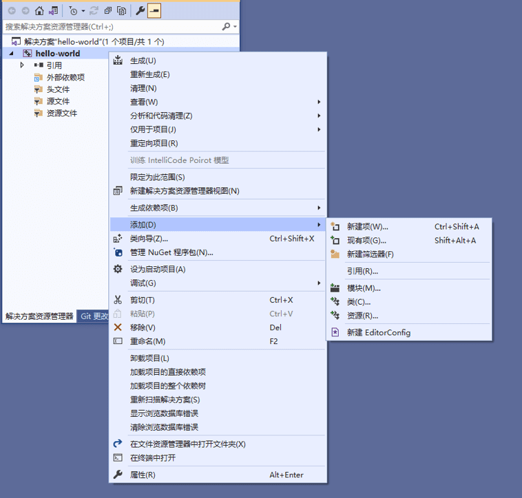
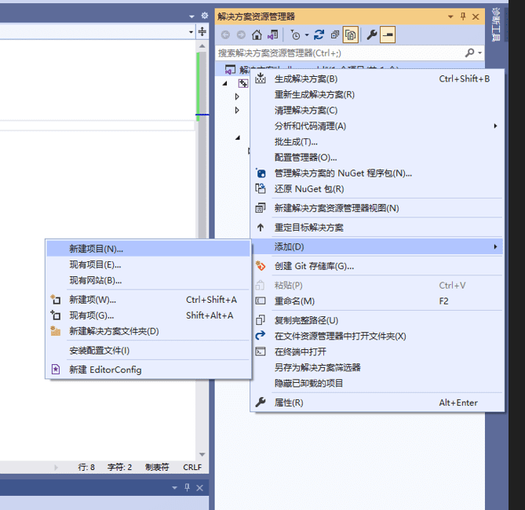

## visual studio入门
什么叫项目？
项目也叫工程，是将解决方案分成若干个模块进行处理，一般叫做Project。

什么的解决方案？
解决方案，是对所有要完成工作的统称，一般叫Solution。添加项目就是添加工程。解决方案是所有项目的总和。

1. 右键选中我们的项目
2. 点击添加→新建项



3. 选择C++文件(.cpp)
4. 项添加完成，这下终于可以开始写代码
```c++
#include<iostream>
using namespace std;
int main()
{
	cout << "Hello World" << endl;
	system("pause");
	return 0;
}
```
5. 运行代码。我们可以点击本地Windows调试器，也可以直接按F5运行。

## 多个项目
注意:一个解决方案可以有多个项目，我们就创建另外的项目！



有多个项目我们应该如何运行该项目呢？
答：右键点击你要运行的项目，选择设为启动项目即可！

如何知道我运行的是哪个项目呢？
答：看哪个项目的名字被加粗了，就运行的是哪个项目！

## 配置vim
1. 查看vimrcPaths所在位vimrcpaths="C:\Users\chenh
```shell
:set

# C:\Program Files (x86)\Microsoft Visual Studio\2019\Community\Common7\IDE\CommonExtensions\Microsoft\CMake\CMake\share\vim
```
2. 在vimrcPaths文件夹建立一个名为 _vsvimrc（或 _vimrc )的文件

3. 工具->选项,直接进入keyboard，打钩，handled all with vsvim,但是不这样做
```
这里把C+h,C+g,配置给vim
```

## 自带快捷键
C + / 替换
