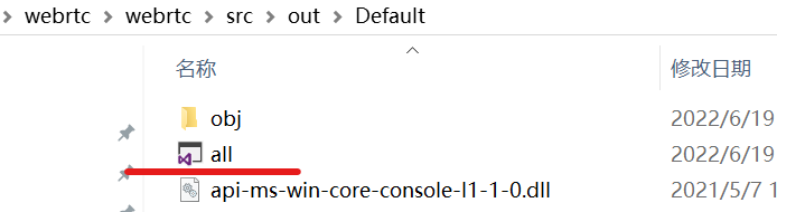
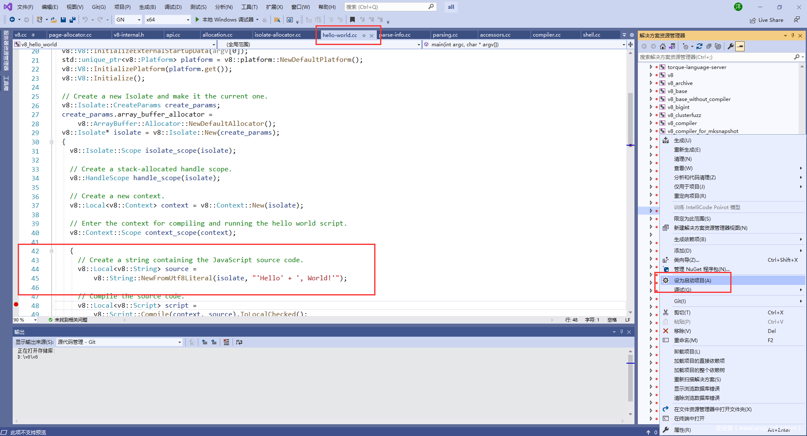
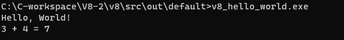
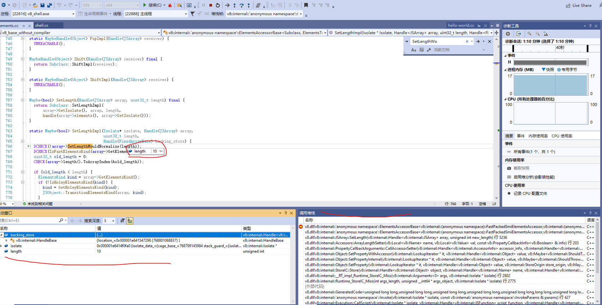

## 系统环境要求
操作系统 win 10 64bit,VS2019社区版
windows 10 SDK

系统环境变量
```
DEPOT_TOOLS_WIN_TOOLCHAIN = 0
```

## python
C:\Users\chenh\AppData\Local\Programs\Python\Python311

## git
```shell
# 禁用自动转换
git config --global core.autocrlf false

git config --global core.filemode false

# 非必须，在 config 中设置 rebase 选项，使得 git pull 使用 rebase 整合所做修改
# https://www.jianshu.com/p/280a04fc2e2b
git config --global pull.rebase true
git config --global branch.autosetuprebase always
```

Git对文件的访问权限的管理与配置选项core.filemode有关。core.filemode选项默认true，即区分文件的执行权限，校验Git的Index中和工作目录中的文件权限。
1. 查看filemode选项
git config --get core.filemode
或
git config core.filemode


## 执行
第二个报错无关
```shell
>gclient sync
Updating depot_tools...
C:\zip-app\depot_tools\.versions\.cipd_client.exe.cipd_version
C:\zip-app\depot_tools\.versions\.cipd_client.exe.cipd_version
Syncing projects: 100% (29/29), done.

________ running 'cipd ensure -log-level error -root C:\C-workspace\V8-2 -ensure-file C:\Users\chenh\AppData\Local\Temp\tmpzkxe1n2g.ensure' in '.'
C:\zip-app\depot_tools\.versions\.cipd_client.exe.cipd_version
Running hooks: 100% (32/32), done.
```


## 报错
Windows Software Development Kit
```shell
Exception: Path "C:\Program Files (x86)\Windows Kits\10\include\10.0.20348.0\shared" from environment variable "include" does not exist. Make sure the necessary SDK is installed.
```
解决方法就是在Visual Studio Installer-单个组件-中安装10.0.20348.0版本的SDK,注意： 10.0.20348.0版本的SDK安装成功后别忘了安装SDK调试工具

工程生成成功
```shell
E:\webrtc\webrtc\src>gn gen --ide=vs2019 out/Default
Generating Visual Studio projects took 1226ms
Done. Made 1520 targets from 282 files in 9194ms
```
打开out/Default目录就能看见vs工程文件了！


在此之后，就可在Visual Studio中对webrtc进行调试了


## 编译代码,两种方式：

### 方式1：命令方式
https://v8.dev/docs/embed

* gn args out.gn/x64.release.sample（会弹出一个文件需要你编辑，编辑完后关闭就会根据你填写的参数生成一些配置文件）

* ninja -C out.gn/x64.release.sample v8_monolith，再通过命令就可以生成静态库了，大概需要编译十几分钟

### 方式2：vs工程方式

##### 生成GN工程文件
```shell
cd ~\v8\src # 进入v8 src目录
gn gen --ide=vs out\default --args="is_component_build = true is_debug = true v8_optimized_debug = false"
```

```shell
C:\C-workspace\V8-2\v8\src>gn gen --ide=vs out\default --args="is_component_build = true is_debug = true v8_optimized_debug = false"
Generating Visual Studio projects took 148ms
Done. Made 187 targets from 100 files in 4770ms
```

gn命令不是本文重点，可自行查阅，参数：is_debug = true 让v8可以被调试，v8_optimized_debug = false 去掉对调试v8有干扰的代码优化，这不会影响v8的正确性，只可能对性能有点影响,下文是我的编译配置文件args.gn。
```
is_component_build = true  
is_debug = true  
v8_optimized_debug = false  
v8_use_snapshot = false
```

或则：
1. 通过命令生成vs工程all.sln
```shell
gn gen --ide=vs out.gn\x64_solution
```


2. 打开工程然后编译你需要的项目
```shell
vs工程方式的话，直接编译v8_hello_world这个项目，然后会在out.gn\x64_solution这个目录下生成
v8_hello_world.exe
```

#### build gn_all
编译之，最后即可调试out\Default\d8.exe。

### 例子1:hellow world
V8代码量大、结构复杂、类引用的层级关系多，要有一个合理的入口才好，v8的源码都在src目录下，如下图。

除了src目录，我们看到还有一个samples目录，它就是我们开始学习的地方，图1中打开的文件(hello-world.cc)正是在这个目录下，这个hello world程序是用C++编写的，包括了启动V8，然后运行一个javascript语言的hello world，还有一个加法运算。准确地说，V8是一个javascript虚拟机，这个hello word.cc中仅有”hello world”和加法算法是一个真正的javascript程序，其它的代码都是为了运行javascript程序而做的准备工作(启动V8虚拟机)，包括了V8的创建、Isolate创建、handle创建，编译，输出hello world，再结束V8的全过程。这里只包括了V8最简单最必要的功能集，所以，从跟踪hello-world.cc入手学习V8是最简单的。


在src\out\default下，能看到all.sln，双击打开,如图-1。
能看到v8_hello_world这个方案，鼠标右击“设为启动项目”，再次鼠标右击“生成”，这样就开始编译了，在图1下方的输出窗口，能看到编译过程。编译时间长短要看机器性能：CPU和内存频率、硬盘读写速度。


```js
1>[1966/1967] LINK(DLL) v8.dll v8.dll.lib v8.dll.pdb
1>[1967/1967] LINK v8_hello_world.exe v8_hello_world.exe.pdb
========== 生成: 成功 1 个，失败 0 个，最新 0 个，跳过 0 个 ==========
```



```c++
      // Create a string containing the JavaScript source code.
      v8::Local<v8::String> source =
          v8::String::NewFromUtf8Literal(isolate, "'Hello' + ', World!'");
```

```C++
#include <stdio.h>
#include <stdlib.h>
#include <string.h>

#include "include/libplatform/libplatform.h"
#include "include/v8-context.h"
#include "include/v8-initialization.h"
#include "include/v8-isolate.h"
#include "include/v8-local-handle.h"
#include "include/v8-primitive.h"
#include "include/v8-script.h"

int main(int argc, char* argv[]) {
  // Initialize V8.
  v8::V8::InitializeICUDefaultLocation(argv[0]);
  v8::V8::InitializeExternalStartupData(argv[0]);
  std::unique_ptr<v8::Platform> platform = v8::platform::NewDefaultPlatform();
  v8::V8::InitializePlatform(platform.get());
  v8::V8::Initialize();

  // Create a new Isolate and make it the current one.
  v8::Isolate::CreateParams create_params;
  create_params.array_buffer_allocator =
      v8::ArrayBuffer::Allocator::NewDefaultAllocator();
  v8::Isolate* isolate = v8::Isolate::New(create_params);
  {
    v8::Isolate::Scope isolate_scope(isolate);

    // Create a stack-allocated handle scope.
    v8::HandleScope handle_scope(isolate);

    // Create a new context.
    v8::Local<v8::Context> context = v8::Context::New(isolate);

    // Enter the context for compiling and running the hello world script.
    v8::Context::Scope context_scope(context);

    {
      // Create a string containing the JavaScript source code.
      v8::Local<v8::String> source =
          v8::String::NewFromUtf8Literal(isolate, "'Hello' + ', World!'");

      // Compile the source code.
      v8::Local<v8::Script> script =
          v8::Script::Compile(context, source).ToLocalChecked();

      // Run the script to get the result.
      v8::Local<v8::Value> result = script->Run(context).ToLocalChecked();

      // Convert the result to an UTF8 string and print it.
      v8::String::Utf8Value utf8(isolate, result);
      printf("%s\n", *utf8);
    }

    {
      // Use the JavaScript API to generate a WebAssembly module.
      //
      // |bytes| contains the binary format for the following module:
      //
      //     (func (export "add") (param i32 i32) (result i32)
      //       get_local 0
      //       get_local 1
      //       i32.add)
      //
      const char csource[] = R"(
        let bytes = new Uint8Array([
          0x00, 0x61, 0x73, 0x6d, 0x01, 0x00, 0x00, 0x00, 0x01, 0x07, 0x01,
          0x60, 0x02, 0x7f, 0x7f, 0x01, 0x7f, 0x03, 0x02, 0x01, 0x00, 0x07,
          0x07, 0x01, 0x03, 0x61, 0x64, 0x64, 0x00, 0x00, 0x0a, 0x09, 0x01,
          0x07, 0x00, 0x20, 0x00, 0x20, 0x01, 0x6a, 0x0b
        ]);
        let module = new WebAssembly.Module(bytes);
        let instance = new WebAssembly.Instance(module);
        instance.exports.add(3, 4);
      )";

      // Create a string containing the JavaScript source code.
      v8::Local<v8::String> source =
          v8::String::NewFromUtf8Literal(isolate, csource);

      // Compile the source code.
      v8::Local<v8::Script> script =
          v8::Script::Compile(context, source).ToLocalChecked();

      // Run the script to get the result.
      v8::Local<v8::Value> result = script->Run(context).ToLocalChecked();

      // Convert the result to a uint32 and print it.
      uint32_t number = result->Uint32Value(context).ToChecked();
      printf("3 + 4 = %u\n", number);
    }
  }

  // Dispose the isolate and tear down V8.
  isolate->Dispose();
  v8::V8::Dispose();
  v8::V8::DisposePlatform();
  delete create_params.array_buffer_allocator;
  return 0;
}
```

### 例子2:调试shell.cc
它的位置在samples\下,只是因为shell的交互性更强，让你看到”动起来”的效果更明显,这个工程设置为启动项，然后生成;
这时，我们在elements.cc中下断点，如下图。

在这样图中，能看到断点，还有调用堆栈，从中能看到函数的调用过程，在shell窗口中执行如下指令。
```js
a=[1,2,3,4]
a.length = 10 // 特意改变数组长度，为了能触发断点
```

```C++
static Maybe<bool> SetLengthImpl(Isolate* isolate, Handle<JSArray> array,
                                  uint32_t length,
                                  Handle<FixedArrayBase> backing_store) {
  DCHECK(!array->SetLengthWouldNormalize(length));
  DCHECK(IsFastElementsKind(array->GetElementsKind()));
  uint32_t old_length = 0;
  CHECK(array->length().ToArrayIndex(&old_length));

  if (old_length < length) {
    ElementsKind kind = array->GetElementsKind();
    if (!IsHoleyElementsKind(kind)) {
      kind = GetHoleyElementsKind(kind);
      JSObject::TransitionElementsKind(array, kind);
    }
  }
  // 省略
}
```


```js
[1,2,3,4].join("-")
// 1-2-3-4
'1-2-3-4'.split('-')

[1,2,3,4].map((value, key, arr) => {console.log(value);return value * value;})
// 1,4,9,16
```
