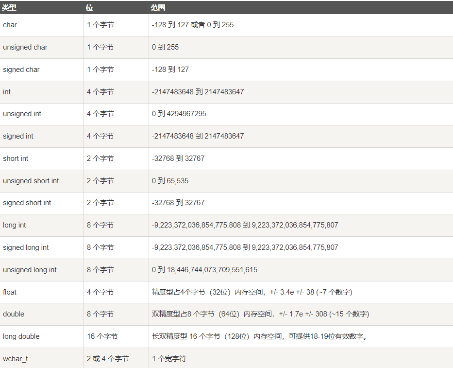

## 前言
C++ 是静态类型的、编译式的

注意：使用静态类型的编程语言是在编译时执行类型检查，而不是在运行时执行类型检查。

## 分号
C++ 不以行末作为结束符的标识;每个语句必须以分号结束。它表明一个逻辑实体的结束。


## 数据类型
操作系统会根据变量的数据类型，来分配内存和决定在保留内存中存储什么。

七种基本的 C++ 数据类型：
* 布尔型	bool  存储值 true 或 false。
* 字符型	char
* 整型	int     对机器而言，整数的最自然的大小
* 浮点型	float   单精度浮点值。单精度是这样的格式，1位符号，8位指数，23位小数
* 双浮点型	double  双精度浮点值。双精度是1位符号，11位指数，52位小数。
* 无类型	void      表示类型的缺失。
* 宽字符型	wchar_t   宽字符类型。

一些基本类型可以使用一个或多个类型修饰符进行修饰：
* signed
* unsigned
* short
* long

注意：默认情况下，int、short、long都是带符号的，即 signed。
C++ 允许使用速记符号来声明无符号短整数或无符号长整数。您可以不写 int，只写单词 unsigned、short 或 long，int 是隐含的。例如，下面的两个语句都声明了无符号整型变量。
```c++
unsigned x;
unsigned int y;
```

* signed、unsigned、long 和 short 可应用于整型
* signed 和 unsigned 可应用于字符型
* long 可应用于双精度型。
* 修饰符 signed 和 unsigned 也可以作为 long 或 short 修饰符的前缀。例如：unsigned long int。

这个程序演示了有符号整数和无符号整数之间的差别
```c++
#include <iostream>
using namespace std;
int main()
{
   short int i;           // 有符号短整数
   short unsigned int j;  // 无符号短整数
 
   j = 50000;
 
   i = j;
   cout << i << " " << j;
 
   return 0;
}
// 输出：-15536 50000
```


下表显示了各种变量类型在内存中存储值时需要占用的内存，以及该类型的变量所能存储的最大值和最小值。


### 类型限定符提供了变量的额外信息。
* const	const 类型的对象在程序执行期间不能被修改改变。
* volatile	修饰符 volatile 告诉编译器不需要优化volatile声明的变量，让程序可以直接从内存中读取变量。对于一般的变量编译器会对变量进行优化，将内存中的变量值放在寄存器中以加快读写效率。
* restrict	由 restrict 修饰的指针是唯一一种访问它所指向的对象的方式。只有 C99 增加了新的类型限定符 restrict。

## 枚举类型
枚举类型(enumeration)是C++中的一种派生数据类型，它是由用户定义的若干枚举常量的集合。
```c++
enum season { spring, summer, autumn, winter };
```

默认情况下spring为0，summer为1，依此类推。您可以在声明期间更改枚举元素的默认值（如有必要的话）。
```c++
enum season 
{   spring = 0, 
    summer = 4, 
    autumn = 8,
    winter = 12
};
```

## C++ 变量类型
变量是程序可操作的存储区的名称。C++ 中每个变量都有指定的类型，类型决定了变量存储的大小和布局，该范围内的值都可以存储在内存中

变量的名称可以由字母、数字和下划线字符组成。它必须以字母或下划线开头。

除上面7中基本数据类型变量，C++ 也允许定义各种其他类型的变量，
枚举、指针、数组、引用、数据结构、类等等，这将会在后续的章节中进行讲解。

正确地初始化变量是一个良好的编程习惯，否则有时候程序可能会产生意想不到的结果。
```
int	0
char	'\0'
float	0
double	0
pointer	NULL
```

## 变量作用域
作用域是程序的一个区域，一般来说有三个地方可以定义变量：
* 在函数或一个代码块内部声明的变量，称为局部变量。
* 在函数参数的定义中声明的变量，称为形式参数。
* 在所有函数外部声明的变量，称为全局变量。
```c++
#include <iostream>
using namespace std;
 
// 全局变量声明
int g = 20;
 
int main ()
{
  // 局部变量声明
  int g = 10;
 
  cout << g;
 
  return 0;
}
```

## 常量
常量可以是任何的基本数据类型，可分为整型数字、浮点数字、字符、字符串和布尔值。

在 C++ 中，有两种简单的定义常量的方式：
* 使用 #define 预处理器。
```
#define identifier value
```
```c++
#include <iostream>
using namespace std;
 
#define LENGTH 10   
#define WIDTH  5
#define NEWLINE '\n'
 
int main()
{
 
   int area;  
   
   area = LENGTH * WIDTH;
   cout << area;
   cout << NEWLINE;
   return 0;
}
```
* 使用 const 关键字。
```
const type variable = value;
```

```c++
#include <iostream>
using namespace std;
 
int main()
{
   const int  LENGTH = 10;
   const int  WIDTH  = 5;
   const char NEWLINE = '\n';
   int area;  
   
   area = LENGTH * WIDTH;
   cout << area;
   cout << NEWLINE;
   return 0;
}
```

### 整数常量
```
85         // 十进制
0213       // 八进制 
0x4b       // 十六进制 
30         // 整数 
30u        // 无符号整数 
30l        // 长整数 
30ul       // 无符号长整数
```
### 浮点常量
浮点常量由整数部分、小数点、小数部分和指数部分组成。您可以使用小数形式或者指数形式来表示浮点常量。
```
3.14159       // 合法的 
314159E-5L    // 合法的 
510E          // 非法的：不完整的指数
210f          // 非法的：没有小数或指数
.e55          // 非法的：缺少整数或分数
```

### 布尔常量
我们不应把 true 的值看成 1，把 false 的值看成 0。

### 字符常量
字符常量是括在单引号中。如果常量以 L（仅当大写时）开头，则表示它是一个宽字符常量（例如 L'x'），此时它必须存储在 wchar_t 类型的变量中。否则，它就是一个窄字符常量（例如 'x'），此时它可以存储在 char 类型的简单变量中。

### 字符串常量
字符串字面值或常量是括在双引号 "" 中的。一个字符串包含类似于字符常量的字符：普通的字符、转义序列和通用的字符。

您可以使用 \ 做分隔符，把一个很长的字符串常量进行分行。
```c++
#include <iostream>
#include <string>
using namespace std;

int main() {
    string greeting = "hello, runoob";
    cout << greeting;
    cout << "\n";     // 换行符
    string greeting2 = "hello, \
                       runoob";
    cout << greeting2;
    return 0;
}
```


