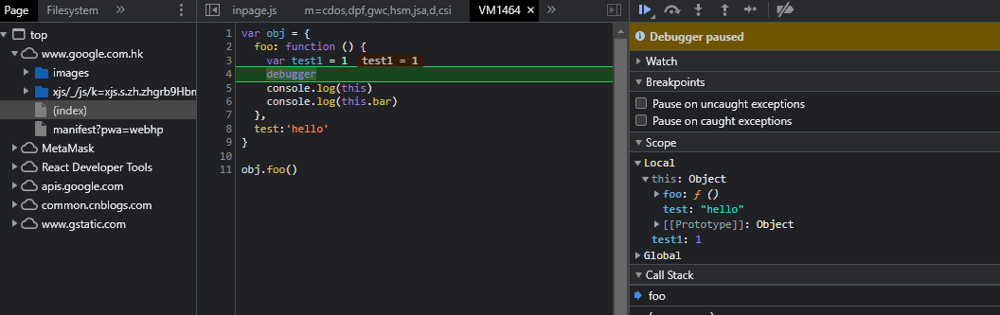
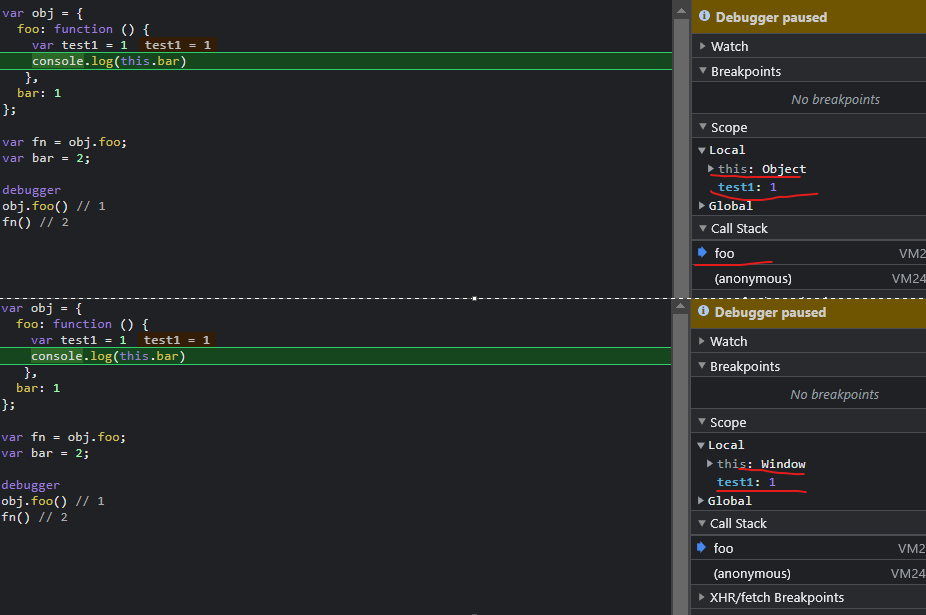
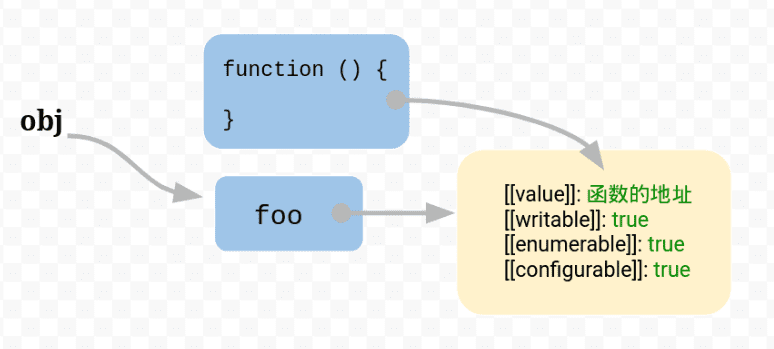

## this-->执行上下文所属的作用域
JavaScript中this 指的是执行上下文所属的作用域。所以函数中的this是在运行时决定的而不是定义时。注意不是上下文，因为上下文还包括其他的

参考：[执行上下文-函数调用栈-this](../解析-解释-编译-事件循环-promise-安全/步骤3-执行上下文-函数调用栈-this)

```js
var a1 = 1
var fn = function () {
  let b1 = 1
  debugger
  var b2 = 1
  console.log(a1); // 1
  console.log(this.a1); // 1
  console.log(this); // window
};
fn()

var obj = {
  foo: function () { 
    var test1 = 1
    debugger
    console.log(this) 
    console.log(this.bar) 
  },
  test:'hello'
}

obj.foo()
```
实例代码中，函数体里面使用了变量a1。该变量由运行环境提供。

现在问题就来了，由于函数可以在不同的运行环境执行，所以需要有一种机制，能够在函数体内部获得当前的运行环境（context）。所以，this就出现了，它的设计目的就是在函数体内部，指代函数所属的作用域。



## this设计和数据结构的关系
因为function可以赋值给不同的变量，可以看到this表示运行环境，但不是执行上下文,因为this不包括test1
```js
var obj = {
  foo: function () { 
    var test1 = 1
    console.log(this.bar) 
  },
  bar: 1
};

var fn = obj.foo;
var bar = 2;

debugger
obj.foo() // 1
fn() // 2
```


* 对于obj.foo()来说，foo运行在obj环境，所以this指向obj；
* 对于foo()来说，foo运行在全局环境，所以this指向全局环境。所以，两者的运行结果不一样。

这种解释没错，但是教科书往往不告诉你，为什么会这样？也就是说，函数的运行环境到底是怎么决定的？举例来说，为什么obj.foo()就是在obj环境执行，而一旦var foo = obj.foo，foo()就变成在全局环境执行？

### JavaScript 语言之所以有this的设计，跟内存里面的数据结构有关系。
```js
var obj = { foo:  5 };
```
JavaScript 引擎会先在内存里面，生成一个对象{ foo: 5 }，然后把这个对象的内存地址赋值给变量obj。

也就是说，变量obj是一个地址（reference）。后面如果要读取obj.foo，引擎先从obj拿到内存地址，然后再从该地址读出原始的对象，返回它的foo属性。

原始的对象以字典结构保存，每一个属性名都对应一个属性描述对象。举例来说，上面例子的foo属性，实际上是以下面的形式保存的。

注意，foo属性的值保存在属性描述对象的value属性里面。
```js
{
  foo: {
    [[value]]: 5
    [[writable]]: true
    [[enumerable]]: true
    [[configurable]]: true
  }
}
```

### 问题在于属性的值可能是一个函数
```js
var obj = { foo: function () {} };
```
这时，引擎会将函数单独保存在内存中，然后再将函数的地址赋值给foo属性的value属性。

再例如：
```js
var f = function () {};
var obj = { f: f };

// 单独执行
f()

// obj 环境执行
obj.f()
```

## this指向
### 箭头函数的this
会直接将当前运行环境的this作为自己的this。注意: 箭头函数没有自己的上下文，没有arguments，箭头函数就是赋值给变量的匿名函数,所以匿名函数不会提升
```js
const fn = (val) => {
  var test2 = '2'
  var test3 = '3'
  // debugger
  // window/undefined {val: 1, test2: '2', test3: '3'}
  console.log(this, { val, test2, test3 })
}

console.log("fn",fn.prototype) // undefined prototype(原型)是函数才有的，prototype是构造函数的属性，指向属于该构造函数的原型对象。
console.log("fn",fn.__proto__) // fn ƒ () { [native code] } 指向该对象的构造函数的原型对象

fn(1)

// to es5
var fn = function fn(val) {
  var test2 = '2';
  var test3 = '3';
  // debugger;
  console.log(undefined, { val: val, test2: test2, test3: test3 });
};

console.log("fn",fn.prototype) // 函数表达式有原型,并且可以作为构造函数
const a = new fn()
console.log('a',a)
fn(1);
```
### 函数作为普通函数
（即不作为构造函数）在全局环境下进行调用时，this指的时window
### 在事件中，this 指向触发这个事件的对象
### 作为某个对象方法调用时，this 指向该对象。
### 在调用函数时使用 new 关键字
this 指向 new 出来的实例对象。如果构造函数不返回任何东西，那么就会默认 return this
1. 创建一个新的空的对象
2. 把这个对象链接到原型对象上
3. 这个对象被绑定为 this
4. 如果这个函数不返回任何东西，那么就会默认 return this
```js
function Normal() {
  console.log(this); // => Normal {}
}

Normal.prototype.a1 = 1
// debugger
var normal = new Normal(); // normal: Normal {}
console.log('normal:',normal)
```

### 如果 apply、call 或 bind 方法
用于调用、创建一个函数，函数内的 this 就是作为参数传入这些方法的对象。

参考：[bind-call-apply](./bind-call-apply)

## 箭头函数和函数种类
### 三种函数
```js
function add3(){} // 1.这种写法叫做函数声明

// 2-1.单独运行一个匿名函数，不符合语法要求，需要包裹
function (){ }  // 2.这种是匿名函数
(function (){
    // 由于没有执行该匿名函数，所以不会执行匿名函数体内的语句。
    console.log("匿名函数");
})
// 2-2.如果需要执行匿名函数
(function (){
    console.log("匿名函数");
})()

var add2 = function(){} // 3.这种写法叫做函数表达式
const add = (a, b) => a + b // 箭头（同样也是表达式）
```

### 箭头函数
- **箭头函数表达式**的语法比函数表达式更简洁，并且没有自己的this，arguments，super或new.target。箭头函数表达式更适用于那些本来需要匿名函数的地方，并且它不能用作构造函数。
```
没有 prototype 属性，没办法连接它的实例的原型链，所以箭头函数就无法作为构造函数。
```

- 箭头函数的特征之一是它们不创建上下文，因此箭头函数的内部this与外部的this相同。
```
在JavaScript中，函数会创建自己的作用域。这意味着JavaScript函数会创建自己的上下文this，如果我们需要一个函数但是这个函数却没有自己的上下this，那么就可能会遇到问题。

箭头函数内部的this词法做用域由上下文肯定，因此，用call()或apply()调用箭头函数时，没法对this进行绑定，即传入的第一个参数被忽略。
```

```js
/*
 * 由于箭头函数的this由外部非箭头函数的this决定，因此，若需要将一个函数作为回调函数去执行，
 * 并且不希望函数中的this发生改变，这时用箭头函数最适合不过。如果是普通函数，则需要用bind()进行this绑定。
 * */
class Fn {
  constructor(name) {
    this.consName = name;
  }
  arrowLog = () => {
    console.log(this.consName);
  };
  normalLog() {
    console.log(this.consName);
  }
}
const construct = new Fn("arrow");
setTimeout(construct.arrowLog, 1000); // 1s后 => 'arrow'
setTimeout(construct.normalLog, 1000); // 1s后 => 'undefined'
setTimeout(construct.normalLog.bind(construct), 1000); // 1s后 => 'arrow'
```

```js
// 未解析 
const test1 = 'hello world'
const add = (a, b) => a + b

var add2 = function (a, b) {
  return a + b
}

function add3(a, b) {
  return a + b
}

// 经过babel 解析后
"use strict";
var test1 = 'hello world';
var add = function add(a, b) {
  return a + b;
};

var add2 = function add2(a, b) {
  return a + b;
};

function add3(a, b) {
  return a + b;
}
```

## this题目
```js
var length = 10;

function fn() {
    console.log('1:', this, '-:', this.length)
}

var obj = {
    length: 5,
    callApi: function (fn) {
        console.log('2:', this.length) // test:  5 这里匿名函数作为对象的属性被调用，所以this为obj
        console.log('3:', arguments[0])

        fn()  // 这里等于fn()作为普通函数被调用，所以this为window,所以为10

        // 这里arguments为类数组，它的属性名为下标，可以理解为是一个以数字
        // 为属性名的对象，那么arguments[0]中的this就指向arguments,而arguments本身具有length属性，表示参数的个数
        arguments[0]()
    }
}

obj.callApi(fn, 3)
/*
2: 5

3: ƒ fn() {
    console.log('1:', this, '-:', this.length)
}

1: Window {window: Window, self: Window, document: document, name: '', location: Location, …} -: 10

1: Arguments(2) [ƒ, 3, callee: ƒ, Symbol(Symbol.iterator): ƒ]0: ƒ fn()1: 3callee: ƒ (fn)length: 2Symbol(Symbol.iterator): ƒ values()[[Prototype]]: Object -: 2
*/
```