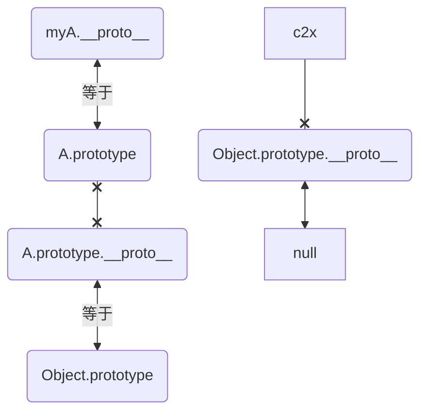

## `__proto__`:指向该对象的构造函数的原型对象
### 理解`__proto__和prototype`
* `__proto__`(隐式原型)是每个对象都有的一个属性,是任何对象的属性，指向`该对象的构造函数的原型对象`
```
即对象的构造函数的prototype
```

```js
// true,可见字面量对象的构造函数是Object
console.log('',{}.__proto__ === Object.prototype)
```

一个对象的隐式原型指向构造该对象的构造函数的原型，这也保证了实例能够访问在构造函数原型中定义的属性和方法。
```js
function A() {}
A.prototype.aPrototype='test';

// ƒ () { [native code] }
console.log('__proto__',A.__proto__)

/*
{
  aPrototype : "test",
  constructor : ƒ A(),
  [[Prototype]] : Object,
}
*/
console.log('prototype',A.prototype)
```

* prototype(原型)是函数才有的，prototype是构造函数的属性，指向属于该`函数的原型对象`,储存着对象的属性和构造函数constructor,在原型对象里有共有的方法，所有构造函数声明的实例都可以共享这个方法。
```
能在对象上直接获取其原型的是__proto__，这个属性记录了该对象的原型对象地址。
```


>说明：函数的 prototype 属性指向了一个对象，这个对象正是调用该构造函数而创建的实例的原型,也就是这个例子中的 person1 和 person2 的原型。

```js
function Person(){};

Person.prototype.name = 'name';

const person1 = new Person();
const person2 = new Person();

console.log('1:',person1.name) // 1: name
console.log('2:',person2.name) // 2: name
console.log('3:',person2.prototype) // 3: undefined
console.log('4:',person1 instanceof Person) // 4: true

console.log('5:',Person.prototype) // 5: {name: 'name', constructor: ƒ}
console.log('6:',person1.constructor) // 6: ƒ Person(){}

// 重点：true,说明原型链的查找规则
console.log('7',person1.__proto__ === Person.prototype)
```

### 例子:当你new fn的时候，产生的实例的`__proto__`指向fn.prototype
```js
var one = {x: 1};
var two = new Object();
one.__proto__ === Object.prototype // true
two.__proto__ === Object.prototype // true
one.toString === one.__proto__.toString // true
```

## 原型链:查找规则是向隐式原型`__proto__`一层层查找
>原型链是 js 对象的一种链表结构,`__proto__`是连接每个对象的节点。

当寻找一个属性先从本对象找，然后是`myA.__proto__=== A.prototype`，然后是冒泡往原型链寻找`A.prototype.__proto__===Object.prototype`,...,最后的原型链的终点:`Object.prototype.proto__` -->null

个人认为，prototype它在原型链实现中只是起到了一个辅助作用，换言之，它只是在new的时候有着一定的价值，而原型链的本质，其实在于`_proto_`.

* Object,Function都属于构造函数；
所有的构造函数是Function的实例，也就是说Function.prototype是所有构造函数的原型

* Object是Function的实例对象，即:
```js
//结果：ƒ Function() { [native code] }
Object.__proto__.constructor;

// null
console.log("8-3",Object.prototype.__proto__)

```

* Function.prototype是Object的实例对象:
```js
//结果：ƒ Object() { [native code] }
Function.prototype.__proto__.constructor;

// ƒ () { [native code] }
Function.prototype.__proto__.constructor.__proto__;
// 包含很多属性
Function.prototype.__proto__.constructor.prototype;
```

### 原型链的终点:`Object.prototype.__proto__` -->null
[](../assets/img-js/myA原型链打印.png)
```js
function A() {}
A.prototype.aPrototype='test';

var myA = new A()
myA.test = 1

console.log("a-1-0", A.prototype.__proto__);

console.log("myA:", myA);

// 注意点：:A的原型的构造函数指向自己: // ƒ A()
console.log("a-1.prototype.constructor", A.prototype.constructor);

// 指向 Object.prototype
console.log("a-1-0", A.prototype.__proto__);
// true
console.log(A.prototype.__proto__ === Object.prototype)

// ƒ Object() { [native code] } 
console.log("a-1-1", A.prototype.__proto__.constructor);

// ƒ () { [native code] } --> Object是Function的实例对象
console.log("a-1-1", A.prototype.__proto__.constructor.__proto__);

// true
console.log("a-2.是否等", A.prototype.constructor === A);

// undefined 注意：这样访问aPrototype
console.log("0-2.aPrototype:", A.aPrototype);
```

探究A.constructor 和 A.__proto__
```js
function A() {}
A.prototype.aPrototype='test';
// 指向构造A的构造函数Function的原型对象，也就是指向Function.prototype
//ƒ () { [native code] }
console.log("5-.__proto__:", A.__proto__);
// true //所以二者相等
console.log("6.是否等", A.__proto__ === A.constructor.prototype);
```

探究 A.prototype 和 A.prototype.constructor
```js
function A() {}
A.prototype.aPrototype='test';

var myA = new A()

// Object ƒ Object() { [native code] }
console.log("Object", Object);

// true Object是一个构造函数
console.log("8-2",A.prototype.__proto__===Object.prototype)
console.log("8-A:A.prototype",A.prototype)

// null
console.log("8-B",A.prototype.__proto__.__proto__)

// null
console.log("8-3",Object.prototype.__proto__)
```
[](../assets/img-js/A.prototype打印.png)

### 流程图-表示原型链


不理解看这个例子：
```js
function A() {}
A.prototype.aPrototype='test';

var myA = new A()

// 1: undefined
console.log('1:',myA.prototype)

// myA.__proto__ {aPrototype: 'test', constructor: ƒ}
console.log("myA.__proto__",myA.__proto__)

// A.prototype就是原型对象。原型对象也是对象，所以它也有proto属性，连接它的原型，
// 2: {aPrototype: 'test', constructor: ƒ}
console.log('2:',A.prototype)

/*
3: A:{
    [[Prototype]]: {
                    aPrototype: "test",
                    constructor: ƒ A(),
                    [[Prototype]]: Object
                  }
  }
*/
console.log('3:',myA)

// test,它去proto 找到了 aPrototype
console.log("0-1.myA.aPrototype:", myA.aPrototype);
// undefined 注意：这样访问aPrototype
console.log("0-2.aPrototype:", A.aPrototype);
// test
console.log("0-3.prototype.aPrototype:", A.prototype.aPrototype);

// {}:A的原型的构造函数指向自己
// ƒ A()
console.log("a-1.prototype.constructor", A.prototype.constructor);
// true
console.log("a-2.是否等", A.prototype.constructor === A);

/*
步骤1：探究A.constructor 和 A.__proto__
*/

// ƒ Function() { [native code] } --->A 的构造函数是 Function
console.log("3-A.constructor:", A.constructor);

// ƒ () { [native code] }
console.log("4-A.constructor.prototype:", A.constructor.prototype);

// 指向构造A的构造函数Function的原型对象，也就是指向Function.prototype
//ƒ () { [native code] }
console.log("5-.__proto__:", A.__proto__);
// true //所以二者相等
console.log("6.是否等", A.__proto__ === A.constructor.prototype);

/*
步骤2：探究 A.prototype 和 A.prototype.constructor
*/
// false 肯定不等，两个不是一个东西
console.log("7.是否等", A.prototype === A.__proto__);

console.log("2-1-myA.__proto__:", myA.__proto__);
// true
console.log('2-2-是否:',myA.__proto__=== A.prototype)
console.log("8-1",A.prototype.__proto__)
// Object ƒ Object() { [native code] }
console.log("Object", Object);
// true Object是一个构造函数
console.log("8-2",A.prototype.__proto__===Object.prototype)
// null
console.log("8-3",Object.prototype.__proto__)
```


## 原型两种的操作
### 指定对象原型的几种方式
非标准操作,直接设置对象的`__proto__`属性
```js
var a = {name: 'a'};
var b = {id: 'b'};
console.log('a的原型是Object.prototype', Object.getPrototypeOf(a) === Object.prototype);    //true
a.__proto__ = b
console.log('a的原型是b', Object.getPrototypeOf(a) === b);  //true
```

使用Object.setPrototypeOf

https://developer.mozilla.org/zh-CN/docs/Web/JavaScript/Reference/Global_Objects/Object/setPrototypeOf
```js
var a = {name: 'a'};
var b = {id: 'b'};
console.log('a的原型是Object.prototype', Object.getPrototypeOf(a) === Object.prototype);    // true

var a = {name: 'a'};
var b = {id:'b'};
// 语法：Object.setPrototypeOf(obj, prototype)
console.log('a的原型是b', Object.getPrototypeOf(a) === b);  // false
```


使用Object.create()方法会得到一个指定属性的新对象，这个方法的第一个参数可以指定新得到对象的原型，第二个参数可以指定对象属性值等。
```js
var c = Object.create(b, {
    name: {
    	value: 'a'     
    }
});
console.log('a的原型是b', Object.getPrototypeOf(c) === b);  //true 
```

### 获取一个对象的原型
当我们要获取一个对象的原型时应该使用ES的标准API:
```js
Object.getPrototypeOf()或者Reflect.getPrototypeOf()（ES6)
```

## new做了什么?
1. 创建一个新的空对象：new 操作符首先创建一个新的空对象。
2. 该对象的原型指向构造函数的 prototype 属性：它将构造函数（也就是 new 操作符后面跟着的函数）与新创建的空对象关联起来。这意味着新对象将继承构造函数的属性和方法，可以通过原型链来访问它们。
3. 执行构造函数：它调用构造函数，同时将新对象作为 this 上下文，以便构造函数可以在新对象上设置属性和方法。将构造函数的作用域赋值给新对象（因此 this 指向新对象）
4. 返回新对象：new 操作符返回新创建的对象，这个对象已经关联到了构造函数，并且包含了构造函数设置的属性和方法。
```js
function Person(name, age) {
  console.log('this:',this)
  this.name = name;
  this.age = age;
}

// 它的原型指向Person.prototype，并调用Person构造函数来初始化新对象。
const john = new Person("John", 30);

john.high = 172
console.log(john.name); // 输出 "John"
console.log(john.age);  // 输出 30
```


注意:构造函数内部的 this 指向新创建的对象，这是 new 操作符的工作原理之一。

当你使用 new 操作符创建对象时，它会在构造函数内部将 this 绑定到新创建的对象上。

>在你的代码中，构造函数 Person 的 this 指向了 john 对象，因为你使用 new 操作符创建了 john。这使得你可以在构造函数内部使用 this 来设置新对象的属性，如 this.name 和 this.age。

## 通过对象字面量创建对象的过程

- new 关键字创建对象时，可以继承原型链上的属性和方法，
- 使用对象字面量创建对象则不支持继承原型链。而是从 Object.prototype 继承而来的属性和方法

```js
var person = {};
```

## 创建对象的几种方式

### 创建对象方式2：字面量,效率比较高
{}是字面量，可以立即求值，而new Object()本质上是方法（只不过这个方法是内置的）调用，既然是方法调用，就涉及到在proto链中遍历该方法，当找到该方法后，又会生产方法调用必须的堆栈信息，方法调用结束后，还要释放该堆栈

### Object.create()
Object.create()方法创建一个新对象，使用现有的对象来提供新创建的对象的proto
```js
const person = {
  isHuman: false,
  printIntroduction: function () {
    console.log(`My name is ${this.name}. Am I human? ${this.isHuman}`);
  },
};
const me = Object.create(person);
me.name = "Matthew";
me.isHuman = true;
me.printIntroduction();
```
具体三个步骤就是：
1. 创建一个对象
2. 继承指定父对象
3. 为新对象扩展新属性
```js
// 自己实现一个Object.create()：
Object.myCreate = function (obj, properties)  {
  var F = function ()  {}
  F.prototype = obj
  if (properties) {
     Object.defineProperties(F, properties)
  }
  return new F()
}
Object.myCreate({}, {a: {value: 1}}) //{a: 1}
```

## instanceof: 处理对象(person1)和函数的关系
instanceof 是一个二元运算符，如：A instanceof B. 其中，A 必须是一个合法的 JavaScript 对象，B 必须是一个合法的 JavaScript 函数 (function). 判断过程如下：
```
函数 B 在对象 A 的原型链 (prototype chain) 中被发现，

instanceof 返回 true，否则返回 false.
```

注意：instanceof 运算时会递归查找 L 的原型链，即 L.**proto**.**proto**.**proto**.**proto**...直到找到了或者找到顶层为止。

```js
// 1.构造器Function的构造器是它自身
console.log(Function instanceof Object) // true
console.log(Object instanceof Function) // true

// 2.构造器Object的构造器是Function（由此可知所有构造器的constructor都指向Function）
console.log(Object.constructor === Function) // true

// 3.构造器Function的__proto__是一个特殊的匿名函数function() {}
console.log(Function.__proto__);  // function() {}

// 4.这个特殊的匿名函数的__proto__指向Object的prototype原型。
console.log(Function.__proto__.__proto__ === Object.prototype) // true

// 5.Object的__proto__指向Function的prototype，也就是上面③中所述的特殊匿名函数
console.log(Object.__proto__ === Function.prototype) // true

console.log(Function.prototype === Function.__proto__) // true
```
