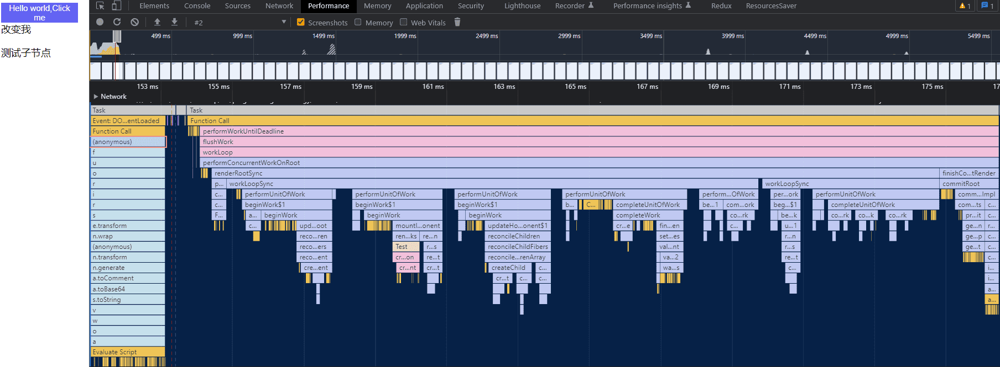
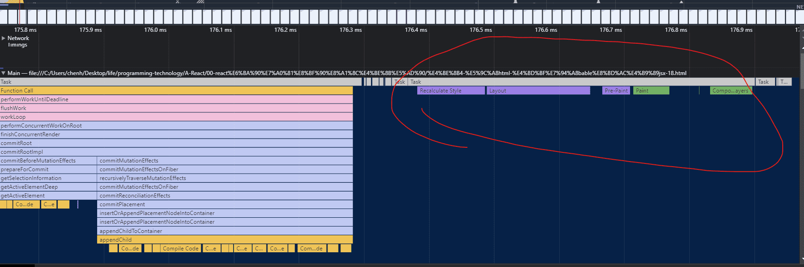

## react 模板引擎

先看babel 的执行函数
```js
function transform(code, options) {
  console.log('=Babel-transform-参数:', { code })
  const babel_transform = Babel.transform(code, processOptions(options));
  console.log('=Babel-返回:', babel_transform)
  return babel_transform
}
```

### 测试代码
```html
<script type="text/babel">
  console.log('=Babel:', Babel)
  function Test() {
    console.log('test-render')
    const [data, setData] = React.useState('改变我')
    const [showDiv, setShowDiv] = React.useState(false)

    const onClickText = () => {
      console.log('=useState=onClick');
      setData('努力哦')
      setShowDiv(!showDiv)
    }

    const onClickText2 = () => {
      console.log('=useState=onClick:', data);
    }

    React.useEffect(() => {
      console.log('=副作用-useEffect-->运行');
    }, [])

    React.useLayoutEffect(() => {
      console.log('=副作用-useLayoutEffect-->运行');
    }, [])

    return (
      <div id='div1' className='c1'>
        <button onClick={onClickText} className="btn">Hello world,Click me</button>
        <span>{data}</span>
        {showDiv && <div>被你发现了</div>}
        <div id='div2' className='c2'>
          <p>测试子节点</p>
        </div>
      </div>
    )
  }

  const root = ReactDOM.createRoot(document.getElementById('root'))
  console.log("=app=root:", root)
  root.render(<Test />);
</script>
```

### mockData-babel返回.json
[mockData-babel返回code函数](./mockData-babel返回code函数)
```json
{
"metadata":"",
"options":"",
"ignored":"",
"code":"",
"ast":"",
"map":""
}
```

### code函数
每个节点都调用createElement(),并且嵌套结构都是和html节点一样
```js
'use strict';

var _slicedToArray = function () { function sliceIterator(arr, i) { var _arr = []; var _n = true; var _d = false; var _e = undefined; try { for (var _i = arr[Symbol.iterator](), _s; !(_n = (_s = _i.next()).done); _n = true) { _arr.push(_s.value); if (i && _arr.length === i) break; } } catch (err) { _d = true; _e = err; } finally { try { if (!_n && _i["return"]) _i["return"](); } finally { if (_d) throw _e; } } return _arr; } return function (arr, i) { if (Array.isArray(arr)) { return arr; } else if (Symbol.iterator in Object(arr)) { return sliceIterator(arr, i); } else { throw new TypeError("Invalid attempt to destructure non-iterable instance"); } }; }();

console.log('=Babel:', Babel);
function Test() {
  console.log('test-render');

  var _React$useState = React.useState('改变我'),
    _React$useState2 = _slicedToArray(_React$useState, 2),
    data = _React$useState2[0],
    setData = _React$useState2[1];

  var _React$useState3 = React.useState(false),
    _React$useState4 = _slicedToArray(_React$useState3, 2),
    showDiv = _React$useState4[0],
    setShowDiv = _React$useState4[1];

  var onClickText = function onClickText() {
    console.log('=useState=onClick');
    setData('努力哦');
    setShowDiv(!showDiv);
  };

  var onClickText2 = function onClickText2() {
    console.log('=useState=onClick:', data);
  };

  React.useEffect(function () {
    console.log('=副作用-useEffect-->运行');
  }, []);

  React.useLayoutEffect(function () {
    console.log('=副作用-useLayoutEffect-->运行');
  }, []);

  return React.createElement(
    'div',
    { id: 'div1', className: 'c1' },
    React.createElement(
      'button',
      { onClick: onClickText, className: 'btn' },
      'Hello world,Click me'
    ),
    React.createElement(
      'span',
      null,
      data
    ),
    showDiv && React.createElement(
      'div',
      null,
      '\u88AB\u4F60\u53D1\u73B0\u4E86'
    ),
    React.createElement(
      'div',
      { id: 'div2', className: 'c2' },
      React.createElement(
        'p',
        null,
        '\u6D4B\u8BD5\u5B50\u8282\u70B9'
      )
    )
  );
}

var root = ReactDOM.createRoot(document.getElementById('root'));
console.log("=app=root:", root);
root.render(React.createElement(Test, null));
```

### createElement()
```js
function createElement(type, config, children) {
  // console.log('=development调用createElement构建Ast树:', { type, config, children })
  console.log('%c=development调用createElement-1:type', 'color:blueviolet', type, { config, children })
  var propName; // Reserved names are extracted

  var props = {};
  var key = null;
  var ref = null;
  var self = null;
  var source = null;

  if (config != null) {
    if (hasValidRef(config)) {
      ref = config.ref;

      {
        warnIfStringRefCannotBeAutoConverted(config);
      }
    }

    if (hasValidKey(config)) {
      {
        checkKeyStringCoercion(config.key);
      }

      key = '' + config.key;
    }

    self = config.__self === undefined ? null : config.__self;
    source = config.__source === undefined ? null : config.__source; // Remaining properties are added to a new props object

    for (propName in config) {
      if (hasOwnProperty.call(config, propName) && !RESERVED_PROPS.hasOwnProperty(propName)) {
        props[propName] = config[propName];
      }
    }
  } // Children can be more than one argument, and those are transferred onto
  // the newly allocated props object.


  var childrenLength = arguments.length - 2;

  if (childrenLength === 1) {
    props.children = children;
  } else if (childrenLength > 1) {
    var childArray = Array(childrenLength);

    for (var i = 0; i < childrenLength; i++) {
      childArray[i] = arguments[i + 2];
    }

    {
      if (Object.freeze) {
        Object.freeze(childArray);
      }
    }

    props.children = childArray;
  } // Resolve default props


  if (type && type.defaultProps) {
    var defaultProps = type.defaultProps;

    for (propName in defaultProps) {
      if (props[propName] === undefined) {
        props[propName] = defaultProps[propName];
      }
    }
  }

  {
    if (key || ref) {
      var displayName = typeof type === 'function' ? type.displayName || type.name || 'Unknown' : type;

      if (key) {
        defineKeyPropWarningGetter(props, displayName);
      }

      if (ref) {
        defineRefPropWarningGetter(props, displayName);
      }
    }
  }
  const reactElementRes = ReactElement(type, key, ref, self, source, ReactCurrentOwner.current, props);
  console.log('=development调用createElement-2:返回:', reactElementRes)
  return reactElementRes
}
```

## workInProgress 构建
```js
  function createWorkInProgress(current, pendingProps) {
    var workInProgress = current.alternate;
    // 区分是在mount时还是在update时
    if (workInProgress === null) {
      // We use a double buffering pooling technique because we know that we'll
      // only ever need at most two versions of a tree. We pool the "other" unused
      // node that we're free to reuse. This is lazily created to avoid allocating
      // extra objects for things that are never updated. It also allow us to
      // reclaim the extra memory if needed.
      console.log('==createWorkInProgress-->,没有就创建一个')
      workInProgress = createFiber(current.tag, pendingProps, current.key, current.mode);
      console.log('==createWorkInProgress-->,没有就创建一个返回值', workInProgress)
      debugger
      workInProgress.elementType = current.elementType;
      workInProgress.type = current.type;
      workInProgress.stateNode = current.stateNode;

      {
        // DEV-only fields
        workInProgress._debugSource = current._debugSource;
        workInProgress._debugOwner = current._debugOwner;
        workInProgress._debugHookTypes = current._debugHookTypes;
      }
      console.log('==createWorkInProgress-->,workInProgress.alternate指定为current')
      workInProgress.alternate = current;
      current.alternate = workInProgress;
    } else {
      // 复用属性
      workInProgress.pendingProps = pendingProps; // Needed because Blocks store data on type.

      workInProgress.type = current.type; // We already have an alternate.
      // Reset the effect tag.

      workInProgress.flags = NoFlags; // The effects are no longer valid.

      workInProgress.subtreeFlags = NoFlags;
      workInProgress.deletions = null;

      {
        // We intentionally reset, rather than copy, actualDuration & actualStartTime.
        // This prevents time from endlessly accumulating in new commits.
        // This has the downside of resetting values for different priority renders,
        // But works for yielding (the common case) and should support resuming.
        workInProgress.actualDuration = 0;
        workInProgress.actualStartTime = -1;
      }
    } // Reset all effects except static ones.
    // Static effects are not specific to a render.


    workInProgress.flags = current.flags & StaticMask;
    // 复用属性
    workInProgress.childLanes = current.childLanes;
    workInProgress.lanes = current.lanes;
    workInProgress.child = current.child;
    workInProgress.memoizedProps = current.memoizedProps;
    workInProgress.memoizedState = current.memoizedState;
    workInProgress.updateQueue = current.updateQueue; // Clone the dependencies object. This is mutated during the render phase, so
    // it cannot be shared with the current fiber.

    var currentDependencies = current.dependencies;
    workInProgress.dependencies = currentDependencies === null ? null : {
      lanes: currentDependencies.lanes,
      firstContext: currentDependencies.firstContext
    }; // These will be overridden during the parent's reconciliation

    workInProgress.sibling = current.sibling;
    workInProgress.index = current.index;
    workInProgress.ref = current.ref;

    {
      workInProgress.selfBaseDuration = current.selfBaseDuration;
      workInProgress.treeBaseDuration = current.treeBaseDuration;
    }

    {
      workInProgress._debugNeedsRemount = current._debugNeedsRemount;

      switch (workInProgress.tag) {
        case IndeterminateComponent:
        case FunctionComponent:
        case SimpleMemoComponent:
          workInProgress.type = resolveFunctionForHotReloading(current.type);
          break;

        case ClassComponent:
          workInProgress.type = resolveClassForHotReloading(current.type);
          break;

        case ForwardRef:
          workInProgress.type = resolveForwardRefForHotReloading(current.type);
          break;
      }
    }

    return workInProgress;
  }
```

赋值：调用 prepareFreshStack
```js
  function renderRootSync(root, lanes) {

    var prevExecutionContext = executionContext;
    executionContext |= RenderContext;
    var prevDispatcher = pushDispatcher(); // If the root or lanes have changed, throw out the existing stack
    // and prepare a fresh one. Otherwise we'll continue where we left off.

    if (workInProgressRoot !== root || workInProgressRootRenderLanes !== lanes) {
      {
        if (isDevToolsPresent) {
          var memoizedUpdaters = root.memoizedUpdaters;

          if (memoizedUpdaters.size > 0) {
            restorePendingUpdaters(root, workInProgressRootRenderLanes);
            memoizedUpdaters.clear();
          } // At this point, move Fibers that scheduled the upcoming work from the Map to the Set.
          // If we bailout on this work, we'll move them back (like above).
          // It's important to move them now in case the work spawns more work at the same priority with different updaters.
          // That way we can keep the current update and future updates separate.


          movePendingFibersToMemoized(root, lanes);
        }

      }

      workInProgressTransitions = getTransitionsForLanes();

      console.log('workInProgress', workInProgress, root)
      debugger
      console.log('render调用 prepareFreshStack前',workInProgress)
      prepareFreshStack(root, lanes);
      console.log('workInProgress', workInProgress, root)
      console.log('render调用 prepareFreshStack后',workInProgress)
    }
```

### workInProgress 构建2：beginWork 第一次会调用updateHostRoot进行初始化:updateHostRoot

第二次才走 mountIndeterminateComponent 执行code()函数,此时的workInProgress.type 才有值
```js
  function beginWork(current, workInProgress, renderLanes) {
    console.log('workInProgress', workInProgress, root)
    debugger
    workInProgress.lanes = NoLanes;
    console.log('%c=beginWork()===start1-初始化', 'color:magenta', { getFiberName: getFiberName(workInProgress), current, renderLanes, workInProgress })
    switch (workInProgress.tag) {
      case IndeterminateComponent:
        {
          console.log('%c=beginWork()==end 2 mountIndeterminateComponent', 'color:magenta', workInProgress)
          console.log(`%c=探究初始和hook=调用mountIndeterminateComponent`, 'color:blueviolet', workInProgress.type)
          return mountIndeterminateComponent(current, workInProgress, workInProgress.type, renderLanes);
      }
      case HostRoot:
        console.log('%c=beginWork()=end 6第一次会走这里初始化workInProgress', 'color:magenta')
        console.log('%c=beginWork()=end 6 updateHostRoot', 'color:magenta')
        return updateHostRoot(current, workInProgress, renderLanes);
    }
  }
```

### 重点构建子节点：
reconcileChildren(current, workInProgress, nextChildren, renderLanes)-->reconcileChildren

```js
function updateHostRoot(current, workInProgress, renderLanes) {
  pushHostRootContext(workInProgress);

  if (current === null) {
    throw new Error('Should have a current fiber. This is a bug in React.');
  }

  var nextProps = workInProgress.pendingProps;
  var prevState = workInProgress.memoizedState;
  var prevChildren = prevState.element;
  cloneUpdateQueue(current, workInProgress);
  processUpdateQueue(workInProgress, nextProps, null, renderLanes);
  var nextState = workInProgress.memoizedState;
  var root = workInProgress.stateNode;
  // being called "element".


  var nextChildren = nextState.element;

  if (prevState.isDehydrated) {
  } else {
      // Root is not dehydrated. Either this is a client-only root, or it
      // already hydrated.
      resetHydrationState();

      if (nextChildren === prevChildren) {
        return bailoutOnAlreadyFinishedWork(current, workInProgress, renderLanes);
      }

      console.log('=reconcileChildren 9')
      debugger
      reconcileChildren(current, workInProgress, nextChildren, renderLanes);
      console.log('%c=updateHostRoot:构建之后workInProgress.child', 'color:black', { child })
  }
  console.log('%c=updateHostRoot:最后返回workInProgress.child', 'color:black', workInProgress.child)

  return workInProgress.child;
}
```

```js
function reconcileChildren(current, workInProgress, nextChildren, renderLanes) {
  if (current === null) {
    // If this is a fresh new component that hasn't been rendered yet, we
    // won't update its child set by applying minimal side-effects. Instead,
    // we will add them all to the child before it gets rendered. That means
    // we can optimize this reconciliation pass by not tracking side-effects.
    console.log('%c=reconcileChildren mount', 'blueviolet');
    workInProgress.child = mountChildFibers(workInProgress, null, nextChildren, renderLanes);
    console.log('%c=reconcileChildren mount 返回值workInProgress.child', 'blueviolet', workInProgress.child);
  } else {
    // If the current child is the same as the work in progress, it means that
    // we haven't yet started any work on these children. Therefore, we use
    // the clone algorithm to create a copy of all the current children.
    // If we had any progressed work already, that is invalid at this point so
    // let's throw it out.
    console.log('%c=reconcileChildren update', 'yellow');
    workInProgress.child = reconcileChildFibers(workInProgress, current.child, nextChildren, renderLanes);
  }
}
```

很长的函数: reconcileChildren->reconcileChildFibers
```js
  function ChildReconciler(shouldTrackSideEffects) {
    // 省略
    function reconcileChildFibers(returnFiber, currentFirstChild, newChild, lanes) {
      // This function is not recursive.
      // If the top level item is an array, we treat it as a set of children,
      // not as a fragment. Nested arrays on the other hand will be treated as
      // fragment nodes. Recursion happens at the normal flow.
      // Handle top level unkeyed fragments as if they were arrays.
      // This leads to an ambiguity between <>{[...]}</> and <>...</>.
      // We treat the ambiguous cases above the same.
      var isUnkeyedTopLevelFragment = typeof newChild === 'object' && newChild !== null && newChild.type === REACT_FRAGMENT_TYPE && newChild.key === null;

      console.log('%c=reconcileChildFibers A', 'blueviolet');

      if (isUnkeyedTopLevelFragment) {
        newChild = newChild.props.children;
      } // Handle object types


      if (typeof newChild === 'object' && newChild !== null) {
        switch (newChild.$$typeof) {
          case REACT_ELEMENT_TYPE:
            return placeSingleChild(reconcileSingleElement(returnFiber, currentFirstChild, newChild, lanes));

          case REACT_PORTAL_TYPE:
            return placeSingleChild(reconcileSinglePortal(returnFiber, currentFirstChild, newChild, lanes));

          case REACT_LAZY_TYPE:
            var payload = newChild._payload;
            var init = newChild._init; // TODO: This function is supposed to be non-recursive.

            return reconcileChildFibers(returnFiber, currentFirstChild, init(payload), lanes);
        }

        if (isArray(newChild)) {
          return reconcileChildrenArray(returnFiber, currentFirstChild, newChild, lanes);
        }

        if (getIteratorFn(newChild)) {
          return reconcileChildrenIterator(returnFiber, currentFirstChild, newChild, lanes);
        }

        throwOnInvalidObjectType(returnFiber, newChild);
      }

      if (typeof newChild === 'string' && newChild !== '' || typeof newChild === 'number') {
        return placeSingleChild(reconcileSingleTextNode(returnFiber, currentFirstChild, '' + newChild, lanes));
      }

      {
        if (typeof newChild === 'function') {
          warnOnFunctionType(returnFiber);
        }
      } // Remaining cases are all treated as empty.


      return deleteRemainingChildren(returnFiber, currentFirstChild);
    }

    return reconcileChildFibers;
  }
```

## beginWork第二次之case IndeterminateComponent
第二次beginWork进入case IndeterminateComponent 执行 mountIndeterminateComponent(),可见深度遍历从父级组件开始

首先要注意的是，虽然 App 是一个 FunctionComponent，但是在 first paint 的时候，React 判断其为 IndeterminateComponent

对于 FunctionComponent，在第一次识别的时候会被认为是 IndeterminateComponent

一个函数，只要返回的是一个对象且对象中有 render 方法，就认为是 ClassComponent，否则就是 FunctionComponent

```js
    switch (workInProgress.tag) {
      case IndeterminateComponent:
        {
          console.log('%c=beginWork()==end 2 mountIndeterminateComponent', 'color:magenta')
          console.log(`%c=探究初始和hook=调用mountIndeterminateComponent`, 'color:blueviolet')
          return mountIndeterminateComponent(current, workInProgress, workInProgress.type, renderLanes);
        }
```

```js
function beginWork(current, workInProgress, renderLanes) {
    workInProgress.lanes = NoLanes;
    console.log('%c=beginWork()===start1-初始化', 'color:magenta', { getFiberName: getFiberName(workInProgress), current, renderLanes, workInProgress })
    switch (workInProgress.tag) {
      case IndeterminateComponent:
        {
          console.log('%c=beginWork()==end 2 mountIndeterminateComponent', 'color:magenta')
          console.log(`%c=探究初始和hook=调用mountIndeterminateComponent`, 'color:blueviolet')
          return mountIndeterminateComponent(current, workInProgress, workInProgress.type, renderLanes);
        }

      case LazyComponent:
        {
          var elementType = workInProgress.elementType;
          console.log('%c=beginWork()=end 3 mountLazyComponent', 'color:magenta')
          return mountLazyComponent(current, workInProgress, elementType, renderLanes);
        }

      case FunctionComponent:
        {
          var Component = workInProgress.type;
          var unresolvedProps = workInProgress.pendingProps;
          var resolvedProps = workInProgress.elementType === Component ? unresolvedProps : resolveDefaultProps(Component, unresolvedProps);
          console.log('%c=beginWork()=end 4只有更新才会调用updateFunctionComponent', 'color:magenta')
          return updateFunctionComponent(current, workInProgress, Component, resolvedProps, renderLanes);
        }

      case ClassComponent:
        {
          var _Component = workInProgress.type;
          var _unresolvedProps = workInProgress.pendingProps;

          var _resolvedProps = workInProgress.elementType === _Component ? _unresolvedProps : resolveDefaultProps(_Component, _unresolvedProps);
          console.log('%c=beginWork()=end 5 updateClassComponent', 'color:magenta')
          return updateClassComponent(current, workInProgress, _Component, _resolvedProps, renderLanes);
        }

      case HostRoot:
        console.log('%c=beginWork()=end 6 updateHostRoot', 'color:magenta')
        return updateHostRoot(current, workInProgress, renderLanes);

      case HostComponent:
        console.log(`%c=beginWork()=end 7 updateHostComponent$1,即原生 DOM 组件对应的 Fiber节点:`, 'color:magenta', { type: workInProgress.type })
        return updateHostComponent$1(current, workInProgress, renderLanes);

      case HostText:
        console.log('%c=beginWork()=end 8 updateHostText$1', 'color:magenta')
        return updateHostText$1(current, workInProgress);

      case SuspenseComponent:
        console.log('%c=beginWork()=end 9 updateSuspenseComponent', 'color:magenta')
        return updateSuspenseComponent(current, workInProgress, renderLanes);

      case HostPortal:
        console.log('%c=beginWork()=end 10 updatePortalComponent', 'color:magenta')
        return updatePortalComponent(current, workInProgress, renderLanes);

      case ForwardRef:
        {
          var type = workInProgress.type;
          var _unresolvedProps2 = workInProgress.pendingProps;

          var _resolvedProps2 = workInProgress.elementType === type ? _unresolvedProps2 : resolveDefaultProps(type, _unresolvedProps2);

          console.log('%c=beginWork()=end 11 updateForwardRef', 'color:magenta')
          return updateForwardRef(current, workInProgress, type, _resolvedProps2, renderLanes);
        }

      case Fragment:
        console.log('%c=beginWork()=end 12 updateFragment', 'color:magenta')
        return updateFragment(current, workInProgress, renderLanes);

      case Mode:
        console.log('%c=beginWork()=end 13 updateMode', 'color:magenta')
        return updateMode(current, workInProgress, renderLanes);

      case Profiler:
        console.log('%c=beginWork()=end 14 updateProfiler', 'color:magenta')
        return updateProfiler(current, workInProgress, renderLanes);

      case ContextProvider:
        console.log('%c=beginWork()=end 15 updateContextProvider', 'color:magenta')
        return updateContextProvider(current, workInProgress, renderLanes);

      case ContextConsumer:
        console.log('%c=beginWork()=end 16 updateContextConsumer', 'color:magenta')
        return updateContextConsumer(current, workInProgress, renderLanes);

      case MemoComponent:
        {
          var _type2 = workInProgress.type;
          var _unresolvedProps3 = workInProgress.pendingProps; // Resolve outer props first, then resolve inner props.

          var _resolvedProps3 = resolveDefaultProps(_type2, _unresolvedProps3);

          {
            if (workInProgress.type !== workInProgress.elementType) {
              var outerPropTypes = _type2.propTypes;

              if (outerPropTypes) {
                checkPropTypes(outerPropTypes, _resolvedProps3, // Resolved for outer only
                  'prop', getComponentNameFromType(_type2));
              }
            }
          }

          _resolvedProps3 = resolveDefaultProps(_type2.type, _resolvedProps3);
          console.log('%c=beginWork()=end 17 updateMemoComponent', 'color:magenta')
          return updateMemoComponent(current, workInProgress, _type2, _resolvedProps3, renderLanes);
        }

      case SimpleMemoComponent:
        {
          console.log('%c=beginWork()=end 18 updateSimpleMemoComponent', 'color:magenta')
          return updateSimpleMemoComponent(current, workInProgress, workInProgress.type, workInProgress.pendingProps, renderLanes);
        }

      case IncompleteClassComponent:
        {
          var _Component2 = workInProgress.type;
          var _unresolvedProps4 = workInProgress.pendingProps;

          var _resolvedProps4 = workInProgress.elementType === _Component2 ? _unresolvedProps4 : resolveDefaultProps(_Component2, _unresolvedProps4);
          console.log('%c=beginWork()=end 19 mountIncompleteClassComponent', 'color:magenta')
          return mountIncompleteClassComponent(current, workInProgress, _Component2, _resolvedProps4, renderLanes);
        }

      case SuspenseListComponent:
        {
          console.log('%c=beginWork()=end 20 updateSuspenseListComponent', 'color:magenta')
          return updateSuspenseListComponent(current, workInProgress, renderLanes);
        }

      case ScopeComponent:
        {

          break;
        }

      case OffscreenComponent:
        {
          console.log('%c=beginWork()=end 21 updateOffscreenComponent', 'color:magenta')
          return updateOffscreenComponent(current, workInProgress, renderLanes);
        }
    }
    throw new Error("Unknown unit of work tag (" + workInProgress.tag + "). This error is likely caused by a bug in " + 'React. Please file an issue.');
  }
}
```

### 重点：code函数初始化在renderWithHooks这里执行

mountIndeterminateComponent 
* 调用  renderWithHooks 生成 value
* 执行 reconcileChildren(null, workInProgress, value, renderLanes) 参数value


关键的函数 renderWithHooks；而在 renderWithHooks 中，我们会根据组件处于不同的状态，给 ReactCurrentDispatcher.current 挂载不同的 dispatcher 。而在first paint 时，挂载的是HooksDispatcherOnMountInDEV

HooksDispatcherOnMountInDEV 里就是组件 first paint 的时候所用到的各种 hooks
```js
function mountIndeterminateComponent(_current, workInProgress, Component, renderLanes) {
    // 省略
    setIsRendering(true);
    ReactCurrentOwner$1.current = workInProgress;
    console.log(`%c=探究初始和hook=mountIndeterminateComponent调用renderWithHooks 1`, 'color:blueviolet', { workInProgress, Component, props, context, renderLanes })
    value = renderWithHooks(null, workInProgress, Component, props, context, renderLanes);
    console.log(`%c=探究初始和hook=mountIndeterminateComponent调用renderWithHooks 返回值`, 'color:blueviolet', { value })
    // 省略

   if (getIsHydrating() && hasId) {
        pushMaterializedTreeId(workInProgress);
      }
      console.log('%c=reconcileChildren 12:重点，mountIndeterminateComponent调用reconcileChildren', 'color:red')
      reconcileChildren(null, workInProgress, value, renderLanes);

      {
        validateFunctionComponentInDev(workInProgress, Component);
      }

      return workInProgress.child;
    }
  }
}
```
```js
function renderWithHooks(current, workInProgress, Component, props, secondArg, nextRenderLanes) {
    // 省略：
    console.log(`%c=探究初始和hook=renderWithHooks重点，调用函数组件，里面执行各种 React Hook==start并返回 ReactElement`, 'color:blueviolet', Component)
    var children = Component(props, secondArg); // Check if there was a render phase update
    console.log(`%c=探究初始和hook=renderWithHooks重点,返回 ReactElement==end`, 'color:blueviolet', { children })
    // 省略：
    return children;
}
```

初始化-->mountChildFibers
```js
function reconcileChildren(current, workInProgress, nextChildren, renderLanes) {
  if (current === null) {
    // If this is a fresh new component that hasn't been rendered yet, we
    // won't update its child set by applying minimal side-effects. Instead,
    // we will add them all to the child before it gets rendered. That means
    // we can optimize this reconciliation pass by not tracking side-effects.
    console.log('%c=reconcileChildren mount', 'blueviolet');
    workInProgress.child = mountChildFibers(workInProgress, null, nextChildren, renderLanes);
    console.log('%c=reconcileChildren mount 返回值workInProgress.child', 'blueviolet',workInProgress.child);
  } else {
    // If the current child is the same as the work in progress, it means that
    // we haven't yet started any work on these children. Therefore, we use
    // the clone algorithm to create a copy of all the current children.
    // If we had any progressed work already, that is invalid at this point so
    // let's throw it out.
    console.log('%c=reconcileChildren update', 'yellow');
    workInProgress.child = reconcileChildFibers(workInProgress, current.child, nextChildren, renderLanes);
  }
}
```


### ChildReconciler
从该函数名就能看出这是Reconciler模块的核心部分。那么他究竟做了什么呢？
* 对于 mount 的组件，他会创建新的子 Fiber 节点；
* 对于 update 的组件，他会将当前组件与该组件在上次更新时对应的 Fiber 节点比较（也就是俗称的Diff 算法），将比较的结果生成新 Fiber 节点。

不论走哪个逻辑，最终他会生成新的子 Fiber 节点并赋值给workInProgress.child，作为本次 beginWork 返回值，并作为下次performUnitOfWork执行时workInProgress的传参。

mountChildFibers与reconcileChildFibers这两个方法的逻辑基本一致。唯一的区别是：reconcileChildFibers 会为生成的 Fiber 节点带上effectTag属性，而 mountChildFibers 不会。
```js
var mountChildFibers = ChildReconciler(false);

// 这个代码很长 1k
function ChildReconciler(shouldTrackSideEffects) {

}
```

root.render(React.createElement(Test, null));
调用的参数是：React.createElement(Test, null)处理之后的：
```js
var ReactElement = function (type, key, ref, self, source, owner, props) {
    var element = {
      // This tag allows us to uniquely identify this as a React Element
      $$typeof: REACT_ELEMENT_TYPE,
      // Built-in properties that belong on the element
      type: type,
      key: key,
      ref: ref,
      props: props,
      // Record the component responsible for creating this element.
      _owner: owner
    };

    return element;
}
```

## 第三次 beginWork
此时构建 code() 生成的节点
```js
      case HostComponent:
        console.log(`%c=beginWork()=end 7 updateHostComponent$1,即原生 DOM 组件对应的 Fiber节点:`, 'color:magenta', { type: workInProgress.type })
        return updateHostComponent$1(current, workInProgress, renderLanes);
```

此时 workInProgress
```
actualDuration:0
actualStartTime:-1
alternate:null
child:null
childLanes:0
deletions: null
dependencies: null
elementType:"div"
flags: 0
index : 0
key : null
lanes : 0
memoizedProps:null
memoizedState:null
mode:1
pendingProps:{id: 'div1', className: 'c1', children: Array(4)}
ref:null
return:FiberNode {tag: 0, key: null, stateNode: null, elementType: ƒ, type: ƒ, …}
selfBaseDuration:0,
sibling:null
stateNode:null
subtreeFlags:0
tag:5
treeBaseDuration:0
type:"div"
updateQueue:null
```

```js
function updateHostComponent$1(current, workInProgress, renderLanes) {
  pushHostContext(workInProgress);

  if (current === null) {
    tryToClaimNextHydratableInstance(workInProgress);
  }

  var type = workInProgress.type;
  var nextProps = workInProgress.pendingProps;
  var prevProps = current !== null ? current.memoizedProps : null;
  var nextChildren = nextProps.children;
  var isDirectTextChild = shouldSetTextContent(type, nextProps);

  if (isDirectTextChild) {
    // We special case a direct text child of a host node. This is a common
    // case. We won't handle it as a reified child. We will instead handle
    // this in the host environment that also has access to this prop. That
    // avoids allocating another HostText fiber and traversing it.
    nextChildren = null;
  } else if (prevProps !== null && shouldSetTextContent(type, prevProps)) {
    // If we're switching from a direct text child to a normal child, or to
    // empty, we need to schedule the text content to be reset.
    workInProgress.flags |= ContentReset;
  }

  markRef$1(current, workInProgress);
  console.log('=reconcileChildren 11')
  reconcileChildren(current, workInProgress, nextChildren, renderLanes);
  return workInProgress.child;
}
```


### React.createElement 旧api
https://cloud.tencent.com/developer/article/2135083
react17 之后我们可以不再依赖 React.createElement 这个 api 了，但是实际场景中以及很多开源包中可能会有很多通过 React.createElement 手动创建元素的场景:

React.createElement 其接收三个或以上参数：

* type：要创建的 React 元素类型，可以是标签名称字符串，如 'div' 或者 'span' 等；也可以是 React组件 类型(class组件或者函数组件)；或者是 React fragment 类型。
* config：写在标签上的属性的集合，js 对象格式，若标签上未添加任何属性则为 null。
* children：从第三个参数开始后的参数为当前创建的React元素的子节点，每个参数的类型，若是当前元素节点的 textContent 则为字符串类型；否则为新的 React.createElement 创建的元素。

## 开始


## 接上面updateContainer
fiber 协调过程,构建fiber树的阶段可中断


## commit阶段
commit阶段之beforeMutation和mutation阶段


commit阶段之layout最后阶段


## 开始1

```js
const root = ReactDOM.createRoot(document.getElementById('root'))
console.log("=app=root:", root)
root.render(<Test />);

function createRoot(container, options) {
		// 省略
    console.log('%c=一切开始1:createRoot(', 'color:red', { createRoot: container, options })
    var root = createContainer(container, ConcurrentRoot, null, isStrictMode, concurrentUpdatesByDefaultOverride, identifierPrefix, onRecoverableError);
    markContainerAsRoot(root.current, container);
    var rootContainerElement = container.nodeType === COMMENT_NODE ? container.parentNode : container;
    listenToAllSupportedEvents(rootContainerElement);
    return new ReactDOMRoot(root);
}

function createContainer(containerInfo, tag, hydrationCallbacks, isStrictMode, concurrentUpdatesByDefaultOverride, identifierPrefix, onRecoverableError, transitionCallbacks) {
	var hydrate = false;
	var initialChildren = null;
	console.log('初始/更新-->FiberRoot:a-->createContainer')
	return createFiberRoot(containerInfo, tag, hydrate, initialChildren, hydrationCallbacks, isStrictMode, concurrentUpdatesByDefaultOverride, identifierPrefix, onRecoverableError);
}
```

FiberRootNode是初始化相关只调用一次
```js
function createFiberRoot(containerInfo, tag, hydrate, initialChildren, hydrationCallbacks, isStrictMode, concurrentUpdatesByDefaultOverride, // TODO: We have several of these arguments that are conceptually part of the
	// host config, but because they are passed in at runtime, we have to thread
	// them through the root constructor. Perhaps we should put them all into a
	// single type, like a DynamicHostConfig that is defined by the renderer.
	identifierPrefix, onRecoverableError, transitionCallbacks) {
	var root = new FiberRootNode(containerInfo, tag, hydrate, identifierPrefix, onRecoverableError);

	return root;
}

function FiberRootNode(containerInfo, tag, hydrate, identifierPrefix, onRecoverableError) {
	console.log('==FiberRootNode是初始化相关只调用一次===')
	this.tag = tag;
	this.containerInfo = containerInfo;
	this.pendingChildren = null;
	this.current = null;
	this.pingCache = null;
	this.finishedWork = null;
	this.timeoutHandle = noTimeout;
	this.context = null;
	this.pendingContext = null;
	this.callbackNode = null;
	this.callbackPriority = NoLane;
	this.eventTimes = createLaneMap(NoLanes);
	this.expirationTimes = createLaneMap(NoTimestamp);
	this.pendingLanes = NoLanes;
	this.suspendedLanes = NoLanes;
	this.pingedLanes = NoLanes;
	this.expiredLanes = NoLanes;
	this.mutableReadLanes = NoLanes;
	this.finishedLanes = NoLanes;
	this.entangledLanes = NoLanes;
	this.entanglements = createLaneMap(NoLanes);
	this.identifierPrefix = identifierPrefix;
	this.onRecoverableError = onRecoverableError;

	{
		this.mutableSourceEagerHydrationData = null;
	}

	{
		this.effectDuration = 0;
		this.passiveEffectDuration = 0;
	}

	{
		this.memoizedUpdaters = new Set();
		var pendingUpdatersLaneMap = this.pendingUpdatersLaneMap = [];

		for (var _i = 0; _i < TotalLanes; _i++) {
			pendingUpdatersLaneMap.push(new Set());
		}
	}

	{
		switch (tag) {
			case ConcurrentRoot:
				this._debugRootType = hydrate ? 'hydrateRoot()' : 'createRoot()';
				break;

			case LegacyRoot:
				this._debugRootType = hydrate ? 'hydrate()' : 'render()';
				break;
		}
	}
}
```

可见children 就是根节点
```js
ReactDOMHydrationRoot.prototype.render = ReactDOMRoot.prototype.render = function (children) {
	console.log('%c=一切开始3:', 'color:red', 'ReactDOMRoot.prototype.render调用updateContainer()开启render阶段==', { children });
	var root = this._internalRoot;
	// 省略函数
	updateContainer(children, root, null, null);
};
```

## 开始2 updateContainer(
```js
function updateContainer(element, container, parentComponent, callback) {
	{
		onScheduleRoot(container, element);
	}

	var current$1 = container.current;
	var eventTime = requestEventTime();
	var lane = requestUpdateLane(current$1);

	{
		markRenderScheduled(lane);
	}

	var context = getContextForSubtree(parentComponent);

	if (container.context === null) {
		container.context = context;
	} else {
		container.pendingContext = context;
	}

	// 省略
	var update = createUpdate(eventTime, lane); // Caution: React DevTools currently depends on this property
	// being called "element".

	update.payload = {
		element: element
	};
	callback = callback === undefined ? null : callback;


	// 省略
	console.log('==render阶段准备：updateContainer调用enqueueUpdate()和scheduleUpdateOnFiber()==')
	enqueueUpdate(current$1, update);
	var root = scheduleUpdateOnFiber(current$1, lane, eventTime);

	if (root !== null) {
		entangleTransitions(root, current$1, lane);
	}

	return lane;
}
```

```js
function scheduleUpdateOnFiber(fiber, lane, eventTime) {
	var root = markUpdateLaneFromFiberToRoot(fiber, lane);
	console.log('==render阶段准备:scheduleUpdateOnFiber()调用ensureRootIsScheduled()==')
	ensureRootIsScheduled(root, eventTime);
	return root;
}
```

```js
function ensureRootIsScheduled(root, currentTime) {
	// 省略
	if (newCallbackPriority === SyncLane) {
		// Special case: Sync React callbacks are scheduled on a special
		// internal queue
		if (root.tag === LegacyRoot) {
			if (ReactCurrentActQueue$1.isBatchingLegacy !== null) {
				ReactCurrentActQueue$1.didScheduleLegacyUpdate = true;
			}

			console.log('%c=render阶段准备:ensureRootIsScheduled调用performSyncWorkOnRoot：异步更新legacy模式1==', 'color:red')
			scheduleLegacySyncCallback(performSyncWorkOnRoot.bind(null, root));
		} else {

			console.log('%c=render阶段准备:ensureRootIsScheduled调用performSyncWorkOnRoot：异步更新legacy模式2==', 'color:red')
			scheduleSyncCallback(performSyncWorkOnRoot.bind(null, root));
		}

		// 省略
	} else {
		// 省略
		// console.log('更新流程-->0-c2: performConcurrentWorkOnRoot')
		console.log('%c=render阶段准备:', 'color:red', 'ensureRootIsScheduled()调用performConcurrentWorkOnRoot--同步更新:concurrent模式==')
		newCallbackNode = scheduleCallback$1(schedulerPriorityLevel, performConcurrentWorkOnRoot.bind(null, root));
	}

	root.callbackPriority = newCallbackPriority;
	root.callbackNode = newCallbackNode;
}
```

### performConcurrentWorkOnRoot 这个函数在render结束会开启commit阶段
```js
function performConcurrentWorkOnRoot(root, didTimeout) {
	// 省略
	console.log('%c==render阶段准备:重点函数performConcurrentWorkOnRoot,这个函数在render结束会开启commit阶段', 'color:red', 'color:cyan');

	console.log('==render阶段准备:performConcurrentWorkOnRoot调用renderRootSync():同步更新concurrent模式:', { shouldTimeSlice });
	var exitStatus = shouldTimeSlice ? renderRootConcurrent(root, lanes) : renderRootSync(root, lanes);

	if (exitStatus !== RootInProgress) {
		// 省略

		if (exitStatus === RootDidNotComplete) {
			markRootSuspended$1(root, lanes);
		} else {
			// 省略

			root.finishedWork = finishedWork;
			root.finishedLanes = lanes;
			console.log(`%c=commit阶段=前=render阶段结束=performConcurrentWorkOnRoot调用finishConcurrentRender-->commitRoot`, 'color:cyan')
			finishConcurrentRender(root, exitStatus, lanes);
		}
	}

	// 省略

	return null;
}
```

```js
function renderRootSync(root, lanes) {
	var prevExecutionContext = executionContext;
	executionContext |= RenderContext;
	var prevDispatcher = pushDispatcher(); // If the root or lanes have changed, throw out the existing stack
	// 省略

	do {
		try {
			console.log('%c=render阶段准备:', 'color:red', 'renderRootSync()调用workLoopSync()-root:', { root });
			workLoopSync();
			break;
		} catch (thrownValue) {
			handleError(root, thrownValue);
		}
	} while (true);

	// 省略
	workInProgressRoot = null;
	workInProgressRootRenderLanes = NoLanes;
	return workInProgressRootExitStatus;
}
```

图例





# 基础
* react把每个fiber当成生成fiber最小单元,只要迭代所有fiber则到顶级Fiber时整颗FiberTree便生成了。

## 遍历流程
Tree 构建的遍历顺序，它会以旧的fiber tree为蓝本，把每个fiber作为一个工作单元，自顶向下逐节点构造workInProgress tree（构建中的新fiber tree）:

深度优先遍历
1. 从顶点开始遍历
2. 如果有子节点，先遍历子节点；
3. 如果没有子节点，则看有没有兄弟节点，有则遍历兄弟节点，并把effect向上归并
4. 如果没有兄弟节点，则看有没有父兄弟节点，有则遍历父兄弟节点
5. 如果没有都没有了，那么遍历结束


## workInProgress 内存中构建的树和双缓存
真实dom对应在内存中的Fiber节点形成Fiber树:current Fiber

workInProgress Fiber和current Fiber这两颗树的节点通过alternate相连.
```
performUnitOfWork 作用创建下一个 Fiber 节点，并赋值给 workInProgress，同时把 workInProgress 与已创建的 Fiber 节点连接起来构成 Fiber 树。

workInProgress fiber tree：内存中构建的树。
更新过程中构建的 new fiber tree

current fiber tree：正在视图层渲染的树。
old fiber tree，对应当前屏幕显示的内容，通过根节点 fiberRootNode 的 currrent 指针可以访问。
```

### 双缓存，以current tree为主，workInProgress tree为辅。
双缓冲机制是React管理更新工作的一种手段，也是提升用户体验的重要机制。

当React开始更新工作之后，会有两个fiber树，一个current树，是当前显示在页面上内容对应的fiber树。另一个是workInProgress树，它是依据current树深度优先遍历构建出来的新的fiber树，所有的更新最终都会体现在workInProgress树上。当更新未完成的时候，页面上始终展示current树对应的内容，当更新结束时（commit阶段的最后），页面内容对应的fiber树会由current树切换到workInProgress树，此时workInProgress树即成为新的current树。

最终commit阶段完成时，两棵树会进行切换。
在未更新完成时依旧展示旧内容，保持交互，当更新完成立即切换到新内容，这样可以做到新内容和旧内容无缝切换。

渲染流程中，先复用current树（rootFiber）的alternate 作为 workInProgress。
构建workInProgress Fiber发生在createWorkInProgress中，它能创建或者复用Fiber
```js
  function createWorkInProgress(current, pendingProps) {
    var workInProgress = current.alternate;
    // 区分是在mount时还是在update时
    if (workInProgress === null) {
      // We use a double buffering pooling technique because we know that we'll
      // only ever need at most two versions of a tree. We pool the "other" unused
      // node that we're free to reuse. This is lazily created to avoid allocating
      // extra objects for things that are never updated. It also allow us to
      // reclaim the extra memory if needed.
      console.log('==createWorkInProgress-->,没有就创建一个')
      workInProgress = createFiber(current.tag, pendingProps, current.key, current.mode);
      workInProgress.elementType = current.elementType;
      workInProgress.type = current.type;
      workInProgress.stateNode = current.stateNode;

      {
        // DEV-only fields
        workInProgress._debugSource = current._debugSource;
        workInProgress._debugOwner = current._debugOwner;
        workInProgress._debugHookTypes = current._debugHookTypes;
      }
      console.log('==createWorkInProgress-->,workInProgress.alternate指定为current')
      workInProgress.alternate = current;
      current.alternate = workInProgress;
    } else {
      // 复用属性
      workInProgress.pendingProps = pendingProps; // Needed because Blocks store data on type.

      workInProgress.type = current.type; // We already have an alternate.
      // Reset the effect tag.

      workInProgress.flags = NoFlags; // The effects are no longer valid.

      workInProgress.subtreeFlags = NoFlags;
      workInProgress.deletions = null;

      {
        // We intentionally reset, rather than copy, actualDuration & actualStartTime.
        // This prevents time from endlessly accumulating in new commits.
        // This has the downside of resetting values for different priority renders,
        // But works for yielding (the common case) and should support resuming.
        workInProgress.actualDuration = 0;
        workInProgress.actualStartTime = -1;
      }
    } // Reset all effects except static ones.
    // Static effects are not specific to a render.


    workInProgress.flags = current.flags & StaticMask;
    // 复用属性
    workInProgress.childLanes = current.childLanes;
    workInProgress.lanes = current.lanes;
    workInProgress.child = current.child;
    workInProgress.memoizedProps = current.memoizedProps;
    workInProgress.memoizedState = current.memoizedState;
    workInProgress.updateQueue = current.updateQueue; // Clone the dependencies object. This is mutated during the render phase, so
    // it cannot be shared with the current fiber.

    var currentDependencies = current.dependencies;
    workInProgress.dependencies = currentDependencies === null ? null : {
      lanes: currentDependencies.lanes,
      firstContext: currentDependencies.firstContext
    }; // These will be overridden during the parent's reconciliation

    workInProgress.sibling = current.sibling;
    workInProgress.index = current.index;
    workInProgress.ref = current.ref;

    {
      workInProgress.selfBaseDuration = current.selfBaseDuration;
      workInProgress.treeBaseDuration = current.treeBaseDuration;
    }

    {
      workInProgress._debugNeedsRemount = current._debugNeedsRemount;

      switch (workInProgress.tag) {
        case IndeterminateComponent:
        case FunctionComponent:
        case SimpleMemoComponent:
          workInProgress.type = resolveFunctionForHotReloading(current.type);
          break;

        case ClassComponent:
          workInProgress.type = resolveClassForHotReloading(current.type);
          break;

        case ForwardRef:
          workInProgress.type = resolveForwardRefForHotReloading(current.type);
          break;
      }
    }

    return workInProgress;
  } // Used to reuse a Fiber for a second pass.
```

## 基础2：Diff
diff本质上是一些计算（遍历、比较），是可拆分的（算一半待会儿接着算） 

diff的过程，也就是effect的收集过程，此过程会找出所有节点的变更，如节点新增、删除、属性变更等，这些变更 react 统称为副作用（effect），随着所有的节点（工作单元）在帧空闲时间逐个执行完毕，最后产出的结果是effect list，从中可以知道哪些节点更新、哪些节点增加、哪些节点删除了。

diff 比较，就是在构建 workInProgress fiber tree 的过程中，判断 current fiber tree 中的 fiber node 是否可以被 workInProgress fiber tree 复用。

能被复用，意味在本次更新中，需要做: 组件的 update 以及 dom 节点的 move、update 等操作；

不可复用，则意味着需要做: 组件的 mount、unmount 以及 dom 节点的 insert、delete 等操作。

当更新完成以后，fiberRootNode 的 current 指针会指向 workInProgress fiber tree，作为下一次更新的 current fiber tree

最后，深度调和子节点，渲染视图
遍历fiber树，以workInProgress 作为最新的渲染树，即current Fiber 树。

# 一. 构建AST
## 流程1.  jsx语法糖的html结构是通过babel将结构解析转换为 ast 语法树结构
* react 18中：使用 babel将jsx代码转换为root.render()调用,此时就得到转化后的Ast树结构

* react17中 使用 babel将jsx代码转换为React.createElement()调用,此时就得到转化后的Ast树结构

## 转化测试:
https://www.babeljs.cn/repl

### 简单实例1:babel将jsx代码转换为React.createElement()调用
测试：https://www.babeljs.cn/repl
```jsx
// jsx
const element = <h1 style = {{"color": "red"}}>123
    <div>test</div>
</h1>

// babel 编译过后生成的代码
const element = /*#__PURE__*/React.createElement("h1", {
  style: {
    "color": "red"
  }
}, "123", /*#__PURE__*/React.createElement("div", null, "test"));
```

### 简单实例2:不使用babel
渲染代码：example-code\例-1-jsx-ast-r17.html
```html
<script>
const container = document.getElementById('root');
const element = React.createElement(
    'div',
    { className: 'red' },
    'Click Me'
)
console.log('createElement 转化后ast树的结构:', element)
ReactDOM.render(element, container)
/*
{
    $$typeof: Symbol(react.element)
    key: null
    props:
    children: "Click Me"
    className: "red"
    [[Prototype]]: Object
    ref: null
    type: "div"
    _owner: null
    _store: {validated: false}\
}
*/
</script>
```

### 简单实例3：使用babel
渲染代码：example-code\例4-在html-使用babel转义jsx.html
```html
<script type="text/babel">
  function Test() {
    return (
      <div className="red">Click Me</div>
    )
  }

  ReactDOM.render(<Test />, document.getElementById('root'))
</script>
```


## 流程2：入口：此时还不是fiber树,没有开启render阶段
```js
<script type="text/babel">
  const root = ReactDOM.createRoot(document.getElementById('root'))
  root.render(<Test />);
</script>
```
```js
function createRoot(container, options) {
  return new ReactDOMRoot(root);
}

ReactDOMHydrationRoot.prototype.render = ReactDOMRoot.prototype.render = function (children) {
    console.log('%c ==一切开始3:', 'color:red', 'ReactDOMRoot.prototype.render调用updateContainer()开启render阶段==', children);
    var root = this._internalRoot;
}
```

## 17版本的入口,和18不一样
这个是 17或则在18中调用ReactDOM.render(ast,domRoot)的流程，如果在18中调用ReactDOM.createRoot(domRoot).render(Ast) 是不用走下面的流程的,18直接流程图的流程构建fiber和更新


### legacyRenderSubtreeIntoContainer()
根据 container 是否存在 root 区分初始化/更新，创建或获取 fiberRoot;

Babel 会把 JSX 转译成一个名为 React.createElement() 函数调用,
因此legacyRenderSubtreeIntoContainer 中打印的children实际上是通过React.createElement()处理过的

17中的React.createElement做的事情就是生成react的ast树
将参数读取转换为ast树的一些所需参数字段,最终返回ast树的结构
```js
function createElement(type, config, children) {
    //根据上面的示例代码，type=div,config= {className:'red'},children='Click Me'
  var propName; // Reserved names are extracted
  var props = {};// 我们常用的props 目前组件
  var key = null;//该组件的唯一key
  var ref = null;// 我们的ref
  var self = null;
  var source = null;

  // ...
  ...
  // ...

	// 当发现arguments的参数大于1的时候。说明是有多个兄弟子元素的，如果等于1的话说明只有一个元素
  var childrenLength = arguments.length - 2;

  if (childrenLength === 1) {
      // 直接将props的children设为当前children
    props.children = children;
  } else if (childrenLength > 1) {
    var childArray = Array(childrenLength);

    for (var i = 0; i < childrenLength; i++) {
      childArray[i] = arguments[i + 2];
    }

    {
      if (Object.freeze) {
        Object.freeze(childArray);
      }
    }
	// 有多个兄弟元素的话，将兄弟节点放置在一个数组里面，赋值给props的children
    props.children = childArray;
  } // Resolve default props

  // ...
  ...
  // ...

	// ReactElement 返回回来的是我们最终的ast树的结构
  return ReactElement(type, key, ref, self, source, ReactCurrentOwner.current, props);
}
```


```js
// 从 container 取出 _reactRootContainer 作为 react 的一个根:
var maybeRoot = container._reactRootContainer;
```
检查 root 是否存在，如果存在就是 Update，如果不存在就是初始化。
```
A.若root不存在：
调用 legacyCreateRootFromDOMContainer(contaiber,forceHydrate) 初始化 root。
将 root 赋值给 container._reactRootContainer,取出 root 中的_internalRoot 作为 fiberRoot。

B.若 root 存在, 从 root 中取出 fiberRoot:
  root = maybeRoot;
调用 updateContainer(children,fiberRoot,parentComponent,callBack)
注意：这里 callBack 会通过 getPublicRootInstance() 递归找到 fiberRoot 上第一个非 HTMlElement 结点,并将 callback 绑定在它上边。
```

```js
function render(element, container, callback) {
    return legacyRenderSubtreeIntoContainer(null, element, container, false, callback); 
}

/*
可以见到初始化阶段:legacyCreateRootFromDOMContainer 不批量调用 updateContainer

update阶段：直接调用 updateContainer
*/
function legacyRenderSubtreeIntoContainer(parentComponent, children, container, forceHydrate, callback) {
  if (!maybeRoot) {
    console.log('开始调用-->0-a0:初始化渲染')
    // Initial mount
    root = legacyCreateRootFromDOMContainer(container, children, parentComponent, callback, forceHydrate);
  } else {
    root = maybeRoot;

    if (typeof callback === 'function') {
      var originalCallback = callback;

      callback = function () {
        var instance = getPublicRootInstance(root);
        originalCallback.call(instance);
      };
    } // Update

    console.log('更新流程-->1-a1:即更新')
    updateContainer(children, root, parentComponent, callback);
  }

  return getPublicRootInstance(root);
}

// 第一次渲染
legacyCreateRootFromDOMContainer(){
      
  console.log('-->0-a,初始化渲染不执行批量更新,而是执行flushSync',)
  flushSync(function () {
    updateContainer(initialChildren, _root, parentComponent, callback);
  });
}
```


## 17版本：createFiberRoot 创建fiberRoot对象
最终创建了 fiberRoot 和 rootFiber：


# 二. 开启render
## 基础：两大阶段：render和commit
### 首次渲染， workInProgress fiber tree中除了根节点之外，所有节点的alternate都为空。

所以在mount时，除了根节点fiberRootNode之外，其余节点调用beginWork时参数current等于null。

render阶段是在内存中构建一棵新的fiber树（称为workInProgress树）,构建过程是依照现有fiber树（current树）从root开始深度优先遍历再回溯到root的过程，`这个过程中每个fiber节点都会经历两个阶段：beginWork和completeWork。`

### update时
workInProgress fiber tree所有节点都存在上一次更新时的fiber节点，所以current !== null。

当current和workInProgress满足一定条件时,可以复用current节点的子节点的作为workInProgress的子节点，
反之则需要进入对比（diff）的流程，根据比对的结果创建workInProgress的子节点。

beginWork在创建fiber节点的过程中中会依赖一个didReceiveUpdate变量来标识当前的current是否有更新。
在满足下面的几种情况时，didReceiveUpdate === false：

1. 未使用forceUpdate，且oldProps === newProps && workInProgress.type === current.type && ！hasLegacyContextChanged() ，即props、fiber.type和context都未发生变化

2. 未使用forceUpdate，且!includesSomeLane(renderLanes, updateLanes)，即当前fiber节点优先级低于当前更新的优先级
```js
const updateLanes = workInProgress.lanes;
if (current !== null) {
  //update时
  const oldProps = current.memoizedProps;
  const newProps = workInProgress.pendingProps;
  if (
    oldProps !== newProps ||
    hasLegacyContextChanged() ||
    (__DEV__ ? workInProgress.type !== current.type : false)
  ) {
    didReceiveUpdate = true;
  } else if (!includesSomeLane(renderLanes, updateLanes)) {
    // 本次的渲染优先级renderLanes不包含fiber.lanes, 表明当前fiber节点优先级低于本次的渲染优先级，不需渲染
    didReceiveUpdate = false;
    //...
    // 虽然当前节点不需要更新，但需要使用bailoutOnAlreadyFinishedWork循环检测子节点是否需要更新
    return bailoutOnAlreadyFinishedWork(current, workInProgress, renderLanes);
  } else {
    if ((current.effectTag & ForceUpdateForLegacySuspense) !== NoEffect) {
      // forceUpdate产生的更新，需要强制渲染
      didReceiveUpdate = true;
    } else {
      didReceiveUpdate = false;
    }
  }
} else {
  //mount时
  //...
}
```
