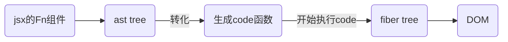
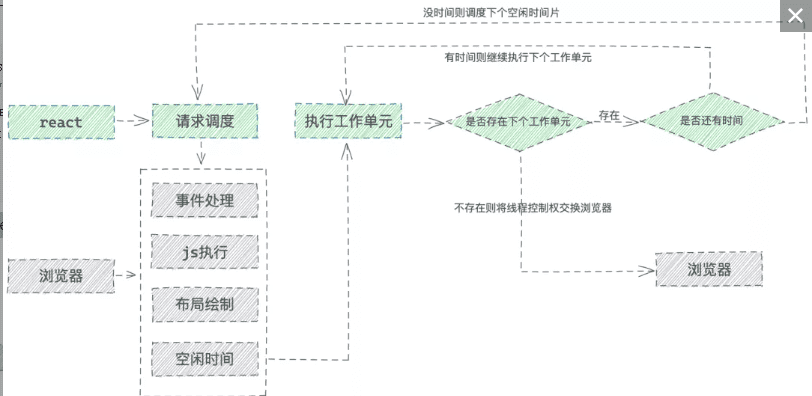
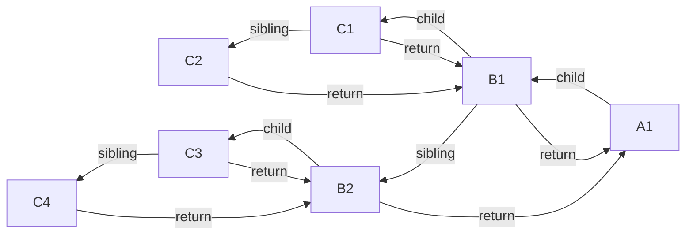
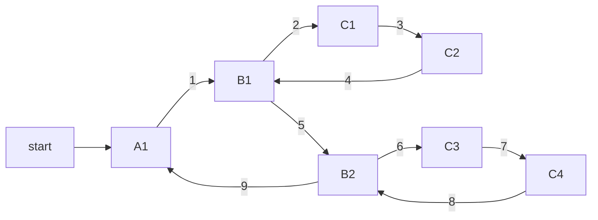
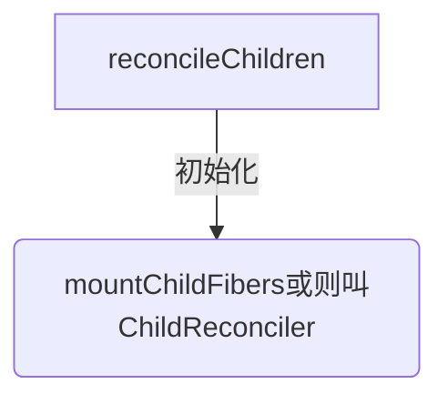
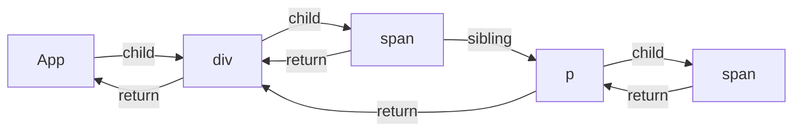

# 前言
## react 模板引擎

react初始化的时候使用babel 处理jsx模板组件，得到ast树的结构树,并转化为code函数

jsx 转换为了浏览器能够识别的原生js语法，为 react 后续对状态改变、事件响应以及页面更新等奠定了基础。

先看babel 的执行函数
```js
function transform(code, options) {
  console.log('=Babel-transform-参数:', { code })
  const babel_transform = Babel.transform(code, processOptions(options));
  console.log('=Babel-返回:', babel_transform)
  return babel_transform
}
```

01-mockData-babel返回.json
```json
{
"metadata":"",
"options":"",
"ignored":"",
"code":"",
"ast":"",
"map":""
}
```

## code:
```js
'use strict';

var _slicedToArray = function () { function sliceIterator(arr, i) { var _arr = []; var _n = true; var _d = false; var _e = undefined; try { for (var _i = arr[Symbol.iterator](), _s; !(_n = (_s = _i.next()).done); _n = true) { _arr.push(_s.value); if (i && _arr.length === i) break; } } catch (err) { _d = true; _e = err; } finally { try { if (!_n && _i["return"]) _i["return"](); } finally { if (_d) throw _e; } } return _arr; } return function (arr, i) { if (Array.isArray(arr)) { return arr; } else if (Symbol.iterator in Object(arr)) { return sliceIterator(arr, i); } else { throw new TypeError("Invalid attempt to destructure non-iterable instance"); } }; }();

console.log('=Babel:', Babel);
function Test() {
  console.log('test-render');

  var _React$useState = React.useState('改变我'),
    _React$useState2 = _slicedToArray(_React$useState, 2),
    data = _React$useState2[0],
    setData = _React$useState2[1];

  var _React$useState3 = React.useState(false),
    _React$useState4 = _slicedToArray(_React$useState3, 2),
    showDiv = _React$useState4[0],
    setShowDiv = _React$useState4[1];

  var onClickText = function onClickText() {
    console.log('=useState=onClick');
    setData('努力哦');
    setShowDiv(!showDiv);
  };

  var onClickText2 = function onClickText2() {
    console.log('=useState=onClick:', data);
  };

  React.useEffect(function () {
    console.log('=副作用-useEffect-->运行');
  }, []);

  React.useLayoutEffect(function () {
    console.log('=副作用-useLayoutEffect-->运行');
  }, []);

  return React.createElement(
    'div',
    { id: 'div1', className: 'c1' },
    React.createElement(
      'button',
      { onClick: onClickText, className: 'btn' },
      'Hello world,Click me'
    ),
    React.createElement(
      'span',
      null,
      data
    ),
    showDiv && React.createElement(
      'div',
      null,
      '\u88AB\u4F60\u53D1\u73B0\u4E86'
    ),
    React.createElement(
      'div',
      { id: 'div2', className: 'c2' },
      React.createElement(
        'p',
        null,
        '\u6D4B\u8BD5\u5B50\u8282\u70B9'
      )
    )
  );
}

var root = ReactDOM.createRoot(document.getElementById('root'));
console.log("=app=root:", root);
root.render(React.createElement(Test, null));
// 17 写法
// ReactDOM.render(<Test />, document.getElementById('root'))
```

```js
function createElement(type, config, children) {
  // console.log('=development调用createElement构建Ast树:', { type, config, children })
  console.log('%c=development调用createElement-1:type', 'color:blueviolet', type, { config, children })
  var propName; // Reserved names are extracted

  var props = {};
  var key = null;
  var ref = null;
  var self = null;
  var source = null;

  if (config != null) {
    if (hasValidRef(config)) {
      ref = config.ref;

      {
        warnIfStringRefCannotBeAutoConverted(config);
      }
    }

    if (hasValidKey(config)) {
      {
        checkKeyStringCoercion(config.key);
      }

      key = '' + config.key;
    }

    self = config.__self === undefined ? null : config.__self;
    source = config.__source === undefined ? null : config.__source; // Remaining properties are added to a new props object

    for (propName in config) {
      if (hasOwnProperty.call(config, propName) && !RESERVED_PROPS.hasOwnProperty(propName)) {
        props[propName] = config[propName];
      }
    }
  } // Children can be more than one argument, and those are transferred onto
  // the newly allocated props object.


  var childrenLength = arguments.length - 2;

  if (childrenLength === 1) {
    props.children = children;
  } else if (childrenLength > 1) {
    var childArray = Array(childrenLength);

    for (var i = 0; i < childrenLength; i++) {
      childArray[i] = arguments[i + 2];
    }

    {
      if (Object.freeze) {
        Object.freeze(childArray);
      }
    }

    props.children = childArray;
  } // Resolve default props


  if (type && type.defaultProps) {
    var defaultProps = type.defaultProps;

    for (propName in defaultProps) {
      if (props[propName] === undefined) {
        props[propName] = defaultProps[propName];
      }
    }
  }

  {
    if (key || ref) {
      var displayName = typeof type === 'function' ? type.displayName || type.name || 'Unknown' : type;

      if (key) {
        defineKeyPropWarningGetter(props, displayName);
      }

      if (ref) {
        defineRefPropWarningGetter(props, displayName);
      }
    }
  }
  const reactElementRes = ReactElement(type, key, ref, self, source, ReactCurrentOwner.current, props);
  console.log('=development调用createElement-2:返回:', reactElementRes)
  return reactElementRes
}
```

## workInProgress 构建
```js
  function createWorkInProgress(current, pendingProps) {
    var workInProgress = current.alternate;
    // 区分是在mount时还是在update时
    if (workInProgress === null) {
      // We use a double buffering pooling technique because we know that we'll
      // only ever need at most two versions of a tree. We pool the "other" unused
      // node that we're free to reuse. This is lazily created to avoid allocating
      // extra objects for things that are never updated. It also allow us to
      // reclaim the extra memory if needed.
      console.log('==createWorkInProgress-->,没有就创建一个')
      workInProgress = createFiber(current.tag, pendingProps, current.key, current.mode);
      console.log('==createWorkInProgress-->,没有就创建一个返回值', workInProgress)
      debugger
      workInProgress.elementType = current.elementType;
      workInProgress.type = current.type;
      workInProgress.stateNode = current.stateNode;

      {
        // DEV-only fields
        workInProgress._debugSource = current._debugSource;
        workInProgress._debugOwner = current._debugOwner;
        workInProgress._debugHookTypes = current._debugHookTypes;
      }
      console.log('==createWorkInProgress-->,workInProgress.alternate指定为current')
      workInProgress.alternate = current;
      current.alternate = workInProgress;
    } else {
      // 复用属性
      workInProgress.pendingProps = pendingProps; // Needed because Blocks store data on type.

      workInProgress.type = current.type; // We already have an alternate.
      // Reset the effect tag.

      workInProgress.flags = NoFlags; // The effects are no longer valid.

      workInProgress.subtreeFlags = NoFlags;
      workInProgress.deletions = null;

      {
        // We intentionally reset, rather than copy, actualDuration & actualStartTime.
        // This prevents time from endlessly accumulating in new commits.
        // This has the downside of resetting values for different priority renders,
        // But works for yielding (the common case) and should support resuming.
        workInProgress.actualDuration = 0;
        workInProgress.actualStartTime = -1;
      }
    } // Reset all effects except static ones.
    // Static effects are not specific to a render.


    workInProgress.flags = current.flags & StaticMask;
    // 复用属性
    workInProgress.childLanes = current.childLanes;
    workInProgress.lanes = current.lanes;
    workInProgress.child = current.child;
    workInProgress.memoizedProps = current.memoizedProps;
    workInProgress.memoizedState = current.memoizedState;
    workInProgress.updateQueue = current.updateQueue; // Clone the dependencies object. This is mutated during the render phase, so
    // it cannot be shared with the current fiber.

    var currentDependencies = current.dependencies;
    workInProgress.dependencies = currentDependencies === null ? null : {
      lanes: currentDependencies.lanes,
      firstContext: currentDependencies.firstContext
    }; // These will be overridden during the parent's reconciliation

    workInProgress.sibling = current.sibling;
    workInProgress.index = current.index;
    workInProgress.ref = current.ref;

    {
      workInProgress.selfBaseDuration = current.selfBaseDuration;
      workInProgress.treeBaseDuration = current.treeBaseDuration;
    }

    {
      workInProgress._debugNeedsRemount = current._debugNeedsRemount;

      switch (workInProgress.tag) {
        case IndeterminateComponent:
        case FunctionComponent:
        case SimpleMemoComponent:
          workInProgress.type = resolveFunctionForHotReloading(current.type);
          break;

        case ClassComponent:
          workInProgress.type = resolveClassForHotReloading(current.type);
          break;

        case ForwardRef:
          workInProgress.type = resolveForwardRefForHotReloading(current.type);
          break;
      }
    }

    return workInProgress;
  }
```

赋值：调用 prepareFreshStack
```js
  function renderRootSync(root, lanes) {

    var prevExecutionContext = executionContext;
    executionContext |= RenderContext;
    var prevDispatcher = pushDispatcher(); // If the root or lanes have changed, throw out the existing stack
    // and prepare a fresh one. Otherwise we'll continue where we left off.

    if (workInProgressRoot !== root || workInProgressRootRenderLanes !== lanes) {
      {
        if (isDevToolsPresent) {
          var memoizedUpdaters = root.memoizedUpdaters;

          if (memoizedUpdaters.size > 0) {
            restorePendingUpdaters(root, workInProgressRootRenderLanes);
            memoizedUpdaters.clear();
          } // At this point, move Fibers that scheduled the upcoming work from the Map to the Set.
          // If we bailout on this work, we'll move them back (like above).
          // It's important to move them now in case the work spawns more work at the same priority with different updaters.
          // That way we can keep the current update and future updates separate.


          movePendingFibersToMemoized(root, lanes);
        }

      }

      workInProgressTransitions = getTransitionsForLanes();

      console.log('workInProgress', workInProgress, root)
      debugger
      console.log('render调用 prepareFreshStack前',workInProgress)
      prepareFreshStack(root, lanes);
      console.log('workInProgress', workInProgress, root)
      console.log('render调用 prepareFreshStack后',workInProgress)
    }
```

### workInProgress 构建2：beginWork 第一次会调用updateHostRoot进行初始化:updateHostRoot

第二次才走 mountIndeterminateComponent 执行code()函数,此时的workInProgress.type 才有值
```js
  function beginWork(current, workInProgress, renderLanes) {
    console.log('workInProgress', workInProgress, root)
    debugger
    workInProgress.lanes = NoLanes;
    console.log('%c=beginWork()===start1-初始化', 'color:magenta', { getFiberName: getFiberName(workInProgress), current, renderLanes, workInProgress })
    switch (workInProgress.tag) {
      case IndeterminateComponent:
        {
          console.log('%c=beginWork()==end 2 mountIndeterminateComponent', 'color:magenta', workInProgress)
          console.log(`%c=探究初始和hook=调用mountIndeterminateComponent`, 'color:blueviolet', workInProgress.type)
          return mountIndeterminateComponent(current, workInProgress, workInProgress.type, renderLanes);
      }
      case HostRoot:
        console.log('%c=beginWork()=end 6第一次会走这里初始化workInProgress', 'color:magenta')
        console.log('%c=beginWork()=end 6 updateHostRoot', 'color:magenta')
        return updateHostRoot(current, workInProgress, renderLanes);
    }
  }
```

### 重点构建子节点：
reconcileChildren(current, workInProgress, nextChildren, renderLanes)-->reconcileChildren

```js
function updateHostRoot(current, workInProgress, renderLanes) {
  pushHostRootContext(workInProgress);

  if (current === null) {
    throw new Error('Should have a current fiber. This is a bug in React.');
  }

  var nextProps = workInProgress.pendingProps;
  var prevState = workInProgress.memoizedState;
  var prevChildren = prevState.element;
  cloneUpdateQueue(current, workInProgress);
  processUpdateQueue(workInProgress, nextProps, null, renderLanes);
  var nextState = workInProgress.memoizedState;
  var root = workInProgress.stateNode;
  // being called "element".


  var nextChildren = nextState.element;

  if (prevState.isDehydrated) {
  } else {
      // Root is not dehydrated. Either this is a client-only root, or it
      // already hydrated.
      resetHydrationState();

      if (nextChildren === prevChildren) {
        return bailoutOnAlreadyFinishedWork(current, workInProgress, renderLanes);
      }

      console.log('=reconcileChildren 9')
      debugger
      reconcileChildren(current, workInProgress, nextChildren, renderLanes);
      console.log('%c=updateHostRoot:构建之后workInProgress.child', 'color:black', { child })
  }
  console.log('%c=updateHostRoot:最后返回workInProgress.child', 'color:black', workInProgress.child)

  return workInProgress.child;
}
```

```js
function reconcileChildren(current, workInProgress, nextChildren, renderLanes) {
  if (current === null) {
    // If this is a fresh new component that hasn't been rendered yet, we
    // won't update its child set by applying minimal side-effects. Instead,
    // we will add them all to the child before it gets rendered. That means
    // we can optimize this reconciliation pass by not tracking side-effects.
    console.log('%c=reconcileChildren mount', 'blueviolet');
    workInProgress.child = mountChildFibers(workInProgress, null, nextChildren, renderLanes);
    console.log('%c=reconcileChildren mount 返回值workInProgress.child', 'blueviolet', workInProgress.child);
  } else {
    // If the current child is the same as the work in progress, it means that
    // we haven't yet started any work on these children. Therefore, we use
    // the clone algorithm to create a copy of all the current children.
    // If we had any progressed work already, that is invalid at this point so
    // let's throw it out.
    console.log('%c=reconcileChildren update', 'yellow');
    workInProgress.child = reconcileChildFibers(workInProgress, current.child, nextChildren, renderLanes);
  }
}
```

很长的函数: reconcileChildren->reconcileChildFibers
```js
  function ChildReconciler(shouldTrackSideEffects) {
    // 省略
    function reconcileChildFibers(returnFiber, currentFirstChild, newChild, lanes) {
      // This function is not recursive.
      // If the top level item is an array, we treat it as a set of children,
      // not as a fragment. Nested arrays on the other hand will be treated as
      // fragment nodes. Recursion happens at the normal flow.
      // Handle top level unkeyed fragments as if they were arrays.
      // This leads to an ambiguity between <>{[...]}</> and <>...</>.
      // We treat the ambiguous cases above the same.
      var isUnkeyedTopLevelFragment = typeof newChild === 'object' && newChild !== null && newChild.type === REACT_FRAGMENT_TYPE && newChild.key === null;

      console.log('%c=reconcileChildFibers A', 'blueviolet');

      if (isUnkeyedTopLevelFragment) {
        newChild = newChild.props.children;
      } // Handle object types


      if (typeof newChild === 'object' && newChild !== null) {
        switch (newChild.$$typeof) {
          case REACT_ELEMENT_TYPE:
            return placeSingleChild(reconcileSingleElement(returnFiber, currentFirstChild, newChild, lanes));

          case REACT_PORTAL_TYPE:
            return placeSingleChild(reconcileSinglePortal(returnFiber, currentFirstChild, newChild, lanes));

          case REACT_LAZY_TYPE:
            var payload = newChild._payload;
            var init = newChild._init; // TODO: This function is supposed to be non-recursive.

            return reconcileChildFibers(returnFiber, currentFirstChild, init(payload), lanes);
        }

        if (isArray(newChild)) {
          return reconcileChildrenArray(returnFiber, currentFirstChild, newChild, lanes);
        }

        if (getIteratorFn(newChild)) {
          return reconcileChildrenIterator(returnFiber, currentFirstChild, newChild, lanes);
        }

        throwOnInvalidObjectType(returnFiber, newChild);
      }

      if (typeof newChild === 'string' && newChild !== '' || typeof newChild === 'number') {
        return placeSingleChild(reconcileSingleTextNode(returnFiber, currentFirstChild, '' + newChild, lanes));
      }

      {
        if (typeof newChild === 'function') {
          warnOnFunctionType(returnFiber);
        }
      } // Remaining cases are all treated as empty.


      return deleteRemainingChildren(returnFiber, currentFirstChild);
    }

    return reconcileChildFibers;
  }
```

## beginWork第二次之case IndeterminateComponent
第二次beginWork进入case IndeterminateComponent 执行 mountIndeterminateComponent(),可见深度遍历从父级组件开始

首先要注意的是，虽然 App 是一个 FunctionComponent，但是在 first paint 的时候，React 判断其为 IndeterminateComponent

对于 FunctionComponent，在第一次识别的时候会被认为是 IndeterminateComponent

一个函数，只要返回的是一个对象且对象中有 render 方法，就认为是 ClassComponent，否则就是 FunctionComponent

```js
    switch (workInProgress.tag) {
      case IndeterminateComponent:
        {
          console.log('%c=beginWork()==end 2 mountIndeterminateComponent', 'color:magenta')
          console.log(`%c=探究初始和hook=调用mountIndeterminateComponent`, 'color:blueviolet')
          return mountIndeterminateComponent(current, workInProgress, workInProgress.type, renderLanes);
        }
```

```js
function beginWork(current, workInProgress, renderLanes) {
    workInProgress.lanes = NoLanes;
    console.log('%c=beginWork()===start1-初始化', 'color:magenta', { getFiberName: getFiberName(workInProgress), current, renderLanes, workInProgress })
    switch (workInProgress.tag) {
      case IndeterminateComponent:
        {
          console.log('%c=beginWork()==end 2 mountIndeterminateComponent', 'color:magenta')
          console.log(`%c=探究初始和hook=调用mountIndeterminateComponent`, 'color:blueviolet')
          return mountIndeterminateComponent(current, workInProgress, workInProgress.type, renderLanes);
        }

      case LazyComponent:
        {
          var elementType = workInProgress.elementType;
          console.log('%c=beginWork()=end 3 mountLazyComponent', 'color:magenta')
          return mountLazyComponent(current, workInProgress, elementType, renderLanes);
        }

      case FunctionComponent:
        {
          var Component = workInProgress.type;
          var unresolvedProps = workInProgress.pendingProps;
          var resolvedProps = workInProgress.elementType === Component ? unresolvedProps : resolveDefaultProps(Component, unresolvedProps);
          console.log('%c=beginWork()=end 4只有更新才会调用updateFunctionComponent', 'color:magenta')
          return updateFunctionComponent(current, workInProgress, Component, resolvedProps, renderLanes);
        }

      case ClassComponent:
        {
          var _Component = workInProgress.type;
          var _unresolvedProps = workInProgress.pendingProps;

          var _resolvedProps = workInProgress.elementType === _Component ? _unresolvedProps : resolveDefaultProps(_Component, _unresolvedProps);
          console.log('%c=beginWork()=end 5 updateClassComponent', 'color:magenta')
          return updateClassComponent(current, workInProgress, _Component, _resolvedProps, renderLanes);
        }

      case HostRoot:
        console.log('%c=beginWork()=end 6 updateHostRoot', 'color:magenta')
        return updateHostRoot(current, workInProgress, renderLanes);

      case HostComponent:
        console.log(`%c=beginWork()=end 7 updateHostComponent$1,即原生 DOM 组件对应的 Fiber节点:`, 'color:magenta', { type: workInProgress.type })
        return updateHostComponent$1(current, workInProgress, renderLanes);

      case HostText:
        console.log('%c=beginWork()=end 8 updateHostText$1', 'color:magenta')
        return updateHostText$1(current, workInProgress);

      case SuspenseComponent:
        console.log('%c=beginWork()=end 9 updateSuspenseComponent', 'color:magenta')
        return updateSuspenseComponent(current, workInProgress, renderLanes);

      case HostPortal:
        console.log('%c=beginWork()=end 10 updatePortalComponent', 'color:magenta')
        return updatePortalComponent(current, workInProgress, renderLanes);

      case ForwardRef:
        {
          var type = workInProgress.type;
          var _unresolvedProps2 = workInProgress.pendingProps;

          var _resolvedProps2 = workInProgress.elementType === type ? _unresolvedProps2 : resolveDefaultProps(type, _unresolvedProps2);

          console.log('%c=beginWork()=end 11 updateForwardRef', 'color:magenta')
          return updateForwardRef(current, workInProgress, type, _resolvedProps2, renderLanes);
        }

      case Fragment:
        console.log('%c=beginWork()=end 12 updateFragment', 'color:magenta')
        return updateFragment(current, workInProgress, renderLanes);

      case Mode:
        console.log('%c=beginWork()=end 13 updateMode', 'color:magenta')
        return updateMode(current, workInProgress, renderLanes);

      case Profiler:
        console.log('%c=beginWork()=end 14 updateProfiler', 'color:magenta')
        return updateProfiler(current, workInProgress, renderLanes);

      case ContextProvider:
        console.log('%c=beginWork()=end 15 updateContextProvider', 'color:magenta')
        return updateContextProvider(current, workInProgress, renderLanes);

      case ContextConsumer:
        console.log('%c=beginWork()=end 16 updateContextConsumer', 'color:magenta')
        return updateContextConsumer(current, workInProgress, renderLanes);

      case MemoComponent:
        {
          var _type2 = workInProgress.type;
          var _unresolvedProps3 = workInProgress.pendingProps; // Resolve outer props first, then resolve inner props.

          var _resolvedProps3 = resolveDefaultProps(_type2, _unresolvedProps3);

          {
            if (workInProgress.type !== workInProgress.elementType) {
              var outerPropTypes = _type2.propTypes;

              if (outerPropTypes) {
                checkPropTypes(outerPropTypes, _resolvedProps3, // Resolved for outer only
                  'prop', getComponentNameFromType(_type2));
              }
            }
          }

          _resolvedProps3 = resolveDefaultProps(_type2.type, _resolvedProps3);
          console.log('%c=beginWork()=end 17 updateMemoComponent', 'color:magenta')
          return updateMemoComponent(current, workInProgress, _type2, _resolvedProps3, renderLanes);
        }

      case SimpleMemoComponent:
        {
          console.log('%c=beginWork()=end 18 updateSimpleMemoComponent', 'color:magenta')
          return updateSimpleMemoComponent(current, workInProgress, workInProgress.type, workInProgress.pendingProps, renderLanes);
        }

      case IncompleteClassComponent:
        {
          var _Component2 = workInProgress.type;
          var _unresolvedProps4 = workInProgress.pendingProps;

          var _resolvedProps4 = workInProgress.elementType === _Component2 ? _unresolvedProps4 : resolveDefaultProps(_Component2, _unresolvedProps4);
          console.log('%c=beginWork()=end 19 mountIncompleteClassComponent', 'color:magenta')
          return mountIncompleteClassComponent(current, workInProgress, _Component2, _resolvedProps4, renderLanes);
        }

      case SuspenseListComponent:
        {
          console.log('%c=beginWork()=end 20 updateSuspenseListComponent', 'color:magenta')
          return updateSuspenseListComponent(current, workInProgress, renderLanes);
        }

      case ScopeComponent:
        {

          break;
        }

      case OffscreenComponent:
        {
          console.log('%c=beginWork()=end 21 updateOffscreenComponent', 'color:magenta')
          return updateOffscreenComponent(current, workInProgress, renderLanes);
        }
    }
    throw new Error("Unknown unit of work tag (" + workInProgress.tag + "). This error is likely caused by a bug in " + 'React. Please file an issue.');
  }
}
```

### 重点：code函数初始化在renderWithHooks这里执行

mountIndeterminateComponent 
* 调用  renderWithHooks 生成 value
* 执行 reconcileChildren(null, workInProgress, value, renderLanes) 参数value


关键的函数 renderWithHooks；而在 renderWithHooks 中，我们会根据组件处于不同的状态，给 ReactCurrentDispatcher.current 挂载不同的 dispatcher 。而在first paint 时，挂载的是HooksDispatcherOnMountInDEV

HooksDispatcherOnMountInDEV 里就是组件 first paint 的时候所用到的各种 hooks
```js
function mountIndeterminateComponent(_current, workInProgress, Component, renderLanes) {
    // 省略
    setIsRendering(true);
    ReactCurrentOwner$1.current = workInProgress;
    console.log(`%c=探究初始和hook=mountIndeterminateComponent调用renderWithHooks 1`, 'color:blueviolet', { workInProgress, Component, props, context, renderLanes })
    value = renderWithHooks(null, workInProgress, Component, props, context, renderLanes);
    console.log(`%c=探究初始和hook=mountIndeterminateComponent调用renderWithHooks 返回值`, 'color:blueviolet', { value })
    // 省略

   if (getIsHydrating() && hasId) {
        pushMaterializedTreeId(workInProgress);
      }
      console.log('%c=reconcileChildren 12:重点，mountIndeterminateComponent调用reconcileChildren', 'color:red')
      reconcileChildren(null, workInProgress, value, renderLanes);

      {
        validateFunctionComponentInDev(workInProgress, Component);
      }

      return workInProgress.child;
    }
  }
}
```
```js
function renderWithHooks(current, workInProgress, Component, props, secondArg, nextRenderLanes) {
    // 省略：
    console.log(`%c=探究初始和hook=renderWithHooks重点，调用函数组件，里面执行各种 React Hook==start并返回 ReactElement`, 'color:blueviolet', Component)
    var children = Component(props, secondArg); // Check if there was a render phase update
    console.log(`%c=探究初始和hook=renderWithHooks重点,返回 ReactElement==end`, 'color:blueviolet', { children })
    // 省略：
    return children;
}
```

初始化-->mountChildFibers
```js
function reconcileChildren(current, workInProgress, nextChildren, renderLanes) {
  if (current === null) {
    // If this is a fresh new component that hasn't been rendered yet, we
    // won't update its child set by applying minimal side-effects. Instead,
    // we will add them all to the child before it gets rendered. That means
    // we can optimize this reconciliation pass by not tracking side-effects.
    console.log('%c=reconcileChildren mount', 'blueviolet');
    workInProgress.child = mountChildFibers(workInProgress, null, nextChildren, renderLanes);
    console.log('%c=reconcileChildren mount 返回值workInProgress.child', 'blueviolet',workInProgress.child);
  } else {
    // If the current child is the same as the work in progress, it means that
    // we haven't yet started any work on these children. Therefore, we use
    // the clone algorithm to create a copy of all the current children.
    // If we had any progressed work already, that is invalid at this point so
    // let's throw it out.
    console.log('%c=reconcileChildren update', 'yellow');
    workInProgress.child = reconcileChildFibers(workInProgress, current.child, nextChildren, renderLanes);
  }
}
```


### ChildReconciler
从该函数名就能看出这是Reconciler模块的核心部分。那么他究竟做了什么呢？
* 对于 mount 的组件，他会创建新的子 Fiber 节点；
* 对于 update 的组件，他会将当前组件与该组件在上次更新时对应的 Fiber 节点比较（也就是俗称的Diff 算法），将比较的结果生成新 Fiber 节点。

不论走哪个逻辑，最终他会生成新的子 Fiber 节点并赋值给workInProgress.child，作为本次 beginWork 返回值，并作为下次performUnitOfWork执行时workInProgress的传参。

mountChildFibers与reconcileChildFibers这两个方法的逻辑基本一致。唯一的区别是：reconcileChildFibers 会为生成的 Fiber 节点带上effectTag属性，而 mountChildFibers 不会。
```js
var mountChildFibers = ChildReconciler(false);

// 这个代码很长 1k
function ChildReconciler(shouldTrackSideEffects) {

}
```

root.render(React.createElement(Test, null));
调用的参数是：React.createElement(Test, null)处理之后的：
```js
var ReactElement = function (type, key, ref, self, source, owner, props) {
    var element = {
      // This tag allows us to uniquely identify this as a React Element
      $$typeof: REACT_ELEMENT_TYPE,
      // Built-in properties that belong on the element
      type: type,
      key: key,
      ref: ref,
      props: props,
      // Record the component responsible for creating this element.
      _owner: owner
    };

    return element;
}
```

## 第三次 beginWork
此时构建 code() 生成的节点
```js
      case HostComponent:
        console.log(`%c=beginWork()=end 7 updateHostComponent$1,即原生 DOM 组件对应的 Fiber节点:`, 'color:magenta', { type: workInProgress.type })
        return updateHostComponent$1(current, workInProgress, renderLanes);
```

此时 workInProgress
```
actualDuration:0
actualStartTime:-1
alternate:null
child:null
childLanes:0
deletions: null
dependencies: null
elementType:"div"
flags: 0
index : 0
key : null
lanes : 0
memoizedProps:null
memoizedState:null
mode:1
pendingProps:{id: 'div1', className: 'c1', children: Array(4)}
ref:null
return:FiberNode {tag: 0, key: null, stateNode: null, elementType: ƒ, type: ƒ, …}
selfBaseDuration:0,
sibling:null
stateNode:null
subtreeFlags:0
tag:5
treeBaseDuration:0
type:"div"
updateQueue:null
```

```js
function updateHostComponent$1(current, workInProgress, renderLanes) {
  pushHostContext(workInProgress);

  if (current === null) {
    tryToClaimNextHydratableInstance(workInProgress);
  }

  var type = workInProgress.type;
  var nextProps = workInProgress.pendingProps;
  var prevProps = current !== null ? current.memoizedProps : null;
  var nextChildren = nextProps.children;
  var isDirectTextChild = shouldSetTextContent(type, nextProps);

  if (isDirectTextChild) {
    // We special case a direct text child of a host node. This is a common
    // case. We won't handle it as a reified child. We will instead handle
    // this in the host environment that also has access to this prop. That
    // avoids allocating another HostText fiber and traversing it.
    nextChildren = null;
  } else if (prevProps !== null && shouldSetTextContent(type, prevProps)) {
    // If we're switching from a direct text child to a normal child, or to
    // empty, we need to schedule the text content to be reset.
    workInProgress.flags |= ContentReset;
  }

  markRef$1(current, workInProgress);
  console.log('=reconcileChildren 11')
  reconcileChildren(current, workInProgress, nextChildren, renderLanes);
  return workInProgress.child;
}
```


### React.createElement 旧api
https://cloud.tencent.com/developer/article/2135083
react17 之后我们可以不再依赖 React.createElement 这个 api 了，但是实际场景中以及很多开源包中可能会有很多通过 React.createElement 手动创建元素的场景:

React.createElement 其接收三个或以上参数：

* type：要创建的 React 元素类型，可以是标签名称字符串，如 'div' 或者 'span' 等；也可以是 React组件 类型(class组件或者函数组件)；或者是 React fragment 类型。
* config：写在标签上的属性的集合，js 对象格式，若标签上未添加任何属性则为 null。
* children：从第三个参数开始后的参数为当前创建的React元素的子节点，每个参数的类型，若是当前元素节点的 textContent 则为字符串类型；否则为新的 React.createElement 创建的元素。

## 开始


## 接上面updateContainer
fiber 协调过程,构建fiber树的阶段可中断


## commit阶段
commit阶段之beforeMutation和mutation阶段


commit阶段之layout最后阶段


## 开始1

```js
const root = ReactDOM.createRoot(document.getElementById('root'))
console.log("=app=root:", root)
root.render(<Test />);

function createRoot(container, options) {
		// 省略
    console.log('%c=一切开始1:createRoot(', 'color:red', { createRoot: container, options })
    var root = createContainer(container, ConcurrentRoot, null, isStrictMode, concurrentUpdatesByDefaultOverride, identifierPrefix, onRecoverableError);
    markContainerAsRoot(root.current, container);
    var rootContainerElement = container.nodeType === COMMENT_NODE ? container.parentNode : container;
    listenToAllSupportedEvents(rootContainerElement);
    return new ReactDOMRoot(root);
}

function createContainer(containerInfo, tag, hydrationCallbacks, isStrictMode, concurrentUpdatesByDefaultOverride, identifierPrefix, onRecoverableError, transitionCallbacks) {
	var hydrate = false;
	var initialChildren = null;
	console.log('初始/更新-->FiberRoot:a-->createContainer')
	return createFiberRoot(containerInfo, tag, hydrate, initialChildren, hydrationCallbacks, isStrictMode, concurrentUpdatesByDefaultOverride, identifierPrefix, onRecoverableError);
}
```

FiberRootNode是初始化相关只调用一次
```js
function createFiberRoot(containerInfo, tag, hydrate, initialChildren, hydrationCallbacks, isStrictMode, concurrentUpdatesByDefaultOverride, // TODO: We have several of these arguments that are conceptually part of the
	// host config, but because they are passed in at runtime, we have to thread
	// them through the root constructor. Perhaps we should put them all into a
	// single type, like a DynamicHostConfig that is defined by the renderer.
	identifierPrefix, onRecoverableError, transitionCallbacks) {
	var root = new FiberRootNode(containerInfo, tag, hydrate, identifierPrefix, onRecoverableError);

	return root;
}

function FiberRootNode(containerInfo, tag, hydrate, identifierPrefix, onRecoverableError) {
	console.log('==FiberRootNode是初始化相关只调用一次===')
	this.tag = tag;
	this.containerInfo = containerInfo;
	this.pendingChildren = null;
	this.current = null;
	this.pingCache = null;
	this.finishedWork = null;
	this.timeoutHandle = noTimeout;
	this.context = null;
	this.pendingContext = null;
	this.callbackNode = null;
	this.callbackPriority = NoLane;
	this.eventTimes = createLaneMap(NoLanes);
	this.expirationTimes = createLaneMap(NoTimestamp);
	this.pendingLanes = NoLanes;
	this.suspendedLanes = NoLanes;
	this.pingedLanes = NoLanes;
	this.expiredLanes = NoLanes;
	this.mutableReadLanes = NoLanes;
	this.finishedLanes = NoLanes;
	this.entangledLanes = NoLanes;
	this.entanglements = createLaneMap(NoLanes);
	this.identifierPrefix = identifierPrefix;
	this.onRecoverableError = onRecoverableError;

	{
		this.mutableSourceEagerHydrationData = null;
	}

	{
		this.effectDuration = 0;
		this.passiveEffectDuration = 0;
	}

	{
		this.memoizedUpdaters = new Set();
		var pendingUpdatersLaneMap = this.pendingUpdatersLaneMap = [];

		for (var _i = 0; _i < TotalLanes; _i++) {
			pendingUpdatersLaneMap.push(new Set());
		}
	}

	{
		switch (tag) {
			case ConcurrentRoot:
				this._debugRootType = hydrate ? 'hydrateRoot()' : 'createRoot()';
				break;

			case LegacyRoot:
				this._debugRootType = hydrate ? 'hydrate()' : 'render()';
				break;
		}
	}
}
```

可见children 就是根节点
```js
ReactDOMHydrationRoot.prototype.render = ReactDOMRoot.prototype.render = function (children) {
	console.log('%c=一切开始3:', 'color:red', 'ReactDOMRoot.prototype.render调用updateContainer()开启render阶段==', { children });
	var root = this._internalRoot;
	// 省略函数
	updateContainer(children, root, null, null);
};
```

## 开始2 updateContainer(
```js
function updateContainer(element, container, parentComponent, callback) {
	{
		onScheduleRoot(container, element);
	}

	var current$1 = container.current;
	var eventTime = requestEventTime();
	var lane = requestUpdateLane(current$1);

	{
		markRenderScheduled(lane);
	}

	var context = getContextForSubtree(parentComponent);

	if (container.context === null) {
		container.context = context;
	} else {
		container.pendingContext = context;
	}

	// 省略
	var update = createUpdate(eventTime, lane); // Caution: React DevTools currently depends on this property
	// being called "element".

	update.payload = {
		element: element
	};
	callback = callback === undefined ? null : callback;


	// 省略
	console.log('==render阶段准备：updateContainer调用enqueueUpdate()和scheduleUpdateOnFiber()==')
	enqueueUpdate(current$1, update);
	var root = scheduleUpdateOnFiber(current$1, lane, eventTime);

	if (root !== null) {
		entangleTransitions(root, current$1, lane);
	}

	return lane;
}
```

```js
function scheduleUpdateOnFiber(fiber, lane, eventTime) {
	var root = markUpdateLaneFromFiberToRoot(fiber, lane);
	console.log('==render阶段准备:scheduleUpdateOnFiber()调用ensureRootIsScheduled()==')
	ensureRootIsScheduled(root, eventTime);
	return root;
}
```

```js
function ensureRootIsScheduled(root, currentTime) {
	// 省略
	if (newCallbackPriority === SyncLane) {
		// Special case: Sync React callbacks are scheduled on a special
		// internal queue
		if (root.tag === LegacyRoot) {
			if (ReactCurrentActQueue$1.isBatchingLegacy !== null) {
				ReactCurrentActQueue$1.didScheduleLegacyUpdate = true;
			}

			console.log('%c=render阶段准备:ensureRootIsScheduled调用performSyncWorkOnRoot：异步更新legacy模式1==', 'color:red')
			scheduleLegacySyncCallback(performSyncWorkOnRoot.bind(null, root));
		} else {

			console.log('%c=render阶段准备:ensureRootIsScheduled调用performSyncWorkOnRoot：异步更新legacy模式2==', 'color:red')
			scheduleSyncCallback(performSyncWorkOnRoot.bind(null, root));
		}

		// 省略
	} else {
		// 省略
		// console.log('更新流程-->0-c2: performConcurrentWorkOnRoot')
		console.log('%c=render阶段准备:', 'color:red', 'ensureRootIsScheduled()调用performConcurrentWorkOnRoot--同步更新:concurrent模式==')
		newCallbackNode = scheduleCallback$1(schedulerPriorityLevel, performConcurrentWorkOnRoot.bind(null, root));
	}

	root.callbackPriority = newCallbackPriority;
	root.callbackNode = newCallbackNode;
}
```

### performConcurrentWorkOnRoot 这个函数在render结束会开启commit阶段
```js
function performConcurrentWorkOnRoot(root, didTimeout) {
	// 省略
	console.log('%c==render阶段准备:重点函数performConcurrentWorkOnRoot,这个函数在render结束会开启commit阶段', 'color:red', 'color:cyan');

	console.log('==render阶段准备:performConcurrentWorkOnRoot调用renderRootSync():同步更新concurrent模式:', { shouldTimeSlice });
	var exitStatus = shouldTimeSlice ? renderRootConcurrent(root, lanes) : renderRootSync(root, lanes);

	if (exitStatus !== RootInProgress) {
		// 省略

		if (exitStatus === RootDidNotComplete) {
			markRootSuspended$1(root, lanes);
		} else {
			// 省略

			root.finishedWork = finishedWork;
			root.finishedLanes = lanes;
			console.log(`%c=commit阶段=前=render阶段结束=performConcurrentWorkOnRoot调用finishConcurrentRender-->commitRoot`, 'color:cyan')
			finishConcurrentRender(root, exitStatus, lanes);
		}
	}

	// 省略

	return null;
}
```

```js
function renderRootSync(root, lanes) {
	var prevExecutionContext = executionContext;
	executionContext |= RenderContext;
	var prevDispatcher = pushDispatcher(); // If the root or lanes have changed, throw out the existing stack
	// 省略

	do {
		try {
			console.log('%c=render阶段准备:', 'color:red', 'renderRootSync()调用workLoopSync()-root:', { root });
			workLoopSync();
			break;
		} catch (thrownValue) {
			handleError(root, thrownValue);
		}
	} while (true);

	// 省略
	workInProgressRoot = null;
	workInProgressRootRenderLanes = NoLanes;
	return workInProgressRootExitStatus;
}
```

图例


# 基础
* react把每个fiber当成生成fiber最小单元,只要迭代所有fiber则到顶级Fiber时整颗FiberTree便生成了。

## 遍历流程
Tree 构建的遍历顺序，它会以旧的fiber tree为蓝本，把每个fiber作为一个工作单元，自顶向下逐节点构造workInProgress tree（构建中的新fiber tree）:

深度优先遍历
1. 从顶点开始遍历
2. 如果有子节点，先遍历子节点；
3. 如果没有子节点，则看有没有兄弟节点，有则遍历兄弟节点，并把effect向上归并
4. 如果没有兄弟节点，则看有没有父兄弟节点，有则遍历父兄弟节点
5. 如果没有都没有了，那么遍历结束


## workInProgress 内存中构建的树和双缓存
真实dom对应在内存中的Fiber节点形成Fiber树:current Fiber

workInProgress Fiber和current Fiber这两颗树的节点通过alternate相连.
```
performUnitOfWork 作用创建下一个 Fiber 节点，并赋值给 workInProgress，同时把 workInProgress 与已创建的 Fiber 节点连接起来构成 Fiber 树。

workInProgress fiber tree：内存中构建的树。
更新过程中构建的 new fiber tree

current fiber tree：正在视图层渲染的树。
old fiber tree，对应当前屏幕显示的内容，通过根节点 fiberRootNode 的 currrent 指针可以访问。
```

### 双缓存，以current tree为主，workInProgress tree为辅。
双缓冲机制是React管理更新工作的一种手段，也是提升用户体验的重要机制。

当React开始更新工作之后，会有两个fiber树，一个current树，是当前显示在页面上内容对应的fiber树。另一个是workInProgress树，它是依据current树深度优先遍历构建出来的新的fiber树，所有的更新最终都会体现在workInProgress树上。当更新未完成的时候，页面上始终展示current树对应的内容，当更新结束时（commit阶段的最后），页面内容对应的fiber树会由current树切换到workInProgress树，此时workInProgress树即成为新的current树。

最终commit阶段完成时，两棵树会进行切换。
在未更新完成时依旧展示旧内容，保持交互，当更新完成立即切换到新内容，这样可以做到新内容和旧内容无缝切换。

渲染流程中，先复用current树（rootFiber）的alternate 作为 workInProgress。
构建workInProgress Fiber发生在createWorkInProgress中，它能创建或者复用Fiber
```js
  function createWorkInProgress(current, pendingProps) {
    var workInProgress = current.alternate;
    // 区分是在mount时还是在update时
    if (workInProgress === null) {
      // We use a double buffering pooling technique because we know that we'll
      // only ever need at most two versions of a tree. We pool the "other" unused
      // node that we're free to reuse. This is lazily created to avoid allocating
      // extra objects for things that are never updated. It also allow us to
      // reclaim the extra memory if needed.
      console.log('==createWorkInProgress-->,没有就创建一个')
      workInProgress = createFiber(current.tag, pendingProps, current.key, current.mode);
      workInProgress.elementType = current.elementType;
      workInProgress.type = current.type;
      workInProgress.stateNode = current.stateNode;

      {
        // DEV-only fields
        workInProgress._debugSource = current._debugSource;
        workInProgress._debugOwner = current._debugOwner;
        workInProgress._debugHookTypes = current._debugHookTypes;
      }
      console.log('==createWorkInProgress-->,workInProgress.alternate指定为current')
      workInProgress.alternate = current;
      current.alternate = workInProgress;
    } else {
      // 复用属性
      workInProgress.pendingProps = pendingProps; // Needed because Blocks store data on type.

      workInProgress.type = current.type; // We already have an alternate.
      // Reset the effect tag.

      workInProgress.flags = NoFlags; // The effects are no longer valid.

      workInProgress.subtreeFlags = NoFlags;
      workInProgress.deletions = null;

      {
        // We intentionally reset, rather than copy, actualDuration & actualStartTime.
        // This prevents time from endlessly accumulating in new commits.
        // This has the downside of resetting values for different priority renders,
        // But works for yielding (the common case) and should support resuming.
        workInProgress.actualDuration = 0;
        workInProgress.actualStartTime = -1;
      }
    } // Reset all effects except static ones.
    // Static effects are not specific to a render.


    workInProgress.flags = current.flags & StaticMask;
    // 复用属性
    workInProgress.childLanes = current.childLanes;
    workInProgress.lanes = current.lanes;
    workInProgress.child = current.child;
    workInProgress.memoizedProps = current.memoizedProps;
    workInProgress.memoizedState = current.memoizedState;
    workInProgress.updateQueue = current.updateQueue; // Clone the dependencies object. This is mutated during the render phase, so
    // it cannot be shared with the current fiber.

    var currentDependencies = current.dependencies;
    workInProgress.dependencies = currentDependencies === null ? null : {
      lanes: currentDependencies.lanes,
      firstContext: currentDependencies.firstContext
    }; // These will be overridden during the parent's reconciliation

    workInProgress.sibling = current.sibling;
    workInProgress.index = current.index;
    workInProgress.ref = current.ref;

    {
      workInProgress.selfBaseDuration = current.selfBaseDuration;
      workInProgress.treeBaseDuration = current.treeBaseDuration;
    }

    {
      workInProgress._debugNeedsRemount = current._debugNeedsRemount;

      switch (workInProgress.tag) {
        case IndeterminateComponent:
        case FunctionComponent:
        case SimpleMemoComponent:
          workInProgress.type = resolveFunctionForHotReloading(current.type);
          break;

        case ClassComponent:
          workInProgress.type = resolveClassForHotReloading(current.type);
          break;

        case ForwardRef:
          workInProgress.type = resolveForwardRefForHotReloading(current.type);
          break;
      }
    }

    return workInProgress;
  } // Used to reuse a Fiber for a second pass.
```

## 基础2：Diff
diff本质上是一些计算（遍历、比较），是可拆分的（算一半待会儿接着算） 

diff的过程，也就是effect的收集过程，此过程会找出所有节点的变更，如节点新增、删除、属性变更等，这些变更 react 统称为副作用（effect），随着所有的节点（工作单元）在帧空闲时间逐个执行完毕，最后产出的结果是effect list，从中可以知道哪些节点更新、哪些节点增加、哪些节点删除了。

diff 比较，就是在构建 workInProgress fiber tree 的过程中，判断 current fiber tree 中的 fiber node 是否可以被 workInProgress fiber tree 复用。

能被复用，意味在本次更新中，需要做: 组件的 update 以及 dom 节点的 move、update 等操作；

不可复用，则意味着需要做: 组件的 mount、unmount 以及 dom 节点的 insert、delete 等操作。

当更新完成以后，fiberRootNode 的 current 指针会指向 workInProgress fiber tree，作为下一次更新的 current fiber tree

最后，深度调和子节点，渲染视图
遍历fiber树，以workInProgress 作为最新的渲染树，即current Fiber 树。

# 一. 构建AST
## 流程1.  jsx语法糖的html结构是通过babel将结构解析转换为 ast 语法树结构
* react 18中：使用 babel将jsx代码转换为root.render()调用,此时就得到转化后的Ast树结构

* react17中 使用 babel将jsx代码转换为React.createElement()调用,此时就得到转化后的Ast树结构

## 转化测试:
https://www.babeljs.cn/repl

### 简单实例1:babel将jsx代码转换为React.createElement()调用
测试：https://www.babeljs.cn/repl
```jsx
// jsx
const element = <h1 style = {{"color": "red"}}>123
    <div>test</div>
</h1>

// babel 编译过后生成的代码
const element = /*#__PURE__*/React.createElement("h1", {
  style: {
    "color": "red"
  }
}, "123", /*#__PURE__*/React.createElement("div", null, "test"));
```

### 简单实例2:不使用babel
渲染代码：example-code\例-1-jsx-ast-r17.html
```html
<script>
const container = document.getElementById('root');
const element = React.createElement(
    'div',
    { className: 'red' },
    'Click Me'
)
console.log('createElement 转化后ast树的结构:', element)
ReactDOM.render(element, container)
/*
{
    $$typeof: Symbol(react.element)
    key: null
    props:
    children: "Click Me"
    className: "red"
    [[Prototype]]: Object
    ref: null
    type: "div"
    _owner: null
    _store: {validated: false}\
}
*/
</script>
```

### 简单实例3：使用babel
渲染代码：example-code\例4-在html-使用babel转义jsx.html
```html
<script type="text/babel">
  function Test() {
    return (
      <div className="red">Click Me</div>
    )
  }

  ReactDOM.render(<Test />, document.getElementById('root'))
</script>
```


## 流程2：入口：此时还不是fiber树,没有开启render阶段
```js
<script type="text/babel">
  const root = ReactDOM.createRoot(document.getElementById('root'))
  root.render(<Test />);
</script>
```
```js
function createRoot(container, options) {
  return new ReactDOMRoot(root);
}

ReactDOMHydrationRoot.prototype.render = ReactDOMRoot.prototype.render = function (children) {
    console.log('%c ==一切开始3:', 'color:red', 'ReactDOMRoot.prototype.render调用updateContainer()开启render阶段==', children);
    var root = this._internalRoot;
}
```

## 17版本的入口,和18不一样
这个是 17或则在18中调用ReactDOM.render(ast,domRoot)的流程，如果在18中调用ReactDOM.createRoot(domRoot).render(Ast) 是不用走下面的流程的,18直接流程图的流程构建fiber和更新


### legacyRenderSubtreeIntoContainer()
根据 container 是否存在 root 区分初始化/更新，创建或获取 fiberRoot;

Babel 会把 JSX 转译成一个名为 React.createElement() 函数调用,
因此legacyRenderSubtreeIntoContainer 中打印的children实际上是通过React.createElement()处理过的

17中的React.createElement做的事情就是生成react的ast树
将参数读取转换为ast树的一些所需参数字段,最终返回ast树的结构
```js
function createElement(type, config, children) {
    //根据上面的示例代码，type=div,config= {className:'red'},children='Click Me'
  var propName; // Reserved names are extracted
  var props = {};// 我们常用的props 目前组件
  var key = null;//该组件的唯一key
  var ref = null;// 我们的ref
  var self = null;
  var source = null;

  // ...
  ...
  // ...

	// 当发现arguments的参数大于1的时候。说明是有多个兄弟子元素的，如果等于1的话说明只有一个元素
  var childrenLength = arguments.length - 2;

  if (childrenLength === 1) {
      // 直接将props的children设为当前children
    props.children = children;
  } else if (childrenLength > 1) {
    var childArray = Array(childrenLength);

    for (var i = 0; i < childrenLength; i++) {
      childArray[i] = arguments[i + 2];
    }

    {
      if (Object.freeze) {
        Object.freeze(childArray);
      }
    }
	// 有多个兄弟元素的话，将兄弟节点放置在一个数组里面，赋值给props的children
    props.children = childArray;
  } // Resolve default props

  // ...
  ...
  // ...

	// ReactElement 返回回来的是我们最终的ast树的结构
  return ReactElement(type, key, ref, self, source, ReactCurrentOwner.current, props);
}
```


```js
// 从 container 取出 _reactRootContainer 作为 react 的一个根:
var maybeRoot = container._reactRootContainer;
```
检查 root 是否存在，如果存在就是 Update，如果不存在就是初始化。
```
A.若root不存在：
调用 legacyCreateRootFromDOMContainer(contaiber,forceHydrate) 初始化 root。
将 root 赋值给 container._reactRootContainer,取出 root 中的_internalRoot 作为 fiberRoot。

B.若 root 存在, 从 root 中取出 fiberRoot:
  root = maybeRoot;
调用 updateContainer(children,fiberRoot,parentComponent,callBack)
注意：这里 callBack 会通过 getPublicRootInstance() 递归找到 fiberRoot 上第一个非 HTMlElement 结点,并将 callback 绑定在它上边。
```

```js
function render(element, container, callback) {
    return legacyRenderSubtreeIntoContainer(null, element, container, false, callback); 
}

/*
可以见到初始化阶段:legacyCreateRootFromDOMContainer 不批量调用 updateContainer

update阶段：直接调用 updateContainer
*/
function legacyRenderSubtreeIntoContainer(parentComponent, children, container, forceHydrate, callback) {
  if (!maybeRoot) {
    console.log('开始调用-->0-a0:初始化渲染')
    // Initial mount
    root = legacyCreateRootFromDOMContainer(container, children, parentComponent, callback, forceHydrate);
  } else {
    root = maybeRoot;

    if (typeof callback === 'function') {
      var originalCallback = callback;

      callback = function () {
        var instance = getPublicRootInstance(root);
        originalCallback.call(instance);
      };
    } // Update

    console.log('更新流程-->1-a1:即更新')
    updateContainer(children, root, parentComponent, callback);
  }

  return getPublicRootInstance(root);
}

// 第一次渲染
legacyCreateRootFromDOMContainer(){
      
  console.log('-->0-a,初始化渲染不执行批量更新,而是执行flushSync',)
  flushSync(function () {
    updateContainer(initialChildren, _root, parentComponent, callback);
  });
}
```


## 17版本：createFiberRoot 创建fiberRoot对象
最终创建了 fiberRoot 和 rootFiber：


# 二. 开启render
## 基础：两大阶段：render和commit
### 首次渲染， workInProgress fiber tree中除了根节点之外，所有节点的alternate都为空。

所以在mount时，除了根节点fiberRootNode之外，其余节点调用beginWork时参数current等于null。

render阶段是在内存中构建一棵新的fiber树（称为workInProgress树）,构建过程是依照现有fiber树（current树）从root开始深度优先遍历再回溯到root的过程，`这个过程中每个fiber节点都会经历两个阶段：beginWork和completeWork。`

### update时
workInProgress fiber tree所有节点都存在上一次更新时的fiber节点，所以current !== null。

当current和workInProgress满足一定条件时,可以复用current节点的子节点的作为workInProgress的子节点，
反之则需要进入对比（diff）的流程，根据比对的结果创建workInProgress的子节点。

beginWork在创建fiber节点的过程中中会依赖一个didReceiveUpdate变量来标识当前的current是否有更新。
在满足下面的几种情况时，didReceiveUpdate === false：

1. 未使用forceUpdate，且oldProps === newProps && workInProgress.type === current.type && ！hasLegacyContextChanged() ，即props、fiber.type和context都未发生变化

2. 未使用forceUpdate，且!includesSomeLane(renderLanes, updateLanes)，即当前fiber节点优先级低于当前更新的优先级
```js
const updateLanes = workInProgress.lanes;
if (current !== null) {
  //update时
  const oldProps = current.memoizedProps;
  const newProps = workInProgress.pendingProps;
  if (
    oldProps !== newProps ||
    hasLegacyContextChanged() ||
    (__DEV__ ? workInProgress.type !== current.type : false)
  ) {
    didReceiveUpdate = true;
  } else if (!includesSomeLane(renderLanes, updateLanes)) {
    // 本次的渲染优先级renderLanes不包含fiber.lanes, 表明当前fiber节点优先级低于本次的渲染优先级，不需渲染
    didReceiveUpdate = false;
    //...
    // 虽然当前节点不需要更新，但需要使用bailoutOnAlreadyFinishedWork循环检测子节点是否需要更新
    return bailoutOnAlreadyFinishedWork(current, workInProgress, renderLanes);
  } else {
    if ((current.effectTag & ForceUpdateForLegacySuspense) !== NoEffect) {
      // forceUpdate产生的更新，需要强制渲染
      didReceiveUpdate = true;
    } else {
      didReceiveUpdate = false;
    }
  }
} else {
  //mount时
  //...
}
```

## render阶段：
render阶段的执行其实是一个深度优先遍历的过程，它有两个核心函数，beginWork和completeUnitOfWork,

在遍历的过程中，会对每个遍历到的节点执行beginWork创建子fiber节点。若当前节点不存在子节点（next === null），则对其执行

completeUnitOfWork。completeUnitOfWork方法内部会判断当前节点有无兄弟节点，有则进入兄弟节点的beginWork流程，否则进
入父节点的completeUnitOfWork流程

当beginWork返回值为空时，代表在遍历父->子链表的过程中发现当前链表已经无下一个节点了（也就是已遍历完当前父->子链表），

此时会进入到completeUnitOfWork函数。

* 1.beginWork阶段:将ast树转换为fiber 树。这些Fiber节点会被标记成带有‘Placement’的副作用，说明它们是新增的节点，需要被插入到真实节点中了
```
- 执行部分生命周期和render，得到最新的 children
- 向下遍历调和 children ，复用 oldFiber
- 打不同的副作用标签effectTag，比如类组件的生命周期，或者元素的增加，删除，更新。
```

* 2.completeWork阶段:生成实例
```
completeUnitOfWork 的流程是自下向上的

1.将effectTag 的 Fiber 节点保存到 effectList 的单向链表中。 在 commit 阶段，将不再需要遍历每一个 fiber ，只需要执行更新 effectList 就可以了。
2.处理组件的context，初始化元素标签，生成真实DOM，处理props，等
```

正在构建Fiber树叫workInProgress Fiber，这两颗树的节点通过alternate相连.

真实dom对应在内存中的Fiber节点形成Fiber树，这颗Fiber树在react中叫current Fiber

组件的状态计算、diff的操作:通过 Diff 算法找出所有节点变更，例如节点新增、删除、属性变更等等, 获得需要更新的节点信息，以及render函数的执行，发生在beginWork阶段

effect链表的收集、被跳过的优先级的收集，发生在completeWork阶段。

render/reconciliation 协调阶段(可中断/异步)：

render 阶段：纯净且没有副作用，可能会被 React 暂停、终止或重新启动。

在 render 阶段，React 主要是在内存中做计算，明确 DOM 树的更新点；而 commit 阶段，则负责把 render 阶段生成的更新真正地执行掉。

在 render 阶段，一个庞大的更新任务被分解为了一个个的工作单元，这些工作单元有着不同的优先级，React 可以根据优先级的高低去实现工作单元的打断和恢复。

## render之任务调度
同步不可中断更新，意味着在更新过程中，即使产生了更高优先级的更新，原来的更新也会继续处理，等处理完毕渲染到屏幕上以后才会开始处理更高优先级的更新。


异步可中断更新，在构建 workInProgress 的过程中，如果有更高优先级的更新产生， React 会停止 workInProgress fiber tree 的构建，然后开始处理更高优先级的更新，重新构建 workInProgress fiber tree。

等更高优先级的更新处理完毕之后，才会处理原来被中断的更新。


React fiber的构建的过程以每个fiber作为一个工作单元，进行工作循环，工作循环中每次处理一个任务（工作单元），处理完毕有一次喘息的机会：
```js
while (nextUnitOfWork !== null && !shouldYieldToRenderer()) {
  nextUnitOfWork = performUnitOfWork(nextUnitOfWork);
}
```
shouldYieldToRenderer就是看时间用完了没，没用完的话继续处理下一个任务，用完了就结束，把时间控制权还给主线程，等下一次requestIdleCallback回调再接着做。但如果当前渲染执行很长一段时间后还未结束，那么就不再会喘息，而是一次性把剩余工作全部做完。
```js
if (!isYieldy) {
  // Flush work without yielding
  while (nextUnitOfWork !== null) {
    nextUnitOfWork = performUnitOfWork(nextUnitOfWork);
  }
}
```
React Fiber的工作调度与浏览器的核心交互流程如下： 



### 任务调度例子
我们点击 Child 的 button 按钮，同时给 Child 和 Parent 的 number 加 1。其中 Child 的加 1 操作先开始，并且 Parent 的加 1 操作优先级更高。

```js
function Parent() {
    const [number, setNumber] = useState(1);
    const buttonRef = useRef(null);
    const add = () => { setNumber(number + 1) }
    const click = () => { buttonRef.current.click() }
    return (
        <div>
            <button ref={buttonRef} onClick={add}>修改 Parent</button>
            <span>{number}</span>
            <Child callback={click} />
        </div>
    )
 }

const Child = (props) => {
    const [number, setNumber] = useState(1);
    const click = () => {
        setTimeout(() => {
            // setTimeout 内部产生的更新，优先级为普通优先级
            setNumber(number + 1);
        }, 10)
        setTimeout(() => {
            // click 触发的更新，优先级为用户 block 优先级，要更高一些
            props.callback && props.callback();
        }, 10);
     }

    return (
        <div>
            <button onClick={click}>修改 Child + Parent</button>
            <div  className="box">
                {Array(50000).fill(number).map(item => (<span>{item}</span>))}
            </div>
        </div>
                
    )
}
```

## commit阶段:可以分为3个阶段：
在render阶段结束后，会进入commit阶段，该阶段不可中断,commit阶段的调度优先级采用的是最高优先级，以保证commit阶段同步执行不可被打断。

主要是去依据workInProgress树中有变化的那些节点（render阶段的completeWork过程收集到的effect链表）,去完成DOM操作，将更新应用到页面上，除此之外，还会异步调度useEffect以及同步执行useLayoutEffect。

相应的节点进行提交，渲染到页面上,在commit阶段就会操作真实节点，将它们插入到dom树中:
* 1.Before mutation 阶段（执行 DOM 操作前）；
    - 对于类组件，执行 getSnapshotBeforeUpdate 生命周期
    - 对于函数组件，异步调用 useEffect

* 2.mutation 阶段（执行 DOM 操作）；
    - 进行真实的 DOM 操作

* 3.layout 阶段（执行 DOM 操作后）
    - 对于类组件，会执行setState的callback
    - 对于函数组件，会执行useLayoutEffect

## 两个阶段区别：
1. `render 阶段的工作可以分为递阶段和归阶段作用：`
    * 其中递阶段会执行 beginWork()
    * 归阶段会执行 completeWork()

2. render/reconciliation阶段的工作（diff）可以拆分，commit阶段的工作（patch）不可拆分
```
commit阶段的工作（patch）把本次更新中的所有DOM change应用到DOM树，是一连串的DOM操作。

DOM操作虽然看起来也可以拆分（按照change list一段一段做），但这样做一方面可能造成DOM实际状态与维护的内部状态不一致，另外还会影响体验。而且，一般场景下，DOM更新的耗时比起diff及生命周期函数耗时不算什么，拆分的意义不很大
```

`提示:接下来的流程开log会比较清晰`

<br />

## 2-1.render阶段开始: 第一次渲染中调用performConcurrentWorkOnRoot()
`调用 ReactDOMRoot.prototype.render() 开始render阶段`

18中初始化调用`performSyncWorkOnRoot()`或`performConcurrentWorkOnRoot()`的调用,这取决于本次更新是同步更新还是异步更新.

总结:
render 阶段开始于 performSyncWorkOnRoot 或 performConcurrentWorkOnRoot 方法的调用。前面有提到：这取决于本次更新是同步更新还是异步更新。
```js
// performConcurrentWorkOnRoot 调用 renderRootSync -->workLoopSync
function performConcurrentWorkOnRoot(root, didTimeout) {
  var exitStatus = shouldTimeSlice ? renderRootConcurrent(root, lanes) : renderRootSync(root, lanes);
  return null;
}

// 第一次渲染走这个 renderRootSync --> renderRootSync -->workLoopSync
function renderRootSync(root, lanes) {
  do {
    try {
      console.log('renderRootSync--->', root);
      workLoopSync();
      break;
    } catch (thrownValue) {
      handleError(root, thrownValue);
    }
  } while (true);
}

function renderRootConcurrent(root, lanes) {
do {
  try {
    workLoopConcurrent();
    break;
  } catch (thrownValue) {
    handleError(root, thrownValue);
  }
} while (true);
}
```


## 2-2.渲染:workLoopSync()-->performUnitOfWork();workLoopConcurrent()和workLoopSync()区别

它们唯一的区别是是否调用shouldYield。如果当前浏览器帧没有剩余时间，shouldYield会中止循环，直到浏览器有空闲时间后再继续遍历。

workInProgress 代表当前已创建的 workInProgress fiber。
```js
function workLoopConcurrent() {
  // Perform work until Scheduler asks us to yield
  while (workInProgress !== null && !shouldYield()) {
    performUnitOfWork(workInProgress);
  }
}

// 第一次渲染走这个
function workLoopSync() {
  // Already timed out, so perform work without checking if we need to yield.
  while (workInProgress !== null) {
    performUnitOfWork(workInProgress);
  }
}
```


<br />

# 三. render阶段1:beginWork

## 第一步:接上面:performUnitOfWork()-->beginWork()
`performUnitOfWork()`将触发对 beginWork 的调用，进而实现对新 Fiber 节点的创建。
若 beginWork 所创建的 Fiber 节点不为空，则 performUniOfWork 会用这个新的 Fiber 节点来更新 workInProgress 的值，为下一次循环做准备。

通过循环调用`performUnitOfWork()`来触发 beginWork，新的 Fiber 节点就会被不断地创建。当 workInProgress 终于为空时，说明没有新的节点可以创建了，也就意味着已经完成对整棵 Fiber 树的构建。
```
performUnitOfWork 作用创建下一个 Fiber 节点，并赋值给workInProgress，同时把 workInProgress 与已创建的 Fiber 节点连接起来构成 Fiber 树。
```

react把每个fiber当成生成fiber最小单元,只要迭代所有fiber则到顶级Fiber时整颗FiberTree便生成了。
```js
// performConcurrentWorkOnRoot会调用该方法
function workLoopConcurrent() {
  while (workInProgress !== null && !shouldYield()) {
    performUnitOfWork(workInProgress)
  }
}

// performSyncWorkOnRoot 会调用该方法,react 18 初始化调用这个
function workLoopSync() {
  while (workInProgress !== null) {
    performUnitOfWork(workInProgress)
  }
}
/*
它们唯一的区别是是否调用shouldYield。如果当前浏览器帧没有剩余时间，shouldYield会中止循环，直到浏览器有空闲时间后再继续遍历。

workInProgress代表当前已创建的 workInProgress fiber。
* */

function performUnitOfWork(unitOfWork) {
  workInProgressNums = workInProgressNums + 1
  // The current, flushed, state of this fiber is the alternate. Ideally
  // nothing should rely on this, but relying on it here means that we don't
  // need an additional field on the work in progress.
  var current = unitOfWork.alternate;
  setCurrentFiber(unitOfWork);
  var next;

  if ((unitOfWork.mode & ProfileMode) !== NoMode) {
    startProfilerTimer(unitOfWork);
    //对当前节点进行协调，如果存在子节点，则返回子节点的引用
    next = beginWork$1(current, unitOfWork, subtreeRenderLanes);
    stopProfilerTimerIfRunningAndRecordDelta(unitOfWork, true);
  } else {
    next = beginWork$1(current, unitOfWork, subtreeRenderLanes);
  }

  resetCurrentFiber();
  unitOfWork.memoizedProps = unitOfWork.pendingProps;

  //如果无子节点，则代表当前的child链表已经遍历完
  if (next === null) {
    // If this doesn't spawn new work, complete the current work.
    //此函数内部会帮我们找到下一个可执行的节点
    completeUnitOfWork(unitOfWork);
  } else {
    workInProgress = next;
  }

  ReactCurrentOwner$2.current = null;
}
```

## 第二步:探究beginWork():传入当前 Fiber 节点，创建子 Fiber 节点
beginWork的主要功能就是处理当前遍历到的fiber，经过一番处理之后返回它的子fiber，一个一个地往外吐出fiber节点，那么workInProgress树也就会被一点一点地构建出来


首先从 rootFiber 开始向下深度优先遍历。为遍历到的每个 Fiber 节点调用beginWork方法。

* current：当前组件对应的 Fiber 节点在上一次更新时的 Fiber 节点，即 workInProgress.alternate；
* workInProgress：当前组件对应的 Fiber 节点；
* renderLanes：优先级相关，在讲解Scheduler时再讲解。

更新的时候它会以旧的fiber tree为蓝本，把每个fiber作为一个工作单元，自顶向下逐节点构造workInProgress tree（构建中的新fiber tree）, 深度优先遍历:
1. 从顶点开始遍历
2. 如果有子节点，先遍历子节点；
3. 如果没有子节点，则看有没有兄弟节点，有则遍历兄弟节点，并把effect向上归并
4. 如果没有兄弟节点，则看有没有父兄弟节点，有则遍历父兄弟节点
5. 如果没有都没有了，那么遍历结束


###  RootFiber结构遍历例子


遍历过程:


## 那我们继续看看beginWork中是如何判断下一个工作单元的。
```js
function performUnitOfWork(unitOfWork) {

  workInProgressNums = workInProgressNums + 1
  // The current, flushed, state of this fiber is the alternate. Ideally
  // nothing should rely on this, but relying on it here means that we don't
  // need an additional field on the work in progress.
  var current = unitOfWork.alternate;
  setCurrentFiber(unitOfWork);
  var next;

  if ((unitOfWork.mode & ProfileMode) !== NoMode) {
    startProfilerTimer(unitOfWork);
    //对当前节点进行协调，如果存在子节点，则返回子节点的引用
    next = beginWork$1(current, unitOfWork, subtreeRenderLanes);
    stopProfilerTimerIfRunningAndRecordDelta(unitOfWork, true);
  } else {
    next = beginWork$1(current, unitOfWork, subtreeRenderLanes);
  }

  resetCurrentFiber();
  unitOfWork.memoizedProps = unitOfWork.pendingProps;

  //如果无子节点，则代表当前的child链表已经遍历完
  if (next === null) {
    // If this doesn't spawn new work, complete the current work.
    //此函数内部会帮我们找到下一个可执行的节点
    console.log(`%c=无子节点，则代表当前的child链表已经遍历完,开启子组件链completeUnitOfWork`, 'color:black', { type: unitOfWork.type });
    completeUnitOfWork(unitOfWork);
  } else {
    workInProgress = next;
  }

  ReactCurrentOwner$2.current = null;
}

function getFiberName(unitOfWork) {
  if (unitOfWork === null) return null

  if (typeof unitOfWork.type === 'function') {
    var re = /function\s*(\w*)/i;
    var matches = re.exec(unitOfWork.type);
    // console.log('%c=getFiberName:', 'color:green', matches[1])
    return 'function ' + matches[1]
  } else {
    // console.log('%c=getFiberName:', 'color:green', unitOfWork.type)
    return unitOfWork.type
  }
}

function completeUnitOfWork(unitOfWork) {
  // Attempt to complete the current unit of work, then move to the next
  // sibling. If there are no more siblings, return to the parent fiber.
  var completedWork = unitOfWork;

  do {
    // The current, flushed, state of this fiber is the alternate. Ideally
    // nothing should rely on this, but relying on it here means that we don't
    // need an additional field on the work in progress.
    var current = completedWork.alternate;
    var returnFiber = completedWork.return; // Check if the work completed or if something threw.

    if ((completedWork.flags & Incomplete) === NoFlags) {
      setCurrentFiber(completedWork);
      var next = void 0;

      if ((completedWork.mode & ProfileMode) === NoMode) {
        // console.log(`%c=开始completeWork-1-${completedWork.type}`, 'color:black')
        console.log(`%c=开始completeWork-1-`, 'color:black', { getFiberName: getFiberName(completedWork) })
        next = completeWork(current, completedWork, subtreeRenderLanes);
      } else {
        console.log(`%c=开始completeWork-2`, 'color:black')
        startProfilerTimer(completedWork);
        next = completeWork(current, completedWork, subtreeRenderLanes); // Update render duration assuming we didn't error.

        stopProfilerTimerIfRunningAndRecordDelta(completedWork, false);
      }

      resetCurrentFiber();

      if (next !== null) {
        // Completing this fiber spawned new work. Work on that next.
        workInProgress = next;
        return;
      }
    } else {
      // This fiber did not complete because something threw. Pop values off
      // the stack without entering the complete phase. If this is a boundary,
      // capture values if possible.
      var _next = unwindWork(current, completedWork); // Because this fiber did not complete, don't reset its lanes.

      if (_next !== null) {
        // If completing this work spawned new work, do that next. We'll come
        // back here again.
        // Since we're restarting, remove anything that is not a host effect
        // from the effect tag.
        _next.flags &= HostEffectMask;
        workInProgress = _next;
        return;
      }

      if ((completedWork.mode & ProfileMode) !== NoMode) {
        // Record the render duration for the fiber that errored.
        stopProfilerTimerIfRunningAndRecordDelta(completedWork, false); // Include the time spent working on failed children before continuing.

        var actualDuration = completedWork.actualDuration;
        var child = completedWork.child;

        while (child !== null) {
          actualDuration += child.actualDuration;
          child = child.sibling;
        }

        completedWork.actualDuration = actualDuration;
      }

      if (returnFiber !== null) {
        // Mark the parent fiber as incomplete and clear its subtree flags.
        returnFiber.flags |= Incomplete;
        returnFiber.subtreeFlags = NoFlags;
        returnFiber.deletions = null;
      } else {
        // We've unwound all the way to the root.
        workInProgressRootExitStatus = RootDidNotComplete;
        workInProgress = null;
        return;
      }
    }

    //查看当前节点是否存在兄弟节点
    var siblingFiber = completedWork.sibling;

    if (siblingFiber !== null) {
      // If there is more work to do in this returnFiber, do that next.
      // 若存在，便把siblingFiber节点作为下一个工作单元，
      // 继续执行performUnitOfWork，执行当前节点并尝试遍历当前节点所在的child链表
      console.log(`%c=completeUnitOfWork--getFiberName:${getFiberName(completedWork)}存在兄弟节点,把siblingFiber:${getFiberName(siblingFiber)}节点作为下一个工作单元`, 'color:grey')
      console.log(`%c=siblingFiber:`, 'color:grey', siblingFiber)
      workInProgress = siblingFiber;
      return;
    } // Otherwise, return to the parent

    console.log(`%c=completeUnitOfWork-getFiberName:${getFiberName(completedWork)}不存在兄弟节点,则回溯到父节点:returnFiber:${getFiberName(returnFiber)},尝试查找父节点的兄弟节点`, 'color:grey')
    console.log(`%c=returnFiber:`, 'color:grey', { returnFiber })
    // 如果不存在兄弟节点，则回溯到父节点，尝试查找父节点的兄弟节点
    completedWork = returnFiber; // Update the next thing we're working on in case something throws.
    workInProgress = completedWork;
  } while (completedWork !== null); // We've reached the root.


  if (workInProgressRootExitStatus === RootInProgress) {
    workInProgressRootExitStatus = RootCompleted;
  }
}
```

## beginWork()简略
该方法会根据传入的 Fiber 节点创建子 Fiber 节点，并将这两个 Fiber 节点连接起来。

当遍历到子节点（即没有子组件的组件）时就会进入"归"阶段。

其中传参：
* current：当前组件对应的 Fiber 节点在上一次更新时的 Fiber 节点，即 workInProgress.alternate；
* workInProgress：当前组件对应的 Fiber 节点；
* renderLanes：优先级相关，在讲解Scheduler时再讲解。


`通过 current === null 来区分组件是处于 mount 还是 update`
* 组件 mount 时，由于是首次渲染，是不存在当前组件对应的 Fiber节点在上一次更新时的 Fiber 节点，即 mount 时current === null。
* 组件 update 时，由于之前已经 mount 过，所以 current !== null。

基于此原因，beginWork 的工作可以分为两部分：
* mount 时：除 fiberRootNode 以外，current === null。会根据fiber.tag不同，创建不同类型的子 Fiber 节点。
* update 时：如果 current 存在，在满足一定条件时可以复用 current 节点，这样就能克隆 current.child 作为 workInProgress.child，而不需要新建 workInProgress.child。


我们可以看到，根据fiber.tag不同，进入不同类型 Fiber 的创建逻辑;

简略函数
```js
function beginWork(current, workInProgress, renderLanes) {
  // mount current !== null 为null,不走以下逻辑
  if (current !== null) {
    console.log('%c=beginWork()===start1-更新', 'color:magenta', { getFiberName: getFiberName(workInProgress), current, renderLanes, workInProgress })
    // 通过一系列判断逻辑判断当前节点是否可复用，用didReceiveUpdate来标记，
  }{
  console.log('%c=beginWork()===start1-初始化', 'color:magenta', { getFiberName: getFiberName(workInProgress), current, renderLanes, workInProgress })
  workInProgress.lanes = NoLanes;

  switch (workInProgress.tag) {
    case IndeterminateComponent: 
      // ...省略
    case LazyComponent: 
      // ...省略
    case FunctionComponent: 
      // ...省略
    case ClassComponent: 
      // ...省略
    case HostRoot:
      // ...省略
    case HostComponent:
      console.log(`%c=beginWork()=end 7 updateHostComponent$1,即原生 DOM 组件对应的 Fiber节点:`, 'color:magenta', { type: workInProgress.type })
      return updateHostComponent$1(current, workInProgress, renderLanes);
    case HostText:
  }
  }
}
```

### 1-2.update 时
我们可以看到,didReceiveUpdate === false（即可以直接复用前一次更新的子 Fiber，不需要新建子 Fiber），需满足如下情况：
1. oldProps === newProps && workInProgress.type === current.type，即 props 与 fiber.type 不变；
2. !includesSomeLane(renderLanes, updateLanes)，即当前 Fiber 节点优先级不够，会在讲解 Scheduler 时介绍。

3. attemptEarlyBailoutIfNoScheduledUpdate-->bailoutOnAlreadyFinishedWork=> cloneChildFibers 顾名思义，会直接克隆一个fiber节点并返回。


### beginWork()完整:
```js
function beginWork(current, workInProgress, renderLanes) {
  {
    if (workInProgress._debugNeedsRemount && current !== null) {
      console.log('%c=beginWork()===end->结束', 'color:magenta')
      // This will restart the begin phase with a new fiber.
      console.log('%c=beginWork()调用 createFiberFromTypeAndProps(workInProgress.type, workInProgress,...)', 'color:yellow');
      return remountFiber(current, workInProgress, createFiberFromTypeAndProps(workInProgress.type, workInProgress.key, workInProgress.pendingProps, workInProgress._debugOwner || null, workInProgress.mode, workInProgress.lanes));
    }
  }

  // update时：如果current存在可能存在优化路径，可以复用current（即上一次更新的Fiber节点）
  if (current !== null) {
    console.log('%c=beginWork()===start1-更新', 'color:magenta', { getFiberName: getFiberName(workInProgress), current, renderLanes, workInProgress })

    // 通过一系列判断逻辑判断当前节点是否可复用，用didReceiveUpdate来标记，
    // 若可复用则走attemptEarlyBailoutIfNoScheduledUpdate。
    var oldProps = current.memoizedProps;
    var newProps = workInProgress.pendingProps;

    if (oldProps !== newProps || hasContextChanged() || ( // Force a re-render if the implementation changed due to hot reload:
      workInProgress.type !== current.type)) {
      // If props or context changed, mark the fiber as having performed work.
      // This may be unset if the props are determined to be equal later (memo).
      didReceiveUpdate = true;
    } else {
      // Neither props nor legacy context changes. Check if there's a pending
      // update or context change.
      var hasScheduledUpdateOrContext = checkScheduledUpdateOrContext(current, renderLanes);

      if (!hasScheduledUpdateOrContext && // If this is the second pass of an error or suspense boundary, there
        // may not be work scheduled on `current`, so we check for this flag.
        (workInProgress.flags & DidCapture) === NoFlags) {
        // No pending updates or context. Bail out now.
        didReceiveUpdate = false;
        console.log('%c=beginWork()end 1', 'color:magenta')
        // bailoutOnAlreadyFinishedWork=> cloneChildFibers 顾名思义，会直接克隆一个fiber节点并返回。
        return attemptEarlyBailoutIfNoScheduledUpdate(current, workInProgress, renderLanes);
      }

      if ((current.flags & ForceUpdateForLegacySuspense) !== NoFlags) {
        // This is a special case that only exists for legacy mode.
        // See https://github.com/facebook/react/pull/19216.
        didReceiveUpdate = true;
      } else {
        // An update was scheduled on this fiber, but there are no new props
        // nor legacy context. Set this to false. If an update queue or context
        // consumer produces a changed value, it will set this to true. Otherwise,
        // the component will assume the children have not changed and bail out.
        didReceiveUpdate = false;
      }
    }
  } else {
    didReceiveUpdate = false;

    if (getIsHydrating() && isForkedChild(workInProgress)) {
      // Check if this child belongs to a list of muliple children in
      // its parent.
      //
      // In a true multi-threaded implementation, we would render children on
      // parallel threads. This would represent the beginning of a new render
      // thread for this subtree.
      //
      // We only use this for id generation during hydration, which is why the
      // logic is located in this special branch.
      var slotIndex = workInProgress.index;
      var numberOfForks = getForksAtLevel();
      pushTreeId(workInProgress, numberOfForks, slotIndex);
    }
  } // Before entering the begin phase, clear pending update priority.
  // TODO: This assumes that we're about to evaluate the component and process
  // the update queue. However, there's an exception: SimpleMemoComponent
  // sometimes bails out later in the begin phase. This indicates that we should
  // move this assignment out of the common path and into each branch.


  workInProgress.lanes = NoLanes;
  console.log('%c=beginWork()===start1-初始化', 'color:magenta', { getFiberName: getFiberName(workInProgress), current, renderLanes, workInProgress })
  switch (workInProgress.tag) {
    case IndeterminateComponent:
      {
        console.log('%c=beginWork()==end 2 mountIndeterminateComponent', 'color:magenta')
        return mountIndeterminateComponent(current, workInProgress, workInProgress.type, renderLanes);
      }

    case LazyComponent:
      {
        var elementType = workInProgress.elementType;
        console.log('%c=beginWork()=end 3 mountLazyComponent', 'color:magenta')
        return mountLazyComponent(current, workInProgress, elementType, renderLanes);
      }

    case FunctionComponent:
      {
        var Component = workInProgress.type;
        var unresolvedProps = workInProgress.pendingProps;
        var resolvedProps = workInProgress.elementType === Component ? unresolvedProps : resolveDefaultProps(Component, unresolvedProps);
        console.log('%c=beginWork()=end 4 updateFunctionComponent', 'color:magenta')
        return updateFunctionComponent(current, workInProgress, Component, resolvedProps, renderLanes);
      }

    case ClassComponent:
      {
        var _Component = workInProgress.type;
        var _unresolvedProps = workInProgress.pendingProps;

        var _resolvedProps = workInProgress.elementType === _Component ? _unresolvedProps : resolveDefaultProps(_Component, _unresolvedProps);
        console.log('%c=beginWork()=end 5 updateClassComponent', 'color:magenta')
        return updateClassComponent(current, workInProgress, _Component, _resolvedProps, renderLanes);
      }

    case HostRoot:
      console.log('%c=beginWork()=end 6 updateHostRoot', 'color:magenta')
      return updateHostRoot(current, workInProgress, renderLanes);

    case HostComponent:
      console.log(`%c=beginWork()=end 7 updateHostComponent$1,即原生 DOM 组件对应的 Fiber节点:`, 'color:magenta', { type: workInProgress.type })
      return updateHostComponent$1(current, workInProgress, renderLanes);

    case HostText:
      console.log('%c=beginWork()=end 8 updateHostText$1', 'color:magenta')
      return updateHostText$1(current, workInProgress);

    case SuspenseComponent:
      console.log('%c=beginWork()=end 9 updateSuspenseComponent', 'color:magenta')
      return updateSuspenseComponent(current, workInProgress, renderLanes);

    case HostPortal:
      console.log('%c=beginWork()=end 10 updatePortalComponent', 'color:magenta')
      return updatePortalComponent(current, workInProgress, renderLanes);

    case ForwardRef:
      {
        var type = workInProgress.type;
        var _unresolvedProps2 = workInProgress.pendingProps;

        var _resolvedProps2 = workInProgress.elementType === type ? _unresolvedProps2 : resolveDefaultProps(type, _unresolvedProps2);

        console.log('%c=beginWork()=end 11 updateForwardRef', 'color:magenta')
        return updateForwardRef(current, workInProgress, type, _resolvedProps2, renderLanes);
      }

    case Fragment:
      console.log('%c=beginWork()=end 12 updateFragment', 'color:magenta')
      return updateFragment(current, workInProgress, renderLanes);

    case Mode:
      console.log('%c=beginWork()=end 13 updateMode', 'color:magenta')
      return updateMode(current, workInProgress, renderLanes);

    case Profiler:
      console.log('%c=beginWork()=end 14 updateProfiler', 'color:magenta')
      return updateProfiler(current, workInProgress, renderLanes);

    case ContextProvider:
      console.log('%c=beginWork()=end 15 updateContextProvider', 'color:magenta')
      return updateContextProvider(current, workInProgress, renderLanes);

    case ContextConsumer:
      console.log('%c=beginWork()=end 16 updateContextConsumer', 'color:magenta')
      return updateContextConsumer(current, workInProgress, renderLanes);

    case MemoComponent:
      {
        var _type2 = workInProgress.type;
        var _unresolvedProps3 = workInProgress.pendingProps; // Resolve outer props first, then resolve inner props.

        var _resolvedProps3 = resolveDefaultProps(_type2, _unresolvedProps3);

        {
          if (workInProgress.type !== workInProgress.elementType) {
            var outerPropTypes = _type2.propTypes;

            if (outerPropTypes) {
              checkPropTypes(outerPropTypes, _resolvedProps3, // Resolved for outer only
                'prop', getComponentNameFromType(_type2));
            }
          }
        }

        _resolvedProps3 = resolveDefaultProps(_type2.type, _resolvedProps3);
        console.log('%c=beginWork()=end 17 updateMemoComponent', 'color:magenta')
        return updateMemoComponent(current, workInProgress, _type2, _resolvedProps3, renderLanes);
      }

    case SimpleMemoComponent:
      {
        console.log('%c=beginWork()=end 18 updateSimpleMemoComponent', 'color:magenta')
        return updateSimpleMemoComponent(current, workInProgress, workInProgress.type, workInProgress.pendingProps, renderLanes);
      }

    case IncompleteClassComponent:
      {
        var _Component2 = workInProgress.type;
        var _unresolvedProps4 = workInProgress.pendingProps;

        var _resolvedProps4 = workInProgress.elementType === _Component2 ? _unresolvedProps4 : resolveDefaultProps(_Component2, _unresolvedProps4);
        console.log('%c=beginWork()=end 19 mountIncompleteClassComponent', 'color:magenta')
        return mountIncompleteClassComponent(current, workInProgress, _Component2, _resolvedProps4, renderLanes);
      }

    case SuspenseListComponent:
      {
        console.log('%c=beginWork()=end 20 updateSuspenseListComponent', 'color:magenta')
        return updateSuspenseListComponent(current, workInProgress, renderLanes);
      }

    case ScopeComponent:
      {

        break;
      }

    case OffscreenComponent:
      {
        console.log('%c=beginWork()=end 21 updateOffscreenComponent', 'color:magenta')
        return updateOffscreenComponent(current, workInProgress, renderLanes);
      }
  }
  throw new Error("Unknown unit of work tag (" + workInProgress.tag + "). This error is likely caused by a bug in " + 'React. Please file an issue.');
}
```


## updateHostComponent为例进行分析
HostComponent代表原生的 DOM 元素节点(如div,span,p等节点)，这些节点的更新会进入updateHostComponent。

在各个updateXXX函数中，会判断当前节点是否需要更新，如果不需要更新则会进入bailoutOnAlreadyFinishedWork，

并使用bailoutOnAlreadyFinishedWork的结果作为beginWork的返回值，提前beginWork，而不需要进入diff阶段。

### 2-5-1 常见的不需要更新的情况
1. updateClassComponent时若!shouldUpdate && !didCaptureError
2. updateFunctionComponent时若current !== null && !didReceiveUpdate
3. updateMemoComponent时若compare(prevProps, nextProps) && current.ref === workInProgress.ref
4. updateHostRoot时若nextChildren === prevChildren
```js
function updateHostComponent(
  current: Fiber | null,
  workInProgress: Fiber,
  renderLanes: Lanes,
) {
  //...

  //1. 状态计算, 由于HostComponent是无状态组件, 所以只需要收集 nextProps即可, 它没有 memoizedState
  const type = workInProgress.type;
  const nextProps = workInProgress.pendingProps;
  const prevProps = current !== null ? current.memoizedProps : null;
  // 2. 获取下级`ReactElement`对象
  let nextChildren = nextProps.children;
  const isDirectTextChild = shouldSetTextContent(type, nextProps);

  if (isDirectTextChild) {
    // 如果子节点只有一个文本节点, 不用再创建一个HostText类型的fiber
    nextChildren = null;
  } else if (prevProps !== null && shouldSetTextContent(type, prevProps)) {
  // 特殊操作需要设置fiber.effectTag 
    workInProgress.effectTag |= ContentReset;
  }
  // 特殊操作需要设置fiber.effectTag 
  markRef(current, workInProgress);
  // 3. 根据`ReactElement`对象, 调用`reconcilerChildren`生成`fiber`子节点，并将第一个子fiber节点赋值给workInProgress.child。
  reconcileChildren(current, workInProgress, nextChildren, renderLanes);
  return workInProgress.child;
}
```

### bailoutOnAlreadyFinishedWork
bailoutOnAlreadyFinishedWork内部先会判断!includesSomeLane(renderLanes, workInProgress.childLanes)是否成立。

若!includesSomeLane(renderLanes, workInProgress.childLanes)成立则所有的子节点都不需要更新,
或更新的优先级都低于当前更新的渲染优先级。

此时以此节点为头节点的整颗子树都可以直接复用。此时会跳过整颗子树，并使用null作为beginWork的返回值（进入回溯的逻辑）；

若不成立，则表示虽然当前节点不需要更新，但当前节点存在某些fiber子节点需要在此次渲染中进行更新，则复用current fiber
生成workInProgress的次级节点；
```js
function bailoutOnAlreadyFinishedWork(
  current: Fiber | null,
  workInProgress: Fiber,
  renderLanes: Lanes,
): Fiber | null {
  //...

  if (!includesSomeLane(renderLanes, workInProgress.childLanes)) {
    // renderLanes 不包含 workInProgress.childLanes
    // 所有的子节点都不需要在本次更新进行更新操作，直接跳过，进行回溯
    return null;
  } 

  //...

  // 虽然此节点不需要更新，此节点的某些子节点需要更新，需要继续进行协调
  cloneChildFibers(current, workInProgress);
  return workInProgress.child;
}
```


### 2-7 effectTag 用于保存要执行DOM操作的具体类型
上面我们介绍到在updateXXX的主要逻辑中，在获取下级ReactElement以及根据ReactElement对象, 调用reconcileChildren生成fiber子节点时，
都会根据实际情况，进行effectTag的设置。那么effectTag的作用到底是什么呢？

reconciler 的目的之一就是负责找出变化的组件，随后通知Renderer需要执行的DOM操作，effectTag正是用于保存要执行DOM操作的具体类型。

effectTag通过二进制表示：
```js
//...
// 意味着该Fiber节点对应的DOM节点需要插入到页面中。
export const Placement = /*                    */ 0b000000000000010;
//意味着该Fiber节点需要更新。
export const Update = /*                       */ 0b000000000000100;
export const PlacementAndUpdate = /*           */ 0b000000000000110;
//意味着该Fiber节点对应的DOM节点需要从页面中删除。
export const Deletion = /*                     */ 0b000000000001000;
//...
```
通过这种方式保存effectTag可以方便的使用位操作为fiber赋值多个effect以及判断当前fiber是否存在某种effect。
> React 的优先级 lane 模型中同样使用了二进制的方式来表示优先级。

## 第三步. Reconciliation,这个代码很长 1k
了解了遍历流程与任务调度方法之后，接下来就是就是我们熟知的Reconcilation阶段了（为了方便理解，这里不区分Diff和Reconcilation, 两者是同一个东西）。思路和 Fiber 重构之前差别不大，只不过这里不会再递归去比对、而且不会马上提交变更。


对于我们常见的组件类型，如（FunctionComponent/ClassComponent/HostComponent），最终会进入 reconcileChildren 方法
从该函数名就能看出这是Reconciler模块的核心部分。那么他究竟做了什么呢？

和 beginWork 一样，他也是通过 current === null ? 区分 mount 与 update。
* 对于 mount 的组件，他会创建新的子 Fiber 节点；
* 对于 update 的组件，他会将当前组件与该组件在上次更新时对应的 Fiber 节点比较（也就是俗称的Diff 算法），将比较的结果生成新 Fiber 节点。

updateXXX函数中，会根据获取到的下级ReactElement对象, 调用reconcileChildren
生成当前workInProgress fiber节点的下级fiber子节点。

双缓存机制:
```
在协调阶段，React利用diff算法，将产生update的ReactElement与current fiber tree中对应的节点进行比较，

并最终在内存中生成workInProgress fiber tree。随后Renderer会依据workInProgress fiber tree将update渲染到页面上。

同时根节点的current属性会指向workInProgress fiber tree，此时workInProgress fiber tree就变为current fiber tree。
```

### reconcileChildren简略函数
不论走哪个逻辑，最终他会生成新的子 Fiber 节点并赋值给workInProgress.child，作为本次 beginWork 返回值，并作为下次performUnitOfWork执行时workInProgress的传参。

mountChildFibers与reconcileChildFibers这两个方法的逻辑基本一致。唯一的区别是：reconcileChildFibers 会为生成的 Fiber 节点带上effectTag属性，而 mountChildFibers 不会。
```js
export function reconcileChildren(
  current: Fiber | null,
  workInProgress: Fiber,
  nextChildren: any,
  renderLanes: Lanes
) {
  if (current === null) {
    // 对于 mount 的组件
    workInProgress.child = mountChildFibers(
      workInProgress,
      null,
      nextChildren,
      renderLanes,
    );
  } else {
    // 对于 update 的组件
    workInProgress.child = reconcileChildFibers(
      workInProgress,
      current.child,
      nextChildren,
      renderLanes,
    );
  }
}
```


具体过程如下（以组件节点为例）：
1. 如果当前节点不需要更新，直接把子节点clone过来，跳到5；要更新的话打个tag
2. 更新当前节点状态（props, state, context等）
3. 调用shouldComponentUpdate()，false的话，跳到5
4. 调用render()获得新的子节点，并为子节点创建fiber（创建过程会尽量复用现有fiber，子节点增删也发生在这里）
5. 如果没有产生child fiber，该工作单元结束，把effect list归并到return，并把当前节点的sibling作为下一个工作单元；否则把child作为下一个工作单元
6. 如果没有剩余可用时间了，等到下一次主线程空闲时才开始下一个工作单元；否则，立即开始做
7. 如果没有下一个工作单元了（回到了workInProgress tree的根节点），第1阶段结束，进入pendingCommit状态

实际上是1-6的工作循环，7是出口，工作循环每次只做一件事，做完看要不要喘口气。工作循环结束时，workInProgress tree的根节点身上的effect list就是收集到的所有side effect（因为每做完一个都向上归并）

接以上代码：
对于我们常见的组件类型，如（FunctionComponent/ClassComponent/HostComponent），最终会进入 reconcileChildren 方法。

从该函数名就能看出这是Reconciler模块的核心部分。那么他究竟做了什么呢？
* 对于 mount 的组件，他会创建新的子 Fiber 节点；
* 对于 update 的组件，他会将当前组件与该组件在上次更新时对应的 Fiber 节点比较（也就是俗称的Diff 算法），将比较的结果生成新 Fiber 节点。

不论走哪个逻辑，最终他会生成新的子 Fiber 节点并赋值给workInProgress.child，作为本次 beginWork 返回值，并作为下次performUnitOfWork执行时workInProgress的传参。

mountChildFibers与reconcileChildFibers这两个方法的逻辑基本一致。唯一的区别是：reconcileChildFibers 会为生成的 Fiber 节点带上effectTag属性，而 mountChildFibers 不会。
### reconcileChildren简略函数
```js
var reconcileChildFibers = ChildReconciler(true);
var mountChildFibers = ChildReconciler(false);
function reconcileChildren(current, workInProgress, nextChildren, renderLanes) {
  if (current === null) {
    console.log('%c reconcileChildren mount', 'yellow');
    workInProgress.child = mountChildFibers(workInProgress, null, nextChildren, renderLanes);
  } else {
    console.log('%c reconcileChildren update', 'yellow');
    workInProgress.child = reconcileChildFibers(workInProgress, current.child, nextChildren, renderLanes);
  }
}

// 这个代码很长 1k
function ChildReconciler(shouldTrackSideEffects) {

}
```

流程开打印比较直观，画图太复杂：


### 要执行 DOM 操作的具体类型就保存在fiber.effectTag中
render 阶段的工作是在内存中进行，当工作结束后会通知Renderer需要执行的 DOM 操作。

通过二进制表示 effectTag，可以方便的使用位操作为 fiber.effectTag 赋值多个 effect。
```js
// DOM 需要插入到页面中
export const Placement = /*                */ 0b00000000000010;
// DOM 需要更新
export const Update = /*                   */ 0b00000000000100;
// DOM 需要插入到页面中并更新
export const PlacementAndUpdate = /*       */ 0b00000000000110;
// DOM 需要删除
export const Deletion = /*                 */ 0b00000000001000;
```

那么，如果要通知 Renderer 将 Fiber 节点对应的 DOM 节点插入页面中，需要满足两个条件：
* fiber.stateNode 存在，即 Fiber 节点中保存了对应的 DOM 节点；
* (fiber.effectTag & Placement) !== 0，即 Fiber 节点存在 Placement effectTag。

我们知道，mount 时，fiber.stateNode === null，且在 reconcileChildren 中调用的 mountChildFibers 不会为 Fiber 节点赋值 effectTag。那么首屏渲染如何完成呢？

针对第一个问题，fiber.stateNode 会在 completeWork 中创建，我们会在下一节介绍。


假设 mountChildFibers 也会赋值 effectTag，那么可以预见 mount 时整棵 Fiber 树所有节点都会有Placement effectTag。那么commit 阶段在执行 DOM 操作时每个节点都会执行一次插入操作，这样大量的 DOM 操作是极低效的。

总结:为了解决这个问题，在mount 时只有 rootFiber 会赋值 Placement effectTag，在 commit 阶段只执行一次插入操作。


# 四. render阶段2:completeWork
completeWork阶段处在beginWork之后，commit之前，起到的是一个承上启下的作用。它接收到的是经过diff后的fiber节点，然后他自己要将DOM节点和effectList都准备好。因为commit阶段是不能被打断的，所以充分准备有利于commit阶段做更少的工作。

每个fiber节点在更新/创建时都会经历两个阶段：beginWork和completeWork。

workLoopSync 循环调用 performUnitOfWork 

## render阶段2:completeWork
complete阶段workInProgress节点都是经过diff算法调和过的，也就意味着对于某个节点来说它fiber的形态已经基本确定了，但除此之外还有两点：
* 目前只有fiber形态变了，对于原生DOM组件（HostComponent）和文本节点（HostText）的fiber来说，对应的DOM节点（fiber.stateNode）并未变化。
* 经过Diff生成的新的workInProgress节点持有了flag(即effectTag)

workInProgress节点的completeWork阶段主要做的:
* 真实DOM节点的创建以及挂载
```
构建过程中，会自下而上将子节点的第一层第一层插入到当前节点。
更新过程中，会计算DOM节点的属性，一旦属性需要更新，会为DOM节点对应的workInProgress节点标记Update的effectTag
```
* effectList的收集
```
执行beginWork后会创建子 Fiber 节点，节点上可能存在effectTag。
```
* DOM属性的处理,次要理解
* 错误处理,次要理解

一旦workInProgress树的所有节点都完成complete，则说明workInProgress树已经构建完成，所有的更新工作已经做完，接下来这棵树会进入commit阶段

`如果没有子Fiber节点则返回null, 只有当next为null的时候才会进入completeWork;`

当前Fiber节点没有子节点时就进入了completeWork, 可以理解为递归阶段的归阶段。 

workLoopSync 循环调用 performUnitOfWork 

performUnitOfWork-->completeUnitOfWork-->completeWork 

completeWork是一个do while循环, 终止条件有completeWork !== null或者循环内return前的几个终止条件

```js
function performUnitOfWork(unitOfWork) {
  workInProgressNums = workInProgressNums + 1
  // The current, flushed, state of this fiber is the alternate. Ideally
  // nothing should rely on this, but relying on it here means that we don't
  // need an additional field on the work in progress.
  var current = unitOfWork.alternate;
  setCurrentFiber(unitOfWork);
  var next;

  if ((unitOfWork.mode & ProfileMode) !== NoMode) {
    startProfilerTimer(unitOfWork);
    //对当前节点进行协调，如果存在子节点，则返回子节点的引用
    next = beginWork$1(current, unitOfWork, subtreeRenderLanes);
    stopProfilerTimerIfRunningAndRecordDelta(unitOfWork, true);
  } else {
    next = beginWork$1(current, unitOfWork, subtreeRenderLanes);
  }

  resetCurrentFiber();
  unitOfWork.memoizedProps = unitOfWork.pendingProps;

  //如果无子节点，则代表当前的child链表已经遍历完
  if (next === null) {
    // If this doesn't spawn new work, complete the current work.
    //此函数内部会帮我们找到下一个可执行的节点
    console.log(`%c 无子节点，则代表当前的child链表已经遍历完,开启子组件链completeUnitOfWork:${unitOfWork.type}`, 'color:black');
    completeUnitOfWork(unitOfWork);
  } else {
    workInProgress = next;
  }

  ReactCurrentOwner$2.current = null;
}
```


### effectList
我们在介绍completeUnitOfWork函数的时候提到，他的其中一个作用是用于进行父节点的effectList的收集：
- 把当前 fiber 节点的 effectList 合并到父节点的effectList中。
- 若当前 fiber 节点存在存在副作用(增,删,改)， 则将其加入到父节点的effectList中。
```js
  // 将此节点的effectList合并到到父节点的effectList中
  if (returnFiber.firstEffect === null) {
    returnFiber.firstEffect = completedWork.firstEffect;
  }
    
  if (completedWork.lastEffect !== null) {
    if (returnFiber.lastEffect !== null) {
      returnFiber.lastEffect.nextEffect = completedWork.firstEffect;
    }
    returnFiber.lastEffect = completedWork.lastEffect;
  }
  // 若当前 fiber 节点存在存在副作用(增,删,改)， 则将其加入到父节点的`effectList`中。
  const flags = completedWork.flags;
  if (flags > PerformedWork) {
    if (returnFiber.lastEffect !== null) {
      returnFiber.lastEffect.nextEffect = completedWork;
    } else {
      returnFiber.firstEffect = completedWork;
    }
    returnFiber.lastEffect = completedWork;
  }
```
effectList存在的目的是为了提升commit阶段的工作效率。
在commit阶段，我们需要找出所有存在effectTag的fiber节点并依次执行effectTag对应操作。为了避免在commit阶段再去做遍历操作去寻找effectTag
不为空的fiber节点，React在completeUnitOfWork函数调用的过程中提前把所有存在effectTag的节点收集到effectList中，在commit阶段，只需要遍历effectList，并执行各个节点的effectTag的对应操作就好。


### completeUnitOfWork
completeUnitOfWork主要流程
1. 调用completeWork。
2. 用于进行父节点的effectList的收集：
   - 把当前 fiber 节点的 effectList 合并到父节点的effectList中。
   - 若当前 fiber 节点存在存在副作用(增,删,改)， 则将其加入到父节点的effectList中。
3. 沿着此节点所在的兄 -> 弟链表查看其是否拥有兄弟fiber节点（即fiber.sibling !== null），如果存在，则进入其兄弟fiber父 -> 子链表
   的遍历（即进入其兄弟节点的beginWork阶段）。如果不存在兄弟fiber，会通过子 -> 父链表回溯到父节点上，直到回溯到根节点，也即完成本次协调


completeUnitOfWork 从源码中可以看到是一个do while循环, 终止条件有completeWork !== null或者循环内return前的几个终止条件, 我们可以看到有一个是siblingFiber不为null的情况. 即当前的节点存在兄弟节点时并且已经没有子节点, 当前节点会结束completeWork, 跳出调用栈, 执行下一次循环, 进入兄弟节点的beginWork.当兄弟节点为null的时候, 那么completeWork会被赋值为returnFiber, 这个时候注意并没有用return跳出调用栈, 因为父级节点的beginWork已经被执行, 因此会进入父级节点的completeWork, 由此向上, 当completeWork为null时意味着归到根节点

```js
function completeUnitOfWork(unitOfWork) {
  var completedWork = unitOfWork;

  do {
    var current = completedWork.alternate;
    var returnFiber = completedWork.return; // Check if the work completed or if something threw.

    if ((completedWork.flags & Incomplete) === NoFlags) {
      setCurrentFiber(completedWork);
      var next = void 0;

      if ((completedWork.mode & ProfileMode) === NoMode) {
        console.log(`%c ==开始completeWork-1`, 'color:black')
        next = completeWork(current, completedWork, subtreeRenderLanes);
      } else {
        console.log(`%c ==开始completeWork-2`, 'color:black')
        startProfilerTimer(completedWork);
        next = completeWork(current, completedWork, subtreeRenderLanes); // Update render duration assuming we didn't error.

        stopProfilerTimerIfRunningAndRecordDelta(completedWork, false);
      }

      resetCurrentFiber();

      if (next !== null) {
        // Completing this fiber spawned new work. Work on that next.
        workInProgress = next;
        return;
      }
    }else{
      // ...
    }

    // 查看当前节点是否存在兄弟节点
    var siblingFiber = completedWork.sibling;
    if (siblingFiber !== null) {
      // If there is more work to do in this returnFiber, do that next.
      // 若存在，便把siblingFiber节点作为下一个工作单元，
      // 继续执行performUnitOfWork，执行当前节点并尝试遍历当前节点所在的child链表
      workInProgress = siblingFiber;
      return;
    }

    // 如果不存在兄弟节点，则回溯到父节点，尝试查找父节点的兄弟节点
    completedWork = returnFiber; // Update the next thing we're working on in case something throws.
    workInProgress = completedWork;
  } while (completedWork !== null); // We've reached the root.
}
```

###  正式进入completeWork
completeWork的作用包括：
1. 为新增的 fiber 节点生成对应的DOM节点。
2. 更新DOM节点的属性。
3. 进行事件绑定。
4. 收集effectTag。

类似 beginWork，completeWork 也是针对不同 fiber.tag 调用不同的处理逻辑。

重点关注页面渲染所必须的 HostComponent（即原生 DOM 组件对应的 Fiber 节点）,

同时针对 HostComponent ，判断update时我们还需要考虑 workInProgress.stateNode != null ?（即该 Fiber 节点是否存在对应的 DOM 节点）。

`case HostComponent为例子:`

还记得我们讲到：mount 时只会在 rootFiber 存在 Placement effectTag。那么commit 阶段是如何通过一次插入 DOM 操作（对应一个Placement effectTag）将整棵 DOM 树插入页面的呢？

原因就在于 completeWork 中的appendAllChildren 方法。

由于 completeWork 属于“归”阶段调用的函数，每次调用 appendAllChildren 时都会将已生成的子孙 DOM 节点插入当前生成的 DOM 节点下。那么当“归”到 rootFiber 时，我们已经有一个构建好的离屏 DOM 树。

`hostComponent为例子:`

根据current状态进入不同逻辑，我们分析首屏渲染时的逻辑，主要有以下几步:

1. createInstance 为当前fiber创建dom实例
```js
createInstance =>
createElement => 
document.createElement
```
2. appendAllChildren 遍历所有同级子代节点，执行父节点的appenChild方法，即此方法会将所有子dom节点与当前创建的dom实例连接

3. 赋值stateNode属性

4. finalizeInitialChildren 处理props

至此，首屏渲染时render阶段的大体流程就梳理完了

```js
function completeWork(current, workInProgress, renderLanes) {
  const newProps = workInProgress.pendingProps;

  switch (workInProgress.tag) {
    case IndeterminateComponent:
    case LazyComponent:
    case SimpleMemoComponent:
    case FunctionComponent:
    case ForwardRef:
    case Fragment:
    case Mode:
    case Profiler:
    case ContextConsumer:
    case MemoComponent:
      return null;
    case ClassComponent: {
      // ...省略
      return null;
    }
    case HostRoot: {
      // ...省略
      updateHostContainer(workInProgress);
      return null;
    }
    case HostComponent:
        {
          popHostContext(workInProgress);
          var rootContainerInstance = getRootHostContainer();
          var type = workInProgress.type;

          if (current !== null && workInProgress.stateNode != null) {
            console.log(`%c=completeWork->更新流程HostComponent调用updateHostComponent`, 'color:chartreuse')
            updateHostComponent(current, workInProgress, type, newProps, rootContainerInstance);

            if (current.ref !== workInProgress.ref) {
              markRef(workInProgress);
            }
          } else {
            if (!newProps) {
              if (workInProgress.stateNode === null) {
                throw new Error('We must have new props for new mounts. This error is likely ' + 'caused by a bug in React. Please file an issue.');
              } // This can happen when we abort work.


              bubbleProperties(workInProgress);
              return null;
            }

            var currentHostContext = getHostContext(); // TODO: Move createInstance to beginWork and keep it on a context
            // "stack" as the parent. Then append children as we go in beginWork
            // or completeWork depending on whether we want to add them top->down or
            // bottom->up. Top->down is faster in IE11.

            var _wasHydrated = popHydrationState(workInProgress);

            if (_wasHydrated) {
              // TODO: Move this and createInstance step into the beginPhase
              // to consolidate.
              if (prepareToHydrateHostInstance(workInProgress, rootContainerInstance, currentHostContext)) {
                // If changes to the hydrated node need to be applied at the
                // commit-phase we mark this as such.
                markUpdate(workInProgress);
              }
            } else {
              // 为当前fiber创建dom实例
              console.log('%c=beginWork->HostComponent初始化流程调用createInstance为当前fiber创建dom实例==>start', 'color:chartreuse')
              var instance = createInstance(type, newProps, rootContainerInstance, currentHostContext, workInProgress);
              // 将子孙dom节点追加到当前创建的dom节点上
              console.log('%c=beginWork->HostComponent初始化流程-将子孙dom节点追加到当前创建的dom节点上', 'color:green', { instance })
              appendAllChildren(instance, workInProgress, false, false);
              // 将当前创建的挂载到stateNode属性上
              workInProgress.stateNode = instance; // Certain renderers require commit-time effects for initial mount.
              console.log('%c=beginWork->HostComponent初始化流程将当前创建的挂载到workInProgress.stateNode:', 'color:green', { workInProgress_stateNode: workInProgress.stateNode });
              // (eg DOM renderer supports auto-focus for certain elements).
              // Make sure such renderers get scheduled for later work.
              // 处理props（绑定回调，设置dom属性...）
              if (finalizeInitialChildren(instance, type, newProps, rootContainerInstance)) {
                markUpdate(workInProgress);
              }
            }
            // ref属性相关逻辑
            if (workInProgress.ref !== null) {
              // If there is a ref on a host node we need to schedule a callback
              markRef(workInProgress);
            }
          }

          bubbleProperties(workInProgress);
          return null;
        }
}
```

### 调用createElement为当前fiber创建dom节点
```js
function createElement(type, props, rootContainerElement, parentNamespace) {
  var isCustomComponentTag; // We create tags in the namespace of their parent container, except HTML
  // tags get no namespace.

  var ownerDocument = getOwnerDocumentFromRootContainer(rootContainerElement);
  var domElement;
  var namespaceURI = parentNamespace;

  if (namespaceURI === HTML_NAMESPACE) {
    namespaceURI = getIntrinsicNamespace(type);
  }

  if (namespaceURI === HTML_NAMESPACE) {
    {
      isCustomComponentTag = isCustomComponent(type, props); // Should this check be gated by parent namespace? Not sure we want to
      // allow <SVG> or <mATH>.

      if (!isCustomComponentTag && type !== type.toLowerCase()) {
        error('<%s /> is using incorrect casing. ' + 'Use PascalCase for React components, ' + 'or lowercase for HTML elements.', type);
      }
    }

    if (type === 'script') {
      // Create the script via .innerHTML so its "parser-inserted" flag is
      // set to true and it does not execute
      var div = ownerDocument.createElement('div');

      div.innerHTML = '<script><' + '/script>'; // eslint-disable-line
      // This is guaranteed to yield a script element.

      var firstChild = div.firstChild;
      domElement = div.removeChild(firstChild);
    } else if (typeof props.is === 'string') {
      // $FlowIssue `createElement` should be updated for Web Components
      domElement = ownerDocument.createElement(type, {
        is: props.is
      });
    } else {
      // Separate else branch instead of using `props.is || undefined` above because of a Firefox bug.
      // See discussion in https://github.com/facebook/react/pull/6896
      // and discussion in https://bugzilla.mozilla.org/show_bug.cgi?id=1276240
      domElement = ownerDocument.createElement(type); // Normally attributes are assigned in `setInitialDOMProperties`, however the `multiple` and `size`
      // attributes on `select`s needs to be added before `option`s are inserted.
      // This prevents:
      // - a bug where the `select` does not scroll to the correct option because singular
      //  `select` elements automatically pick the first item #13222
      // - a bug where the `select` set the first item as selected despite the `size` attribute #14239
      // See https://github.com/facebook/react/issues/13222
      // and https://github.com/facebook/react/issues/14239

      if (type === 'select') {
        var node = domElement;

        if (props.multiple) {
          node.multiple = true;
        } else if (props.size) {
          // Setting a size greater than 1 causes a select to behave like `multiple=true`, where
          // it is possible that no option is selected.
          //
          // This is only necessary when a select in "single selection mode".
          node.size = props.size;
        }
      }
    }
  } else {
    domElement = ownerDocument.createElementNS(namespaceURI, type);
  }

  {
    if (namespaceURI === HTML_NAMESPACE) {
      if (!isCustomComponentTag && Object.prototype.toString.call(domElement) === '[object HTMLUnknownElement]' && !hasOwnProperty.call(warnedUnknownTags, type)) {
        warnedUnknownTags[type] = true;

        error('The tag <%s> is unrecognized in this browser. ' + 'If you meant to render a React component, start its name with ' + 'an uppercase letter.', type);
      }
    }
  }

  console.log(`%c=createElement`, 'color:green', { type, props, domElement })
  return domElement;
}
```

### appendAllChildren负责将子孙DOM节点插入刚生成的DOM节点中
beginWork时介绍过，在mount时，为了避免每个fiber节点都需要进行插入操作，在mount时，只有根节点会收集effectTag，
其余节点不会进行effectTag的收集。由于每次执行appendAllChildren后，我们都能得到一棵以当前workInProgress为
根节点的DOM树。因此在commit阶段我们只需要对mount的根节点进行一次插入操作就可以了。
```js
  appendAllChildren = function(
    parent: Instance,
    workInProgress: Fiber,
    needsVisibilityToggle: boolean,
    isHidden: boolean,
  ) {
    // 获取workInProgress的子fiber节点
    let node = workInProgress.child;

    // 当存在子节点时，去往下遍历
    while (node !== null) {
      if (node.tag === HostComponent || node.tag === HostText) {
        // 当node节点为HostComponent后HostText时，直接插入到子DOM节点列表的尾部
        appendInitialChild(parent, node.stateNode);
      } else if (enableFundamentalAPI && node.tag === FundamentalComponent) {
        appendInitialChild(parent, node.stateNode.instance);
      } else if (node.tag === HostPortal) {
        // 当node节点为HostPortal类型的节点，什么都不做
      } else if (node.child !== null) {
        // 上面分支都没有命中，说明node节点不存在对应DOM，向下查找拥有stateNode属性的子节点
        node.child.return = node;
        node = node.child;
        continue;
      }
      if (node === workInProgress) {
        // 回溯到workInProgress时，以添加完所有子节点
        return;
      }

      // 当node节点不存在兄弟节点时，向上回溯
      while (node.sibling === null) {
        // 回溯到workInProgress时，以添加完所有子节点
        if (node.return === null || node.return === workInProgress) {
          return;
        }
        node = node.return;
      }
      
      // 此时workInProgress的第一个子DOM节点已经插入到进入workInProgress对应的DOM节点了，开始进入node节点的兄弟节点的插入操作
      node.sibling.return = node.return;
      node = node.sibling;
    }
  };
```


## 解析：在"归"阶段会调用completeWork处理 Fiber 节点
completeWork 将根据 workInProgress 节点的 tag 属性的不同，进入不同的 DOM 节点的创建、处理逻辑。

completeWork 内部有 3 个关键动作：
* 创建 DOM 节点（CreateInstance）
* 将 DOM 节点插入到 DOM 树中（AppendAllChildren）
* 为 DOM 节点设置属性（FinalizeInitialChildren）

当某个 Fiber 节点执行完completeWork，如果其存在兄弟 Fiber 节点（即fiber.sibling !== null），会进入其兄弟 Fiber 的"递"阶段。

如果不存在兄弟 Fiber，会进入父级 Fiber 的"归"阶段。

"递"和"归"阶段会交错执行直到"归"到 rootFiber。至此，协调阶段的工作就结束了。


# 更新阶段
会根据新的状态形成的jsx（ClassComponent的render或者FuncComponent的返回值）和current Fiber对比形（diff算法）构建**workInProgress的Fiber树**

然后将fiberRoot的current指向workInProgress树，此时workInProgress就变成了current Fiber。

在update的时候，render阶段会根据最新的jsx和老的Fiber进行对比，生成新的Fiber。
这些Fiber会带有各种副作用，比如‘Deletion’、‘Update’、‘Placement’等，这一个对比的过程就是diff算法 ，在commit阶段会操作真实节点，执行相应的副作用。

diff ⽐较的是什么？ ⽐较的是 current fiber 和 vdom，⽐较之后⽣成 workInprogress Fiber
```
render阶段会根据最新的jsx生成的虚拟dom和current Fiber树进行对比，比较之后生成workinProgress Fiber(workinProgress Fiber树的alternate指向Current Fiber树的对应节点，这些Fiber会带有各种副作用，比如‘Deletion’、‘Update’、'Placement’等)这一对比过程就是diff算法
```

当workinProgress Fiber树构建完成，workInprogress 则成为了curent Fiber渲染到页面上

## render阶段之update时: fiber 双缓存 和 diff；beginWork与completeWork的不同
在update diff 比较时： 就是在构建 workInProgress fiber tree 的过程中，会根据新的状态形成的jsx（ClassComponent的render或者FuncComponent的返回值）和current Fiber对比形（diff算法）构建**workInProgress的Fiber树**。
```
判断 current fiber tree 中的 fiber node 是否可以被 workInProgress fiber tree 复用。

能被复用，意味在本次更新中，需要做:
组件的 update 以及 dom 节点的 move、update 等操作；

不可复用，则意味着需要做:
组件的 mount、unmount 以及 dom 节点的 insert、delete 等操作。
```

当更新完成以后，fiberRootNode 的 current 指针会指向 workInProgress fiber tree，作为下一次更新的 current fiber tree


当 update 时，Fiber 节点已经存在对应 DOM 节点，所以不需要生成 DOM 节点。需要做的主要是处理 props，比如：
* onClick、onChange 等回调函数的注册；
* 处理style prop；
* 处理DANGEROUSLY_SET_INNER_HTML prop；
* 处理children prop。

我们去掉一些当前不需要关注的功能（比如 ref）。可以看到最主要的逻辑是调用 updateHostComponent 方法。你可以从这里看到updateHostComponent 方法定义。

在 updateHostComponent 内部，被处理完的 props 会被赋值给 workInProgress.updateQueue，并最终会在 commit 阶段被渲染在页面上。
```js
workInProgress.updateQueue = (updatePayload: any);
```
其中updatePayload为数组形式，他的奇数索引的值为变化的 prop key，偶数索引的值为变化的 prop value。

### render阶段之update时两个函数对比
```js
function beginWork(current, workInProgress, renderLanes) {
  // mount current !== null 为null,不走以下逻辑
  if (current !== null) {
    console.log('%c=beginWork()===start1-更新', 'color:magenta', { getFiberName: getFiberName(workInProgress), current, renderLanes, workInProgress })
    // 通过一系列判断逻辑判断当前节点是否可复用，用didReceiveUpdate来标记，
  }{
  console.log('%c=beginWork()===start1-初始化', 'color:magenta', { getFiberName: getFiberName(workInProgress), current, renderLanes, workInProgress })
  workInProgress.lanes = NoLanes;

  switch (workInProgress.tag) {
    case IndeterminateComponent: 
      // ...省略
    case LazyComponent: 
      // ...省略
    case FunctionComponent: 
      // ...省略
    case ClassComponent: 
      // ...省略
    case HostRoot:
      // ...省略
    case HostComponent:
      console.log(`%c=beginWork()=end 7 updateHostComponent$1,即原生 DOM 组件对应的 Fiber节点:`, 'color:magenta', { type: workInProgress.type })
      return updateHostComponent$1(current, workInProgress, renderLanes);
    case HostText:
  }
  }
}

function completeWork(current, workInProgress, renderLanes) {
  const newProps = workInProgress.pendingProps;

  switch (workInProgress.tag) {
    case IndeterminateComponent:
    case LazyComponent:
    case SimpleMemoComponent:
    case FunctionComponent:
    case ForwardRef:
    case Fragment:
    case Mode:
    case Profiler:
    case ContextConsumer:
    case MemoComponent:
      return null;
    case ClassComponent: {
      // ...省略
      return null;
    }
    case HostRoot: {
      // ...省略
      updateHostContainer(workInProgress);
      return null;
    }
    case HostComponent:
        {
          popHostContext(workInProgress);
          var rootContainerInstance = getRootHostContainer();
          var type = workInProgress.type;

          if (current !== null && workInProgress.stateNode != null) {
            console.log(`%c=completeWork->更新流程HostComponent调用updateHostComponent`, 'color:chartreuse')
            updateHostComponent(current, workInProgress, type, newProps, rootContainerInstance);

            if (current.ref !== workInProgress.ref) {
              markRef(workInProgress);
            }
          } else {
            if (!newProps) {
              if (workInProgress.stateNode === null) {
                throw new Error('We must have new props for new mounts. This error is likely ' + 'caused by a bug in React. Please file an issue.');
              } // This can happen when we abort work.


              bubbleProperties(workInProgress);
              return null;
            }

            var currentHostContext = getHostContext(); // TODO: Move createInstance to beginWork and keep it on a context
            // "stack" as the parent. Then append children as we go in beginWork
            // or completeWork depending on whether we want to add them top->down or
            // bottom->up. Top->down is faster in IE11.

            var _wasHydrated = popHydrationState(workInProgress);

            if (_wasHydrated) {
              // TODO: Move this and createInstance step into the beginPhase
              // to consolidate.
              if (prepareToHydrateHostInstance(workInProgress, rootContainerInstance, currentHostContext)) {
                // If changes to the hydrated node need to be applied at the
                // commit-phase we mark this as such.
                markUpdate(workInProgress);
              }
            } else {
              // 为当前fiber创建dom实例
              console.log('%c=beginWork->HostComponent初始化流程调用createInstance为当前fiber创建dom实例==>start', 'color:chartreuse')
              var instance = createInstance(type, newProps, rootContainerInstance, currentHostContext, workInProgress);
              // 将子孙dom节点追加到当前创建的dom节点上
              console.log('%c=beginWork->HostComponent初始化流程-将子孙dom节点追加到当前创建的dom节点上', 'color:green', { instance })
              appendAllChildren(instance, workInProgress, false, false);
              // 将当前创建的挂载到stateNode属性上
              workInProgress.stateNode = instance; // Certain renderers require commit-time effects for initial mount.
              console.log('%c=beginWork->HostComponent初始化流程将当前创建的挂载到workInProgress.stateNode:', 'color:green', { workInProgress_stateNode: workInProgress.stateNode });
              // (eg DOM renderer supports auto-focus for certain elements).
              // Make sure such renderers get scheduled for later work.
              // 处理props（绑定回调，设置dom属性...）
              if (finalizeInitialChildren(instance, type, newProps, rootContainerInstance)) {
                markUpdate(workInProgress);
              }
            }
            // ref属性相关逻辑
            if (workInProgress.ref !== null) {
              // If there is a ref on a host node we need to schedule a callback
              markRef(workInProgress);
            }
          }

          bubbleProperties(workInProgress);
          return null;
        }
}
```

update流程我们只需抓住与mount的不同：current不为null，由于二者的不同主要体现在render阶段，因为我们分别分析beginWork与completeWork的不同。

### update流程之beginWork current不为null的逻辑：

通过一系列判断逻辑判断当前节点是否可复用，用didReceiveUpdate来标记，
若可复用则走attemptEarlyBailoutIfNoScheduledUpdate。调用栈如下:
```
顾名思义，会直接克隆一个fiber节点并返回。
attemptEarlyBailoutIfNoScheduledUpdate =>bailoutOnAlreadyFinishedWork=>cloneChildFibers
```

### update流程之beginWork第二阶段
beginWork第二阶段的逻辑是mount与update共用的，当节点无法复用时会调用 reconcileChildren 生成子节点，
其内部会根据current是否存在进入 mountChildFibers（current为null）或 reconcileChildFibers（current不为null），

我们已经知道这两者的逻辑基本是相同的，只是 reconcileChildFibers 会为当前fiber打上 flags，它代表当前dom需要执行的操作（插入，更新，删除等），

```js
function placeSingleChild(newFiber: Fiber): Fiber {
   // shouldTrackSideEffects代表需要追踪副作用，update时会将其标记为true
   // 当前fiber不存在dom实例时，才可标记Placement
    if (shouldTrackSideEffects && newFiber.alternate === null) {
      newFiber.flags |= Placement;
    }
    return newFiber;
  }
```
另外，由于mount时current不存在，因此reconcileChildFibers不会有对比更新的逻辑，直接创建节点，而update时则会将current与当前的ReactElement
做对比生成WIP，也就是diff算法，具体实现细节这里不展开


### update流程之completeWork-->updateHostComponent
updateHostComponent 用于更新DOM节点的属性并在当前节点存在更新属性，收集Update effectTag。

根据需代码：
要变化的prop会被存储到updatePayload 中，updatePayload 为一个偶数索引的值为变化的prop key，奇数索引的值为变化的prop value的数组。
并最终挂载到挂载到workInProgress.updateQueue上，供后续commit阶段使用。

我们已经知道，mount时completeWork会直接创建dom实例，而update会调用updateHostComponent，我们来分析其实现逻辑:

在新旧props不同时调用prepareUpdate，他会对比新旧props并生成updatePayload，其调用栈如下:
```
prepareUpdate-->diffProperties
```

diffProperties内部主逻辑是对props进行两轮循环，分别处理属性删除与属性新增的情况，最终返回updatePayload，这是一个数组，
第i项和第i+1项分别是更新后的的key和value。他会在mutation阶段被用于更新节点属性。
updateHostComponent的最后调用进行markUpdate，赋值更新的flags（Update）。
```js
updateHostComponent = function (current, workInProgress, type, newProps, rootContainerInstance) {
  // If we have an alternate, that means this is an update and we need to
  // schedule a side-effect to do the updates.
  var oldProps = current.memoizedProps;
  console.log(`%c=updateHostComponent更新流程`, 'color:chartreuse')

  if (oldProps === newProps) {
    // In mutation mode, this is sufficient for a bailout because
    // we won't touch this node even if children changed.
    return;
  } // If we get updated because one of our children updated, we don't
  // have newProps so we'll have to reuse them.
  // TODO: Split the update API as separate for the props vs. children.
  // Even better would be if children weren't special cased at all tho.


  var instance = workInProgress.stateNode;
  var currentHostContext = getHostContext(); // TODO: Experiencing an error where oldProps is null. Suggests a host
  // component is hitting the resume path. Figure out why. Possibly
  // related to `hidden`.

  // 对比props生成updatePayload
  var updatePayload = prepareUpdate(instance, type, oldProps, newProps, rootContainerInstance, currentHostContext); // TODO: Type this specific to this type of component.

  workInProgress.updateQueue = updatePayload; // If the update payload indicates that there is a change or if there
  // is a new ref we mark this as an update. All the work is done in commitWork.

  if (updatePayload) {
    markUpdate(workInProgress);
  }
};
```


```js
function diffProperties(
  domElement: Element,
  tag: string,
  lastRawProps: Object,
  nextRawProps: Object,
  rootContainerElement: Element | Document,
): null | Array<mixed> {
  let updatePayload: null | Array<any> = null;
  let lastProps: Object;
  let nextProps: Object;
  //处理新旧props 针对表单标签做特殊处理
  switch (tag) {
    case 'input':
      lastProps = ReactDOMInputGetHostProps(domElement, lastRawProps);
      nextProps = ReactDOMInputGetHostProps(domElement, nextRawProps);
      updatePayload = [];
      break;
    case 'select':
      lastProps = ReactDOMSelectGetHostProps(domElement, lastRawProps);
      nextProps = ReactDOMSelectGetHostProps(domElement, nextRawProps);
      updatePayload = [];
      break;
    case 'textarea':
      lastProps = ReactDOMTextareaGetHostProps(domElement, lastRawProps);
      nextProps = ReactDOMTextareaGetHostProps(domElement, nextRawProps);
      updatePayload = [];
      break;
    default:
      lastProps = lastRawProps;
      nextProps = nextRawProps;
      if (
        typeof lastProps.onClick !== 'function' &&
        typeof nextProps.onClick === 'function'
      ) {
        // TODO: This cast may not be sound for SVG, MathML or custom elements.
        trapClickOnNonInteractiveElement(((domElement: any): HTMLElement));
      }
      break;
  }

  assertValidProps(tag, nextProps);

  let propKey;
  let styleName;
  let styleUpdates = null;
  for (propKey in lastProps) {
    if (
      nextProps.hasOwnProperty(propKey) ||
      !lastProps.hasOwnProperty(propKey) ||
      lastProps[propKey] == null
    ) {
      continue;
    }
    // 新无旧有时进入一下逻辑，即属性被删除
    if (propKey === STYLE) {
      const lastStyle = lastProps[propKey];
      // 将对应style属性置空
      for (styleName in lastStyle) {
        if (lastStyle.hasOwnProperty(styleName)) {
          if (!styleUpdates) {
            styleUpdates = {};
          }
          styleUpdates[styleName] = '';
        }
      }
    } else {
      // 将对应key及value（null）推入更新队列，
      (updatePayload = updatePayload || []).push(propKey, null);
    }
  }
  for (propKey in nextProps) {
    const nextProp = nextProps[propKey];
    const lastProp = lastProps != null ? lastProps[propKey] : undefined;
    if (
      !nextProps.hasOwnProperty(propKey) ||
      nextProp === lastProp ||
      (nextProp == null && lastProp == null)
    ) {
      continue;
    }
    // 新有旧无或新旧都有切不相等时进入以下逻辑

    // style属性特殊处理 总结如下
    // 新有旧无 推入style队列
    // 新旧都有 用新的
    // 新无旧有 将对应属性置空
    if (propKey === STYLE) {
      if (lastProp) {
        for (styleName in lastProp) {
          if (
            lastProp.hasOwnProperty(styleName) &&
            (!nextProp || !nextProp.hasOwnProperty(styleName))
          ) {
            if (!styleUpdates) {
              styleUpdates = {};
            }
            styleUpdates[styleName] = '';
          }
        }
        for (styleName in nextProp) {
          if (
            nextProp.hasOwnProperty(styleName) &&
            lastProp[styleName] !== nextProp[styleName]
          ) {
            if (!styleUpdates) {
              styleUpdates = {};
            }
            styleUpdates[styleName] = nextProp[styleName];
          }
        }
      } else {
        if (!styleUpdates) {
          if (!updatePayload) {
            updatePayload = [];
          }
          updatePayload.push(propKey, styleUpdates);
        }
        styleUpdates = nextProp;
      }
    } else {
      // 将对应key及value推入更新队列
      (updatePayload = updatePayload || []).push(propKey, nextProp);
    }
  }
  if (styleUpdates) {
    (updatePayload = updatePayload || []).push(STYLE, styleUpdates);
  }
  return updatePayload;
}
```

### update流程之completeWork:这个tag标识有什么用呢
```
render阶段组件更新会根据checkHasForceUpdateAfterProcessing，和checkShouldComponentUpdate来判断，

如果Update的tag是ForceUpdate，则 checkHasForceUpdateAfterProcessing 为true，当组件是PureComponent时;  checkShouldComponentUpdate 会浅比较state和props，所以当使用this.forceUpdate一定会更新.
```
```js
function resumeMountClassInstance(workInProgress, ctor, newProps, renderLanes) {
  var instance = workInProgress.stateNode;
  var oldProps = workInProgress.memoizedProps;
  instance.props = oldProps;
  var oldContext = instance.context;
  var contextType = ctor.contextType;
  var nextContext = emptyContextObject;
	...
  var shouldUpdate = checkHasForceUpdateAfterProcessing() || checkShouldComponentUpdate(workInProgress, ctor, oldProps, newProps, oldState, newState, nextContext);
  if (shouldUpdate) {
    // In order to support react-lifecycles-compat polyfilled components,
    // Unsafe lifecycles should not be invoked for components using the new APIs.
    if (!hasNewLifecycles && (typeof instance.UNSAFE_componentWillMount === 'function' || typeof instance.componentWillMount === 'function')) {
      if (typeof instance.componentWillMount === 'function') {
        instance.componentWillMount();
      }

      if (typeof instance.UNSAFE_componentWillMount === 'function') {
        instance.UNSAFE_componentWillMount();
      }
    }

    if (typeof instance.componentDidMount === 'function') {
      workInProgress.flags |= Update;
    }
  } else {
    // If an update was already in progress, we should schedule an Update
    // effect even though we're bailing out, so that cWU/cDU are called.
    if (typeof instance.componentDidMount === 'function') {
      workInProgress.flags |= Update;
    } // If shouldComponentUpdate returned false, we should still update the
    // memoized state to indicate that this work can be reused.


    workInProgress.memoizedProps = newProps;
    workInProgress.memoizedState = newState;
  } // Update the existing instance's state, props, and context pointers even
}
```


## 扩展：useState 更新
在react中触发状态更新的几种方式：
* ReactDOM.render

* this.forceUpdate

* useState

* useReducer

```
react 合成事件中改变状态是异步的，出于减少 render 次数，react 会收集所有状态变更，然后比对优化，最后做一次变更
```

## effectList
至此render 阶段的绝大部分工作就完成了

还有一个问题：作为 DOM 操作的依据，commit 阶段需要找到所有有 effectTag 的 Fiber 节点并依次执行 effectTag 对应操作。难道需要在commit 阶段再遍历一次 Fiber 树寻找 effectTag !== null的Fiber 节点么？

这显然是很低效的。

为了解决这个问题，在 completeWork 的上层函数 completeUnitOfWork 中，每个执行完 completeWork 且存在 effectTag 的 Fiber 节点会被保存在一条被称为effectList的单向链表中。

effectList 中第一个 Fiber 节点保存在 fiber.firstEffect ，最后一个元素保存在 fiber.lastEffect。

类似 appendAllChildren，在“归”阶段，所有有 effectTag 的 Fiber 节点都会被追加在 effectList 中，最终形成一条以rootFiber.firstEffect 为起点的单向链表。
```
                       nextEffect         nextEffect
rootFiber.firstEffect -----------> fiber -----------> fiber
```

这样，在commit 阶段只需要遍历 effectList 就能执行所有 effect 了。

你可以在这里看到这段代码逻辑。

借用 React 团队成员Dan Abramov的话：effectList 相较于 Fiber 树，就像圣诞树上挂的那一串彩灯。

## 流程结尾:render 阶段全部工作完成
至此，render 阶段全部工作完成。在 performSyncWorkOnRoot 函数中 fiberRootNode 被传递给 commitRoot 方法，开启commit 阶段工作流程。
```js
commitRoot(root);
```

### 这里以一个简单的jsx结构为例：
beginWork与completeWork这二者是如何相互配合共同完成fiber树的构建的。
```js
return (
    <>
      <div>
        <span>age: 18</span>
        <p>
          <span>name: zs</span>
        </p>
      </div>
    </>
);
```

1. 执行div的beginWork，创建第一个span1对应的fiber节点与p对应的fiber节点，同时会将span.sibling指向p，使得span执行完completeWork可以进入p的beginWork阶段
2. 执行span的beginWork
3. 执行span的completeWork
4. 执行p的beginWork
5. 执行span2的completeWork
6. 执行span2的completeWork
7. 执行p的completeWork
8. 执行div的completeWork

最终会得到这样的一颗Fiber树:


至此，render阶段全部工作已经完成，我们得到了WIP以及对应的dom树，会被赋值给fiberRoot.finishWork，接下来的工作就是将渲染WIP，也就是提交阶段（commit）的流程。
