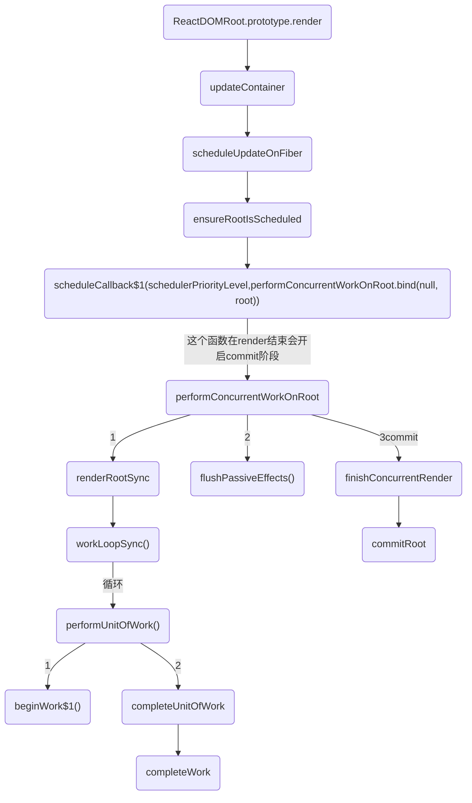
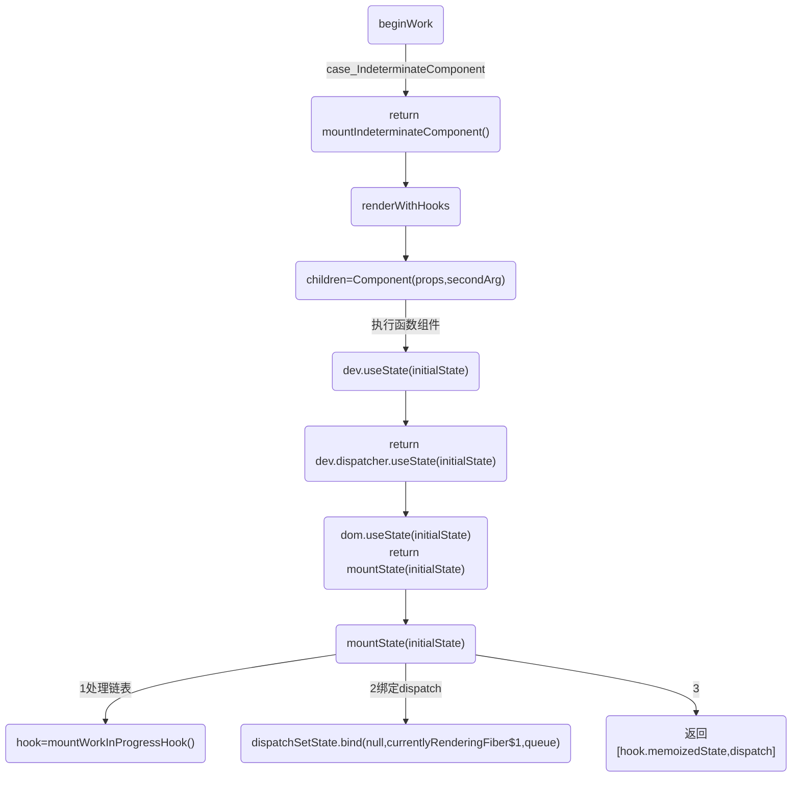
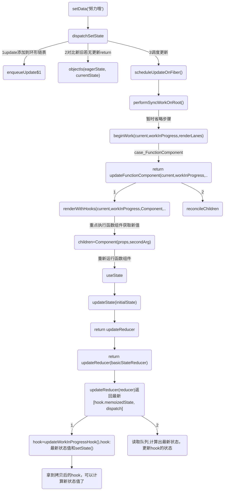
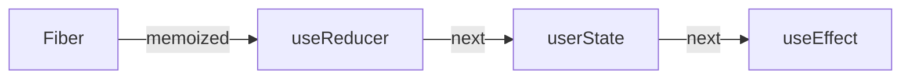
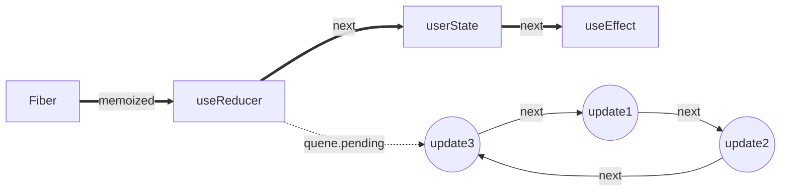

对于
```js
const [state, updateState] = useState(initialState)
```
memoizedState保存state的值

* mount 时：把传进来的 value 包装成一个含有 current 属性的对象，然后放在 memorizedState 属性上。
```
mount 时：将初始值存放在memoizedState 中，queue.pending用来存调用 setValue（即 dispatch）时创建的最后一个 update ，是个环状链表，最终返回一个数组，包含初始值和一个由dispatchState创建的函数。
```

* update 时：可以看到，其实调用的是 updateReducer，只是 reducer 是固定好的，作用就是用来直接执行 setValue（即 dispatch） 函数传进来的 action，即 useState 其实是对 useReducer 的一个封装，只是 reducer 函数是预置好的。


## 不同类型hook的memoizedState保存不同类型数据，具体如下：
比对是依赖项是否一致的时候，用的是Object.is：

Object.is() 与 === 不相同。差别是它们对待有符号的零和 NaN 不同，例如，=== 运算符（也包括 == 运算符）将数字 -0 和 +0 视为相等，而将 Number.NaN 与 NaN 视为不相等。

### updateReducer 主要工作：
1. 将 baseQueue 和  pendingQueue 首尾合并形成新的链表

2. baseQueue 为之前因为某些原因导致更新中断从而剩下的 update 链表，pendingQueue 则是本次产生的 update链表。会把 baseQueue 接在 pendingQueue 前面。
3. 从 baseQueue.next 开始遍历整个链表执行 update，每次循环产生的 newState，作为下一次的参数，直到遍历完整个链表。即整个合并的链表是先执行上一次更新后再执行新的更新，以此保证更新的先后顺序。
4. 最后更新 hook 上的参数，返回 state 和 dispatch。

# 流程图


## useState 挂载hooks函数;生成dispatch;挂载链表
接上面beginWork


## setState 更新,重点在dispatchSetState



# 关于hook 问题
## 1.React Hooks 为什么不能写在条件语句中？
要保证 React Hooks 的顺序一致。

```js
const [data, setData] = React.useState('改变我')
const [showDiv, setShowDiv] = React.useState(false)
```

每一个组件都会有一个fiber对象，在fiber中我们主要关注memoizedState这个对象，它就是调用完useState后对应的存储state的对象。

每一个useState都会在当前组件中创建一个hook对象 ，并且这个对象中的next属性始终执行下一个useState的hook对象,这些对象以一种类似链表的形式存在 Fiber.memoizedState 中

调用useState后设置在memoizedState上的对象长这样：（又叫Hook对象）
```js
{
  baseState,
  next,  
  baseUpdate,
  queue,
  memoizedState
}
```

而函数组件就是通过fiber这个数据结构来实现每次render后name address不会被useState重新初始化。
这里面我们最需要关心的是memoizedState和next，memoizedState是用来记录这个useState应该返回的结果的，而next指向的是下一次useState对应的Hook对象，即
```
hook1  ==>	Fiber.memoizedState
state1 === hook1.memoizedState
hook1.next	==>	hook2
state2	==>	hook2.memoizedState
....
```

通过上面介绍已经知道各个 hook 在 mount 时会以链表的形式挂到 fiber.memoizedState上。
update 时会进入到 HooksDispatcherOnUpdateInDEV，执行不同 hook 的 updateXxx 方法。

最终会通过 updateWorkInProgressHook方法获取当前 hook 的对象，获取方式就是从当前 fiber.memoizedState上依次获取，遍历的是 mount 阶段创建的链表，故不能改变 hook 的执行顺序，否则会拿错。（updateWorkInProgressHook 也是个通用方法，updateXXX 都是走到这个地方）


函数组件的状态是保存在 fiber.memorizedState 中的。它是一个链表，保存调用 Hook 生成的 hook 对象，这些对象保存着状态值。当更新时，我们每调用一个 Hook，其实就是从 fiber.memorizedState 链表中读取下一个 hook，取出它的状态。

如果顺序不一致了或者数量不一致了，就会导致错误，取出了一个其他 Hook 对应的状态值。

正是因为hooks中是这样存储state的 所以我们只能在hooks的根作用域中使用useState，而不能在条件语句和循环中使用,因为我们不能每次都保证条件或循环语句都会执行:
```js
if (something) {
  const [state1] = useState(1)
}

// or

for (something) {
  const [state2] = useState(2)
}
```


## 问题1： setState()函数在任何情况下都会导致组件重渲染吗？如果setState中的state没有发生改变呢？
比对是依赖项是否一致的时候，用的是Object.is：

Object.is() 与 === 不相同。差别是它们对待有符号的零和 NaN 不同，例如，=== 运算符（也包括 == 运算符）将数字 -0 和 +0 视为相等，而将 Number.NaN 与 NaN 视为不相等。

例5-主要测试实5-没有导致state的值发生变化的setState是否会导致重渲染.html

没有导致state的值发生变化的this.setState()是否会导致重渲染-->不会


## 问题2： 如果state和从父组件传过来的props都没变化，那他就一定不会发生重渲染吗？
存疑？这个问题还没探究

当React重新渲染时ParentComponent，它将自动重新渲染ChildComponent。要解决的唯一途径是实现shouldComponentUpdate
```js
shouldComponentUpdate(nextProps,nextState){
    if(nextState.Number == this.state.Number){
      return false
    }
}
```

# 前言
## 一些全局变量,在讲解源码之前，先认识一些 重要的全局变量：
* currentlyRenderingFiber：正在处理的函数组件对应 fiber。在执行 useState 等 hook 时，需要通过它知道当前 hook 对应哪个 fiber。

* workInProgressHook：挂载时正在处理的 hook 对象。我们会沿着 workInProcess.memoizedState 链表一个个往下走，这个 workInProgressHook 就是该链表的指针。

* currentHook：旧的 fiber 的 hooks 链表（current.memorizedState）指针。

* ReactCurrentDispatcher：全局对象，是一个 hook 调度器对象，其下有 useState、useEffect 等方法，是我们业务代码中 hook 底层调用的方法。ReactCurrentDispatcher 有三种：
  * ContextOnlyDispatcher：所有方法都会抛出错误，用于防止开发者在调用函数组件的其他时机调用 React Hook；
  * HooksDispatcherOnMount：挂载阶段用。比如它的 useState 要将初始值保存起来；
  * HooksDispatcherOnUpdate：更新阶段用。比如它的 useState 会无视传入的初始值，而是从链表中取出值。

## hooks:闭包 + 两级链表
### 首先，Hooks是以单向链表的形式存储在 Fiber 的 memoizedState 属性身上


### 同时，每个hooks又拥有自己的更新队列queue，queue.pending 会指向一个环状链表



- 由图可知，queue.pending 永远指向最后一个更新
- 由图可知，pending.next 永远指向第一个更新


## 为什么要是环状链表？
为什么要用环状链表呢?
因为React的更新任务是有优先级的。

假如有三个 update，第二个update的优先级比较高，那么会先执行第二个 update，单向链表可能会导致第一个update丢失，而环状链表的优势在于可以从任何节点开始循环链表。总结来说：环状链表可以保证update不丢失，并且保证状态依赖的连续性。

在获取头部或者插入尾部的时候避免不必要的遍历操作

（上面提到的 fiber.updateQueue 、 useEffect 创建的 hook 对象中的 memoizedState 存的 effect 环状链表，以及 useState 的 queue.pending 上的 update 对象的环状链表，都是这个原因）

方便定位到链表的第一个元素。updateQueue 指向它的最后一个 update，updateQueue.next 指向它的第一个update。

若不使用环状链表，updateQueue 指向最后一个元素，需要遍历才能获取链表首部。即使将updateQueue指向第一个元素，那么新增update时仍然要遍历到尾部才能将新增的接入链表。

### 辅:单向链表js实现
```js
function buildQueue(queue,action){
    const update = {action,next:null}
    const pending = queue.pending
 
    if(!pending){
        queue.pending = update
    }else{
        let current = queue.pending
        // 找到末尾的元素
        while(current.next){
            current = current.next
        }
        // 将update挂载到链表的末尾
        current.next = update
    }
}
 
// excute
let queue = {pending:null}
buildQueue(queue,'hooks1')
buildQueue(queue,'hooks2')
 
// output: queue.pending = {action:'hooks1',next:{action:'hooks2',next:null}}
```

### 辅:环状链表js实现
```js
function dispatchAction(queue,action){
     const update = {action,next:null}
     const pending = queue.pending
     if(pending === null){
        update.next = update // 自己与自己创建一个环状链表
     }else{
        update.next = pending.next
        pending.next = update
     }
     queue.pending = update
}
 
let queue = {pending:null}
 
/**
 * update.next === update
 * queue.pending === update(action) 
 */
dispatchAction(queue,'action')
 
 
/**
 * update(action1).next -> update(action).next [update(action)]    
 * update1 的next 指向 update
 * queue.pending.next [update(update)] -> update(action1)          
 * update 指向 update1
 * queue.pending -> update(action1)                                
 * queue.pending 指向 update1
 */
dispatchAction(queue,'action1')
```


### 1.闭包
闭包是指有权访问另一个函数作用域中变量或方法的函数，创建闭包的方式就是在一个函数内创建闭包函数，通过闭包函数访问这个函数的局部变量, 利用闭包可以突破作用链域的特性，将函数内部的变量和方法传递到外部。

```js
export default function Hooks() {
  const [count, setCount] = useState(0);
  const [age, setAge] = useState(18);

  const self = useRef(0);

  const onClick = useCallback(() => {
    setAge(19);
    setAge(20);
    setAge(21);
  }, []);

  console.log('self', self.current);
  return (
    <div>
      <h2>年龄： {age} <a onClick={onClick}>增加</a></h2>
      <h3>轮次： {count} <a onClick={() => setCount(count => count + 1)}>增加</a></h3>
    </div>
  );
}
```
以上面的示例来讲，闭包就是setAge这个函数，何以见得呢，看组件挂载阶段hook执行的源码：
```js
function useState(initialState) {
  console.log('=useState=dev=调用mountState', { initialState })
  var dispatcher = resolveDispatcher();
  return dispatcher.useState(initialState);
}

useState: function (initialState) {
  currentHookNameInDev = 'useState';
  mountHookTypesDev();
  var prevDispatcher = ReactCurrentDispatcher$1.current;
  ReactCurrentDispatcher$1.current = InvalidNestedHooksDispatcherOnMountInDEV;

  try {
    console.log('=useState=调用mountState', { initialState })
    return mountState(initialState);
  } finally {
    ReactCurrentDispatcher$1.current = prevDispatcher;
  }
}

function mountState(initialState) {
  var hook = mountWorkInProgressHook();

  if (typeof initialState === 'function') {
    // $FlowFixMe: Flow doesn't like mixed types
    initialState = initialState();
  }

  hook.memoizedState = hook.baseState = initialState;
  var queue = {
    pending: null,
    interleaved: null,
    lanes: NoLanes,
    dispatch: null,
    lastRenderedReducer: basicStateReducer,
    lastRenderedState: initialState
  };
  hook.queue = queue;

  // 重点
  var dispatch = queue.dispatch = dispatchSetState.bind(null, currentlyRenderingFiber$1, queue)
  console.log('=useState=dom=利用bind返回dispatch:', { dispatch })
  return [hook.memoizedState, dispatch];
}
```

而产生的闭包就是dispatch函数（对应上面的setAge），被闭包引用的变量就是
currentlyRenderingFiber 与 queue。

currentlyRenderingFiber: 其实就是workInProgressTree, 即更新时链表当前正在遍历的fiber节点

queue: 指向hook.queue，保存当前hook操作相关的reducer 和 状态的对象，其来源于mountWorkInProgressHook这个函数，下面重点讲；

这个闭包将 fiber节点与action, action 与 state很好的串联起来了，举上面的例子就是：

当点击增加执行setAge, 执行后，新的state更新任务就储存在fiber节点的hook.queue上，并触发更新；


当节点更新时，会遍历queue上的state任务链表，计算最终的state，并进行渲染；

ok，到这，闭包就讲完了。


### 2.第一个链表：hooks,单向链表实现
```js
/*
Hooks are stored as a linked list on the fiber's memoizedState field.  
hooks 以链表的形式存储在fiber节点的memoizedState属性上
The current hook list is the list that belongs to the current fiber.
当前的hook链表就是当前正在遍历的fiber节点上的
The work-in-progress hook list is a new list that will be added to the work-in-progress fiber.
work-in-progress hook 就是即将被添加到正在遍历fiber节点的hooks新链表
*/
let currentHook: Hook | null = null;
let nextCurrentHook: Hook | null = null;
```

从上面的源码注释可以看出hooks链表与fiber链表是极其相似的；也得知hooks 链表是保存在fiber节点的memoizedState属性的, 


这个hooks 链表具体指什么？
其实就是指一个组件包含的hooks, 比如上面示例中的：
```js
const [count, setCount] = useState(0);
const [age, setAge] = useState(18);
const self = useRef(0);
const onClick = useCallback(() => {
  setAge(19);
  setAge(20);
  setAge(21);
}, []);
```
形成的链表就是下面这样的：


所以在下一次更新时，再次执行hook，就会去获取当前运行节点的hooks链表；
```js
const hook = updateWorkInProgressHook();
// updateWorkInProgressHook 就是一个纯链表的操作：指向下一个 hook节点
```
到这 hooks 链表是什么，应该就明白了；这时你可能会更明白，为什么hooks不能在循环，判断语句中调用，而只能在函数最外层使用，因为挂载或则更新时，这个队列需要是一致的，才能保证hooks的结果正确。

### 2.第二个链表：环状链表实现
state 链表不是hooks独有的，类操作的setState也存在，正是由于这个链表存在，所以有一个经典React 面试题：

setState为什么默认是异步，什么时候是同步？

1.异步:
+ setState 和 useState中的set函数是异步执行的（不会立即更新state的结果）
+ 多次执行setState 和 useState的set函数，组件只会重新渲染一次

+ 不同的是，setState会更新当前作用域下的状态，但是set函数不会更新，只能在新渲染的组件作用域中访问到
+ 同时setState会进行state的合并，但是useState中的set函数做的操作相当于是直接替换，只不过内部有个防抖的优化才导致组件不会立即被重新渲染

2.同步：在setTimeout，Promise.then等异步事件或者原生事件中
+ setState和useState的set函数是同步执行的（立即重新渲染组件）
+ 多次执行setState和useState的set函数，每一次的执行都会调用一次render

结合实例来看，当点击增加会执行三次setAge
```js
const onClick = useCallback(() => {
  setAge(19);
  setAge(20);
  setAge(21);
}, []);
```

环状链表实现

建立这个链表的逻辑就在 dispatchSetState-->enqueueUpdate$1。
```
update(action1).next -> update(action).next [update(action)]    
update1 的next 指向 update
queue.pending.next [update(update)] -> update(action1)          
update 指向 update1
queue.pending -> update(action1)                                
queue.pending 指向 update1
```

```js
function dispatchSetState(fiber, queue, action) {
  // 省略..
  // 创建一个 update 更新对象
  var update = {
    lane: lane,
    action: action,
    hasEagerState: false,
    eagerState: null,
    next: null
  };
  if (isRenderPhaseUpdate(fiber)) {
    console.log('=useState=app=dispatchSetState调用enqueueRenderPhaseUpdate渲染阶段更新:')
    enqueueRenderPhaseUpdate(queue, update);
  } else {
    enqueueUpdate$1(fiber, queue, update);
  }

  // 省略..
}

function enqueueUpdate$1(fiber, queue, update, lane) {
  if (isInterleavedUpdate(fiber)) {
    var interleaved = queue.interleaved;

    if (interleaved === null) {
      // This is the first update. Create a circular list.
      update.next = update; // At the end of the current render, this queue's interleaved updates will
      // be transferred to the pending queue.

      pushInterleavedQueue(queue);
    } else {
      update.next = interleaved.next;
      interleaved.next = update;
    }

    queue.interleaved = update;
  } else {

    console.log('=useState=app=enqueueUpdate$1将update对象添加到hook.queue.pending队列')
    var pending = queue.pending;

    if (pending === null) {
      // This is the first update. Create a circular list.
      console.log('=useState=app=首个update 2, 自己指向自己创建一个环状链表,创建一个环形链表')
      update.next = update;
    } else {
      update.next = pending.next;
      pending.next = update;
    }

    queue.pending = update;
  }
}
```

执行setAge 只是形成了状态待执行任务链表，真正得到最终状态，其实是在下一次更新(获取状态)时，即：
```js
// 读取最新age
const [age, setAge] = useState(18);
```

而获取最新状态的相关代码逻辑存在于updateReducer中：
```js
function updateReducer(reducer, initialArg, init) {
  var hook = updateWorkInProgressHook();
  // 省略..
  if (baseQueue !== null) {
  // We have a queue to process.
  var first = baseQueue.next;
  var newState = current.baseState;
  var newBaseState = null;
  var newBaseQueueFirst = null;
  var newBaseQueueLast = null;
  var update = first;

  do {
    var updateLane = update.lane;

    if (!isSubsetOfLanes(renderLanes, updateLane)) {
      // Priority is insufficient. Skip this update. If this is the first
      // skipped update, the previous update/state is the new base
      // update/state.
      var clone = {
        lane: updateLane,
        action: update.action,
        hasEagerState: update.hasEagerState,
        eagerState: update.eagerState,
        next: null
      };

      if (newBaseQueueLast === null) {
        newBaseQueueFirst = newBaseQueueLast = clone;
        newBaseState = newState;
      } else {
        newBaseQueueLast = newBaseQueueLast.next = clone;
      } // Update the remaining priority in the queue.
      // TODO: Don't need to accumulate this. Instead, we can remove
      // renderLanes from the original lanes.


      currentlyRenderingFiber$1.lanes = mergeLanes(currentlyRenderingFiber$1.lanes, updateLane);
      markSkippedUpdateLanes(updateLane);
    } else {
      // This update does have sufficient priority.
      if (newBaseQueueLast !== null) {
        var _clone = {
          // This update is going to be committed so we never want uncommit
          // it. Using NoLane works because 0 is a subset of all bitmasks, so
          // this will never be skipped by the check above.
          lane: NoLane,
          action: update.action,
          hasEagerState: update.hasEagerState,
          eagerState: update.eagerState,
          next: null
        };
        newBaseQueueLast = newBaseQueueLast.next = _clone;
      } // Process this update.


      if (update.hasEagerState) {
        // If this update is a state update (not a reducer) and was processed eagerly,
        // we can use the eagerly computed state
        // 状态已经计算过，那就直接用
        newState = update.eagerState;
      } else {
        var action = update.action;
        newState = reducer(newState, action);
      }
    }

    update = update.next;
    // 终止条件是指针为空 或 环已遍历完
  } while (update !== null && update !== first);

  if (newBaseQueueLast === null) {
    newBaseState = newState;
  } else {
    newBaseQueueLast.next = newBaseQueueFirst;
  } // Mark that the fiber performed work, but only if the new state is
  // different from the current state.


  if (!objectIs(newState, hook.memoizedState)) {
    markWorkInProgressReceivedUpdate();
  }

  hook.memoizedState = newState;
  hook.baseState = newBaseState;
  hook.baseQueue = newBaseQueueLast;
  queue.lastRenderedState = newState;
}
  // 省略..
}
```

## Fiber 数据结构:
主要分下面几块：
* 节点基础信息的描述
* 描述与其它 fiber 节点连接的属性
* 状态更新相关的信息:hook
```
hook 关联比较大的主要是 memoizedState 和 updateQueue 属性。函数组件会将内部用到的所有的 hook 通过单向链表的形式，保存在组件对应 fiber 节点的 memoizedState 属性上。

useEffect：memoizedState保存包含useEffect回调函数、依赖项等的链表数据结构effect。effect链表同时会保存在fiber.updateQueue中。

updateQueue 是 useEffect 产生的 effect 连接成的环状单向链表。
```
* 优先级调度相关

```js
function FiberNode(
  tag: WorkTag,
  pendingProps: mixed,
  key: null | string,
  mode: TypeOfMode,
) {
  // 作为静态数据结构的属性
  this.tag = tag;      // Fiber对应组件的类型 Function/Class/Host...
  this.key = key;      // key属性
  this.elementType = null; // 大部分情况同type，某些情况不同，比如FunctionComponent使用React.memo包裹
  this.type = null;     // 对于 FunctionComponent，指函数本身，对于ClassComponent，指class，对于HostComponent，指DOM节点tagName
  this.stateNode = null;  // Fiber对应的真实DOM节点

  // 用于连接其他Fiber节点形成Fiber树
  this.return = null;  // 指向父级Fiber节点
  this.child = null;  // 指向子Fiber节点
  this.sibling = null; // 指向右边第一个兄弟Fiber节点
  this.index = 0;

  this.ref = null;

  // 作为动态的工作单元的属性 —— 保存本次更新造成的状态改变相关信息
  this.pendingProps = pendingProps;
  this.memoizedProps = null;
  this.updateQueue = null;  // class 组件 Fiber 节点上的多个 Update 会组成链表并被包含在 fiber.updateQueue 中。 函数组件则是存储 useEffect 的 effect 的环状链表。
  this.memoizedState = null; // hook 组成单向链表挂载的位置
  this.dependencies = null;

  this.mode = mode;

  // Effects
  this.flags = NoFlags;
  this.subtreeFlags = NoFlags;
  this.deletions = null;

  // 调度优先级相关
  this.lanes = NoLanes;
  this.childLanes = NoLanes;

  // 指向该fiber在另一次更新时对应的fiber
  this.alternate = null;
}
```

hook 的 memoizedState 存的是当前 hook 自己的值。
```js
const hook: Hook = {
  memoizedState: null, // 当前需要保存的值

  baseState: null,
  baseQueue: null, // 由于之前某些高优先级任务导致更新中断，baseQueue 记录的就是尚未处理的最后一个 update
  queue: null, // 内部存储调用 setValue 产生的 update 更新信息，是个环状单向链表

  next: null,  // 下一个hook
};
```

### 例子1
```js
function Test() {
  console.log('test-render')
  const [data, setData] = React.useState('改变我')
  const [showDiv, setShowDiv] = React.useState(false)

  const onClickText = () => {
    console.log('=useState=onClick');
    setData('努力哦')
    setShowDiv(!showDiv)
  }

  const onClickText2 = () => {
    console.log('=useState=onClick:', data);
  }

  React.useEffect(() => {
    console.log('=副作用-useEffect-->运行');
  }, [])

  React.useLayoutEffect(() => {
    console.log('=副作用-useLayoutEffect-->运行');
  }, [])

  return (
    <div id='div1' className='c1'>
      <button onClick={onClickText} className="btn">Hello world,Click me</button>
      <span>{data}</span>
      {showDiv && <div>被你发现了</div>}
      <div id='div2' className='c2'>
        <p>测试子节点</p>
      </div>
    </div>
  )
}
```

圈起来1和2表示以下函数
```js
React.useLayoutEffect(() => {
  console.log('=副作用-useLayoutEffect-->运行');
}, [])

React.useEffect(() => {
  console.log('=副作用-useEffect-->运行');
}, [])
```


### 示例2
```js
function App() {
  const [value, setValue] = useState(0);
  const ref = useRef();
  ref.current = "some value";

  return (
    <div className="App">
      <h1>目前值：{value}</h1>
      <div>
        <button onClick={() => { 
          setValue(v => v + 1)
        }}>增加</button>
      </div>
    </div>
  );
}
```
可以从截图中看到，代码中使用的 useState 和 useRef 两个 hook 通过 next 连接成链表。另外 useState 的 hook 对象的 queue 中存储了调用 setValue 时用到的函数。


```js
function App() {
  const [value, setValue] = useState(0);
  const ref = useRef();
  ref.current = "some value";

  return (
    <div className="App">
      <h1>目前值：{value}</h1>
      <div>
        <button onClick={() => { 
          setValue(v => v + 1)
        }}>增加</button>
      </div>
    </div>
  );
}
```

### Hooks 链表创建过程
每个 useXxx 的 hooks 都有 mountXxx 和 updateXxx 两个阶段。链表只创建一次，在 mountXxx 当中，后面都是 update。

以 useState 为例，mount 时会进入 HooksDispatcherOnMountInDEV 的 useState方法，最终执行 mountState

下面有详细解析

# hooks基础
## 为什么hooks
主要是class组件比较冗余、生命周期函数写法不友好，functional组件更符合React编程思想
```js
// hook的结构
export type Hook = {
  memoizedState: any, //上一次的state
  baseState: any,  // 当前state
  baseUpdate: Update<any, any> | null,  // update func
  next: Hook | null, // 链表
  queue: UpdateQueue<any, any> | null,  // 用于缓存多次action
};

const example ={
  baseQueue:null,
  baseState:"改变我",
  memoizedState:"改变我",
  next:{},
  queue:{},
}
```

```js
import { useState, useEffect } from "react";
export default function App() {
  // 1. useState
  const [a, setA] = useState(1);
  // 2. useEffect
  useEffect(() => {
    console.log(`effect 1 created`);
  });
  // 3. useState
  const [b] = useState(2);
  // 4. useEffect
  useEffect(() => {
    console.log(`effect 2 created`);
  });
  return (
    <>
      <button onClick={() => setA(a + 1)}>{a}</button>
      <button>{b}</button>
    </>
  );
}
```

本示例中, function调用之后则会创建 4 个hook, 这时的内存结构如下:


状态Hook或副作用Hook都按照调用顺序存储在fiber.memoizedState链表中


## mountWorkInProgressHook作用:
给 memoizedState 链表加节点的逻辑,写过单链表的会比较理解，头节点要特殊处理
* 创建一个 hook
* 若无 hook 链，则创建一个 hook 链；若有，则将新建的 hook 加至末尾
* 将新建的这个 hook 挂载到 workInProgressHook 以及当前 fiber node 的 memoizedState 上

返回 workInProgressHook，也就是这个新建的 hook
```js
function mountWorkInProgressHook() {
  var hook = {
    memoizedState: null,
    baseState: null,
    baseQueue: null,
    queue: null,
    next: null
  };

  if (workInProgressHook === null) {
    // This is the first hook in the list
    console.log('=useState=dom=调用workInProgressHook 1:', { hook, workInProgressHook })
    // 链表中首个hook
    currentlyRenderingFiber$1.memoizedState = workInProgressHook = hook;
  } else {
    // Append to the end of the list
    // 将hook添加到链表末尾
    workInProgressHook = workInProgressHook.next = hook;
    console.log('=useState=dom=调用workInProgressHook 2:', { hook, workInProgressHook })
  }

  return workInProgressHook;
}
```


# setState 渲染

## 挂载useState

首先要注意的是，虽然 App 是一个 FunctionComponent，但是在 first paint 的时候，React 判断其为 IndeterminateComponent。
```js
function beginWork(current, workInProgress, renderLanes) {
  // 省略代码
  console.log('%c=beginWork()===start1-初始化', 'color:magenta', { getFiberName: getFiberName(workInProgress), current, renderLanes, workInProgress })

  switch (workInProgress.tag) {
    case IndeterminateComponent:
      {
        console.log('%c=beginWork()==end 2 mountIndeterminateComponent', 'color:magenta')

        console.log(`%c=探究初始和hook=调用mountIndeterminateComponent`, 'color:blueviolet')
        return mountIndeterminateComponent(current, workInProgress, workInProgress.type, renderLanes);
  }
}

function mountIndeterminateComponent(_current, workInProgress, Component, renderLanes) {
  // 省略代码

  ReactCurrentOwner$1.current = workInProgress;

  console.log(`%c=探究初始和hook=mountIndeterminateComponent调用renderWithHooks 1`, 'color:blueviolet', { workInProgress, Component, props, context, renderLanes })

  value = renderWithHooks(null, workInProgress, Component, props, context, renderLanes);

  console.log(`%c=探究初始和hook=mountIndeterminateComponent调用renderWithHooks 返回值`, 'color:blueviolet', { value })

  // 省略代码
}
```

### renderWithHooks
1. workInProgress 赋值给全局变量 currentlyRenderingFiber，之后执行 hook 就能知道是给哪个组件更新状态了。
2. 选择 hook 调度器：根据是挂载还是更新阶段，ReactCurrentDispatcher 设置为对应 hook 调度器。
3. 调用函数组件，进行 render。函数组件内部会调用 Hook，并返回 ReactElement。
4. 重置全局变量，比如 currentlyRenderingFiber 设置回 null；ReactCurrentDispatcher 还原为 ContextOnlyDispatcher，防止在错误时机使用 Hook。

renderWithHooks 中，我们会根据组件处于不同的状态，给 ReactCurrentDispatcher.current 挂载不同的 dispatcher 。而在first paint 时，挂载的是ContextOnlyDispatcher
或则 HooksDispatcherOnMountInDEV
```js
function renderWithHooks(current, workInProgress, Component, props, secondArg, nextRenderLanes) {
    renderLanes = nextRenderLanes;
    console.log(`%c=探究初始和hook=renderWithHooks挂载将workInProgress 赋值给全局变量 currentlyRenderingFiber,这样在调用 Hook 时就能知道对应的 fiber 是谁`, 'color:blueviolet')
    currentlyRenderingFiber$1 = workInProgress;

    {
      if (current !== null && current.memoizedState !== null) {
        ReactCurrentDispatcher$1.current = HooksDispatcherOnUpdateInDEV;
      } else if (hookTypesDev !== null) {
        // This dispatcher handles an edge case where a component is updating,
        // but no stateful hooks have been used.
        // We want to match the production code behavior (which will use HooksDispatcherOnMount),
        // but with the extra DEV validation to ensure hooks ordering hasn't changed.
        // This dispatcher does that.
        ReactCurrentDispatcher$1.current = HooksDispatcherOnMountWithHookTypesInDEV;
      } else {
        console.log(`%c=探究初始和hook=renderWithHooks dev挂载的是HooksDispatcherOnMountInDEV hook`, 'color:blueviolet', { current: HooksDispatcherOnMountInDEV })
        ReactCurrentDispatcher$1.current = HooksDispatcherOnMountInDEV;
      }
    }


    // 省略代码
    console.log(`%c=探究初始和hook=renderWithHooks挂载,将一些全局变量进行重置`, 'color:blueviolet')
    ReactCurrentDispatcher$1.current = ContextOnlyDispatcher;
    // 省略代码
}

HooksDispatcherOnMountInDEV = {
  readContext: function (context) {
    return readContext(context);
  },
  // 省略
  useState: function (initialState) {
    currentHookNameInDev = 'useState';
    mountHookTypesDev();
    var prevDispatcher = ReactCurrentDispatcher$1.current;
    ReactCurrentDispatcher$1.current = InvalidNestedHooksDispatcherOnMountInDEV;

    try {
      console.log('=useState=dom=调用mountState', { initialState })
      return mountState(initialState);
    } finally {
      ReactCurrentDispatcher$1.current = prevDispatcher;
    }
  },
}
```

接下里走进我们的 App()，我们会调用 React.useState,这里的 dispatcher 就是上文挂载到 ReactCurrentDispatcher.current 的ContextOnlyDispatcher

## 分析1:dev里面的 useState
可见实际上执行的是 dispatcher.useState()，这里面会通过执行 resolveDispatcher() 得到一个 dispatcher，然后调用该对象上的 useState() 方法
```js
function useState(initialState) {
  console.log('=useState=dev=调用mountState', { initialState })
  var dispatcher = resolveDispatcher();
  return dispatcher.useState(initialState);
}

function resolveDispatcher() {
  var dispatcher = ReactCurrentDispatcher.current;
  {
    if (dispatcher === null) {
      error('Invalid hook call. Hooks can only be called inside of the body of a function component. This could happen for' + ' one of the following reasons:\n' + '1. You might have mismatching versions of React and the renderer (such as React DOM)\n' + '2. You might be breaking the Rules of Hooks\n' + '3. You might have more than one copy of React in the same app\n' + 'See https://reactjs.org/link/invalid-hook-call for tips about how to debug and fix this problem.');
    }
  } // Will result in a null access error if accessed outside render phase. We
  // intentionally don't throw our own error because this is in a hot path.
  // Also helps ensure this is inlined.
  return dispatcher;
}
```

## dispatcher.useState就是dom里面的 useState()
可以见到结构：
```js
hook.memoizedState = hook.baseState = initialState;
var queue = {
  pending: null,
  interleaved: null,
  lanes: NoLanes,
  dispatch: null,
  lastRenderedReducer: basicStateReducer,
  lastRenderedState: initialState
};
hook.queue = queue;
```

```js
useState: function (initialState) {
  currentHookNameInDev = 'useState';
  mountHookTypesDev();
  var prevDispatcher = ReactCurrentDispatcher$1.current;
  ReactCurrentDispatcher$1.current = InvalidNestedHooksDispatcherOnMountInDEV;

  try {
    console.log('=useState=调用mountState', { initialState })
    return mountState(initialState);
  } finally {
    ReactCurrentDispatcher$1.current = prevDispatcher;
  }
},
```

## 调用 mountState 函数
mountState 函数对 var hook = mountWorkInProgressHook()进行赋值:

### mountState 和 dispatchSetState.bind
1. 创建新的 hook 空对象，挂到 workInProcess.memorizedState 队列上（mountWorkInProgressHook 方法）。
2. dispatchSetState 绑定对应 fiber 和 queue，方便以后 setState 快速找到相关对象，最后返回状态值和更新状态方法。

dispatchSetState.bind(null, currentlyRenderingFiber$1, queue)

利用bind返回dispatch函数

这也是为什么虽然 dispatchSetState 本身需要三个参数，但我们使用的时候都是 setState(params)，只用传一个参数的原因。
```js
function mountState(initialState) {
  var hook = mountWorkInProgressHook();

  if (typeof initialState === 'function') {
    // $FlowFixMe: Flow doesn't like mixed types
    initialState = initialState();
  }

  hook.memoizedState = hook.baseState = initialState;
  var queue = {
    pending: null,
    interleaved: null,
    lanes: NoLanes,
    dispatch: null,
    lastRenderedReducer: basicStateReducer,
    lastRenderedState: initialState
  };
  hook.queue = queue;

  var dispatch = queue.dispatch = dispatchSetState.bind(null, currentlyRenderingFiber$1, queue)
  console.log('=useState=dom=利用bind返回dispatch:', { dispatch })
  return [hook.memoizedState, dispatch];
}
```

# setState()-->dispatchSetState() 重点函数在这里触发组件更新
注意: 本示例中虽然同时执行了 2 次 dispatch, 会请求 3 次调度, 由于调度中心的节流优化, 最后只会执行一次渲染

之前 mountState 时，我们返回了一个绑定了 fiber、queue 参数的 dispatchSetState

第一个 setState 在被调用时会立即计算新状态，这是为了 做新旧 state 对比，决定是否更新组件。如果对比发现状态没变，继续计算下一个 setState 的新状态，直到找到为止。如果没找到，就不进行更新。

其后的 setState 则不会计算，等到组件重新 render 再计算。

为对比新旧状态计算出来的状态值，会保存到 update.eagerState，并将 update.hasEagerState 设置为 true，之后更新时通过它来直接拿到计算后的最新值。

dispatchSetState 会拿到对应的 fiber、queue（对应 hook 的 queue）、action（新的状态）。

创建一个 update 空对象；
1. 计算出最新状态，放入到 update.egerState。
2. 对比新旧状态是否相同（使用 Object.is 对比）。相同就不更新了，结束。不相同，进行后续的操作。
3. 将 update 放到 queue.interleaved 或 concurrentQueues 链表上（.new 和 .old 文件的逻辑差得有点多），之后更新阶段会搬到 queue.pending。
4. 将当前 fiber 的 lanes 设置为 SyncLane，这样后面的 setState 就不会立刻计算最新状态了，而是在更新阶段才计算。
5. 接着是调度更新（scheduleUpdateOnFiber），让调度器进行调度，执行更新操作
```js
function dispatchSetState(fiber, queue, action) {
  {
    if (typeof arguments[3] === 'function') {
      error("State updates from the useState() and useReducer() Hooks don't support the " + 'second callback argument. To execute a side effect after ' + 'rendering, declare it in the component body with useEffect().');
    }
  }

  console.log('=useState=app=dispatchSetState:', { fiber, queue, action })

  var lane = requestUpdateLane(fiber);
  // 创建一个 update 更新对象
  var update = {
    lane: lane,
    action: action,
    hasEagerState: false,
    eagerState: null,
    next: null
  };

  if (isRenderPhaseUpdate(fiber)) {
    console.log('=useState=app=dispatchSetState调用enqueueRenderPhaseUpdate渲染阶段更新:')
    enqueueRenderPhaseUpdate(queue, update);
  } else {
    enqueueUpdate$1(fiber, queue, update);
    var alternate = fiber.alternate;

    if (fiber.lanes === NoLanes && (alternate === null || alternate.lanes === NoLanes)) {
      // The queue is currently empty, which means we can eagerly compute the
      // next state before entering the render phase. If the new state is the
      // same as the current state, we may be able to bail out entirely.

      var lastRenderedReducer = queue.lastRenderedReducer;
      console.log('=useState=app=dispatchSetState 计算新状态', { queue, lastRenderedReducer })

      if (lastRenderedReducer !== null) {
        var prevDispatcher;

        {
          prevDispatcher = ReactCurrentDispatcher$1.current;
          ReactCurrentDispatcher$1.current = InvalidNestedHooksDispatcherOnUpdateInDEV;
        }

        try {
          // currentState 旧值
          var currentState = queue.lastRenderedState;
          // currentState 新值
          var eagerState = lastRenderedReducer(currentState, action); // Stash the eagerly computed state, and the reducer used to compute
          // it, on the update object. If the reducer hasn't changed by the
          // time we enter the render phase, then the eager state can be used
          // without calling the reducer again.

          update.hasEagerState = true;
          update.eagerState = eagerState;
          console.log('=useState=app=dispatchSetState 对比新旧状态是否不同', { eagerState, currentState, objectIs: objectIs(eagerState, currentState) })
          if (objectIs(eagerState, currentState)) {
            // Fast path. We can bail out without scheduling React to re-render.
            // It's still possible that we'll need to rebase this update later,
            // if the component re-renders for a different reason and by that
            // time the reducer has changed.
            return;
          }
        } catch (error) {// Suppress the error. It will throw again in the render phase.
        } finally {
          {
            ReactCurrentDispatcher$1.current = prevDispatcher;
          }
        }
      }
    }

    var eventTime = requestEventTime();
    console.log('=useState=app=dispatchSetState调用scheduleUpdateOnFiber调度fiber更新')
    var root = scheduleUpdateOnFiber(fiber, lane, eventTime);

    if (root !== null) {
      entangleTransitionUpdate(root, queue, lane);
    }
  }

  markUpdateInDevTools(fiber, lane);
}
```


### enqueueUpdate$1
1. 创建update对象, 其中update.lane代表优先级(可回顾fiber 树构造(基础准备)中的update优先级).

2. 将update对象添加到hook.queue.pending环形链表.
  * 环形链表的特征: 为了方便添加新元素和快速拿到队首元素(都是O(1)), 所以pending指针指向了链表中最后一个元素.
  * 链表的使用方式可以参考React 算法之链表操作
```js
  function enqueueUpdate$1(fiber, queue, update, lane) {
    if (isInterleavedUpdate(fiber)) {
      var interleaved = queue.interleaved;

      if (interleaved === null) {
        // This is the first update. Create a circular list.
        update.next = update; // At the end of the current render, this queue's interleaved updates will
        // be transferred to the pending queue.

        pushInterleavedQueue(queue);
      } else {
        update.next = interleaved.next;
        interleaved.next = update;
      }

      queue.interleaved = update;
    } else {

      console.log('=useState=app=enqueueUpdate$1将update对象添加到hook.queue.pending队列')
      var pending = queue.pending;

      if (pending === null) {
        // This is the first update. Create a circular list.
        console.log('=useState=app=首个update, 创建一个环形链表')
        update.next = update;
      } else {
        update.next = pending.next;
        pending.next = update;
      }

      queue.pending = update;
    }
  }
```

## update会执行useState 获取最新状态
见流程图，children=Component(props,secondArg) 重新执行函数组件获取最新状态

fiber树构造(对比更新)阶段, 执行updateFunctionComponent->renderWithHooks时再次调用function

注意: 在renderWithHooks函数中已经设置了workInProgress.memoizedState = null, 等待调用function时重新设置.

接下来调用function, 同样依次调用useState, useEffect, useState, useEffect. 而useState, useEffect在fiber对比更新时分别对应updateState->updateReducer和updateEffect->updateEffectImpl

无论useState, useEffect, 内部调用updateWorkInProgressHook获取一个 hook.
```js
HooksDispatcherOnUpdateInDEV = {
  // 省略代码
  useState: function (initialState) {
        currentHookNameInDev = 'useState';
        updateHookTypesDev();
        var prevDispatcher = ReactCurrentDispatcher$1.current;
        ReactCurrentDispatcher$1.current = InvalidNestedHooksDispatcherOnUpdateInDEV;

        try {
          console.log('=updateState=4', { initialState })
          return updateState(initialState);
        } finally {
          ReactCurrentDispatcher$1.current = prevDispatcher;
        }
  }
  // 省略代码
}

```

### updateState-->updateReducer作用:最后更新 hook 上的参数，返回 state 和 dispatch。
updateReducer 主要工作有两个：

从 current.memorizedState 拷贝 hook 到 workInProcess 下（updateWorkInProgressHook 方法）。
将 hook.queue.pending 队列合并到 currentHook.baseQueue 下，然后遍历队列中的 update 对象，使用 action 和 reducer 计算出最新的状态，更新到 hook 上，最后返回新状态和新 setState。

updateReducer，只是 reducer 是固定好的，作用就是用来直接执行 setValue（即 dispath） 函数传进来的 action，即 useState 其实是对 useReducer 的一个封装，只是 reducer 函数是预置好的。

useState 本质上在使用 useReducer，在 React 源码层提供了特殊的名为 basicStateReducer 的 reducer
```js
function updateState(initialState) {
  console.log('=updateState调用updateReducer')
  return updateReducer(basicStateReducer);
}

// reducer 函数
function basicStateReducer(state, action) {
  // $FlowFixMe: Flow doesn't like mixed types
  return typeof action === 'function' ? action(state) : action;
}
```
```js
// setReducer 更新阶段对应的 updateReducer
function updateReducer(reducer, initialArg, init) {
  // ----- 【1】 拷贝 hook（current -> workInProcess），并返回这个 hook -----
  const hook = updateWorkInProgressHook();
  
  // ----- 【2】 读取队列，计算出最新状态，更新 hook 的状态 -----
  // ...
}
```

### 继续看 updateWorkInProgressHook()
updateWorkInProgressHook函数逻辑简单: 目的是为了让currentHook和workInProgressHook两个指针同时向后移动.
1. 由于renderWithHooks函数设置了workInProgress.memoizedState=null, 所以workInProgressHook初始值必然为null, 只能从currentHook克隆.

2. 而从currentHook克隆而来的newHook.next=null, 进而导致workInProgressHook链表需要完全重建.

可以看到:
1. 以双缓冲技术为基础, 将current.memoizedState按照顺序克隆到了workInProgress.memoizedState中.
2. Hook经过了一次克隆, 内部的属性(hook.memoizedState等)都没有变动, 所以其状态并不会丢失.

总结：
renderWithHooks函数, 把Hook链表挂载到了fiber.memoizedState之上. 利用fiber树内部的双缓冲技术, 实现了Hook从current到workInProgress转移, 进而实现了Hook状态的持久化.

该方法中，currentHook 设置为 current.memoizedState 链表的下一个 hook，拷贝它到 currentlyRenderingFiber.memoizedState 链表上，返回这个 hook。


```js
function updateWorkInProgressHook() {
  // 1. 移动 currentHook 指针
  //（来自 current.memoizedState 链表）
  var nextCurrentHook; 
  if (currentHook === null) {
    var current = currentlyRenderingFiber.alternate;
    if (current !== null) {
      nextCurrentHook = current.memoizedState;
    } else {
      nextCurrentHook = null;
    }
  } else {
    nextCurrentHook = currentHook.next;
  }

  // 2. 移动 workInProgressHook 指针
  //（来自 currentlyRenderingFiber.memoizedState 链表）
  var nextWorkInProgressHook;
  if (workInProgressHook === null) {
    nextWorkInProgressHook = currentlyRenderingFiber.memoizedState;
  } else {
    nextWorkInProgressHook = workInProgressHook.next;
  }

  if (nextWorkInProgressHook !== null) {
    // 这种情况为 “渲染时更新逻辑”（在 render 时调用了 setState）
    // 为了更聚焦普通情况，这里不讨论
    workInProgressHook = nextWorkInProgressHook;
    nextWorkInProgressHook = workInProgressHook.next;
    currentHook = nextCurrentHook;
  } else {
    // 3. 渲染时不更新，nextWorkInProgressHook 就一定是 null
    if (nextCurrentHook === null) {
      throw new Error('Rendered more hooks than during the previous render.');
    }

    currentHook = nextCurrentHook;
    var newHook = {
      memoizedState: currentHook.memoizedState,
      baseState: currentHook.baseState,
      baseQueue: currentHook.baseQueue,
      queue: currentHook.queue,
      next: null // next 就不拷贝了
    };

    // 4. 经典单链表末尾加节点写法
    if (workInProgressHook === null) {
      currentlyRenderingFiber.memoizedState = workInProgressHook = newHook;
    } else {
      workInProgressHook = workInProgressHook.next = newHook;
    }
  }

  // 5. 返回拷贝 hook 对象
  return workInProgressHook;
}
```

拿到拷贝后的hook，可以计算新状态值了。

首先将 hook.queue.pending 队列合并到 currentHook.baseQueue 下。该队列包含了一系列 update 对象（因为可能调用了多次 setState），里面保存有 setState 传入的最新状态值（函数或其他值）。

然后遍历 update 计算出最新状态，保存回 hook，并返回最新状态值和 setState 方法。
```js
function updateReducer(reducer, initialArg, init) {
  // ----- 【1】 拷贝 hook（current -> workInProcess），并返回这个 hook ----
  const hook = updateWorkInProgressHook();
  
  // ----- 【2】 读取队列，计算出最新状态，更新 hook 的状态 -----
  // 取出 hook.queue 链表，添加到 current.baseQueue 末尾
  const queue = hook.queue;
  queue.lastRenderedReducer = reducer;
  const current = currentHook;
  let baseQueue = current.baseQueue;
  const pendingQueue = queue.pending;
  if (pendingQueue !== null) {
    if (baseQueue !== null) {
      const baseFirst = baseQueue.next;
      const pendingFirst = pendingQueue.next;
      baseQueue.next = pendingFirst;
      pendingQueue.next = baseFirst;
    }
    current.baseQueue = baseQueue = pendingQueue;
    queue.pending = null;
  }

  // 处理更新队列
  if (baseQueue !== null) {
    const first = baseQueue.next;
    let newState = current.baseState;

    let newBaseState = null;
    let newBaseQueueFirst = null;
    let newBaseQueueLast = null;
    let update = first;
  
    // 循环，根据 baseQueue 链表下的 update 对象计算新状态
    do {   
      // 删掉了一些跳过更新的逻辑

      if (update.hasEagerState) {
        // 为了对比新旧状态来决定是否更新，所计算的新状态。
        // 如果不同，给 update.hasEagerState 设置为 true
        // 新状态赋值给 update.eagerState
        newState = update.eagerState;
      } else {
        // 计算新状态
        const action = update.action;
        newState = reducer(newState, action);
      }     
      update = update.next;
    } while (update !== null && update !== first);   
    if (newBaseQueueLast === null) {
      newBaseState = newState;
    } else {
      newBaseQueueLast.next = newBaseQueueFirst;
    }
    if (!is(newState, hook.memoizedState)) {
      markWorkInProgressReceivedUpdate();
    }
  // 更新 hook 状态
    hook.memoizedState = newState;
    hook.baseState = newBaseState;
    hook.baseQueue = newBaseQueueLast;
    queue.lastRenderedState = newState;
  }
  const dispatch = queue.dispatch;
  return [hook.memoizedState, dispatch];
}
```
