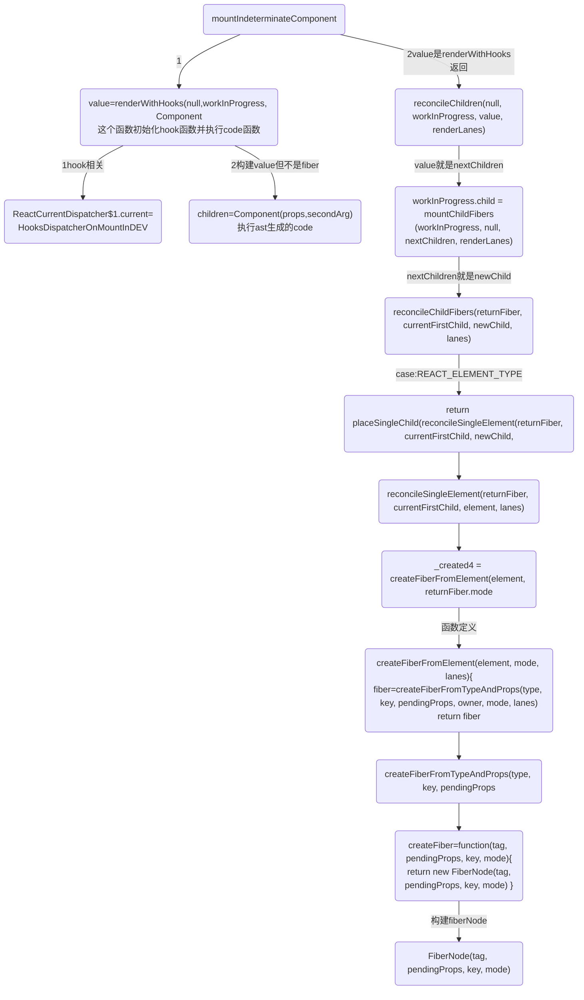
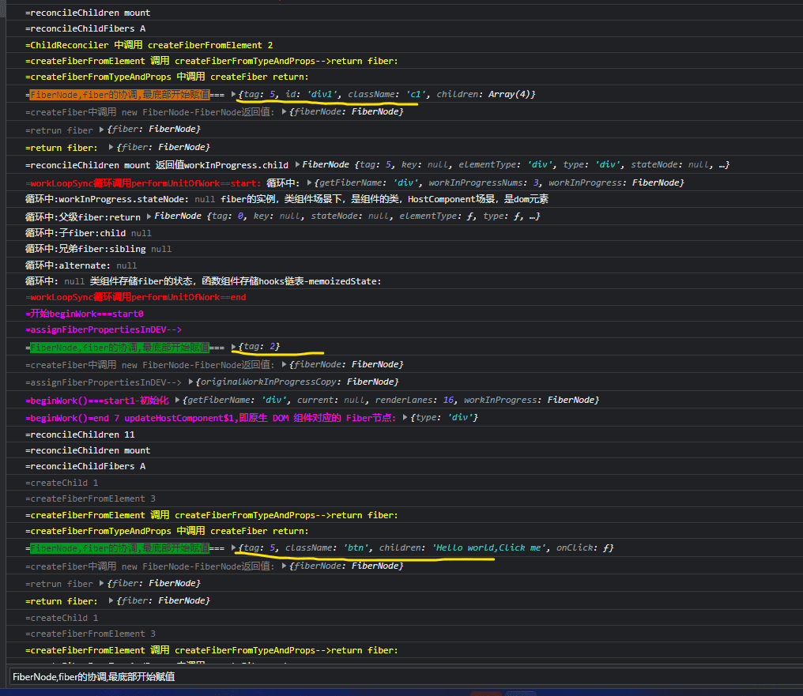

## render阶段
render阶段的执行是一个深度优先遍历的过程，它有两个核心函数，beginWork和completeUnitOfWork,

>参考：图的两种遍历:structure-algorithm/图-深度优先遍历-广度优先遍历/图的两种遍历

render阶段是在内存中构建一棵新的fiber树（称为workInProgress树）,构建过程是依照现有fiber树（current树）从root开始深度优先遍历再回溯到root的过程，`这个过程中每个fiber节点都会经历两个阶段：beginWork和completeWork。`

### beginWork-->completeUnitOfWork
在遍历的过程中，会对每个遍历到的节点执行beginWork创建子fiber节点。若当前节点不存在子节点（next === null），则对其执行completeUnitOfWork。

completeUnitOfWork方法内部会判断当前节点有无兄弟节点，有则进入兄弟节点的beginWork流程，否则进
入父节点的completeUnitOfWork流程

当beginWork返回值为空时，代表在遍历父->子链表的过程中发现当前链表已经无下一个节点了（也就是已遍历完当前父->子链表），此时会进入到completeUnitOfWork函数。

### beginWork阶段:将ast树转换为fiber 树
这些Fiber节点会被标记成带有'Placement'的副作用，说明它们是新增的节点，需要被插入到真实节点中了
```
- 执行部分生命周期和render，得到最新的 children
- 向下遍历调和 children ，复用 oldFiber
- 打不同的副作用标签effectTag，比如类组件的生命周期，或者元素的增加，删除，更新。
```

### completeWork阶段:生成实例
completeUnitOfWork 的流程是自下向上的
1. 将effectTag 的 Fiber 节点保存到 effectList 的单向链表中。 在 commit 阶段，将不再需要遍历每一个 fiber ，只需要执行更新 effectList 就可以了。
2. 处理组件的context，初始化元素标签，生成真实DOM，处理props，等

正在构建Fiber树叫workInProgress Fiber，这两颗树的节点通过alternate相连.

真实dom对应在内存中的Fiber节点形成Fiber树，这颗Fiber树在react中叫current Fiber

组件的状态计算、diff的操作:通过 Diff 算法找出所有节点变更，例如节点新增、删除、属性变更等等, 获得需要更新的节点信息，以及render函数的执行，发生在beginWork阶段

effect链表的收集、被跳过的优先级的收集，发生在completeWork阶段。

render/reconciliation 协调阶段(可中断/异步)：

render 阶段：纯净且没有副作用，可能会被 React 暂停、终止或重新启动。

在 render 阶段，React 主要是在内存中做计算，明确 DOM 树的更新点；而 commit 阶段，则负责把 render 阶段生成的更新真正地执行掉。

在 render 阶段，一个庞大的更新任务被分解为了一个个的工作单元，这些工作单元有着不同的优先级，React 可以根据优先级的高低去实现工作单元的打断和恢复。

### update时
>首次渲染， workInProgress fiber tree中除了根节点之外，所有节点的alternate都为空。所以在mount时，除了根节点fiberRootNode之外，其余节点调用beginWork时参数current等于null。

update时，workInProgress fiber tree所有节点都存在上一次更新时的fiber节点，所以current !== null。

当current和workInProgress满足一定条件时,可以复用current节点的子节点的作为workInProgress的子节点，
反之则需要进入对比（diff）的流程，根据比对的结果创建workInProgress的子节点。

beginWork在创建fiber节点的过程中中会依赖一个didReceiveUpdate变量来标识当前的current是否有更新。
在满足下面的几种情况时，didReceiveUpdate === false：
>1. 未使用forceUpdate，且oldProps === newProps && workInProgress.type === current.type && ！hasLegacyContextChanged() ，即props、fiber.type和context都未发生变化
>2. 未使用forceUpdate，且!includesSomeLane(renderLanes, updateLanes)，即当前fiber节点优先级低于当前更新的优先级

```js
const updateLanes = workInProgress.lanes;
if (current !== null) {
  //update时
  const oldProps = current.memoizedProps;
  const newProps = workInProgress.pendingProps;
  if (
    oldProps !== newProps ||
    hasLegacyContextChanged() ||
    (__DEV__ ? workInProgress.type !== current.type : false)
  ) {
    didReceiveUpdate = true;
  } else if (!includesSomeLane(renderLanes, updateLanes)) {
    // 本次的渲染优先级renderLanes不包含fiber.lanes, 表明当前fiber节点优先级低于本次的渲染优先级，不需渲染
    didReceiveUpdate = false;
    //...
    // 虽然当前节点不需要更新，但需要使用bailoutOnAlreadyFinishedWork循环检测子节点是否需要更新
    return bailoutOnAlreadyFinishedWork(current, workInProgress, renderLanes);
  } else {
    if ((current.effectTag & ForceUpdateForLegacySuspense) !== NoEffect) {
      // forceUpdate产生的更新，需要强制渲染
      didReceiveUpdate = true;
    } else {
      didReceiveUpdate = false;
    }
  }
} else {
  //mount时
  //...
}
```

## beginWork前置工作
### beginWork之前workInProgress根节点构建
```js
  function createWorkInProgress(current, pendingProps) {
    var workInProgress = current.alternate;
    // 区分是在mount时还是在update时
    if (workInProgress === null) {
      // We use a double buffering pooling technique because we know that we'll
      // only ever need at most two versions of a tree. We pool the "other" unused
      // node that we're free to reuse. This is lazily created to avoid allocating
      // extra objects for things that are never updated. It also allow us to
      // reclaim the extra memory if needed.
      console.log('==createWorkInProgress-->,没有就创建一个')
      workInProgress = createFiber(current.tag, pendingProps, current.key, current.mode);
      console.log('==createWorkInProgress-->,没有就创建一个返回值', workInProgress)
      debugger
      workInProgress.elementType = current.elementType;
      workInProgress.type = current.type;
      workInProgress.stateNode = current.stateNode;

      {
        // DEV-only fields
        workInProgress._debugSource = current._debugSource;
        workInProgress._debugOwner = current._debugOwner;
        workInProgress._debugHookTypes = current._debugHookTypes;
      }
      console.log('==createWorkInProgress-->,workInProgress.alternate指定为current')
      workInProgress.alternate = current;
      current.alternate = workInProgress;
    } else {
      // 复用属性
      workInProgress.pendingProps = pendingProps; // Needed because Blocks store data on type.

      workInProgress.type = current.type; // We already have an alternate.
      // Reset the effect tag.

      workInProgress.flags = NoFlags; // The effects are no longer valid.

      workInProgress.subtreeFlags = NoFlags;
      workInProgress.deletions = null;

      {
        // We intentionally reset, rather than copy, actualDuration & actualStartTime.
        // This prevents time from endlessly accumulating in new commits.
        // This has the downside of resetting values for different priority renders,
        // But works for yielding (the common case) and should support resuming.
        workInProgress.actualDuration = 0;
        workInProgress.actualStartTime = -1;
      }
    } // Reset all effects except static ones.
    // Static effects are not specific to a render.


    workInProgress.flags = current.flags & StaticMask;
    // 复用属性
    workInProgress.childLanes = current.childLanes;
    workInProgress.lanes = current.lanes;
    workInProgress.child = current.child;
    workInProgress.memoizedProps = current.memoizedProps;
    workInProgress.memoizedState = current.memoizedState;
    workInProgress.updateQueue = current.updateQueue; // Clone the dependencies object. This is mutated during the render phase, so
    // it cannot be shared with the current fiber.

    var currentDependencies = current.dependencies;
    workInProgress.dependencies = currentDependencies === null ? null : {
      lanes: currentDependencies.lanes,
      firstContext: currentDependencies.firstContext
    }; // These will be overridden during the parent's reconciliation

    workInProgress.sibling = current.sibling;
    workInProgress.index = current.index;
    workInProgress.ref = current.ref;

    {
      workInProgress.selfBaseDuration = current.selfBaseDuration;
      workInProgress.treeBaseDuration = current.treeBaseDuration;
    }

    {
      workInProgress._debugNeedsRemount = current._debugNeedsRemount;

      switch (workInProgress.tag) {
        case IndeterminateComponent:
        case FunctionComponent:
        case SimpleMemoComponent:
          workInProgress.type = resolveFunctionForHotReloading(current.type);
          break;

        case ClassComponent:
          workInProgress.type = resolveClassForHotReloading(current.type);
          break;

        case ForwardRef:
          workInProgress.type = resolveForwardRefForHotReloading(current.type);
          break;
      }
    }

    return workInProgress;
  }
```

### 为workInProgress赋值-renderRootSync-->prepareFreshStack
```js
function renderRootSync(root, lanes) {
  var prevExecutionContext = executionContext;
  executionContext |= RenderContext;
  var prevDispatcher = pushDispatcher(); // If the root or lanes have changed, throw out the existing stack
  // and prepare a fresh one. Otherwise we'll continue where we left off.

  if (workInProgressRoot !== root || workInProgressRootRenderLanes !== lanes) {
    {
      if (isDevToolsPresent) {
        var memoizedUpdaters = root.memoizedUpdaters;

        if (memoizedUpdaters.size > 0) {
          restorePendingUpdaters(root, workInProgressRootRenderLanes);
          memoizedUpdaters.clear();
        } // At this point, move Fibers that scheduled the upcoming work from the Map to the Set.
        // If we bailout on this work, we'll move them back (like above).
        // It's important to move them now in case the work spawns more work at the same priority with different updaters.
        // That way we can keep the current update and future updates separate.


        movePendingFibersToMemoized(root, lanes);
      }

    }

    workInProgressTransitions = getTransitionsForLanes();

    console.log('workInProgress', workInProgress, root)
    debugger
    console.log('render调用 prepareFreshStack前',workInProgress)
    prepareFreshStack(root, lanes);
    console.log('workInProgress', workInProgress, root)
    console.log('render调用 prepareFreshStack后',workInProgress)
  }

function prepareFreshStack(root, lanes) {
  root.finishedWork = null;
  root.finishedLanes = NoLanes;
  var timeoutHandle = root.timeoutHandle;

  if (timeoutHandle !== noTimeout) {
    // The root previous suspended and scheduled a timeout to commit a fallback
    // state. Now that we have additional work, cancel the timeout.
    root.timeoutHandle = noTimeout; // $FlowFixMe Complains noTimeout is not a TimeoutID, despite the check above

    cancelTimeout(timeoutHandle);
  }

  if (workInProgress !== null) {
    var interruptedWork = workInProgress.return;

    while (interruptedWork !== null) {
      var current = interruptedWork.alternate;
      unwindInterruptedWork(current, interruptedWork);
      interruptedWork = interruptedWork.return;
    }
  }

  console.log('=render阶段:prepareFreshStack=处理workInProgressRoot:workInProgressRoot = root')
  workInProgressRoot = root;
  var rootWorkInProgress = createWorkInProgress(root.current, null);
  workInProgress = rootWorkInProgress;
  workInProgressRootRenderLanes = subtreeRenderLanes = workInProgressRootIncludedLanes = lanes;
  workInProgressRootExitStatus = RootInProgress;
  workInProgressRootFatalError = null;
  workInProgressRootSkippedLanes = NoLanes;
  workInProgressRootInterleavedUpdatedLanes = NoLanes;
  workInProgressRootPingedLanes = NoLanes;
  workInProgressRootConcurrentErrors = null;
  workInProgressRootRecoverableErrors = null;
  enqueueInterleavedUpdates();

  {
    ReactStrictModeWarnings.discardPendingWarnings();
  }

  return rootWorkInProgress;
}
```

## 第一次beginWork调用updateHostRoot进行初始化:updateHostRoot
updateHostRoot-->reconcileChildren(current, workInProgress, nextChildren, renderLanes)-->reconcileChildren
```js
  function beginWork(current, workInProgress, renderLanes) {
    console.log('workInProgress', workInProgress, root)
    debugger
    workInProgress.lanes = NoLanes;
    console.log('%c=beginWork()===start1-初始化', 'color:magenta', { getFiberName: getFiberName(workInProgress), current, renderLanes, workInProgress })
    switch (workInProgress.tag) {
      case IndeterminateComponent:
        {
          console.log('%c=beginWork()==end 2 mountIndeterminateComponent', 'color:magenta', workInProgress)
          console.log(`%c=探究初始和hook=调用mountIndeterminateComponent`, 'color:blueviolet', workInProgress.type)
          return mountIndeterminateComponent(current, workInProgress, workInProgress.type, renderLanes);
      }
      case HostRoot:
        console.log('%c=beginWork()=end 6第一次会走这里初始化workInProgress', 'color:magenta')
        console.log('%c=beginWork()=end 6 updateHostRoot', 'color:magenta')
        return updateHostRoot(current, workInProgress, renderLanes);
    }
  }
```

### 首次case进入HostRoot 更新updateHostRoot：
```js
function updateHostRoot(current, workInProgress, renderLanes) {
  pushHostRootContext(workInProgress);

  if (current === null) {
    throw new Error('Should have a current fiber. This is a bug in React.');
  }

  var nextProps = workInProgress.pendingProps;
  var prevState = workInProgress.memoizedState;
  var prevChildren = prevState.element;
  cloneUpdateQueue(current, workInProgress);
  processUpdateQueue(workInProgress, nextProps, null, renderLanes);
  var nextState = workInProgress.memoizedState;
  var root = workInProgress.stateNode;
  // being called "element".


  var nextChildren = nextState.element;

  if (prevState.isDehydrated) {
  } else {
      // Root is not dehydrated. Either this is a client-only root, or it
      // already hydrated.
      resetHydrationState();

      if (nextChildren === prevChildren) {
        return bailoutOnAlreadyFinishedWork(current, workInProgress, renderLanes);
      }

      console.log('=reconcileChildren 9')
      debugger
      reconcileChildren(current, workInProgress, nextChildren, renderLanes);
      console.log('%c=updateHostRoot:构建之后workInProgress.child', 'color:black', { child })
  }
  console.log('%c=updateHostRoot:最后返回workInProgress.child', 'color:black', workInProgress.child)

  return workInProgress.child;
}
```

```js
function reconcileChildren(current, workInProgress, nextChildren, renderLanes) {
  if (current === null) {
    // If this is a fresh new component that hasn't been rendered yet, we
    // won't update its child set by applying minimal side-effects. Instead,
    // we will add them all to the child before it gets rendered. That means
    // we can optimize this reconciliation pass by not tracking side-effects.
    console.log('%c=reconcileChildren mount', 'blueviolet');
    workInProgress.child = mountChildFibers(workInProgress, null, nextChildren, renderLanes);
    console.log('%c=reconcileChildren mount 返回值workInProgress.child', 'blueviolet', workInProgress.child);
  } else {
    // If the current child is the same as the work in progress, it means that
    // we haven't yet started any work on these children. Therefore, we use
    // the clone algorithm to create a copy of all the current children.
    // If we had any progressed work already, that is invalid at this point so
    // let's throw it out.
    console.log('%c=reconcileChildren update', 'yellow');
    workInProgress.child = reconcileChildFibers(workInProgress, current.child, nextChildren, renderLanes);
  }
}
```

### 很长的函数-ChildReconciler定义了reconcileChildFibers等很多函数
Reconciler模块的核心部分

* 对于 mount 的组件，他会创建新的子 Fiber 节点；
* 对于 update 的组件，他会将当前组件与该组件在上次更新时对应的 Fiber 节点比较-Diff算法，将比较的结果生成新 Fiber 节点。

不论走哪个逻辑，最终他会生成新的子 Fiber 节点并赋值给workInProgress.child，作为本次 beginWork 返回值，并作为下次performUnitOfWork执行时workInProgress的传参。

mountChildFibers与reconcileChildFibers这两个方法的逻辑基本一致。唯一的区别是：reconcileChildFibers 会为生成的 Fiber 节点带上effectTag属性，而 mountChildFibers 不会。
```js
var mountChildFibers = ChildReconciler(false);
// 这个代码很长 1k,定义很多函数reconcileChildFibers()是其中一个
function ChildReconciler(shouldTrackSideEffects) {
  // 省略很多函数
  function reconcileChildFibers(returnFiber, currentFirstChild, newChild, lanes) {
    // This function is not recursive.
    // If the top level item is an array, we treat it as a set of children,
    // not as a fragment. Nested arrays on the other hand will be treated as
    // fragment nodes. Recursion happens at the normal flow.
    // Handle top level unkeyed fragments as if they were arrays.
    // This leads to an ambiguity between <>{[...]}</> and <>...</>.
    // We treat the ambiguous cases above the same.
    var isUnkeyedTopLevelFragment = typeof newChild === 'object' && newChild !== null && newChild.type === REACT_FRAGMENT_TYPE && newChild.key === null;

    // debugger
    console.log('%c=reconcileChildFibers A', 'blueviolet');

    if (isUnkeyedTopLevelFragment) {
      newChild = newChild.props.children;
    } // Handle object types


    if (typeof newChild === 'object' && newChild !== null) {
      switch (newChild.$$typeof) {
        case REACT_ELEMENT_TYPE:
          return placeSingleChild(reconcileSingleElement(returnFiber, currentFirstChild, newChild, lanes));

        case REACT_PORTAL_TYPE:
          return placeSingleChild(reconcileSinglePortal(returnFiber, currentFirstChild, newChild, lanes));

        case REACT_LAZY_TYPE:
          var payload = newChild._payload;
          var init = newChild._init; // TODO: This function is supposed to be non-recursive.

          return reconcileChildFibers(returnFiber, currentFirstChild, init(payload), lanes);
      }

      if (isArray(newChild)) {
        return reconcileChildrenArray(returnFiber, currentFirstChild, newChild, lanes);
      }

      if (getIteratorFn(newChild)) {
        return reconcileChildrenIterator(returnFiber, currentFirstChild, newChild, lanes);
      }

      throwOnInvalidObjectType(returnFiber, newChild);
    }

    if (typeof newChild === 'string' && newChild !== '' || typeof newChild === 'number') {
      return placeSingleChild(reconcileSingleTextNode(returnFiber, currentFirstChild, '' + newChild, lanes));
    }

    {
      if (typeof newChild === 'function') {
        warnOnFunctionType(returnFiber);
      }
    } // Remaining cases are all treated as empty.


    return deleteRemainingChildren(returnFiber, currentFirstChild);
  }

  return reconcileChildFibers;
}
```


## 第二次beginWork-case:mountIndeterminateComponent执行code()
执行完code()此时的workInProgress.type 才有值;

第二次beginWork进入case IndeterminateComponent 执行 mountIndeterminateComponent(),可见深度遍历从父级组件开始

首先要注意的是，虽然 App 是一个 FunctionComponent，但是在 first paint 的时候，React 判断其为 IndeterminateComponent

对于 FunctionComponent，在第一次识别的时候会被认为是 IndeterminateComponent
```js
switch (workInProgress.tag) {
  case IndeterminateComponent:
    {
      console.log('%c=beginWork()==end 2 mountIndeterminateComponent', 'color:magenta')
      console.log(`%c=探究初始和hook=调用mountIndeterminateComponent`, 'color:blueviolet')
      return mountIndeterminateComponent(current, workInProgress, workInProgress.type, renderLanes);
    }
  }
```

### 重点-code函数初始化在mountIndeterminateComponent()调用renderWithHooks()和reconcileChildren()
1. 重点1:mountIndeterminateComponent()函数
    * 调用  renderWithHooks 生成 value
    * 执行 reconcileChildren(null, workInProgress, value, renderLanes) 参数value
>关键的函数 renderWithHooks；而在 renderWithHooks 中，我们会根据组件处于不同的状态，给 ReactCurrentDispatcher.current 挂载不同的 dispatcher 。而在first paint 时，挂载的是HooksDispatcherOnMountInDEV
>HooksDispatcherOnMountInDEV 里就是组件 first paint 的时候所用到的各种 hooks

2. 重点2,执行reconcileChildren()并传入value,就是code()返回的树结构
```js
function mountIndeterminateComponent(_current, workInProgress, Component, renderLanes) {
  if (_current !== null) {
    // An indeterminate component only mounts if it suspended inside a non-
    // concurrent tree, in an inconsistent state. We want to treat it like
    // a new mount, even though an empty version of it already committed.
    // Disconnect the alternate pointers.
    _current.alternate = null;
    workInProgress.alternate = null; // Since this is conceptually a new fiber, schedule a Placement effect

    workInProgress.flags |= Placement;
  }

  var props = workInProgress.pendingProps;
  var context;

  {
    var unmaskedContext = getUnmaskedContext(workInProgress, Component, false);
    context = getMaskedContext(workInProgress, unmaskedContext);
  }

  prepareToReadContext(workInProgress, renderLanes);
  var value;
  var hasId;

  {
    markComponentRenderStarted(workInProgress);
  }

  {
    if (Component.prototype && typeof Component.prototype.render === 'function') {
    // 省略
    // debugger
    console.log(`%c=探究初始和hook=mountIndeterminateComponent调用renderWithHooks 1`, 'color:blueviolet', { workInProgress, Component, props, context, renderLanes })
    value = renderWithHooks(null, workInProgress, Component, props, context, renderLanes);
    console.log(`%c=探究初始和hook=mountIndeterminateComponent调用renderWithHooks 返回值`, 'color:blueviolet', { value })
    hasId = checkDidRenderIdHook();
    setIsRendering(false);
  }

  // 省略

  if ( // Run these checks in production only if the flag is off.
    // Eventually we'll delete this branch altogether.
    typeof value === 'object' && value !== null && typeof value.render === 'function' && value.$$typeof === undefined) {
      // 省略
  } else {
    // Proceed under the assumption that this is a function component
    workInProgress.tag = FunctionComponent;

    {

      if (workInProgress.mode & StrictLegacyMode) {
        setIsStrictModeForDevtools(true);

        try {
          console.log(`%c=探究初始和hook=mountIndeterminateComponent调用renderWithHooks 2`, 'color:blueviolet')
          value = renderWithHooks(null, workInProgress, Component, props, context, renderLanes);
          hasId = checkDidRenderIdHook();
        } finally {
          setIsStrictModeForDevtools(false);
        }
      }
    }

    if (getIsHydrating() && hasId) {
      pushMaterializedTreeId(workInProgress);
    }


    // debugger
    console.log('%c=reconcileChildren 12:重点，mountIndeterminateComponent调用reconcileChildren', 'color:red')
    reconcileChildren(null, workInProgress, value, renderLanes);

    {
      validateFunctionComponentInDev(workInProgress, Component);
    }

    return workInProgress.child;
  }
}
```

### renderWithHooks 执行code()
```js
function renderWithHooks(current, workInProgress, Component, props, secondArg, nextRenderLanes) {
    // 省略：
    console.log(`%c=探究初始和hook=renderWithHooks重点，调用函数组件，里面执行各种 React Hook==start并返回 ReactElement`, 'color:blueviolet', Component)
    var children = Component(props, secondArg); // Check if there was a render phase update
    console.log(`%c=探究初始和hook=renderWithHooks重点,返回 ReactElement==end`, 'color:blueviolet', { children })
    // 省略：
    return children;
}
```

code()函数和React.createElement
```js
return React.createElement(
  'div',
  { id: 'div1', className: 'c1' },
  React.createElement(
    'button',
    { onClick: onClickText, className: 'btn' },
    'Hello world,Click me'
  ),
  React.createElement(
    'span',
    null,
    data
  ),
  showDiv && React.createElement(
    'div',
    null,
    '\u88AB\u4F60\u53D1\u73B0\u4E86'
  ),
  React.createElement(
    'div',
    { id: 'div2', className: 'c2' },
    React.createElement(
      'p',
      null,
      '\u6D4B\u8BD5\u5B50\u8282\u70B9'
    )
  )
);

function createElement(type, config, children) {
  // console.log('=development调用createElement构建Ast树:', { type, config, children })
  console.log('%c=development调用createElement-1:type', 'color:blueviolet', type, { config, children })
  var propName; // Reserved names are extracted

  var props = {};
  var key = null;
  var ref = null;
  var self = null;
  var source = null;

  if (config != null) {
  }
}
```

## 流程图-构建fiber树流程
只要返回的是一个对象且对象中有 render 方法，就认为是 ClassComponent，否则就是 FunctionComponent,从mountIndeterminateComponent开始,这里以函数组件为例:

接[render阶段总览:流程图的mountIndeterminateComponent函数](./render阶段总览)


## reconcileChildren 重点函数
```js
function reconcileChildren(current, workInProgress, nextChildren, renderLanes) {
  if (current === null) {
    // If this is a fresh new component that hasn't been rendered yet, we
    // won't update its child set by applying minimal side-effects. Instead,
    // we will add them all to the child before it gets rendered. That means
    // we can optimize this reconciliation pass by not tracking side-effects.
    console.log('%c=reconcileChildren mount', 'blueviolet');
    // 对于 mount 的组件
    workInProgress.child = mountChildFibers(workInProgress, null, nextChildren, renderLanes);
    console.log('%c=reconcileChildren mount 返回值workInProgress.child', 'blueviolet', workInProgress.child);
  } else {
    // If the current child is the same as the work in progress, it means that
    // we haven't yet started any work on these children. Therefore, we use
    // the clone algorithm to create a copy of all the current children.
    // If we had any progressed work already, that is invalid at this point so
    // let's throw it out.
    console.log('%c=reconcileChildren update', 'yellow');
    // 对于 update 的组件
    workInProgress.child = reconcileChildFibers(workInProgress, current.child, nextChildren, renderLanes);
  }
}
```

## 上面的reconcileChildren 调用 reconcileChildFibers
```js
  function reconcileChildFibers(returnFiber, currentFirstChild, newChild, lanes) {
    // This function is not recursive.
    // If the top level item is an array, we treat it as a set of children,
    // not as a fragment. Nested arrays on the other hand will be treated as
    // fragment nodes. Recursion happens at the normal flow.
    // Handle top level unkeyed fragments as if they were arrays.
    // This leads to an ambiguity between <>{[...]}</> and <>...</>.
    // We treat the ambiguous cases above the same.
    var isUnkeyedTopLevelFragment = typeof newChild === 'object' && newChild !== null && newChild.type === REACT_FRAGMENT_TYPE && newChild.key === null;

    // debugger
    console.log('%c=reconcileChildFibers A', 'blueviolet');

    if (isUnkeyedTopLevelFragment) {
      newChild = newChild.props.children;
    } // Handle object types


    if (typeof newChild === 'object' && newChild !== null) {
      switch (newChild.$$typeof) {
        case REACT_ELEMENT_TYPE:
          return placeSingleChild(reconcileSingleElement(returnFiber, currentFirstChild, newChild, lanes));

        case REACT_PORTAL_TYPE:
          return placeSingleChild(reconcileSinglePortal(returnFiber, currentFirstChild, newChild, lanes));

        case REACT_LAZY_TYPE:
          var payload = newChild._payload;
          var init = newChild._init; // TODO: This function is supposed to be non-recursive.

          return reconcileChildFibers(returnFiber, currentFirstChild, init(payload), lanes);
      }

      if (isArray(newChild)) {
        return reconcileChildrenArray(returnFiber, currentFirstChild, newChild, lanes);
      }

      if (getIteratorFn(newChild)) {
        return reconcileChildrenIterator(returnFiber, currentFirstChild, newChild, lanes);
      }

      throwOnInvalidObjectType(returnFiber, newChild);
    }

    if (typeof newChild === 'string' && newChild !== '' || typeof newChild === 'number') {
      return placeSingleChild(reconcileSingleTextNode(returnFiber, currentFirstChild, '' + newChild, lanes));
    }

    {
      if (typeof newChild === 'function') {
        warnOnFunctionType(returnFiber);
      }
    } // Remaining cases are all treated as empty.


    return deleteRemainingChildren(returnFiber, currentFirstChild);
  }
```

## 上面的reconcileChildFibers 调用 reconcileSingleElement
```js
function reconcileSingleElement(returnFiber, currentFirstChild, element, lanes) {
  var key = element.key;
  var child = currentFirstChild;

  while (child !== null) {
    // 省略
  }

  if (element.type === REACT_FRAGMENT_TYPE) {
    var created = createFiberFromFragment(element.props.children, returnFiber.mode, lanes, element.key);
    created.return = returnFiber;
    return created;
  } else {
    console.log('%c=ChildReconciler 中调用 createFiberFromElement 2', 'color:yellow');
    var _created4 = createFiberFromElement(element, returnFiber.mode, lanes);

    _created4.ref = coerceRef(returnFiber, currentFirstChild, element);
    _created4.return = returnFiber;
    return _created4;
  }
}
```

## 上面reconcileSingleElement 调用 createFiberFromElement
```js
  function createFiberFromElement(element, mode, lanes) {
    var owner = null;

    {
      owner = element._owner;
    }

    var type = element.type;
    var key = element.key;
    var pendingProps = element.props;
    console.log('%c=createFiberFromElement 调用 createFiberFromTypeAndProps-->return fiber：', 'color:yellow')
    var fiber = createFiberFromTypeAndProps(type, key, pendingProps, owner, mode, lanes);
    console.log('%c=return fiber：', 'color:yellow', { fiber })
    {
      fiber._debugSource = element._source;
      fiber._debugOwner = element._owner;
    }

    return fiber;
  }
```
## 上面createFiberFromElement 调用 createFiberFromTypeAndProps
```js
function createFiberFromElement(element, mode, lanes) {
  var owner = null;

  {
    owner = element._owner;
  }

  var type = element.type;
  var key = element.key;
  var pendingProps = element.props;
  console.log('%c=createFiberFromElement 调用 createFiberFromTypeAndProps-->return fiber：', 'color:yellow')
  var fiber = createFiberFromTypeAndProps(type, key, pendingProps, owner, mode, lanes);
  console.log('%c=return fiber：', 'color:yellow', { fiber })
  {
    fiber._debugSource = element._source;
    fiber._debugOwner = element._owner;
  }

  return fiber;
}
```

## 上面的 createFiberFromElement 调用 createFiberFromTypeAndProps
```js
  function createFiberFromTypeAndProps(type, // React$ElementType
    key, pendingProps, owner, mode, lanes) {
    var fiberTag = IndeterminateComponent; // The resolved type is set if we know what the final type will be. I.e. it's not lazy.

    var resolvedType = type;

    if (typeof type === 'function') {
      if (shouldConstruct$1(type)) {
        fiberTag = ClassComponent;

        {
          resolvedType = resolveClassForHotReloading(resolvedType);
        }
      } else {
        {
          resolvedType = resolveFunctionForHotReloading(resolvedType);
        }
      }
    } else if (typeof type === 'string') {
      fiberTag = HostComponent;
    } else {
      getTag: switch (type) {
        case REACT_FRAGMENT_TYPE:
          return createFiberFromFragment(pendingProps.children, mode, lanes, key);

        case REACT_STRICT_MODE_TYPE:
          fiberTag = Mode;
          mode |= StrictLegacyMode;

          if ((mode & ConcurrentMode) !== NoMode) {
            // Strict effects should never run on legacy roots
            mode |= StrictEffectsMode;
          }

          break;

        case REACT_PROFILER_TYPE:
          return createFiberFromProfiler(pendingProps, mode, lanes, key);

        case REACT_SUSPENSE_TYPE:
          return createFiberFromSuspense(pendingProps, mode, lanes, key);

        case REACT_SUSPENSE_LIST_TYPE:
          return createFiberFromSuspenseList(pendingProps, mode, lanes, key);

        case REACT_OFFSCREEN_TYPE:
          return createFiberFromOffscreen(pendingProps, mode, lanes, key);

        case REACT_LEGACY_HIDDEN_TYPE:

        // eslint-disable-next-line no-fallthrough

        case REACT_SCOPE_TYPE:

        // eslint-disable-next-line no-fallthrough

        case REACT_CACHE_TYPE:

        // eslint-disable-next-line no-fallthrough

        case REACT_TRACING_MARKER_TYPE:

        // eslint-disable-next-line no-fallthrough

        case REACT_DEBUG_TRACING_MODE_TYPE:

        // eslint-disable-next-line no-fallthrough

        default:
          {
            if (typeof type === 'object' && type !== null) {
              switch (type.$$typeof) {
                case REACT_PROVIDER_TYPE:
                  fiberTag = ContextProvider;
                  break getTag;

                case REACT_CONTEXT_TYPE:
                  // This is a consumer
                  fiberTag = ContextConsumer;
                  break getTag;

                case REACT_FORWARD_REF_TYPE:
                  fiberTag = ForwardRef;

                  {
                    resolvedType = resolveForwardRefForHotReloading(resolvedType);
                  }

                  break getTag;

                case REACT_MEMO_TYPE:
                  fiberTag = MemoComponent;
                  break getTag;

                case REACT_LAZY_TYPE:
                  fiberTag = LazyComponent;
                  resolvedType = null;
                  break getTag;
              }
            }

            var info = '';

            {
              if (type === undefined || typeof type === 'object' && type !== null && Object.keys(type).length === 0) {
                info += ' You likely forgot to export your component from the file ' + "it's defined in, or you might have mixed up default and " + 'named imports.';
              }

              var ownerName = owner ? getComponentNameFromFiber(owner) : null;

              if (ownerName) {
                info += '\n\nCheck the render method of `' + ownerName + '`.';
              }
            }

            throw new Error('Element type is invalid: expected a string (for built-in ' + 'components) or a class/function (for composite components) ' + ("but got: " + (type == null ? type : typeof type) + "." + info));
          }
      }
    }

    console.log('%c=createFiberFromTypeAndProps 中调用 createFiber return：', 'color:yellow')
    var fiber = createFiber(fiberTag, pendingProps, key, mode);
    console.log(`%c=retrun fiber`, 'color:grey', { fiber })
    fiber.elementType = type;
    fiber.type = resolvedType;
    fiber.lanes = lanes;

    {
      fiber._debugOwner = owner;
    }

    return fiber;
  }
```

## 上面的 createFiberFromTypeAndProps 调用 createFiber-->FiberNode
[测试例子](https://github.com/huiruo/programming-tech-website/blob/main/programming-tech/React/00-react%E6%BA%90%E7%A0%81%E8%BF%90%E8%A1%8C%E4%BE%8B%E5%AD%90/%E4%BE%8B1-%E4%B8%BB%E8%A6%81%E6%B5%8B%E8%AF%95%E5%AE%9E%E4%BE%8B-render-commit-18.html)


```js
var createFiber = function (tag, pendingProps, key, mode) {
  // $FlowFixMe: the shapes are exact here but Flow doesn't like constructors
  var fiberNode = new FiberNode(tag, pendingProps, key, mode)
  console.log('%c=createFiber中调用 new FiberNode-FiberNode返回值:', 'color:grey', { fiberNode })
  return fiberNode;
};

function FiberNode(tag, pendingProps, key, mode) {
  console.log('%c=FiberNode,fiber的协调,最底部开始赋值===', 'color:yellow', { tag, ...pendingProps })
  // Instance
  this.tag = tag;
  this.key = key;
  this.elementType = null;
  this.type = null;
  this.stateNode = null; // Fiber

  this.return = null;
  this.child = null;
  this.sibling = null;
  this.index = 0;
  this.ref = null;
  this.pendingProps = pendingProps;
  this.memoizedProps = null;
  this.updateQueue = null;
  this.memoizedState = null;
  this.dependencies = null;
  this.mode = mode; // Effects

  this.flags = NoFlags;
  this.subtreeFlags = NoFlags;
  this.deletions = null;
  this.lanes = NoLanes;
  this.childLanes = NoLanes;
  this.alternate = null;

  {
    // Note: The following is done to avoid a v8 performance cliff.
    //
    // Initializing the fields below to smis and later updating them with
    // double values will cause Fibers to end up having separate shapes.
    // This behavior/bug has something to do with Object.preventExtension().
    // Fortunately this only impacts DEV builds.
    // Unfortunately it makes React unusably slow for some applications.
    // To work around this, initialize the fields below with doubles.
    //
    // Learn more about this here:
    // https://github.com/facebook/react/issues/14365
    // https://bugs.chromium.org/p/v8/issues/detail?id=8538
    this.actualDuration = Number.NaN;
    this.actualStartTime = Number.NaN;
    this.selfBaseDuration = Number.NaN;
    this.treeBaseDuration = Number.NaN; // It's okay to replace the initial doubles with smis after initialization.
    // This won't trigger the performance cliff mentioned above,
    // and it simplifies other profiler code (including DevTools).

    this.actualDuration = 0;
    this.actualStartTime = -1;
    this.selfBaseDuration = 0;
    this.treeBaseDuration = 0;
  }

  {
    // This isn't directly used but is handy for debugging internals:
    this._debugSource = null;
    this._debugOwner = null;
    this._debugNeedsRemount = false;
    this._debugHookTypes = null;

    if (!hasBadMapPolyfill && typeof Object.preventExtensions === 'function') {
      Object.preventExtensions(this);
    }
  }
}
```

## 第三次-beginWork-此时构建 code() 生成的节点

```js
      case HostComponent:
        console.log(`%c=beginWork()=end 7 updateHostComponent$1,即原生 DOM 组件对应的 Fiber节点:`, 'color:magenta', { type: workInProgress.type })
        return updateHostComponent$1(current, workInProgress, renderLanes);
```

此时 workInProgress
```
actualDuration:0
actualStartTime:-1
alternate:null
child:null
childLanes:0
deletions: null
dependencies: null
elementType:"div"
flags: 0
index : 0
key : null
lanes : 0
memoizedProps:null
memoizedState:null
mode:1
pendingProps:{id: 'div1', className: 'c1', children: Array(4)}
ref:null
return:FiberNode {tag: 0, key: null, stateNode: null, elementType: ƒ, type: ƒ, …}
selfBaseDuration:0,
sibling:null
stateNode:null
subtreeFlags:0
tag:5
treeBaseDuration:0
type:"div"
updateQueue:null
```

```js
function updateHostComponent$1(current, workInProgress, renderLanes) {
  pushHostContext(workInProgress);

  if (current === null) {
    tryToClaimNextHydratableInstance(workInProgress);
  }

  var type = workInProgress.type;
  var nextProps = workInProgress.pendingProps;
  var prevProps = current !== null ? current.memoizedProps : null;
  var nextChildren = nextProps.children;
  var isDirectTextChild = shouldSetTextContent(type, nextProps);

  if (isDirectTextChild) {
    // We special case a direct text child of a host node. This is a common
    // case. We won't handle it as a reified child. We will instead handle
    // this in the host environment that also has access to this prop. That
    // avoids allocating another HostText fiber and traversing it.
    nextChildren = null;
  } else if (prevProps !== null && shouldSetTextContent(type, prevProps)) {
    // If we're switching from a direct text child to a normal child, or to
    // empty, we need to schedule the text content to be reset.
    workInProgress.flags |= ContentReset;
  }

  markRef$1(current, workInProgress);
  console.log('=reconcileChildren 11')
  reconcileChildren(current, workInProgress, nextChildren, renderLanes);
  return workInProgress.child;
}
```