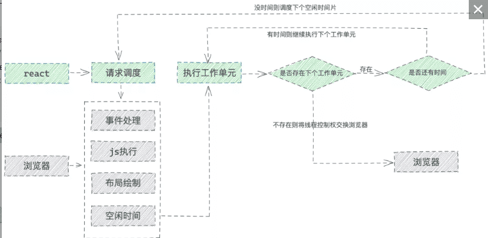
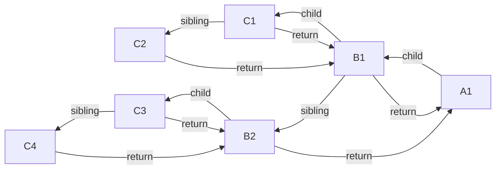
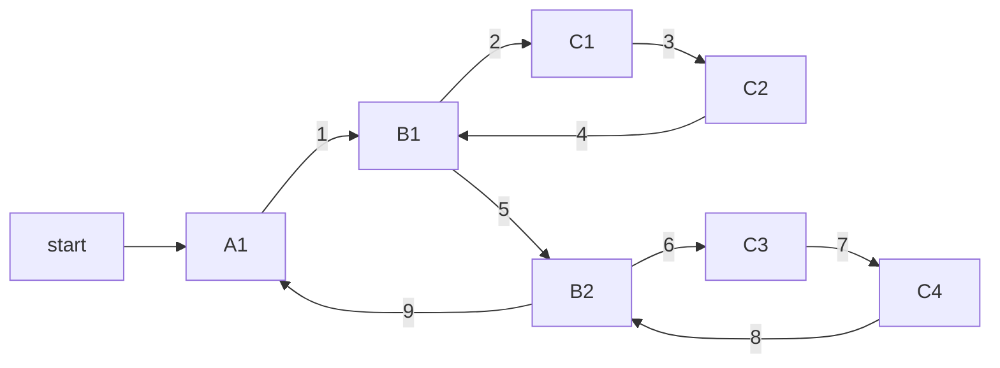
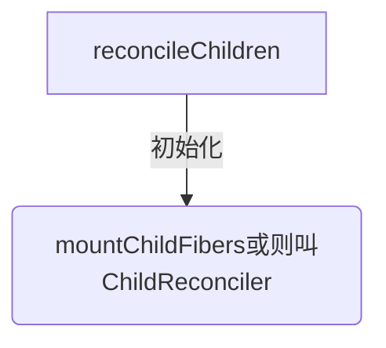

## render之任务调度
* 同步不可中断更新，意味着在更新过程中，即使产生了更高优先级的更新，原来的更新也会继续处理，等处理完毕渲染到屏幕上以后才会开始处理更高优先级的更新。

* 异步可中断更新，在构建 workInProgress 的过程中，如果有更高优先级的更新产生， React 会停止 workInProgress fiber tree 的构建，然后开始处理更高优先级的更新，重新构建 workInProgress fiber tree。

等更高优先级的更新处理完毕之后，才会处理原来被中断的更新。

React fiber的构建的过程以每个fiber作为一个工作单元，进行工作循环，工作循环中每次处理一个任务（工作单元），处理完毕有一次喘息的机会：
```js
while (nextUnitOfWork !== null && !shouldYieldToRenderer()) {
  nextUnitOfWork = performUnitOfWork(nextUnitOfWork);
}
```
shouldYieldToRenderer就是看时间用完了没，没用完的话继续处理下一个任务，用完了就结束，把时间控制权还给主线程，等下一次requestIdleCallback回调再接着做。但如果当前渲染执行很长一段时间后还未结束，那么就不再会喘息，而是一次性把剩余工作全部做完。
```js
if (!isYieldy) {
  // Flush work without yielding
  while (nextUnitOfWork !== null) {
    nextUnitOfWork = performUnitOfWork(nextUnitOfWork);
  }
}
```
React Fiber的工作调度与浏览器的核心交互流程如下： 



### 任务调度例子
我们点击 Child 的 button 按钮，同时给 Child 和 Parent 的 number 加 1。其中 Child 的加 1 操作先开始，并且 Parent 的加 1 操作优先级更高。
```js
function Parent() {
    const [number, setNumber] = useState(1);
    const buttonRef = useRef(null);
    const add = () => { setNumber(number + 1) }
    const click = () => { buttonRef.current.click() }
    return (
        <div>
            <button ref={buttonRef} onClick={add}>修改 Parent</button>
            <span>{number}</span>
            <Child callback={click} />
        </div>
    )
 }

const Child = (props) => {
    const [number, setNumber] = useState(1);
    const click = () => {
        setTimeout(() => {
            // setTimeout 内部产生的更新，优先级为普通优先级
            setNumber(number + 1);
        }, 10)
        setTimeout(() => {
            // click 触发的更新，优先级为用户 block 优先级，要更高一些
            props.callback && props.callback();
        }, 10);
     }

    return (
        <div>
            <button onClick={click}>修改 Child + Parent</button>
            <div  className="box">
                {Array(50000).fill(number).map(item => (<span>{item}</span>))}
            </div>
        </div>
                
    )
}
```

## render阶段前置工作
### render前置工作: 第一次渲染中调用performConcurrentWorkOnRoot()
`调用 ReactDOMRoot.prototype.render() 开始render阶段`

18中初始化调用`performSyncWorkOnRoot()`或`performConcurrentWorkOnRoot()`的调用,这取决于本次更新是同步更新还是异步更新.

总结:
render 阶段开始于 performSyncWorkOnRoot 或 performConcurrentWorkOnRoot 方法的调用。前面有提到：这取决于本次更新是同步更新还是异步更新。
```js
// performConcurrentWorkOnRoot 调用 renderRootSync -->workLoopSync
function performConcurrentWorkOnRoot(root, didTimeout) {
  var exitStatus = shouldTimeSlice ? renderRootConcurrent(root, lanes) : renderRootSync(root, lanes);
  return null;
}

// 第一次渲染走这个 renderRootSync --> renderRootSync -->workLoopSync
function renderRootSync(root, lanes) {
  do {
    try {
      console.log('renderRootSync--->', root);
      workLoopSync();
      break;
    } catch (thrownValue) {
      handleError(root, thrownValue);
    }
  } while (true);
}

function renderRootConcurrent(root, lanes) {
do {
  try {
    workLoopConcurrent();
    break;
  } catch (thrownValue) {
    handleError(root, thrownValue);
  }
} while (true);
}
```


### 第2步.渲染:workLoopSync()-->performUnitOfWork()
### 扩展：workLoopConcurrent()和workLoopSync()区别

它们唯一的区别是是否调用shouldYield。如果当前浏览器帧没有剩余时间，shouldYield会中止循环，直到浏览器有空闲时间后再继续遍历。

workInProgress 代表当前已创建的 workInProgress fiber。
```js
function workLoopConcurrent() {
  // Perform work until Scheduler asks us to yield
  while (workInProgress !== null && !shouldYield()) {
    performUnitOfWork(workInProgress);
  }
}

// 第一次渲染走这个
function workLoopSync() {
  // Already timed out, so perform work without checking if we need to yield.
  while (workInProgress !== null) {
    performUnitOfWork(workInProgress);
  }
}
```


## render阶段之beginWork
### 第1步:接上面:performUnitOfWork()-->beginWork()
`performUnitOfWork()`将触发对 beginWork 的调用，进而实现对新 Fiber 节点的创建。
若 beginWork 所创建的 Fiber 节点不为空，则 performUniOfWork 会用这个新的 Fiber 节点来更新 workInProgress 的值，为下一次循环做准备。

通过循环调用`performUnitOfWork()`来触发 beginWork，新的 Fiber 节点就会被不断地创建。当 workInProgress 终于为空时，说明没有新的节点可以创建了，也就意味着已经完成对整棵 Fiber 树的构建。
```
performUnitOfWork 作用创建下一个 Fiber 节点，并赋值给workInProgress，同时把 workInProgress 与已创建的 Fiber 节点连接起来构成 Fiber 树。
```

react把每个fiber当成生成fiber最小单元,只要迭代所有fiber则到顶级Fiber时整颗FiberTree便生成了。
```js
// performConcurrentWorkOnRoot会调用该方法
function workLoopConcurrent() {
  while (workInProgress !== null && !shouldYield()) {
    performUnitOfWork(workInProgress)
  }
}

// performSyncWorkOnRoot 会调用该方法,react 18 初始化调用这个
function workLoopSync() {
  while (workInProgress !== null) {
    performUnitOfWork(workInProgress)
  }
}
/*
它们唯一的区别是是否调用shouldYield。如果当前浏览器帧没有剩余时间，shouldYield会中止循环，直到浏览器有空闲时间后再继续遍历。

workInProgress代表当前已创建的 workInProgress fiber。
* */

function performUnitOfWork(unitOfWork) {
  workInProgressNums = workInProgressNums + 1
  // The current, flushed, state of this fiber is the alternate. Ideally
  // nothing should rely on this, but relying on it here means that we don't
  // need an additional field on the work in progress.
  var current = unitOfWork.alternate;
  setCurrentFiber(unitOfWork);
  var next;

  if ((unitOfWork.mode & ProfileMode) !== NoMode) {
    startProfilerTimer(unitOfWork);
    //对当前节点进行协调，如果存在子节点，则返回子节点的引用
    next = beginWork$1(current, unitOfWork, subtreeRenderLanes);
    stopProfilerTimerIfRunningAndRecordDelta(unitOfWork, true);
  } else {
    next = beginWork$1(current, unitOfWork, subtreeRenderLanes);
  }

  resetCurrentFiber();
  unitOfWork.memoizedProps = unitOfWork.pendingProps;

  //如果无子节点，则代表当前的child链表已经遍历完
  if (next === null) {
    // If this doesn't spawn new work, complete the current work.
    //此函数内部会帮我们找到下一个可执行的节点
    completeUnitOfWork(unitOfWork);
  } else {
    workInProgress = next;
  }

  ReactCurrentOwner$2.current = null;
}
```

### beginWork第2步:传入当前 Fiber 节点，创建子 Fiber 节点
beginWork的主要功能就是处理当前遍历到的fiber，经过一番处理之后返回它的子fiber，一个一个地往外吐出fiber节点，那么workInProgress树也就会被一点一点地构建出来

首先从 rootFiber 开始向下深度优先遍历。为遍历到的每个 Fiber 节点调用beginWork方法。

* current：当前组件对应的 Fiber 节点在上一次更新时的 Fiber 节点，即 workInProgress.alternate；
* workInProgress：当前组件对应的 Fiber 节点；
* renderLanes：优先级相关，在讲解Scheduler时再讲解。

更新的时候它会以旧的fiber tree为蓝本，把每个fiber作为一个工作单元，自顶向下逐节点构造workInProgress tree（构建中的新fiber tree）, 深度优先遍历:
1. 从顶点开始遍历
2. 如果有子节点，先遍历子节点；
3. 如果没有子节点，则看有没有兄弟节点，有则遍历兄弟节点，并把effect向上归并
4. 如果没有兄弟节点，则看有没有父兄弟节点，有则遍历父兄弟节点
5. 如果没有都没有了，那么遍历结束


###  RootFiber结构遍历例子


遍历过程:


### 继续看看beginWork中是如何判断下一个工作单元的。
```js
function performUnitOfWork(unitOfWork) {

  workInProgressNums = workInProgressNums + 1
  // The current, flushed, state of this fiber is the alternate. Ideally
  // nothing should rely on this, but relying on it here means that we don't
  // need an additional field on the work in progress.
  var current = unitOfWork.alternate;
  setCurrentFiber(unitOfWork);
  var next;

  if ((unitOfWork.mode & ProfileMode) !== NoMode) {
    startProfilerTimer(unitOfWork);
    //对当前节点进行协调，如果存在子节点，则返回子节点的引用
    next = beginWork$1(current, unitOfWork, subtreeRenderLanes);
    stopProfilerTimerIfRunningAndRecordDelta(unitOfWork, true);
  } else {
    next = beginWork$1(current, unitOfWork, subtreeRenderLanes);
  }

  resetCurrentFiber();
  unitOfWork.memoizedProps = unitOfWork.pendingProps;

  //如果无子节点，则代表当前的child链表已经遍历完
  if (next === null) {
    // If this doesn't spawn new work, complete the current work.
    //此函数内部会帮我们找到下一个可执行的节点
    console.log(`%c=无子节点，则代表当前的child链表已经遍历完,开启子组件链completeUnitOfWork`, 'color:black', { type: unitOfWork.type });
    completeUnitOfWork(unitOfWork);
  } else {
    workInProgress = next;
  }

  ReactCurrentOwner$2.current = null;
}

function getFiberName(unitOfWork) {
  if (unitOfWork === null) return null

  if (typeof unitOfWork.type === 'function') {
    var re = /function\s*(\w*)/i;
    var matches = re.exec(unitOfWork.type);
    // console.log('%c=getFiberName:', 'color:green', matches[1])
    return 'function ' + matches[1]
  } else {
    // console.log('%c=getFiberName:', 'color:green', unitOfWork.type)
    return unitOfWork.type
  }
}

function completeUnitOfWork(unitOfWork) {
  // Attempt to complete the current unit of work, then move to the next
  // sibling. If there are no more siblings, return to the parent fiber.
  var completedWork = unitOfWork;

  do {
    // The current, flushed, state of this fiber is the alternate. Ideally
    // nothing should rely on this, but relying on it here means that we don't
    // need an additional field on the work in progress.
    var current = completedWork.alternate;
    var returnFiber = completedWork.return; // Check if the work completed or if something threw.

    if ((completedWork.flags & Incomplete) === NoFlags) {
      setCurrentFiber(completedWork);
      var next = void 0;

      if ((completedWork.mode & ProfileMode) === NoMode) {
        // console.log(`%c=开始completeWork-1-${completedWork.type}`, 'color:black')
        console.log(`%c=开始completeWork-1-`, 'color:black', { getFiberName: getFiberName(completedWork) })
        next = completeWork(current, completedWork, subtreeRenderLanes);
      } else {
        console.log(`%c=开始completeWork-2`, 'color:black')
        startProfilerTimer(completedWork);
        next = completeWork(current, completedWork, subtreeRenderLanes); // Update render duration assuming we didn't error.

        stopProfilerTimerIfRunningAndRecordDelta(completedWork, false);
      }

      resetCurrentFiber();

      if (next !== null) {
        // Completing this fiber spawned new work. Work on that next.
        workInProgress = next;
        return;
      }
    } else {
      // This fiber did not complete because something threw. Pop values off
      // the stack without entering the complete phase. If this is a boundary,
      // capture values if possible.
      var _next = unwindWork(current, completedWork); // Because this fiber did not complete, don't reset its lanes.

      if (_next !== null) {
        // If completing this work spawned new work, do that next. We'll come
        // back here again.
        // Since we're restarting, remove anything that is not a host effect
        // from the effect tag.
        _next.flags &= HostEffectMask;
        workInProgress = _next;
        return;
      }

      if ((completedWork.mode & ProfileMode) !== NoMode) {
        // Record the render duration for the fiber that errored.
        stopProfilerTimerIfRunningAndRecordDelta(completedWork, false); // Include the time spent working on failed children before continuing.

        var actualDuration = completedWork.actualDuration;
        var child = completedWork.child;

        while (child !== null) {
          actualDuration += child.actualDuration;
          child = child.sibling;
        }

        completedWork.actualDuration = actualDuration;
      }

      if (returnFiber !== null) {
        // Mark the parent fiber as incomplete and clear its subtree flags.
        returnFiber.flags |= Incomplete;
        returnFiber.subtreeFlags = NoFlags;
        returnFiber.deletions = null;
      } else {
        // We've unwound all the way to the root.
        workInProgressRootExitStatus = RootDidNotComplete;
        workInProgress = null;
        return;
      }
    }

    //查看当前节点是否存在兄弟节点
    var siblingFiber = completedWork.sibling;

    if (siblingFiber !== null) {
      // If there is more work to do in this returnFiber, do that next.
      // 若存在，便把siblingFiber节点作为下一个工作单元，
      // 继续执行performUnitOfWork，执行当前节点并尝试遍历当前节点所在的child链表
      console.log(`%c=completeUnitOfWork--getFiberName:${getFiberName(completedWork)}存在兄弟节点,把siblingFiber:${getFiberName(siblingFiber)}节点作为下一个工作单元`, 'color:grey')
      console.log(`%c=siblingFiber:`, 'color:grey', siblingFiber)
      workInProgress = siblingFiber;
      return;
    } // Otherwise, return to the parent

    console.log(`%c=completeUnitOfWork-getFiberName:${getFiberName(completedWork)}不存在兄弟节点,则回溯到父节点:returnFiber:${getFiberName(returnFiber)},尝试查找父节点的兄弟节点`, 'color:grey')
    console.log(`%c=returnFiber:`, 'color:grey', { returnFiber })
    // 如果不存在兄弟节点，则回溯到父节点，尝试查找父节点的兄弟节点
    completedWork = returnFiber; // Update the next thing we're working on in case something throws.
    workInProgress = completedWork;
  } while (completedWork !== null); // We've reached the root.


  if (workInProgressRootExitStatus === RootInProgress) {
    workInProgressRootExitStatus = RootCompleted;
  }
}
```

## beginWork()总结
### beginWork()总结
该方法会根据传入的 Fiber 节点创建子 Fiber 节点，并将这两个 Fiber 节点连接起来。

当遍历到子节点（即没有子组件的组件）时就会进入"归"阶段。

其中传参：
* current：当前组件对应的 Fiber 节点在上一次更新时的 Fiber 节点，即 workInProgress.alternate；
* workInProgress：当前组件对应的 Fiber 节点；
* renderLanes：优先级相关，在讲解Scheduler时再讲解。


`通过 current === null 来区分组件是处于 mount 还是 update`
* 组件 mount 时，由于是首次渲染，是不存在当前组件对应的 Fiber节点在上一次更新时的 Fiber 节点，即 mount 时current === null。
* 组件 update 时，由于之前已经 mount 过，所以 current !== null。

基于此原因，beginWork 的工作可以分为两部分：
* mount 时：除 fiberRootNode 以外，current === null。会根据fiber.tag不同，创建不同类型的子 Fiber 节点。
* update 时：如果 current 存在，在满足一定条件时可以复用 current 节点，这样就能克隆 current.child 作为 workInProgress.child，而不需要新建 workInProgress.child。


我们可以看到，根据fiber.tag不同，进入不同类型 Fiber 的创建逻辑;

简略函数
```js
function beginWork(current, workInProgress, renderLanes) {
  // mount current !== null 为null,不走以下逻辑
  if (current !== null) {
    console.log('%c=beginWork()===start1-更新', 'color:magenta', { getFiberName: getFiberName(workInProgress), current, renderLanes, workInProgress })
    // 通过一系列判断逻辑判断当前节点是否可复用，用didReceiveUpdate来标记，
  }{
  console.log('%c=beginWork()===start1-初始化', 'color:magenta', { getFiberName: getFiberName(workInProgress), current, renderLanes, workInProgress })
  workInProgress.lanes = NoLanes;

  switch (workInProgress.tag) {
    case IndeterminateComponent: 
      // ...省略
    case LazyComponent: 
      // ...省略
    case FunctionComponent: 
      // ...省略
    case ClassComponent: 
      // ...省略
    case HostRoot:
      // ...省略
    case HostComponent:
      console.log(`%c=beginWork()=end 7 updateHostComponent$1,即原生 DOM 组件对应的 Fiber节点:`, 'color:magenta', { type: workInProgress.type })
      return updateHostComponent$1(current, workInProgress, renderLanes);
    case HostText:
  }
  }
}
```

### 当组件update时
我们可以看到,didReceiveUpdate === false（即可以直接复用前一次更新的子 Fiber，不需要新建子 Fiber），需满足如下情况：
1. oldProps === newProps && workInProgress.type === current.type，即 props 与 fiber.type 不变；
2. !includesSomeLane(renderLanes, updateLanes)，即当前 Fiber 节点优先级不够，会在讲解 Scheduler 时介绍。

3. attemptEarlyBailoutIfNoScheduledUpdate-->bailoutOnAlreadyFinishedWork=> cloneChildFibers 顾名思义，会直接克隆一个fiber节点并返回。

### beginWork()完整的函数
```js
function beginWork(current, workInProgress, renderLanes) {
  {
    if (workInProgress._debugNeedsRemount && current !== null) {
      console.log('%c=beginWork()===end->结束', 'color:magenta')
      // This will restart the begin phase with a new fiber.
      console.log('%c=beginWork()调用 createFiberFromTypeAndProps(workInProgress.type, workInProgress,...)', 'color:yellow');
      return remountFiber(current, workInProgress, createFiberFromTypeAndProps(workInProgress.type, workInProgress.key, workInProgress.pendingProps, workInProgress._debugOwner || null, workInProgress.mode, workInProgress.lanes));
    }
  }

  // update时：如果current存在可能存在优化路径，可以复用current（即上一次更新的Fiber节点）
  if (current !== null) {
    console.log('%c=beginWork()===start1-更新', 'color:magenta', { getFiberName: getFiberName(workInProgress), current, renderLanes, workInProgress })

    // 通过一系列判断逻辑判断当前节点是否可复用，用didReceiveUpdate来标记，
    // 若可复用则走attemptEarlyBailoutIfNoScheduledUpdate。
    var oldProps = current.memoizedProps;
    var newProps = workInProgress.pendingProps;

    if (oldProps !== newProps || hasContextChanged() || ( // Force a re-render if the implementation changed due to hot reload:
      workInProgress.type !== current.type)) {
      // If props or context changed, mark the fiber as having performed work.
      // This may be unset if the props are determined to be equal later (memo).
      didReceiveUpdate = true;
    } else {
      // Neither props nor legacy context changes. Check if there's a pending
      // update or context change.
      var hasScheduledUpdateOrContext = checkScheduledUpdateOrContext(current, renderLanes);

      if (!hasScheduledUpdateOrContext && // If this is the second pass of an error or suspense boundary, there
        // may not be work scheduled on `current`, so we check for this flag.
        (workInProgress.flags & DidCapture) === NoFlags) {
        // No pending updates or context. Bail out now.
        didReceiveUpdate = false;
        console.log('%c=beginWork()end 1', 'color:magenta')
        // bailoutOnAlreadyFinishedWork=> cloneChildFibers 顾名思义，会直接克隆一个fiber节点并返回。
        return attemptEarlyBailoutIfNoScheduledUpdate(current, workInProgress, renderLanes);
      }

      if ((current.flags & ForceUpdateForLegacySuspense) !== NoFlags) {
        // This is a special case that only exists for legacy mode.
        // See https://github.com/facebook/react/pull/19216.
        didReceiveUpdate = true;
      } else {
        // An update was scheduled on this fiber, but there are no new props
        // nor legacy context. Set this to false. If an update queue or context
        // consumer produces a changed value, it will set this to true. Otherwise,
        // the component will assume the children have not changed and bail out.
        didReceiveUpdate = false;
      }
    }
  } else {
    didReceiveUpdate = false;

    if (getIsHydrating() && isForkedChild(workInProgress)) {
      // Check if this child belongs to a list of muliple children in
      // its parent.
      //
      // In a true multi-threaded implementation, we would render children on
      // parallel threads. This would represent the beginning of a new render
      // thread for this subtree.
      //
      // We only use this for id generation during hydration, which is why the
      // logic is located in this special branch.
      var slotIndex = workInProgress.index;
      var numberOfForks = getForksAtLevel();
      pushTreeId(workInProgress, numberOfForks, slotIndex);
    }
  } // Before entering the begin phase, clear pending update priority.
  // TODO: This assumes that we're about to evaluate the component and process
  // the update queue. However, there's an exception: SimpleMemoComponent
  // sometimes bails out later in the begin phase. This indicates that we should
  // move this assignment out of the common path and into each branch.


  workInProgress.lanes = NoLanes;
  console.log('%c=beginWork()===start1-初始化', 'color:magenta', { getFiberName: getFiberName(workInProgress), current, renderLanes, workInProgress })
  switch (workInProgress.tag) {
    case IndeterminateComponent:
      {
        console.log('%c=beginWork()==end 2 mountIndeterminateComponent', 'color:magenta')
        return mountIndeterminateComponent(current, workInProgress, workInProgress.type, renderLanes);
      }

    case LazyComponent:
      {
        var elementType = workInProgress.elementType;
        console.log('%c=beginWork()=end 3 mountLazyComponent', 'color:magenta')
        return mountLazyComponent(current, workInProgress, elementType, renderLanes);
      }

    case FunctionComponent:
      {
        var Component = workInProgress.type;
        var unresolvedProps = workInProgress.pendingProps;
        var resolvedProps = workInProgress.elementType === Component ? unresolvedProps : resolveDefaultProps(Component, unresolvedProps);
        console.log('%c=beginWork()=end 4 updateFunctionComponent', 'color:magenta')
        return updateFunctionComponent(current, workInProgress, Component, resolvedProps, renderLanes);
      }

    case ClassComponent:
      {
        var _Component = workInProgress.type;
        var _unresolvedProps = workInProgress.pendingProps;

        var _resolvedProps = workInProgress.elementType === _Component ? _unresolvedProps : resolveDefaultProps(_Component, _unresolvedProps);
        console.log('%c=beginWork()=end 5 updateClassComponent', 'color:magenta')
        return updateClassComponent(current, workInProgress, _Component, _resolvedProps, renderLanes);
      }

    case HostRoot:
      console.log('%c=beginWork()=end 6 updateHostRoot', 'color:magenta')
      return updateHostRoot(current, workInProgress, renderLanes);

    case HostComponent:
      console.log(`%c=beginWork()=end 7 updateHostComponent$1,即原生 DOM 组件对应的 Fiber节点:`, 'color:magenta', { type: workInProgress.type })
      return updateHostComponent$1(current, workInProgress, renderLanes);

    case HostText:
      console.log('%c=beginWork()=end 8 updateHostText$1', 'color:magenta')
      return updateHostText$1(current, workInProgress);

    case SuspenseComponent:
      console.log('%c=beginWork()=end 9 updateSuspenseComponent', 'color:magenta')
      return updateSuspenseComponent(current, workInProgress, renderLanes);

    case HostPortal:
      console.log('%c=beginWork()=end 10 updatePortalComponent', 'color:magenta')
      return updatePortalComponent(current, workInProgress, renderLanes);

    case ForwardRef:
      {
        var type = workInProgress.type;
        var _unresolvedProps2 = workInProgress.pendingProps;

        var _resolvedProps2 = workInProgress.elementType === type ? _unresolvedProps2 : resolveDefaultProps(type, _unresolvedProps2);

        console.log('%c=beginWork()=end 11 updateForwardRef', 'color:magenta')
        return updateForwardRef(current, workInProgress, type, _resolvedProps2, renderLanes);
      }

    case Fragment:
      console.log('%c=beginWork()=end 12 updateFragment', 'color:magenta')
      return updateFragment(current, workInProgress, renderLanes);

    case Mode:
      console.log('%c=beginWork()=end 13 updateMode', 'color:magenta')
      return updateMode(current, workInProgress, renderLanes);

    case Profiler:
      console.log('%c=beginWork()=end 14 updateProfiler', 'color:magenta')
      return updateProfiler(current, workInProgress, renderLanes);

    case ContextProvider:
      console.log('%c=beginWork()=end 15 updateContextProvider', 'color:magenta')
      return updateContextProvider(current, workInProgress, renderLanes);

    case ContextConsumer:
      console.log('%c=beginWork()=end 16 updateContextConsumer', 'color:magenta')
      return updateContextConsumer(current, workInProgress, renderLanes);

    case MemoComponent:
      {
        var _type2 = workInProgress.type;
        var _unresolvedProps3 = workInProgress.pendingProps; // Resolve outer props first, then resolve inner props.

        var _resolvedProps3 = resolveDefaultProps(_type2, _unresolvedProps3);

        {
          if (workInProgress.type !== workInProgress.elementType) {
            var outerPropTypes = _type2.propTypes;

            if (outerPropTypes) {
              checkPropTypes(outerPropTypes, _resolvedProps3, // Resolved for outer only
                'prop', getComponentNameFromType(_type2));
            }
          }
        }

        _resolvedProps3 = resolveDefaultProps(_type2.type, _resolvedProps3);
        console.log('%c=beginWork()=end 17 updateMemoComponent', 'color:magenta')
        return updateMemoComponent(current, workInProgress, _type2, _resolvedProps3, renderLanes);
      }

    case SimpleMemoComponent:
      {
        console.log('%c=beginWork()=end 18 updateSimpleMemoComponent', 'color:magenta')
        return updateSimpleMemoComponent(current, workInProgress, workInProgress.type, workInProgress.pendingProps, renderLanes);
      }

    case IncompleteClassComponent:
      {
        var _Component2 = workInProgress.type;
        var _unresolvedProps4 = workInProgress.pendingProps;

        var _resolvedProps4 = workInProgress.elementType === _Component2 ? _unresolvedProps4 : resolveDefaultProps(_Component2, _unresolvedProps4);
        console.log('%c=beginWork()=end 19 mountIncompleteClassComponent', 'color:magenta')
        return mountIncompleteClassComponent(current, workInProgress, _Component2, _resolvedProps4, renderLanes);
      }

    case SuspenseListComponent:
      {
        console.log('%c=beginWork()=end 20 updateSuspenseListComponent', 'color:magenta')
        return updateSuspenseListComponent(current, workInProgress, renderLanes);
      }

    case ScopeComponent:
      {

        break;
      }

    case OffscreenComponent:
      {
        console.log('%c=beginWork()=end 21 updateOffscreenComponent', 'color:magenta')
        return updateOffscreenComponent(current, workInProgress, renderLanes);
      }
  }
  throw new Error("Unknown unit of work tag (" + workInProgress.tag + "). This error is likely caused by a bug in " + 'React. Please file an issue.');
}
```


## 以updateHostComponent原生的DOM元素节点为例分析
HostComponent代表原生的DOM元素节点(如div,span,p等节点)，这些节点的更新会进入updateHostComponent。

在各个updateXXX函数中，会判断当前节点是否需要更新，如果不需要更新则会进入bailoutOnAlreadyFinishedWork，

并使用bailoutOnAlreadyFinishedWork的结果作为beginWork的返回值，提前beginWork，而不需要进入diff阶段。

### 常见的不需要更新的情况
1. updateClassComponent时若!shouldUpdate && !didCaptureError
2. updateFunctionComponent时若current !== null && !didReceiveUpdate
3. updateMemoComponent时若compare(prevProps, nextProps) && current.ref === workInProgress.ref
4. updateHostRoot时若nextChildren === prevChildren
```js
function updateHostComponent(
  current: Fiber | null,
  workInProgress: Fiber,
  renderLanes: Lanes,
) {
  //...

  //1. 状态计算, 由于HostComponent是无状态组件, 所以只需要收集 nextProps即可, 它没有 memoizedState
  const type = workInProgress.type;
  const nextProps = workInProgress.pendingProps;
  const prevProps = current !== null ? current.memoizedProps : null;
  // 2. 获取下级`ReactElement`对象
  let nextChildren = nextProps.children;
  const isDirectTextChild = shouldSetTextContent(type, nextProps);

  if (isDirectTextChild) {
    // 如果子节点只有一个文本节点, 不用再创建一个HostText类型的fiber
    nextChildren = null;
  } else if (prevProps !== null && shouldSetTextContent(type, prevProps)) {
  // 特殊操作需要设置fiber.effectTag 
    workInProgress.effectTag |= ContentReset;
  }
  // 特殊操作需要设置fiber.effectTag 
  markRef(current, workInProgress);
  // 3. 根据`ReactElement`对象, 调用`reconcilerChildren`生成`fiber`子节点，并将第一个子fiber节点赋值给workInProgress.child。
  reconcileChildren(current, workInProgress, nextChildren, renderLanes);
  return workInProgress.child;
}
```

### bailoutOnAlreadyFinishedWork
bailoutOnAlreadyFinishedWork内部先会判断!includesSomeLane(renderLanes, workInProgress.childLanes)是否成立。

若!includesSomeLane(renderLanes, workInProgress.childLanes)成立则所有的子节点都不需要更新,或更新的优先级都低于当前更新的渲染优先级。

此时以此节点为头节点的整颗子树都可以直接复用。此时会跳过整颗子树，并使用null作为beginWork的返回值（进入回溯的逻辑）；

若不成立，则表示虽然当前节点不需要更新，但当前节点存在某些fiber子节点需要在此次渲染中进行更新，则复用current fiber
生成workInProgress的次级节点；
```js
function bailoutOnAlreadyFinishedWork(
  current: Fiber | null,
  workInProgress: Fiber,
  renderLanes: Lanes,
): Fiber | null {
  //...

  if (!includesSomeLane(renderLanes, workInProgress.childLanes)) {
    // renderLanes 不包含 workInProgress.childLanes
    // 所有的子节点都不需要在本次更新进行更新操作，直接跳过，进行回溯
    return null;
  } 

  //...

  // 虽然此节点不需要更新，此节点的某些子节点需要更新，需要继续进行协调
  cloneChildFibers(current, workInProgress);
  return workInProgress.child;
}
```

### effectTag 用于保存要执行DOM操作的具体类型
上面介绍到在updateXXX的主要逻辑中，在获取下级ReactElement以及根据ReactElement对象, 调用reconcileChildren生成fiber子节点时，
都会根据实际情况，进行effectTag的设置。那么effectTag的作用到底是什么呢？

reconciler 的目的之一就是负责找出变化的组件，随后通知Renderer需要执行的DOM操作，effectTag正是用于保存要执行DOM操作的具体类型。

effectTag通过二进制表示：
```js
//...
// 意味着该Fiber节点对应的DOM节点需要插入到页面中。
export const Placement = /*                    */ 0b000000000000010;
//意味着该Fiber节点需要更新。
export const Update = /*                       */ 0b000000000000100;
export const PlacementAndUpdate = /*           */ 0b000000000000110;
//意味着该Fiber节点对应的DOM节点需要从页面中删除。
export const Deletion = /*                     */ 0b000000000001000;
//...
```
通过这种方式保存effectTag可以方便的使用位操作为fiber赋值多个effect以及判断当前fiber是否存在某种effect。
> React 的优先级 lane 模型中同样使用了二进制的方式来表示优先级。

## beginWork第3步-Reconciliation-双缓存-diff,这个代码很长 1k
[render阶段-completeWork中的diff](./render阶段-completeWork中的diff)

了解了遍历流程与任务调度方法之后，接下来就是就是我们熟知的Reconciliation阶段了（为了方便理解，这里不区分Diff和Reconciliation, 两者是同一个东西）。思路和 Fiber 重构之前差别不大，只不过这里不会再递归去比对、而且不会马上提交变更。

对于我们常见的组件类型，如（FunctionComponent/ClassComponent/HostComponent），最终会进入 reconcileChildren 方法,从该函数名就能看出这是Reconciler模块的核心部分。那么他究竟做了什么呢？

和 beginWork 一样，他也是通过 current === null ? 区分 mount 与 update。
* 对于 mount 的组件，他会创建新的子 Fiber 节点；
* 对于 update 的组件，他会将当前组件与该组件在上次更新时对应的 Fiber 节点比较（也就是俗称的Diff 算法），将比较的结果生成新 Fiber 节点。

updateXXX函数中，会根据获取到的下级ReactElement对象, 调用reconcileChildren
生成当前workInProgress fiber节点的下级fiber子节点。

### 双缓存机制-diff算法
在协调阶段，React利用diff算法，将产生update的ReactElement与current fiber tree中对应的节点进行比较，并最终在内存中生成workInProgress fiber tree。随后Renderer会依据workInProgress fiber tree将update渲染到页面上。

同时根节点的current属性会指向workInProgress fiber tree，此时workInProgress fiber tree就变为current fiber tree。

### reconcileChildren简略函数
不论走哪个逻辑，最终他会生成新的子 Fiber 节点并赋值给workInProgress.child，作为本次 beginWork 返回值，并作为下次performUnitOfWork执行时workInProgress的传参。

mountChildFibers与reconcileChildFibers这两个方法的逻辑基本一致。唯一的区别是：reconcileChildFibers 会为生成的 Fiber 节点带上effectTag属性，而 mountChildFibers 不会。
```js
export function reconcileChildren(
  current: Fiber | null,
  workInProgress: Fiber,
  nextChildren: any,
  renderLanes: Lanes
) {
  if (current === null) {
    // 对于 mount 的组件
    workInProgress.child = mountChildFibers(
      workInProgress,
      null,
      nextChildren,
      renderLanes,
    );
  } else {
    // 对于 update 的组件
    workInProgress.child = reconcileChildFibers(
      workInProgress,
      current.child,
      nextChildren,
      renderLanes,
    );
  }
}
```

具体过程如下（以组件节点为例）：
1. 如果当前节点不需要更新，直接把子节点clone过来，跳到5；要更新的话打个tag
2. 更新当前节点状态（props, state, context等）
3. 调用shouldComponentUpdate()，false的话，跳到5
4. 调用render()获得新的子节点，并为子节点创建fiber（创建过程会尽量复用现有fiber，子节点增删也发生在这里）
5. 如果没有产生child fiber，该工作单元结束，把effect list归并到return，并把当前节点的sibling作为下一个工作单元；否则把child作为下一个工作单元
6. 如果没有剩余可用时间了，等到下一次主线程空闲时才开始下一个工作单元；否则，立即开始做
7. 如果没有下一个工作单元了（回到了workInProgress tree的根节点），第1阶段结束，进入pendingCommit状态

实际上是1-6的工作循环，7是出口，工作循环每次只做一件事，做完看要不要喘口气。工作循环结束时，workInProgress tree的根节点身上的effect list就是收集到的所有side effect（因为每做完一个都向上归并）

接以上代码：
对于我们常见的组件类型，如（FunctionComponent/ClassComponent/HostComponent），最终会进入 reconcileChildren 方法。

从该函数名就能看出这是Reconciler模块的核心部分。那么他究竟做了什么呢？
* 对于 mount 的组件，他会创建新的子 Fiber 节点；
* 对于 update 的组件，他会将当前组件与该组件在上次更新时对应的 Fiber 节点比较（也就是俗称的Diff 算法），将比较的结果生成新 Fiber 节点。

不论走哪个逻辑，最终他会生成新的子 Fiber 节点并赋值给workInProgress.child，作为本次 beginWork 返回值，并作为下次performUnitOfWork执行时workInProgress的传参。

mountChildFibers与reconcileChildFibers这两个方法的逻辑基本一致。唯一的区别是：reconcileChildFibers 会为生成的 Fiber 节点带上effectTag属性，而 mountChildFibers 不会。

### reconcileChildren简略函数
```js
var reconcileChildFibers = ChildReconciler(true);
var mountChildFibers = ChildReconciler(false);
function reconcileChildren(current, workInProgress, nextChildren, renderLanes) {
  if (current === null) {
    console.log('%c reconcileChildren mount', 'yellow');
    workInProgress.child = mountChildFibers(workInProgress, null, nextChildren, renderLanes);
  } else {
    console.log('%c reconcileChildren update', 'yellow');
    workInProgress.child = reconcileChildFibers(workInProgress, current.child, nextChildren, renderLanes);
  }
}

// 这个代码很长 1k
function ChildReconciler(shouldTrackSideEffects) {

}
```

流程开打印比较直观，画图太复杂：


### 要执行 DOM 操作的具体类型就保存在fiber.effectTag中
render 阶段的工作是在内存中进行，当工作结束后会通知Renderer需要执行的 DOM 操作。

通过二进制表示 effectTag，可以方便的使用位操作为 fiber.effectTag 赋值多个 effect。
```js
// DOM 需要插入到页面中
export const Placement = /*                */ 0b00000000000010;
// DOM 需要更新
export const Update = /*                   */ 0b00000000000100;
// DOM 需要插入到页面中并更新
export const PlacementAndUpdate = /*       */ 0b00000000000110;
// DOM 需要删除
export const Deletion = /*                 */ 0b00000000001000;
```

那么，如果要通知 Renderer 将 Fiber 节点对应的 DOM 节点插入页面中，需要满足两个条件：
* fiber.stateNode 存在，即 Fiber 节点中保存了对应的 DOM 节点；
* (fiber.effectTag & Placement) !== 0，即 Fiber 节点存在 Placement effectTag。

我们知道，mount 时，fiber.stateNode === null，且在 reconcileChildren 中调用的 mountChildFibers 不会为 Fiber 节点赋值 effectTag。那么首屏渲染如何完成呢？

针对第一个问题，fiber.stateNode 会在 completeWork 中创建，我们会在下一节介绍。


假设 mountChildFibers 也会赋值 effectTag，那么可以预见 mount 时整棵 Fiber 树所有节点都会有Placement effectTag。那么commit 阶段在执行 DOM 操作时每个节点都会执行一次插入操作，这样大量的 DOM 操作是极低效的。

总结:为了解决这个问题，在mount 时只有 rootFiber 会赋值 Placement effectTag，在 commit 阶段只执行一次插入操作。
