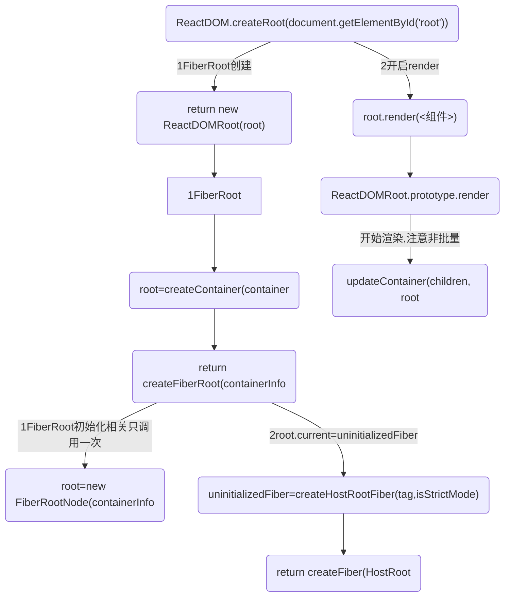
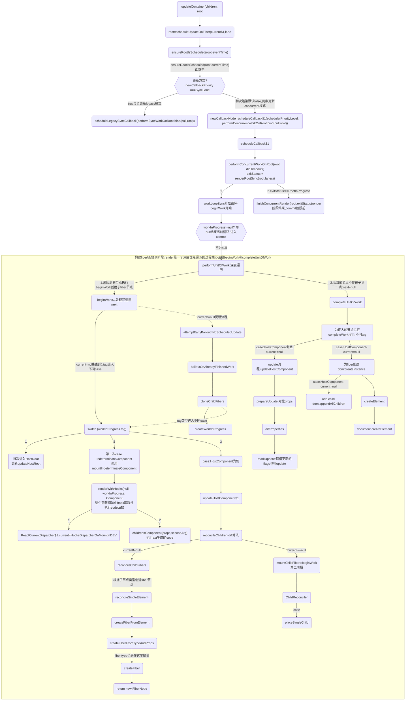
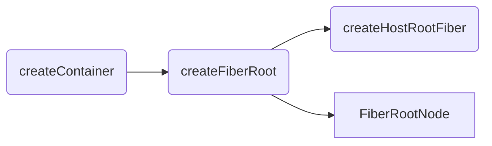

## 流程图-应用入口
基于18


### workInProgress构建步骤1
* beginWork第一次会调用updateHostRoot进行初始化:updateHostRoot
* 第二次才走 mountIndeterminateComponent 执行code()函数,此时的workInProgress.type 才有值;
```js
  function beginWork(current, workInProgress, renderLanes) {
    console.log('workInProgress', workInProgress, root)
    debugger
    workInProgress.lanes = NoLanes;
    console.log('%c=beginWork()===start1-初始化', 'color:magenta', { getFiberName: getFiberName(workInProgress), current, renderLanes, workInProgress })
    switch (workInProgress.tag) {
      case IndeterminateComponent:
        {
          console.log('%c=beginWork()==end 2 mountIndeterminateComponent', 'color:magenta', workInProgress)
          console.log(`%c=探究初始和hook=调用mountIndeterminateComponent`, 'color:blueviolet', workInProgress.type)
          return mountIndeterminateComponent(current, workInProgress, workInProgress.type, renderLanes);
      }
      case HostRoot:
        console.log('%c=beginWork()=end 6第一次会走这里初始化workInProgress', 'color:magenta')
        console.log('%c=beginWork()=end 6 updateHostRoot', 'color:magenta')
        return updateHostRoot(current, workInProgress, renderLanes);
    }
  }
```

## 流程图-接上面updateContainer
fiber 协调过程,构建fiber树的阶段可中断


### beginWork前置工作和beginWork进行中
* performConcurrentWorkOnRoot(root, didTimeout)-->renderRootSync<br/>
beginWork前置工作
```js
function renderRootSync(root, lanes) {
  // 省略
    do {
    try {
      console.log('%c=render阶段准备:', 'color:red', 'renderRootSync()调用workLoopSync()-root:', { root });
      workLoopSync();
      break;
    } catch (thrownValue) {
      handleError(root, thrownValue);
    }
  } while (true);
  // 省略
}

function workLoopSync() {
  // Already timed out, so perform work without checking if we need to yield.
  while (workInProgress !== null) {
    performUnitOfWork(workInProgress);
  }
}
```

* performUnitOfWork-->`beginWork$1`开启beginWork
* `mountChildFibers`与`reconcileChildFibers`这两个方法的逻辑基本一致。唯一的区别是：reconcileChildFibers 会为生成的 Fiber 节点带上effectTag属性，而 mountChildFibers 不会。
```js
function reconcileChildren(current, workInProgress, nextChildren, renderLanes) {
  if (current === null) {
    // If this is a fresh new component that hasn't been rendered yet, we
    // won't update its child set by applying minimal side-effects. Instead,
    // we will add them all to the child before it gets rendered. That means
    // we can optimize this reconciliation pass by not tracking side-effects.
    // 对于 mount 的组件
    workInProgress.child = mountChildFibers(workInProgress, null, nextChildren, renderLanes);
  } else {
    // If the current child is the same as the work in progress, it means that
    // we haven't yet started any work on these children. Therefore, we use
    // the clone algorithm to create a copy of all the current children.
    // If we had any progressed work already, that is invalid at this point so
    // let's throw it out.
    // 对于 update 的组件
    workInProgress.child = reconcileChildFibers(workInProgress, current.child, nextChildren, renderLanes);
  }
}
```

### render阶段completeUnitOfWork

### render阶段结束,commit阶段前:此时fiber树生成
```js
function performConcurrentWorkOnRoot(root, didTimeout) {
  // 上面的render阶段流程
  var exitStatus = shouldTimeSlice ? renderRootConcurrent(root, lanes) : renderRootSync(root, lanes);

  // 省略
  // 这里将会开启commit阶段的前置工作
  finishConcurrentRender(root, exitStatus, lanes)
  // 省略
}
```

## 流程2：入口-此时还不是fiber树,没有开启render阶段
```js
<script type="text/babel">
  const root = ReactDOM.createRoot(document.getElementById('root'))
  root.render(<Test />);
</script>
```

createRoot-->ReactDOMRoot
```js
function createRoot(container, options) {
  return new ReactDOMRoot(root);
}

ReactDOMHydrationRoot.prototype.render = ReactDOMRoot.prototype.render = function (children) {
    console.log('%c ==一切开始3:', 'color:red', 'ReactDOMRoot.prototype.render调用updateContainer()开启render阶段==', children);
    var root = this._internalRoot;
}
```

## 17版本入口函数和18不一样
在18中直接调用以下函数，是不用走下面的流程的,18直接流程图的流程构建fiber和更新
```js
ReactDOM.createRoot(domRoot).render(Ast)
```

以下是17或则在18中调用ReactDOM.render(ast,domRoot)的流程

### 17版本legacyRenderSubtreeIntoContainer()
根据 container 是否存在 root 区分初始化/更新，创建或获取 fiberRoot;

Babel 会把 JSX 转译成一个名为 React.createElement() 函数调用,
因此legacyRenderSubtreeIntoContainer 中打印的children实际上是通过React.createElement()处理过的

17中的React.createElement做的事情就是生成react的ast树
将参数读取转换为ast树的一些所需参数字段,最终返回ast树的结构
```js
function createElement(type, config, children) {
    //根据上面的示例代码，type=div,config= {className:'red'},children='Click Me'
  var propName; // Reserved names are extracted
  var props = {};// 我们常用的props 目前组件
  var key = null;//该组件的唯一key
  var ref = null;// 我们的ref
  var self = null;
  var source = null;

  // ...
  ...
  // ...

	// 当发现arguments的参数大于1的时候。说明是有多个兄弟子元素的，如果等于1的话说明只有一个元素
  var childrenLength = arguments.length - 2;

  if (childrenLength === 1) {
      // 直接将props的children设为当前children
    props.children = children;
  } else if (childrenLength > 1) {
    var childArray = Array(childrenLength);

    for (var i = 0; i < childrenLength; i++) {
      childArray[i] = arguments[i + 2];
    }

    {
      if (Object.freeze) {
        Object.freeze(childArray);
      }
    }
	// 有多个兄弟元素的话，将兄弟节点放置在一个数组里面，赋值给props的children
    props.children = childArray;
  } // Resolve default props

  // ...
  ...
  // ...

	// ReactElement 返回回来的是我们最终的ast树的结构
  return ReactElement(type, key, ref, self, source, ReactCurrentOwner.current, props);
}
```


```js
// 从 container 取出 _reactRootContainer 作为 react 的一个根:
var maybeRoot = container._reactRootContainer;
```

检查 root 是否存在，如果存在就是 Update，如果不存在就是初始化。
* 1.若root不存在：<br/>调用 legacyCreateRootFromDOMContainer初始化 root。
将 root 赋值给 container._reactRootContainer,取出 root 中的_internalRoot 作为 fiberRoot。

* 2.若 root 存在, 从 root 中取出 fiberRoot:
```js
root = maybeRoot;
```
调用 updateContainer(children,fiberRoot,parentComponent,callBack)

注意：这里 callBack 会通过 getPublicRootInstance() 递归找到 fiberRoot 上第一个非 HTMlElement 结点,并将 callback 绑定在它上边。

```js
function render(element, container, callback) {
    return legacyRenderSubtreeIntoContainer(null, element, container, false, callback); 
}

/*
可以见到初始化阶段:legacyCreateRootFromDOMContainer 不批量调用 updateContainer

update阶段：直接调用 updateContainer
*/
function legacyRenderSubtreeIntoContainer(parentComponent, children, container, forceHydrate, callback) {
  if (!maybeRoot) {
    console.log('开始调用-->0-a0:初始化渲染')
    // Initial mount
    root = legacyCreateRootFromDOMContainer(container, children, parentComponent, callback, forceHydrate);
  } else {
    root = maybeRoot;

    if (typeof callback === 'function') {
      var originalCallback = callback;

      callback = function () {
        var instance = getPublicRootInstance(root);
        originalCallback.call(instance);
      };
    } // Update

    console.log('更新流程-->1-a1:即更新')
    updateContainer(children, root, parentComponent, callback);
  }

  return getPublicRootInstance(root);
}

// 第一次渲染
legacyCreateRootFromDOMContainer(){
      
  console.log('-->0-a,初始化渲染不执行批量更新,而是执行flushSync',)
  flushSync(function () {
    updateContainer(initialChildren, _root, parentComponent, callback);
  });
}
```

### React.createElement 旧api
https://cloud.tencent.com/developer/article/2135083

react17 之后我们可以不再依赖 React.createElement 这个 api 了，但是实际场景中以及很多开源包中可能会有很多通过 React.createElement 手动创建元素的场景:

React.createElement 其接收三个或以上参数：

* type：要创建的 React 元素类型，可以是标签名称字符串，如 'div' 或者 'span' 等；也可以是 React组件 类型(class组件或者函数组件)；或者是 React fragment 类型。
* config：写在标签上的属性的集合，js 对象格式，若标签上未添加任何属性则为 null。
* children：从第三个参数开始后的参数为当前创建的React元素的子节点，每个参数的类型，若是当前元素节点的 textContent 则为字符串类型；否则为新的 React.createElement 创建的元素。


### 17版本-createFiberRoot 创建fiberRoot对象
最终创建了 fiberRoot 和 rootFiber：
