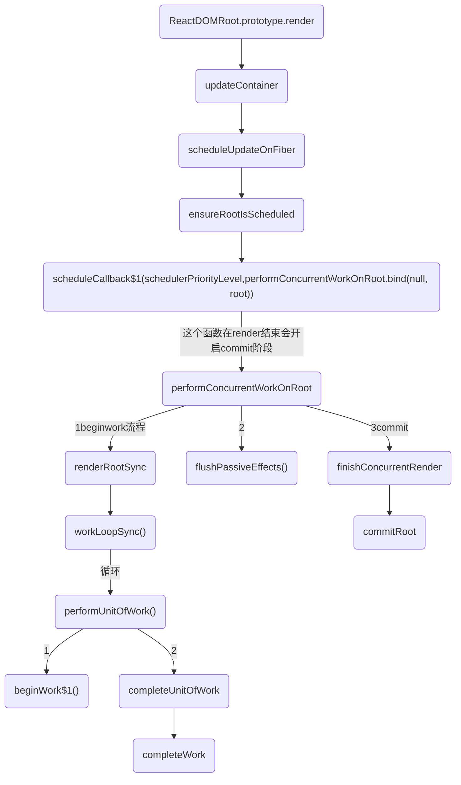
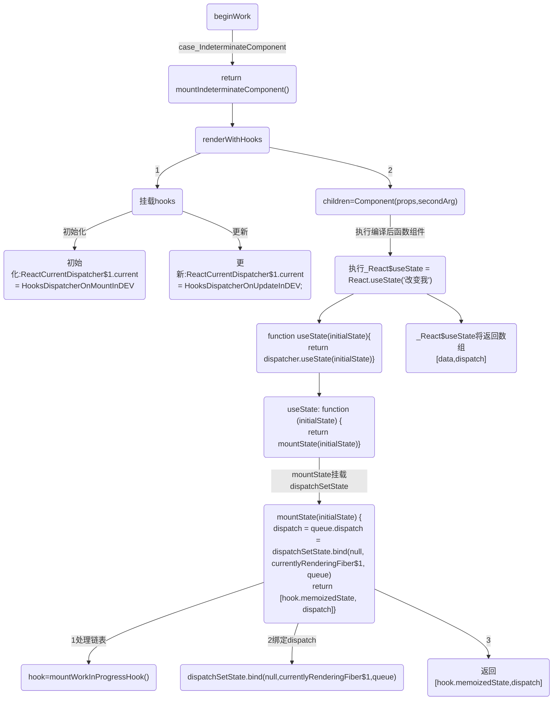
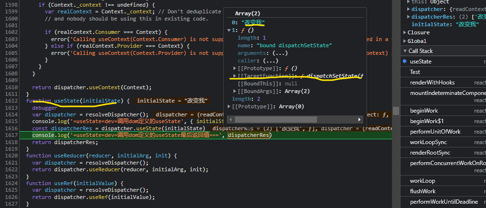
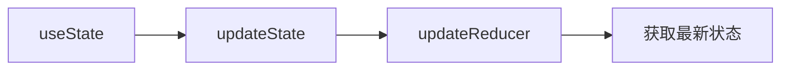
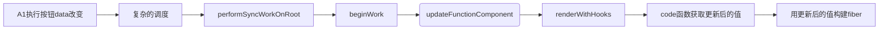
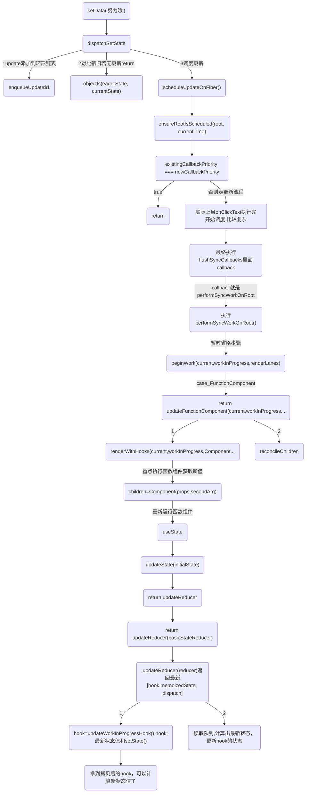
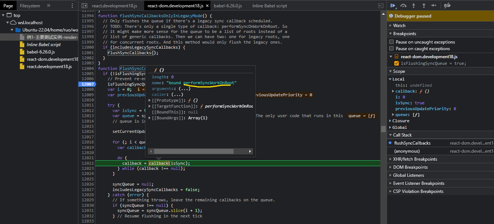

## 前言

### 如果state和从父组件传过来的props都没变化，那他就一定不会发生重渲染吗？

例9-测试父子组件.html

子组件更新的条件是其 props 或 state 发生变化。如果父组件重新渲染时，传递给子组件的 props 没有发生变化，那么子组件不会更新。

1. 当父组件更新，props没改变，sub组件不会更新
2. 当父组件更新，props 对象里面的值改变，sub组件会更新


React采用了基于值比较的浅比较（shallow comparison）策略，只有当props和state的引用发生变化时，React才会重新渲染组件。但如果props和state是复杂对象（如数组和对象），浅比较将只比较它们的引用，而不是它们的内容。如果父组件每次重新渲染时都会创建新的props对象，子组件也会被重新渲染，即使props的值没有改变。

通过 Object.is() 进行比较，这是一种严格相等比较，比浅比较更加严格。具体来说，Object.is() 会比较两个值的类型和值，而浅比较只会比较引用是否相同。

需要注意的是，如果 props 中包含对象或数组等引用类型的值，即使它们的内容没有发生变化，只要引用发生了变化，React 仍然会认为 props 发生了变化，因此会重新渲染组件。这是因为在 JavaScript 中，对象和数组是引用类型，其值在比较时是按照引用地址进行比较的。

会渲染的场景：
1. 比如传递方法`<Sub obj={obj} changeSubData={changeSubData} />`,方法每次都会生成新的，尽管props没变，但是方法每次都是新的会触发渲染
2. 每次都生成新的props,尽管值没改变，但是子组件依然会重新渲染
3. 子组件的渲染函数不是一个纯函数。如果子组件的渲染函数中包含了对于外部变量的依赖，那么当外部变量改变时，子组件也会随之发生变化，即使prop没有改变。
4. 子组件使用了非受控组件或是使用了ref。非受控组件和ref的变化不会被React所感知，这会导致子组件的重新渲染，即使prop的值没有改变。

当React重新渲染时ParentComponent，它将自动重新渲染ChildComponent。要解决的唯一途径是实现shouldComponentUpdate
```js
shouldComponentUpdate(nextProps,nextState){
    if(nextState.Number == this.state.Number){
      return false
    }
}
```

### 对象和数组注意点
1. 数组是引用，更新了数组，但是数组的引用地址没有变化，react就不会认为它有变化
3. 对象是引用，没有被重新赋值(地址没有改变)，不更新视图。

### 重要的全局变量
* currentlyRenderingFiber：正在处理的函数组件对应 fiber。在执行 useState 等 hook 时，需要通过它知道当前 hook 对应哪个 fiber。

* workInProgressHook：挂载时正在处理的 hook 对象。我们会沿着 workInProcess.memoizedState 链表一个个往下走，这个 workInProgressHook 就是该链表的指针。

* currentHook：旧的 fiber 的 hooks 链表（current.memorizedState）指针。

* ReactCurrentDispatcher：全局对象，是一个 hook 调度器对象，其下有 useState、useEffect 等方法，是我们业务代码中 hook 底层调用的方法。ReactCurrentDispatcher 有三种：
```
ContextOnlyDispatcher：所有方法都会抛出错误，用于防止开发者在调用函数组件的其他时机调用 React Hook；

HooksDispatcherOnMount：挂载阶段用。比如它的 useState 要将初始值保存起来；

HooksDispatcherOnUpdate：更新阶段用。比如它的 useState 会无视传入的初始值，而是从链表中取出值。
```

## 例子
### 编译前
```js
  console.log('=Babel:', Babel)
  function Test() {
    console.log('test-render')
    const [data, setData] = React.useState('改变我')
    const [showDiv, setShowDiv] = React.useState(false)

    const onClickText = () => {
      console.log('=useState=onClick');
      setData('努力哦')
      setShowDiv(!showDiv)
    }

    const onClickText2 = () => {
      console.log('=useState=onClick:', data);
    }

    React.useEffect(() => {
      console.log('=副作用-useEffect-->运行');
    }, [])

    React.useLayoutEffect(() => {
      console.log('=副作用-useLayoutEffect-->运行');
    }, [])

    return (
      <div id='div1' className='c1'>
        <button onClick={onClickText} className="btn">Hello world,Click me</button>
        <span>{data}</span>
        {showDiv && <div>被你发现了</div>}
        <div id='div2' className='c2'>
          <p>测试子节点</p>
        </div>
      </div>
    )
  }

  const root = ReactDOM.createRoot(document.getElementById('root'))
  console.log("=app=root:", root)
  root.render(<Test />);
  // 17 写法
  // ReactDOM.render(<Test />, document.getElementById('root'))
```

### 编译后的code
```js
function Test() {
  console.log('test-render');

  var _React$useState = React.useState('改变我'),
      _React$useState2 = _slicedToArray(_React$useState, 2),
      data = _React$useState2[0],
      setData = _React$useState2[1];

  var _React$useState3 = React.useState(false),
      _React$useState4 = _slicedToArray(_React$useState3, 2),
      showDiv = _React$useState4[0],
      setShowDiv = _React$useState4[1];

  var onClickText = function onClickText() {
    console.log('=useState=onClick');
    setData('努力哦');
    setShowDiv(!showDiv);
  };

  var onClickText2 = function onClickText2() {
    console.log('=useState=onClick:', data);
  };

  React.useEffect(function () {
    console.log('=副作用-useEffect-->运行');
  }, []);

  React.useLayoutEffect(function () {
    console.log('=副作用-useLayoutEffect-->运行');
  }, []);

  return React.createElement(
    'div',
    { id: 'div1', className: 'c1' },
    React.createElement(
      'button',
      { onClick: onClickText, className: 'btn' },
      'Hello world,Click me'
    ),
    React.createElement(
      'span',
      null,
      data
    ),
    showDiv && React.createElement(
      'div',
      null,
      '\u88AB\u4F60\u53D1\u73B0\u4E86'
    ),
    React.createElement(
      'div',
      { id: 'div2', className: 'c2' },
      React.createElement(
        'p',
        null,
        '\u6D4B\u8BD5\u5B50\u8282\u70B9'
      )
    )
  );
}
```


## 复习渲染流程


## 流程图-初始化hook-state-接上面beginWork
useState挂载hooks函数;生成dispatch


## 初始化/更新阶段挂载的hooks
1. workInProgress 赋值给全局变量 currentlyRenderingFiber，之后执行 hook 就能知道是给哪个组件更新状态了
2. 选择 hook 调度器：根据是挂载还是更新阶段，ReactCurrentDispatcher 设置为对应 hook 调度器
3. 调用函数组件，进行 render。函数组件内部会调用 Hook
4. 重置全局变量，比如 currentlyRenderingFiber 设置回 null；ReactCurrentDispatcher 还原为 ContextOnlyDispatcher，防止在错误时机使用 Hook。

renderWithHooks 中，我们会根据组件处于不同的状态，给 ReactCurrentDispatcher.current 挂载不同的 dispatcher 。而在first paint 时，挂载的是ContextOnlyDispatcher
或则 HooksDispatcherOnMountInDEV
```js
function renderWithHooks(current, workInProgress, Component, props, secondArg, nextRenderLanes) {
  renderLanes = nextRenderLanes;
  currentlyRenderingFiber$1 = workInProgress;
  // 省略
  debugger
  // 2. 根据是挂载还是更新阶段，选择对应 hook 调度器
  {
    if (current !== null && current.memoizedState !== null) {
      // 更新阶段
      ReactCurrentDispatcher$1.current = HooksDispatcherOnUpdateInDEV;
    } else if (hookTypesDev !== null) {
      ReactCurrentDispatcher$1.current = HooksDispatcherOnMountWithHookTypesInDEV;
    } else {
      // 初始化
      ReactCurrentDispatcher$1.current = HooksDispatcherOnMountInDEV;
    }
  }

  // 3. 调用函数组件，里面执行各种 React Hook，并返回 ReactElement
  var children = Component(props, secondArg); // Check if there was a render phase update

  // 省略

  // 4. hook 调度器还原为 ContextOnlyDispatcher
  console.log(`%c=探究初始和hook=renderWithHooks挂载,调度器还原为 ContextOnlyDispatcher`, 'color:blueviolet', { current: ContextOnlyDispatcher })
  ReactCurrentDispatcher$1.current = ContextOnlyDispatcher;

  // 省略

  // Hook 数量比上次少，对不上，报错
  if (didRenderTooFewHooks) {
    throw new Error('Rendered fewer hooks than expected. This may be caused by an accidental ' + 'early return statement.');
  }

  // debugger
  return children;
}
```

页面上初始化和更新阶段调用的都是`function useState(initialState)`;但是`resolveDispatcher()`的返回是不一样的，也就是初始化和更新最终调用还是不一样的：
* 初始化最终调用mountState
* 更新最终调用mountState
```js
// react.development18.js
function useState(initialState) {
  debugger
  var dispatcher = resolveDispatcher();
  console.log('=调用dom定义的useState', { initialState, dispatcher })
  return dispatcher.useState(initialState);
}
```

## 初始化阶段挂载的hooks
从renderWithHooks debugger 可以看到useState二者不同:
```js
useState: function (initialState) {
  currentHookNameInDev = 'useState';
  mountHookTypesDev();
  console.log('=useState=dom=挂载的函数1:', ReactCurrentDispatcher$1.current)
  var prevDispatcher = ReactCurrentDispatcher$1.current;
  ReactCurrentDispatcher$1.current = InvalidNestedHooksDispatcherOnMountInDEV;
  console.log('=useState=dom=挂载的函数2:', InvalidNestedHooksDispatcherOnMountInDEV)

  try {
    console.log('=useState=dom=调用mountState', { initialState })
    return mountState(initialState);
  } finally {
    ReactCurrentDispatcher$1.current = prevDispatcher;
  }
}
```

### 初始化阶段挂载hooks流程
创建闭包的方式在一个函数内创建函数，通过闭包函数访问这个函数的局部变量, 利用闭包可以突破作用链域的特性，将函数内部的变量和方法传递到外部。

产生的闭包就是dispatch函数,也就是setXX("xx")，被闭包引用的变量就是currentlyRenderingFiber 与 queue
```
currentlyRenderingFiber: 其实就是workInProgressTree, 即更新时链表当前正在遍历的fiber节点

queue: 指向hook.queue，保存当前hook操作相关的reducer 和 状态的对象，其来源于mountWorkInProgressHook这个函数
```

### 初始化返回的setState是一个数组
code函数setState是这样的：
```js
var _React$useState = React.useState('改变我'),
```

React.useState-->resolveDispatcher()返回初始化挂载的hooks
```js
// react.development18.js
function useState(initialState) {
  debugger
  var dispatcher = resolveDispatcher();
  console.log('=调用dom定义的useState', { initialState, dispatcher })
  return dispatcher.useState(initialState);
}
```

resolveDispatcher 的ReactCurrentDispatcher.current就是流程图中的初始化挂载的全部hooks;
```js
function resolveDispatcher() {
  var dispatcher = ReactCurrentDispatcher.current;

  {
    if (dispatcher === null) {
      error('Invalid hook call. Hooks can only be called inside of the body of a function component. This could happen for' + ' one of the following reasons:\n' + '1. You might have mismatching versions of React and the renderer (such as React DOM)\n' + '2. You might be breaking the Rules of Hooks\n' + '3. You might have more than one copy of React in the same app\n' + 'See https://reactjs.org/link/invalid-hook-call for tips about how to debug and fix this problem.');
    }
  } // Will result in a null access error if accessed outside render phase. We
  // intentionally don't throw our own error because this is in a hot path.
  // Also helps ensure this is inlined.

  return dispatcher;
}
```

所以上面初始化中调用的useState`return dispatcher.useState(initialState)`就是`useState: function (initialState) {}`

`useState: function (initialState) {}`在渲染前挂载的函数
```js
// react-dom.development18.js
useState: function (initialState) {
  currentHookNameInDev = 'useState';
  mountHookTypesDev();
  console.log('=useState=dom=挂载的函数1:', ReactCurrentDispatcher$1.current)
  var prevDispatcher = ReactCurrentDispatcher$1.current;
  ReactCurrentDispatcher$1.current = InvalidNestedHooksDispatcherOnMountInDEV;
  console.log('=useState=dom=挂载的函数2:', InvalidNestedHooksDispatcherOnMountInDEV)

  try {
    console.log('=useState=dom=调用mountState', { initialState })
    return mountState(initialState);
  } finally {
    ReactCurrentDispatcher$1.current = prevDispatcher;
  }
}
```

mountState绑定的dispatchSetState是重点函数
* mountState 函数对 var hook = mountWorkInProgressHook()进行赋值
```
创建新的 hook 空对象，挂到 workInProcess.memorizedState 队列上（mountWorkInProgressHook 方法）。
```
* dispatchSetState 绑定对应 fiber 和 queue，方便以后 setState 快速找到相关对象，最后返回状态值和更新状态方法。
```
利用bind返回dispatch函数

dispatchSetState.bind(null, currentlyRenderingFiber$1, queue)
这也是为什么虽然 dispatchSetState 本身需要三个参数，但我们使用的时候都是 setState(params)，只用传一个参数的原因。
```

```js
function mountState(initialState) {
  var hook = mountWorkInProgressHook();

  if (typeof initialState === 'function') {
    // $FlowFixMe: Flow doesn't like mixed types
    initialState = initialState();
  }

  hook.memoizedState = hook.baseState = initialState;
  var queue = {
    pending: null,
    interleaved: null,
    lanes: NoLanes,
    dispatch: null,
    lastRenderedReducer: basicStateReducer,
    lastRenderedState: initialState
  };
  hook.queue = queue;

  // 重点
  var dispatch = queue.dispatch = dispatchSetState.bind(null, currentlyRenderingFiber$1, queue)
  console.log('=useState=dom=利用bind返回dispatch:', { dispatch })
  return [hook.memoizedState, dispatch];
}
```

截图说明了页面中调用的useState是返回是一个数组：第一个是初始值，第二个是dispatchSetState函数


### 最后看编译后源码
setData就是dispatchSetState()函数
```js
_React$useState2 = _slicedToArray(_React$useState, 2),
data = _React$useState2[0],
setData = _React$useState2[1];
```


## 更新阶段挂载的hooks


```js
useState: function (initialState) {
  currentHookNameInDev = 'useState';
  updateHookTypesDev();
  var prevDispatcher = ReactCurrentDispatcher$1.current;
  ReactCurrentDispatcher$1.current = InvalidNestedHooksDispatcherOnUpdateInDEV;

  try {
    console.log('=updateState=4', { initialState })
    return updateState(initialState);
  } finally {
    ReactCurrentDispatcher$1.current = prevDispatcher;
  }
}

// reducer 函数
function basicStateReducer(state, action) {
  // $FlowFixMe: Flow doesn't like mixed types
  return typeof action === 'function' ? action(state) : action;
}

function updateState(initialState) {
  console.log('=updateState调用updateReducer')
  return updateReducer(basicStateReducer);
}
```

### 更新阶段-updateReducer
updateReducer作用:更新 hook 上的参数，返回 state 和 dispatchSetState
* 从 current.memorizedState 拷贝 hook 到 workInProcess 下（updateWorkInProgressHook 方法）

* 将 hook.queue.pending 队列合并到 currentHook.baseQueue 下，然后遍历队列中的 update 对象，使用 action 和 reducer 计算出最新的状态，更新到 hook 上，最后返回新状态和新 setState。

```js
// 返回的数组第一个就算是更新后的值，第二个是setXX函数
function updateReducer(reducer, initialArg, init) {
  // 1.拷贝 hook（current -> workInProcess），并返回这个 hook
  const hook = updateWorkInProgressHook();

  // 2.读取队列，计算出最新状态，更新 hook 的状态

  // 最后返回
  return [hook.memoizedState, dispatch];
}
```
```js
function updateReducer(reducer, initialArg, init) {
  var hook = updateWorkInProgressHook();
  console.log('%c=updateState=updateReducer调用updateWorkInProgressHook,拷贝hook(current->workInProcess),并返回这个hook', 'color:cyan', { hook })
  var queue = hook.queue;

  console.log('%c=updateState=updateReducer读取队列,计算出最新状态，更新hook的状态', 'color:cyan')
  if (queue === null) {
    throw new Error('Should have a queue. This is likely a bug in React. Please file an issue.');
  }

  queue.lastRenderedReducer = reducer;
  var current = currentHook; // The last rebase update that is NOT part of the base state.

  var baseQueue = current.baseQueue; // The last pending update that hasn't been processed yet.

  var pendingQueue = queue.pending;

  if (pendingQueue !== null) {
    // We have new updates that haven't been processed yet.
    // We'll add them to the base queue.
    if (baseQueue !== null) {
      // Merge the pending queue and the base queue.
      var baseFirst = baseQueue.next;
      var pendingFirst = pendingQueue.next;
      baseQueue.next = pendingFirst;
      pendingQueue.next = baseFirst;
    }

    {
      if (current.baseQueue !== baseQueue) {
        // Internal invariant that should never happen, but feasibly could in
        // the future if we implement resuming, or some form of that.
        error('Internal error: Expected work-in-progress queue to be a clone. ' + 'This is a bug in React.');
      }
    }

    current.baseQueue = baseQueue = pendingQueue;
    queue.pending = null;
  }

  if (baseQueue !== null) {
    // We have a queue to process.
    var first = baseQueue.next;
    var newState = current.baseState;
    var newBaseState = null;
    var newBaseQueueFirst = null;
    var newBaseQueueLast = null;
    var update = first;

    do {
      var updateLane = update.lane;

      if (!isSubsetOfLanes(renderLanes, updateLane)) {
        // Priority is insufficient. Skip this update. If this is the first
        // skipped update, the previous update/state is the new base
        // update/state.
        var clone = {
          lane: updateLane,
          action: update.action,
          hasEagerState: update.hasEagerState,
          eagerState: update.eagerState,
          next: null
        };

        if (newBaseQueueLast === null) {
          newBaseQueueFirst = newBaseQueueLast = clone;
          newBaseState = newState;
        } else {
          newBaseQueueLast = newBaseQueueLast.next = clone;
        } // Update the remaining priority in the queue.
        // TODO: Don't need to accumulate this. Instead, we can remove
        // renderLanes from the original lanes.


        currentlyRenderingFiber$1.lanes = mergeLanes(currentlyRenderingFiber$1.lanes, updateLane);
        markSkippedUpdateLanes(updateLane);
      } else {
        // This update does have sufficient priority.
        if (newBaseQueueLast !== null) {
          var _clone = {
            // This update is going to be committed so we never want uncommit
            // it. Using NoLane works because 0 is a subset of all bitmasks, so
            // this will never be skipped by the check above.
            lane: NoLane,
            action: update.action,
            hasEagerState: update.hasEagerState,
            eagerState: update.eagerState,
            next: null
          };
          newBaseQueueLast = newBaseQueueLast.next = _clone;
        } // Process this update.


        if (update.hasEagerState) {
          // If this update is a state update (not a reducer) and was processed eagerly,
          // we can use the eagerly computed state
          // 状态已经计算过，那就直接用
          newState = update.eagerState;
        } else {
          var action = update.action;
          newState = reducer(newState, action);
        }
      }

      update = update.next;
      // 终止条件是指针为空 或 环已遍历完
    } while (update !== null && update !== first);

    if (newBaseQueueLast === null) {
      newBaseState = newState;
    } else {
      newBaseQueueLast.next = newBaseQueueFirst;
    } // Mark that the fiber performed work, but only if the new state is
    // different from the current state.


    if (!objectIs(newState, hook.memoizedState)) {
      markWorkInProgressReceivedUpdate();
    }

    hook.memoizedState = newState;
    hook.baseState = newBaseState;
    hook.baseQueue = newBaseQueueLast;
    queue.lastRenderedState = newState;
  } // Interleaved updates are stored on a separate queue. We aren't going to
  // process them during this render, but we do need to track which lanes
  // are remaining.


  var lastInterleaved = queue.interleaved;

  if (lastInterleaved !== null) {
    var interleaved = lastInterleaved;

    do {
      var interleavedLane = interleaved.lane;
      currentlyRenderingFiber$1.lanes = mergeLanes(currentlyRenderingFiber$1.lanes, interleavedLane);
      markSkippedUpdateLanes(interleavedLane);
      interleaved = interleaved.next;
    } while (interleaved !== lastInterleaved);
  } else if (baseQueue === null) {
    // `queue.lanes` is used for entangling transitions. We can set it back to
    // zero once the queue is empty.
    queue.lanes = NoLanes;
  }

  var dispatch = queue.dispatch;
  console.log('%c=updateState=updateReducer最终返回值', 'color:cyan', [hook.memoizedState, dispatch])
  return [hook.memoizedState, dispatch];
}
```

## 流程图-data更新之后-获取state-调度更新
总结：


详细：


Effect同理:updateEffect->updateEffectImpl

无论useState, useEffect, 内部调用updateWorkInProgressHook获取一个 hook.

```js
function updateReducer(reducer, initialArg, init) {
  var hook = updateWorkInProgressHook();
  console.log('%c=updateState=updateReducer调用updateWorkInProgressHook,拷贝hook(current->workInProcess),并返回这个hook', 'color:cyan', { hook })
  var queue = hook.queue;

  console.log('%c=updateState=updateReducer读取队列,计算出最新状态，更新hook的状态', 'color:cyan')
  if (queue === null) {
    throw new Error('Should have a queue. This is likely a bug in React. Please file an issue.');
  }

  queue.lastRenderedReducer = reducer;
  var current = currentHook; // The last rebase update that is NOT part of the base state.

  var baseQueue = current.baseQueue; // The last pending update that hasn't been processed yet.

  var pendingQueue = queue.pending;

  if (pendingQueue !== null) {
    // We have new updates that haven't been processed yet.
    // We'll add them to the base queue.
    if (baseQueue !== null) {
      // Merge the pending queue and the base queue.
      var baseFirst = baseQueue.next;
      var pendingFirst = pendingQueue.next;
      baseQueue.next = pendingFirst;
      pendingQueue.next = baseFirst;
    }

    {
      if (current.baseQueue !== baseQueue) {
        // Internal invariant that should never happen, but feasibly could in
        // the future if we implement resuming, or some form of that.
        error('Internal error: Expected work-in-progress queue to be a clone. ' + 'This is a bug in React.');
      }
    }

    current.baseQueue = baseQueue = pendingQueue;
    queue.pending = null;
  }

  if (baseQueue !== null) {
    // We have a queue to process.
    var first = baseQueue.next;
    var newState = current.baseState;
    var newBaseState = null;
    var newBaseQueueFirst = null;
    var newBaseQueueLast = null;
    var update = first;

    do {
      var updateLane = update.lane;

      if (!isSubsetOfLanes(renderLanes, updateLane)) {
        // Priority is insufficient. Skip this update. If this is the first
        // skipped update, the previous update/state is the new base
        // update/state.
        var clone = {
          lane: updateLane,
          action: update.action,
          hasEagerState: update.hasEagerState,
          eagerState: update.eagerState,
          next: null
        };

        if (newBaseQueueLast === null) {
          newBaseQueueFirst = newBaseQueueLast = clone;
          newBaseState = newState;
        } else {
          newBaseQueueLast = newBaseQueueLast.next = clone;
        } // Update the remaining priority in the queue.
        // TODO: Don't need to accumulate this. Instead, we can remove
        // renderLanes from the original lanes.


        currentlyRenderingFiber$1.lanes = mergeLanes(currentlyRenderingFiber$1.lanes, updateLane);
        markSkippedUpdateLanes(updateLane);
      } else {
        // This update does have sufficient priority.
        if (newBaseQueueLast !== null) {
          var _clone = {
            // This update is going to be committed so we never want uncommit
            // it. Using NoLane works because 0 is a subset of all bitmasks, so
            // this will never be skipped by the check above.
            lane: NoLane,
            action: update.action,
            hasEagerState: update.hasEagerState,
            eagerState: update.eagerState,
            next: null
          };
          newBaseQueueLast = newBaseQueueLast.next = _clone;
        } // Process this update.


        if (update.hasEagerState) {
          // If this update is a state update (not a reducer) and was processed eagerly,
          // we can use the eagerly computed state
          // 状态已经计算过，那就直接用
          newState = update.eagerState;
        } else {
          var action = update.action;
          newState = reducer(newState, action);
        }
      }

      update = update.next;
      // 终止条件是指针为空 或 环已遍历完
    } while (update !== null && update !== first);

    if (newBaseQueueLast === null) {
      newBaseState = newState;
    } else {
      newBaseQueueLast.next = newBaseQueueFirst;
    } // Mark that the fiber performed work, but only if the new state is
    // different from the current state.


    if (!objectIs(newState, hook.memoizedState)) {
      markWorkInProgressReceivedUpdate();
    }

    hook.memoizedState = newState;
    hook.baseState = newBaseState;
    hook.baseQueue = newBaseQueueLast;
    queue.lastRenderedState = newState;
  } // Interleaved updates are stored on a separate queue. We aren't going to
  // process them during this render, but we do need to track which lanes
  // are remaining.


  var lastInterleaved = queue.interleaved;

  if (lastInterleaved !== null) {
    var interleaved = lastInterleaved;

    do {
      var interleavedLane = interleaved.lane;
      currentlyRenderingFiber$1.lanes = mergeLanes(currentlyRenderingFiber$1.lanes, interleavedLane);
      markSkippedUpdateLanes(interleavedLane);
      interleaved = interleaved.next;
    } while (interleaved !== lastInterleaved);
  } else if (baseQueue === null) {
    // `queue.lanes` is used for entangling transitions. We can set it back to
    // zero once the queue is empty.
    queue.lanes = NoLanes;
  }

  var dispatch = queue.dispatch;
  console.log('%c=updateState=updateReducer最终返回值', 'color:cyan', [hook.memoizedState, dispatch])
  return [hook.memoizedState, dispatch];
}
```


## 更新阶段1
memoizedState保存state的值

* mount 时：把传进来的 value 包装成一个含有 current 属性的对象，然后放在 memorizedState 属性上。
```
将初始值存放在memoizedState 中，queue.pending用来存调用 setValue（即 dispatch）时创建的最后一个 update;
update是个环状链表，最终返回一个数组，包含初始值和一个由dispatchState创建的函数。
```

* update 时：调用的是 updateReducer,只是 reducer 是固定好的，作用就是用来直接执行 setValue（即 dispatch） 函数传进来的 action，即 useState 其实是对 useReducer 的一个封装，只是 reducer 函数是预置好的。

### 1.点击按钮调用onClickText
终端最先打印`=useState=onClick`:
```js
var onClickText = function onClickText() {
  console.log('=useState=onClick');
  setData('努力哦');
  setShowDiv(!showDiv);
};
```

### 2.执行setData
dispatchSetState 只在更新调用，初始化不会,初始化只会在mountState()挂载dispatchSetState();此时最好在dispatchSetState debugger,否则很难理清流程

setData传参：
```
fiber: FiberNode {tag: 0, key: null, stateNode: null, elementType: ƒ, type: ƒ, …},
queue: {pending: {…}, interleaved: null, lanes: 0, dispatch: ƒ, lastRenderedReducer: ƒ, …}
action: "努力哦",
```
* 1. 可见把要修改的值放到第三个参数action
* 2. 创建一个 update 更新对象,把action赋值
```js
var update = {
  lane: lane,
  action: action,
  hasEagerState: false,
  eagerState: null,
  next: null
};
```
* 3. currentState = queue.lastRenderedState;取旧值
* 4. dispatchSetState对比新旧状态是否不同，相同直接return,比对是依赖项是否一致的时候，用的是Object.is：
```
Object.is() 与 === 不相同。差别是它们对待有符号的零和 NaN 不同，例如，=== 运算符（也包括 == 运算符）将数字 -0 和 +0 视为相等，而将 Number.NaN 与 NaN 视为不相等。
```
* 5. scheduleUpdateOnFiber(fiber, lane, eventTime) 走调度更新流程

[dispatchSetState-hooks源码](./dispatchSetState-hooks源码)
```js
 function dispatchSetState(fiber, queue, action) {
    debugger
 }
```

* 6. 因为是调度更新，此时执行完setData还不会走beginWork,继续执行onClickText函数剩下的代码：
```js
setShowDiv(!showDiv);
```

[dispatchSetState-hooks源码](./dispatchSetState-hooks源码)

### 关键点-调度更新flushSyncCallbacks
onClickText函数执行完毕开启一系列的调度，最终会执行flushSyncCallbacks;

flushSyncCallbacks里面callback就是`performSyncWorkOnRoot`函数：


```js
callback = callback(isSync);
```
```js
function flushSyncCallbacks() {
  if (!isFlushingSyncQueue && syncQueue !== null) {
    // Prevent re-entrance.
    isFlushingSyncQueue = true;
    var i = 0;
    var previousUpdatePriority = getCurrentUpdatePriority();

    try {
      var isSync = true;
      var queue = syncQueue; // TODO: Is this necessary anymore? The only user code that runs in this
      // queue is in the render or commit phases.

      setCurrentUpdatePriority(DiscreteEventPriority);

      for (; i < queue.length; i++) {
        var callback = queue[i];

        do {
          callback = callback(isSync);
        } while (callback !== null);
      }

      syncQueue = null;
      includesLegacySyncCallbacks = false;
    } catch (error) {
      // 省略
  }

  return null;
}

```

batchedUpdates$1 --> flushSyncCallbacksOnlyInLegacyMode--一系列之后最终会调用ensureRootIsScheduled --> flushSyncCallbacks
```js
function batchedUpdates$1(fn, a) {
  var prevExecutionContext = executionContext;
  executionContext |= BatchedContext;

  try {
    return fn(a);
  } finally {
    executionContext = prevExecutionContext; // If there were legacy sync updates, flush them at the end of the outer
    // most batchedUpdates-like method.

    if (executionContext === NoContext && // Treat `act` as if it's inside `batchedUpdates`, even in legacy mode.
      !(ReactCurrentActQueue$1.isBatchingLegacy)) {
      resetRenderTimer();
      // debugger
      flushSyncCallbacksOnlyInLegacyMode();
    }
  }
}

function flushSyncCallbacksOnlyInLegacyMode() {
  // Only flushes the queue if there's a legacy sync callback scheduled.
  // TODO: There's only a single type of callback: performSyncOnWorkOnRoot. So
  // it might make more sense for the queue to be a list of roots instead of a
  // list of generic callbacks. Then we can have two: one for legacy roots, one
  // for concurrent roots. And this method would only flush the legacy ones.
  if (includesLegacySyncCallbacks) {
    flushSyncCallbacks();
  }
}
```

一系列调用之后 ensureRootIsScheduled --> flushSyncCallbacks
```js
function ensureRootIsScheduled(root, currentTime) {
  // 省略
  if (newCallbackPriority === SyncLane) {
    // Special case: Sync React callbacks are scheduled on a special
    // internal queue
    if (root.tag === LegacyRoot) {
      if (ReactCurrentActQueue$1.isBatchingLegacy !== null) {
        ReactCurrentActQueue$1.didScheduleLegacyUpdate = true;
      }

      console.log('%c=render阶段准备:ensureRootIsScheduled调用performSyncWorkOnRoot：异步更新legacy模式1==', 'color:red')
      scheduleLegacySyncCallback(performSyncWorkOnRoot.bind(null, root));
    } else {

      console.log('%c=render阶段准备:ensureRootIsScheduled调用performSyncWorkOnRoot：异步更新legacy模式2==', 'color:red')
      scheduleSyncCallback(performSyncWorkOnRoot.bind(null, root));
    }

    {
      // Flush the queue in a microtask.
      if (ReactCurrentActQueue$1.current !== null) {
        // Inside `act`, use our internal `act` queue so that these get flushed
        // at the end of the current scope even when using the sync version
        // of `act`.
        ReactCurrentActQueue$1.current.push(flushSyncCallbacks);
      } else {
        scheduleMicrotask(function () {
          // In Safari, appending an iframe forces microtasks to run.
          // https://github.com/facebook/react/issues/22459
          // We don't support running callbacks in the middle of render
          // or commit so we need to check against that.
          if (executionContext === NoContext) {
            // It's only safe to do this conditionally because we always
            // check for pending work before we exit the task.
            flushSyncCallbacks();
          }
        });
      }
    }

    newCallbackNode = null;
  }
```

## 更新阶段3-会重新执行renderWithHooks,重新挂载hooks:
```js
if (current !== null && current.memoizedState !== null) {
  ReactCurrentDispatcher$1.current = HooksDispatcherOnUpdateInDEV;
}
```

此时从debugger看到useState:
```js
function (reducer, initialArg, init) {
  currentHookNameInDev = 'useReducer';
  updateHookTypesDev();
  var prevDispatcher = ReactCurrentDispatcher$1.current;
  ReactCurrentDispatcher$1.current = InvalidNestedHooksDispatcherOnUpdateInDEV;

  try {
    return updateReducer(reducer, initialArg, init);
  } finally {
    ReactCurrentDispatcher$1.current = prevDispatcher;
  }
}
```

```js
function useState(initialState) {
  var dispatcher = resolveDispatcher();
  console.log('=useState=dev=调用dom定义的useState', { initialState, dispatcher })
  const dispatcherRes = dispatcher.useState(initialState)
  console.log('=useState=dev=调用dom定义的useState最后返回值===', dispatcherRes)
  return dispatcherRes;
}
```

## mountWorkInProgressHook作用:
给 memoizedState 链表加节点的逻辑,写过单链表的会比较理解，头节点要特殊处理
* 创建一个 hook
* 若无 hook 链，则创建一个 hook 链；若有，则将新建的 hook 加至末尾
* 将新建的这个 hook 挂载到 workInProgressHook 以及当前 fiber node 的 memoizedState 上

返回 workInProgressHook，也就是这个新建的 hook
```js
function mountWorkInProgressHook() {
  var hook = {
    memoizedState: null,
    baseState: null,
    baseQueue: null,
    queue: null,
    next: null
  };

  if (workInProgressHook === null) {
    // This is the first hook in the list
    console.log('=useState=dom=调用workInProgressHook 1:', { hook, workInProgressHook })
    // 链表中首个hook
    currentlyRenderingFiber$1.memoizedState = workInProgressHook = hook;
  } else {
    // Append to the end of the list
    // 将hook添加到链表末尾
    workInProgressHook = workInProgressHook.next = hook;
    console.log('=useState=dom=调用workInProgressHook 2:', { hook, workInProgressHook })
  }

  return workInProgressHook;
}
```

## setState()-->dispatchSetState() 重点函数在这里触发组件更新
注意: 本示例中虽然同时执行了 2 次 dispatch, 会请求 3 次调度, 由于调度中心的节流优化, 最后只会执行一次渲染

之前 mountState 时，我们返回了一个绑定了 fiber、queue 参数的 dispatchSetState

第一个 setState 在被调用时会立即计算新状态，这是为了 做新旧 state 对比，决定是否更新组件。如果对比发现状态没变，继续计算下一个 setState 的新状态，直到找到为止。如果没找到，就不进行更新。

其后的 setState 则不会计算，等到组件重新 render 再计算。

为对比新旧状态计算出来的状态值，会保存到 update.eagerState，并将 update.hasEagerState 设置为 true，之后更新时通过它来直接拿到计算后的最新值。

dispatchSetState 会拿到对应的 fiber、queue（对应 hook 的 queue）、action（新的状态）。

[dispatchSetState-hooks源码](./dispatchSetState-hooks源码)

创建一个 update 空对象；
1. 计算出最新状态，放入到 update.egerState。
2. 对比新旧状态是否相同（使用 Object.is 对比）。相同就不更新了，结束。不相同，进行后续的操作。
3. 将 update 放到 queue.interleaved 或 concurrentQueues 链表上（.new 和 .old 文件的逻辑差得有点多），之后更新阶段会搬到 queue.pending。
4. 将当前 fiber 的 lanes 设置为 SyncLane，这样后面的 setState 就不会立刻计算最新状态了，而是在更新阶段才计算。
5. 接着是调度更新（scheduleUpdateOnFiber），让调度器进行调度，执行更新操作

### enqueueUpdate$1
1. 创建update对象, 其中update.lane代表优先级(可回顾fiber 树构造(基础准备)中的update优先级).

2. 将update对象添加到hook.queue.pending环形链表.
  * 环形链表的特征: 为了方便添加新元素和快速拿到队首元素(都是O(1)), 所以pending指针指向了链表中最后一个元素.
  * 链表的使用方式可以参考React 算法之链表操作
```js
  function enqueueUpdate$1(fiber, queue, update, lane) {
    if (isInterleavedUpdate(fiber)) {
      var interleaved = queue.interleaved;

      if (interleaved === null) {
        // This is the first update. Create a circular list.
        update.next = update; // At the end of the current render, this queue's interleaved updates will
        // be transferred to the pending queue.

        pushInterleavedQueue(queue);
      } else {
        update.next = interleaved.next;
        interleaved.next = update;
      }

      queue.interleaved = update;
    } else {

      console.log('=useState=app=enqueueUpdate$1将update对象添加到hook.queue.pending队列')
      var pending = queue.pending;

      if (pending === null) {
        // This is the first update. Create a circular list.
        console.log('=useState=app=首个update, 创建一个环形链表')
        update.next = update;
      } else {
        update.next = pending.next;
        pending.next = update;
      }

      queue.pending = update;
    }
  }
```

### 继续看updateReducer-->updateWorkInProgressHook
updateWorkInProgressHook函数逻辑简单: 目的是为了让currentHook和workInProgressHook两个指针同时向后移动.
1. 由于renderWithHooks函数设置了workInProgress.memoizedState=null, 所以workInProgressHook初始值必然为null, 只能从currentHook克隆.

2. 而从currentHook克隆而来的newHook.next=null, 进而导致workInProgressHook链表需要完全重建.

可以看到:
1. 以双缓冲技术为基础, 将current.memoizedState按照顺序克隆到了workInProgress.memoizedState中.
2. Hook经过了一次克隆, 内部的属性(hook.memoizedState等)都没有变动, 所以其状态并不会丢失.

总结：
renderWithHooks函数, 把Hook链表挂载到了fiber.memoizedState之上. 利用fiber树内部的双缓冲技术, 实现了Hook从current到workInProgress转移, 进而实现了Hook状态的持久化.

该方法中，currentHook 设置为 current.memoizedState 链表的下一个 hook，拷贝它到 currentlyRenderingFiber.memoizedState 链表上，返回这个 hook。
```js
function updateWorkInProgressHook() {
  // 1. 移动 currentHook 指针
  //（来自 current.memoizedState 链表）
  var nextCurrentHook; 
  if (currentHook === null) {
    var current = currentlyRenderingFiber.alternate;
    if (current !== null) {
      nextCurrentHook = current.memoizedState;
    } else {
      nextCurrentHook = null;
    }
  } else {
    nextCurrentHook = currentHook.next;
  }

  // 2. 移动 workInProgressHook 指针
  //（来自 currentlyRenderingFiber.memoizedState 链表）
  var nextWorkInProgressHook;
  if (workInProgressHook === null) {
    nextWorkInProgressHook = currentlyRenderingFiber.memoizedState;
  } else {
    nextWorkInProgressHook = workInProgressHook.next;
  }

  if (nextWorkInProgressHook !== null) {
    // 这种情况为 “渲染时更新逻辑”（在 render 时调用了 setState）
    // 为了更聚焦普通情况，这里不讨论
    workInProgressHook = nextWorkInProgressHook;
    nextWorkInProgressHook = workInProgressHook.next;
    currentHook = nextCurrentHook;
  } else {
    // 3. 渲染时不更新，nextWorkInProgressHook 就一定是 null
    if (nextCurrentHook === null) {
      throw new Error('Rendered more hooks than during the previous render.');
    }

    currentHook = nextCurrentHook;
    var newHook = {
      memoizedState: currentHook.memoizedState,
      baseState: currentHook.baseState,
      baseQueue: currentHook.baseQueue,
      queue: currentHook.queue,
      next: null // next 就不拷贝了
    };

    // 4. 经典单链表末尾加节点写法
    if (workInProgressHook === null) {
      currentlyRenderingFiber.memoizedState = workInProgressHook = newHook;
    } else {
      workInProgressHook = workInProgressHook.next = newHook;
    }
  }

  // 5. 返回拷贝 hook 对象
  return workInProgressHook;
}
```

拿到拷贝后的hook，可以计算新状态值了。

首先将 hook.queue.pending 队列合并到 currentHook.baseQueue 下。该队列包含了一系列 update 对象（因为可能调用了多次 setState），里面保存有 setState 传入的最新状态值（函数或其他值）。

然后遍历 update 计算出最新状态，保存回 hook，并返回最新状态值和 setState 方法。


### updateReducer 主要工作：
1. 将 baseQueue 和  pendingQueue 首尾合并形成新的链表

2. baseQueue 为之前因为某些原因导致更新中断从而剩下的 update 链表，pendingQueue 则是本次产生的 update链表。会把 baseQueue 接在 pendingQueue 前面。
3. 从 baseQueue.next 开始遍历整个链表执行 update，每次循环产生的 newState，作为下一次的参数，直到遍历完整个链表。即整个合并的链表是先执行上一次更新后再执行新的更新，以此保证更新的先后顺序。
4. 最后更新 hook 上的参数，返回 state 和 dispatch。
```js
function updateReducer(reducer, initialArg, init) {
  // ----- 【1】 拷贝 hook（current -> workInProcess），并返回这个 hook ----
  const hook = updateWorkInProgressHook();
  
  // ----- 【2】 读取队列，计算出最新状态，更新 hook 的状态 -----
  // 取出 hook.queue 链表，添加到 current.baseQueue 末尾
  const queue = hook.queue;
  queue.lastRenderedReducer = reducer;
  const current = currentHook;
  let baseQueue = current.baseQueue;
  const pendingQueue = queue.pending;
  if (pendingQueue !== null) {
    if (baseQueue !== null) {
      const baseFirst = baseQueue.next;
      const pendingFirst = pendingQueue.next;
      baseQueue.next = pendingFirst;
      pendingQueue.next = baseFirst;
    }
    current.baseQueue = baseQueue = pendingQueue;
    queue.pending = null;
  }

  // 处理更新队列
  if (baseQueue !== null) {
    const first = baseQueue.next;
    let newState = current.baseState;

    let newBaseState = null;
    let newBaseQueueFirst = null;
    let newBaseQueueLast = null;
    let update = first;
  
    // 循环，根据 baseQueue 链表下的 update 对象计算新状态
    do {   
      // 删掉了一些跳过更新的逻辑

      if (update.hasEagerState) {
        // 为了对比新旧状态来决定是否更新，所计算的新状态。
        // 如果不同，给 update.hasEagerState 设置为 true
        // 新状态赋值给 update.eagerState
        newState = update.eagerState;
      } else {
        // 计算新状态
        const action = update.action;
        newState = reducer(newState, action);
      }     
      update = update.next;
    } while (update !== null && update !== first);   
    if (newBaseQueueLast === null) {
      newBaseState = newState;
    } else {
      newBaseQueueLast.next = newBaseQueueFirst;
    }
    if (!is(newState, hook.memoizedState)) {
      markWorkInProgressReceivedUpdate();
    }
  // 更新 hook 状态
    hook.memoizedState = newState;
    hook.baseState = newBaseState;
    hook.baseQueue = newBaseQueueLast;
    queue.lastRenderedState = newState;
  }
  const dispatch = queue.dispatch;
  return [hook.memoizedState, dispatch];
}
```


## 关于hooks问题
### Hooks为什么不能写在条件语句中？
要保证 React Hooks 的顺序一致。

```js
const [data, setData] = React.useState('改变我')
const [showDiv, setShowDiv] = React.useState(false)
```

每一个组件都会有一个fiber对象，在fiber中我们主要关注memoizedState这个对象，它就是调用完useState后对应的存储state的对象。

每一个useState都会在当前组件中创建一个hook对象 ，并且这个对象中的next属性始终执行下一个useState的hook对象,这些对象以一种类似链表的形式存在 Fiber.memoizedState 中

调用useState后设置在memoizedState上的对象长这样：（又叫Hook对象）
```js
{
  baseState,
  next,  
  baseUpdate,
  queue,
  memoizedState
}
```

而函数组件就是通过fiber这个数据结构来实现每次render后name address不会被useState重新初始化。
这里面我们最需要关心的是memoizedState和next，memoizedState是用来记录这个useState应该返回的结果的，而next指向的是下一次useState对应的Hook对象，即
```
hook1  ==>	Fiber.memoizedState
state1 === hook1.memoizedState
hook1.next	==>	hook2
state2	==>	hook2.memoizedState
....
```

通过上面介绍已经知道各个 hook 在 mount 时会以链表的形式挂到 fiber.memoizedState上。
update 时会进入到 HooksDispatcherOnUpdateInDEV，执行不同 hook 的 updateXxx 方法。

最终会通过 updateWorkInProgressHook方法获取当前 hook 的对象，获取方式就是从当前 fiber.memoizedState上依次获取，遍历的是 mount 阶段创建的链表，故不能改变 hook 的执行顺序，否则会拿错。（updateWorkInProgressHook 也是个通用方法，updateXXX 都是走到这个地方）


函数组件的状态是保存在 fiber.memorizedState 中的。它是一个链表，保存调用 Hook 生成的 hook 对象，这些对象保存着状态值。当更新时，我们每调用一个 Hook，其实就是从 fiber.memorizedState 链表中读取下一个 hook，取出它的状态。

如果顺序不一致了或者数量不一致了，就会导致错误，取出了一个其他 Hook 对应的状态值。

正是因为hooks中是这样存储state的 所以我们只能在hooks的根作用域中使用useState，而不能在条件语句和循环中使用,因为我们不能每次都保证条件或循环语句都会执行:
```js
if (something) {
  const [state1] = useState(1)
}

// or

for (something) {
  const [state2] = useState(2)
}
```

### setState()函数在任何情况下都会导致组件重渲染吗？如果setState中的state没有发生改变呢？
比对是依赖项是否一致的时候，用的是Object.is：

Object.is() 与 === 不相同。差别是它们对待有符号的零和 NaN 不同，例如，=== 运算符（也包括 == 运算符）将数字 -0 和 +0 视为相等，而将 Number.NaN 与 NaN 视为不相等。

例5-主要测试实5-没有导致state的值发生变化的setState是否会导致重渲染.html

没有导致state的值发生变化的this.setState()是否会导致重渲染-->不会
