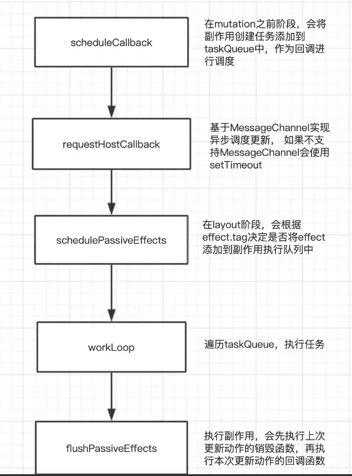

## hook结构
```js
function mountWorkInProgressHook() {
  var hook = {
    memoizedState: null, // 上次渲染时所用的 state
    baseState: null, // 已处理的 update 计算出的 state
    baseQueue: null, // 未处理的 update 队列（一般是上一轮渲染未完成的 update）
    queue: null, // 当前出发的 update 队列
    next: null // 指向下一个 hook，形成链表结构
  };

  if (workInProgressHook === null) {
    // This is the first hook in the list
    console.log('=useState=dom=调用workInProgressHook 初始化 1:', { hook, workInProgressHook })
    currentlyRenderingFiber$1.memoizedState = workInProgressHook = hook;
  } else {
    // Append to the end of the list
    workInProgressHook = workInProgressHook.next = hook;
    console.log('=useState=dom=调用workInProgressHook 2 添加到list 末尾:', { hook, workInProgressHook })
  }

  return workInProgressHook;
}
```

### Hooks是以单向链表的数据结构存储在 Fiber memoizedState 属性身上
从源码注释可以看出hooks链表与fiber链表是极其相似的；也得知hooks 链表是保存在fiber节点的memoizedState属性的, 
```js
/*
Hooks are stored as a linked list on the fiber's memoizedState field.  
hooks 以链表的形式存储在fiber节点的memoizedState属性上
The current hook list is the list that belongs to the current fiber.
当前的hook链表就是当前正在遍历的fiber节点上的
The work-in-progress hook list is a new list that will be added to the work-in-progress fiber.
work-in-progress hook 就是即将被添加到正在遍历fiber节点的hooks新链表
*/
```

在下一次更新时，再次执行hook，就会去获取当前运行节点的hooks链表；
```js
const hook = updateWorkInProgressHook();
// updateWorkInProgressHook 就是一个纯链表的操作：指向下一个 hook节点
```
为什么hooks不能在循环或则判断语句中调用，只能在函数最外层使用，因为挂载或则更新时，这个队列需要是一致的，才能保证hooks的结果正确。


```js
<script type="text/babel">
  function Test() {
    const [data, setData] = React.useState('改变我')
    const [showDiv, setShowDiv] = React.useState(false)
    const [obj, setObj] = React.useState({ test: 1, test2: 2 })

    // 省略
  }
</script> 
```
定义了三个useState hooks,如图可见最后一个节点指向了`next:null`


```js
<script type="text/babel">
  function Test() {
    const [data, setData] = React.useState('改变我')
    const [showDiv, setShowDiv] = React.useState(false)
    const [obj, setObj] = React.useState({ test: 1, test2: 2 })

    React.useEffect(() => {
      console.log('=副作用-useEffect-->运行');
      return () => {
        console.log('useEffect销毁时触发的回调');
      };
    }, [])

    React.useLayoutEffect(() => {
      console.log('=副作用-useLayoutEffect-->运行');
    }, [])
    // 省略
  }
</script> 
```
定义了3个useState hooks,2个effect hooks,如图可见effect hooks的memoizedState
是`一个环形`,next又指向了另一个effect hook节点


## hooks原理:闭包和链表
[例9-测试父子组件.html](https://github.com/huiruo/programming-tech-website/blob/main/programming-tech/React/00-react%E6%BA%90%E7%A0%81%E8%BF%90%E8%A1%8C%E4%BE%8B%E5%AD%90/%E4%BE%8B9-%E6%B5%8B%E8%AF%95%E7%88%B6%E5%AD%90%E7%BB%84%E4%BB%B6.html)

state 链表不是hooks独有的，操作的setState也存在，正是由于这个链表存在，所以有一个经典React 面试题：

setState为什么默认是异步，什么时候是同步？

参考：[React/setState的异步和同步问题](./setState异步-同步)

## hooks中的闭包
前言：定义一个React组件，并且在其他模块中使用，这和闭包有关系吗？

当`Sub`在render中执行时，访问了`Test`中的变量对象，那么闭包就会产生。
参考：父子组件编译后.js
```js
React.createElement(Sub, { obj: obj })
```

### 例子-Hooks能够让函数组件拥有内部状态的基本原理
当useState在`Test()`组件中执行时，访问了state中的变量对象，那么闭包就会产生。

根据闭包的特性，state模块中的state变量，会持久存在。因此当`Test()`再次执行时，我们也能获取到上一次`Test()`执行结束时state的值。

### updateReducer
接下来updateReducer，逻辑比较复杂

参考：[setState组件更新和hooks的初始化-更新阶段-updateReducer](./setState组件更新和hooks的初始化)

## 建立链表的逻辑在dispatchSetState-->enqueueUpdate$1
每个 useXxx 的 hooks 都有 mountXxx 和 updateXxx 两个阶段。链表只创建一次，在 mountXxx 当中，后面都是 update。

以 useState 为例，mount 时会进入 HooksDispatcherOnMountInDEV 的 useState方法，最终执行 mountState

[dispatchSetState-hooks源码](./dispatchSetState-hooks源码)
```js
function dispatchSetState(fiber, queue, action) {
  // 省略..
  // 创建一个 update 更新对象
  var update = {
    lane: lane,
    action: action,
    hasEagerState: false,
    eagerState: null,
    next: null
  };
  if (isRenderPhaseUpdate(fiber)) {
    console.log('=useState=app=dispatchSetState调用enqueueRenderPhaseUpdate渲染阶段更新:')
    enqueueRenderPhaseUpdate(queue, update);
  } else {
    enqueueUpdate$1(fiber, queue, update);
  }

  // 省略..
}

function enqueueUpdate$1(fiber, queue, update, lane) {
  if (isInterleavedUpdate(fiber)) {
    var interleaved = queue.interleaved;

    if (interleaved === null) {
      // This is the first update. Create a circular list.
      update.next = update; // At the end of the current render, this queue's interleaved updates will
      // be transferred to the pending queue.

      pushInterleavedQueue(queue);
    } else {
      update.next = interleaved.next;
      interleaved.next = update;
    }

    queue.interleaved = update;
  } else {

    console.log('=useState=app=enqueueUpdate$1将update对象添加到hook.queue.pending队列')
    var pending = queue.pending;

    if (pending === null) {
      // This is the first update. Create a circular list.
      console.log('=useState=app=首个update 2, 自己指向自己创建一个环状链表,创建一个环形链表')
      update.next = update;
    } else {
      update.next = pending.next;
      pending.next = update;
    }

    queue.pending = update;
  }
}
```

## 获取最新状态的相关代码逻辑存在于updateReducer中：
执行setData 只是形成了状态待执行任务链表，真正得到最终状态，其实是在下一次更新(获取状态)时，即：
```js
// 读取最新data
const [data, setData] = React.useState('改变我')
```

```js
function updateReducer(reducer, initialArg, init) {
  var hook = updateWorkInProgressHook();
  // 省略..
  if (baseQueue !== null) {
  // We have a queue to process.
  var first = baseQueue.next;
  var newState = current.baseState;
  var newBaseState = null;
  var newBaseQueueFirst = null;
  var newBaseQueueLast = null;
  var update = first;

  do {
    var updateLane = update.lane;

    if (!isSubsetOfLanes(renderLanes, updateLane)) {
      // Priority is insufficient. Skip this update. If this is the first
      // skipped update, the previous update/state is the new base
      // update/state.
      var clone = {
        lane: updateLane,
        action: update.action,
        hasEagerState: update.hasEagerState,
        eagerState: update.eagerState,
        next: null
      };

      if (newBaseQueueLast === null) {
        newBaseQueueFirst = newBaseQueueLast = clone;
        newBaseState = newState;
      } else {
        newBaseQueueLast = newBaseQueueLast.next = clone;
      } // Update the remaining priority in the queue.
      // TODO: Don't need to accumulate this. Instead, we can remove
      // renderLanes from the original lanes.


      currentlyRenderingFiber$1.lanes = mergeLanes(currentlyRenderingFiber$1.lanes, updateLane);
      markSkippedUpdateLanes(updateLane);
    } else {
      // This update does have sufficient priority.
      if (newBaseQueueLast !== null) {
        var _clone = {
          // This update is going to be committed so we never want uncommit
          // it. Using NoLane works because 0 is a subset of all bitmasks, so
          // this will never be skipped by the check above.
          lane: NoLane,
          action: update.action,
          hasEagerState: update.hasEagerState,
          eagerState: update.eagerState,
          next: null
        };
        newBaseQueueLast = newBaseQueueLast.next = _clone;
      } // Process this update.


      if (update.hasEagerState) {
        // If this update is a state update (not a reducer) and was processed eagerly,
        // we can use the eagerly computed state
        // 状态已经计算过，那就直接用
        newState = update.eagerState;
      } else {
        var action = update.action;
        newState = reducer(newState, action);
      }
    }

    update = update.next;
    // 终止条件是指针为空 或 环已遍历完
  } while (update !== null && update !== first);

  if (newBaseQueueLast === null) {
    newBaseState = newState;
  } else {
    newBaseQueueLast.next = newBaseQueueFirst;
  } // Mark that the fiber performed work, but only if the new state is
  // different from the current state.


  if (!objectIs(newState, hook.memoizedState)) {
    markWorkInProgressReceivedUpdate();
  }

  hook.memoizedState = newState;
  hook.baseState = newBaseState;
  hook.baseQueue = newBaseQueueLast;
  queue.lastRenderedState = newState;
}
  // 省略..
}
```

### 辅-单向链表js实现
```js
function buildQueue(queue,action){
    const update = {action,next:null}
    const pending = queue.pending
 
    if(!pending){
        queue.pending = update
    }else{
        let current = queue.pending
        // 找到末尾的元素
        while(current.next){
            current = current.next
        }
        // 将update挂载到链表的末尾
        current.next = update
    }
}
 
// execute
let queue = {pending:null}
buildQueue(queue,'hooks1')
buildQueue(queue,'hooks2')
 
// output: queue.pending = {action:'hooks1',next:{action:'hooks2',next:null}}
```

## 1.useLayoutEffect
### useEffect和useLayoutEffect哪个先执行?
useLayoutEffect 的副作用代码会在 useEffect 之前执行

useEffect是异步的，useLayoutEffect是同步,可以在 DOM 更新前同步执行,渲染前执行的useLayoutEffect,在commit阶段的layout阶段同步执行,最后，浏览器执行渲染流程；`useLayoutEffect发生在页面渲染到屏幕(用户可见)之前，useEffect发生在那之后`

>useLayoutEffect 与 componentDidMount、componentDidUpdate 生命周期钩子是【异步微任务】，在渲染线程被调用之前就执行。这意味着回调内部执行完才会更新渲染页面，没有二次渲染问题。
* 优点： 没有二次渲染问题，页面视觉行为一致。
* 缺点: 在回调内部有一些运行耗时很长的代码或者循环时，页面因为需要等 JS 执行完之后才会交给渲染线程绘制页面，等待时期就是白屏效果，即阻塞了渲染。

### useLayoutEffect比先执行useEffect
useLayoutEffect和useEffect的代码是一样的两个都是在commitRootImpl开始调用，区别主要是：
* 执行时机不同；
* useEffect是异步， useLayoutEffect是同步，会阻塞渲染

useLayoutEffect
* 会在commit阶段的layout阶段同步执行

* useLayoutEffect 会同步地执行它的响应函数和上一次的销毁函数，即会阻塞住 DOM渲染。

* useLayoutEffects中适合进行一些可能影响dom的操作，因为在其create中可以获取到最新的dom树且由于此时浏览器未进行绘制（本轮事件循环尚未结束），因此不会有中间状态的产生，可以有效的避免闪动问题。因此当业务中出现需要在effect中修改视图，且执行的上一帧中视图变更，就可以考虑是否将逻辑放入useLayoutEffect中处理。
>当然，useLayoutEffect的使用也应当是谨慎的。由于js线程和渲染进程是互斥的，因此useLayoutEffects中不宜加入很耗时的计算，否则会导致浏览器没有时间重绘而阻塞渲染，上述使用useLayoutEffect的demo中加入了200ms延迟，可以明显的感受到每次点击更新的延迟。除此之外的绝大部分场景下二者的行为都是一致的，因此业务开发中的大部分场景应优先使用useEffect。

useEffect
* 会在commit阶段的layout阶段异步执行,主要原因是防止同步执行时阻塞浏览器渲染。
>摘录自 React 文档,effect 的执行时机 ：
与 componentDidMount、componentDidUpdate 不同的是，在浏览器完成布局与绘制之后，传给 useEffect 的函数会延迟调用。这使得它适用于许多常见的副作用场景，比如设置订阅和事件处理等情况，因此不应在函数中执行阻塞浏览器更新屏幕的操作。

详细看下面:**useEffect之执行:开始执行和useLayoutEffect 同在commitRootImpl**

### useLayoutEffect流程图


### commitLayoutEffects调用commitLayoutEffects_begin
```js
function commitLayoutEffects(finishedWork, root, committedLanes) {
  inProgressLanes = committedLanes;
  inProgressRoot = root;
  nextEffect = finishedWork;
  console.log('-副作用,commit第3阶段,处理执行DOM操作后的操作,并调用commitLayoutEffects_begin参数', { finishedWork, root, committedLanes })
  commitLayoutEffects_begin(finishedWork, root, committedLanes);
  inProgressLanes = null;
  inProgressRoot = null;
}
```

### commitLayoutEffects_begin从上往下遍历effectList,最终执行commitLayoutMountEffects_complete
根据 nextEffect = fiber.return 这段代码可以看出 commitLayoutMountEffects_complete 会从下往上 遍历 effectList 。在该方法中会执行 commitLayoutEffectOnFiber 方法。
```js
function commitLayoutMountEffects_complete(subtreeRoot, root, committedLanes) {
  while (nextEffect !== null) {
    var fiber = nextEffect;

    if ((fiber.flags & LayoutMask) !== NoFlags) {
      var current = fiber.alternate;
      setCurrentFiber(fiber);

      try {
        console.log('commitLayoutMountEffects_complete循环nextEffect调用:commitLayoutEffectOnFiber')
        commitLayoutEffectOnFiber(root, current, fiber, committedLanes);
      } catch (error) {
        captureCommitPhaseError(fiber, fiber.return, error);
      }

      resetCurrentFiber();
    }

    if (fiber === subtreeRoot) {
      nextEffect = null;
      return;
    }

    var sibling = fiber.sibling;

    if (sibling !== null) {
      sibling.return = fiber.return;
      nextEffect = sibling;
      return;
    }

    nextEffect = fiber.return;
  }
}
```

### commitLayoutEffectOnFiber这个代码很长
commitLayoutEffectOnFiber根据不同tag进入不同case一共做了两件事：
1. 调用生命周期钩子和 hook 相关操作:调用 commitHookEffectListMount
3.  此外还会执行commitUpdateQueue，该方法用于执行我们在this.setState中指定的callback
4. commitAttachRef（赋值 ref）
5. 对于class组件则会根据current是否存在来决定执行ComponentDidMount还是ComponentDidUpdate，
6. 这里传入方法的flag是useLayoutEffect对应的flag，因此我们可以明确，useLayoutEffect的回调函数会在layout阶段同步执行。

以case SimpleMemoComponent 为例子：
```js
function commitLayoutEffectOnFiber(finishedRoot, current, finishedWork, committedLanes) {
  if ((finishedWork.flags & LayoutMask) !== NoFlags) {
    switch (finishedWork.tag) {
      case FunctionComponent:
      case ForwardRef:
      case SimpleMemoComponent:
        {
          if (!offscreenSubtreeWasHidden) {
            // At this point layout effects have already been destroyed (during mutation phase).
            // This is done to prevent sibling component effects from interfering with each other,
            // e.g. a destroy function in one component should never override a ref set
            // by a create function in another component during the same commit.
            if (finishedWork.mode & ProfileMode) {
              try {
                startLayoutEffectTimer();
                // 执行useLayoutEffect的回调
                console.log('commitLayoutEffectOnFiber-case等于SimpleMemoComponent为例：调用commitHookEffectListMount 2')
                commitHookEffectListMount(Layout | HasEffect, finishedWork);
              } finally {
                recordLayoutEffectDuration(finishedWork);
              }
            } else {
              console.log('commitLayoutEffectOnFiber-case等于SimpleMemoComponent为例：调用commitHookEffectListMount 2')
              commitHookEffectListMount(Layout | HasEffect, finishedWork);
            }
          }

          break;
        }

      case ClassComponent:
        {
          var instance = finishedWork.stateNode;

          if (finishedWork.flags & Update) {
            if (!offscreenSubtreeWasHidden) {
              if (current === null) {
                // We could update instance props and state here,
                // but instead we rely on them being set during last render.
                // TODO: revisit this when we implement resuming.
                {
                  if (finishedWork.type === finishedWork.elementType && !didWarnAboutReassigningProps) {
                    if (instance.props !== finishedWork.memoizedProps) {
                      error('Expected %s props to match memoized props before ' + 'componentDidMount. ' + 'This might either be because of a bug in React, or because ' + 'a component reassigns its own `this.props`. ' + 'Please file an issue.', getComponentNameFromFiber(finishedWork) || 'instance');
                    }

                    if (instance.state !== finishedWork.memoizedState) {
                      error('Expected %s state to match memoized state before ' + 'componentDidMount. ' + 'This might either be because of a bug in React, or because ' + 'a component reassigns its own `this.state`. ' + 'Please file an issue.', getComponentNameFromFiber(finishedWork) || 'instance');
                    }
                  }
                }

                if (finishedWork.mode & ProfileMode) {
                  try {
                    startLayoutEffectTimer();
                    // 根据current是否存在执行不同生命周期
                    instance.componentDidMount();
                  } finally {
                    recordLayoutEffectDuration(finishedWork);
                  }
                } else {
                  instance.componentDidMount();
                }
              } else {
                var prevProps = finishedWork.elementType === finishedWork.type ? current.memoizedProps : resolveDefaultProps(finishedWork.type, current.memoizedProps);
                var prevState = current.memoizedState; // We could update instance props and state here,
                // but instead we rely on them being set during last render.
                // TODO: revisit this when we implement resuming.

                {
                  if (finishedWork.type === finishedWork.elementType && !didWarnAboutReassigningProps) {
                    if (instance.props !== finishedWork.memoizedProps) {
                      error('Expected %s props to match memoized props before ' + 'componentDidUpdate. ' + 'This might either be because of a bug in React, or because ' + 'a component reassigns its own `this.props`. ' + 'Please file an issue.', getComponentNameFromFiber(finishedWork) || 'instance');
                    }

                    if (instance.state !== finishedWork.memoizedState) {
                      error('Expected %s state to match memoized state before ' + 'componentDidUpdate. ' + 'This might either be because of a bug in React, or because ' + 'a component reassigns its own `this.state`. ' + 'Please file an issue.', getComponentNameFromFiber(finishedWork) || 'instance');
                    }
                  }
                }

                if (finishedWork.mode & ProfileMode) {
                  try {
                    startLayoutEffectTimer();
                    instance.componentDidUpdate(prevProps, prevState, instance.__reactInternalSnapshotBeforeUpdate);
                  } finally {
                    recordLayoutEffectDuration(finishedWork);
                  }
                } else {
                  instance.componentDidUpdate(prevProps, prevState, instance.__reactInternalSnapshotBeforeUpdate);
                }
              }
            }
          } // TODO: I think this is now always non-null by the time it reaches the
          // commit phase. Consider removing the type check.


          var updateQueue = finishedWork.updateQueue;

          if (updateQueue !== null) {
            {
              if (finishedWork.type === finishedWork.elementType && !didWarnAboutReassigningProps) {
                if (instance.props !== finishedWork.memoizedProps) {
                  error('Expected %s props to match memoized props before ' + 'processing the update queue. ' + 'This might either be because of a bug in React, or because ' + 'a component reassigns its own `this.props`. ' + 'Please file an issue.', getComponentNameFromFiber(finishedWork) || 'instance');
                }

                if (instance.state !== finishedWork.memoizedState) {
                  error('Expected %s state to match memoized state before ' + 'processing the update queue. ' + 'This might either be because of a bug in React, or because ' + 'a component reassigns its own `this.state`. ' + 'Please file an issue.', getComponentNameFromFiber(finishedWork) || 'instance');
                }
              }
            } // We could update instance props and state here,
            // but instead we rely on them being set during last render.
            // TODO: revisit this when we implement resuming.


            commitUpdateQueue(finishedWork, updateQueue, instance);
          }

          break;
        }

      case HostRoot:
        {
          // TODO: I think this is now always non-null by the time it reaches the
          // commit phase. Consider removing the type check.
          var _updateQueue = finishedWork.updateQueue;

          if (_updateQueue !== null) {
            var _instance = null;

            if (finishedWork.child !== null) {
              switch (finishedWork.child.tag) {
                case HostComponent:
                  _instance = getPublicInstance(finishedWork.child.stateNode);
                  break;

                case ClassComponent:
                  _instance = finishedWork.child.stateNode;
                  break;
              }
            }

            commitUpdateQueue(finishedWork, _updateQueue, _instance);
          }

          break;
        }

      case HostComponent:
        {
          var _instance2 = finishedWork.stateNode; // Renderers may schedule work to be done after host components are mounted
          // (eg DOM renderer may schedule auto-focus for inputs and form controls).
          // These effects should only be committed when components are first mounted,
          // aka when there is no current/alternate.

          if (current === null && finishedWork.flags & Update) {
            var type = finishedWork.type;
            var props = finishedWork.memoizedProps;
            commitMount(_instance2, type, props);
          }

          break;
        }

      case HostText:
        {
          // We have no life-cycles associated with text.
          break;
        }

      case HostPortal:
        {
          // We have no life-cycles associated with portals.
          break;
        }

      case Profiler:
        {
          {
            var _finishedWork$memoize2 = finishedWork.memoizedProps,
              onCommit = _finishedWork$memoize2.onCommit,
              onRender = _finishedWork$memoize2.onRender;
            var effectDuration = finishedWork.stateNode.effectDuration;
            var commitTime = getCommitTime();
            var phase = current === null ? 'mount' : 'update';

            {
              if (isCurrentUpdateNested()) {
                phase = 'nested-update';
              }
            }

            if (typeof onRender === 'function') {
              onRender(finishedWork.memoizedProps.id, phase, finishedWork.actualDuration, finishedWork.treeBaseDuration, finishedWork.actualStartTime, commitTime);
            }

            {
              if (typeof onCommit === 'function') {
                onCommit(finishedWork.memoizedProps.id, phase, effectDuration, commitTime);
              } // Schedule a passive effect for this Profiler to call onPostCommit hooks.
              // This effect should be scheduled even if there is no onPostCommit callback for this Profiler,
              // because the effect is also where times bubble to parent Profilers.


              enqueuePendingPassiveProfilerEffect(finishedWork); // Propagate layout effect durations to the next nearest Profiler ancestor.
              // Do not reset these values until the next render so DevTools has a chance to read them first.

              var parentFiber = finishedWork.return;

              outer: while (parentFiber !== null) {
                switch (parentFiber.tag) {
                  case HostRoot:
                    var root = parentFiber.stateNode;
                    root.effectDuration += effectDuration;
                    break outer;

                  case Profiler:
                    var parentStateNode = parentFiber.stateNode;
                    parentStateNode.effectDuration += effectDuration;
                    break outer;
                }

                parentFiber = parentFiber.return;
              }
            }
          }

          break;
        }

      case SuspenseComponent:
        {
          commitSuspenseHydrationCallbacks(finishedRoot, finishedWork);
          break;
        }

      case SuspenseListComponent:
      case IncompleteClassComponent:
      case ScopeComponent:
      case OffscreenComponent:
      case LegacyHiddenComponent:
        {
          break;
        }

      default:
        throw new Error('This unit of work tag should not have side-effects. This error is ' + 'likely caused by a bug in React. Please file an issue.');
    }
  }

  if (!offscreenSubtreeWasHidden) {
    {
      if (finishedWork.flags & Ref) {
        commitAttachRef(finishedWork);
      }
    }
  }
}
```

### useLayoutEffect和useEffect最后都是在commitHookEffectListMount() 执行
commitHookEffectListMount(Layout | HasEffect, finishedWork)会执行 useLayoutEffect 的回调函数。


## 2.useEffect
memoizedState保存包含useEffect回调函数、依赖项等的链表数据结构effect。effect链表同时会保存在fiber.updateQueue中。

mount 时和 update 时涉及的主要方法都是 pushEffect，update 时判断依赖是否变化的原理和useCallback 一致。像上面提到的 memoizedState 存的是创建的 effect 对象的环状链表。

pushEffect 的作用：是创建 effect 对象，并将组件内的 effect 对象串成环状单向链表，放到fiber.updateQueue上面。即 effect 除了保存在 fiber.memoizedState 对应的 hook 中，还会保存在 fiber 的 updateQueue 中。

hook 内部的 effect 主要是作为上次更新的 effect，为本次创建 effect 对象提供参照（对比依赖项数组），updateQueue 的 effect 链表会作为最终被执行的主体，带到 commit 阶段处理。即 fiber.updateQueue 会在本次更新的 commit 阶段中被处理，其中 useEffect 是异步调度的，而 useLayoutEffect 的 effect 会在 commit 的 layout 阶段同步处理。等到 commit 阶段完成，更新应用到页面上之后，开始处理 useEffect 产生的 effect，简单说：

* useEffect 是异步调度，等页面渲染完成后再去执行，不会阻塞页面渲染。
* useLayoutEffect 是在 commit 阶段新的 DOM 准备完成，但还未渲染到屏幕前，同步执行。


### useEffect 结构
不同的 hooks 方法，memoizedState 存储的内容不同：
* useState: state
* useEffect: effect 对象
* useMemo/useCallback: callback, deps
* useRef: { current: xxx }

```js
useEffect(() => {
  console.log('=副作用-useEffect-->运行');
  return () => {
    console.log('useEffect销毁时触发的回调');
  };
}, []);

|
|
V

{
  memoizedState: {
    create: function () {
      console.log('=副作用-useEffect-->运行');
    },
    destroy: function () {
      console.log('useEffect销毁时触发的回调');
    },
    deps: [],
    // ...
  },
  baseState: null,
  baseQueue: null,
  queue: null,
  next: null,
}
```

```js
function pushEffect(tag, create, destroy, deps) {
  var effect = {
    tag: tag, // 标记是否有 effect 需要执行 
    create: create, // 回调函数
    destroy: destroy, // 销毁时触发的回调
    deps: deps, // 依赖的数组
    next: null  // 下一个要执行的 Effect
  };
  var componentUpdateQueue = currentlyRenderingFiber$1.updateQueue;

  if (componentUpdateQueue === null) {
    componentUpdateQueue = createFunctionComponentUpdateQueue();
    currentlyRenderingFiber$1.updateQueue = componentUpdateQueue;
    console.log('%c=副作用:pushEffect-effect.next = effect形成环形链表1', 'color:chartreuse')
    componentUpdateQueue.lastEffect = effect.next = effect;
  } else {
    var lastEffect = componentUpdateQueue.lastEffect;

    if (lastEffect === null) {
      console.log('%c=副作用:pushEffect-effect.next = effect形成环形链表2', 'color:chartreuse')
      componentUpdateQueue.lastEffect = effect.next = effect;
    } else {
      console.log('%c=副作用:pushEffect-effect.next = effect形成环形链表3', 'color:chartreuse')
      var firstEffect = lastEffect.next;
      lastEffect.next = effect;
      effect.next = firstEffect;
      componentUpdateQueue.lastEffect = effect;
    }
  }
  console.log('=副作用:pushEffect-返回值', { effect })
  return effect;
}
```

### useEffect 流程图


### effect是个回调函数是异步宏任务，会在微任务执行完后
防止渲染帧时间太长，React 将状态导致的副作用 useEffect 放在了额外的帧里执行，所以 useEffect 是一个名副其实的异步函数。

根据 JS 线程与 GUI 渲染线程互斥原则，在 JS 中页面的渲染线程需要当前事件循环的宏任务与微任务都执行完，才会执行渲染线程，渲染页面后，退出渲染线程，控制权交给 JS 线程，再执行下一轮事件循环。

* 好处：这使得它适用于许多常见的副作用场景，比如设置订阅和事件处理等情况，因为绝大多数操作不应阻塞浏览器对屏幕的渲染更新。

* 坏处：产生二次渲染问题，第一次渲染的是旧的状态，接着下一个事件循环中，执行改变状态的函数，组件又携带新的状态渲染，在视觉上，就是二次渲染。

* 执行第一个宏任务
* 执行第一个宏任务产生的所有微任务
* 【第一次渲染】
* 检索出第一个 useEffect（该 useEffect 会在 “第一次渲染后，至在第二次渲染前“ 被执行）
* 执行第二个宏任务
* 执行第二个宏任务产生的所有微任务
* 【第二次渲染】
* 检索出第二个 useEffect（该 useEffect 会在 “第二次渲染后，至在第三次渲染前“ 被执行）

## useEffect 异步调用分为三步：
1. before mutation 阶段在scheduleCallback 中调度flushPassiveEffects；
2. layout 阶段之后将effectList赋值给rootWithPendingPassiveEffects；
3. scheduleCallback触发flushPassiveEffects，flushPassiveEffects内部遍历rootWithPendingPassiveEffects。

### 如何异步调度
在这几行代码内，scheduleCallback 方法由Scheduler 模块提供，用于以某个优先级异步调度一个回调函数。
```js
// 调度 useEffect
if ((effectTag & Passive) !== NoEffect) {
  if (!rootDoesHavePassiveEffects) {
    rootDoesHavePassiveEffects = true;
    scheduleCallback(NormalSchedulerPriority, () => {
      // 触发 useEffect
      flushPassiveEffects();
      return null;
    });
  }
}
```
在此处，被异步调度的回调函数就是触发 useEffect 的方法flushPassiveEffects。

在flushPassiveEffects 方法内部会从全局变量rootWithPendingPassiveEffects 获取 effectList。
在我们讲到，effectList中 保存了需要执行副作用的 Fiber 节点。其中副作用包括：
- 插入 DOM 节点（Placement）
- 更新 DOM 节点（Update）
- 删除 DOM 节点（Deletion）

除此外，当一个FunctionComponent含有useEffect或useLayoutEffect，他对应的 Fiber 节点也会被赋值 effectTag。你可以从 这里 看到 hook 相关的 effectTag。

在flushPassiveEffects 方法内部会遍历 rootWithPendingPassiveEffects（即 effectList）执行 effect 回调函数。

如果在此时直接执行，rootWithPendingPassiveEffects === null。

那么 rootWithPendingPassiveEffects 会在何时赋值呢？

在上一节layout 之后的代码片段中会根据 rootDoesHavePassiveEffects === true ? 决定是否赋值 rootWithPendingPassiveEffects。
```js
const rootDidHavePassiveEffects = rootDoesHavePassiveEffects;
if (rootDoesHavePassiveEffects) {
  rootDoesHavePassiveEffects = false;
  rootWithPendingPassiveEffects = root;
  pendingPassiveEffectsLanes = lanes;
  pendingPassiveEffectsRenderPriority = renderPriorityLevel;
}
```


## useEffect初始化
create：使用者传入的回调函数；
deps：使用者传入的数组依赖；
```js
useEffect: function (create, deps) {
  currentHookNameInDev = 'useEffect';
  mountHookTypesDev();
  checkDepsAreArrayDev(deps);
  return mountEffect(create, deps);
}

function mountEffect(create, deps) {
  if ((currentlyRenderingFiber$1.mode & StrictEffectsMode) !== NoMode) {
    return mountEffectImpl(MountPassiveDev | Passive | PassiveStatic, Passive$1, create, deps);
  } else {
    return mountEffectImpl(Passive | PassiveStatic, Passive$1, create, deps);
  }
}
```

```js
function mountEffectImpl(fiberFlags, hookFlags, create, deps) {
  console.log('=副作用:mountEffectImpl-hook初始化')
  var hook = mountWorkInProgressHook();
  console.log('=副作用:mountEffectImpl-判断是否有传入deps，如果有会作为下次更新的deps')
  var nextDeps = deps === undefined ? null : deps;
  console.log('=副作用:mountEffectImpl-给hook所在的fiber打上有副作用的更新的标记')
  currentlyRenderingFiber$1.flags |= fiberFlags;
  console.log('=副作用:mountEffectImpl-将副作用操作存放到fiber.memoizedState.hook.memoizedState中')
  hook.memoizedState = pushEffect(HasEffect | hookFlags, create, undefined, nextDeps);
}
```

### useEffect之pushEffect 存放副作用更新
上面这段代码除了初始化副作用的结构代码外，都是我们前面讲过的操作闭环链表，向链表末尾添加新的effect，该effect.next指向firstEffect，并且链表当前的指针指向最新添加的effect。

useEffect的初始化就这么简单，简单总结一下：给hook所在的fiber打上副作用更新标记，并且fiber.memoizedState.hook.memoizedState和fiber.updateQueue存储了相关的副作用，这些副作用通过闭环链表的结构存储
```js
function pushEffect(tag, create, destroy, deps) {
  var effect = {
    tag: tag,
    create: create,
    destroy: destroy,
    deps: deps,
    // Circular
    next: null
  };
  var componentUpdateQueue = currentlyRenderingFiber$1.updateQueue;

  if (componentUpdateQueue === null) {
    componentUpdateQueue = createFunctionComponentUpdateQueue();
    currentlyRenderingFiber$1.updateQueue = componentUpdateQueue;
    console.log('%c=副作用:pushEffect-effect.next = effect形成环形链表1', 'color:chartreuse')
    componentUpdateQueue.lastEffect = effect.next = effect;
  } else {
    var lastEffect = componentUpdateQueue.lastEffect;

    if (lastEffect === null) {
      console.log('%c=副作用:pushEffect-effect.next = effect形成环形链表2', 'color:chartreuse')
      componentUpdateQueue.lastEffect = effect.next = effect;
    } else {
      console.log('%c=副作用:pushEffect-effect.next = effect形成环形链表3', 'color:chartreuse')
      var firstEffect = lastEffect.next;
      lastEffect.next = effect;
      effect.next = firstEffect;
      componentUpdateQueue.lastEffect = effect;
    }
  }
  console.log('=副作用:pushEffect-返回值', { effect })
  return effect;
}
```

### useEffect之更新useEffect-->不一定会调用updateEffectImpl
updateWorkInProgressHook主要功能就是创建一个带有回调函数的newHook去覆盖之前的hook

它会判断两次依赖数组中的值是否有变化以及deps是否是空数组来决定返回true和false，返回true表明这次不需要调用回调函数。
现在我们明白了两次pushEffect的异同，if内部的pushEffect是不需要调用的回调函数， 外面的pushEffect是需要调用的。

不管useEffect里的deps有没有变化都会为回调函数创建effect并添加到effect链表和fiber.updateQueue中，但是React会根据effect.tag来决定该effect是否要添加到副作用执行队列中去执行。
```js
function updateEffectImpl(fiberFlags, hookFlags, create, deps) {
}
```

## useEffect之执行:开始执行useEffect,同在commitRootImpl

首先在mutation之前阶段，基于副作用创建任务并放到taskQueue中，同时会执行requestHostCallback，这个方法就涉及到了异步了，它首先考虑使用MessageChannel实现异步，其次会考虑使用setTimeout实现。使用MessageChannel时，requestHostCallback会马上执行port.postMessage(null);，这样就可以在异步的第一时间执行workLoop，workLoop会遍历taskQueue，执行任务，如果是useEffect的effect任务，会调用flushPassiveEffects。

可能有人会疑惑为什么优先考虑MessageChannel？

回答：首先我们要明白React调度更新的目的是为了时间分片，意思是每隔一段时间就把主线程还给浏览器，避免长时间占用主线程导致页面卡顿。使用MessageChannel和SetTimeout的目的都是为了创建宏任务，因为宏任务会在当前微任务都执行完后，等到浏览器主线程空闲后才会执行。不优先考虑setTimeout的原因是，setTimeout执行时间不准确，会造成时间浪费，即使是setTimeout(fn, 0)。

`scheduleCallback将执行useEffect的动作作为一个任务去调度，这个任务会异步调用`
```js
function commitRootImpl(root, recoverableErrors, transitions, renderPriorityLevel) {
  // 省略
  console.log(`%c=副作用:commitRootImpl务，如果是useEffect的effect任务，会调用flushPassiveEffects`, 'color:yellow', (finishedWork.subtreeFlags & PassiveMask) !== NoFlags || (finishedWork.flags & PassiveMask) !== NoFlags)
  if ((finishedWork.subtreeFlags & PassiveMask) !== NoFlags || (finishedWork.flags & PassiveMask) !== NoFlags) {
    if (!rootDoesHavePassiveEffects) {
      rootDoesHavePassiveEffects = true;
      // to store it in pendingPassiveTransitions until they get processed
      // We need to pass this through as an argument to commitRoot
      // because workInProgressTransitions might have changed between
      // the previous render and commit if we throttle the commit
      // with setTimeout

      pendingPassiveTransitions = transitions;
      scheduleCallback$1(NormalPriority, function () {
        console.log(`%c=副作用:commitRootImpl调用flushPassiveEffects-2`, 'color:yellow')
        flushPassiveEffects(); // This render triggered passive effects: release the root cache pool
        // *after* passive effects fire to avoid freeing a cache pool that may
        // be referenced by a node in the tree (HostRoot, Cache boundary etc)

        return null;
      });
    }
  }
  // 省略
}
```

```js
function scheduleCallback$1(priorityLevel, callback) {
  {
    // If we're currently inside an `act` scope, bypass Scheduler and push to
    // the `act` queue instead.
    var actQueue = ReactCurrentActQueue$1.current;

    if (actQueue !== null) {
      actQueue.push(callback);
      return fakeActCallbackNode;
    } else {
      return scheduleCallback(priorityLevel, callback);
    }
  }
}
```

### useEffect之执行:flushPassiveEffects调用flushPassiveEffects 
```js
function flushPassiveEffects() {
  // Returns whether passive effects were flushed.
  // TODO: Combine this check with the one in flushPassiveEFfectsImpl. We should
  // probably just combine the two functions. I believe they were only separate
  // in the first place because we used to wrap it with
  // `Scheduler.runWithPriority`, which accepts a function. But now we track the
  // priority within React itself, so we can mutate the variable directly.
  console.log(`%c=副作用:flushPassiveEffects return bool`, 'color:yellow', { rootWithPendingPassiveEffects: rootWithPendingPassiveEffects !== null })
  if (rootWithPendingPassiveEffects !== null) {
    var renderPriority = lanesToEventPriority(pendingPassiveEffectsLanes);
    var priority = lowerEventPriority(DefaultEventPriority, renderPriority);
    var prevTransition = ReactCurrentBatchConfig$3.transition;
    var previousPriority = getCurrentUpdatePriority();

    try {
      ReactCurrentBatchConfig$3.transition = null;
      setCurrentUpdatePriority(priority);
      console.log(`%c=副作用:flushPassiveEffects 调用return flushPassiveEffectsImpl()`, 'color:yellow')
      return flushPassiveEffectsImpl();
    } finally {
      setCurrentUpdatePriority(previousPriority);
      ReactCurrentBatchConfig$3.transition = prevTransition; // Once passive effects have run for the tree - giving components a
    }
  }

  return false;
}
```

```js
function commitPassiveMountEffects(root, finishedWork, committedLanes, committedTransitions) {
  nextEffect = finishedWork;
  console.log(`%c=副作用:commitPassiveMountEffects调用commitPassiveMountEffects_begin`, 'color:yellow')
  commitPassiveMountEffects_begin(finishedWork, root, committedLanes, committedTransitions);
}

function commitPassiveMountEffects_begin(subtreeRoot, root, committedLanes, committedTransitions) {
  while (nextEffect !== null) {
    var fiber = nextEffect;
    var firstChild = fiber.child;

    if ((fiber.subtreeFlags & PassiveMask) !== NoFlags && firstChild !== null) {
      firstChild.return = fiber;
      nextEffect = firstChild;
    } else {
      console.log(`%c=副作用:commitPassiveMountEffects_begin调用commitPassiveMountEffects_complete`, 'color:yellow')
      commitPassiveMountEffects_complete(subtreeRoot, root, committedLanes, committedTransitions);
    }
  }
}

function commitPassiveMountEffects_complete(subtreeRoot, root, committedLanes, committedTransitions) {
  while (nextEffect !== null) {
    var fiber = nextEffect;

    if ((fiber.flags & Passive) !== NoFlags) {
      setCurrentFiber(fiber);

      try {
        console.log(`%c=副作用:commitPassiveMountEffects_complete调用commitPassiveMountOnFiber`, 'color:yellow')
        commitPassiveMountOnFiber(root, fiber, committedLanes, committedTransitions);
      } catch (error) {
        captureCommitPhaseError(fiber, fiber.return, error);
      }

      resetCurrentFiber();
    }

    if (fiber === subtreeRoot) {
      nextEffect = null;
      return;
    }

    var sibling = fiber.sibling;

    if (sibling !== null) {
      sibling.return = fiber.return;
      nextEffect = sibling;
      return;
    }

    nextEffect = fiber.return;
  }
}
```

## useEffect之执行:最后一步commitPassiveMountOnFiber
最后一步调用:commitPassiveMountOnFiber-->commitHookEffectListMount-->最后执行 useLayoutEffect 的回调函数。

```js
function commitPassiveMountOnFiber(finishedRoot, finishedWork, committedLanes, committedTransitions) {
  switch (finishedWork.tag) {
    case FunctionComponent:
    case ForwardRef:
    case SimpleMemoComponent:
      {
        if (finishedWork.mode & ProfileMode) {
          startPassiveEffectTimer();

          try {
            console.log(`%c=副作用:commitPassiveMountOnFiber case为SimpleMemoComponent','color:yellow','%c调用commitHookEffectListMount 1`, 'color:red')
            commitHookEffectListMount(Passive$1 | HasEffect, finishedWork);
          } finally {
            recordPassiveEffectDuration(finishedWork);
          }
        } else {
          console.log('%c=副作用:commitPassiveMountOnFiber case为SimpleMemoComponent%c调用commitHookEffectListMount 2', 'color:yellow', 'color:red')
          commitHookEffectListMount(Passive$1 | HasEffect, finishedWork);
        }

        break;
      }
  }
}
```

## commitHookEffectListMount effect的执行函数
```js
function commitHookEffectListMount(flags, finishedWork) {
  var updateQueue = finishedWork.updateQueue;
  var lastEffect = updateQueue !== null ? updateQueue.lastEffect : null;

  if (lastEffect !== null) {
    var firstEffect = lastEffect.next;
    var effect = firstEffect;

    console.log('%ccommitHookEffectListMount开始循环effect !== firstEffect', 'color:red')
    do {
      if ((effect.tag & flags) === flags) {
        {
          if ((flags & Passive$1) !== NoFlags$1) {
            markComponentPassiveEffectMountStarted(finishedWork);
          } else if ((flags & Layout) !== NoFlags$1) {
            markComponentLayoutEffectMountStarted(finishedWork);
          }
        } // Mount

        // create即我们在副作用中指定的回调
        var create = effect.create;

        {
          if ((flags & Insertion) !== NoFlags$1) {
            setIsRunningInsertionEffect(true);
          }
        }
        console.log('commitHookEffectListMount执行Effect:', { create })
        effect.destroy = create();

        {
          if ((flags & Insertion) !== NoFlags$1) {
            setIsRunningInsertionEffect(false);
          }
        }

        {
          if ((flags & Passive$1) !== NoFlags$1) {
            markComponentPassiveEffectMountStopped();
          } else if ((flags & Layout) !== NoFlags$1) {
            markComponentLayoutEffectMountStopped();
          }
        }

        {
          // 执行回调得到销毁函数，赋值给destroy，将来会在commitHookEffectListUnmount中执行
          var destroy = effect.destroy;

          if (destroy !== undefined && typeof destroy !== 'function') {
            var hookName = void 0;

            if ((effect.tag & Layout) !== NoFlags) {
              hookName = 'useLayoutEffect';
            } else if ((effect.tag & Insertion) !== NoFlags) {
              hookName = 'useInsertionEffect';
            } else {
              hookName = 'useEffect';
            }

            var addendum = void 0;

            if (destroy === null) {
              addendum = ' You returned null. If your effect does not require clean ' + 'up, return undefined (or nothing).';
            } else if (typeof destroy.then === 'function') {
              addendum = '\n\nIt looks like you wrote ' + hookName + '(async () => ...) or returned a Promise. ' + 'Instead, write the async function inside your effect ' + 'and call it immediately:\n\n' + hookName + '(() => {\n' + '  async function fetchData() {\n' + '    // You can await here\n' + '    const response = await MyAPI.getData(someId);\n' + '    // ...\n' + '  }\n' + '  fetchData();\n' + "}, [someId]); // Or [] if effect doesn't need props or state\n\n" + 'Learn more about data fetching with Hooks: https://reactjs.org/link/hooks-data-fetching';
            } else {
              addendum = ' You returned: ' + destroy;
            }

            error('%s must not return anything besides a function, ' + 'which is used for clean-up.%s', hookName, addendum);
          }
        }
      }

      effect = effect.next;
    } while (effect !== firstEffect);
  }
}
```
