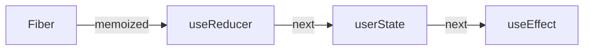
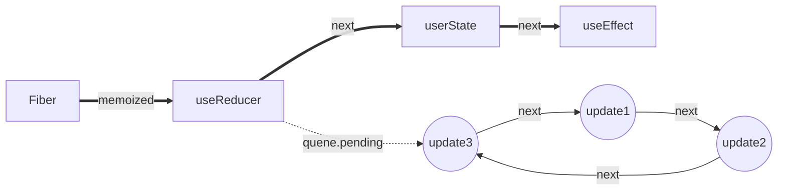

## hooks:闭包 + 两级链表
### 首先，Hooks是以单向链表的形式存储在 Fiber 的 memoizedState 属性身上


### 同时，每个hooks又拥有自己的更新队列queue，queue.pending 会指向一个环状链表



- 由图可知，queue.pending 永远指向最后一个更新
- 由图可知，pending.next 永远指向第一个更新


## 为什么要是环状链表？
为什么要用环状链表呢?
因为React的更新任务是有优先级的。

假如有三个 update，第二个update的优先级比较高，那么会先执行第二个 update，单向链表可能会导致第一个update丢失，而环状链表的优势在于可以从任何节点开始循环链表。总结来说：环状链表可以保证update不丢失，并且保证状态依赖的连续性。

在获取头部或者插入尾部的时候避免不必要的遍历操作

（上面提到的 fiber.updateQueue 、 useEffect 创建的 hook 对象中的 memoizedState 存的 effect 环状链表，以及 useState 的 queue.pending 上的 update 对象的环状链表，都是这个原因）

方便定位到链表的第一个元素。updateQueue 指向它的最后一个 update，updateQueue.next 指向它的第一个update。

若不使用环状链表，updateQueue 指向最后一个元素，需要遍历才能获取链表首部。即使将updateQueue指向第一个元素，那么新增update时仍然要遍历到尾部才能将新增的接入链表。


### Hooks 链表创建过程
每个 useXxx 的 hooks 都有 mountXxx 和 updateXxx 两个阶段。链表只创建一次，在 mountXxx 当中，后面都是 update。

以 useState 为例，mount 时会进入 HooksDispatcherOnMountInDEV 的 useState方法，最终执行 mountState

### 辅:单向链表js实现
```js
function buildQueue(queue,action){
    const update = {action,next:null}
    const pending = queue.pending
 
    if(!pending){
        queue.pending = update
    }else{
        let current = queue.pending
        // 找到末尾的元素
        while(current.next){
            current = current.next
        }
        // 将update挂载到链表的末尾
        current.next = update
    }
}
 
// excute
let queue = {pending:null}
buildQueue(queue,'hooks1')
buildQueue(queue,'hooks2')
 
// output: queue.pending = {action:'hooks1',next:{action:'hooks2',next:null}}
```

### 辅:环状链表js实现
```js
function dispatchAction(queue,action){
     const update = {action,next:null}
     const pending = queue.pending
     if(pending === null){
        update.next = update // 自己与自己创建一个环状链表
     }else{
        update.next = pending.next
        pending.next = update
     }
     queue.pending = update
}
 
let queue = {pending:null}
 
/**
 * update.next === update
 * queue.pending === update(action) 
 */
dispatchAction(queue,'action')
 
 
/**
 * update(action1).next -> update(action).next [update(action)]    
 * update1 的next 指向 update
 * queue.pending.next [update(update)] -> update(action1)          
 * update 指向 update1
 * queue.pending -> update(action1)                                
 * queue.pending 指向 update1
 */
dispatchAction(queue,'action1')
```

### 链表hooks,单向链表实现
```js
/*
Hooks are stored as a linked list on the fiber's memoizedState field.  
hooks 以链表的形式存储在fiber节点的memoizedState属性上
The current hook list is the list that belongs to the current fiber.
当前的hook链表就是当前正在遍历的fiber节点上的
The work-in-progress hook list is a new list that will be added to the work-in-progress fiber.
work-in-progress hook 就是即将被添加到正在遍历fiber节点的hooks新链表
*/
let currentHook: Hook | null = null;
let nextCurrentHook: Hook | null = null;
```

从上面的源码注释可以看出hooks链表与fiber链表是极其相似的；也得知hooks 链表是保存在fiber节点的memoizedState属性的, 


这个hooks 链表具体指什么？
其实就是指一个组件包含的hooks, 比如上面示例中的：
```js
const [count, setCount] = useState(0);
const [age, setAge] = useState(18);
const self = useRef(0);
const onClick = useCallback(() => {
  setAge(19);
  setAge(20);
  setAge(21);
}, []);
```
形成的链表就是下面这样的：


所以在下一次更新时，再次执行hook，就会去获取当前运行节点的hooks链表；
```js
const hook = updateWorkInProgressHook();
// updateWorkInProgressHook 就是一个纯链表的操作：指向下一个 hook节点
```
到这 hooks 链表是什么，应该就明白了；这时你可能会更明白，为什么hooks不能在循环，判断语句中调用，而只能在函数最外层使用，因为挂载或则更新时，这个队列需要是一致的，才能保证hooks的结果正确。

### 2.第二个链表：环状链表实现
state 链表不是hooks独有的，类操作的setState也存在，正是由于这个链表存在，所以有一个经典React 面试题：

setState为什么默认是异步，什么时候是同步？

参考：[React/setState的异步和同步问题](./setState异步-同步)

### 环状链表实现

建立这个链表的逻辑就在 dispatchSetState-->enqueueUpdate$1。
```
update(action1).next -> update(action).next [update(action)]    
update1 的next 指向 update
queue.pending.next [update(update)] -> update(action1)          
update 指向 update1
queue.pending -> update(action1)                                
queue.pending 指向 update1
```

[dispatchSetState-hooks源码](./dispatchSetState-hooks源码)
```js
function dispatchSetState(fiber, queue, action) {
  // 省略..
  // 创建一个 update 更新对象
  var update = {
    lane: lane,
    action: action,
    hasEagerState: false,
    eagerState: null,
    next: null
  };
  if (isRenderPhaseUpdate(fiber)) {
    console.log('=useState=app=dispatchSetState调用enqueueRenderPhaseUpdate渲染阶段更新:')
    enqueueRenderPhaseUpdate(queue, update);
  } else {
    enqueueUpdate$1(fiber, queue, update);
  }

  // 省略..
}

function enqueueUpdate$1(fiber, queue, update, lane) {
  if (isInterleavedUpdate(fiber)) {
    var interleaved = queue.interleaved;

    if (interleaved === null) {
      // This is the first update. Create a circular list.
      update.next = update; // At the end of the current render, this queue's interleaved updates will
      // be transferred to the pending queue.

      pushInterleavedQueue(queue);
    } else {
      update.next = interleaved.next;
      interleaved.next = update;
    }

    queue.interleaved = update;
  } else {

    console.log('=useState=app=enqueueUpdate$1将update对象添加到hook.queue.pending队列')
    var pending = queue.pending;

    if (pending === null) {
      // This is the first update. Create a circular list.
      console.log('=useState=app=首个update 2, 自己指向自己创建一个环状链表,创建一个环形链表')
      update.next = update;
    } else {
      update.next = pending.next;
      pending.next = update;
    }

    queue.pending = update;
  }
}
```

执行setAge 只是形成了状态待执行任务链表，真正得到最终状态，其实是在下一次更新(获取状态)时，即：
```js
// 读取最新age
const [age, setAge] = useState(18);
```

而获取最新状态的相关代码逻辑存在于updateReducer中：
```js
function updateReducer(reducer, initialArg, init) {
  var hook = updateWorkInProgressHook();
  // 省略..
  if (baseQueue !== null) {
  // We have a queue to process.
  var first = baseQueue.next;
  var newState = current.baseState;
  var newBaseState = null;
  var newBaseQueueFirst = null;
  var newBaseQueueLast = null;
  var update = first;

  do {
    var updateLane = update.lane;

    if (!isSubsetOfLanes(renderLanes, updateLane)) {
      // Priority is insufficient. Skip this update. If this is the first
      // skipped update, the previous update/state is the new base
      // update/state.
      var clone = {
        lane: updateLane,
        action: update.action,
        hasEagerState: update.hasEagerState,
        eagerState: update.eagerState,
        next: null
      };

      if (newBaseQueueLast === null) {
        newBaseQueueFirst = newBaseQueueLast = clone;
        newBaseState = newState;
      } else {
        newBaseQueueLast = newBaseQueueLast.next = clone;
      } // Update the remaining priority in the queue.
      // TODO: Don't need to accumulate this. Instead, we can remove
      // renderLanes from the original lanes.


      currentlyRenderingFiber$1.lanes = mergeLanes(currentlyRenderingFiber$1.lanes, updateLane);
      markSkippedUpdateLanes(updateLane);
    } else {
      // This update does have sufficient priority.
      if (newBaseQueueLast !== null) {
        var _clone = {
          // This update is going to be committed so we never want uncommit
          // it. Using NoLane works because 0 is a subset of all bitmasks, so
          // this will never be skipped by the check above.
          lane: NoLane,
          action: update.action,
          hasEagerState: update.hasEagerState,
          eagerState: update.eagerState,
          next: null
        };
        newBaseQueueLast = newBaseQueueLast.next = _clone;
      } // Process this update.


      if (update.hasEagerState) {
        // If this update is a state update (not a reducer) and was processed eagerly,
        // we can use the eagerly computed state
        // 状态已经计算过，那就直接用
        newState = update.eagerState;
      } else {
        var action = update.action;
        newState = reducer(newState, action);
      }
    }

    update = update.next;
    // 终止条件是指针为空 或 环已遍历完
  } while (update !== null && update !== first);

  if (newBaseQueueLast === null) {
    newBaseState = newState;
  } else {
    newBaseQueueLast.next = newBaseQueueFirst;
  } // Mark that the fiber performed work, but only if the new state is
  // different from the current state.


  if (!objectIs(newState, hook.memoizedState)) {
    markWorkInProgressReceivedUpdate();
  }

  hook.memoizedState = newState;
  hook.baseState = newBaseState;
  hook.baseQueue = newBaseQueueLast;
  queue.lastRenderedState = newState;
}
  // 省略..
}
```


## hooks结构
```js
// hook的结构
export type Hook = {
  memoizedState: any, //上一次的state
  baseState: any,  // 当前state
  baseUpdate: Update<any, any> | null,  // update func
  next: Hook | null, // 链表
  queue: UpdateQueue<any, any> | null,  // 用于缓存多次action
};

const example ={
  baseQueue:null,
  baseState:"改变我",
  memoizedState:"改变我",
  next:{},
  queue:{},
}
```

```js
import { useState, useEffect } from "react";
export default function App() {
  // 1. useState
  const [a, setA] = useState(1);
  // 2. useEffect
  useEffect(() => {
    console.log(`effect 1 created`);
  });
  // 3. useState
  const [b] = useState(2);
  // 4. useEffect
  useEffect(() => {
    console.log(`effect 2 created`);
  });
  return (
    <>
      <button onClick={() => setA(a + 1)}>{a}</button>
      <button>{b}</button>
    </>
  );
}
```

本示例中, function调用之后则会创建 4 个hook, 这时的内存结构如下:


状态Hook或副作用Hook都按照调用顺序存储在fiber.memoizedState链表中

## hooks中的闭包
前言：定义一个React组件，并且在其他模块中使用，这和闭包有关系吗？
在模块Counter.jsx中定义一个Counter组件
```js
// Counter.jsx
export default function Counter() {}

// 然后在App模块中使用Counter组件
// App.jsx
import Counter from './Counter';
export default function App() {
 // todo
   return (
    <Counter />
  )
}
```

手动转换成伪代码,我们将上面闭包定义的A，B用本例中的名称替换一下：
自执行函数AppModule以及在AppModule中创建的函数App。

当App在render中执行时，访问了AppModule中的变量对象(定义了变量Counter)，那么闭包就会产生。
```js
const CounterModule = (function() {
  return function Counter() {}
})()

const AppModule = (function() {
  const Counter = CounterModule;
  return function App() {
    return Counter();
  }
})()
```

### 例子2:Hooks能够让函数组件拥有内部状态的基本原理
定义一个名为State的模块
```js
// state.js
let state = null;

export const useState = (value: number) => {
  // 第一次调用时没有初始值，因此使用传入的初始值赋值
  state = state || value;

  function dispatch(newValue) {
    state = newValue;
    // 假设此方法能触发页面渲染
    render();
  }

  return [state, dispatch];
}
```

在其他模块中引入并使用。

当useState在Demo中执行时，访问了state中的变量对象，那么闭包就会产生。

这里要知道源码：react 组件会运行两次，初始化一次，点击事件触发fiber更新流程的时候一次,第二次是为了构建新的fiber tree
`根据闭包的特性，state模块中的state变量，会持久存在。因此当Demo函数再次执行时，我们也能获取到上一次Demo函数执行结束时state的值。`
```js
import React from 'react';
import {useState} from './state';

function Demo() {
  // 使用数组解构的方式，定义变量
  const [counter, setCounter] = useState(0);

  return (
    <div onClick={() => setCounter(counter + 1)}>hello world, {counter}</div>
  )
}

export default Demo();
```

简化一下源代码，发现逻辑虽然复杂，但是核心的两个东西，还是在于修改了一个叫做hook的变量，以及返回了[hook.memoizedState, dispatch]。

这个hook是什么呢？在updateWorkInProgressHook方法中发现，hook是包含了memoizedState, baseState, queue, baseUpdate, next属性的一个对象。
```js
function updateWorkInProgressHook() {
  // This function is used both for updates and for re-renders triggered by a
  // render phase update. It assumes there is either a current hook we can
  // clone, or a work-in-progress hook from a previous render pass that we can
  // use as a base. When we reach the end of the base list, we must switch to
  // the dispatcher used for mounts.
  var nextCurrentHook;

  if (currentHook === null) {
    var current = currentlyRenderingFiber$1.alternate;

    if (current !== null) {
      nextCurrentHook = current.memoizedState;
    } else {
      nextCurrentHook = null;
    }
  } else {
    nextCurrentHook = currentHook.next;
  }

  var nextWorkInProgressHook;

  if (workInProgressHook === null) {
    nextWorkInProgressHook = currentlyRenderingFiber$1.memoizedState;
  } else {
    nextWorkInProgressHook = workInProgressHook.next;
  }

  if (nextWorkInProgressHook !== null) {
    // There's already a work-in-progress. Reuse it.
    workInProgressHook = nextWorkInProgressHook;
    nextWorkInProgressHook = workInProgressHook.next;
    currentHook = nextCurrentHook;
  } else {
    // Clone from the current hook.
    if (nextCurrentHook === null) {
      throw new Error('Rendered more hooks than during the previous render.');
    }

    currentHook = nextCurrentHook;
    var newHook = {
      memoizedState: currentHook.memoizedState,
      baseState: currentHook.baseState,
      baseQueue: currentHook.baseQueue,
      queue: currentHook.queue,
      next: null
    };

    if (workInProgressHook === null) {
      // This is the first hook in the list.
      currentlyRenderingFiber$1.memoizedState = workInProgressHook = newHook;
    } else {
      // Append to the end of the list.
      workInProgressHook = workInProgressHook.next = newHook;
    }
  }

  return workInProgressHook;
}
```

### updateReducer
继续找到updateReducer，updateReducer的逻辑比较复杂。不过我们基于上面提到过的两个思路，看他修改了什么，与返回了什么。

updateReducer返回的数组中，第一个值就是memoizedState。

因此可以得出结论，其实我们的状态，就缓存在hook.memoizedState这个值里。

继续观察updateWorkInProgressHook方法，发现该方法在内部修改了很多外部的变量，workInProgressHook，nextWorkInProgressHook，currentHook等。而memoizedState: currentHook.memoizedState。

```js
function updateReducer(reducer, initialArg, init) {
  var hook = updateWorkInProgressHook();
  console.log('%c=updateState=updateReducer调用updateWorkInProgressHook,拷贝hook(current->workInProcess),并返回这个hook', 'color:cyan', { hook })
  var queue = hook.queue;

  console.log('%c=updateState=updateReducer读取队列,计算出最新状态，更新hook的状态', 'color:cyan')
  if (queue === null) {
    throw new Error('Should have a queue. This is likely a bug in React. Please file an issue.');
  }

  queue.lastRenderedReducer = reducer;
  var current = currentHook; // The last rebase update that is NOT part of the base state.

  var baseQueue = current.baseQueue; // The last pending update that hasn't been processed yet.

  var pendingQueue = queue.pending;

  if (pendingQueue !== null) {
    // We have new updates that haven't been processed yet.
    // We'll add them to the base queue.
    if (baseQueue !== null) {
      // Merge the pending queue and the base queue.
      var baseFirst = baseQueue.next;
      var pendingFirst = pendingQueue.next;
      baseQueue.next = pendingFirst;
      pendingQueue.next = baseFirst;
    }

    {
      if (current.baseQueue !== baseQueue) {
        // Internal invariant that should never happen, but feasibly could in
        // the future if we implement resuming, or some form of that.
        error('Internal error: Expected work-in-progress queue to be a clone. ' + 'This is a bug in React.');
      }
    }

    current.baseQueue = baseQueue = pendingQueue;
    queue.pending = null;
  }

  if (baseQueue !== null) {
    // We have a queue to process.
    var first = baseQueue.next;
    var newState = current.baseState;
    var newBaseState = null;
    var newBaseQueueFirst = null;
    var newBaseQueueLast = null;
    var update = first;

    do {
      var updateLane = update.lane;

      if (!isSubsetOfLanes(renderLanes, updateLane)) {
        // Priority is insufficient. Skip this update. If this is the first
        // skipped update, the previous update/state is the new base
        // update/state.
        var clone = {
          lane: updateLane,
          action: update.action,
          hasEagerState: update.hasEagerState,
          eagerState: update.eagerState,
          next: null
        };

        if (newBaseQueueLast === null) {
          newBaseQueueFirst = newBaseQueueLast = clone;
          newBaseState = newState;
        } else {
          newBaseQueueLast = newBaseQueueLast.next = clone;
        } // Update the remaining priority in the queue.
        // TODO: Don't need to accumulate this. Instead, we can remove
        // renderLanes from the original lanes.


        currentlyRenderingFiber$1.lanes = mergeLanes(currentlyRenderingFiber$1.lanes, updateLane);
        markSkippedUpdateLanes(updateLane);
      } else {
        // This update does have sufficient priority.
        if (newBaseQueueLast !== null) {
          var _clone = {
            // This update is going to be committed so we never want uncommit
            // it. Using NoLane works because 0 is a subset of all bitmasks, so
            // this will never be skipped by the check above.
            lane: NoLane,
            action: update.action,
            hasEagerState: update.hasEagerState,
            eagerState: update.eagerState,
            next: null
          };
          newBaseQueueLast = newBaseQueueLast.next = _clone;
        } // Process this update.


        if (update.hasEagerState) {
          // If this update is a state update (not a reducer) and was processed eagerly,
          // we can use the eagerly computed state
          // 状态已经计算过，那就直接用
          newState = update.eagerState;
        } else {
          var action = update.action;
          newState = reducer(newState, action);
        }
      }

      update = update.next;
      // 终止条件是指针为空 或 环已遍历完
    } while (update !== null && update !== first);

    if (newBaseQueueLast === null) {
      newBaseState = newState;
    } else {
      newBaseQueueLast.next = newBaseQueueFirst;
    } // Mark that the fiber performed work, but only if the new state is
    // different from the current state.


    if (!objectIs(newState, hook.memoizedState)) {
      markWorkInProgressReceivedUpdate();
    }

    hook.memoizedState = newState;
    hook.baseState = newBaseState;
    hook.baseQueue = newBaseQueueLast;
    queue.lastRenderedState = newState;
  } // Interleaved updates are stored on a separate queue. We aren't going to
  // process them during this render, but we do need to track which lanes
  // are remaining.


  var lastInterleaved = queue.interleaved;

  if (lastInterleaved !== null) {
    var interleaved = lastInterleaved;

    do {
      var interleavedLane = interleaved.lane;
      currentlyRenderingFiber$1.lanes = mergeLanes(currentlyRenderingFiber$1.lanes, interleavedLane);
      markSkippedUpdateLanes(interleavedLane);
      interleaved = interleaved.next;
    } while (interleaved !== lastInterleaved);
  } else if (baseQueue === null) {
    // `queue.lanes` is used for entangling transitions. We can set it back to
    // zero once the queue is empty.
    queue.lanes = NoLanes;
  }

  var dispatch = queue.dispatch;
  console.log('%c=updateState=updateReducer最终返回值', 'color:cyan', [hook.memoizedState, dispatch])
  return [hook.memoizedState, dispatch];
}
```