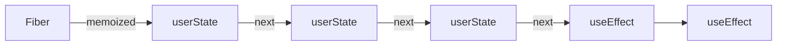
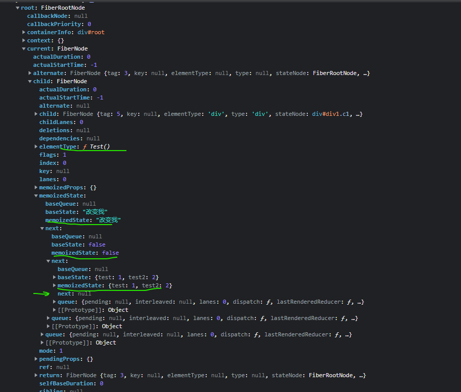

## hooks原理:闭包和链表
测试实例：例9-测试父子组件.html

state 链表不是hooks独有的，操作的setState也存在，正是由于这个链表存在，所以有一个经典React 面试题：

setState为什么默认是异步，什么时候是同步？

参考：[React/setState的异步和同步问题](./setState异步-同步)

## hooks中的闭包
前言：定义一个React组件，并且在其他模块中使用，这和闭包有关系吗？

当`Sub`在render中执行时，访问了`Test`中的变量对象，那么闭包就会产生。
参考：父子组件编译后.js
```js
React.createElement(Sub, { obj: obj })
```

### 例子-Hooks能够让函数组件拥有内部状态的基本原理
当useState在`Test()`组件中执行时，访问了state中的变量对象，那么闭包就会产生。

根据闭包的特性，state模块中的state变量，会持久存在。因此当`Test()`再次执行时，我们也能获取到上一次`Test()`执行结束时state的值。

### updateReducer
接下来updateReducer，逻辑比较复杂

参考：[组件-setState的初始化和更新-更新阶段-updateReducer](./组件-setState的初始化和更新)


## Hooks是以单向链表的数据结构存储在 Fiber memoizedState 属性身上
从源码注释可以看出hooks链表与fiber链表是极其相似的；也得知hooks 链表是保存在fiber节点的memoizedState属性的, 
```js
/*
Hooks are stored as a linked list on the fiber's memoizedState field.  
hooks 以链表的形式存储在fiber节点的memoizedState属性上
The current hook list is the list that belongs to the current fiber.
当前的hook链表就是当前正在遍历的fiber节点上的
The work-in-progress hook list is a new list that will be added to the work-in-progress fiber.
work-in-progress hook 就是即将被添加到正在遍历fiber节点的hooks新链表
*/
```

在下一次更新时，再次执行hook，就会去获取当前运行节点的hooks链表；
```js
const hook = updateWorkInProgressHook();
// updateWorkInProgressHook 就是一个纯链表的操作：指向下一个 hook节点
```
为什么hooks不能在循环或则判断语句中调用，只能在函数最外层使用，因为挂载或则更新时，这个队列需要是一致的，才能保证hooks的结果正确。



```js
<script type="text/babel">
  function Test() {
    const [data, setData] = React.useState('改变我')
    const [showDiv, setShowDiv] = React.useState(false)
    const [obj, setObj] = React.useState({ test: 1, test2: 2 })

    // 省略
  }
</script> 
```
定义了三个useState hooks,如图可见最后一个节点指向了`next:null`


```js
<script type="text/babel">
  function Test() {
    const [data, setData] = React.useState('改变我')
    const [showDiv, setShowDiv] = React.useState(false)
    const [obj, setObj] = React.useState({ test: 1, test2: 2 })

    React.useEffect(() => {
      console.log('=副作用-useEffect-->运行');
      return () => {
        console.log('useEffect销毁时触发的回调');
      };
    }, [])

    React.useLayoutEffect(() => {
      console.log('=副作用-useLayoutEffect-->运行');
    }, [])
    // 省略
  }
</script> 
```
定义了3个useState hooks,2个effect hooks,如图可见effect hooks的memoizedState
是`一个环形`,next又指向了另一个effect hook节点
<!--  -->

## hook结构
```js
function mountWorkInProgressHook() {
  var hook = {
    memoizedState: null, // 上次渲染时所用的 state
    baseState: null, // 已处理的 update 计算出的 state
    baseQueue: null, // 未处理的 update 队列（一般是上一轮渲染未完成的 update）
    queue: null, // 当前出发的 update 队列
    next: null // 指向下一个 hook，形成链表结构
  };

  if (workInProgressHook === null) {
    // This is the first hook in the list
    console.log('=useState=dom=调用workInProgressHook 初始化 1:', { hook, workInProgressHook })
    currentlyRenderingFiber$1.memoizedState = workInProgressHook = hook;
  } else {
    // Append to the end of the list
    workInProgressHook = workInProgressHook.next = hook;
    console.log('=useState=dom=调用workInProgressHook 2 添加到list 末尾:', { hook, workInProgressHook })
  }

  return workInProgressHook;
}
```

## 建立链表的逻辑在dispatchSetState-->enqueueUpdate$1
每个 useXxx 的 hooks 都有 mountXxx 和 updateXxx 两个阶段。链表只创建一次，在 mountXxx 当中，后面都是 update。

以 useState 为例，mount 时会进入 HooksDispatcherOnMountInDEV 的 useState方法，最终执行 mountState

[dispatchSetState-hooks源码](./dispatchSetState-hooks源码)
```js
function dispatchSetState(fiber, queue, action) {
  // 省略..
  // 创建一个 update 更新对象
  var update = {
    lane: lane,
    action: action,
    hasEagerState: false,
    eagerState: null,
    next: null
  };
  if (isRenderPhaseUpdate(fiber)) {
    console.log('=useState=app=dispatchSetState调用enqueueRenderPhaseUpdate渲染阶段更新:')
    enqueueRenderPhaseUpdate(queue, update);
  } else {
    enqueueUpdate$1(fiber, queue, update);
  }

  // 省略..
}

function enqueueUpdate$1(fiber, queue, update, lane) {
  if (isInterleavedUpdate(fiber)) {
    var interleaved = queue.interleaved;

    if (interleaved === null) {
      // This is the first update. Create a circular list.
      update.next = update; // At the end of the current render, this queue's interleaved updates will
      // be transferred to the pending queue.

      pushInterleavedQueue(queue);
    } else {
      update.next = interleaved.next;
      interleaved.next = update;
    }

    queue.interleaved = update;
  } else {

    console.log('=useState=app=enqueueUpdate$1将update对象添加到hook.queue.pending队列')
    var pending = queue.pending;

    if (pending === null) {
      // This is the first update. Create a circular list.
      console.log('=useState=app=首个update 2, 自己指向自己创建一个环状链表,创建一个环形链表')
      update.next = update;
    } else {
      update.next = pending.next;
      pending.next = update;
    }

    queue.pending = update;
  }
}
```

## 获取最新状态的相关代码逻辑存在于updateReducer中：
执行setData 只是形成了状态待执行任务链表，真正得到最终状态，其实是在下一次更新(获取状态)时，即：
```js
// 读取最新data
const [data, setData] = React.useState('改变我')
```

```js
function updateReducer(reducer, initialArg, init) {
  var hook = updateWorkInProgressHook();
  // 省略..
  if (baseQueue !== null) {
  // We have a queue to process.
  var first = baseQueue.next;
  var newState = current.baseState;
  var newBaseState = null;
  var newBaseQueueFirst = null;
  var newBaseQueueLast = null;
  var update = first;

  do {
    var updateLane = update.lane;

    if (!isSubsetOfLanes(renderLanes, updateLane)) {
      // Priority is insufficient. Skip this update. If this is the first
      // skipped update, the previous update/state is the new base
      // update/state.
      var clone = {
        lane: updateLane,
        action: update.action,
        hasEagerState: update.hasEagerState,
        eagerState: update.eagerState,
        next: null
      };

      if (newBaseQueueLast === null) {
        newBaseQueueFirst = newBaseQueueLast = clone;
        newBaseState = newState;
      } else {
        newBaseQueueLast = newBaseQueueLast.next = clone;
      } // Update the remaining priority in the queue.
      // TODO: Don't need to accumulate this. Instead, we can remove
      // renderLanes from the original lanes.


      currentlyRenderingFiber$1.lanes = mergeLanes(currentlyRenderingFiber$1.lanes, updateLane);
      markSkippedUpdateLanes(updateLane);
    } else {
      // This update does have sufficient priority.
      if (newBaseQueueLast !== null) {
        var _clone = {
          // This update is going to be committed so we never want uncommit
          // it. Using NoLane works because 0 is a subset of all bitmasks, so
          // this will never be skipped by the check above.
          lane: NoLane,
          action: update.action,
          hasEagerState: update.hasEagerState,
          eagerState: update.eagerState,
          next: null
        };
        newBaseQueueLast = newBaseQueueLast.next = _clone;
      } // Process this update.


      if (update.hasEagerState) {
        // If this update is a state update (not a reducer) and was processed eagerly,
        // we can use the eagerly computed state
        // 状态已经计算过，那就直接用
        newState = update.eagerState;
      } else {
        var action = update.action;
        newState = reducer(newState, action);
      }
    }

    update = update.next;
    // 终止条件是指针为空 或 环已遍历完
  } while (update !== null && update !== first);

  if (newBaseQueueLast === null) {
    newBaseState = newState;
  } else {
    newBaseQueueLast.next = newBaseQueueFirst;
  } // Mark that the fiber performed work, but only if the new state is
  // different from the current state.


  if (!objectIs(newState, hook.memoizedState)) {
    markWorkInProgressReceivedUpdate();
  }

  hook.memoizedState = newState;
  hook.baseState = newBaseState;
  hook.baseQueue = newBaseQueueLast;
  queue.lastRenderedState = newState;
}
  // 省略..
}
```

### 辅-单向链表js实现
```js
function buildQueue(queue,action){
    const update = {action,next:null}
    const pending = queue.pending
 
    if(!pending){
        queue.pending = update
    }else{
        let current = queue.pending
        // 找到末尾的元素
        while(current.next){
            current = current.next
        }
        // 将update挂载到链表的末尾
        current.next = update
    }
}
 
// execute
let queue = {pending:null}
buildQueue(queue,'hooks1')
buildQueue(queue,'hooks2')
 
// output: queue.pending = {action:'hooks1',next:{action:'hooks2',next:null}}
```

## useEffect 结构
不同的 hooks 方法，memoizedState 存储的内容不同：
* useState: state
* useEffect: effect 对象
* useMemo/useCallback: callback, deps
* useRef: { current: xxx }

```js
useEffect(() => {
  console.log('=副作用-useEffect-->运行');
  return () => {
    console.log('useEffect销毁时触发的回调');
  };
}, []);

|
|
V

{
  memoizedState: {
    create: function () {
      console.log('=副作用-useEffect-->运行');
    },
    destroy: function () {
      console.log('useEffect销毁时触发的回调');
    },
    deps: [],
    // ...
  },
  baseState: null,
  baseQueue: null,
  queue: null,
  next: null,
}
```

```js
function pushEffect(tag, create, destroy, deps) {
  var effect = {
    tag: tag, // 标记是否有 effect 需要执行 
    create: create, // 回调函数
    destroy: destroy, // 销毁时触发的回调
    deps: deps, // 依赖的数组
    next: null  // 下一个要执行的 Effect
  };
  var componentUpdateQueue = currentlyRenderingFiber$1.updateQueue;

  if (componentUpdateQueue === null) {
    componentUpdateQueue = createFunctionComponentUpdateQueue();
    currentlyRenderingFiber$1.updateQueue = componentUpdateQueue;
    console.log('%c=副作用:pushEffect-effect.next = effect形成环形链表1', 'color:chartreuse')
    componentUpdateQueue.lastEffect = effect.next = effect;
  } else {
    var lastEffect = componentUpdateQueue.lastEffect;

    if (lastEffect === null) {
      console.log('%c=副作用:pushEffect-effect.next = effect形成环形链表2', 'color:chartreuse')
      componentUpdateQueue.lastEffect = effect.next = effect;
    } else {
      console.log('%c=副作用:pushEffect-effect.next = effect形成环形链表3', 'color:chartreuse')
      var firstEffect = lastEffect.next;
      lastEffect.next = effect;
      effect.next = firstEffect;
      componentUpdateQueue.lastEffect = effect;
    }
  }
  console.log('=副作用:pushEffect-返回值', { effect })
  return effect;
}
```
