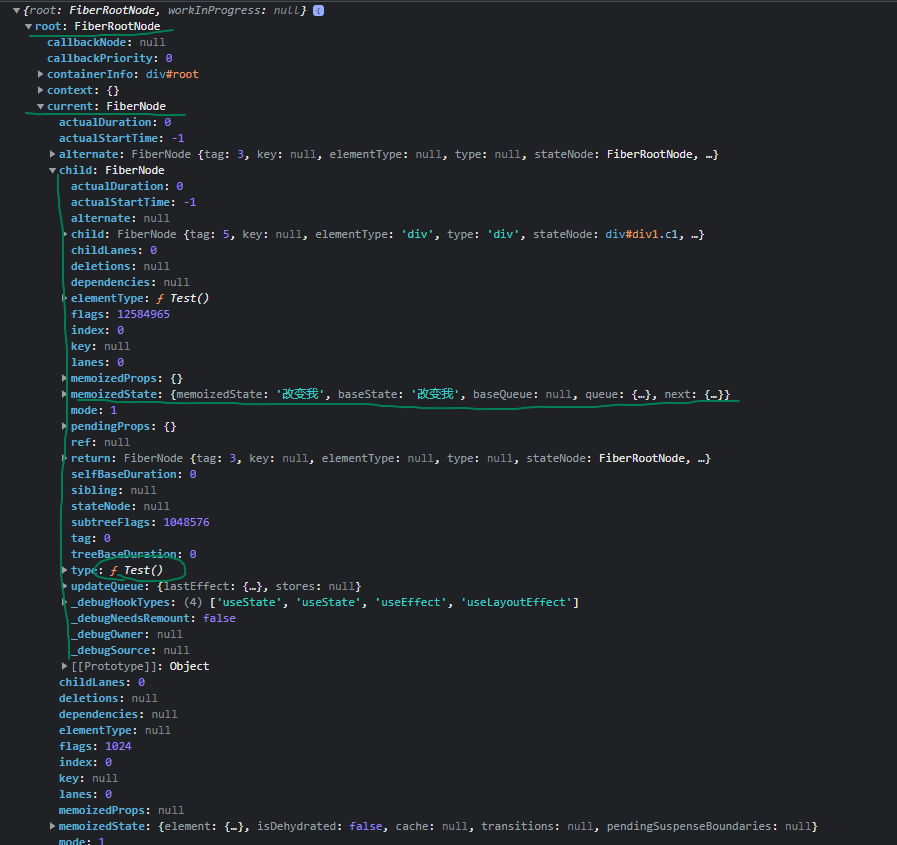
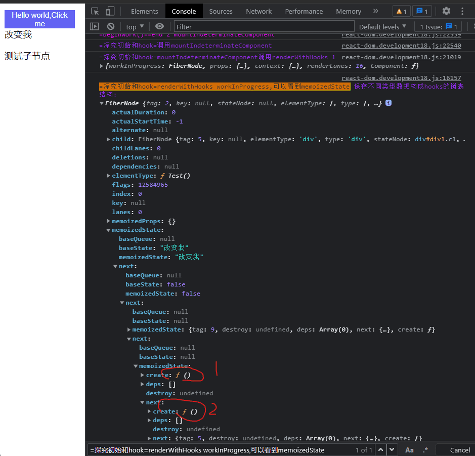
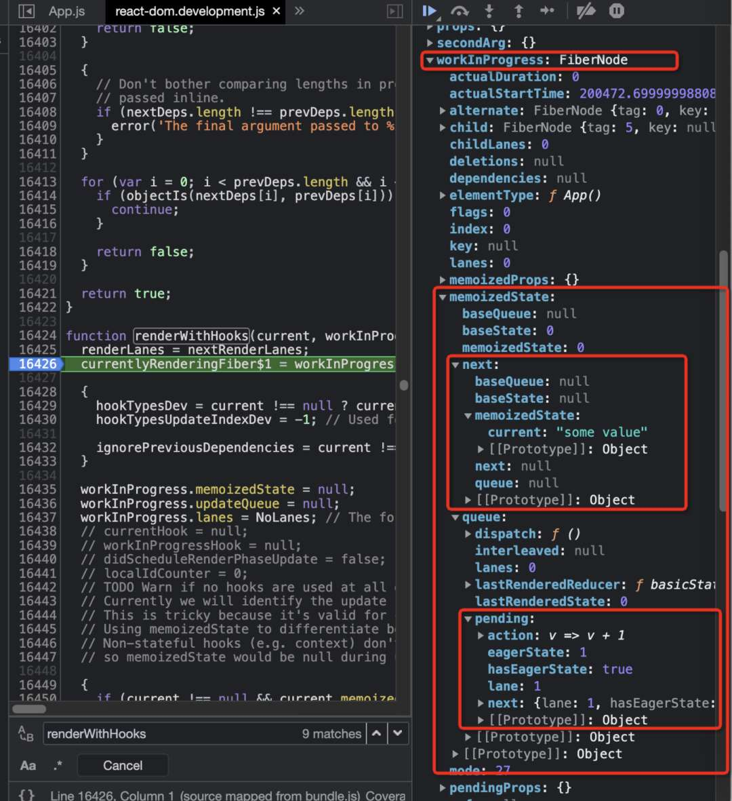
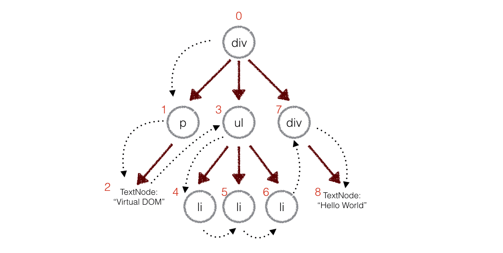

## 查看fiber树
初始化阶段这个函数看log
```js
// 重点函数performConcurrentWorkOnRoot,这个函数在render结束会开启commit阶段
function performConcurrentWorkOnRoot(root, didTimeout) {
    var exitStatus = shouldTimeSlice ? renderRootConcurrent(root, lanes) : renderRootSync(root, lanes);

    if (exitStatus === RootDidNotComplete) {
        markRootSuspended$1(root, lanes);
    } else {
        root.finishedWork = finishedWork;
        root.finishedLanes = lanes;

        console.log(`%c=commit阶段=前=render阶段结束=performConcurrentWorkOnRoot调用finishConcurrentRender-->commitRoot`, 'color:cyan', { root })
        finishConcurrentRender(root, exitStatus, lanes);
    }
}
```

更新阶段这个函数看log
```js
function commitRoot(root, recoverableErrors, transitions) {
// TODO: This no longer makes any sense. We already wrap the mutation and
// layout phases. Should be able to remove.
var previousUpdateLanePriority = getCurrentUpdatePriority();
var prevTransition = ReactCurrentBatchConfig$3.transition;
console.log(`%c=commit阶段=0=commit阶段开始`, 'color:cyan', { root })
try {
    ReactCurrentBatchConfig$3.transition = null;
    setCurrentUpdatePriority(DiscreteEventPriority);
    commitRootImpl(root, recoverableErrors, transitions, previousUpdateLanePriority);
} finally {
    ReactCurrentBatchConfig$3.transition = prevTransition;
    setCurrentUpdatePriority(previousUpdateLanePriority);
}

return null;
}
```



## Fiber 数据结构:
React Fiber 树由多个 Fiber 节点组成，每个节点代表了一个组件。Fiber 节点包含了组件的相关信息，例如组件类型、props、state 等，同时还包括了与调度相关的信息，例如优先级、任务状态、父子关系等。

主要分下面几块：
* 节点基础信息的描述
* 描述与其它 fiber 节点连接的属性
* 状态更新相关的信息:hook
```
hook 关联比较大的主要是 memoizedState 和 updateQueue 属性。函数组件会将内部用到的所有的 hook 通过单向链表的形式，保存在组件对应 fiber 节点的 memoizedState 属性上。

useEffect：memoizedState保存包含useEffect回调函数、依赖项等的链表数据结构effect。effect链表同时会保存在fiber.updateQueue中。

updateQueue 是 useEffect 产生的 effect 连接成的环状单向链表。
```
* 优先级调度相关

```js
function FiberNode(
  tag: WorkTag,
  pendingProps: mixed,
  key: null | string,
  mode: TypeOfMode,
) {
  // 作为静态数据结构的属性
  this.tag = tag;      // Fiber对应组件的类型 Function/Class/Host...
  this.key = key;      // key属性
  this.elementType = null; // 大部分情况同type，某些情况不同，比如FunctionComponent使用React.memo包裹
  this.type = null;     // 对于 FunctionComponent，指函数本身，对于ClassComponent，指class，对于HostComponent，指DOM节点tagName
  this.stateNode = null;  // Fiber对应的真实DOM节点

  // 用于连接其他Fiber节点形成Fiber树
  this.return = null;  // 指向父级Fiber节点
  this.child = null;  // 指向子Fiber节点
  this.sibling = null; // 指向右边第一个兄弟Fiber节点
  this.index = 0;

  this.ref = null;

  // 作为动态的工作单元的属性 —— 保存本次更新造成的状态改变相关信息
  this.pendingProps = pendingProps;
  this.memoizedProps = null;
  this.updateQueue = null;  // class 组件 Fiber 节点上的多个 Update 会组成链表并被包含在 fiber.updateQueue 中。 函数组件则是存储 useEffect 的 effect 的环状链表。
  this.memoizedState = null; // hook 组成单向链表挂载的位置
  this.dependencies = null;

  this.mode = mode;

  // Effects
  this.flags = NoFlags;
  this.subtreeFlags = NoFlags;
  this.deletions = null;

  // 调度优先级相关
  this.lanes = NoLanes;
  this.childLanes = NoLanes;

  // 指向该fiber在另一次更新时对应的fiber
  this.alternate = null;
}
```

hook 的 memoizedState 存的是当前 hook 自己的值。
```js
const hook: Hook = {
  memoizedState: null, // 当前需要保存的值

  baseState: null,
  baseQueue: null, // 由于之前某些高优先级任务导致更新中断，baseQueue 记录的就是尚未处理的最后一个 update
  queue: null, // 内部存储调用 setValue 产生的 update 更新信息，是个环状单向链表

  next: null,  // 下一个hook
};
```

### 例子1
```js
function Test() {
  console.log('test-render')
  const [data, setData] = React.useState('改变我')
  const [showDiv, setShowDiv] = React.useState(false)

  const onClickText = () => {
    console.log('=useState=onClick');
    setData('努力哦')
    setShowDiv(!showDiv)
  }

  const onClickText2 = () => {
    console.log('=useState=onClick:', data);
  }

  React.useEffect(() => {
    console.log('=副作用-useEffect-->运行');
  }, [])

  React.useLayoutEffect(() => {
    console.log('=副作用-useLayoutEffect-->运行');
  }, [])

  return (
    <div id='div1' className='c1'>
      <button onClick={onClickText} className="btn">Hello world,Click me</button>
      <span>{data}</span>
      {showDiv && <div>被你发现了</div>}
      <div id='div2' className='c2'>
        <p>测试子节点</p>
      </div>
    </div>
  )
}
```

圈起来1和2表示以下函数
```js
React.useLayoutEffect(() => {
  console.log('=副作用-useLayoutEffect-->运行');
}, [])

React.useEffect(() => {
  console.log('=副作用-useEffect-->运行');
}, [])
```

### 示例2
```js
function App() {
  const [value, setValue] = useState(0);
  const ref = useRef();
  ref.current = "some value";

  return (
    <div className="App">
      <h1>目前值：{value}</h1>
      <div>
        <button onClick={() => { 
          setValue(v => v + 1)
        }}>增加</button>
      </div>
    </div>
  );
}
```
可以从截图中看到，代码中使用的 useState 和 useRef 两个 hook 通过 next 连接成链表。另外 useState 的 hook 对象的 queue 中存储了调用 setValue 时用到的函数。




```js
function App() {
  const [value, setValue] = useState(0);
  const ref = useRef();
  ref.current = "some value";

  return (
    <div className="App">
      <h1>目前值：{value}</h1>
      <div>
        <button onClick={() => { 
          setValue(v => v + 1)
        }}>增加</button>
      </div>
    </div>
  );
}
```


## 手动操作DOM带来的性能缺陷
在使用原生的js api或者jquery等一些方法直接去操作dom的时候，可能会引起页面的reflow-回流，而页面的回流耗时和消耗性能。

复杂一点的页面 ，对 DOM 的操作是非常综合的，CRUD都有。频繁的去操作dom，会引起页面的卡顿，影响用户的体验。虚拟DOM就是为了解决频繁操作DOM的性能问题创造出来的。


React 帮助在复杂的界面环境下，如何尽量降低 DOM Reflow 的成本。

而一旦出现了频繁变化，DOM Reflow 的开销就变得非常大。React 的 Diff 就是解决这个最痛的问题的。

## 虚拟dom作用
### `提升页面的更新渲染的性能,这也是虚拟dom重要作用,注意首屏渲染的性能并不能靠虚拟dom提升`

`关于提升性能:如果是首次渲染，VirtualDom不具有任何优势，甚至它要进行更多的计算，消耗更多的内存。`

直接操作DOM是非常耗费性能的，这一点毋庸置疑。React使用VirtualDom也是无法避免操作DOM的。

VirtualDom的优势在于React的Diff算法和批处理策略，React在页面更新之前，提前计算好了如何进行更新和渲染DOM。
实际上，这个计算过程我们在直接操作DOM时，也是可以自己判断和实现的，但是一定会耗费非常多的精力和时间，而且往往我们自己做的是不如React好的。所以，在这个过程中React帮助我们"提升了性能"。

所以，我更倾向于说，VirtualDom帮助我们提高了开发效率，在重复渲染时它帮助我们计算如何更高效的更新，而不是它比DOM操作更快。

假如使用原生api去操作一个会导致回流的DOM操作10次，那么浏览器会每次都会重新走一次上面的全流程，包括一些没变化的位置计算。

浏览器没有如此智能，收到第一个更新DOM请求后，并不知道后续还有9次更新操作，因此会马上执行流程，最终执行10次流程。显然例如计算DOM节点的坐标值等都是白白浪费性能，可能这次计算完，紧接着下一个DOM更新请求，节点值就会改变，前面的计算就是浪费。

`理想的状态是一次性构建完DOM树，再执行后续操作。`
而虚拟DOM不会立即去操作DOM，而是将这10次更新的diff内容保存到本地的一个js对象中，最终将这个js对象一次性attach到DOM树上，通知浏览器去执行绘制工作，这样可以避免大量的无谓的计算量。

### 跨浏览器兼容
React基于VirtualDom自己实现了一套自己的事件机制，自己模拟了事件冒泡和捕获的过程，采用了事件代理，批量更新等方法，抹平了各个浏览器的事件兼容性问题。

* 3.跨平台兼容:VirtualDom为React带来了跨平台渲染的能力
只需要告诉React你想让视图处于什么状态，React则通过VirtualDom确保DOM与该状态相匹配。你不必自己去完成属性操作、事件处理、DOM更新，React会替你完成这一切。


## 虚拟dom存在内存，可以在不同js环境生成
React 的虚拟DOM以对象树的形式保存在内存中，并且是可以在浏览器和 Node 中生成，这是前后端同构提供了先决条件，也是react服务端渲染的前提;

虚拟 Dom 在前后端都是以对象树的形式存在的，但在展露原型的方式服务端和客户端是不一样的:


### react中的虚拟dom:Fiber树
* 1.react16之前 在进行组件渲染时，从setState开始到渲染完成整个过程是同步的。也会造成上面为什么慢/阻塞的问题。

* 2.所有的任务都是按照先后顺序，没有区分优先级，这样就会导致优先级比较高的任务无法被优先执行。

因此，为了解决以上的痛点问题，React希望能够彻底解决主线程长时间占用问题;

### Fiber架构的核心:浏览器进行了时间分片处理
Fiber 是 React 16 实现的一套新的更新机制，让 React 的更新过程变得可控,把渲染/更新过程拆分为一个个小块的任务，通过合理的调度机制来调控时间，指定任务执行的时机，从而降低页面卡顿的概率，提升页面交互体验。

通过Fiber架构， 实现了可中断与恢复，适时地让出CPU执行权，中间可以返回至主进程控制执行其他任务,恢复后也可以复用之前的中间状态，并给不同的任务赋予不同的优先级，其中每个任务更新单元为React Element 对应的 Fiber 节点。

调和器允许渲染过程分段完成，而不必一次性完成，在渲染期间可返回到主线程控制执行其他任务。这是通过计算部分组件树的变更，并暂停渲染更新，询问主线程是否有更高需求的绘制或者更新任务需要执行，这些高需求的任务完成后再重新渲染。这一切的实现是在代码层引入了一个新的数据结构：Fiber对象，每一个组件实例对应有一个fiber实例，此fiber实例负责管理组件实例的更新，渲染任务及与其他fiber实例的通信，这个先进的调和器叫做调和器（Fiber Reconciler），它提供的新功能主要有：
* 1.把可中断的任务拆分成小任务；
* 2.可重用各分阶段任务，对正在做的工作调整优先次序；
* 3.可以在父子组件任务间前进后退切换任务，以支持React执行过程中的布局刷新；

## Fiber树是一种单向链表数据结构
React使用Fiber Tree来表示组件的层次结构，并且在进行DOM更新时使用它来实现高效的渲染。每个节点都是一个Fiber对象,代表了一个组件或DOM元素，其中包含有关该节点的信息，例如组件类型、props、state、子节点,优先级、updateQueue等等，并且包含了在渲染过程中所需的所有信息。

同时fiber还是一个工作单元, 对于工作单元来说，每个 Fiber 节点保存了本次更新中该组件改变的状态、要执行的工作。

每个Fiber节点都包含了一个指向其第一个子节点的引用，以及一个指向其下一个兄弟节点的引用。通过这些引用，Fiber树形成了一条从根节点到叶节点的单向链表。

因为Fiber树是单向链表，所以它的节点只能访问其后继节点，而不能直接访问其前驱节点。

这意味着在执行某些操作时，需要从根节点开始遍历整个Fiber树，以便访问到之前的节点。

这也是Fiber树能够支持异步渲染和优先级调度的原因之一，因为单向链表比双向链表更适合用于分解和重新组合渲染任务。

这个链接的结构是怎么构成的呢?Fiber树的每个节点通过child、sibling、return来相互连接，最后构成一个虚拟DOM树:
```js
// 单链表树结构
{
   return: Fiber | null, // 指向父节点
   child: Fiber | null,// 指向自己的第一个子节点
   sibling: Fiber | null,// 指向自己的兄弟结构，兄弟节点的return指向同一个父节点
}
```
树是图的特例,即当一棵树除叶子节点外的所有节点有且仅有一个直接子节点时，将构成链表结构。

相比于传统的树形数据结构，链表可以更灵活地进行节点的添加、删除和移动，从而支持React的异步渲染。

特点是任何一个位置的 Fiber 节点，都可以非常容易知道它的父 Fiber, 第一个子元素的 Fiber,和它的兄弟节点 Fiber。却不容易知道它前一个 Fiber 节点是谁，这就是 React 中单向链表 Fiber 节点的特点。也正是因为这些即便在协调的过程被中断了，再恢复协调的时候，依然知道当前的 父节点和孩子节点等信息。

```html
<App>
  <Card>
	<div>title</div>
	<div>content</div>
  </Card>
  <p>hello</p>
  <p>world</p>
</App>
```


参考：[基于单向链表的 fiber reconciler](https://set.sh/post/210216-why-react-reconciler-use-linked-list-as-basic-data-structure)

## Fiber tree实现原理
Fiber Tree是链表结构，递归链表，然后配合 requestIdleCallback API, 实现任务拆分、中断与恢复。

1. 实现的方式是requestIdleCallback这一 API，但 React 团队 polyfill 了这个 API，使其对比原生的浏览器兼容性更好且拓展了特性。
```
window.requestIdleCallback()方法将在浏览器的空闲时段内调用的函数排队。这使开发者能够在主事件循环上执行后台和低优先级工作，而不会影响延迟关键事件，
如动画和输入响应。函数一般会按先进先调用的顺序执行，然而，如果回调函数指定了执行超时时间 timeout，则有可能为了在超时前执行函数而打乱执行顺序。
```

requestIdleCallback回调的执行的前提条件是当前浏览器处于空闲状态。

即requestIdleCallback的作用是在浏览器一帧的剩余空闲时间内执行优先度相对较低的任务。首先 React 中任务切割为多个步骤，分批完成。在完成一部分任务之后，将控制权交回给浏览器，让浏览器有时间再进行页面的渲染。等浏览器忙完之后有剩余时间，再继续之前 React 未完成的任务，是一种合作式调度。

简而言之，由浏览器给我们分配执行时间片，我们要按照约定在这个时间内执行完毕，并将控制权还给浏览器。

2. 基于Fiber节点实现，被称为 Fiber Reconciler。
作为静态的数据结构来说，每个 Fiber 节点对应一个 React element，保存了该组件的类型（函数组件/类组件/原生组件等等）、对应的 DOM 节点等信息。

## Fiber 架构可以分为三层：可中断、可恢复、优先级
### Scheduler调度器
调度任务的优先级，高优任务优先进入 Reconciler
```
这个需要上面提到的requestIdleCallback，React 团队实现了功能更完备的 requestIdleCallback polyfill，这就是 Scheduler。
除了在空闲时触发回调的功能外，Scheduler 还提供了多种调度优先级供任务设置。
```
### Reconciler协调器
更新 fiber 的过程,在 React 15 中是递归处理虚拟 DOM 的，React 16 则是变成了可以中断的循环过程，每次循环都会调用shouldYield判断当前是否有剩余时间。
```
fiber 根据优先级暂停、继续、排列优先级：Fiber节点上保存了优先级，能通过不同节点优先级的对比，达到任务的暂停、继续、排列优先级等能力，也为上层实现批量更新、Suspense提供了基础
```

```js
function workLoopConcurrent() {
  // Perform work until Scheduler asks us to yield
  while (workInProgress !== null && !shouldYield()) {
    // workInProgress表示当前工作进度的树。
    workInProgress = performUnitOfWork(workInProgress)
  }
}
```
React 16 是如何解决中断更新时 DOM 渲染不完全的问题呢？

在 React 16 中，Reconciler与Renderer不再是交替工作。当Scheduler将任务交给Reconciler后，Reconciler会为变化的虚拟 DOM 打上的标记
```js
export const Placement = /*             */ 0b0000000000010
export const Update = /*                */ 0b0000000000100
export const PlacementAndUpdate = /*    */ 0b0000000000110
export const Deletion = /*              */ 0b0000000001000
/*
Placement表示插入操作
PlacementAndUpdate表示替换操作
Update表示更新操作
Deletion表示删除操作

整个Scheduler与Reconciler的工作都在内存中进行，所以即使反复中断，用户也不会看见更新不完全的 DOM。只有当所有组件都完成Reconciler的工作，
才会统一交给Renderer。
* */
```

### Renderer渲染器:负责将变化的组件渲染到页面上
Renderer根据Reconciler为虚拟 DOM 打的标记，同步执行对应的 DOM 操作。


## 第1步:要先了解 Fiber 树的生成原理才更好去理解 Fiber 树 diff 的过程
JSX 的编译之后,创建一个叫 fiberRoot 的 Fiber 节点，然后开始从 fiberRoot 这个根 Fiber 开始进行协调，生成一棵 Fiber 树，这个棵树被称为：`workInProgress Fiber 树,正在工作的 Fiber 树`

Fiber 链表生成的代码片段。这个协调子节点的函数接收两个参数，returnFiber 是父 Fiber，children 是这个节点的子元素的虚拟 DOM数据。
```js
// 这个协调子节点的函数接收两个参数，returnFiber 是父 Fiber，children 是这个节点的子元素的虚拟 DOM数据。
export function reconcileChildren(returnFiber, children) {
    // 如果是字符串或者数字则不创建 Fiber
    if(isStringOrNumber(children)) {
        return
    }
    const newChildren = isArray(children) ? children : [children]
    // 上一轮的 fiber 节点
    let previousNewFiber = null;
    // 初次渲染（false）还是更新（true）
    let shouldTrackSideEffects = !!returnFiber.alternate
    // 老 Fiber 节点
    let oldFiber = returnFiber.alternate && returnFiber.alternate.child
    let nextOldFiber = null
    // 上一次协调返回的位置
    let lastPlacedIndex = 0;
    // 记录每个 fiber 节点的位置
    let newIdx = 0;
    // 如果不存在老 Fiber 则是初始化的过程，进行 Fiber 链表的创建
    if(!oldFiber) {
        for (; newIdx < newChildren.length; newIdx++) {
            // 获取节点元素内容
            const newChild = newChildren[newIdx]
            // 如果节点为 null 则不需要创建 fiber 节点
            if(newChild === null) {
                continue
            }
            // 创建新 fiber 的时候记录了关键的父 fiber 等重要信息
            const newFiber = createFiber(newChild, returnFiber)
            // 记录当前每一个 fiber 的位置
            lastPlacedIndex = placeChild(
                newFiber,
                lastPlacedIndex,
                newIdx,
                shouldTrackSideEffects // 初次渲染（false）还是更新（true）
            )
		    // 当上一轮的 fiber 节点为 null 的时候，这一轮的 fiber 就是头节点
            if(previousNewFiber === null) {
                // 父 fiber 的 child 就是第一个节点
                returnFiber.child = newFiber
            } else {
                // 如果不是第一个节点，那么就是兄弟节点
                // 上一轮 fiber 的兄弟节点是这一轮的 fiber 节点
                previousNewFiber.sibling = newFiber;
            }
		   // 记录上一轮的 fiber，既是这一轮的 fiber 便是下一轮的上一轮 fiber
            previousNewFiber = newFiber
        }
        return
    }
}
```

构建完的 workInProgress Fiber树 会在 commit阶段 渲染到页面。

## 第2步:在组件状态数据发生变更的时候，会根据最新的状态数据先会生成新的虚拟DOM，再去构建一棵新的workInProgress Fiber树，重新协调构建新的Fiber树的过程也就是Diff发生的地方

用新的树和旧的树进行比较，记录两棵树的差异。

`算法：深度优先遍历`
有子节点，就遍历子节点，没有子节点，就找兄弟节点，没有兄弟节点，就找叔叔节点，叔叔节点也没有的话，就继续往上找，它爷爷的兄弟，如果一直没找到，就代表所有的更新任务都更新完毕了

重点是在更新自己的同时需要去协调子节点,这个Diff 发生的地方

进入协调的时候它自己就是父 Fiber，它的子节点在协调之前，是刚刚通过更新的状态数据生成的最新的虚拟DOM数据，是个数组结构的元素数据。

那么要进行更新，就肯定是以为最新的节点数据为准了，又因为最新的节点数据是一个数组，所以可以进行循环对比每一个节点

第一轮，常见情况的比对
那么第一个节点的老 Fiber 怎么拿到呢？可以通过 父 Fiber 的 child 属性拿到，这样第一个节点的老 Fiber 就拿到了，那么第二节点的老 Fiber，很明显可以通过第一个节点的老 Fiber 节点的 sibling 属性拿到，后面的以此类推。
怎么比对呢？

在循环的新节点虚拟DOM数据的时候，拿到新节点虚拟DOM信息，然后就去和老 Fiber 节点进行比对，如果两个节点相同则创建一个新的 Fiber 节点并复用一些老 Fiber 节点的信息，比如真实 DOM，并给这个新的 Fiber 节点打上一个 Update 的标记，代表这个节点需要更新即可。
接着去更新协调位置信息。


接着去更新协调位置信息。

在循环的最后进行 Fiber 链表的处理：
如果是头节点，则把新 Fiber 设置为父 Fiber 的 child 属性的值；如果不是头节点，则把新 Fiber 设置为上一轮循环的创建的 Fiber 节点的 sibing 属性的值；更新上一轮 Fiber 变量的值，就是把这一轮的 Fiber 设置成下一轮的 Fiber;更新比对的老 Fiber 的值。如果新节点都能找到能复用的节点，则判断是否还存在老节点，有则删除。

React Diff 算法分以下几个步骤：

1. 第一轮，从左向右新老节点进行比对查找能复用的旧节点，如果有新老节点比对不成功的，则停止这一轮的比对，并记录了停止的位置。
2. 如果第一轮比对，能把所有的新节点都比对完毕，则删除旧节点还没进行比对的节点。
3. 如果第一轮的比对，没能将所有的新节点都比对完毕，则继续从第一轮比对停止的位置继续开始循环新节点，拿每一个新节点去老节点里面进行查找，有匹配成功的则复用，没匹配成功的则在协调位置的时候打上 Placement 的标记。
4. 在所有新节点比对完毕之后，检查还有没有没进行复用的旧节点，如果有，则全部删除。

## 3. 把步骤2所记录的差异应用到步骤1所构建的真实DOM树上，更新视图。

Virtual DOM 本质上, DOM 这么慢，我们就在它们 JS 和 DOM 之间加个缓存。
CPU（JS）只操作内存（Virtual DOM），最后的时候再把变更写入硬盘（DOM）。

## 比较两棵虚拟 DOM 树的差异
两个树的完全的 diff 算法是一个时间复杂度为 O(n^3) 的问题。但是在前端当中，你很少会跨越层级地移动 DOM 元素。

所以 Virtual DOM 只会对同一个层级的元素进行对比：
下面的 div 只会和同一层级的 div 对比，第二层级的只会跟第二层级对比。这样算法复杂度就可以达到O (n)。


### 深度优先遍历，记录差异
在实际的代码中，会对新旧两棵树进行一个深度优先的遍历，这样每个节点都会有一个唯一的标记：

在深度优先遍历的时候，每遍历到一个节点就把该节点和新的的树进行对比。如果有差异的话就记录到一个对象里面。

在深度优先遍历的时候，每遍历到一个节点就把该节点和新的的树进行对比。如果有差异的话就记录到一个对象里面。




### React 不能通过双端对比进行 Diff 算法优化
是因为目前 Fiber 上没有设置反向链表,（就目前这个单向链表的数据结构，如果采用）双端对比查找算法比较难控制它反向查找的，但它确实是一种成功的算法。


## 算法实现
### 步骤一:用js对象模拟DOM树
```js
<div id="container">
    <p>Real DOM</p>
    <ul>
        <li class="item">Item 1</li>
        <li class="item">Item 2</li>
        <li class="item">Item 3</li>
    </ul>
</div>
	|
	|js对象来模拟上述的DOM Tree
	|
	v
var el = require('./element');

var ul = el('ul',{id:'list'},[
    el('li', {class: 'item'}, ['Item 1']),
    el('li', {class: 'item'}, ['Item 2']),
    el('li', {class: 'item'}, ['Item 3'])
])

// element.js
// patch.js
// diff.js
// util.js
```

### element.js
render方法会根据tagName构建一个真正的DOM节点，然后设置节点的属性，最后递归构建自己的子节点。生成的ulRoot是真正的DOM节点，把它塞入文档中，这样body里面就有了真正的`<ul>`的DOM结构
```js
let ulRoot = ul.render();
document.body.appendChild(ulRoot)
|
|
V
<ul id='list'>
  <li class='item'>Item 1</li>
  <li class='item'>Item 2</li>
  <li class='item'>Item 3</li>
</ul>
```
