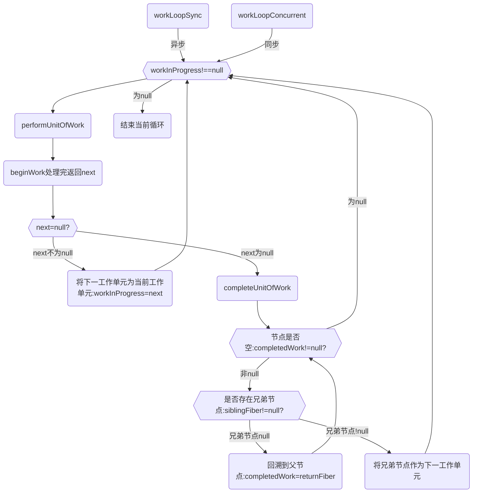

## workInProgress Fiber(内存中构建的树)和current Fiber-->双缓存
真实dom对应在内存中的Fiber节点形成Fiber树:current Fiber

workInProgress Fiber和current Fiber这两颗树的节点通过alternate相连.

performUnitOfWork 作用创建下一个 Fiber 节点，并赋值给 workInProgress，同时把 workInProgress 与已创建的 Fiber 节点连接起来构成 Fiber 树。

### 性能优化之1:Fiber双缓存
1. Fiber双缓存可以在构建好wip Fiber树之后切换成current Fiber，内存中直接一次性切换，提高了性能
```
React中，渲染机制就是React会调用render()函数构建一棵Dom树， 当我们需要对DOM进行事件监听时，首先对VirtualDom进行事件监听，VirtualDom会代理原生的DOM事件从而做出响应。

React中workingProgress Fiber树存在的意义是什么?
在React中最多会同时存在两棵Fiber树，当前显示在页面是current Fiber树，在内存中构建的Fiber树称为workInProgress Fiber树，workingProgress Fiber这棵树是在内存中构建的，构建完成才统一替换，这样不会产生不完全的真实dom。一旦更新完成，react会直接将current树替换成workingProgress Fiber树，以便快速完成DOM的更新。也是react提升性能的一部分

因为 workInProgress Fiber 在更新的过程中，是在内存中构建的，所有速度是非常快的，得到最终更新后的 Fiber，直接替换 Current Fiber。

current Fiber 树有一个 alternate 属性指向 workInProgress Fiber 树，workInProgress Fiber 树内也 有一个alternate 属性指向current Fiber 树

在state/props发生改变的时候，render()函数会被再次调用渲染出另外一棵树，重新渲染所有的节点，构造出新的虚拟Dom tree跟原来的Dom tree用Diff算法进行比较，找到需要更新的地方批量改动，再渲染到真实的DOM上，由于这样做就减少了对Dom的频繁操作，从而提升的性能。 
```

### 性能优化之2:Fiber的存在使异步可中断的更新成为了可能
1. Fiber的存在使异步可中断的更新成为了可能，作为工作单元，可以在时间片内执行工作，没时间了交还执行权给浏览器，下次时间片继续执行之前暂停之后返回的Fiber

从而使得浏览器处理时候可以将控制权交出去，避免了js线程过多占用而阻塞渲染线程，实现了更细粒度的调度，即为：协程和线程的调度

- Fiber可以在reconcile的时候进行相应的diff更新，让最后的更新应用在真实节点上

### workInProgress fiber tree：内存中构建的树。
更新过程中构建的 new fiber tree

### current fiber tree：正在视图层渲染的树。
old fiber tree，对应当前屏幕显示的内容，通过根节点 fiberRootNode 的 current 指针可以访问。

### 双缓存，以current tree为主，workInProgress tree为辅
双缓存机制是React管理更新工作的一种手段，也是提升用户体验的重要机制。

当React开始更新工作之后，会有两个fiber树，一个current树，是当前显示在页面上内容对应的fiber树。另一个是workInProgress树，它是依据current树深度优先遍历构建出来的新的fiber树，所有的更新最终都会体现在workInProgress树上。

当更新未完成的时候，页面上始终展示current树对应的内容，当更新结束时（commit阶段的最后），页面内容对应的fiber树会由current树切换到workInProgress树，此时workInProgress树即成为新的current树。

最终commit阶段完成时，两棵树会进行切换。
在未更新完成时依旧展示旧内容，保持交互，当更新完成立即切换到新内容，这样可以做到新内容和旧内容无缝切换。

渲染流程中，先复用current树（rootFiber）的alternate 作为 workInProgress。
构建workInProgress Fiber发生在createWorkInProgress中，它能创建或者复用Fiber
```js
  function createWorkInProgress(current, pendingProps) {
    var workInProgress = current.alternate;
    // 区分是在mount时还是在update时
    if (workInProgress === null) {
      // We use a double buffering pooling technique because we know that we'll
      // only ever need at most two versions of a tree. We pool the "other" unused
      // node that we're free to reuse. This is lazily created to avoid allocating
      // extra objects for things that are never updated. It also allow us to
      // reclaim the extra memory if needed.
      console.log('==createWorkInProgress-->,没有就创建一个')
      workInProgress = createFiber(current.tag, pendingProps, current.key, current.mode);
      workInProgress.elementType = current.elementType;
      workInProgress.type = current.type;
      workInProgress.stateNode = current.stateNode;

      {
        // DEV-only fields
        workInProgress._debugSource = current._debugSource;
        workInProgress._debugOwner = current._debugOwner;
        workInProgress._debugHookTypes = current._debugHookTypes;
      }
      console.log('==createWorkInProgress-->,workInProgress.alternate指定为current')
      workInProgress.alternate = current;
      current.alternate = workInProgress;
    } else {
      // 复用属性
      workInProgress.pendingProps = pendingProps; // Needed because Blocks store data on type.

      workInProgress.type = current.type; // We already have an alternate.
      // Reset the effect tag.

      workInProgress.flags = NoFlags; // The effects are no longer valid.

      workInProgress.subtreeFlags = NoFlags;
      workInProgress.deletions = null;

      {
        // We intentionally reset, rather than copy, actualDuration & actualStartTime.
        // This prevents time from endlessly accumulating in new commits.
        // This has the downside of resetting values for different priority renders,
        // But works for yielding (the common case) and should support resuming.
        workInProgress.actualDuration = 0;
        workInProgress.actualStartTime = -1;
      }
    } // Reset all effects except static ones.
    // Static effects are not specific to a render.


    workInProgress.flags = current.flags & StaticMask;
    // 复用属性
    workInProgress.childLanes = current.childLanes;
    workInProgress.lanes = current.lanes;
    workInProgress.child = current.child;
    workInProgress.memoizedProps = current.memoizedProps;
    workInProgress.memoizedState = current.memoizedState;
    workInProgress.updateQueue = current.updateQueue; // Clone the dependencies object. This is mutated during the render phase, so
    // it cannot be shared with the current fiber.

    var currentDependencies = current.dependencies;
    workInProgress.dependencies = currentDependencies === null ? null : {
      lanes: currentDependencies.lanes,
      firstContext: currentDependencies.firstContext
    }; // These will be overridden during the parent's reconciliation

    workInProgress.sibling = current.sibling;
    workInProgress.index = current.index;
    workInProgress.ref = current.ref;

    {
      workInProgress.selfBaseDuration = current.selfBaseDuration;
      workInProgress.treeBaseDuration = current.treeBaseDuration;
    }

    {
      workInProgress._debugNeedsRemount = current._debugNeedsRemount;

      switch (workInProgress.tag) {
        case IndeterminateComponent:
        case FunctionComponent:
        case SimpleMemoComponent:
          workInProgress.type = resolveFunctionForHotReloading(current.type);
          break;

        case ClassComponent:
          workInProgress.type = resolveClassForHotReloading(current.type);
          break;

        case ForwardRef:
          workInProgress.type = resolveForwardRefForHotReloading(current.type);
          break;
      }
    }

    return workInProgress;
  } // Used to reuse a Fiber for a second pass.
```

## 基础1-构建fiber 遍历流程
react把每个fiber当成生成fiber最小单元,只要迭代所有fiber则到顶级Fiber时生成整颗FiberTree。

### 遍历流程
Tree 构建的遍历顺序，它会以旧的fiber tree为蓝本，把每个fiber作为一个工作单元，自顶向下逐节点构造workInProgress tree（构建中的新fiber tree）:

深度优先遍历
1. 从顶点开始遍历
2. 如果有子节点，先遍历子节点；
3. 如果没有子节点，则看有没有兄弟节点，有则遍历兄弟节点，并把effect向上归并
4. 如果没有兄弟节点，则看有没有父兄弟节点，有则遍历父兄弟节点
5. 如果没有都没有了，那么遍历结束




## 基础2：Diff
diff本质上是一些计算（遍历、比较），是可拆分的（算一半待会儿接着算） 

diff的过程，也就是effect的收集过程，此过程会找出所有节点的变更，如节点新增、删除、属性变更等，这些变更 react 统称为副作用（effect），随着所有的节点（工作单元）在帧空闲时间逐个执行完毕，最后产出的结果是effect list，从中可以知道哪些节点更新、哪些节点增加、哪些节点删除了。

diff 比较，就是在构建 workInProgress fiber tree 的过程中，判断 current fiber tree 中的 fiber node 是否可以被 workInProgress fiber tree 复用。

能被复用，意味在本次更新中，需要做: 组件的 update 以及 dom 节点的 move、update 等操作；

不可复用，则意味着需要做: 组件的 mount、unmount 以及 dom 节点的 insert、delete 等操作。

当更新完成以后，fiberRootNode 的 current 指针会指向 workInProgress fiber tree，作为下一次更新的 current fiber tree

最后，深度调和子节点，渲染视图
遍历fiber树，以workInProgress 作为最新的渲染树，即current Fiber 树。