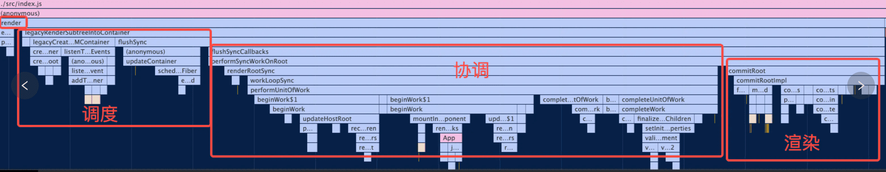
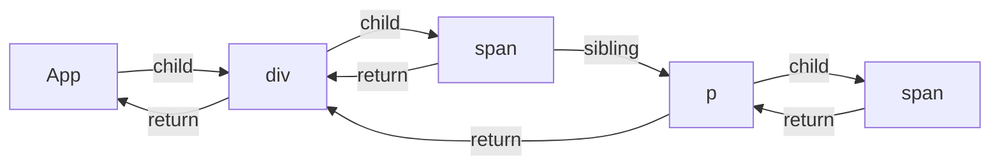

## render阶段2:completeWork

## render阶段2:completeWork
complete阶段workInProgress节点都是经过diff算法调和过的，也就意味着对于某个节点来说它fiber的形态已经基本确定了，但除此之外还有两点：
* 目前只有fiber形态变了，对于原生DOM组件（HostComponent）和文本节点（HostText）的fiber来说，对应的DOM节点（fiber.stateNode）并未变化。
* 经过Diff生成的新的workInProgress节点持有了flag(即effectTag)

workInProgress节点的completeWork阶段主要做的:
* 真实DOM节点的创建以及挂载
```
构建过程中，会自下而上将子节点的第一层第一层插入到当前节点。
更新过程中，会计算DOM节点的属性，一旦属性需要更新，会为DOM节点对应的workInProgress节点标记Update的effectTag
```
* effectList的收集
```
执行beginWork后会创建子 Fiber 节点，节点上可能存在effectTag。
```
* DOM属性的处理,次要理解
* 错误处理,次要理解

一旦workInProgress树的所有节点都完成complete，则说明workInProgress树已经构建完成，所有的更新工作已经做完，接下来这棵树会进入commit阶段

`如果没有子Fiber节点则返回null, 只有当next为null的时候才会进入completeWork;`

当前Fiber节点没有子节点时就进入了completeWork, 可以理解为递归阶段的归阶段。 

workLoopSync 循环调用 performUnitOfWork 

performUnitOfWork-->completeUnitOfWork-->completeWork 

completeWork是一个do while循环, 终止条件有completeWork !== null或者循环内return前的几个终止条件

```js
function performUnitOfWork(unitOfWork) {
  workInProgressNums = workInProgressNums + 1
  // The current, flushed, state of this fiber is the alternate. Ideally
  // nothing should rely on this, but relying on it here means that we don't
  // need an additional field on the work in progress.
  var current = unitOfWork.alternate;
  setCurrentFiber(unitOfWork);
  var next;

  if ((unitOfWork.mode & ProfileMode) !== NoMode) {
    startProfilerTimer(unitOfWork);
    //对当前节点进行协调，如果存在子节点，则返回子节点的引用
    next = beginWork$1(current, unitOfWork, subtreeRenderLanes);
    stopProfilerTimerIfRunningAndRecordDelta(unitOfWork, true);
  } else {
    next = beginWork$1(current, unitOfWork, subtreeRenderLanes);
  }

  resetCurrentFiber();
  unitOfWork.memoizedProps = unitOfWork.pendingProps;

  //如果无子节点，则代表当前的child链表已经遍历完
  if (next === null) {
    // If this doesn't spawn new work, complete the current work.
    //此函数内部会帮我们找到下一个可执行的节点
    console.log(`%c 无子节点，则代表当前的child链表已经遍历完,开启子组件链completeUnitOfWork:${unitOfWork.type}`, 'color:black');
    completeUnitOfWork(unitOfWork);
  } else {
    workInProgress = next;
  }

  ReactCurrentOwner$2.current = null;
}
```


### effectList
我们在介绍completeUnitOfWork函数的时候提到，他的其中一个作用是用于进行父节点的effectList的收集：
- 把当前 fiber 节点的 effectList 合并到父节点的effectList中。
- 若当前 fiber 节点存在存在副作用(增,删,改)， 则将其加入到父节点的effectList中。
```js
  // 将此节点的effectList合并到到父节点的effectList中
  if (returnFiber.firstEffect === null) {
    returnFiber.firstEffect = completedWork.firstEffect;
  }
    
  if (completedWork.lastEffect !== null) {
    if (returnFiber.lastEffect !== null) {
      returnFiber.lastEffect.nextEffect = completedWork.firstEffect;
    }
    returnFiber.lastEffect = completedWork.lastEffect;
  }
  // 若当前 fiber 节点存在存在副作用(增,删,改)， 则将其加入到父节点的`effectList`中。
  const flags = completedWork.flags;
  if (flags > PerformedWork) {
    if (returnFiber.lastEffect !== null) {
      returnFiber.lastEffect.nextEffect = completedWork;
    } else {
      returnFiber.firstEffect = completedWork;
    }
    returnFiber.lastEffect = completedWork;
  }
```
effectList存在的目的是为了提升commit阶段的工作效率。
在commit阶段，我们需要找出所有存在effectTag的fiber节点并依次执行effectTag对应操作。为了避免在commit阶段再去做遍历操作去寻找effectTag
不为空的fiber节点，React在completeUnitOfWork函数调用的过程中提前把所有存在effectTag的节点收集到effectList中，在commit阶段，只需要遍历effectList，并执行各个节点的effectTag的对应操作就好。


### completeUnitOfWork
completeUnitOfWork主要流程
1. 调用completeWork。
2. 用于进行父节点的effectList的收集：
   - 把当前 fiber 节点的 effectList 合并到父节点的effectList中。
   - 若当前 fiber 节点存在存在副作用(增,删,改)， 则将其加入到父节点的effectList中。
3. 沿着此节点所在的兄 -> 弟链表查看其是否拥有兄弟fiber节点（即fiber.sibling !== null），如果存在，则进入其兄弟fiber父 -> 子链表
   的遍历（即进入其兄弟节点的beginWork阶段）。如果不存在兄弟fiber，会通过子 -> 父链表回溯到父节点上，直到回溯到根节点，也即完成本次协调


completeUnitOfWork 从源码中可以看到是一个do while循环, 终止条件有completeWork !== null或者循环内return前的几个终止条件, 我们可以看到有一个是siblingFiber不为null的情况. 即当前的节点存在兄弟节点时并且已经没有子节点, 当前节点会结束completeWork, 跳出调用栈, 执行下一次循环, 进入兄弟节点的beginWork.当兄弟节点为null的时候, 那么completeWork会被赋值为returnFiber, 这个时候注意并没有用return跳出调用栈, 因为父级节点的beginWork已经被执行, 因此会进入父级节点的completeWork, 由此向上, 当completeWork为null时意味着归到根节点

```js
function completeUnitOfWork(unitOfWork) {
  var completedWork = unitOfWork;

  do {
    var current = completedWork.alternate;
    var returnFiber = completedWork.return; // Check if the work completed or if something threw.

    if ((completedWork.flags & Incomplete) === NoFlags) {
      setCurrentFiber(completedWork);
      var next = void 0;

      if ((completedWork.mode & ProfileMode) === NoMode) {
        console.log(`%c ==开始completeWork-1`, 'color:black')
        next = completeWork(current, completedWork, subtreeRenderLanes);
      } else {
        console.log(`%c ==开始completeWork-2`, 'color:black')
        startProfilerTimer(completedWork);
        next = completeWork(current, completedWork, subtreeRenderLanes); // Update render duration assuming we didn't error.

        stopProfilerTimerIfRunningAndRecordDelta(completedWork, false);
      }

      resetCurrentFiber();

      if (next !== null) {
        // Completing this fiber spawned new work. Work on that next.
        workInProgress = next;
        return;
      }
    }else{
      // ...
    }

    // 查看当前节点是否存在兄弟节点
    var siblingFiber = completedWork.sibling;
    if (siblingFiber !== null) {
      // If there is more work to do in this returnFiber, do that next.
      // 若存在，便把siblingFiber节点作为下一个工作单元，
      // 继续执行performUnitOfWork，执行当前节点并尝试遍历当前节点所在的child链表
      workInProgress = siblingFiber;
      return;
    }

    // 如果不存在兄弟节点，则回溯到父节点，尝试查找父节点的兄弟节点
    completedWork = returnFiber; // Update the next thing we're working on in case something throws.
    workInProgress = completedWork;
  } while (completedWork !== null); // We've reached the root.
}
```

###  正式进入completeWork
completeWork的作用包括：
1. 为新增的 fiber 节点生成对应的DOM节点。
2. 更新DOM节点的属性。
3. 进行事件绑定。
4. 收集effectTag。

类似 beginWork，completeWork 也是针对不同 fiber.tag 调用不同的处理逻辑。

重点关注页面渲染所必须的 HostComponent（即原生 DOM 组件对应的 Fiber 节点）,

同时针对 HostComponent ，判断update时我们还需要考虑 workInProgress.stateNode != null ?（即该 Fiber 节点是否存在对应的 DOM 节点）。

`case HostComponent为例子:`

还记得我们讲到：mount 时只会在 rootFiber 存在 Placement effectTag。那么commit 阶段是如何通过一次插入 DOM 操作（对应一个Placement effectTag）将整棵 DOM 树插入页面的呢？

原因就在于 completeWork 中的appendAllChildren 方法。

由于 completeWork 属于“归”阶段调用的函数，每次调用 appendAllChildren 时都会将已生成的子孙 DOM 节点插入当前生成的 DOM 节点下。那么当“归”到 rootFiber 时，我们已经有一个构建好的离屏 DOM 树。

`hostComponent为例子:`

根据current状态进入不同逻辑，我们分析首屏渲染时的逻辑，主要有以下几步:

1. createInstance 为当前fiber创建dom实例
```js
createInstance =>
createElement => 
document.createElement
```
2. appendAllChildren 遍历所有同级子代节点，执行父节点的appenChild方法，即此方法会将所有子dom节点与当前创建的dom实例连接

3. 赋值stateNode属性

4. finalizeInitialChildren 处理props

至此，首屏渲染时render阶段的大体流程就梳理完了

```js
function completeWork(current, workInProgress, renderLanes) {
  const newProps = workInProgress.pendingProps;

  switch (workInProgress.tag) {
    case IndeterminateComponent:
    case LazyComponent:
    case SimpleMemoComponent:
    case FunctionComponent:
    case ForwardRef:
    case Fragment:
    case Mode:
    case Profiler:
    case ContextConsumer:
    case MemoComponent:
      return null;
    case ClassComponent: {
      // ...省略
      return null;
    }
    case HostRoot: {
      // ...省略
      updateHostContainer(workInProgress);
      return null;
    }
    case HostComponent:
        {
          popHostContext(workInProgress);
          var rootContainerInstance = getRootHostContainer();
          var type = workInProgress.type;

          if (current !== null && workInProgress.stateNode != null) {
            console.log(`%c=completeWork->更新流程HostComponent调用updateHostComponent`, 'color:chartreuse')
            updateHostComponent(current, workInProgress, type, newProps, rootContainerInstance);

            if (current.ref !== workInProgress.ref) {
              markRef(workInProgress);
            }
          } else {
            if (!newProps) {
              if (workInProgress.stateNode === null) {
                throw new Error('We must have new props for new mounts. This error is likely ' + 'caused by a bug in React. Please file an issue.');
              } // This can happen when we abort work.


              bubbleProperties(workInProgress);
              return null;
            }

            var currentHostContext = getHostContext(); // TODO: Move createInstance to beginWork and keep it on a context
            // "stack" as the parent. Then append children as we go in beginWork
            // or completeWork depending on whether we want to add them top->down or
            // bottom->up. Top->down is faster in IE11.

            var _wasHydrated = popHydrationState(workInProgress);

            if (_wasHydrated) {
              // TODO: Move this and createInstance step into the beginPhase
              // to consolidate.
              if (prepareToHydrateHostInstance(workInProgress, rootContainerInstance, currentHostContext)) {
                // If changes to the hydrated node need to be applied at the
                // commit-phase we mark this as such.
                markUpdate(workInProgress);
              }
            } else {
              // 为当前fiber创建dom实例
              console.log('%c=beginWork->HostComponent初始化流程调用createInstance为当前fiber创建dom实例==>start', 'color:chartreuse')
              var instance = createInstance(type, newProps, rootContainerInstance, currentHostContext, workInProgress);
              // 将子孙dom节点追加到当前创建的dom节点上
              console.log('%c=beginWork->HostComponent初始化流程-将子孙dom节点追加到当前创建的dom节点上', 'color:green', { instance })
              appendAllChildren(instance, workInProgress, false, false);
              // 将当前创建的挂载到stateNode属性上
              workInProgress.stateNode = instance; // Certain renderers require commit-time effects for initial mount.
              console.log('%c=beginWork->HostComponent初始化流程将当前创建的挂载到workInProgress.stateNode:', 'color:green', { workInProgress_stateNode: workInProgress.stateNode });
              // (eg DOM renderer supports auto-focus for certain elements).
              // Make sure such renderers get scheduled for later work.
              // 处理props（绑定回调，设置dom属性...）
              if (finalizeInitialChildren(instance, type, newProps, rootContainerInstance)) {
                markUpdate(workInProgress);
              }
            }
            // ref属性相关逻辑
            if (workInProgress.ref !== null) {
              // If there is a ref on a host node we need to schedule a callback
              markRef(workInProgress);
            }
          }

          bubbleProperties(workInProgress);
          return null;
        }
}
```

### 调用createElement为当前fiber创建dom节点
```js
function createElement(type, props, rootContainerElement, parentNamespace) {
  var isCustomComponentTag; // We create tags in the namespace of their parent container, except HTML
  // tags get no namespace.

  var ownerDocument = getOwnerDocumentFromRootContainer(rootContainerElement);
  var domElement;
  var namespaceURI = parentNamespace;

  if (namespaceURI === HTML_NAMESPACE) {
    namespaceURI = getIntrinsicNamespace(type);
  }

  if (namespaceURI === HTML_NAMESPACE) {
    {
      isCustomComponentTag = isCustomComponent(type, props); // Should this check be gated by parent namespace? Not sure we want to
      // allow <SVG> or <mATH>.

      if (!isCustomComponentTag && type !== type.toLowerCase()) {
        error('<%s /> is using incorrect casing. ' + 'Use PascalCase for React components, ' + 'or lowercase for HTML elements.', type);
      }
    }

    if (type === 'script') {
      // Create the script via .innerHTML so its "parser-inserted" flag is
      // set to true and it does not execute
      var div = ownerDocument.createElement('div');

      div.innerHTML = '<script><' + '/script>'; // eslint-disable-line
      // This is guaranteed to yield a script element.

      var firstChild = div.firstChild;
      domElement = div.removeChild(firstChild);
    } else if (typeof props.is === 'string') {
      // $FlowIssue `createElement` should be updated for Web Components
      domElement = ownerDocument.createElement(type, {
        is: props.is
      });
    } else {
      // Separate else branch instead of using `props.is || undefined` above because of a Firefox bug.
      // See discussion in https://github.com/facebook/react/pull/6896
      // and discussion in https://bugzilla.mozilla.org/show_bug.cgi?id=1276240
      domElement = ownerDocument.createElement(type); // Normally attributes are assigned in `setInitialDOMProperties`, however the `multiple` and `size`
      // attributes on `select`s needs to be added before `option`s are inserted.
      // This prevents:
      // - a bug where the `select` does not scroll to the correct option because singular
      //  `select` elements automatically pick the first item #13222
      // - a bug where the `select` set the first item as selected despite the `size` attribute #14239
      // See https://github.com/facebook/react/issues/13222
      // and https://github.com/facebook/react/issues/14239

      if (type === 'select') {
        var node = domElement;

        if (props.multiple) {
          node.multiple = true;
        } else if (props.size) {
          // Setting a size greater than 1 causes a select to behave like `multiple=true`, where
          // it is possible that no option is selected.
          //
          // This is only necessary when a select in "single selection mode".
          node.size = props.size;
        }
      }
    }
  } else {
    domElement = ownerDocument.createElementNS(namespaceURI, type);
  }

  {
    if (namespaceURI === HTML_NAMESPACE) {
      if (!isCustomComponentTag && Object.prototype.toString.call(domElement) === '[object HTMLUnknownElement]' && !hasOwnProperty.call(warnedUnknownTags, type)) {
        warnedUnknownTags[type] = true;

        error('The tag <%s> is unrecognized in this browser. ' + 'If you meant to render a React component, start its name with ' + 'an uppercase letter.', type);
      }
    }
  }

  console.log(`%c=createElement`, 'color:green', { type, props, domElement })
  return domElement;
}
```

### appendAllChildren负责将子孙DOM节点插入刚生成的DOM节点中
beginWork时介绍过，在mount时，为了避免每个fiber节点都需要进行插入操作，在mount时，只有根节点会收集effectTag，
其余节点不会进行effectTag的收集。由于每次执行appendAllChildren后，我们都能得到一棵以当前workInProgress为
根节点的DOM树。因此在commit阶段我们只需要对mount的根节点进行一次插入操作就可以了。
```js
  appendAllChildren = function(
    parent: Instance,
    workInProgress: Fiber,
    needsVisibilityToggle: boolean,
    isHidden: boolean,
  ) {
    // 获取workInProgress的子fiber节点
    let node = workInProgress.child;

    // 当存在子节点时，去往下遍历
    while (node !== null) {
      if (node.tag === HostComponent || node.tag === HostText) {
        // 当node节点为HostComponent后HostText时，直接插入到子DOM节点列表的尾部
        appendInitialChild(parent, node.stateNode);
      } else if (enableFundamentalAPI && node.tag === FundamentalComponent) {
        appendInitialChild(parent, node.stateNode.instance);
      } else if (node.tag === HostPortal) {
        // 当node节点为HostPortal类型的节点，什么都不做
      } else if (node.child !== null) {
        // 上面分支都没有命中，说明node节点不存在对应DOM，向下查找拥有stateNode属性的子节点
        node.child.return = node;
        node = node.child;
        continue;
      }
      if (node === workInProgress) {
        // 回溯到workInProgress时，以添加完所有子节点
        return;
      }

      // 当node节点不存在兄弟节点时，向上回溯
      while (node.sibling === null) {
        // 回溯到workInProgress时，以添加完所有子节点
        if (node.return === null || node.return === workInProgress) {
          return;
        }
        node = node.return;
      }
      
      // 此时workInProgress的第一个子DOM节点已经插入到进入workInProgress对应的DOM节点了，开始进入node节点的兄弟节点的插入操作
      node.sibling.return = node.return;
      node = node.sibling;
    }
  };
```


## 解析：在"归"阶段会调用completeWork处理 Fiber 节点
completeWork 将根据 workInProgress 节点的 tag 属性的不同，进入不同的 DOM 节点的创建、处理逻辑。

completeWork 内部有 3 个关键动作：
* 创建 DOM 节点（CreateInstance）
* 将 DOM 节点插入到 DOM 树中（AppendAllChildren）
* 为 DOM 节点设置属性（FinalizeInitialChildren）

当某个 Fiber 节点执行完completeWork，如果其存在兄弟 Fiber 节点（即fiber.sibling !== null），会进入其兄弟 Fiber 的"递"阶段。

如果不存在兄弟 Fiber，会进入父级 Fiber 的"归"阶段。

"递"和"归"阶段会交错执行直到"归"到 rootFiber。至此，协调阶段的工作就结束了。


## 更新阶段
会根据新的状态形成的jsx（ClassComponent的render或者FuncComponent的返回值）和current Fiber对比形（diff算法）构建**workInProgress的Fiber树**

然后将fiberRoot的current指向workInProgress树，此时workInProgress就变成了current Fiber。

在update的时候，render阶段会根据最新的jsx和老的Fiber进行对比，生成新的Fiber。
这些Fiber会带有各种副作用，比如‘Deletion’、‘Update’、‘Placement’等，这一个对比的过程就是diff算法 ，在commit阶段会操作真实节点，执行相应的副作用。

diff ⽐较的是什么？ ⽐较的是 current fiber 和 vdom，⽐较之后⽣成 workInProgress Fiber
```
render阶段会根据最新的jsx生成的虚拟dom和current Fiber树进行对比，比较之后生成workInProgress Fiber(workInProgress Fiber树的alternate指向Current Fiber树的对应节点，这些Fiber会带有各种副作用，比如‘Deletion’、‘Update’、'Placement’等)这一对比过程就是diff算法
```

当workInProgress Fiber树构建完成，workInProgress 则成为了current Fiber渲染到页面上

### render阶段之update时: fiber 双缓存 和 diff；beginWork与completeWork的不同
在update diff 比较时： 就是在构建 workInProgress fiber tree 的过程中，会根据新的状态形成的jsx（ClassComponent的render或者FuncComponent的返回值）和current Fiber对比形（diff算法）构建**workInProgress的Fiber树**。
```
判断 current fiber tree 中的 fiber node 是否可以被 workInProgress fiber tree 复用。

能被复用，意味在本次更新中，需要做:
组件的 update 以及 dom 节点的 move、update 等操作；

不可复用，则意味着需要做:
组件的 mount、unmount 以及 dom 节点的 insert、delete 等操作。
```

当更新完成以后，fiberRootNode 的 current 指针会指向 workInProgress fiber tree，作为下一次更新的 current fiber tree


当 update 时，Fiber 节点已经存在对应 DOM 节点，所以不需要生成 DOM 节点。需要做的主要是处理 props，比如：
* onClick、onChange 等回调函数的注册；
* 处理style prop；
* 处理DANGEROUSLY_SET_INNER_HTML prop；
* 处理children prop。

我们去掉一些当前不需要关注的功能（比如 ref）。可以看到最主要的逻辑是调用 updateHostComponent 方法。你可以从这里看到updateHostComponent 方法定义。

在 updateHostComponent 内部，被处理完的 props 会被赋值给 workInProgress.updateQueue，并最终会在 commit 阶段被渲染在页面上。
```js
workInProgress.updateQueue = (updatePayload: any);
```
其中updatePayload为数组形式，他的奇数索引的值为变化的 prop key，偶数索引的值为变化的 prop value。

### render阶段之update时两个函数对比
```js
function beginWork(current, workInProgress, renderLanes) {
  // mount current !== null 为null,不走以下逻辑
  if (current !== null) {
    console.log('%c=beginWork()===start1-更新', 'color:magenta', { getFiberName: getFiberName(workInProgress), current, renderLanes, workInProgress })
    // 通过一系列判断逻辑判断当前节点是否可复用，用didReceiveUpdate来标记，
  }{
  console.log('%c=beginWork()===start1-初始化', 'color:magenta', { getFiberName: getFiberName(workInProgress), current, renderLanes, workInProgress })
  workInProgress.lanes = NoLanes;

  switch (workInProgress.tag) {
    case IndeterminateComponent: 
      // ...省略
    case LazyComponent: 
      // ...省略
    case FunctionComponent: 
      // ...省略
    case ClassComponent: 
      // ...省略
    case HostRoot:
      // ...省略
    case HostComponent:
      console.log(`%c=beginWork()=end 7 updateHostComponent$1,即原生 DOM 组件对应的 Fiber节点:`, 'color:magenta', { type: workInProgress.type })
      return updateHostComponent$1(current, workInProgress, renderLanes);
    case HostText:
  }
  }
}

function completeWork(current, workInProgress, renderLanes) {
  const newProps = workInProgress.pendingProps;

  switch (workInProgress.tag) {
    case IndeterminateComponent:
    case LazyComponent:
    case SimpleMemoComponent:
    case FunctionComponent:
    case ForwardRef:
    case Fragment:
    case Mode:
    case Profiler:
    case ContextConsumer:
    case MemoComponent:
      return null;
    case ClassComponent: {
      // ...省略
      return null;
    }
    case HostRoot: {
      // ...省略
      updateHostContainer(workInProgress);
      return null;
    }
    case HostComponent:
        {
          popHostContext(workInProgress);
          var rootContainerInstance = getRootHostContainer();
          var type = workInProgress.type;

          if (current !== null && workInProgress.stateNode != null) {
            console.log(`%c=completeWork->更新流程HostComponent调用updateHostComponent`, 'color:chartreuse')
            updateHostComponent(current, workInProgress, type, newProps, rootContainerInstance);

            if (current.ref !== workInProgress.ref) {
              markRef(workInProgress);
            }
          } else {
            if (!newProps) {
              if (workInProgress.stateNode === null) {
                throw new Error('We must have new props for new mounts. This error is likely ' + 'caused by a bug in React. Please file an issue.');
              } // This can happen when we abort work.


              bubbleProperties(workInProgress);
              return null;
            }

            var currentHostContext = getHostContext(); // TODO: Move createInstance to beginWork and keep it on a context
            // "stack" as the parent. Then append children as we go in beginWork
            // or completeWork depending on whether we want to add them top->down or
            // bottom->up. Top->down is faster in IE11.

            var _wasHydrated = popHydrationState(workInProgress);

            if (_wasHydrated) {
              // TODO: Move this and createInstance step into the beginPhase
              // to consolidate.
              if (prepareToHydrateHostInstance(workInProgress, rootContainerInstance, currentHostContext)) {
                // If changes to the hydrated node need to be applied at the
                // commit-phase we mark this as such.
                markUpdate(workInProgress);
              }
            } else {
              // 为当前fiber创建dom实例
              console.log('%c=beginWork->HostComponent初始化流程调用createInstance为当前fiber创建dom实例==>start', 'color:chartreuse')
              var instance = createInstance(type, newProps, rootContainerInstance, currentHostContext, workInProgress);
              // 将子孙dom节点追加到当前创建的dom节点上
              console.log('%c=beginWork->HostComponent初始化流程-将子孙dom节点追加到当前创建的dom节点上', 'color:green', { instance })
              appendAllChildren(instance, workInProgress, false, false);
              // 将当前创建的挂载到stateNode属性上
              workInProgress.stateNode = instance; // Certain renderers require commit-time effects for initial mount.
              console.log('%c=beginWork->HostComponent初始化流程将当前创建的挂载到workInProgress.stateNode:', 'color:green', { workInProgress_stateNode: workInProgress.stateNode });
              // (eg DOM renderer supports auto-focus for certain elements).
              // Make sure such renderers get scheduled for later work.
              // 处理props（绑定回调，设置dom属性...）
              if (finalizeInitialChildren(instance, type, newProps, rootContainerInstance)) {
                markUpdate(workInProgress);
              }
            }
            // ref属性相关逻辑
            if (workInProgress.ref !== null) {
              // If there is a ref on a host node we need to schedule a callback
              markRef(workInProgress);
            }
          }

          bubbleProperties(workInProgress);
          return null;
        }
}
```

update流程我们只需抓住与mount的不同：current不为null，由于二者的不同主要体现在render阶段，因为我们分别分析beginWork与completeWork的不同。

### update流程之beginWork current不为null的逻辑：

通过一系列判断逻辑判断当前节点是否可复用，用didReceiveUpdate来标记，
若可复用则走attemptEarlyBailoutIfNoScheduledUpdate。调用栈如下:
```
顾名思义，会直接克隆一个fiber节点并返回。
attemptEarlyBailoutIfNoScheduledUpdate =>bailoutOnAlreadyFinishedWork=>cloneChildFibers
```

### update流程之beginWork第二阶段
beginWork第二阶段的逻辑是mount与update共用的，当节点无法复用时会调用 reconcileChildren 生成子节点，
其内部会根据current是否存在进入 mountChildFibers（current为null）或 reconcileChildFibers（current不为null），

我们已经知道这两者的逻辑基本是相同的，只是 reconcileChildFibers 会为当前fiber打上 flags，它代表当前dom需要执行的操作（插入，更新，删除等），

```js
function placeSingleChild(newFiber: Fiber): Fiber {
   // shouldTrackSideEffects代表需要追踪副作用，update时会将其标记为true
   // 当前fiber不存在dom实例时，才可标记Placement
    if (shouldTrackSideEffects && newFiber.alternate === null) {
      newFiber.flags |= Placement;
    }
    return newFiber;
  }
```
另外，由于mount时current不存在，因此reconcileChildFibers不会有对比更新的逻辑，直接创建节点，而update时则会将current与当前的ReactElement
做对比生成WIP，也就是diff算法，具体实现细节这里不展开


### update流程之completeWork-->updateHostComponent
updateHostComponent 用于更新DOM节点的属性并在当前节点存在更新属性，收集Update effectTag。

根据需代码：
要变化的prop会被存储到updatePayload 中，updatePayload 为一个偶数索引的值为变化的prop key，奇数索引的值为变化的prop value的数组。
并最终挂载到挂载到workInProgress.updateQueue上，供后续commit阶段使用。

我们已经知道，mount时completeWork会直接创建dom实例，而update会调用updateHostComponent，我们来分析其实现逻辑:

在新旧props不同时调用prepareUpdate，他会对比新旧props并生成updatePayload，其调用栈如下:
```
prepareUpdate-->diffProperties
```

diffProperties内部主逻辑是对props进行两轮循环，分别处理属性删除与属性新增的情况，最终返回updatePayload，这是一个数组，
第i项和第i+1项分别是更新后的的key和value。他会在mutation阶段被用于更新节点属性。
updateHostComponent的最后调用进行markUpdate，赋值更新的flags（Update）。
```js
updateHostComponent = function (current, workInProgress, type, newProps, rootContainerInstance) {
  // If we have an alternate, that means this is an update and we need to
  // schedule a side-effect to do the updates.
  var oldProps = current.memoizedProps;
  console.log(`%c=updateHostComponent更新流程`, 'color:chartreuse')

  if (oldProps === newProps) {
    // In mutation mode, this is sufficient for a bailout because
    // we won't touch this node even if children changed.
    return;
  } // If we get updated because one of our children updated, we don't
  // have newProps so we'll have to reuse them.
  // TODO: Split the update API as separate for the props vs. children.
  // Even better would be if children weren't special cased at all tho.


  var instance = workInProgress.stateNode;
  var currentHostContext = getHostContext(); // TODO: Experiencing an error where oldProps is null. Suggests a host
  // component is hitting the resume path. Figure out why. Possibly
  // related to `hidden`.

  // 对比props生成updatePayload
  var updatePayload = prepareUpdate(instance, type, oldProps, newProps, rootContainerInstance, currentHostContext); // TODO: Type this specific to this type of component.

  workInProgress.updateQueue = updatePayload; // If the update payload indicates that there is a change or if there
  // is a new ref we mark this as an update. All the work is done in commitWork.

  if (updatePayload) {
    markUpdate(workInProgress);
  }
};
```


```js
function diffProperties(
  domElement: Element,
  tag: string,
  lastRawProps: Object,
  nextRawProps: Object,
  rootContainerElement: Element | Document,
): null | Array<mixed> {
  let updatePayload: null | Array<any> = null;
  let lastProps: Object;
  let nextProps: Object;
  //处理新旧props 针对表单标签做特殊处理
  switch (tag) {
    case 'input':
      lastProps = ReactDOMInputGetHostProps(domElement, lastRawProps);
      nextProps = ReactDOMInputGetHostProps(domElement, nextRawProps);
      updatePayload = [];
      break;
    case 'select':
      lastProps = ReactDOMSelectGetHostProps(domElement, lastRawProps);
      nextProps = ReactDOMSelectGetHostProps(domElement, nextRawProps);
      updatePayload = [];
      break;
    case 'textarea':
      lastProps = ReactDOMTextareaGetHostProps(domElement, lastRawProps);
      nextProps = ReactDOMTextareaGetHostProps(domElement, nextRawProps);
      updatePayload = [];
      break;
    default:
      lastProps = lastRawProps;
      nextProps = nextRawProps;
      if (
        typeof lastProps.onClick !== 'function' &&
        typeof nextProps.onClick === 'function'
      ) {
        // TODO: This cast may not be sound for SVG, MathML or custom elements.
        trapClickOnNonInteractiveElement(((domElement: any): HTMLElement));
      }
      break;
  }

  assertValidProps(tag, nextProps);

  let propKey;
  let styleName;
  let styleUpdates = null;
  for (propKey in lastProps) {
    if (
      nextProps.hasOwnProperty(propKey) ||
      !lastProps.hasOwnProperty(propKey) ||
      lastProps[propKey] == null
    ) {
      continue;
    }
    // 新无旧有时进入一下逻辑，即属性被删除
    if (propKey === STYLE) {
      const lastStyle = lastProps[propKey];
      // 将对应style属性置空
      for (styleName in lastStyle) {
        if (lastStyle.hasOwnProperty(styleName)) {
          if (!styleUpdates) {
            styleUpdates = {};
          }
          styleUpdates[styleName] = '';
        }
      }
    } else {
      // 将对应key及value（null）推入更新队列，
      (updatePayload = updatePayload || []).push(propKey, null);
    }
  }
  for (propKey in nextProps) {
    const nextProp = nextProps[propKey];
    const lastProp = lastProps != null ? lastProps[propKey] : undefined;
    if (
      !nextProps.hasOwnProperty(propKey) ||
      nextProp === lastProp ||
      (nextProp == null && lastProp == null)
    ) {
      continue;
    }
    // 新有旧无或新旧都有切不相等时进入以下逻辑

    // style属性特殊处理 总结如下
    // 新有旧无 推入style队列
    // 新旧都有 用新的
    // 新无旧有 将对应属性置空
    if (propKey === STYLE) {
      if (lastProp) {
        for (styleName in lastProp) {
          if (
            lastProp.hasOwnProperty(styleName) &&
            (!nextProp || !nextProp.hasOwnProperty(styleName))
          ) {
            if (!styleUpdates) {
              styleUpdates = {};
            }
            styleUpdates[styleName] = '';
          }
        }
        for (styleName in nextProp) {
          if (
            nextProp.hasOwnProperty(styleName) &&
            lastProp[styleName] !== nextProp[styleName]
          ) {
            if (!styleUpdates) {
              styleUpdates = {};
            }
            styleUpdates[styleName] = nextProp[styleName];
          }
        }
      } else {
        if (!styleUpdates) {
          if (!updatePayload) {
            updatePayload = [];
          }
          updatePayload.push(propKey, styleUpdates);
        }
        styleUpdates = nextProp;
      }
    } else {
      // 将对应key及value推入更新队列
      (updatePayload = updatePayload || []).push(propKey, nextProp);
    }
  }
  if (styleUpdates) {
    (updatePayload = updatePayload || []).push(STYLE, styleUpdates);
  }
  return updatePayload;
}
```

### update流程之completeWork:这个tag标识有什么用呢
```
render阶段组件更新会根据checkHasForceUpdateAfterProcessing，和checkShouldComponentUpdate来判断，

如果Update的tag是ForceUpdate，则 checkHasForceUpdateAfterProcessing 为true，当组件是PureComponent时;  checkShouldComponentUpdate 会浅比较state和props，所以当使用this.forceUpdate一定会更新.
```
```js
function resumeMountClassInstance(workInProgress, ctor, newProps, renderLanes) {
  var instance = workInProgress.stateNode;
  var oldProps = workInProgress.memoizedProps;
  instance.props = oldProps;
  var oldContext = instance.context;
  var contextType = ctor.contextType;
  var nextContext = emptyContextObject;
	...
  var shouldUpdate = checkHasForceUpdateAfterProcessing() || checkShouldComponentUpdate(workInProgress, ctor, oldProps, newProps, oldState, newState, nextContext);
  if (shouldUpdate) {
    // In order to support react-lifecycles-compat polyfilled components,
    // Unsafe lifecycles should not be invoked for components using the new APIs.
    if (!hasNewLifecycles && (typeof instance.UNSAFE_componentWillMount === 'function' || typeof instance.componentWillMount === 'function')) {
      if (typeof instance.componentWillMount === 'function') {
        instance.componentWillMount();
      }

      if (typeof instance.UNSAFE_componentWillMount === 'function') {
        instance.UNSAFE_componentWillMount();
      }
    }

    if (typeof instance.componentDidMount === 'function') {
      workInProgress.flags |= Update;
    }
  } else {
    // If an update was already in progress, we should schedule an Update
    // effect even though we're bailing out, so that cWU/cDU are called.
    if (typeof instance.componentDidMount === 'function') {
      workInProgress.flags |= Update;
    } // If shouldComponentUpdate returned false, we should still update the
    // memoized state to indicate that this work can be reused.


    workInProgress.memoizedProps = newProps;
    workInProgress.memoizedState = newState;
  } // Update the existing instance's state, props, and context pointers even
}
```


## 扩展：useState 更新
在react中触发状态更新的几种方式：
* ReactDOM.render

* this.forceUpdate

* useState

* useReducer

```
react 合成事件中改变状态是异步的，出于减少 render 次数，react 会收集所有状态变更，然后比对优化，最后做一次变更
```

## effectList
至此render 阶段的绝大部分工作就完成了

还有一个问题：作为 DOM 操作的依据，commit 阶段需要找到所有有 effectTag 的 Fiber 节点并依次执行 effectTag 对应操作。难道需要在commit 阶段再遍历一次 Fiber 树寻找 effectTag !== null的Fiber 节点么？

这显然是很低效的。

为了解决这个问题，在 completeWork 的上层函数 completeUnitOfWork 中，每个执行完 completeWork 且存在 effectTag 的 Fiber 节点会被保存在一条被称为effectList的单向链表中。

effectList 中第一个 Fiber 节点保存在 fiber.firstEffect ，最后一个元素保存在 fiber.lastEffect。

类似 appendAllChildren，在“归”阶段，所有有 effectTag 的 Fiber 节点都会被追加在 effectList 中，最终形成一条以rootFiber.firstEffect 为起点的单向链表。
```
                       nextEffect         nextEffect
rootFiber.firstEffect -----------> fiber -----------> fiber
```

这样，在commit 阶段只需要遍历 effectList 就能执行所有 effect 了。

你可以在这里看到这段代码逻辑。

借用 React 团队成员Dan Abramov的话：effectList 相较于 Fiber 树，就像圣诞树上挂的那一串彩灯。


## 例子:从渲染到performConcurrentWorkOnRoot在render结束会开启commit阶段
### 程序开头-->`ReactDOM.createRoot`
```js
const root = ReactDOM.createRoot(document.getElementById('root'))

console.log("=app=root:", root)

root.render(<Test />);

function createRoot(container, options) {
		// 省略
    console.log('%c=一切开始1:createRoot(', 'color:red', { createRoot: container, options })
    var root = createContainer(container, ConcurrentRoot, null, isStrictMode, concurrentUpdatesByDefaultOverride, identifierPrefix, onRecoverableError);
    markContainerAsRoot(root.current, container);
    var rootContainerElement = container.nodeType === COMMENT_NODE ? container.parentNode : container;
    listenToAllSupportedEvents(rootContainerElement);
    return new ReactDOMRoot(root);
}

function createContainer(containerInfo, tag, hydrationCallbacks, isStrictMode, concurrentUpdatesByDefaultOverride, identifierPrefix, onRecoverableError, transitionCallbacks) {
	var hydrate = false;
	var initialChildren = null;
	console.log('初始/更新-->FiberRoot:a-->createContainer')
	return createFiberRoot(containerInfo, tag, hydrate, initialChildren, hydrationCallbacks, isStrictMode, concurrentUpdatesByDefaultOverride, identifierPrefix, onRecoverableError);
}
```

### createFiberRoot-->FiberRootNode是初始化相关只调用一次
```js
function createFiberRoot(containerInfo, tag, hydrate, initialChildren, hydrationCallbacks, isStrictMode, concurrentUpdatesByDefaultOverride, // TODO: We have several of these arguments that are conceptually part of the
	// host config, but because they are passed in at runtime, we have to thread
	// them through the root constructor. Perhaps we should put them all into a
	// single type, like a DynamicHostConfig that is defined by the renderer.
	identifierPrefix, onRecoverableError, transitionCallbacks) {
	var root = new FiberRootNode(containerInfo, tag, hydrate, identifierPrefix, onRecoverableError);

	return root;
}

function FiberRootNode(containerInfo, tag, hydrate, identifierPrefix, onRecoverableError) {
	console.log('==FiberRootNode是初始化相关只调用一次===')
	this.tag = tag;
	this.containerInfo = containerInfo;
	this.pendingChildren = null;
	this.current = null;
	this.pingCache = null;
	this.finishedWork = null;
	this.timeoutHandle = noTimeout;
	this.context = null;
	this.pendingContext = null;
	this.callbackNode = null;
	this.callbackPriority = NoLane;
	this.eventTimes = createLaneMap(NoLanes);
	this.expirationTimes = createLaneMap(NoTimestamp);
	this.pendingLanes = NoLanes;
	this.suspendedLanes = NoLanes;
	this.pingedLanes = NoLanes;
	this.expiredLanes = NoLanes;
	this.mutableReadLanes = NoLanes;
	this.finishedLanes = NoLanes;
	this.entangledLanes = NoLanes;
	this.entanglements = createLaneMap(NoLanes);
	this.identifierPrefix = identifierPrefix;
	this.onRecoverableError = onRecoverableError;

	{
		this.mutableSourceEagerHydrationData = null;
	}

	{
		this.effectDuration = 0;
		this.passiveEffectDuration = 0;
	}

	{
		this.memoizedUpdaters = new Set();
		var pendingUpdatersLaneMap = this.pendingUpdatersLaneMap = [];

		for (var _i = 0; _i < TotalLanes; _i++) {
			pendingUpdatersLaneMap.push(new Set());
		}
	}

	{
		switch (tag) {
			case ConcurrentRoot:
				this._debugRootType = hydrate ? 'hydrateRoot()' : 'createRoot()';
				break;

			case LegacyRoot:
				this._debugRootType = hydrate ? 'hydrate()' : 'render()';
				break;
		}
	}
}
```

### 可见children 就是root(根节点)
```js
ReactDOMHydrationRoot.prototype.render = ReactDOMRoot.prototype.render = function (children) {
	console.log('%c=一切开始3:', 'color:red', 'ReactDOMRoot.prototype.render调用updateContainer()开启render阶段==', { children });
	var root = this._internalRoot;
	// 省略函数
	updateContainer(children, root, null, null);
};
```

### 开始2:render-->updateContainer()--scheduleUpdateOnFiber
```js
function updateContainer(element, container, parentComponent, callback) {
	{
		onScheduleRoot(container, element);
	}

	var current$1 = container.current;
	var eventTime = requestEventTime();
	var lane = requestUpdateLane(current$1);

	{
		markRenderScheduled(lane);
	}

	var context = getContextForSubtree(parentComponent);

	if (container.context === null) {
		container.context = context;
	} else {
		container.pendingContext = context;
	}

	// 省略
	var update = createUpdate(eventTime, lane); // Caution: React DevTools currently depends on this property
	// being called "element".

	update.payload = {
		element: element
	};
	callback = callback === undefined ? null : callback;


	// 省略
	console.log('==render阶段准备：updateContainer调用enqueueUpdate()和scheduleUpdateOnFiber()==')
	enqueueUpdate(current$1, update);
	var root = scheduleUpdateOnFiber(current$1, lane, eventTime);

	if (root !== null) {
		entangleTransitions(root, current$1, lane);
	}

	return lane;
}
```

```js
function scheduleUpdateOnFiber(fiber, lane, eventTime) {
	var root = markUpdateLaneFromFiberToRoot(fiber, lane);
	console.log('==render阶段准备:scheduleUpdateOnFiber()调用ensureRootIsScheduled()==')
	ensureRootIsScheduled(root, eventTime);
	return root;
}
```

### ensureRootIsScheduled-->performConcurrentWorkOnRoot
```js
function ensureRootIsScheduled(root, currentTime) {
	// 省略
	if (newCallbackPriority === SyncLane) {
		// Special case: Sync React callbacks are scheduled on a special
		// internal queue
		if (root.tag === LegacyRoot) {
			if (ReactCurrentActQueue$1.isBatchingLegacy !== null) {
				ReactCurrentActQueue$1.didScheduleLegacyUpdate = true;
			}

			console.log('%c=render阶段准备:ensureRootIsScheduled调用performSyncWorkOnRoot：异步更新legacy模式1==', 'color:red')
			scheduleLegacySyncCallback(performSyncWorkOnRoot.bind(null, root));
		} else {

			console.log('%c=render阶段准备:ensureRootIsScheduled调用performSyncWorkOnRoot：异步更新legacy模式2==', 'color:red')
			scheduleSyncCallback(performSyncWorkOnRoot.bind(null, root));
		}

		// 省略
	} else {
		// 省略
		// console.log('更新流程-->0-c2: performConcurrentWorkOnRoot')
		console.log('%c=render阶段准备:', 'color:red', 'ensureRootIsScheduled()调用performConcurrentWorkOnRoot--同步更新:concurrent模式==')
		newCallbackNode = scheduleCallback$1(schedulerPriorityLevel, performConcurrentWorkOnRoot.bind(null, root));
	}

	root.callbackPriority = newCallbackPriority;
	root.callbackNode = newCallbackNode;
}
```

### performConcurrentWorkOnRoot 这个函数在render结束会开启commit阶段
```js
function performConcurrentWorkOnRoot(root, didTimeout) {
	// 省略
	console.log('%c==render阶段准备:重点函数performConcurrentWorkOnRoot,这个函数在render结束会开启commit阶段', 'color:red', 'color:cyan');

	console.log('==render阶段准备:performConcurrentWorkOnRoot调用renderRootSync():同步更新concurrent模式:', { shouldTimeSlice });
	var exitStatus = shouldTimeSlice ? renderRootConcurrent(root, lanes) : renderRootSync(root, lanes);

	if (exitStatus !== RootInProgress) {
		// 省略

		if (exitStatus === RootDidNotComplete) {
			markRootSuspended$1(root, lanes);
		} else {
			// 省略

			root.finishedWork = finishedWork;
			root.finishedLanes = lanes;
			console.log(`%c=commit阶段=前=render阶段结束=performConcurrentWorkOnRoot调用finishConcurrentRender-->commitRoot`, 'color:cyan')
			finishConcurrentRender(root, exitStatus, lanes);
		}
	}

	// 省略

	return null;
}
```

```js
function renderRootSync(root, lanes) {
	var prevExecutionContext = executionContext;
	executionContext |= RenderContext;
	var prevDispatcher = pushDispatcher(); // If the root or lanes have changed, throw out the existing stack
	// 省略

	do {
		try {
			console.log('%c=render阶段准备:', 'color:red', 'renderRootSync()调用workLoopSync()-root:', { root });
			workLoopSync();
			break;
		} catch (thrownValue) {
			handleError(root, thrownValue);
		}
	} while (true);

	// 省略
	workInProgressRoot = null;
	workInProgressRootRenderLanes = NoLanes;
	return workInProgressRootExitStatus;
}
```

图例





## 流程结尾:render 阶段全部工作完成
至此，render 阶段全部工作完成。在 performSyncWorkOnRoot 函数中 fiberRootNode 被传递给 commitRoot 方法，开启commit 阶段工作流程。
```js
commitRoot(root);
```

### 这里以一个简单的jsx结构为例：
beginWork与completeWork这二者是如何相互配合共同完成fiber树的构建的。
```js
return (
    <>
      <div>
        <span>age: 18</span>
        <p>
          <span>name: zs</span>
        </p>
      </div>
    </>
);
```

1. 执行div的beginWork，创建第一个span1对应的fiber节点与p对应的fiber节点，同时会将span.sibling指向p，使得span执行完completeWork可以进入p的beginWork阶段
2. 执行span的beginWork
3. 执行span的completeWork
4. 执行p的beginWork
5. 执行span2的completeWork
6. 执行span2的completeWork
7. 执行p的completeWork
8. 执行div的completeWork

最终会得到这样的一颗Fiber树:


至此，render阶段全部工作已经完成，我们得到了WIP以及对应的dom树，会被赋值给fiberRoot.finishWork，接下来的工作就是将渲染WIP，也就是提交阶段（commit）的流程。