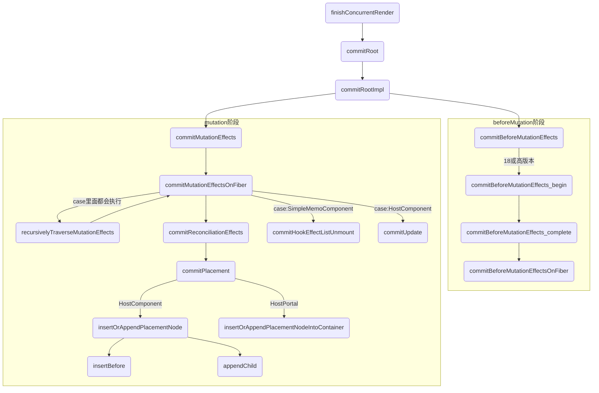
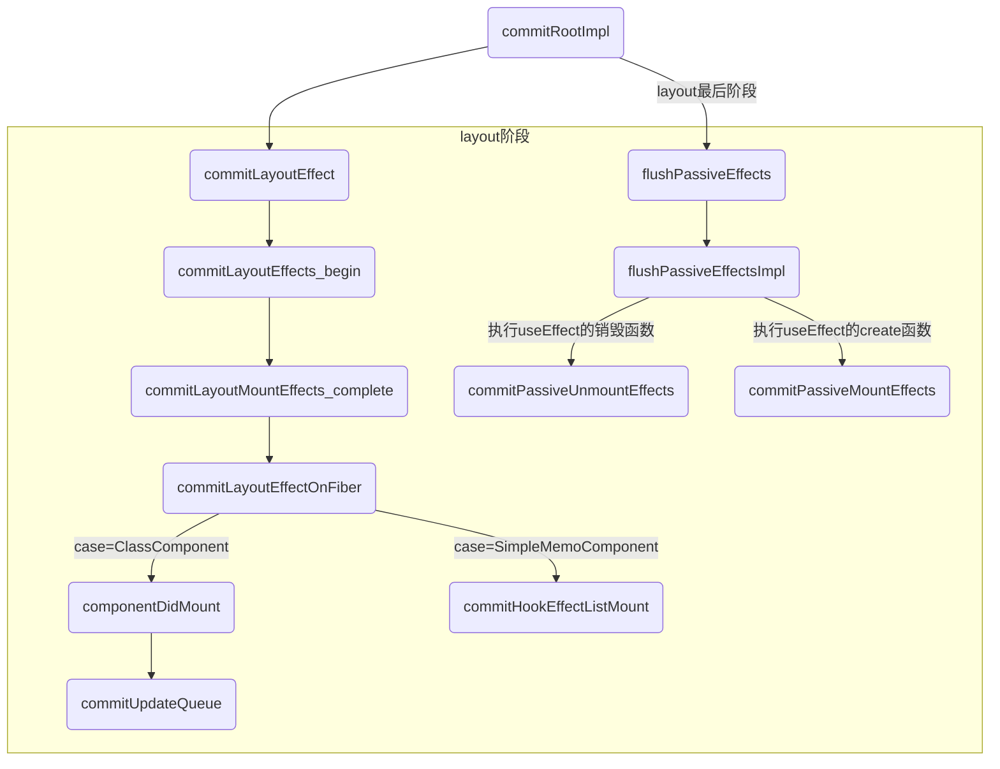

## render阶段和commit阶段区别
1. `render 阶段的工作可以分为递阶段和归阶段作用：`
    * 其中递阶段会执行 beginWork()
    * 归阶段会执行 completeWork()

2. render/reconciliation阶段的工作（diff）可以拆分，commit阶段的工作（patch）不可拆分

在render阶段结束后，会进入commit阶段，该阶段不可中断,commit阶段的调度优先级采用的是最高优先级，以保证commit阶段同步执行不可被打断。

commit阶段的工作（patch）把本次更新中的所有DOM change应用到DOM树，是一连串的DOM操作。DOM操作虽然看起来也可以拆分，但这样做一方面可能造成DOM实际状态与维护的内部状态不一致，另外还会影响体验。

## commit阶段:可以分为3个阶段
主要是去依据workInProgress树中有变化的那些节点（render阶段的completeWork过程收集到的effect链表）,去完成DOM操作，将更新应用到页面上，除此之外，还会异步调度useEffect以及同步执行useLayoutEffect。

1. Before mutation 阶段（执行DOM操作前的一些相关操作）-commitBeforeMutationEffects
```
这个阶段 DOM 节点还没有被渲染到界面上去，

1. 对于类组件会触发 getSnapshotBeforeUpdate，对于函数组件,
2. 处理 useEffect 钩子相关的调度逻辑
2. 处理 DOM 节点渲染/删除后的 autoFocus、blur 逻辑；
```

2. mutation 阶段（执行 DOM 操作）；进行真实的 DOM 操作
```
这个阶段负责 DOM 节点的渲染。在渲染过程中，会遍历 effectList，根据 flags（effectTag）的不同，执行不同的 DOM 操作
```

3. layout 阶段（执行 DOM 操作后）
```
对于类组件，会执行setState的callback
对于函数组件，会执行useLayoutEffect
```

除此之外，一些生命周期钩子（比如 componentDidXXX）、hook（比如 useEffect）需要在commit 阶段执行

在 rootFiber.firstEffect 上保存了一条需要执行副作用的 Fiber 节点的单向链表effectList，这些 Fiber 节点的 updateQueue 中保存了变化的 props。

`注意关于useEffect：scheduleCallback将执行useEffect的动作作为一个任务去调度，这个任务会异步调用。`

`提示:commit流程开log会比较清晰理解`

## 流程图-commit阶段-beforeMutation和mutation阶段


## 流程图-commit阶段-layout最后阶段



## commitRoot()是commit 阶段工作的起点

### 重点-performConcurrentWorkOnRoot在render结束之后调用finishConcurrentRender
`重点函数performConcurrentWorkOnRoot,这个函数在render结束会开启commit阶段`

```js
function performConcurrentWorkOnRoot(root, didTimeout) {

  // 省略...

  var shouldTimeSlice = !includesBlockingLane(root, lanes) && !includesExpiredLane(root, lanes) && (!didTimeout);
  console.log('==render阶段准备:performConcurrentWorkOnRoot调用renderRootSync():同步更新concurrent模式:', { shouldTimeSlice });
  var exitStatus = shouldTimeSlice ? renderRootConcurrent(root, lanes) : renderRootSync(root, lanes);

  if (exitStatus !== RootInProgress) {
    if (exitStatus === RootErrored) {
      // If something threw an error, try rendering one more time. We'll
      // render synchronously to block concurrent data mutations, and we'll
      // includes all pending updates are included. If it still fails after
      // the second attempt, we'll give up and commit the resulting tree.
      var errorRetryLanes = getLanesToRetrySynchronouslyOnError(root);

      if (errorRetryLanes !== NoLanes) {
        lanes = errorRetryLanes;
        exitStatus = recoverFromConcurrentError(root, errorRetryLanes);
      }
    }

    if (exitStatus === RootFatalErrored) {
      var fatalError = workInProgressRootFatalError;
      prepareFreshStack(root, NoLanes);
      markRootSuspended$1(root, lanes);
      ensureRootIsScheduled(root, now());
      throw fatalError;
    }

    if (exitStatus === RootDidNotComplete) {
      // The render unwound without completing the tree. This happens in special
      // cases where need to exit the current render without producing a
      // consistent tree or committing.
      //
      // This should only happen during a concurrent render, not a discrete or
      // synchronous update. We should have already checked for this when we
      // unwound the stack.
      markRootSuspended$1(root, lanes);
    } else {
      // The render completed.
      // Check if this render may have yielded to a concurrent event, and if so,
      // confirm that any newly rendered stores are consistent.
      // TODO: It's possible that even a concurrent render may never have yielded
      // to the main thread, if it was fast enough, or if it expired. We could
      // skip the consistency check in that case, too.
      var renderWasConcurrent = !includesBlockingLane(root, lanes);
      var finishedWork = root.current.alternate;

      if (renderWasConcurrent && !isRenderConsistentWithExternalStores(finishedWork)) {
        // A store was mutated in an interleaved event. Render again,
        // synchronously, to block further mutations.
        exitStatus = renderRootSync(root, lanes); // We need to check again if something threw

        if (exitStatus === RootErrored) {
          var _errorRetryLanes = getLanesToRetrySynchronouslyOnError(root);

          if (_errorRetryLanes !== NoLanes) {
            lanes = _errorRetryLanes;
            exitStatus = recoverFromConcurrentError(root, _errorRetryLanes); // We assume the tree is now consistent because we didn't yield to any
            // concurrent events.
          }
        }

        if (exitStatus === RootFatalErrored) {
          var _fatalError = workInProgressRootFatalError;
          prepareFreshStack(root, NoLanes);
          markRootSuspended$1(root, lanes);
          ensureRootIsScheduled(root, now());
          throw _fatalError;
        }
      } // We now have a consistent tree. The next step is either to commit it,
      // or, if something suspended, wait to commit it after a timeout.


      root.finishedWork = finishedWork;
      root.finishedLanes = lanes;
      console.log(`%c=commit阶段=前=render阶段结束=performConcurrentWorkOnRoot调用finishConcurrentRender-->commitRoot`, 'color:cyan')
      finishConcurrentRender(root, exitStatus, lanes);
    }
  }

  ensureRootIsScheduled(root, now());

  if (root.callbackNode === originalCallbackNode) {
    // The task node scheduled for this root is the same one that's
    // currently executed. Need to return a continuation.
    return performConcurrentWorkOnRoot.bind(null, root);
  }

  return null;
}
```

### 1.初始化时候:finishConcurrentRender-->调用commitRoot 3
```js
function finishConcurrentRender(root, exitStatus, lanes) {
  switch (exitStatus) {
    case RootInProgress:
      // 省略..
    case RootFatalErrored:
      {
        throw new Error('Root did not complete. This is a bug in React.');
      }

    case RootErrored:

    case RootSuspended:
        // 省略..

        console.log(`%c=commit阶段=调用commitRoot 1`, 'color:cyan')
        commitRoot(root, workInProgressRootRecoverableErrors, workInProgressTransitions);
        break;
      }

    case RootSuspendedWithDelay:
        // 省略..
        console.log(`%c=commit阶段=调用commitRoot 2`, 'color:cyan')
        commitRoot(root, workInProgressRootRecoverableErrors, workInProgressTransitions);
        break;
      }

    case RootCompleted:
      {
        // The work completed. Ready to commit.
        console.log(`%c=commit阶段=调用commitRoot 3:finishConcurrentRender函数case RootCompleted,`, 'color:cyan')
        commitRoot(root, workInProgressRootRecoverableErrors, workInProgressTransitions);
        break;
      }

    default:
      {
        throw new Error('Unknown root exit status.');
      }
  }
}
```

### 2.更新时候:performSyncWorkOnRoot-->commitRoot
```js
function performSyncWorkOnRoot(root) {
  {
    syncNestedUpdateFlag();
  }

  if ((executionContext & (RenderContext | CommitContext)) !== NoContext) {
    throw new Error('Should not already be working.');
  }
  console.log(`%c=副作用:performSyncWorkOnRoot调用flushPassiveEffects-7`, 'color:yellow')
  flushPassiveEffects();
  var lanes = getNextLanes(root, NoLanes);

  // 省略

  var finishedWork = root.current.alternate;
  root.finishedWork = finishedWork;
  root.finishedLanes = lanes;
  console.log(`%c=commit阶段=调用commitRoot 4:performSyncWorkOnRoot调用commitRoot`, 'color:cyan')
  commitRoot(root, workInProgressRootRecoverableErrors, workInProgressTransitions); // Before exiting, make sure there's a callback scheduled for the next
  // pending level.

  ensureRootIsScheduled(root, now());
  return null;
}
```

### commitRoot 方法是commit阶段工作的起点-->commitRootImpl
```js
// commitRoot-->commitRootImpl
function commitRoot(root, recoverableErrors, transitions) {
  // TODO: This no longer makes any sense. We already wrap the mutation and
  // layout phases. Should be able to remove.
  var previousUpdateLanePriority = getCurrentUpdatePriority();
  var prevTransition = ReactCurrentBatchConfig$3.transition;
  console.log('%c=commitRoot===: %c=入口', 'color:red', 'color:blue', { root, recoverableErrors });
  try {
    ReactCurrentBatchConfig$3.transition = null;
    setCurrentUpdatePriority(DiscreteEventPriority);
    commitRootImpl(root, recoverableErrors, transitions, previousUpdateLanePriority);
  } finally {
    ReactCurrentBatchConfig$3.transition = prevTransition;
    setCurrentUpdatePriority(previousUpdateLanePriority);
  }

  return null;
}
```

## commit阶段开始
```js
function commitRootImpl(root, recoverableErrors, transitions, renderPriorityLevel) {
  // ...

  // 这里开始调用 useEffect --> flushPassiveEffects
  if ((finishedWork.subtreeFlags & PassiveMask) !== NoFlags || (finishedWork.flags & PassiveMask) !== NoFlags) {
  if (!rootDoesHavePassiveEffects) {
    rootDoesHavePassiveEffects = true;
    // to store it in pendingPassiveTransitions until they get processed
    // We need to pass this through as an argument to commitRoot
    // because workInProgressTransitions might have changed between
    // the previous render and commit if we throttle the commit
    // with setTimeout

    pendingPassiveTransitions = transitions;
    scheduleCallback$1(NormalPriority, function () {
      console.log(`%c=副作用:commitRootImpl调用flushPassiveEffects-2`, 'color:yellow')
      flushPassiveEffects(); // This render triggered passive effects: release the root cache pool
      // *after* passive effects fire to avoid freeing a cache pool that may
      // be referenced by a node in the tree (HostRoot, Cache boundary etc)

      return null;
    });
  }

  console.log(`%c=commit阶段=1commitBeforeMutationEffects阶段:执行DOM操作前`, 'color:cyan', { root, finishedWork })
  var shouldFireAfterActiveInstanceBlur = commitBeforeMutationEffects(root, finishedWork);

  {
    // Mark the current commit time to be shared by all Profilers in this
    // batch. This enables them to be grouped later.
    recordCommitTime();
  }

  console.log(`%c=commit阶段=2commitMutationEffects阶段:执行DOM操作`, 'color:cyan')
  commitMutationEffects(root, finishedWork, lanes);

  resetAfterCommit(root.containerInfo); // The work-in-progress tree is now the current tree. This must come after
  // the mutation phase, so that the previous tree is still current during
  // componentWillUnmount, but before the layout phase, so that the finished
  // work is current during componentDidMount/Update.

  root.current = finishedWork; // The next phase is the layout phase, where we call effects that read

  {
    markLayoutEffectsStarted(lanes);
  }

  // 这里开始调用flushPassiveEffects -->commitLayoutEffects
  console.log(`%c=commit阶段=3commitLayoutEffects阶段:执行DOM操作后的一些相关操作`, 'color:cyan')
  commitLayoutEffects(finishedWork, root, lanes);
  {
    markLayoutEffectsStopped();
  }
}
```

### appendAllChildren发生在render阶段
appendAllChildren负责将子孙DOM节点插入刚生成的DOM节点中。

beginWork时介绍过，在mount时，为了避免每个fiber节点都需要进行插入操作，在mount时，只有根节点会收集effectTag，
其余节点不会进行effectTag的收集。由于每次执行appendAllChildren后，我们都能得到一棵以当前workInProgress为


render 阶段全部工作完成。在 performSyncWorkOnRoot 函数中 fiberRootNode 被传递给 commitRoot 方法，开启commit 阶段工作流程。

commit 提交阶段(不可中断/同步)：将需要更新的节点一次过批量更新，对应早期版本的 patch 过程。

根节点的DOM树。因此在commit阶段我们只需要对mount的根节点进行一次插入操作就可以了。
```js
appendAllChildren = function (parent, workInProgress, needsVisibilityToggle, isHidden) {
  // We only have the top Fiber that was created but we need recurse down its
  // children to find all the terminal nodes.
  var node = workInProgress.child;

  console.log('==appendAllChildren:parent', { parent });
  console.log('==appendAllChildren:', { workInProgress });

  // 这里采用的是深度优先遍历的方式 此时这里的instance为插入完的dom实例, 并把对应的节点赋值到当前Fiber节点的stateNode上
  while (node !== null) {
    if (node.tag === HostComponent || node.tag === HostText) {
      appendInitialChild(parent, node.stateNode);
    } else if (node.tag === HostPortal); else if (node.child !== null) {
      node.child.return = node;
      node = node.child;
      continue;
    }

    if (node === workInProgress) {
      return;
    }

    while (node.sibling === null) {
      if (node.return === null || node.return === workInProgress) {
        return;
      }

      node = node.return;
    }

    node.sibling.return = node.return;
    node = node.sibling;
  }
};
```

## before mutation阶段
before mutation 阶段的代码很短，整个过程就是遍历 effectList 并调用commitBeforeMutationEffects 函数处理。
```js
// 保存之前的优先级，以同步优先级执行，执行完毕后恢复之前优先级
const previousLanePriority = getCurrentUpdateLanePriority();
setCurrentUpdateLanePriority(SyncLanePriority);

// 将当前上下文标记为 CommitContext，作为 commit 阶段的标志
const prevExecutionContext = executionContext;
executionContext |= CommitContext;

// 处理 focus 状态
focusedInstanceHandle = prepareForCommit(root.containerInfo);
shouldFireAfterActiveInstanceBlur = false;

// beforeMutation 阶段的主函数
commitBeforeMutationEffects(finishedWork);

focusedInstanceHandle = null;
```

我们重点关注 beforeMutation 阶段的主函数 commitBeforeMutationEffects 做了什么。

### commitBeforeMutationEffects
大体代码逻辑：
```js
function commitBeforeMutationEffects() {
  while (nextEffect !== null) {
    const current = nextEffect.alternate;

    if (!shouldFireAfterActiveInstanceBlur && focusedInstanceHandle !== null) {
      // ...focus blur 相关
    }

    const effectTag = nextEffect.effectTag;

    // 调用 getSnapshotBeforeUpdate
    if ((effectTag & Snapshot) !== NoEffect) {
      commitBeforeMutationEffectOnFiber(current, nextEffect);
    }

    // 调度 useEffect
    if ((effectTag & Passive) !== NoEffect) {
      if (!rootDoesHavePassiveEffects) {
        rootDoesHavePassiveEffects = true;
        scheduleCallback(NormalSchedulerPriority, () => {
          flushPassiveEffects();
          return null;
        });
      }
    }
    nextEffect = nextEffect.nextEffect;
  }
}
```

整体可以分为三部分：
1. 处理 DOM 节点渲染/删除后的 autoFocus、blur 逻辑；
2. 调用getSnapshotBeforeUpdate 生命周期钩子；
3.调度 useEffect。

我们讲解下2、3两点。

### 调用getSnapshotBeforeUpdate
commitBeforeMutationEffectOnFiber 是 commitBeforeMutationLifeCycles 的别名。

在该方法内会调用getSnapshotBeforeUpdate，你可以在 这里 看到这段逻辑。

从 React 16 开始，componentWillXXX 钩子前增加了UNSAFE_前缀。

究其原因，是因为 Stack Reconciler 重构为 Fiber Reconciler 后，render 阶段的任务可能中断/重新开始，对应的组件在render 阶段的生命周期钩子（即componentWillXXX）可能触发多次。

这种行为和 React 15 不一致，所以标记为UNSAFE_。更详细的解释参照这里

为此，React 提供了替代的生命周期钩子getSnapshotBeforeUpdate。

我们可以看见，getSnapshotBeforeUpdate 是在commit 阶段内的before mutation 阶段调用的，由于commit 阶段是同步的，所以不会遇到多次调用的问题。

## 4.总结
在 before mutation 阶段，会遍历 effectList，依次执行：
1. 处理 DOM 节点渲染/删除后的 autoFocus、blur 逻辑；
2. 调用getSnapshotBeforeUpdate 生命周期钩子；
3. 调度useEffect。

下一步是：mutation 阶段

## mutation阶段
类似 before mutation 阶段，mutation 阶段也是遍历 effectList，执行函数。这里执行的是 commitMutationEffects。
```js
nextEffect = firstEffect;
do {
  try {
      commitMutationEffects(root, renderPriorityLevel);
    } catch (error) {
      invariant(nextEffect !== null, 'Should be working on an effect.');
      captureCommitPhaseError(nextEffect, error);
      nextEffect = nextEffect.nextEffect;
    }
} while (nextEffect !== null);
``` 

### commitMutationEffects
commitMutationEffects会遍历 effectList，对每个 Fiber 节点执行如下三个操作：
* 根据 ContentReset effectTag 重置文字节点；
* 更新 ref；
* 根据 effectTag 分别处理，其中 effectTag 包括(Placement | Update | Deletion | Hydrating)；

代码如下，你可以在 这里 看到commitMutationEffects 源码：
```js
function commitMutationEffects(root: FiberRoot, renderPriorityLevel) {
  // 遍历 effectList
  while (nextEffect !== null) {

    const effectTag = nextEffect.effectTag;

    // 根据 ContentReset effectTag 重置文字节点
    if (effectTag & ContentReset) {
      commitResetTextContent(nextEffect);
    }

    // 更新 ref
    if (effectTag & Ref) {
      const current = nextEffect.alternate;
      if (current !== null) {
        commitDetachRef(current);
      }
    }

    // 根据 effectTag 分别处理
    const primaryEffectTag =
      effectTag & (Placement | Update | Deletion | Hydrating);
    switch (primaryEffectTag) {
      // 插入 DOM
      case Placement: {
        commitPlacement(nextEffect);
        nextEffect.effectTag &= ~Placement;
        break;
      }
      // 插入 DOM 并 更新 DOM
      case PlacementAndUpdate: {
        // 插入
        commitPlacement(nextEffect);

        nextEffect.effectTag &= ~Placement;

        // 更新
        const current = nextEffect.alternate;
        commitWork(current, nextEffect);
        break;
      }
      // SSR
      case Hydrating: {
        nextEffect.effectTag &= ~Hydrating;
        break;
      }
      // SSR
      case HydratingAndUpdate: {
        nextEffect.effectTag &= ~Hydrating;

        const current = nextEffect.alternate;
        commitWork(current, nextEffect);
        break;
      }
      // 更新 DOM
      case Update: {
        const current = nextEffect.alternate;
        commitWork(current, nextEffect);
        break;
      }
      // 删除 DOM
      case Deletion: {
        commitDeletion(root, nextEffect, renderPriorityLevel);
        break;
      }
    }

    nextEffect = nextEffect.nextEffect;
  }
}
```

我们关注步骤三中的 Placement | Update | Deletion。Hydrating 作为服务端渲染相关，我们先不关注。


### Placement effect
当 Fiber 节点含有 Placement effectTag，意味着该 Fiber 节点对应的 DOM 节点需要插入到页面中。
调用的方法为 commitPlacement，你可以在 这里 看到commitPlacement源码。
该方法所做的工作分为三步：
1. 获取父级 DOM 节点。其中 finishedWork 为传入的 Fiber 节点。
```js
const parentFiber = getHostParentFiber(finishedWork);
// 父级 DOM 节点
const parentStateNode = parentFiber.stateNode;
```
2. 获取 Fiber 节点的 DOM 兄弟节点。
```js
const before = getHostSibling(finishedWork);
```
3. 根据 DOM 兄弟节点是否存在决定调用parentNode.insertBefore或parentNode.appendChild执行 DOM 插入操作。
```js
// parentStateNode是否是rootFiber
if (isContainer) {
  insertOrAppendPlacementNodeIntoContainer(finishedWork, before, parent);
} else {
  insertOrAppendPlacementNode(finishedWork, before, parent);
}
```
值得注意的是， getHostSibling （获取兄弟 DOM 节点）的执行很耗时，当在同一个父 Fiber 节点下依次执行多个插入操作，getHostSibling 算法的复杂度为指数级。
这是由于 Fiber 节点不只包括 HostComponent，所以 Fiber 树和渲染的 DOM 树节点并不是一一对应的。要从 Fiber 节点找到 DOM 节点很可能跨层级遍历。

考虑如下例子：
```js
function Item() {
  return <li><li>;
}

function App() {
  return (
    <div>
      <Item/>
    </div>
  )
}
ReactDOM.render(<App/>, document.getElementById('root'));
```

对应的 Fiber 树和 DOM 树结构为：
```
// Fiber 树
          child      child      child       child
rootFiber -----> App -----> div -----> Item -----> li

// DOM 树
#root ---> div ---> li
```

当在 div 的子节点 Item 前插入一个新节点 p，即 App 变为：
```js
function App() {
  return (
    <div>
      <p></p>
      <Item/>
    </div>
  )
}
```
对应的 Fiber 树和 DOM 树结构为：
```
// Fiber 树
          child      child      child
rootFiber -----> App -----> div -----> p 
                                       | sibling       child
                                       | -------> Item -----> li 
// DOM 树
#root ---> div ---> p
             |
               ---> li
```
此时 DOM 节点 p 的兄弟节点为 li，而 Fiber 节点 p 对应的兄弟 DOM 节点为：
```js
fiberP.sibling.child
```
即 fiber p 的兄弟 fiber Item 的子 fiber li。

<br />

### Update effect
当 Fiber 节点含有 Update effectTag，意味着该 Fiber 节点需要更新。调用的方法为commitWork，他会根据 Fiber.tag 分别处理。你可以在 这里 看到commitWork 源码。

这里我们主要关注FunctionComponent和HostComponent。

### FunctionComponent mutation
当 fiber.tag 为 FunctionComponent，会调用commitHookEffectListUnmount。该方法会遍历 effectList，执行所有 useLayoutEffect hook 的销毁函数。你可以在 这里 看到commitHookEffectListUnmount 源码。

所谓销毁函数，见如下例子：
```js
 useLayoutEffect(() => {
  // ...一些副作用逻辑

  return () => {
    // ...这就是销毁函数
  }
})
```

### HostComponent mutation
当 fiber.tag 为HostComponent，会调用commitUpdate，你可以在 这里 看到commitUpdate 源码。

最终会在updateDOMProperties中将render 阶段 completeWork 中为 Fiber 节点赋值的updateQueue对应的内容渲染在页面上。
```js
for (let i = 0; i < updatePayload.length; i += 2) {
  const propKey = updatePayload[i];
  const propValue = updatePayload[i + 1];

  // 处理 style
  if (propKey === STYLE) {
    setValueForStyles(domElement, propValue);
  // 处理 DANGEROUSLY_SET_INNER_HTML
  } else if (propKey === DANGEROUSLY_SET_INNER_HTML) {
    setInnerHTML(domElement, propValue);
  // 处理 children
  } else if (propKey === CHILDREN) {
    setTextContent(domElement, propValue);
  } else {
  // 处理剩余 props
    setValueForProperty(domElement, propKey, propValue, isCustomComponentTag);
  }
}
```

### 2-3.Deletion effect
当 Fiber 节点含有 Deletion effectTag，意味着该 Fiber 节点对应的 DOM 节点需要从页面中删除。调用的方法为commitDeletion，你可以在 这里 看到commitDeletion 源码。

该方法会执行如下操作：
1. 递归调用 Fiber 节点及其子孙 Fiber 节点中fiber.tag为ClassComponent的componentWillUnmount 生命周期钩子，从页面移除 Fiber 节点对应 DOM 节点；
2. 解绑 ref；
3. 调度 useEffect 的销毁函数。

<br />

### 总结
从这节我们学到mutation 阶段会遍历effectList，依次执行commitMutationEffects。

该方法的主要工作为“根据 effectTag 调用不同的处理函数处理 Fiber。

## commit 阶段之-layout阶段-执行DOM操作后
该阶段之所以称为 layout，因为该阶段的代码都是在 DOM 渲染完成（mutation 阶段完成）后执行的。

`该阶段触发的生命周期钩子和 hook 可以直接访问到已经改变后的 DOM。`
经过mutation阶段，WIP已经渲染完成，fiberRoot.current就指向了代表当前界面的fiber树，

因此layout阶段触发的生命周期钩子和hook可以直接访问到已经改变后的DOM。

在commit 阶段会触发一些生命周期钩子（如 componentDidXXX）和 hook（如 useLayoutEffect、useEffect）。 在这些回调方法中可能触发新的更新，新的更新会开启新的 render-commit 流程;


```
commitRootImpl-->commitLayoutEffects(finishedWork, root, lanes)-->commitLayoutEffects_begin
-->
```


### 与前两个阶段类似，layout阶段也是遍历effectList，执行函数

具体执行的函数是commitLayoutEffects。
```js
root.current = finishedWork;

nextEffect = firstEffect;
do {
  try {
    commitLayoutEffects(root, lanes);
  } catch (error) {
    invariant(nextEffect !== null, "Should be working on an effect.");
    captureCommitPhaseError(nextEffect, error);
    nextEffect = nextEffect.nextEffect;
  }
} while (nextEffect !== null);

nextEffect = null;
```

## layout阶段-commitLayoutEffects主要做了两件事
1. commitLayoutEffectOnFiber（调用生命周期钩子和 hook 相关操作）；
2. commitAttachRef（赋值 ref）。
```js
function commitLayoutEffects(root: FiberRoot, committedLanes: Lanes) {
  while (nextEffect !== null) {
    const effectTag = nextEffect.effectTag;

    // 调用生命周期钩子和 hook
    if (effectTag & (Update | Callback)) {
      const current = nextEffect.alternate;
      commitLayoutEffectOnFiber(root, current, nextEffect, committedLanes);
    }

    // 赋值 ref
    if (effectTag & Ref) {
      commitAttachRef(nextEffect);
    }

    nextEffect = nextEffect.nextEffect;
  }
}
```

### commitLayoutEffectOnFiber
commitLayoutEffectOnFiber 方法会根据fiber.tag对不同类型的节点分别处理

对于ClassComponent，会通过 current === null ? 区分是 mount 还是 update，调用componentDidMount或componentDidUpdate。

触发状态更新的this.setState如果赋值了第二个参数回调函数，也会在此时调用。
```js
this.setState({ xxx: 1 }, () => {
  console.log("i am update~");
});
```

对于FunctionComponent及相关类型，他会调用useLayoutEffect hook的回调函数，调度 useEffect 的销毁与回调函数。

相关类型指特殊处理后的FunctionComponent，比如 ForwardRef、React.memo 包裹的 FunctionComponent。
```js
  switch (finishedWork.tag) {
    // 以下都是 FunctionComponent 及相关类型
    case FunctionComponent:
    case ForwardRef:
    case SimpleMemoComponent:
    case Block: {
      // 执行 useLayoutEffect 的回调函数
      commitHookEffectListMount(HookLayout | HookHasEffect, finishedWork);
      // 调度 useEffect 的销毁函数与回调函数
      schedulePassiveEffects(finishedWork);
      return;
    }
```

在上一节介绍时介绍过，mutation 阶段会执行 useLayoutEffect hook 的销毁函数。

结合这里我们可以发现，useLayoutEffect hook 从上一次更新的销毁函数调用到本次更新的回调函数调用是同步执行的。

而 useEffect 则需要先调度，在Layout 阶段完成后再异步执行。

这就是useLayoutEffect与useEffect的区别。

对于 HostRoot，即 rootFiber，如果赋值了第三个参数回调函数，也会在此时调用。
```js
ReactDOM.render(<App />, document.querySelector("#root"), function() {
  console.log("i am mount~");
});
```

### commitLayoutEffects第二个主要的是调用commitAttachRef
代码逻辑很简单：获取 DOM 实例，更新 ref。
```js
function commitAttachRef(finishedWork: Fiber) {
  const ref = finishedWork.ref;
  if (ref !== null) {
    const instance = finishedWork.stateNode;

    // 获取DOM实例
    let instanceToUse;
    switch (finishedWork.tag) {
      case HostComponent:
        instanceToUse = getPublicInstance(instance);
        break;
      default:
        instanceToUse = instance;
    }

    if (typeof ref === "function") {
      // 如果ref是函数形式，调用回调函数
      ref(instanceToUse);
    } else {
      // 如果ref是ref实例形式，赋值ref.current
      ref.current = instanceToUse;
    }
  }
}
```


### 至此，整个layout 阶段就结束了,最后是current Fiber树切换
workInProgress Fiber 树在commit 阶段完成渲染后会变为 current Fiber 树。这行代码的作用就是切换 fiberRootNode 指向的 current Fiber树。

那么这行代码为什么在这里呢？（在mutation 阶段结束后，layout 阶段开始前。）
```js
root.current = finishedWork;
```
我们知道componentWillUnmount会在mutation 阶段执行。此时 current Fiber 树还指向前一次更新的 Fiber 树，在生命周期钩子内获取的 DOM 还是更新前的。

componentDidMount和componentDidUpdate会在layout 阶段执行。此时current Fiber 树已经指向更新后的 Fiber 树，在生命周期钩子内获取的 DOM 就是更新后的。

### 总结
layout 阶段会遍历 effectList，依次执行commitLayoutEffects。该方法的主要工作为“根据 effectTag 调用不同的处理函数处理 Fiber 并更新 ref。


## layout之后的逻辑-执行effect
layout阶段的最后会判断rootDoesHavePassiveEffects，即看看是否有未处理的副作用，有则将 rootWithPendingPassiveEffects 赋值为root（整个应用的根节点） 
```js
function commitRootImpl(root, recoverableErrors, transitions, renderPriorityLevel) {

    commitLayoutEffects(finishedWork, root, lanes);
    
    // ...
    
    if (rootDoesHavePassiveEffects) {
        // This commit has passive effects. Stash a reference to them. But don't
        // schedule a callback until after flushing layout work.
        rootDoesHavePassiveEffects = false;
        rootWithPendingPassiveEffects = root;
        pendingPassiveEffectsLanes = lanes;
    } else {

        {
            nestedPassiveUpdateCount = 0;
            rootWithPassiveNestedUpdates = null;
        }
    } // Read this again, since an effect might have updated it
    
    // ...
    
    // 1. 检测常规(异步)任务, 如果有则会发起异步调度
    ensureRootIsScheduled(root, now());
    
    // ...
    
    // 2. 检测同步任务, 如果有则主动调用flushSyncCallbackQueue,再次进入fiber树构造循环
    flushSyncCallbacks();
    // ...
}
```

layout阶段的最后会判断rootDoesHavePassiveEffects，即看看是否有未处理的副作用，有则将rootWithPendingPassiveEffects赋值为root（整个应用的根节点），这有什么用呢？让我们回到commitRootImpl的方法开头，它会循环判断rootWithPendingPassiveEffects，当其不为null时，执行flushPassiveEffects

### 总结 flushPassiveEffects 的功能
就是执行useEffect在上次更新的产生的销毁函数以及本次更新的回调函数。

因此我们可以明确commit阶段开始之前会先清理掉之前遗留的effect，由于effect中又可能触发新的更新而产生新的effect，因此要循环判断rootWithPendingPassiveEffects直到为null。


因此也就明确了我们在useEffect中指定的回调是会在dom渲染后异步执行的，这就有别于useLayoutEffect，

我们不妨来梳理下二者的回调和销毁的执行时机。

- useLayoutEffect的销毁函数在mutation阶段执行
- useLayoutEffect的回调在layout阶段执行

- useEffect的销毁和回调都是在commit阶段后异步执行，先执行上次更新产生的销毁，再执行本次更新的回调。

至此首屏渲染的render与commit的流程完成了。