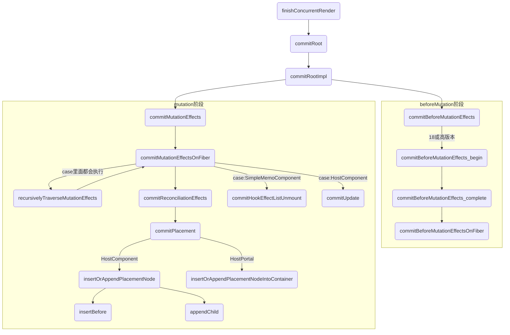
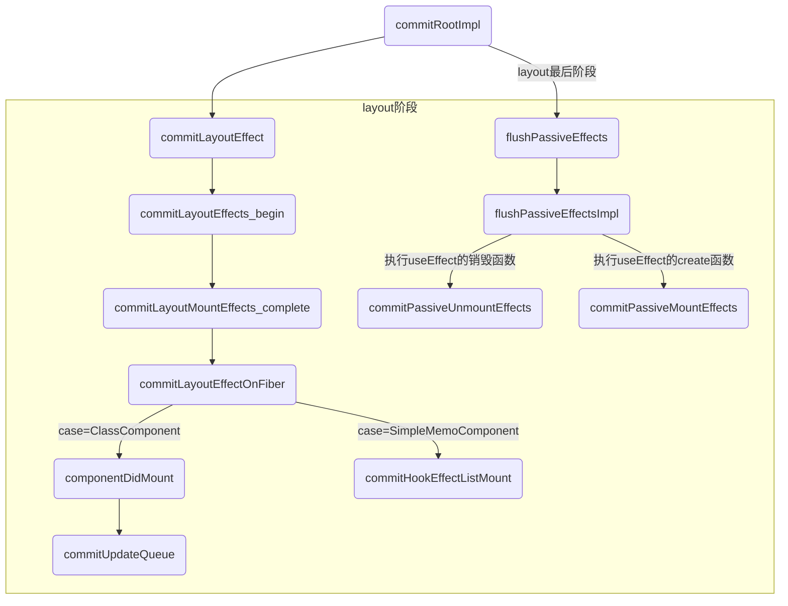

## 两个阶段区别
1. `render 阶段的工作可以分为递阶段和归阶段作用：`
    * 其中递阶段会执行 beginWork()
    * 归阶段会执行 completeWork()

2. render/reconciliation阶段的工作（diff）可以拆分，commit阶段的工作（patch）不可拆分

commit阶段的工作（patch）把本次更新中的所有DOM change应用到DOM树，是一连串的DOM操作。

DOM操作虽然看起来也可以拆分（按照change list一段一段做），但这样做一方面可能造成DOM实际状态与维护的内部状态不一致，另外还会影响体验。而且，一般场景下，DOM更新的耗时比起diff及生命周期函数耗时不算什么，拆分的意义不很大
## commit阶段:可以分为3个阶段
1. Before mutation 阶段（执行 DOM 操作前）；
    - 对于类组件，执行 getSnapshotBeforeUpdate 生命周期
    - 对于函数组件，异步调用 useEffect

2. mutation 阶段（执行 DOM 操作）；
    - 进行真实的 DOM 操作

3. layout 阶段（执行 DOM 操作后）
    - 对于类组件，会执行setState的callback
    - 对于函数组件，会执行useLayoutEffect

在render阶段结束后，会进入commit阶段，该阶段不可中断,commit阶段的调度优先级采用的是最高优先级，以保证commit阶段同步执行不可被打断。

主要是去依据workInProgress树中有变化的那些节点（render阶段的completeWork过程收集到的effect链表）,去完成DOM操作，将更新应用到页面上，除此之外，还会异步调度useEffect以及同步执行useLayoutEffect。

相应的节点进行提交，渲染到页面上,在commit阶段就会操作真实节点，将它们插入到dom树中

### `提示:接下来的流程开log会比较清晰`

## 流程图-commit阶段之beforeMutation和mutation阶段

## 流程图-commit阶段之layout最后阶段

