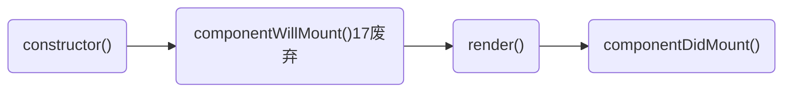
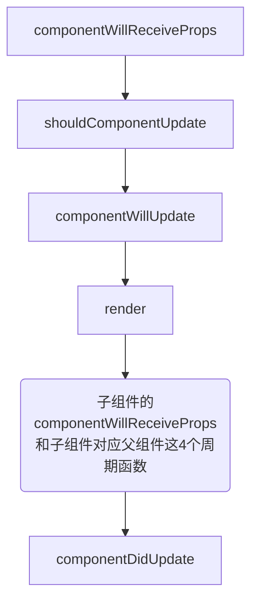

## useEffect 模拟生命周期
```js
React.useEffect(() => {
  console.log('Sub=副作用-useEffect-->运行');
}, [])

React.useEffect(() => {
  console.log('Sub=useEffect不依赖-模拟组件更新-->运行');
})
```
>第一个useEffect会在第二个useEffect之前执行。
>第一个useEffect中的函数会在组件挂载时执行，因为它没有依赖项，所以只会执行一次。 
第二个useEffect中的函数会在每次组件渲染时执行，包括挂载时，因为它没有依赖项，所以也会执行一次。

- 第二个参数传递一个空数组, 模拟 componentDidMount

- 第二个参数传递依赖项，模拟 componentDidUpdate

- 第二个参数传递一个空数组，并且里面通过 return 的形式去调用一个方法，模拟 componentWillUnmount

- React.useMemo

```js
useMemo(
  () => () => {
    console.log("组件dom节点没有渲染之前调用一次");
  },
  []
);

const renderDom = useMemo(
  () => () => {
    console.log("组件dom节点没有渲染之前根据依赖参数props调用");
  },
  [props]
);
```

- React.useCallback

```js
const handleClick = React.useCallback(() => {
  console.log("监听事件通过钩子函数包裹，优化性能");
}, []);
```

```js
// 1. componentDidMount 和 componentWillUnmount
// 通过使用 Hook，你可以把组件内相关的副作用组织在一起（例如创建订阅及取消订阅），而不要把它们拆分到不同的生命周期函数里
useEffect(() => {
  console.log("componentDidMount");
  return () => {
    console.log("will unmount");
  };
}, []);

// 2. componentDidUpdate 1
useEffect(() => {
  document.title = `You clicked ${count} times`;
  return () => {
    // componentWillUnmount 执行的内容
  };
}, [count]);

// 3. componentDidUpdate 2
useEffect(() => console.log("mounted or updated"));

// shouldComponentUpdate, 只有 Parent 组件中的 count state 更新了，Child 才会重新渲染，否则不会。
/*
 * React.memo 包裹一个组件来对它的 props 进行浅比较,但这不是一个 hooks，因为它的写法和 hooks 不同,其实React.memo 等效于 PureComponent，但它只比较 props。
 * */
function Parent() {
  const [count, setCount] = useState(0);
  const child = useMemo(() => <Child count={count} />, [count]);

  return <>{count}</>;
}

function Child(props) {
  return <div>Count:{props.count}</div>;
}
```

## 类组件生命周期

初始化：



父组件的 state 改变:



### React 15 中的生命周期调用

1. `getDefaultProps()`：此方法用于获取组件的默认属性值。这个方法只会在组件的创建阶段被调用一次。

2. `getInitialState()`：此方法用于获取组件的初始状态值。这个方法只会在组件的创建阶段被调用一次。

3. `componentWillMount()`：此方法在组件即将被挂载到 DOM 上时被调用，可以进行一些组件的初始化操作。

4. `render()`：此方法用于渲染组件，返回一个虚拟 DOM 树。

5. `componentDidMount()`：此方法在组件挂载到 DOM 上之后被调用，可以进行一些操作，例如设置定时器等。

6. `componentWillReceiveProps(nextProps)`：此方法在组件接收到新的属性值时被调用。

7. `shouldComponentUpdate(nextProps, nextState)`：此方法在组件接收到新的属性值或状态值时被调用，用于判断是否需要重新渲染组件。

8. `componentWillUpdate(nextProps, nextState)`：此方法在组件即将被重新渲染时被调用，可以进行一些操作，例如记录当前滚动位置等。

9. `render()`：此方法用于重新渲染组件，返回一个新的虚拟 DOM 树。

10. `componentDidUpdate(prevProps, prevState)`：此方法在组件重新渲染之后被调用，可以进行一些操作，例如更新滚动位置等。

11. `componentWillUnmount()`：此方法在组件被卸载之前被调用，可以进行一些清理操作，例如清除定时器、取消网络请求等。

### react17 生命周期调用流程

React 17 的生命周期包括以下方法：

1. constructor(props)

   - 在组件被创建时调用，用于初始化组件的状态和绑定方法。

2. static getDerivedStateFromProps(props, state)

   - 在组件接收到新的 props 时被调用，用于根据 props 更新组件的状态。这个方法返回一个对象，用于更新组件的 state，或者返回 null 表示不需要更新。

3. render()

   - 根据组件的 props 和 state 来渲染组件的 UI。

4. componentDidMount()

   - 在组件挂载到 DOM 后被调用，可以进行一些副作用操作，如向服务器请求数据、添加事件监听器等。

5. shouldComponentUpdate(nextProps, nextState)

   - 在组件接收到新的 props 或 state 时被调用，用于判断是否需要重新渲染组件。如果返回 true，则会继续执行后面的生命周期方法，如果返回 false，则组件不会被更新。

6. getSnapshotBeforeUpdate(prevProps, prevState)

   - 在组件更新之前被调用，可以用来获取更新前的 DOM 信息，比如滚动位置等。这个方法返回的值会传递给 componentDidUpdate 方法。

7. componentDidUpdate(prevProps, prevState, snapshot)

   - 在组件更新后被调用，可以进行一些副作用操作，如向服务器请求数据、添加事件监听器等。snapshot 参数是 getSnapshotBeforeUpdate 方法返回的值。

8. componentWillUnmount()
   - 在组件卸载之前被调用，可以进行一些清理工作，如取消事件监听器、清除定时器等。

注意：在 React 17 中，已经将 UNSAFE 前缀的生命周期方法移除了，所以不再需要使用 UNSAFE_componentWillMount、UNSAFE_componentWillUpdate 和 UNSAFE_componentWillReceiveProps 等生命周期方法。

### React 17/React 16.3 开始废弃三个钩子函数:

```
componentWillMount
componentWillReceiveProps-->使用static getDerivedStateFromProps()来替代
componentWillUpdate
```

### constructor()

组件创建时调用，通常用于初始化 state 和绑定事件处理程序。

### static getDerivedStateFromProps(props, state)

当组件实例化或接收到新 props 时调用，用于更新 state。

此生命周期方法在组件实例化和更新时都会被调用，用于计算和返回新的状态值。当我们接收到新的属性想去修改我们 state，可以使用 getDerivedStateFromProps

### render()

必须实现的方法，返回要在页面上呈现的 JSX。此生命周期方法在组件实例化和更新时都会被调用，用于渲染组件。

react 重要的步骤，创建虚拟 dom，进行 diff 算法，更新 dom 树都在此进行。

### componentDidMount()

组件已经渲染到 DOM 中后调用，通常用于发起网络请求或订阅事件等。

### shouldComponentUpdate(nextProps, nextState)

在组件接收到新 props 或 state 更新时调用，在组件更新前调用，true 表示会触发重新渲染，false 表示不会触发重新渲染，默认返回 true。

### getSnapshotBeforeUpdate(prevProps, prevState)

在组件更新前调用，可以获取当前 DOM 信息，通常用于实现 scroll 位置的保存和恢复。

```
该方法自React 17.0版本开始已被废弃。如果您尝试在React应用程序中使用getSnapshotBeforeUpdate方法，将会收到一个警告。

在React 17.0版本之后，建议使用componentDidUpdate生命周期方法替代getSnapshotBeforeUpdate方法，因为这个方法有更好的可读性和更清晰的用法。

如果您在React 17.0版本之前编写了代码，并且仍然需要使用getSnapshotBeforeUpdate方法，则可以继续使用它。然而，建议在未来的版本中尽早更新代码，以避免可能的问题和错误。
```

### componentDidUpdate(prevProps, prevState, snapshot)

在组件更新后调用，通常用于更新 DOM 或执行一些副作用操作。

### componentWillUnmount()

在组件卸载时调用，通常用于清理副作用操作，比如取消订阅或清除定时器等。

### getDerivedStateFromProps 介绍

/dəˈrīv/
父组件是否传递 props，getDerivedStateFromProps()都会被执行。Derived，英文翻译为“衍生的”。顾名思义，就是对 props 进行加工，然后生成新的 state 数据。

在 React 17 中，官方推荐使用静态方法 getDerivedStateFromProps 替代原来的生命周期方法 componentWillReceiveProps。而在 React 18 中，官方已经将 getDerivedStateFromProps 标记为弃用方法，建议使用其他替代方案，如组合、状态提升或钩子函数等。

```js
import React, { useState, useEffect } from "react";

function MyComponent(props) {
  const [state, setState] = useState(props.initialState);

  useEffect(() => {
    setState(props.initialState);
  }, [props.initialState]);
}
```

在挂载角度来看的话，排在 render 之前。

```js
(constructor) => (getDerivedStateFromProps) => (render) => componentDidMount;
```

在更新角度（无论 state/props 引起的更新）来看的话，排在 shouldComponentUpdate 之前。

```js
(getDerivedStateFromProps) =>
  (shouldComponentUpdate) =>
  (render) =>
  (getSnapshotBeforeUpdate) =>
    componentDidUpdate;
```

使用例子：组件会根据传入的 props 更新内部的 state 状态。在 getDerivedStateFromProps 方法中，检查 props.count 是否与 state.count 相同，如果不同，则返回一个新的状态对象，将 props.count 更新到组件的状态中。在 render 方法中，组件会根据最新的 state 状态来渲染组件。

如果 props 传入的内容不需要影响到你的 state，那么就需要返回一个 null

```js
class MyComponent extends React.Component {
  static getDerivedStateFromProps(props, state) {
    // 根据props更新state中的count状态
    if (props.count !== state.count) {
      return {
        count: props.count,
      };
    }
    return null;
  }

  constructor(props) {
    super(props);
    this.state = {
      count: props.count,
    };
  }

  render() {
    return <div>Count: {this.state.count}</div>;
  }
}
```
