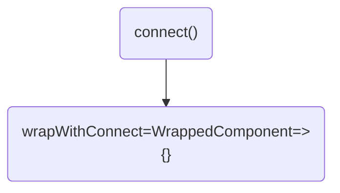
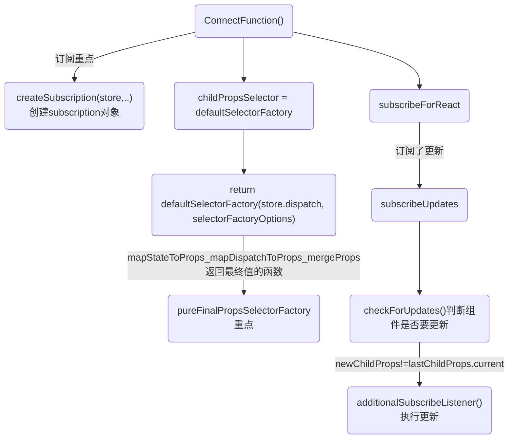

## redux实现原理,context全局分发，订阅模式以通知 React 组件重新渲染
使用redux、useContext时，状态树发送变动，只会更新使用了此状态的组件，其它组件不会更新。
>redux、useContext中状态的修改需要发出dispatch，通过触发action来修改。不能直接修改Store，那么可以通过dispatch、action追溯状态的变化。

1. 顶层分发状态，这是实现订阅的起点。Provider 组件：Redux-React的Provider组件是React应用的根组件之一。它使用React的上下文（context）功能将Redux存储（store）传递给整个组件树，使得组件可以访问Redux存储。在Provider中，Redux store被传递为props，然后通过React的context传播给所有子组件。
2. connect 函数：connect是Redux-React的主要函数，它用于将React组件连接到Redux存储。connect接受两个参数：mapStateToProps和mapDispatchToProps。mapStateToProps定义了如何将Redux状态映射到组件的props，而mapDispatchToProps定义了如何将Redux操作映射到组件的props。connect函数返回一个高阶组件，它包装了目标组件，并在目标组件中注入Redux的状态和操作。

当组件通过 connect 连接到 Redux store 时，它会通过上下文获取 store，ConnectFunction函数进行订阅。
```js
function ConnectFunction(props) {
  // 省略代码
  const [subscription, notifyNestedSubs] = useMemo(() => {
    console.log('=react-redux=ConnectFunction=阅的重点')
    if (!shouldHandleStateChanges) return NO_SUBSCRIPTION_ARRAY; // This Subscription's source should match where store came from: props vs. context. A component
    // connected to the store via props shouldn't use subscription from context, or vice versa.

    const subscription = createSubscription(store, didStoreComeFromProps ? undefined : contextValue.subscription); // `notifyNestedSubs` is duplicated to handle the case where the component is unmounted in
    // the middle of the notification loop, where `subscription` will then be null. This can
    // probably be avoided if Subscription's listeners logic is changed to not call listeners
    // that have been unsubscribed in the  middle of the notification loop.

    const notifyNestedSubs = subscription.notifyNestedSubs.bind(subscription);
    return [subscription, notifyNestedSubs];
  }, [store, didStoreComeFromProps, contextValue]); // Determine what {store, subscription} value should be put into nested context, if necessary,
}
```

最终形成了这样的收集顺序:
```
根 <-- 父 <-- 子
```
根收集的更新方法会由 redux 触发，父收集的更新方法在父更新后再更新，于是保证了父节点被 redux 更新后,子节点才更新的顺序。


特点：
1. 数据流流动很自然，因为任何 dispatch 都会导致广播，需要依据对象引用是否变化来控制更新粒度。无副作用，可时间回溯，适合并发。
3. 如果充分利用时间回溯的特征，可以增强业务的可预测性与错误定位能力。
4. 时间回溯代价很高，因为每次都要更新引用，除非增加代码复杂度，或使用 immutable。
5. 时间回溯的另一个代价是 action 与 reducer 完全脱节，数据流过程需要自行脑补。原因是可回溯必然不能保证引用关系。
6. 引入中间件，其实主要为了解决异步带来的副作用。灵活利用中间件，可以通过约定完成许多复杂的工作。

## redux流程图



## 实例代码
[redux实例](https://github.com/huiruo/programming-tech-website/blob/main/project-workplace/react18-test/src/index.tsx)
```js
import React from 'react';
import ReactDOM from 'react-dom/client';
import { Provider } from 'react-redux';
import App from './App';
import store from './store';

const root = ReactDOM.createRoot(
  document.getElementById('root') as HTMLElement
);
root.render(
  <React.StrictMode>
    <Provider store={store}>
      <App />
    </Provider>
  </React.StrictMode>
);
```

组件：
```js
import React, { useState } from 'react';
import { connect } from 'react-redux';
import { onIncreaseAction } from '../../store/userActions';

interface Props {
  test: React.ReactNode
}

/**
 * Code annotation
 */
function Redux1(props: any) {
  const [val, setVal] = useState(1)

  const { increaseVal } = props

  const onIncrease = () => {
    props.onIncreaseAction && props.onIncreaseAction(increaseVal + 1)
  }

  console.log('=Redux1 render:', props)

  return (
    <div>
      同级组件
      <button onClick={onIncrease}>增加</button>
    </div>
  );
}

const mapDispatchToProps = (dispatch: any) => {
  return {
    onIncreaseAction: (data: string) => dispatch(onIncreaseAction(data)),
  };
};

const mapStateToProps = (state: any) => {
  return {
    increaseVal: state.userStore.increaseVal
  };
};

export default connect(mapStateToProps, mapDispatchToProps)(Redux1);
```

## redux api:
redux 依赖
```json
{
  "react-redux": "^8.0.5",
  "redux": "^4.2.0",
  "redux-thunk": "^2.4.2",
  "react": "^18.2.0",
}
```
* applyMiddleware
* bindActionCreators
* combineReducers
* compose
* createStore

### react-redux api:
components:
* Provider
* connect
* Context

connect:
* mapDispatchToProps
* mapStateToProps
* mergeProps
* selectorFactory
* verifySubselectors
* wrapMapToProps
hooks:
* useDispatch
* useReduxContext
* useSelector
* useStore

总览：
```js
export { Provider, ReactReduxContext, connect, useDispatch, createDispatchHook, useSelector, createSelectorHook, useStore, createStoreHook, shallowEqual };
```

1. 为什么要在 root 根组件上使用 react-redux 的 Provider 组件包裹?
2. react-redux 是怎么和 redux 契合，做到 state 改变更新视图的呢?
3. provide 用什么方式存放当前的 redux 的 store, 又是怎么传递给每一个需要订阅 state 的组件的?
4. connect 是怎么样连接我们的业务组件，然后更新已经订阅组件的呢?
5. connect 是怎么通过第一个参数mapStateToProps，来订阅与之对应的 state 的呢?
6. connect 怎么样将 props，和 redux的 state 合并的?

react 中能更新 redux 的 store，并能监听 store 的变化并通知 react 的相关组件更新，从而能让 react 将状态放在外部管理（有利于 model 集中管理，能利用 redux 单项数据流架构，数据流易预测易维护，也极大的方便了任意层级组件间通信

<!--  -->
### react-redux 是如何关联起 redux 和 react 的？
Provider 中有 Subscription 实例，connect 这个高阶组件中也有 Subscription 实例，并且有负责自身更新的 hooks: useReducer，useReducer 的 dispatch 会被注册进 Subscription 的 listeners。

listeners 中有一个方法 notify 会遍历调用每个 listener，notify 会被注册给 redux 的 subscribe，从而 redux 的 state 更新后会通知给所有 connect 组件，当然每个 connect 都有检查自己是否需要更新的方法 checkForUpdates 来避免不必要的更新。

### 总结Provider
`那具体这个组件想往下面透传什么呢?`

Provider 组件只是为了将 contextValue 透传下去，让子组件能够拿到 redux store、subscription 实例、服务器端状态函数。


模拟一下createStore的源码:
通过redux当中的createStore方法来创建一个store，它提供3个主要的方法:
```js
// 以下代码示例来自redux官方教程
const createStore = (reducer) => {
    let state;
    let listeners = [];

    // 用来返回当前的state
    const getState = () => state;

    // 根据action调用reducer返回新的state并触发listener
    const dispatch = (action) => {
        state = reducer(state, action);
        listeners.forEach(listener => listener());
    };
    
    /* 这里的subscribe有两个功能
     * 调用 subscribe(listener) 会使用listeners.push(listener)注册一个listener
     * 而调用 subscribe 的返回函数则会注销掉listener
     */
    const subscribe = (listener) => {
        listeners.push(listener);
        return () => {
            listeners = listeners.filter(l => l !== listener);
        };
    };

    return { getState, dispatch, subscribe };
};
```

## Provider 完整函数
Provider调用React.createElement() 返回children 外面加了一层 Context Provider, 由store、subscription、getServerState组成的对象:
* store是 redux 的 store，是开发者通过 store prop 传给 Provider 组件的。
* subscription 是由 createSubscription 这个对象工厂创建的，它生成了 subscription 对象，它是后续嵌套收集订阅的关键
* getServerState是 8.0.0 版本新加的，它用于在 SSR 中，当初始『注水』hydrate 时获取服务器端状态快照的，以便保证两端状态一致性。它的控制权完全在开发者，只要把状态快照通过 serverState 这个 prop 给 Provider 组件即可


>源代码见：

```
project-workplace/redux-test/react.development18.js

4730行，我把整个redux代码迁移到了react.development18.js,方便调试
```


```js
function Provider({
  store,
  context,
  children,
  serverState
}) {
  const contextValue = useMemo(() => {
    const subscription = createSubscription(store);
    return {
      store,
      subscription,
      getServerState: serverState ? () => serverState : undefined
    };
  }, [store, serverState]);

  const previousState = useMemo(() => store.getState(), [store]);

  useIsomorphicLayoutEffect(() => {
    const {
      subscription
    } = contextValue;
    subscription.onStateChange = subscription.notifyNestedSubs;
    subscription.trySubscribe();

    if (previousState !== store.getState()) {
      subscription.notifyNestedSubs();
    }

    return () => {
      subscription.tryUnsubscribe();
      subscription.onStateChange = undefined;
    };
  }, [contextValue, previousState]);

  const Context = context || ReactReduxContext; // @ts-ignore 'AnyAction' is assignable to the constraint of type 'A', but 'A' could be instantiated with a different subtype

  console.log('%c=Provider=调用React.createElement参数Context.Provider:', 'color:yellow', Context.Provider, {
    value: contextValue
  }, 'children:', children)

  const providerRes = /*#__PURE__*/React.createElement(Context.Provider, {
    value: contextValue
  }, children);

  console.log('%c=Provider=调用React.createElement 返回一个组件:', 'color:yellow', providerRes)

  return providerRes
}
```

### Provider 组件执行useIsomorphicLayoutEffect
获取了一次最新 state 并命名为 previousState，只要 store 单例不发生变化，它是不会更新的。一般项目中也不太会改变 redux 单例。

useIsomorphicLayoutEffect 从 isomorphic 的命名也可以看出它是和同构相关的。
* server 环境时使用 useEffect
* 在浏览器环境时使用 useLayoutEffect
```js
const useIsomorphicLayoutEffect = canUseDOM ? useLayoutEffect : useEffect;
```

但是这样做的原因并不简单：首先，在服务端使用 useLayoutEffect 会抛出警告，为了绕过它于是在服务端转而使用 useEffect。

其次，为什么一定要在 useLayoutEffect/useEffect 里面做？
因为一个 store 更新可能发生在 render 阶段和副作用阶段之间，如果在 render 时就做，可能会错过更新，必须要确保 store subscription 的回调拥有来自最新更新的 selector。同时还要确保 store subscription 的创建必须是同步的，否则一个 store 更新可能发生在订阅之前（如果订阅是异步的话），这时订阅还没有被创建，从而有了不一致的状态。

Provider 在 useIsomorphicLayoutEffect 主要工作：
```js
useIsomorphicLayoutEffect(() => {
  const {
    subscription
  } = contextValue;
  subscription.onStateChange = subscription.notifyNestedSubs;
  subscription.trySubscribe();

  console.log('%c=Provider=useIsomorphicLayoutEffect会在最后组件commit被调用', 'color:yellow')

  if (previousState !== store.getState()) {
    subscription.notifyNestedSubs();
  }

  return () => {
    subscription.tryUnsubscribe();
    subscription.onStateChange = undefined;
  };
}, [contextValue, previousState]);
```

首先收集 subscription 的订阅，然后看最新的状态和之前在 render 的状态是否一致，如果不一致则通知更新。

如果这一段不放在 useLayoutEffect/useEffect 里，而是放在 render 里，那么现在仅仅订阅了它自己，它的子组件并没有订阅，如果子组件在渲染过程中更新了 redux store，那么子组件们就错过了更新通知。

`同时 react 的 useLayoutEffect/useEffect 是自下而上调用的，子组件的先调用，父组件的后调用。这里由于是 react-redux 的根节点了，它的 useLayoutEffect/useEffect 会在最后被调用，`这时能确保子组件该注册订阅的都注册了，同时也能确保子组件渲染过程中可能发生的更新都已经发生了。所以再最后读取一次 state，比较一下是否要通知它们更新。这就是为什么要选择 useLayoutEffect/useEffect。

首先是设置 subscription 的 onStateChange（它初始是个空方法，需要注入实现），它会在触发更新时调用，它这里希望将来调用的是subscription.notifyNestedSubs，subscription.notifyNestedSubs会触发这个 subscription 收集的所有子订阅。也就是说这里的更新回调和『更新』没有直接关系，而是触发子节点们的更新方法。

然后调用了subscription.trySubscribe()，它会将自己的 onStateChange 交给父级 subscription 或者 redux 去订阅，将来由它们触发 onStateChange

最后它会判断之前的 state 和最新的是否一致，如果不一致会调用subscription.notifyNestedSubs()，它会触发这个 subscription 收集的所有子订阅从而更新它们。

返回了注销相关的函数，它会注销在父级的订阅，将subscription.onStateChange重新置为空方法。这个函数会在组件卸载或 re-render （仅 store 变化时）时被调用（react useEffect 的特性）。

Provider 有很多地方都涉及到了 subscription，subscription 的那些方法只是讲了大概功能，关于 subscription 的细节会在后面 subscription 的部分讲到。

## Subscription/createSubscription 订阅工厂函数
Provider 中出镜率很高的 subscription 部分，它是 react-redux 能够嵌套收集订阅的关键。

其实这个部分的标题叫做 Subscription 已经不太合适了，在 8.0.0 版本之前，react-redux 确实是通过 Subscription class 实现它的，你可以通过new Subscription()使用创建 subscription 实例。但在 8.0.0 之后，已经变成了createSubscription函数创建 subscription 对象，内部用闭包替代原先的属性。

用函数替代 class 有一个好处是，不需要关心 this 的指向，`函数返回的方法修改的永远是内部的闭包，不会出现 class 方法被赋值给其他变量后出现 this 指向变化的问题，`降低了开发时的心智负担。闭包也更加私有化，增加了变量安全

Provider-->createSubscription(store) 返回contextValue
```js
const contextValue = useMemo(() => {
  const subscription = createSubscription(store);
  return {
    store,
    subscription,
    getServerState: serverState ? () => serverState : undefined
  };
}, [store, serverState]);
```

### createSubscription-->subscription返回的数据结构
```js
const subscription = {
  addNestedSub,
  notifyNestedSubs,
  handleChangeWrapper,
  isSubscribed,
  trySubscribe,
  tryUnsubscribe,
  getListeners: () => listeners
};
```

注：下文出现的『订阅回调』具体是指，redux 状态更新后触发的组件的更新方法。组件更新方法被父级订阅收集，是订阅发布模式。

## createSubscription 完整函数
>源代码见：

```
project-workplace/redux-test/react.development18.js

4730行，我把整个redux代码迁移到了react.development18.js,方便调试
```

每个subscription收集订阅实则是维护了一个双向链表。

createSubscription函数是一个对象工厂，它定义了一些变量和方法，然后返回一个拥有这些方法的对象subscription
```js
function createSubscription(store, parentSub) {
  let unsubscribe;
  let listeners = nullListeners;
  // 收集订阅
  function addNestedSub(listener) {
    trySubscribe();
    return listeners.subscribe(listener);
  }
  // 通知订阅
  function notifyNestedSubs() {
    listeners.notify();
  }
  // 自己的订阅回调
  function handleChangeWrapper() {
    if (subscription.onStateChange) {
      subscription.onStateChange();
    }
  }
  // 判断自己是否被订阅
  function isSubscribed() {
    return Boolean(unsubscribe);
  }
  // 让自己被父级订阅
  function trySubscribe() {
    if (!unsubscribe) {
      unsubscribe = parentSub ? parentSub.addNestedSub(handleChangeWrapper) : store.subscribe(handleChangeWrapper);
      listeners = createListenerCollection();
    }
  }
  // 从父级注销自己的订阅
  function tryUnsubscribe() {
    if (unsubscribe) {
      unsubscribe();
      unsubscribe = undefined;
      listeners.clear();
      listeners = nullListeners;
    }
  }

  console.log('%c=调用createSubscription参数store, parentSub', 'color:red',)

  const subscription = {
    addNestedSub,
    notifyNestedSubs,
    handleChangeWrapper,
    isSubscribed,
    trySubscribe,
    tryUnsubscribe,
    getListeners: () => listeners
  };
  return subscription;
}
```


### 1-1.handleChangeWrapper 自己的订阅回调
其内部实际调用了onStateChange方法。
>究其原因是因为在订阅回调被父级收集时，可能自己的回调还没有确定，所以定义了一个外壳用于被收集，内部的回调方法在确定时会被重置，但外壳的引用不变，所以将来依然可以触发回调。这也是为什么在Provider.ts的源码里，在收集订阅之前先做一下subscription.onStateChange = subscription.notifyNestedSubs的原因。
```js
// 自己的订阅回调
function handleChangeWrapper() {
  if (subscription.onStateChange) {
    subscription.onStateChange();
  }
}
```

### 1-2.trySubscribe 让自己被父级订阅
它的作用是让父级的 subscription 收集自己的订阅回调。首先它会判断如果unsubscribe标志了它已经被订阅了，那么不做任何事。其次它会判断当时创建subscription时的第二个参数parentSub是否为空，如果有parentSub则代表它上层有父级subscription，那么它会调用父级的addNestedSub方法，将自己的订阅回调注册给它；否则则认为自己在顶层，所以注册给 redux store。
```js
function trySubscribe() {
  if (!unsubscribe) {
    unsubscribe = parentSub ? parentSub.addNestedSub(handleChangeWrapper) : store.subscribe(handleChangeWrapper);
    listeners = createListenerCollection();
  }
}
```

### 1-3.addNestedSub 收集订阅
```js
// 收集订阅
function addNestedSub(listener) {
  trySubscribe();
  return listeners.subscribe(listener);
}
```
addNestedSub非常巧妙的运用了递归，它里面又调用了trySubscribe。于是它们就会达到这样的目的，当最底层subscription发起trySubscribe想被父级收集订阅时，它会首先触发父级的trySubscribe并继续递归直到根subscription，如果我们把这样的层级结构想象成树的话（其实 subscription.trySubscribe 也确实发生在组件树中），那么就相当于从根节点到叶子节点依次会被父级收集订阅。因为这是由叶子节点先发起的，这时除了叶子节点，其他节点的订阅回调还没有被设置，所以才设计了handleChangeWrapper这个回调外壳，注册的只是这个回调外壳，在将来非叶子节点设置好回调后，能被外壳触发。

在『递』过程结束后，从根节点开始到这个叶子节点的订阅回调handleChangeWrapper都正在被父级收集了，『归』的过程回溯做它的本职工作return listeners.subscribe(listener)，将子subscription的订阅回调收集到收集器listeners中（将来更新发生时会触发相关的handleChangeWrapper，而它会间接的调用收集到所有的 listener）。

所以每个subscription的addNestedSub都做了两件事：1. 让自己的订阅回调先被父级收集；2. 收集子subscription的订阅回调。

结合addNestedSub的解释再回过头来看trySubscribe，它想让自己的订阅回调被父级收集，于是当它被传入父级subscription时，就会调用它的addNestedSub，这会导致从根subscription开始每一层subscription都被父级收集了回调，于是每个subscription都嵌套收集了它们子subscription，从而父级更新后子级才更新成为了可能。同时，因为unsubscribe这个锁的存在，如果某个父级subscription的trySubscribe被调用了，并不会重复的触发这个『嵌套注册』。

上面我们分析了『嵌套注册』时发生了什么，下面我们看看注册的实质性操作listeners.subscribe干了什么，注册的数据结构又是如何设计的。

### 1-4.trySubscribe-->createListenerCollection
所以每个 subscription 收集订阅实则是维护了一个双向链表。

listeners对象是由 createListenerCollection 创建的。listeners方法不多且逻辑易懂，是由clear、notify、get、subscribe组成的。

listeners 负责收集 listener（也就是订阅回调） ，listeners 内部将 listener 维护成了一个双向链表，头结点是first，尾节点是last。
```js
// 让自己被父级订阅
function trySubscribe() {
  if (!unsubscribe) {
    unsubscribe = parentSub ? parentSub.addNestedSub(handleChangeWrapper) : store.subscribe(handleChangeWrapper);
    console.log('%c=react-redux=createSubscription调用createListenerCollectionlisteners对象', 'color:cyan')
    listeners = createListenerCollection();
  }
}

function createListenerCollection() {
  // 对listener的收集，listener是一个双向链表
  const batch = getBatch();
  let first = null;
  let last = null;

  console.log('%c=react-redux=createListener创建listeners对象', 'color:cyan')

  return {
    clear() {
      first = null;
      last = null;
    },
    // 触发链表所有节点的回调
    notify() {
      batch(() => {
        let listener = first;
        console.log('%c=react-redux=notify触发链表所有节点的回调', 'color:blueviolet')

        while (listener) {
          listener.callback();
          listener = listener.next;
        }
      });
    },
    // 以数组的形式返回所有节点
    get() {
      let listeners = [];
      let listener = first;

      while (listener) {
        listeners.push(listener);
        listener = listener.next;
      }

      return listeners;
    },
    // 向链表末尾添加节点，并返回一个删除该节点的undo函数
    subscribe(callback) {
      let isSubscribed = true;
      let listener = last = {
        callback,
        next: null,
        prev: last
      };

      if (listener.prev) {
        listener.prev.next = listener;
      } else {
        first = listener;
      }

      return function unsubscribe() {
        if (!isSubscribed || first === null) return;
        isSubscribed = false;

        if (listener.next) {
          listener.next.prev = listener.prev;
        } else {
          last = listener.prev;
        }

        if (listener.prev) {
          listener.prev.next = listener.next;
        } else {
          first = listener.next;
        }
      };
    }

  };
}
```

### 1-5.notify触发链表所有节点的回调
用于遍历调用链表节点，batch这里可以简单的理解为调用入参的那个函数，其中的细节可以衍生出很多 React 原理（如批量更新、fiber 等），放在文章的最后说。
```js
// 触发链表所有节点的回调
notify() {
  batch(() => {
    let listener = first;
    console.log('%c=react-redux=notify触发链表所有节点的回调', 'color:blueviolet')

    while (listener) {
      listener.callback();
      listener = listener.next;
    }
  });
},
```

### 1-6.subscribe
用于向 listeners 链表添加一个订阅以及返回一个注销订阅的函数，涉及链表的增删操作
```js
// 用于向 listeners 链表添加一个订阅以及返回一个注销订阅的函数，涉及链表的增删操作
subscribe(callback) {
  console.log('=react-redux=subscribe向 listeners 链表添加一个订阅以及返回一个注销订阅的函数，涉及链表的增删操作', 'color:blueviolet')
  let isSubscribed = true;
  // 创建一个链表节点
  let listener = last = {
    callback,
    next: null,
    prev: last
  };
  // 如果链表已经有了节点
  if (listener.prev) {
    listener.prev.next = listener;
  } else {
    // 如果链表还没有节点，它则是首节点
    first = listener;
  }
  // unsubscribe就是个双向链表的删除指定节点操作
  return function unsubscribe() {
    // 阻止无意义执行
    if (!isSubscribed || first === null) return;
    isSubscribed = false;
    // 如果添加的这个节点已经有了后续节点
    if (listener.next) {
      listener.next.prev = listener.prev;
    } else {
      // 没有则说明该节点是最后一个，将prev节点作为last节点
      last = listener.prev;
    }

    // 如果有前节点prev
    if (listener.prev) {
      // prev的next应该为该节点的next
      listener.prev.next = listener.next;
    } else {
      // 否则说明该节点是第一个，把它的next给first
      first = listener.next;
    }
  };
}
```

### subscription最后需要说的的部分只有 notifyNestedSubs 和 tryUnsubscribe
notifyNestedSubs调用了listeners.notify，根据上面有关 listeners 的分析，这里会遍历调用所有的订阅

tryUnsubscribe则是进行注销相关的操作，this.unsubscribe在trySubscribe方法的执行中被注入值了，它是addNestedSub或者redux subscribe函数的返回值，是取消订阅的 undo 操作。在this.unsubscribe()之下的分别是清除unsubscribe、清除listeners操作。
```js
// 通知订阅
function notifyNestedSubs() {
  console.log('=react-redux=notifyNestedSubs调用listeners.notify()通知订阅')
  listeners.notify();
}

// 从父级注销自己的订阅
function tryUnsubscribe() {
  if (unsubscribe) {
    unsubscribe();
    unsubscribe = undefined;
    listeners.clear();
    listeners = nullListeners;
  }
}
```

### 总结
subscription就分析完了，它主要用于在嵌套调用时，可以嵌套收集订阅，以此做到父级更新后才执行子节点的订阅回调从而在父级更新之后更新。

不太清楚 react-redux 的人可能会疑惑，不是只有Provider组件使用了subscription吗，哪里来的嵌套调用？哪里来的收集子订阅？不要着急，后续讲到connect高阶函数，它里面也用到了subscription，就是这里嵌套使用的。

## redux 原理之 connect 高阶组件
### redux容器组件和展示组件
react-redux 提供的 connect 函数，可以把 React 组件和 Redux 的 store 链接起来生成一个新的容器组件(这里有个经典的设计模式 “高阶组件”)

数据如何获取就是容器组件需要负责的事情，在获取到数据后通过 props 属性传递到展示组件，当展示组件需要变更状态时调用容器组件提供的方法同步这些
状态变化。

总结下来，容器组件需要做两件事： 
- 从 Redux 的 store 中获取数据给到展示组件，对应下例 mapStateToProps() 方法。
- 提供方法供展示组件同步需要变更的状态，对应下例 mapDispatchToProps() 方法。
### connect做了什么
```js
connect(mapStateToProps, mapDispatchToProps, mergeProps, connectOptions)(Component)，
```

> 接收mapStateToProps、mapDispatchToProps等参数，返回一个接收Component参数的高阶函数，这个函数最终返回JSX.Element。

如果把 connect 做的事情分解的话:
* 向父级订阅自己的更新
* 从 redux store select 数据、判断是否需要更新等其他细节

### connect省略函数
```js
function connect(mapStateToProps, mapDispatchToProps, mergeProps, {
  pure,
  areStatesEqual = strictEqual,
  areOwnPropsEqual = shallowEqual,
  areStatePropsEqual = shallowEqual,
  areMergedPropsEqual = shallowEqual,
  forwardRef = false,
  context = ReactReduxContext
} = {}) {
  // if (process.env.NODE_ENV !== 'production') {
  if (pure !== undefined && !hasWarnedAboutDeprecatedPureOption) {
    hasWarnedAboutDeprecatedPureOption = true;
    warning('The `pure` option has been removed. `connect` is now always a "pure/memoized" component');
  }
  // }
  console.log('%c=react-redux=connect', 'color:chartreuse')
  const Context = context;
  const initMapStateToProps = mapStateToPropsFactory(mapStateToProps);
  const initMapDispatchToProps = mapDispatchToPropsFactory(mapDispatchToProps);
  const initMergeProps = mergePropsFactory(mergeProps);
  const shouldHandleStateChanges = Boolean(mapStateToProps)
  // 省略代码
}
```

### 1-2.connect 的 selector
```js
const selectorFactoryOptions = {
  shouldHandleStateChanges,
  displayName,
  wrappedComponentName,
  WrappedComponent,
  // @ts-ignore
  initMapStateToProps,
  // @ts-ignore
  initMapDispatchToProps,
  initMergeProps,
  areStatesEqual,
  areStatePropsEqual,
  areOwnPropsEqual,
  areMergedPropsEqual
};

const childPropsSelector = useMemo(() => {
  return defaultSelectorFactory(store.dispatch, selectorFactoryOptions);
}, [store]);

const actualChildPropsSelector = childPropsSelector(
  store.getState(),
  wrapperProps
);
```

connect 函数里面 initMapStateToProps、initMapDispatchToProps、initMergeProps这 3 个高阶函数，最终这些函数的目的是返回 select 的值

```js
function connect(mapStateToProps, mapDispatchToProps, mergeProps, {
  pure,
  areStatesEqual = strictEqual,
  areOwnPropsEqual = shallowEqual,
  areStatePropsEqual = shallowEqual,
  areMergedPropsEqual = shallowEqual,
  forwardRef = false,
  context = ReactReduxContext
} = {}) {

  // 省略代码
  const wrapWithConnect = WrappedComponent => {

  const wrappedComponentName = WrappedComponent.displayName || WrappedComponent.name || 'Component';
  const displayName = `Connect(${wrappedComponentName})`;
  const selectorFactoryOptions = {
    shouldHandleStateChanges,
    displayName,
    wrappedComponentName,
    WrappedComponent,
    // @ts-ignore
    initMapStateToProps,
    // @ts-ignore
    initMapDispatchToProps,
    initMergeProps,
    areStatesEqual,
    areStatePropsEqual,
    areOwnPropsEqual,
    areMergedPropsEqual
  };
}
```

<br />

## 问题
1. react-redux 是如何关联起 redux 和 react 的？
4. 能不能避免？

### 问题1.react redux不更新组件
```
将store设置为对象，组件调用action中方法更新store，但是组件内容并没有更新。

原因是 store是引用

store是字面变量的值时，地址会随值改变。

store为对象时，地址不变，就不会重新render。

解决方案，深拷贝处理
```


### 问题2.究竟是 redux 性能不好还是 react-redux 性能不好？
具体不好在哪里？

总之，当时我只粗读了整体逻辑，但是可以解答我上面的问题了：
1. react-redux 确实有可能性能不好。而至于 redux，每次 dispatch 都会让 state 去每个 reducer 走一遍，并且为了保证数据 immutable 也会有额外的创建复制开销。不过 mutable 阵营的库如果频繁修改对象也会导致 V8 的对象内存结构由顺序结构变成字典结构，查询速度降低，以及内联缓存变得高度超态，这点上 immutable 算拉回一点差距。不过为了一个清晰可靠的数据流架构，这种级别的开销在大部分场景算是值得，甚至忽略不计。

2. react-redux 性能具体不好在哪里？因为每个 connect 不管需不需要更新都会被通知一次，开发者定义的 selector 都会被调用一遍甚至多遍，如果 selector 逻辑昂贵，还是会比较消耗性能的。

3. 那么 react-redux 一定会性能不好吗？不一定，根据上面的分析，如果你的 selector 逻辑简单（或者将复杂派生计算都放在 redux 的 reducer 里，但是这样可能不利于构建一个合理的 model），connect 用的不多，那么性能并不会被 mobx 这样的细粒度更新拉开太多。也就是说 selector 里业务计算不复杂、使用全局状态管理的组件不多的情况下，完全不会有可感知的性能问题。那如果 selector 里面的业务计算复杂怎么办呢？能不能完全避免呢？当然可以，你可以用 reselect 这个库，它会缓存 selector 的结果，只有原始数据变化时才会重新计算派生数据。


## redux使用
* Store : 储存
```
createStore接受一个reducer作为参数，以后每当store.dispatch一个新的action，就会自动调用reducer,返回新的state
```
* Connect： 
   * 包装原组件，将state和action通过props的方式传入到原组件内部。
   * 监听store tree变化，使其包装的原组件可以响应state变化
```
当 redux store 中的 state 变化时，对应的mapStateToProps函数会被执行，如果mapStateToProps函数新返回的对象与之前对象浅比较相等(此时，如果是类组件可以理解为 shouldComponentUpdate 方法返回 false)，展示组件就不会重新渲染，否则重新渲染展示组件。
```
* Action : 动作
* Reducer : 见实例


通过react-redux做连接，使用Provider：从最外部封装了整个应用，并向connect模块传递store。
Connect： 
1. 包装原组件，将state和action通过props的方式传入到原组件内部。
2. 监听store tree变化，使其包装的原组件可以响应state变化

简单地说就是：
1.顶层分发状态，让React组件被动地渲染。
2.监听事件，事件有权利回到所有状态顶层影响状态。

1. Redux 的核心是一个 store。
2. action:action 是一个 JavaScript 对象，通常包含了 type、payload 等字段，用于描述发生的事件及相关信息

3. reducer：撸开袖子真刀实枪的就去干了，比如一连长要求增援，增援要求是100杆枪，团长马上就给你加了100杆枪送了过去。reducer 不是一个对象，而是一个返回更新后 state 的纯函数

5. connect方法理解：connect(mapStateToProps, mapDispatchToProps)(MyComponent)

connect是真正的重点，它是一个科里化函数，意思是先接受两个参数（数据绑定mapStateToProps和事件绑定mapDispatchToProps），再接受一个参数（将要绑定的组件本身）：

5. mapStateToProps：构建好Redux系统的时候，它会被自动初始化，但是你的React组件并不知道它的存在，因此你需要分拣出你需要的Redux状态，所以你需要绑定一个函数，它的参数是state，简单返回你关心的几个值。


### 2-1reducer 纯函数要保证以下两点：
reducer 根据 action 的响应决定怎么去修改 store 中的 state。编写 reducer 函数没那么复杂，倒要切记该函数始终为一个纯函数，应避免直接修改state。

1. 同样的参数，函数的返回结果也总是相同的。例如，根据上一个 state 和 action 也会返回一个新的 state，类似这样的结构(previousState, action) => newState。

2. 函数执行没有任何副作用，不受外部执行环境的影响。例如，不会有任何的接口调用或修改外部对象。


>reducer 函数选择器函数用于从 Redux 存储中提取特定数据，并在必要时执行计算。它用于为组件选择存储中的数据。

```js
const userStore = (
  state = initUserState,
  action: any
) => {

  const { payload, type } = action;

  switch (type) {
    case ON_INCREASE:
      console.log('ON_INCREASE', payload);
      const userState = { ...state, increaseVal: action.payload };

      return userState;
    case ON_INCREASE:
      console.log('ON_INCREASE');

      return {};
    default:
      return state;
  }
};

export default userStore; 
```


### 2-2.Store
store:首先要创建一个对象store，这个对象有各种方法，用来让外界获取Redux的数据（store.getState），或者让外界来修改Redux中的数据（store.dispatch）

在 reducer 纯函数中不允许直接修改 state 对象，每次都应返回一个新的 state。原生 JavaScript 中我们要时刻记得使用 ES6 的扩展符 ... 

或Object.assign() 函数创建一个新 state，但是仍然是一个浅 copy，遇到复杂的数据结构我们还需要做深拷贝返回一个新的状态，总之你要保证每次都返回一个新对象，一方面深拷贝会造成性能损耗、另一方面难免会忘记从而直接修改原来的 state。

## 2-3.Action
Action表示应用中的各类动作或操作，不同的操作会改变应用相应的state状态，说白了就是一个带type属性的对象
```js
import { Dispatch } from 'redux';
import {
  LOGIN_SUCCESS
} from './actiontypes';

export const loginAction = (data:string) => (dispatch: Dispatch) => {
  dispatch({
      type: LOGIN_SUCCESS,
      payload: data
  });
};
```

## mobx和redux

### mobx:响应式依赖状态
MobX 的理念是通过观察者模式对数据做出追踪处理，在对可观察属性作出变更或者引用的时候，触发其依赖的监听函数；整体的store注入机制采用react提供的context来进行传递;

Mobx虽然也是遵循了Flux思想，让数据和逻辑单向流动，但是，Mobx底层使用的还是数据劫持（Object.defineProperty / Proxy）。它任然支持直接修改数据并更新视图。

### 面向对象和函数式
mobx 和 redux 都是单向数据流，通过 action 触发全局 state 更新，然后通知视图。

redux 是每次返回一个全新的状态，一般搭配实现对象 immutable 的库来用。

mobx 每次都是修改的同一个状态对象，基于响应式代理，也就是 Object.defineProperty 代理 get、set 的处理，get 时把依赖收集起来，set 修改时通知所有的依赖做更新。


redux 那种方式每次都要返回一个新的对象，虽然可以用 immutable 的库来减少创建新对象的开销，但是比起 mobx 直接修改原对象来说，开销还是大一点。

而且 redux 通知依赖更新的时候是全部通知的，而 mobx 因为收集了每个属性的依赖，可以精准的通知。

所以 mobx 的性能会比 redux 高一些。

综上，mobx 和 redux 都是单向数据流，但是管理状态的思路上，一个是函数式的思想，通过 reducer 函数每次返回新的 state，一个是面向对象的思想，通过响应式对象来管理状态，这导致了状态组织方式上的不同(function/class)，而且 redux 创建新的 state 的开销还有通知所有依赖的开销都比 mobx 大，性能比 mobx 差一些。

### mobx
1. 数据流流动不自然，只有用到的数据才会引发绑定，局部精确更新，但免去了粒度控制烦恼。
2. 没有时间回溯能力，因为数据只有一份引用。 
3. 自始至终一份引用，不需要 immutable，也没有复制对象的额外开销。没有这样的烦恼，数据流动由函数调用一气呵成，便于调试。

不同：
Mobx 借助于装饰器的实现，使得代码更加简洁易懂。由于使用了可观察对象，所以 Mobx 可以做到直接修改状态，而不必像 Redux 一样编写繁琐的 actions 和 reducers。

简单的概括一下，一共有这么几个步骤：

1. 页面事件（生命周期、点击事件等等）触发 action 的执行。
2. 通过 action 来修改状态。
3. 状态更新后，computed 计算属性也会根据依赖的状态重新计算属性值。
4. 状态更新后会触发 reaction，从而响应这次状态变化来进行一些操作（渲染组件、打印日志等等）。

mobx Object.defineProperty 或者 Proxy。当 autorun 第一次执行的时候会触发依赖属性的 getter，从而收集当前函数的依赖。
```js
const person = observable({ name: 'tom' })
autorun(function func() {
    console.log(person.name)
})
```
在 autorun 里面:
```js
person.watches.push(func)
```
当依赖属性触发 setter 的时候，就会将所有订阅了变化的函数都执行一遍，从而实现了数据响应式。
```js
person.watches.forEach(watch => watch())
```

## 2.mobx使用
computed,reactions,actions,inject,observer,Provider

* Provider: 顶层提供store的服务，Provider store={store}

* inject: 注入Provider提供的store到该组件的props中，组件内部使用
inject 是一个高阶组件 高阶组件返回的是组件，作用在包装组件

### observable(value):可观察的状态
用法:
+ observable(value)
+ @observable classProperty = valu
Observable 值可以是JS基本数据类型、引用类型、普通对象、类实例、数组和映射。
```js
import { observable } from "mobx";

class Todo {
    id = Math.random();
    @observable title = "";
    @observable finished = false;
}
```

### Computed values(计算值)
通过@computed 装饰器或者利用 (extend)Observable 时调用 的getter / setter 函数来进行使用。
```js
class TodoList {
    @observable todos = [];
    @computed get unfinishedTodoCount() {
        return this.todos.filter(todo => !todo.finished).length;
    }
}
```

### Reactions(反应)
```
Reactions 和计算值很像，但它不是产生一个新的值，而是会产生一些副作用，比如打印到控制台、网络请求、递增地更新 React 组件树以修补DOM、等等。 简而言之，reactions 在 响应式编程和命令式编程之间建立沟通的桥梁
```

### react 中使用
(无状态函数)组件变成响应式组件，方法是在组件上添加 observer 函数/ 装饰器. observer由 mobx-react 包提供的。
```js
import React, {Component} from 'react';
import ReactDOM from 'react-dom';
import {observer} from 'mobx-react';

@observer
class TodoListView extends Component {
    render() {
        return <div>
            <ul>
                {this.props.todoList.todos.map(todo =>
                    <TodoView todo={todo} key={todo.id} />
                )}
            </ul>
            Tasks left: {this.props.todoList.unfinishedTodoCount}
        </div>
    }
}

const TodoView = observer(({todo}) =>
    <li>
        <input
            type="checkbox"
            checked={todo.finished}
            onClick={() => todo.finished = !todo.finished}
        />{todo.title}
    </li>
)

const store = new TodoList();

ReactDOM.render(<TodoListView todoList={store} />, document.getElementById('mount'));
```


## 问题:redux-thunk 和 redux-saga区别
概念
Redux Thunk:Redux 的异步处理中间件
Dva:一个基于redux 和 redux-saga 的数据流方案

1. 实现方式:
  * redux-thunk: Redux Thunk 是一个简单的中间件，它允许你在 action creators 中返回函数而不仅仅是普通的 action 对象。这个函数接收 dispatch 和 getState 作为参数，让你能够在函数内部进行异步操作。
  * redux-saga: Redux Saga 是一个更强大和复杂的中间件。它使用了 ES6 生成器函数，允许你创建复杂的异步操作流，与应用的状态和 Redux 的 action 进行交互。
2. 复杂性:
  * redux-thunk: Redux Thunk 更容易上手，适合处理简单的异步操作，如发起网络请求或定时器。它的学习曲线相对较低，因为它的使用方式类似于常规的 Redux action creators。
  * redux-saga: Redux Saga 更复杂，但它提供了更大的控制力和复杂性。它可以用于处理复杂的异步操作、并行操作、取消操作等。
3. 可测试性:
  * redux-thunk: 由于 Redux Thunk 的操作都是以函数形式封装在 action creators 中，它们相对容易测试。
  * redux-saga: Redux Saga 的生成器函数可能包含非常复杂的流程和副作用，这可能会增加测试的复杂性。
4. 取消操作:
  * redux-thunk: Redux Thunk 不提供内置的取消机制，因此在需要取消异步操作时，需要自行管理。
  * redux-saga: Redux Saga 提供了取消操作的内置支持，使取消异步操作更容易。

### redux 时异步操作出现的具体时机
当出发一个 action 会经过中间件 middlewares，这时所有的 side effect 操作，例如调用 api 获取数据等等都将在这里完成。然后再经由 reducer 更新 state，最后传递到 view 完成 MVC 的数据流循环。


### 1-1.redux-thunk 解决方案
注册插件
```js
// Note: this API requires redux@>=3.1.0
const store = createStore(rootReducer, applyMiddleware(thunk));

ReactDOM.render(
  <Provider store={store}>
    <Routes />
  </Provider>,
  document.getElementById('root')
);
```

Reducer 也非常简单，和原来一模一样
```js
export default (state = defaultState, action) => {
  switch (action.type) {
    case REMOTE_DATA_RECEIVED:
      return {
        ...state,
        data: action.data
      };
    default:
      return state;
  }
};
```

### 1-2.不同之处在于 action
```js
// 普通的 action
export function toggleTodo(index) {
  return { type: TOGGLE_TODO, index }
}

// redux-thunk 的 action 可以是一 异步的 higher order function 高阶函数
export const fetchData = args => async (dispatch, getState) => {
  const state = getState();
  const url = 'https://jsonplaceholder.typicode.com/users/' + args;

  try {
    const response = await fetch(url)
      .then(resp => {
        return resp;
      })
      .then(resp => resp.json());

    dispatch({
      type: REMOTE_DATA_RECEIVED,
      data: response
    });
  } catch (error) {
    console.log(error);
  }
};
```

### 2-1.redux-saga 解决方案
### 1-1.区别:saga 使用的仍然是普通的 action
```js
// 这个 action 将由 saga 监听，并且出发 side effect 异步加载 api 操作
export const fetchData = () => ({
  type:  "START_FETCH_DATA"
});

// 这个 action 将由 saga 发出
export const fetchSuccess = data => ({
  type: "REMOTE_DATA_RECEIVED",
  payload: data
});
```

接下来就是注册 saga 相关 side effect 操作。下面的文件是 fetchData.saga.js
```js
import { takeLatest, put } from "redux-saga/effects";

function* fetchDataSaga(action){
  try {
    const response = yield fetch(action.url);
    const data = yield response.json()
    yield put(fetchSuccess(data));
  } catch (error) {
    console.log(error);
  }
}

export default function* watchFetchSaga(){
  // saga 将监听此事件，takeLatest 表示仅仅只监听最新的此事件
  yield takeLatest("START_FETCH_DATA", fetchDataSaga)
}
```

### 总结
saga 自己基本上完全弄了一套 async 的事件监听机制。虽然好的一方面是将来可以扩展成 worker 相关的模块，甚至可以做到 multiple threads 同时执行，但代码量大大增加。如果只是普通的 application，用 redux-thunk 足够
