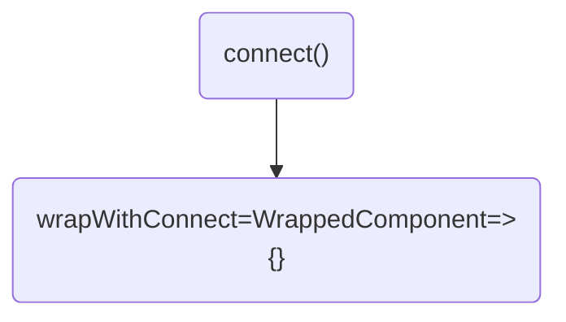
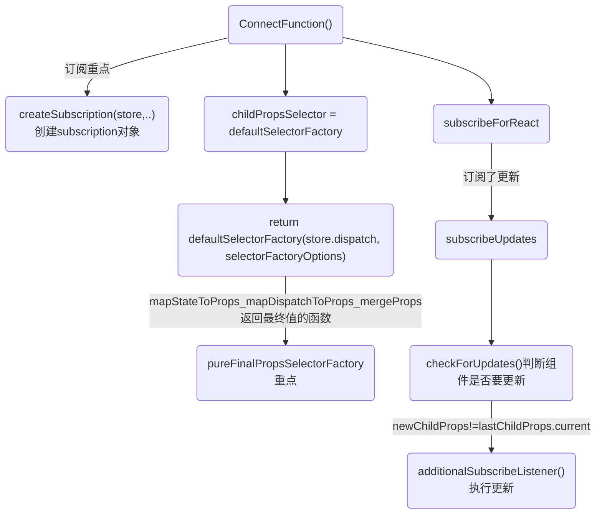
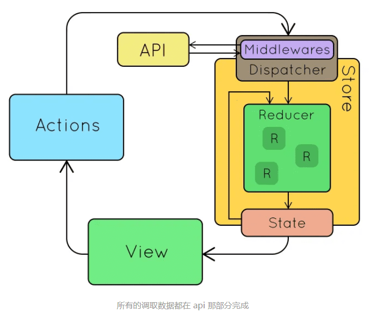
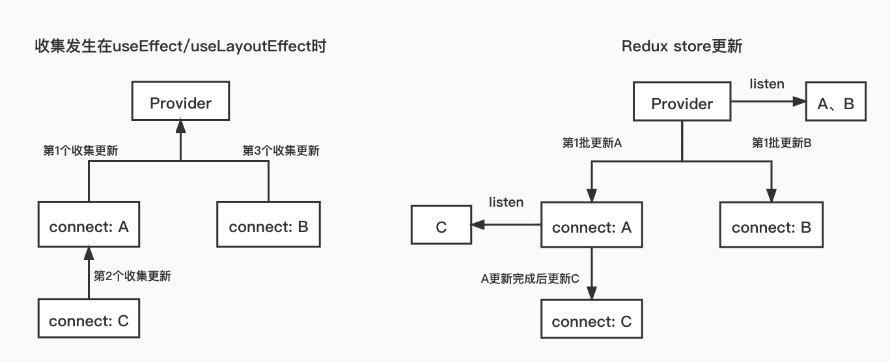
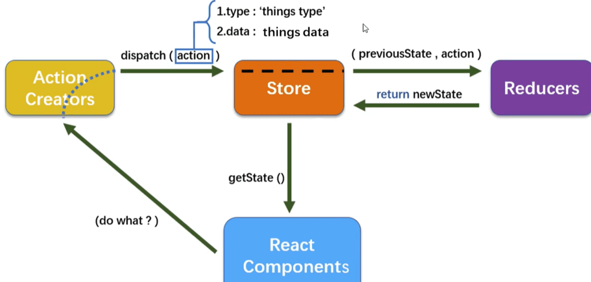

# 流程图



# redux 源码
```json
{
  "react-redux": "^8.0.5",
  "redux": "^4.2.0",
  "redux-thunk": "^2.4.2",
  "react": "^18.2.0",
}
```
### redux api:
* applyMiddleware
* bindActionCreators
* combineReducers
* compose
* createStore

### react-redux api:
components:
* Provider
* connect
* Context

connect:
* mapDispatchToProps
* mapStateToProps
* mergeProps
* selectorFactory
* verifySubselectors
* wrapMapToProps
hooks:
* useDispatch
* useReduxContext
* useSelector
* useStore

总览：
```js
export { Provider, ReactReduxContext, connect, useDispatch, createDispatchHook, useSelector, createSelectorHook, useStore, createStoreHook, shallowEqual };
```

## 总结

1 为什么要在 root 根组件上使用 react-redux 的 Provider 组件包裹?
2 react-redux 是怎么和 redux 契合，做到 state 改变更新视图的呢?
3 provide 用什么方式存放当前的 redux 的 store, 又是怎么传递给每一个需要订阅 state 的组件的?
4 connect 是怎么样连接我们的业务组件，然后更新已经订阅组件的呢?
5 connect 是怎么通过第一个参数mapStateToProps，来订阅与之对应的 state 的呢?
6 connect 怎么样将 props，和 redux的 state 合并的?

react 中能更新 redux 的 store，并能监听 store 的变化并通知 react 的相关组件更新，从而能让 react 将状态放在外部管理（有利于 model 集中管理，能利用 redux 单项数据流架构，数据流易预测易维护，也极大的方便了任意层级组件间通信


### react-redux 是如何关联起 redux 和 react 的？
Provider 中有 Subscription 实例，connect 这个高阶组件中也有 Subscription 实例，并且有负责自身更新的 hooks: useReducer，useReducer 的 dispatch 会被注册进 Subscription 的 listeners。

listeners 中有一个方法 notify 会遍历调用每个 listener，notify 会被注册给 redux 的 subscribe，从而 redux 的 state 更新后会通知给所有 connect 组件，当然每个 connect 都有检查自己是否需要更新的方法 checkForUpdates 来避免不必要的更新。

### redux
1. 数据流流动很自然，因为任何 dispatch 都会导致广播，需要依据对象引用是否变化来控制更新粒度。
```
无副作用，可时间回溯，适合并发。
```
3. 如果充分利用时间回溯的特征，可以增强业务的可预测性与错误定位能力。
4. 时间回溯代价很高，因为每次都要更新引用，除非增加代码复杂度，或使用 immutable。
5. 时间回溯的另一个代价是 action 与 reducer 完全脱节，数据流过程需要自行脑补。原因是可回溯必然不能保证引用关系。
6. 引入中间件，其实主要为了解决异步带来的副作用。灵活利用中间件，可以通过约定完成许多复杂的工作。

### 面向对象和函数式
mobx 和 redux 都是单向数据流，通过 action 触发全局 state 更新，然后通知视图。

redux 是每次返回一个全新的状态，一般搭配实现对象 immutable 的库来用。

mobx 每次都是修改的同一个状态对象，基于响应式代理，也就是 Object.defineProperty 代理 get、set 的处理，get 时把依赖收集起来，set 修改时通知所有的依赖做更新。


redux 那种方式每次都要返回一个新的对象，虽然可以用 immutable 的库来减少创建新对象的开销，但是比起 mobx 直接修改原对象来说，开销还是大一点。

而且 redux 通知依赖更新的时候是全部通知的，而 mobx 因为收集了每个属性的依赖，可以精准的通知。

所以 mobx 的性能会比 redux 高一些。

综上，mobx 和 redux 都是单向数据流，但是管理状态的思路上，一个是函数式的思想，通过 reducer 函数每次返回新的 state，一个是面向对象的思想，通过响应式对象来管理状态，这导致了状态组织方式上的不同(function/class)，而且 redux 创建新的 state 的开销还有通知所有依赖的开销都比 mobx 大，性能比 mobx 差一些。

### mobx
1. 数据流流动不自然，只有用到的数据才会引发绑定，局部精确更新，但免去了粒度控制烦恼。
2. 没有时间回溯能力，因为数据只有一份引用。 
3. 自始至终一份引用，不需要 immutable，也没有复制对象的额外开销。没有这样的烦恼，数据流动由函数调用一气呵成，便于调试。

不同：
Mobx 借助于装饰器的实现，使得代码更加简洁易懂。由于使用了可观察对象，所以 Mobx 可以做到直接修改状态，而不必像 Redux 一样编写繁琐的 actions 和 reducers。

简单的概括一下，一共有这么几个步骤：

1. 页面事件（生命周期、点击事件等等）触发 action 的执行。
2. 通过 action 来修改状态。
3. 状态更新后，computed 计算属性也会根据依赖的状态重新计算属性值。
4. 状态更新后会触发 reaction，从而响应这次状态变化来进行一些操作（渲染组件、打印日志等等）。

mobx Object.defineProperty 或者 Proxy。当 autorun 第一次执行的时候会触发依赖属性的 getter，从而收集当前函数的依赖。
```js
const person = observable({ name: 'tom' })
autorun(function func() {
    console.log(person.name)
})
```
在 autorun 里面:
```js
person.watches.push(func)
```
当依赖属性触发 setter 的时候，就会将所有订阅了变化的函数都执行一遍，从而实现了数据响应式。
```js
person.watches.forEach(watch => watch())
```


## Provider 完整函数
```js
function Provider({
  store,
  context,
  children,
  serverState
}) {
  const contextValue = useMemo(() => {
    const subscription = createSubscription(store);
    return {
      store,
      subscription,
      getServerState: serverState ? () => serverState : undefined
    };
  }, [store, serverState]);

  const previousState = useMemo(() => store.getState(), [store]);

  useIsomorphicLayoutEffect(() => {
    const {
      subscription
    } = contextValue;
    subscription.onStateChange = subscription.notifyNestedSubs;
    subscription.trySubscribe();

    if (previousState !== store.getState()) {
      subscription.notifyNestedSubs();
    }

    return () => {
      subscription.tryUnsubscribe();
      subscription.onStateChange = undefined;
    };
  }, [contextValue, previousState]);

  const Context = context || ReactReduxContext; // @ts-ignore 'AnyAction' is assignable to the constraint of type 'A', but 'A' could be instantiated with a different subtype

  console.log('%c=Provider=调用React.createElement参数Context.Provider:', 'color:yellow', Context.Provider, {
    value: contextValue
  }, 'children:', children)

  const providerRes = /*#__PURE__*/React.createElement(Context.Provider, {
    value: contextValue
  }, children);

  console.log('%c=Provider=调用React.createElement 返回一个组件:', 'color:yellow', providerRes)

  return providerRes
}
```

`那具体这个组件想往下面透传什么呢?`

调用React.createElement() 返回children 外面加了一层 Context Provider, 由store、subscription、getServerState组成的对象:
* store是 redux 的 store，是开发者通过 store prop 传给 Provider 组件的。
* subscription 是由 createSubscription 这个对象工厂创建的，它生成了 subscription 对象，它是后续嵌套收集订阅的关键
* getServerState是 8.0.0 版本新加的，它用于在 SSR 中，当初始『注水』hydrate 时获取服务器端状态快照的，以便保证两端状态一致性。它的控制权完全在开发者，只要把状态快照通过 serverState 这个 prop 给 Provider 组件即可

### Provider 组件执行useIsomorphicLayoutEffect
获取了一次最新 state 并命名为 previousState，只要 store 单例不发生变化，它是不会更新的。一般项目中也不太会改变 redux 单例。

useIsomorphicLayoutEffect 从 isomorphic 的命名也可以看出它是和同构相关的。
* server 环境时使用 useEffect
* 在浏览器环境时使用 useLayoutEffect
```js
const useIsomorphicLayoutEffect = canUseDOM ? useLayoutEffect : useEffect;
```

但是这样做的原因并不简单：首先，在服务端使用 useLayoutEffect 会抛出警告，为了绕过它于是在服务端转而使用 useEffect。

其次，为什么一定要在 useLayoutEffect/useEffect 里面做？
因为一个 store 更新可能发生在 render 阶段和副作用阶段之间，如果在 render 时就做，可能会错过更新，必须要确保 store subscription 的回调拥有来自最新更新的 selector。同时还要确保 store subscription 的创建必须是同步的，否则一个 store 更新可能发生在订阅之前（如果订阅是异步的话），这时订阅还没有被创建，从而有了不一致的状态。

Provider 在 useIsomorphicLayoutEffect 主要工作：
```js
useIsomorphicLayoutEffect(() => {
  const {
    subscription
  } = contextValue;
  subscription.onStateChange = subscription.notifyNestedSubs;
  subscription.trySubscribe();

  console.log('%c=Provider=useIsomorphicLayoutEffect会在最后组件commit被调用', 'color:yellow')

  if (previousState !== store.getState()) {
    subscription.notifyNestedSubs();
  }

  return () => {
    subscription.tryUnsubscribe();
    subscription.onStateChange = undefined;
  };
}, [contextValue, previousState]);
```

首先收集 subscription 的订阅，然后看最新的状态和之前在 render 的状态是否一致，如果不一致则通知更新。

如果这一段不放在 useLayoutEffect/useEffect 里，而是放在 render 里，那么现在仅仅订阅了它自己，它的子组件并没有订阅，如果子组件在渲染过程中更新了 redux store，那么子组件们就错过了更新通知。

`同时 react 的 useLayoutEffect/useEffect 是自下而上调用的，子组件的先调用，父组件的后调用。这里由于是 react-redux 的根节点了，它的 useLayoutEffect/useEffect 会在最后被调用，`这时能确保子组件该注册订阅的都注册了，同时也能确保子组件渲染过程中可能发生的更新都已经发生了。所以再最后读取一次 state，比较一下是否要通知它们更新。这就是为什么要选择 useLayoutEffect/useEffect。

首先是设置 subscription 的 onStateChange（它初始是个空方法，需要注入实现），它会在触发更新时调用，它这里希望将来调用的是subscription.notifyNestedSubs，subscription.notifyNestedSubs会触发这个 subscription 收集的所有子订阅。也就是说这里的更新回调和『更新』没有直接关系，而是触发子节点们的更新方法。

然后调用了subscription.trySubscribe()，它会将自己的 onStateChange 交给父级 subscription 或者 redux 去订阅，将来由它们触发 onStateChange

最后它会判断之前的 state 和最新的是否一致，如果不一致会调用subscription.notifyNestedSubs()，它会触发这个 subscription 收集的所有子订阅从而更新它们。

返回了注销相关的函数，它会注销在父级的订阅，将subscription.onStateChange重新置为空方法。这个函数会在组件卸载或 re-render （仅 store 变化时）时被调用（react useEffect 的特性）。

Provider 有很多地方都涉及到了 subscription，subscription 的那些方法只是讲了大概功能，关于 subscription 的细节会在后面 subscription 的部分讲到。

### 总结Provider
Provider 组件只是为了将 contextValue 透传下去，让子组件能够拿到 redux store、subscription 实例、服务器端状态函数。

<br />

## Subscription/createSubscription 订阅工厂函数
Provider 中出镜率很高的 subscription 部分，它是 react-redux 能够嵌套收集订阅的关键。

其实这个部分的标题叫做 Subscription 已经不太合适了，在 8.0.0 版本之前，react-redux 确实是通过 Subscription class 实现它的，你可以通过new Subscription()使用创建 subscription 实例。但在 8.0.0 之后，已经变成了createSubscription函数创建 subscription 对象，内部用闭包替代原先的属性。

用函数替代 class 有一个好处是，不需要关心 this 的指向，`函数返回的方法修改的永远是内部的闭包，不会出现 class 方法被赋值给其他变量后出现 this 指向变化的问题，`降低了开发时的心智负担。闭包也更加私有化，增加了变量安全

注：下文出现的『订阅回调』具体是指，redux 状态更新后触发的组件的更新方法。组件更新方法被父级订阅收集，是订阅发布模式。

## createSubscription 完整函数
每个subscription收集订阅实则是维护了一个双向链表。

createSubscription函数是一个对象工厂，它定义了一些变量和方法，然后返回一个拥有这些方法的对象subscription
```js
function createSubscription(store, parentSub) {
  let unsubscribe;
  let listeners = nullListeners;
  // 收集订阅
  function addNestedSub(listener) {
    trySubscribe();
    return listeners.subscribe(listener);
  }
  // 通知订阅
  function notifyNestedSubs() {
    listeners.notify();
  }
  // 自己的订阅回调
  function handleChangeWrapper() {
    if (subscription.onStateChange) {
      subscription.onStateChange();
    }
  }
  // 判断自己是否被订阅
  function isSubscribed() {
    return Boolean(unsubscribe);
  }
  // 让自己被父级订阅
  function trySubscribe() {
    if (!unsubscribe) {
      unsubscribe = parentSub ? parentSub.addNestedSub(handleChangeWrapper) : store.subscribe(handleChangeWrapper);
      listeners = createListenerCollection();
    }
  }
  // 从父级注销自己的订阅
  function tryUnsubscribe() {
    if (unsubscribe) {
      unsubscribe();
      unsubscribe = undefined;
      listeners.clear();
      listeners = nullListeners;
    }
  }

  console.log('%c=调用createSubscription参数store, parentSub', 'color:red',)

  const subscription = {
    addNestedSub,
    notifyNestedSubs,
    handleChangeWrapper,
    isSubscribed,
    trySubscribe,
    tryUnsubscribe,
    getListeners: () => listeners
  };
  return subscription;
}
```


### handleChangeWrapper 自己的订阅回调
其内部实际调用了onStateChange方法。究其原因是因为在订阅回调被父级收集时，可能自己的回调还没有确定，所以定义了一个外壳用于被收集，内部的回调方法在确定时会被重置，但外壳的引用不变，所以将来依然可以触发回调。这也是为什么在Provider.ts的源码里，在收集订阅之前先做一下subscription.onStateChange = subscription.notifyNestedSubs的原因。
```js
// 自己的订阅回调
function handleChangeWrapper() {
  if (subscription.onStateChange) {
    subscription.onStateChange();
  }
}
```

### trySubscribe 让自己被父级订阅
它的作用是让父级的 subscription 收集自己的订阅回调。首先它会判断如果unsubscribe标志了它已经被订阅了，那么不做任何事。其次它会判断当时创建subscription时的第二个参数parentSub是否为空，如果有parentSub则代表它上层有父级subscription，那么它会调用父级的addNestedSub方法，将自己的订阅回调注册给它；否则则认为自己在顶层，所以注册给 redux store。
```js
function trySubscribe() {
  if (!unsubscribe) {
    unsubscribe = parentSub ? parentSub.addNestedSub(handleChangeWrapper) : store.subscribe(handleChangeWrapper);
    listeners = createListenerCollection();
  }
}
```
### addNestedSub 收集订阅
```js
// 收集订阅
function addNestedSub(listener) {
  trySubscribe();
  return listeners.subscribe(listener);
}
```
addNestedSub非常巧妙的运用了递归，它里面又调用了trySubscribe。于是它们就会达到这样的目的，当最底层subscription发起trySubscribe想被父级收集订阅时，它会首先触发父级的trySubscribe并继续递归直到根subscription，如果我们把这样的层级结构想象成树的话（其实 subscription.trySubscribe 也确实发生在组件树中），那么就相当于从根节点到叶子节点依次会被父级收集订阅。因为这是由叶子节点先发起的，这时除了叶子节点，其他节点的订阅回调还没有被设置，所以才设计了handleChangeWrapper这个回调外壳，注册的只是这个回调外壳，在将来非叶子节点设置好回调后，能被外壳触发。

在『递』过程结束后，从根节点开始到这个叶子节点的订阅回调handleChangeWrapper都正在被父级收集了，『归』的过程回溯做它的本职工作return listeners.subscribe(listener)，将子subscription的订阅回调收集到收集器listeners中（将来更新发生时会触发相关的handleChangeWrapper，而它会间接的调用收集到所有的 listener）。

所以每个subscription的addNestedSub都做了两件事：1. 让自己的订阅回调先被父级收集；2. 收集子subscription的订阅回调。

结合addNestedSub的解释再回过头来看trySubscribe，它想让自己的订阅回调被父级收集，于是当它被传入父级subscription时，就会调用它的addNestedSub，这会导致从根subscription开始每一层subscription都被父级收集了回调，于是每个subscription都嵌套收集了它们子subscription，从而父级更新后子级才更新成为了可能。同时，因为unsubscribe这个锁的存在，如果某个父级subscription的trySubscribe被调用了，并不会重复的触发这个『嵌套注册』。

上面我们分析了『嵌套注册』时发生了什么，下面我们看看注册的实质性操作listeners.subscribe干了什么，注册的数据结构又是如何设计的。

### trySubscribe-->createListenerCollection
所以每个 subscription 收集订阅实则是维护了一个双向链表。

listeners对象是由 createListenerCollection 创建的。listeners方法不多且逻辑易懂，是由clear、notify、get、subscribe组成的。

listeners 负责收集 listener（也就是订阅回调） ，listeners 内部将 listener 维护成了一个双向链表，头结点是first，尾节点是last。
```js
// 让自己被父级订阅
function trySubscribe() {
  if (!unsubscribe) {
    unsubscribe = parentSub ? parentSub.addNestedSub(handleChangeWrapper) : store.subscribe(handleChangeWrapper);
    console.log('%c=react-redux=createSubscription调用createListenerCollectionlisteners对象', 'color:cyan')
    listeners = createListenerCollection();
  }
}

function createListenerCollection() {
  // 对listener的收集，listener是一个双向链表
  const batch = getBatch();
  let first = null;
  let last = null;

  console.log('%c=react-redux=createListener创建listeners对象', 'color:cyan')

  return {
    clear() {
      first = null;
      last = null;
    },
    // 触发链表所有节点的回调
    notify() {
      batch(() => {
        let listener = first;
        console.log('%c=react-redux=notify触发链表所有节点的回调', 'color:blueviolet')

        while (listener) {
          listener.callback();
          listener = listener.next;
        }
      });
    },
    // 以数组的形式返回所有节点
    get() {
      let listeners = [];
      let listener = first;

      while (listener) {
        listeners.push(listener);
        listener = listener.next;
      }

      return listeners;
    },
    // 向链表末尾添加节点，并返回一个删除该节点的undo函数
    subscribe(callback) {
      let isSubscribed = true;
      let listener = last = {
        callback,
        next: null,
        prev: last
      };

      if (listener.prev) {
        listener.prev.next = listener;
      } else {
        first = listener;
      }

      return function unsubscribe() {
        if (!isSubscribed || first === null) return;
        isSubscribed = false;

        if (listener.next) {
          listener.next.prev = listener.prev;
        } else {
          last = listener.prev;
        }

        if (listener.prev) {
          listener.prev.next = listener.next;
        } else {
          first = listener.next;
        }
      };
    }

  };
}
```

### notify触发链表所有节点的回调
用于遍历调用链表节点，batch这里可以简单的理解为调用入参的那个函数，其中的细节可以衍生出很多 React 原理（如批量更新、fiber 等），放在文章的最后说。
```js
// 触发链表所有节点的回调
notify() {
  batch(() => {
    let listener = first;
    console.log('%c=react-redux=notify触发链表所有节点的回调', 'color:blueviolet')

    while (listener) {
      listener.callback();
      listener = listener.next;
    }
  });
},
```

### subscribe
用于向 listeners 链表添加一个订阅以及返回一个注销订阅的函数，涉及链表的增删操作
```js
// 用于向 listeners 链表添加一个订阅以及返回一个注销订阅的函数，涉及链表的增删操作
subscribe(callback) {
  console.log('=react-redux=subscribe向 listeners 链表添加一个订阅以及返回一个注销订阅的函数，涉及链表的增删操作', 'color:blueviolet')
  let isSubscribed = true;
  // 创建一个链表节点
  let listener = last = {
    callback,
    next: null,
    prev: last
  };
  // 如果链表已经有了节点
  if (listener.prev) {
    listener.prev.next = listener;
  } else {
    // 如果链表还没有节点，它则是首节点
    first = listener;
  }
  // unsubscribe就是个双向链表的删除指定节点操作
  return function unsubscribe() {
    // 阻止无意义执行
    if (!isSubscribed || first === null) return;
    isSubscribed = false;
    // 如果添加的这个节点已经有了后续节点
    if (listener.next) {
      listener.next.prev = listener.prev;
    } else {
      // 没有则说明该节点是最后一个，将prev节点作为last节点
      last = listener.prev;
    }

    // 如果有前节点prev
    if (listener.prev) {
      // prev的next应该为该节点的next
      listener.prev.next = listener.next;
    } else {
      // 否则说明该节点是第一个，把它的next给first
      first = listener.next;
    }
  };
}
```

### subscription最后需要说的的部分只有 notifyNestedSubs 和 tryUnsubscribe
notifyNestedSubs调用了listeners.notify，根据上面有关 listeners 的分析，这里会遍历调用所有的订阅

tryUnsubscribe则是进行注销相关的操作，this.unsubscribe在trySubscribe方法的执行中被注入值了，它是addNestedSub或者redux subscribe函数的返回值，是取消订阅的 undo 操作。在this.unsubscribe()之下的分别是清除unsubscribe、清除listeners操作。
```js
// 通知订阅
function notifyNestedSubs() {
  console.log('=react-redux=notifyNestedSubs调用listeners.notify()通知订阅')
  listeners.notify();
}

// 从父级注销自己的订阅
function tryUnsubscribe() {
  if (unsubscribe) {
    unsubscribe();
    unsubscribe = undefined;
    listeners.clear();
    listeners = nullListeners;
  }
}
```

### 总结
subscription就分析完了，它主要用于在嵌套调用时，可以嵌套收集订阅，以此做到父级更新后才执行子节点的订阅回调从而在父级更新之后更新。

不太清楚 react-redux 的人可能会疑惑，不是只有Provider组件使用了subscription吗，哪里来的嵌套调用？哪里来的收集子订阅？不要着急，后续讲到connect高阶函数，它里面也用到了subscription，就是这里嵌套使用的。

# redux 原理之 connect 高阶组件
connect(mapStateToProps, mapDispatchToProps, mergeProps, connectOptions)(Component)，

接收mapStateToProps、mapDispatchToProps等参数，返回一个接收Component参数的高阶函数，这个函数最终返回JSX.Element。

如果把 connect 做的事情分解的话:
* 向父级订阅自己的更新
* 从 redux store select 数据、判断是否需要更新等其他细节

### connect省略函数
```js
function connect(mapStateToProps, mapDispatchToProps, mergeProps, {
  pure,
  areStatesEqual = strictEqual,
  areOwnPropsEqual = shallowEqual,
  areStatePropsEqual = shallowEqual,
  areMergedPropsEqual = shallowEqual,
  forwardRef = false,
  context = ReactReduxContext
} = {}) {
  // if (process.env.NODE_ENV !== 'production') {
  if (pure !== undefined && !hasWarnedAboutDeprecatedPureOption) {
    hasWarnedAboutDeprecatedPureOption = true;
    warning('The `pure` option has been removed. `connect` is now always a "pure/memoized" component');
  }
  // }
  console.log('%c=react-redux=connect', 'color:chartreuse')
  const Context = context;
  const initMapStateToProps = mapStateToPropsFactory(mapStateToProps);
  const initMapDispatchToProps = mapDispatchToPropsFactory(mapDispatchToProps);
  const initMergeProps = mergePropsFactory(mergeProps);
  const shouldHandleStateChanges = Boolean(mapStateToProps)
  // 省略代码
}
```

## connect 的 selector
```js
const selectorFactoryOptions = {
  shouldHandleStateChanges,
  displayName,
  wrappedComponentName,
  WrappedComponent,
  // @ts-ignore
  initMapStateToProps,
  // @ts-ignore
  initMapDispatchToProps,
  initMergeProps,
  areStatesEqual,
  areStatePropsEqual,
  areOwnPropsEqual,
  areMergedPropsEqual
};

const childPropsSelector = useMemo(() => {
  return defaultSelectorFactory(store.dispatch, selectorFactoryOptions);
}, [store]);

const actualChildPropsSelector = childPropsSelector(
  store.getState(),
  wrapperProps
);
```

connect 函数里面 initMapStateToProps、initMapDispatchToProps、initMergeProps这 3 个高阶函数，最终这些函数的目的是返回 select 的值

```js
function connect(mapStateToProps, mapDispatchToProps, mergeProps, {
  pure,
  areStatesEqual = strictEqual,
  areOwnPropsEqual = shallowEqual,
  areStatePropsEqual = shallowEqual,
  areMergedPropsEqual = shallowEqual,
  forwardRef = false,
  context = ReactReduxContext
} = {}) {

  // 省略代码
  const wrapWithConnect = WrappedComponent => {

  const wrappedComponentName = WrappedComponent.displayName || WrappedComponent.name || 'Component';
  const displayName = `Connect(${wrappedComponentName})`;
  const selectorFactoryOptions = {
    shouldHandleStateChanges,
    displayName,
    wrappedComponentName,
    WrappedComponent,
    // @ts-ignore
    initMapStateToProps,
    // @ts-ignore
    initMapDispatchToProps,
    initMergeProps,
    areStatesEqual,
    areStatePropsEqual,
    areOwnPropsEqual,
    areMergedPropsEqual
  };
}
```

<br />

# 问题和前言
## 问题
1. react-redux 是如何关联起 redux 和 react 的？
2. 究竟是 redux 性能不好还是 react-redux 性能不好？
3. 具体不好在哪里？
4. 能不能避免？
5. react redux不更新组件
```
将store设置为对象，组件调用action中方法更新store，但是组件内容并没有更新。

原因是 store是引用

store是字面变量的值时，地址会随值改变。

store为对象时，地址不变，就不会重新render。

解决方案，深拷贝处理
```

总之，当时我只粗读了整体逻辑，但是可以解答我上面的问题了：
1. react-redux 确实有可能性能不好。而至于 redux，每次 dispatch 都会让 state 去每个 reducer 走一遍，并且为了保证数据 immutable 也会有额外的创建复制开销。不过 mutable 阵营的库如果频繁修改对象也会导致 V8 的对象内存结构由顺序结构变成字典结构，查询速度降低，以及内联缓存变得高度超态，这点上 immutable 算拉回一点差距。不过为了一个清晰可靠的数据流架构，这种级别的开销在大部分场景算是值得，甚至忽略不计。
2. react-redux 性能具体不好在哪里？因为每个 connect 不管需不需要更新都会被通知一次，开发者定义的 selector 都会被调用一遍甚至多遍，如果 selector 逻辑昂贵，还是会比较消耗性能的。

3. 那么 react-redux 一定会性能不好吗？不一定，根据上面的分析，如果你的 selector 逻辑简单（或者将复杂派生计算都放在 redux 的 reducer 里，但是这样可能不利于构建一个合理的 model），connect 用的不多，那么性能并不会被 mobx 这样的细粒度更新拉开太多。也就是说 selector 里业务计算不复杂、使用全局状态管理的组件不多的情况下，完全不会有可感知的性能问题。那如果 selector 里面的业务计算复杂怎么办呢？能不能完全避免呢？当然可以，你可以用 reselect 这个库，它会缓存 selector 的结果，只有原始数据变化时才会重新计算派生数据。

## 问题:redux-thunk 和 redux-saga区别
概念
Redux Thunk:Redux 的异步处理中间件
Dva:一个基于redux 和 redux-saga 的数据流方案

### redux 时异步操作出现的具体时机
当出发一个 action 会经过中间件 middlewares，这时所有的 side effect 操作，例如调用 api 获取数据等等都将在这里完成。然后再经由 reducer 更新 state，最后传递到 view 完成 MVC 的数据流循环。


## redux-thunk 解决方案
注册插件
```js
// Note: this API requires redux@>=3.1.0
const store = createStore(rootReducer, applyMiddleware(thunk));

ReactDOM.render(
  <Provider store={store}>
    <Routes />
  </Provider>,
  document.getElementById('root')
);
```

Reducer 也非常简单，和原来一模一样
```js
export default (state = defaultState, action) => {
  switch (action.type) {
    case REMOTE_DATA_RECEIVED:
      return {
        ...state,
        data: action.data
      };
    default:
      return state;
  }
};
```

### 不同之处在于 action
```js
// 普通的 action
export function toggleTodo(index) {
  return { type: TOGGLE_TODO, index }
}

// redux-thunk 的 action 可以是一 异步的 higher order function 高阶函数
export const fetchData = args => async (dispatch, getState) => {
  const state = getState();
  const url = 'https://jsonplaceholder.typicode.com/users/' + args;

  try {
    const response = await fetch(url)
      .then(resp => {
        return resp;
      })
      .then(resp => resp.json());

    dispatch({
      type: REMOTE_DATA_RECEIVED,
      data: response
    });
  } catch (error) {
    console.log(error);
  }
};
```

## 2.redux-saga 解决方案
### 区别:saga 使用的仍然是普通的 action
```js
// 这个 action 将由 saga 监听，并且出发 side effect 异步加载 api 操作
export const fetchData = () => ({
  type:  "START_FETCH_DATA"
});

// 这个 action 将由 saga 发出
export const fetchSuccess = data => ({
  type: "REMOTE_DATA_RECEIVED",
  payload: data
});
```

接下来就是注册 saga 相关 side effect 操作。下面的文件是 fetchData.saga.js
```js
import { takeLatest, put } from "redux-saga/effects";

function* fetchDataSaga(action){
  try {
    const response = yield fetch(action.url);
    const data = yield response.json()
    yield put(fetchSuccess(data));
  } catch (error) {
    console.log(error);
  }
}

export default function* watchFetchSaga(){
  // saga 将监听此事件，takeLatest 表示仅仅只监听最新的此事件
  yield takeLatest("START_FETCH_DATA", fetchDataSaga)
}
```

### 总结
saga 自己基本上完全弄了一套 async 的事件监听机制。虽然好的一方面是将来可以扩展成 worker 相关的模块，甚至可以做到 multiple threads 同时执行，但代码量大大增加。如果只是普通的 application，用 redux-thunk 足够


## 前言
https://segmentfault.com/a/1190000041472179

### "Stale Props" and "Zombie Children"（过期 Props 和僵尸子节点问题）
自 v7.1.0 版本发布以后，react-redux 就可以使用 hooks api 了，官方也推荐使用 hooks 作为组件中的默认使用方法。但是有一些边缘情况可能会发生，这篇文档就是让我们意识到这些事的。

react-redux 实现中最难的地方之一就是：如果你的 mapStateToProps 是(state, ownProps)这样使用的，它将会每次被传入『最新的』props。一直到版本 4 都一直有边缘场景下的重复的 bug 被报告，比如：有一个列表 item 的数据被删除了，mapStateToProps 里面就报错了。

从版本 5 开始，react-redux 试图保证 ownProps 的一致性。在版本 7 里面，每个 connect()内部都有一个自定义的 Subscription 类，从而当 connect 里面又有 connect，它能形成一个嵌套的结构。这确保了树中更低层的 connect 组件只会在离它最近的祖先 connect 组件更新后才会接受到来自 store 的更新。然而，这个实现依赖于每个 connect()实例里面覆写了内部 React Context 的一部分（subscription 那部分），用它自身的 Subscription 实例用于嵌套。然后用这个新的 React Context ( \<ReactReduxContext.Provider\> ) 渲染子节点。

如果用 hooks，没有办法渲染一个 context.Provider，这就代表它不能让 subscriptions 有嵌套的结构。因为这一点，"stale props" 和 "zombie child" 问题可能在『用 hooks 代替 connect』 的应用里重新发生。


具体来说，"stale props" 会出现在这种场景：
* selector 函数会根据这个组件的 props 计算出数据
* 父组件会重新 render，并传给这个组件新的 props
* 但是这个组件会在 props 更新之前就执行 selector（译者注：因为子组件的来自 store 的更新是在 useLayoutEffect/useEffect 中注册的，所以子组件先于父组件注册，redux 触发订阅会先触发子组件的更新方法）

这种旧的 props 和最新 store state 算出来的结果，很有可能是错误的，甚至会引起报错。

"Zombie child"具体是指在以下场景：
* 多个嵌套的 connect 组件 mounted，子组件比父组件更早的注册到 store 上
* 一个 action dispatch 了在 store 里删除数据的行为，比如一个 todo list 中的 item
* 父组件在渲染的时候就会少一个 item 子组件
* 但是，因为子组件是先被订阅的，它的 subscription 先于父组件。当它计算一个基于 store 和 props 计算的值时，部分数据可能已经不存在了，如果计算逻辑不注意的话就会报错。

useSelector()试图这样解决这个问题：它会捕获所有来自 store 更新导致的 selector 计算中的报错，当错误发生时，组件会强制更新，这时 selector 会再次执行。这个需要 selector 是个纯函数并且你没有逻辑依赖 selector 抛出错误。

如果你更喜欢自己处理，这里有一个可能有用的事项能帮助你在使用 useSelector() 时避免这些问题

* 不要在 selector 的计算中依赖 props
* 如果在：你必须要依赖 props 计算并且 props 将来可能发生变化、依赖的 store 数据可能会被删除，这两种情况下时，你要防备性的写 selector。不要直接像 state.todos[props.id].name 这样读取值，而是先读取 state.todos[props.id]，验证它是否存在再读取 todo.name
因为 connect 向 context provider 增加了必要的 Subscription，它会延迟执行子 subscriptions 直到这个 connected 组件 re-rendered。组件树中如果有 connected 组件在使用 useSelector 的组件的上层，也可以避免这个问题，因为父 connect 有和 hooks 组件同样的 store 更新（译者注：父 connect 组件更新后才会更新子 hooks 组件，同时 connect 组件的更新会带动子节点更新，被删除的节点在此次父组件的更新中已经卸载了：因为上文中说 state.todos[props.id].name ，说明 hooks 组件是上层通过 ids 遍历出来的。于是后续来自 store 的子 hooks 组件更新不会有被删除的）

以上的解释可能让大家明白了 "Stale Props" 和 "Zombie Children" 问题是如何产生的以及 react-redux 大概是怎么解决的，就是通过子代 connect 的更新被嵌套收集到父级 connect，每次 redux 更新并不是遍历更新所有 connect，而是父级先更新，然后子代由父级更新后才触发更新。但是似乎 hooks 的出现让它并不能完美解决问题了，而且具体这些设计的细节也没有说到。这部分的疑惑和缺失就是我准备再读 react-redux 源码的原因。


## 宏观设计
总体的抽象设计，让大家心中带着设计蓝图去读其中的细节，否则只看细节很难让它们之间串联起来明白它们是如何共同协作完成整个功能的。
React-Redux 的 Provider 和 connect 都提供了自己的贯穿子树的 context，它们的所有的子节点都可以拿到它们，并会将自己的更新方法交给它们。最终形成了根 <-- 父 <-- 子这样的收集顺序。根收集的更新方法会由 redux 触发，父收集的更新方法在父更新后再更新，于是保证了父节点被 redux 更新后子节点才更新的顺序。




## 1. 从react-redux常用的 api 切入
入口就是src/index.ts
```js
import { useSyncExternalStore } from 'use-sync-external-store/shim'
import { useSyncExternalStoreWithSelector } from 'use-sync-external-store/shim/with-selector'

import { unstable_batchedUpdates as batch } from './utils/reactBatchedUpdates'
import { setBatch } from './utils/batch'

import { initializeUseSelector } from './hooks/useSelector'
import { initializeConnect } from './components/connect'

initializeUseSelector(useSyncExternalStoreWithSelector)
initializeConnect(useSyncExternalStore)

// Enable batched updates in our subscriptions for use
// with standard React renderers (ReactDOM, React Native)
setBatch(batch)

export { batch }

export * from './exports'
```


# redux
### 容器组件和展示组件
react-redux 提供的 connect 函数，可以把 React 组件和 Redux 的 store 链接起来生成一个新的容器组件(这里有个经典的设计模式 “高阶组件”)

数据如何获取就是容器组件需要负责的事情，在获取到数据后通过 props 属性传递到展示组件，当展示组件需要变更状态时调用容器组件提供的方法同步这些
状态变化。

总结下来，容器组件需要做两件事： 
- 从 Redux 的 store 中获取数据给到展示组件，对应下例 mapStateToProps() 方法。
- 提供方法供展示组件同步需要变更的状态，对应下例 mapDispatchToProps() 方法。

### 模拟一下createStore的源码
通过redux当中的createStore方法来创建一个store，它提供3个主要的方法:
```js
// 以下代码示例来自redux官方教程
const createStore = (reducer) => {
    let state;
    let listeners = [];

    // 用来返回当前的state
    const getState = () => state;

    // 根据action调用reducer返回新的state并触发listener
    const dispatch = (action) => {
        state = reducer(state, action);
        listeners.forEach(listener => listener());
    };
    
    /* 这里的subscribe有两个功能
     * 调用 subscribe(listener) 会使用listeners.push(listener)注册一个listener
     * 而调用 subscribe 的返回函数则会注销掉listener
     */
    const subscribe = (listener) => {
        listeners.push(listener);
        return () => {
            listeners = listeners.filter(l => l !== listener);
        };
    };

    return { getState, dispatch, subscribe };
};
```

redux、useContext是通过将所有状态放到一个状态树里，全局公用来解决的。

使用redux、useContext时，状态树发送变动，只会更新使用了此状态的组件，其它组件不会更新。用法需要手动往组件里注入状态。

redux、useContext中状态的修改需要发出dispatch，通过触发action来修改。不能直接修改Store，那么可以通过dispatch、action追溯状态的变化。

实现原理
1. 顶层分发状态，让React组件被动地渲染。
2. 监听事件，事件有权利回到所有状态顶层影响状态。


## redux 和 context
App根节点组件提供的`Context`对象可以看成是App级的全局作用域，所以，我们利用App根节点组件提供的`Context`对象创建一些App级的全局数据。现成的例子可以参考react-redux，以下是`<Provider />`组件源码的核心实现：

App的根组件用`<Provider />`组件包裹后，本质上就为App提供了一个全局的属性`store`，相当于在整个App范围内，共享`store`属性。当然，`<Provider />`组件也可以包裹在其他组件中，在组件级的全局范围内共享`store`。
```js
export function createProvider(storeKey = 'store', subKey) {
    const subscriptionKey = subKey || `${storeKey}Subscription`

    class Provider extends Component {
        getChildContext() {
          return { [storeKey]: this[storeKey], [subscriptionKey]: null }
        }

        constructor(props, context) {
          super(props, context)
          this[storeKey] = props.store;
        }

        render() {
          return Children.only(this.props.children)
        }
    }

    // ......

    Provider.propTypes = {
        store: storeShape.isRequired,
        children: PropTypes.element.isRequired,
    }
    Provider.childContextTypes = {
        [storeKey]: storeShape.isRequired,
        [subscriptionKey]: subscriptionShape,
    }

    return Provider
}

export default createProvider()
```


selectorFactoryOptions的对象最终交给 defaultSelectorFactory 使用
```js
const childPropsSelector = useMemo(() => {
  // The child props selector needs the store reference as an input.
  // Re-create this selector whenever the store changes.
  return defaultSelectorFactory(store.dispatch, selectorFactoryOptions);
}, [store]);
```

1. childPropsSelector就是最终返回真正需要值的函数（它真的是高阶函数的终点了~）
2. defaultSelectorFactory函数做了什么，它实际叫finalPropsSelectorFactory
```js
function defaultSelectorFactory(dispatch, _ref) {
  let {
    initMapStateToProps,
    initMapDispatchToProps,
    initMergeProps
  } = _ref,
    options = _objectWithoutPropertiesLoose(_ref, _excluded_selectorFactory);

  const mapStateToProps = initMapStateToProps(dispatch, options);
  const mapDispatchToProps = initMapDispatchToProps(dispatch, options);
  const mergeProps = initMergeProps(dispatch, options);

  if (process.env.NODE_ENV !== 'production') {
    verifySubselectors(mapStateToProps, mapDispatchToProps, mergeProps);
  }

  return pureFinalPropsSelectorFactory(mapStateToProps, mapDispatchToProps, mergeProps, dispatch, options);
}
```

```js
function pureFinalPropsSelectorFactory(mapStateToProps, mapDispatchToProps, mergeProps, dispatch, {
  areStatesEqual,
  areOwnPropsEqual,
  areStatePropsEqual
}) {
  let hasRunAtLeastOnce = false;
  let state;
  let ownProps;
  let stateProps;
  let dispatchProps;
  let mergedProps;

  function handleFirstCall(firstState, firstOwnProps) {
    state = firstState;
    ownProps = firstOwnProps;
    stateProps = mapStateToProps(state, ownProps);
    dispatchProps = mapDispatchToProps(dispatch, ownProps);
    mergedProps = mergeProps(stateProps, dispatchProps, ownProps);
    hasRunAtLeastOnce = true;
    return mergedProps;
  }

  function handleNewPropsAndNewState() {
    stateProps = mapStateToProps(state, ownProps);
    if (mapDispatchToProps.dependsOnOwnProps) dispatchProps = mapDispatchToProps(dispatch, ownProps);
    mergedProps = mergeProps(stateProps, dispatchProps, ownProps);
    return mergedProps;
  }

  function handleNewProps() {
    if (mapStateToProps.dependsOnOwnProps) stateProps = mapStateToProps(state, ownProps);
    if (mapDispatchToProps.dependsOnOwnProps) dispatchProps = mapDispatchToProps(dispatch, ownProps);
    mergedProps = mergeProps(stateProps, dispatchProps, ownProps);
    return mergedProps;
  }

  function handleNewState() {
    const nextStateProps = mapStateToProps(state, ownProps);
    const statePropsChanged = !areStatePropsEqual(nextStateProps, stateProps);
    stateProps = nextStateProps;
    if (statePropsChanged) mergedProps = mergeProps(stateProps, dispatchProps, ownProps);
    return mergedProps;
  }

  function handleSubsequentCalls(nextState, nextOwnProps) {
    const propsChanged = !areOwnPropsEqual(nextOwnProps, ownProps);
    const stateChanged = !areStatesEqual(nextState, state, nextOwnProps, ownProps);
    state = nextState;
    ownProps = nextOwnProps;
    if (propsChanged && stateChanged) return handleNewPropsAndNewState();
    if (propsChanged) return handleNewProps();
    if (stateChanged) return handleNewState();
    return mergedProps;
  }

  return function pureFinalPropsSelector(nextState, nextOwnProps) {
    return hasRunAtLeastOnce ? handleSubsequentCalls(nextState, nextOwnProps) : handleFirstCall(nextState, nextOwnProps);
  };
}
```

## pureFinalPropsSelectorFactory
`mapStateToProps、mapDispatchToProps、mergeProps是会返回各自最终值的函数。更多应该关注的重点是 pureFinalPropsSelectorFactory 函数`

它的闭包hasRunAtLeastOnce用以区分是否首次调用，首次和后续是不同的函数，如果是首次调用则是使用handleFirstCall函数，它里面产生stateProps、产生dispatchProps，然后将它们放入mergeProps计算出最终的 props，同时把hasRunAtLeastOnce设置为true，表示已经不是第一次执行了。

后续调用都走handleSubsequentCalls，它的主要目的是如果 state 和 props 都没有变化则使用缓存数据（state、props 是否变化的判断方法是外部传进来的，组件当然能知道自己有没有变化），如果 state、props 都有变化或者只是其中一个有变化，再分别调用各自的函数（里面主要是根据静态属性dependsOnOwnProps判断是否要重新执行）得到新值。

于是childPropsSelector函数就是返回的pureFinalPropsSelector函数，内部访问了闭包，闭包保存了持久值，从而在组件多次执行的情况下，可以决定是否需要使用缓存来优化性能。

selector 相关的分析完了。

总的来说，如果想实现一个最简单的selector，只需要
```js
const selector = (state, ownProps) => {
  const stateProps = mapStateToProps(reduxState);
  const dispatchProps = mapDispatchToProps(reduxDispatch);
  const actualChildProps = mergeProps(stateProps, dispatchProps, ownProps);
  return actualChildProps;
};
```

那为什么 react-redux 会写的如此复杂呢。就是为了connect组件在多次执行时能利用细粒度缓存的 mergedProps 值提升性能，React 只能做到在wrapperProps不变时使用 memo，但难以做更细粒度的区分，比如知道 selector 是否依赖 props，从而就算 props 变化了也不需要更新。要实现这一点需要大量嵌套的高阶函数储存持久化的闭包中间值，才能在组件多次执行时不丢失状态从而判断更新。

下面我们准备讲点别的了，如果你对一系列调用栈有点头晕，你只要记住看到了childPropsSelector就是返回 selector 后的值就好了

# connect 更新的注册订阅:ConnectFunction
```js
function ConnectFunction(props) {
  // 省略代码
  const renderedChild = useMemo(() => {
    if (shouldHandleStateChanges) {
      // If this component is subscribed to store updates, we need to pass its own
      // subscription instance down to our descendants. That means rendering the same
      // Context instance, and putting a different value into the context.
      return /*#__PURE__*/React.createElement(ContextToUse.Provider, {
        value: overriddenContextValue
      }, renderedWrappedComponent);
    }

    return renderedWrappedComponent;
  }, [ContextToUse, renderedWrappedComponent, overriddenContextValue]);
  return renderedChild;
}
```
首先从 props 里划分出了实际业务 props 和行为控制相关的 props，所谓的业务 props 就是指项目中的父级组件实际传给 connect 组件的 props，行为控制 props 则是 forward ref、context 等业务无关的、和内部注册订阅有关的 props。并且使用 useMemo 缓存了解构后的值。


ContextToUse这一步确定了 context。还记得在 Provider 组件里的那个 context 吗，connect 这里就可以通过 context 拿到它。不过这里做了个判断，如果用户通过 props 传入了自定义的 context，那么优先用自定义 context，否则使用使用那个『可以看做全局『的 React.createContext（也是 Provider 或者其他 connect、useSelector 等使用的）
```js
const ContextToUse = useMemo(() => {
  // Users may optionally pass in a custom context instance to use instead of our ReactReduxContext.
  // Memoize the check that determines which context instance we should use.
  return propsContext && propsContext.Consumer && // @ts-ignore
    isContextConsumer( /*#__PURE__*/React.createElement(propsContext.Consumer, null)) ? propsContext : Context;
}, [propsContext, Context]); // Retrieve the store and ancestor subscription via context, if available

const store = didStoreComeFromProps ? props.store : contextValue.store;
```

接着获取 store（它可能来自 props 也可能来自 context），还获取了服务端渲染状态（如果有的话）。然后创建了一个能返回 selected 值的 selector 函数，selector 的细节上面讲过了。


## 下面出现了订阅的重点
```js
function ConnectFunction(props) {
  // 省略代码
  const [subscription, notifyNestedSubs] = useMemo(() => {
    console.log('=react-redux=ConnectFunction=阅的重点')
    if (!shouldHandleStateChanges) return NO_SUBSCRIPTION_ARRAY; // This Subscription's source should match where store came from: props vs. context. A component
    // connected to the store via props shouldn't use subscription from context, or vice versa.

    const subscription = createSubscription(store, didStoreComeFromProps ? undefined : contextValue.subscription); // `notifyNestedSubs` is duplicated to handle the case where the component is unmounted in
    // the middle of the notification loop, where `subscription` will then be null. This can
    // probably be avoided if Subscription's listeners logic is changed to not call listeners
    // that have been unsubscribed in the  middle of the notification loop.

    const notifyNestedSubs = subscription.notifyNestedSubs.bind(subscription);
    return [subscription, notifyNestedSubs];
  }, [store, didStoreComeFromProps, contextValue]); // Determine what {store, subscription} value should be put into nested context, if necessary,
}
```

通过 createSubscription 函数创建了一个订阅实例，createSubscription 的细节上面讲过了，它里面有一个嵌套订阅的逻辑，这里就会用到。createSubscription 的第 3 个参数传入了 context 里的 subscription 订阅实例，根据嵌套订阅逻辑（忘了的可以回头看看函数创建了一个订阅实例，createSubscription 的第 3 个参数起到了什么作用），这个 connect 里的订阅回调实际上是注册给父级的这个contextValue.subscription的，如果这个父级是顶层的 Provider，那么它的订阅回调才真正注册给redux，如果父级还不是顶层的话，那么还是会像这样一层层的嵌套注册回调。通过这个实现了『父级先更新-子级后更新』从而避免过期 props 和僵尸节点问题。

为了让子级 connect 的订阅回调注册给自己，于是用自己的 subscription 生成了一个新的 ReactReduxContextValue: overriddenContextValue，以便后续的嵌套注册。

然后定义了一批『持久化数据』（不会随着组件重复执行而初始化），这些数据主要为了将来的『更新判断』和『由父组件带动的更新、来自 store 的更新不重复发生』，后面会用到它们。
```js
function ConnectFunction(props) {
  // 省略代码
  const lastChildProps = useRef();
  const lastWrapperProps = useRef(wrapperProps);
  const childPropsFromStoreUpdate = useRef();
  const renderIsScheduled = useRef(false);
  const isProcessingDispatch = useRef(false);
  const isMounted = useRef(false);
  const latestSubscriptionCallbackError = useRef();
}
```

前面只看到了 subscription 的创建，并没有具体更新相关的，接下来的代码会走到。
subscribeForReact后面再看，里面主要是判断是否要更新的，它是发起更新的主要入口。

useIsomorphicLayoutEffectWithArgs 是一个工具函数，内部是useIsomorphicLayoutEffect，这个函数前面也讲过。它们最终做的是：将第 2 个数组参数的每项作为参数给第一个参数调用，第 3 个参数是useIsomorphicLayoutEffect的缓存依赖。

被执行的第一个参数captureWrapperProps，它主要功能是判断如果是来自 store 的更新，则在更新完成后（比如 useEffect）触发subscription.notifyNestedSubs，通知子订阅更新。

接着它想生成actualChildProps，也就是 select 出来的业务组件需要的 props，其中主要使用了useSyncExternalStore，如果你追到useSyncExternalStore的代码里看，会发现它是一个空方法，直接调用会抛出错误，所以它是由外部注入的。在入口index.ts里，initializeConnect(useSyncExternalStore)对它进行初始化了，useSyncExternalStore来自 React 。所以actualChildProps实际是React.useSyncExternalStore( subscribeForReact, actualChildPropsSelector, getServerState ? () => childPropsSelector(getServerState(), wrapperProps) : actualChildPropsSelector)的结果。

useSyncExternalStore是 react18 的新 API，前身是useMutableSource，为了防止在 concurrent 模式下，任务中断后第三方 store 被修改，恢复任务时出现tearing从而数据不一致。外部 store 的更新可以通过它引起组件的更新。在react-redux8之前，是由useReducer手动实现的，这是react-redux8首次使用新 API。这也意味着你必须跟着使用 React18+。但我认为其实 react-redux8 可以用 shim: import { useSyncExternalStore } from 'use-syncexternal-store/shim';来做到向下兼容。

useSyncExternalStore第一个参数是一个订阅函数，订阅触发时会引起该组件的更新，第二个函数返回一个 immutable 快照，用于标记该不该更新，以及得到返回的结果。
```js
function ConnectFunction(props) {
  // 省略代码
  const subscribeForReact = useMemo(() => {
  const subscribe = reactListener => {
    if (!subscription) {
      return () => { };
    }

    return subscribeUpdates(shouldHandleStateChanges, store, subscription, // @ts-ignore
      childPropsSelector, lastWrapperProps, lastChildProps, renderIsScheduled, isMounted, childPropsFromStoreUpdate, notifyNestedSubs, reactListener);
  };

  return subscribe;
}, [subscription]);

useIsomorphicLayoutEffectWithArgs(captureWrapperProps, [lastWrapperProps, lastChildProps, renderIsScheduled, wrapperProps, childPropsFromStoreUpdate, notifyNestedSubs]);

}
```

## 下面看看订阅函数subscribeForReact做了什么-->subscribeUpdates
首先用 useMemo 缓存了函数，用 useCallback 也可以，而且个人觉得useCallback更符合语义。这个函数实际调用的是subscribeUpdates，那我们再看看subscribeUpdates。
```js
const subscribeForReact = useMemo(() => {
  console.log('=react-redux=这里订阅了更新，并且返回一个注销订阅的函数')
  const subscribe = reactListener => {
    if (!subscription) {
      return () => { };
    }

    return subscribeUpdates(shouldHandleStateChanges, store, subscription, // @ts-ignore
      childPropsSelector, lastWrapperProps, lastChildProps, renderIsScheduled, isMounted, childPropsFromStoreUpdate, notifyNestedSubs, reactListener);
  };

  return subscribe;
}, [subscription]);
```

其中的重点是checkForUpdates，它里面获取了最新的 Store 状态: latestStoreState（注意这里依然是手动获取的，将来 react-redux 会把它交给uSES做）、最新的要交给业务组件的 props: newChildProps，如果 childProps 和上一次一样，那么不会更新，只会通知子 connect 尝试更新。如果 childProps 变了，则会调用 React.useSyncExternalStore 传入的更新方法，这里叫additionalSubscribeListener，它会引起组件更新。react-redux8 以前这里用的是 useReducer 的 dispatch。checkForUpdates会被交给subscription.onStateChange，前面我们分析过，subscription.onStateChange最终会在 redux store 更新的时候被嵌套调用。

subscribeUpdates函数里面还调用了subscription.trySubscribe()将onStateChange收集到父级订阅中。接着调用了 checkForUpdates 以防首次渲染时数据就变了。最后返回了一个注销订阅的函数。

由上述分析可知，组件实际的更新是checkForUpdates完成的。它会由两个途径调用：
1. redux store 更新后，被父级级联调用
2. 组件自身 render（父级 render 带动、组件自身 state 带动），同时 useSyncExternalStore 的快照发生了变化，导致调用

我们会发现在一次总更新中，单个 connect 的 checkForUpdates 是会被多次调用的。比如一次来自 redux 的更新导致父级 render 了，它的子元素有 connect 组件，一般我们不会对 connect 组件做 memo，于是它也会被 render，正好它的 selectorProps 也变化了，所以在 render 期间checkForUpdates调用。当父级更新完成后，触发自身 listeners，导致子 connect 的checkForUpdates再次被调用。这样不会让组件 re-render 多次吗？当初我首次看代码的时候，就有这样的疑问。经过大脑模拟各种场景的代码调度，发现它是这样避免重复 render 的，归纳起来可以分为这几种场景：

1. 来自 redux store 更新，且自身的 stateFromStore 有更新
2. 来自 redux store 更新，且自身的 stateFromStore 没有更新
3. 来自父组件 render 的更新，且自身的 stateFromStore 有更新
4. 来自父组件 render 的更新，且自身的 stateFromStore 没有更新
5. 来自 自身 state 的更新，且自身的 stateFromStore 有更新
5. 来自 自身 state 的更新，且自身的 stateFromStore 没有更新

其中 6 的 stateFromStore 和 props 都没有变化，actualChildProps直接使用缓存结果，并不会调用checkForUpdates，不会担心多次 render 的问题

1 和 2 的更新来自 redux store，所以必然是父组件先更新（除非该 connect 是除 Provider 的顶层）该 connect 后更新，connect render 时，来自父组件的 props 可能变了，自身的 stateFromStore 可能也变了，于是checkForUpdates被调用，useRef childPropsFromStoreUpdate被设置新的 childProps，中断当前 render，重新 render,组件在 render 中获得新 childProps 值。接着由父 connect 组件的 useEffect 带来第二波checkForUpdates，这时 childProps 已经和上一次没有不同了，所以并不会更新，只是触发更底层子 connect 的checkForUpdates，更底层 connect 逻辑同理。

3 和 4 类型的更新其实是 1 和 2 中的一部分，就不细讲了。

5 类型的更新可能发生在同时调用了 setState 和 redux dispatch，根据 react-redux 的嵌套策略，redux dispatch 的更新肯定发生在 setState 之后的，在 render 过程中childPropsSelector(store.getState(), wrapperProps)获取到最新的childProps，它显然是变了。于是checkForUpdates，后续的 redux dispatch 更新childProps已经和上次相同了，所以只走notifyNestedSubs。

至此所有场景所有链路的更新都有了闭环。


## 在 connect 组件的最后：
WrappedComponent就是用户传入的业务组件，ContextToUse.Provider会将该 connect 的subscription传给下层，如果业务组件里还有 connect 就可以嵌套订阅。是否需要 context 透传是由shouldHandleStateChanges变量决定的，如果没有mapStateToProps的话，它则是false。也就是说如果连mapStateToProps都没有，那这个组件及其子组件也就没有订阅 redux 的必要。

然后我们看一下useSelector：


## useSelector
```js
function createSelectorHook(context = ReactReduxContext) {
  const useReduxContext = context === ReactReduxContext ? useDefaultReduxContext : () => useContext(context);
  return function useSelector(selector, equalityFn = refEquality) {
    if (process.env.NODE_ENV !== 'production') {
      if (!selector) {
        throw new Error(`You must pass a selector to useSelector`);
      }

      if (typeof selector !== 'function') {
        throw new Error(`You must pass a function as a selector to useSelector`);
      }

      if (typeof equalityFn !== 'function') {
        throw new Error(`You must pass a function as an equality function to useSelector`);
      }
    }

    const {
      store,
      subscription,
      getServerState
    } = useReduxContext();
    const selectedState = useSyncExternalStoreWithSelector(subscription.addNestedSub, store.getState, getServerState || store.getState, selector, equalityFn);
    useDebugValue(selectedState);
    return selectedState;
  };
}

const useSelector = /*#__PURE__*/createSelectorHook();
```

useSelector是由createSelectorHook()创建的

和connect一样，通过ReactReduxContext拿到 Provider 的 store 等数据。

useSyncExternalStoreWithSelector同样是空方法，被/src/index.ts设置为import { useSyncExternalStoreWithSelector } from 'use-sync-external-store/with-selector'的useSyncExternalStoreWithSelector，和useSyncExternalStore作用类似。它直接订阅给了redux.store.subscribe。redux store 更新时，会触发使用它的组件更新，从而拿到新的selectedState。

hooks 只是状态逻辑，它不能像connect组件那样做到给子组件提供 Context，于是它只能平级的直接订阅在 redux 里，这就是文章开头部分讲到的『僵尸节点』问题时提到的：hooks 没有嵌套订阅的原因。useSelector的代码比 7 版本的简洁多了，可以发现去除了非生产环境代码后并没有多少，相比之下 7 版本的要冗长不少（165 行），有兴趣的可以去看看。

## 衍生出来的 React 原理
useSelector和 7 版本还有一个重要区别！了解它可以帮助你知道更多 React 内部的细节！

在 7 版本里，注册订阅是在 useEffect/useLayoutEffect里执行的。而根据 React 的 fiber 架构逻辑，它会以前序遍历的顺序遍历 fiber 树，首先使用 beginWork 处理 fiber，当到了叶子节点时调用 completeWork，其中 completeWork 会将诸如 useEffect、useLayoutEffect等放入 effectList，将来在 commit 阶段顺序执行。而按照前序遍历的顺序，completeWork是自下而上的，也就是说子节点的useEffect会比父节点先执行，于是在 7 版本里，子组件 hooks 比父组件更早注册，将来执行时也更早执行，这就典型地陷入了开头说的『stale props』、『zombie children』问题。

因为我知道 React 的内部机制，所以刚开始我认为 react-redux7 的 hooks 是会出 bug 的，于是我通过npm link用几个测试用例本地跑了代码，结果出乎我意料，listener确实被调用了多次，这意味着有多个 connect 组件将会更新，就当我以为子组件将先于父组件被更新时，但最终 render 只有一次，是由最上层的父 connect render 的，它将带动下面的子 connect 更新。

这就引出了 React 的批量更新策略。比如 React16 里面，所有的 React 事件、生命周期都被装饰了一个逻辑，开头会设置一个锁，于是里面的所有 setState 这样的更新操作都不会真的发起更新，等代码的最后放开锁，再批量的一起更新。于是 react-redux 正好借用这个策略，让需要更新的组件整体自上而下的批量更新了，这源于它的一处不起眼的地方：setBatch(batch)，而我也是因为没注意这里的用处，而误判它会出问题，setBatch(batch)实际做了什么后面会讲到。

关于批量更新，再举个例子，比如 A 有子组件 B，B 有子组件 C，分别顺序调用 C、B、A 的 setState，正常来说 C、B、A 会被按顺序各自更新一次，而批量更新会将三次更新合并成一个，直接从组件 A 更新一次，B 和 C 就顺带被更新了。

不过这个批量更新策略的『锁』是在同一个『宏任务』里的，如果代码中有异步任务，那么异步任务中的 setState 是会『逃脱』批量更新的，也就是说这种情况下每次 setState 就会让组件更新一次。比如 react-redux 不能保证用户不会在一个请求回调里调用dispatch（实际上这么做太普遍了），所以 react-redux 在/src/index.ts中做了setBatch(batch)操作，batch来自import { unstable_batchedUpdates as batch } from './utils/reactBatchedUpdates'，unstable_batchedUpdates 是由 react-dom 提供的手动批量更新方法，可以帮助脱离管控的 setState 重新批量更新。在Subscription.ts中的createListenerCollection里用到了batch：
```js
const batch = getBatch();
// ............
return {
  notify() {
    batch(() => {
      let listener = first;
      while (listener) {
        listener.callback();
        listener = listener.next;
      }
    });
  },
};
```

所以subscription里的listeners的notify方法，是会对所有的更新订阅手动批量更新的。从而在 react-redux7 中，就算 hooks 注册的订阅是自下而上的，也不会引起问题。

而 react-redux8 直接使用新 API useSyncExternalStoreWithSelector订阅，是在 render 期间发生的，所以订阅的顺序是自上而下的，避免了子订阅先执行的问题。但是 8 版本依然有上述batch的逻辑，代码和 7 一模一样，因为批量更新能节省不少性能。

## 最后的部分是useDispatch
useDispatch非常简单，就是通过useStore()拿到 redux store，然后返回store.dispatch，用户就能使用这个dispatch派发action了。

```js
function createDispatchHook(context = ReactReduxContext) {
  const useStore = // @ts-ignore
  context === ReactReduxContext ? useDefaultStore : createStoreHook(context);
  return function useDispatch() {
    const store = useStore(); // @ts-ignore

    return store.dispatch;
  };
}
```

## redux使用
* Store : 储存
```
createStore接受一个reducer作为参数，以后每当store.dispatch一个新的action，就会自动调用reducer,返回新的state
```
* Connect： 
   * 包装原组件，将state和action通过props的方式传入到原组件内部。
   * 监听store tree变化，使其包装的原组件可以响应state变化
```
当 redux store 中的 state 变化时，对应的mapStateToProps函数会被执行，如果mapStateToProps函数新返回的对象与之前对象浅比较相等(此时，如果是类组件可以理解为 shouldComponentUpdate 方法返回 false)，展示组件就不会重新渲染，否则重新渲染展示组件。
```
* Action : 动作
* Reducer : 见实例


通过react-redux做连接，使用Provider：从最外部封装了整个应用，并向connect模块传递store。
Connect： 
1. 包装原组件，将state和action通过props的方式传入到原组件内部。
2. 监听store tree变化，使其包装的原组件可以响应state变化

简单地说就是：
1.顶层分发状态，让React组件被动地渲染。
2.监听事件，事件有权利回到所有状态顶层影响状态。

1. Redux 的核心是一个 store。
2. action:action 是一个 JavaScript 对象，通常包含了 type、payload 等字段，用于描述发生的事件及相关信息

3. reducer：撸开袖子真刀实枪的就去干了，比如一连长要求增援，增援要求是100杆枪，团长马上就给你加了100杆枪送了过去。reducer 不是一个对象，而是一个返回更新后 state 的纯函数

5. connect方法理解：connect(mapStateToProps, mapDispatchToProps)(MyComponent)

connect是真正的重点，它是一个科里化函数，意思是先接受两个参数（数据绑定mapStateToProps和事件绑定mapDispatchToProps），再接受一个参数（将要绑定的组件本身）：

5. mapStateToProps：构建好Redux系统的时候，它会被自动初始化，但是你的React组件并不知道它的存在，因此你需要分拣出你需要的Redux状态，所以你需要绑定一个函数，它的参数是state，简单返回你关心的几个值。


### reducer 纯函数要保证以下两点：
reducer 根据 action 的响应决定怎么去修改 store 中的 state。编写 reducer 函数没那么复杂，倒要切记该函数始终为一个纯函数，应避免直接修改state。

1. 同样的参数，函数的返回结果也总是相同的。例如，根据上一个 state 和 action 也会返回一个新的 state，类似这样的结构(previousState, action) => newState。

2. 函数执行没有任何副作用，不受外部执行环境的影响。例如，不会有任何的接口调用或修改外部对象。


## 2-2.Store
store:首先要创建一个对象store，这个对象有各种方法，用来让外界获取Redux的数据（store.getState），或者让外界来修改Redux中的数据（store.dispatch）

在 reducer 纯函数中不允许直接修改 state 对象，每次都应返回一个新的 state。原生 JavaScript 中我们要时刻记得使用 ES6 的扩展符 ... 

或Object.assign() 函数创建一个新 state，但是仍然是一个浅 copy，遇到复杂的数据结构我们还需要做深拷贝返回一个新的状态，总之你要保证每次都返回一个新对象，一方面深拷贝会造成性能损耗、另一方面难免会忘记从而直接修改原来的 state。


## 2-1.Action
Action表示应用中的各类动作或操作，不同的操作会改变应用相应的state状态，说白了就是一个带type属性的对象
```js
import { Dispatch } from 'redux';
import {
  LOGIN_SUCCESS
} from './actiontypes';

export const loginAction = (data:string) => (dispatch: Dispatch) => {
  dispatch({
      type: LOGIN_SUCCESS,
      payload: data
  });
};
```

<br />

# mobx
响应式依赖状态

MobX 的理念是通过观察者模式对数据做出追踪处理，在对可观察属性作出变更或者引用的时候，触发其依赖的监听函数；整体的store注入机制采用react提供的context来进行传递;

而mobx维护了多个状态树，每个状态树相互独立，通过import或 Provider + inject将状态注入至组件。

Mobx虽然也是遵循了Flux思想，让数据和逻辑单向流动，但是，Mobx底层使用的还是数据劫持（Object.defineProperty / Proxy）。它任然支持直接修改数据并更新视图。


## 2.mobx使用
computed,reactions,actions,inject,observer,Provider

* Provider: 顶层提供store的服务，Provider store={store}

* inject: 注入Provider提供的store到该组件的props中，组件内部使用
inject 是一个高阶组件 高阶组件返回的是组件，作用在包装组件

### observable(value):可观察的状态
用法:
+ observable(value)
+ @observable classProperty = valu
Observable 值可以是JS基本数据类型、引用类型、普通对象、类实例、数组和映射。
```js
import { observable } from "mobx";

class Todo {
    id = Math.random();
    @observable title = "";
    @observable finished = false;
}
```

### Computed values(计算值)
通过@computed 装饰器或者利用 (extend)Observable 时调用 的getter / setter 函数来进行使用。
```js
class TodoList {
    @observable todos = [];
    @computed get unfinishedTodoCount() {
        return this.todos.filter(todo => !todo.finished).length;
    }
}
```

### Reactions(反应)
```
Reactions 和计算值很像，但它不是产生一个新的值，而是会产生一些副作用，比如打印到控制台、网络请求、递增地更新 React 组件树以修补DOM、等等。 简而言之，reactions 在 响应式编程和命令式编程之间建立沟通的桥梁
```

### react 中使用
(无状态函数)组件变成响应式组件，方法是在组件上添加 observer 函数/ 装饰器. observer由 mobx-react 包提供的。
```js
import React, {Component} from 'react';
import ReactDOM from 'react-dom';
import {observer} from 'mobx-react';

@observer
class TodoListView extends Component {
    render() {
        return <div>
            <ul>
                {this.props.todoList.todos.map(todo =>
                    <TodoView todo={todo} key={todo.id} />
                )}
            </ul>
            Tasks left: {this.props.todoList.unfinishedTodoCount}
        </div>
    }
}

const TodoView = observer(({todo}) =>
    <li>
        <input
            type="checkbox"
            checked={todo.finished}
            onClick={() => todo.finished = !todo.finished}
        />{todo.title}
    </li>
)

const store = new TodoList();

ReactDOM.render(<TodoListView todoList={store} />, document.getElementById('mount'));
```