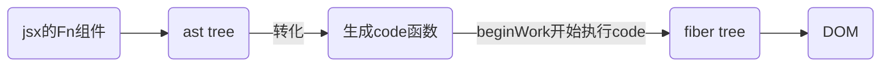
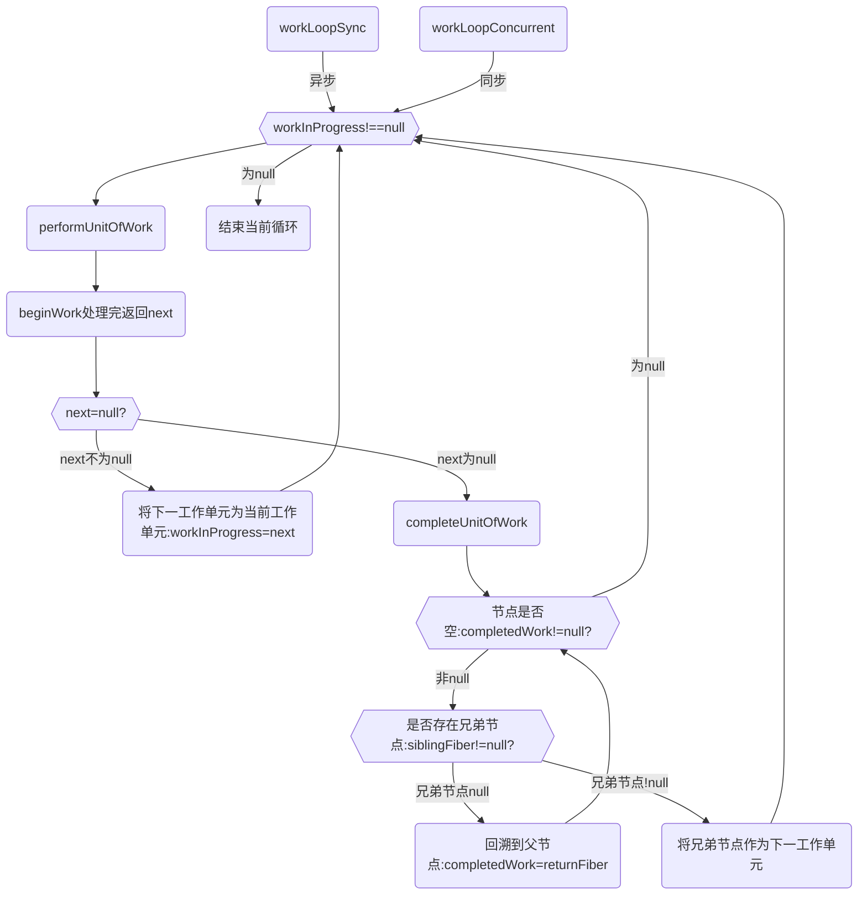

## react 特点

### 模板引擎

react 初始化的时候使用 babel 处理 jsx 模板组件，得到 ast 树的结构树,并转化为 code 函数；<br/>
jsx 转换为了浏览器能够识别的原生 js 语法，为 react 后续对状态改变、事件响应以及页面更新等奠定了基础。



### 其他

1. 配合 ts 比较友好,函数式编程是用函数的组合来进行编程,组件化开发
   1. 比如区分容器组件和展示组件
   2. react 提倡把业务拆分更小的组件，使用 shouldComponentUpdate(){return true}重新渲染组件或则 React.memo():{return true}不会渲染,进行深层比较去控制组件的渲染
2. react 渲染/更新方式
3. 丰富的技术生态圈,灵活的语法，很多大型 web 应用都是 react(notion,figma,twitter)

## vue 和 react 异同

### 异同

1.  虚拟 dom,以数据为驱动的开发模式;vue 和 react 同样采用的是虚拟 dom,渲染时找出差异修改;vue:vnode,react:fiber tree。

    > 单向数据流，单向数据流就是 model 的更新会触发 view 的更新，view 的更新不会触发 model 的更新，它们的作用是单向的

2.  vue 模版引擎：Vue 使用 template 模版进行编译的，所以在编译的时候可以很好对静态节点进行分析然后进行打补丁标记，然后在 Diff 的时候，Vue2 是判断如果是静态节点则跳过过循环对比，而 Vue3 则是把整个静态节点进行提升处理，Diff 的时候是不过进入循环的，所以 Vue3 比 Vue2 的 Diff 性能更高效。

    > react 模版引擎：React 使用 JSX 进行编译的，是无法进行静态节点分析的

        * React使用的是babel
        * vue @vue/compiler-core

3.  渲染/更新方式:
    在 Vue 中，一个组件在渲染期间依赖于自动追踪，因此 vue 框架知道提前哪一个组件需要渲染当组件状态发生改变时。每个组件可以被认为具有自动为你实现 react shouldComponentUpdate。

    > react 改变 state,react 不允许直接更改状态，需要 setState(),并且批量地对 state 进行更新以提高性能的,减少渲染次数,react 采用函数式更新。

4.  Vue2 和 Vue3 的比对和更新是同步进行的，这个跟 React15 是相同的，就是在比对的过程中，如果发现了那些节点需要移动或者更新或删除，是立即执行的，也就是 React 中常讲的不可中断的更新，如果比对量过大的话，就会造成卡顿，所以 React16 起就更改为了比对和更新是异步进行的，所以 React16 以后的 Diff 是可以中断，Diff 和任务调度都是在内存中进行的，所以即便中断了，用户也不会知道。

5.  Vue2 和 Vue3 都使用了双端对比算法，而 React 的 Fiber 由于是单向链表的结构，所以在 React 不设置由右向左的链表之前，都无法实现双端对比。

## react 父组件子组件的渲染先后顺序和深度优先搜索
父组件和子组件的渲染顺序通常遵循深度优先搜索（DFS）的原则。
>深度优先搜索是一种遍历树结构的算法，它首先沿着树的深度尽可能远的分支向下遍历，然后返回并探索未遍历的分支。在React中，组件树也可以视为一个树结构，其中每个组件可以有多个子组件。

当React应用加载时，首先会渲染根组件(最顶层组件),然后React会递归地渲染子组件，直到整个组件树被遍历完。这个过程遵循深度优先搜索的原则，即React会首先渲染当前组件的一个子组件，然后再继续渲染这个子组件的子组件，以此类推，直到所有子组件都被渲染完。
1. 父组件会在子组件之前被渲染。
2. 生命周期方法（例如componentDidMount、componentDidUpdate、componentWillUnmount等）会在深度优先搜索的过程中按照父组件到子组件的顺序被调用。这意味着父组件的生命周期方法会在子组件之前执行。
3. 当组件的状态或属性发生变化时，React会重新渲染受影响的组件，仍然遵循深度优先搜索的原则。

### 子组件的componentDidMount先执行,父组件的后执行
正确的渲染顺序如下：
```
渲染父组件。--> 父组件render()执行
渲染子组件。--> 子组件render()执行
调用子组件的 componentDidMount/useEffect
调用父组件的 componentDidMount/useEffect
```

### 总结父子组件生命周期执行顺序
父子组件初始化
* 父组件 constructor
* 父组件 getDerivedStateFromProps
* 父组件 render
* 子组件 constructor
* 子组件 getDerivedStateFromProps
* 子组件 render
* 子组件 componentDidMount
* 父组件 componentDidMount

子组件修改自身state
* 子组件 getDerivedStateFromProps
* 子组件 shouldComponentUpdate
* 子组件 render
* 子组件 getSnapShotBeforeUpdate
* 子组件 componentDidUpdate

父组件修改props
* 父组件 getDerivedStateFromProps
* 父组件 shouldComponentUpdate
* 父组件 render
* 子组件 getDerivedStateFromProps
* 子组件 shouldComponentUpdate
* 子组件 render
* 子组件 getSnapShotBeforeUpdate
* 父组件 getSnapShotBeforeUpdate
* 子组件 componentDidUpdate
* 父组件 componentDidUpdate

卸载子组件
* 父组件 getDerivedStateFromProps
* 父组件 shouldComponentUpdate
* 父组件 render
* 父组件 getSnapShotBeforeUpdate
* 子组件 componentWillUnmount
* 父组件 componentDidUpdate


## 两大阶段:render 和 commit

## 1.render构建fiber树:beginWork阶段和completeWork阶段

render 阶段是在内存中构建一棵新的 fiber 树（称为 workInProgress 树）,构建过程是依照现有 fiber 树（current 树）从 root 开始深度优先遍历再回溯到 root 的过程，这个过程中每个 fiber 节点都会经历两个阶段：**beginWork 和 completeWork**。

workLoopSync 负责以递归方式调用 performUnitOfWork，从根组件开始一直到叶子组件，然后再返回到根组件，直到整个组件树中没有工作单元需要处理


### 基础1-构建fiber 遍历流程
react把每个fiber当成生成fiber最小单元,只要迭代所有fiber则到顶级Fiber时生成整颗FiberTree。

### 遍历流程
Tree 构建的遍历顺序，它会以旧的fiber tree为蓝本，把每个fiber作为一个工作单元，自顶向下逐节点构造workInProgress tree（构建中的新fiber tree）:

深度优先遍历
1. 从顶点开始遍历
2. 如果有子节点，先遍历子节点；
3. 如果没有子节点，则看有没有兄弟节点，有则遍历兄弟节点，并把effect向上归并
4. 如果没有兄弟节点，则看有没有父兄弟节点，有则遍历父兄弟节点
5. 如果没有都没有了，那么遍历结束



### 1-1. beginWork阶段:将ast树(或则code函数webpack模式下)转换为fiber树
>组件的状态计算、diff 的操作:通过 Diff 算法找出所有节点变更，例如节点新增、删除、属性变更等等, 获得需要更新的节点信息，以及 render 函数的执行，发生在 beginWork 阶段

参考 重点 beginWork 流程：[render阶段-mountIndeterminateComponent构建fiber树](./React/render阶段-mountIndeterminateComponent构建fiber树)

### 1-2. completeWork阶段:生成实例
completeWork阶段处在beginWork之后，commit之前，起到的是一个承上启下的作用。它接收到的是经过diff后的fiber节点，然后他自己要将DOM节点和effectList都准备好。因为commit阶段是不能被打断的，所以充分准备有利于commit阶段做更少的工作。

作用：
1. 为新增的 fiber 节点生成对应的DOM节点。
2. 更新DOM节点的属性。
3. 进行事件绑定。
4. 收集effectTag。

参考 1：[render阶段总览](./React/render阶段总览)

### 1-3.render可调度

在 render 阶段，一个庞大的更新任务被分解为了一个个的工作单元，这些工作单元有着不同的优先级，React 可以根据优先级的高低去实现工作单元的打断和恢复。

异步可中断更新，在构建 workInProgress 的过程中，如果有更高优先级的更新产生， React 会停止 workInProgress fiber tree 的构建，然后开始处理更高优先级的更新，重新构建 workInProgress fiber tree。

等更高优先级的更新处理完毕之后，才会处理原来被中断的更新。

React fiber 的构建的过程以每个 fiber 作为一个工作单元，进行工作循环，工作循环中每次处理一个任务（工作单元），处理完毕有一次喘息的机会：

```js
while (nextUnitOfWork !== null && !shouldYieldToRenderer()) {
  nextUnitOfWork = performUnitOfWork(nextUnitOfWork);
}
```

## 2.commit 阶段分为3个阶段

参考：[render 阶段结束后-进入 commit 阶段](./React/render阶段结束后-进入commit阶段)

在 render 阶段结束后，会进入 commit 阶段，该阶段不可中断,commit 阶段的调度优先级采用的是最高优先级，以保证 commit 阶段同步执行不可被打断。

相应的节点进行提交，渲染到页面上,在 commit 阶段就会操作真实节点，将它们插入到 dom 树中:

### 2-1.Before mutation 阶段（执行 DOM 操作前）；

  - 对于类组件，执行 getSnapshotBeforeUpdate 生命周期
  - 对于函数组件，异步调用 useEffect

### 2-2.mutation 阶段（执行 DOM 操作）；

  - 进行真实的 DOM 操作

### 2-3.layout 阶段（执行 DOM 操作后）
  - 对于类组件，会执行 setState 的 callback
  - 对于函数组件，会执行 useLayoutEffect

主要是去依据 workInProgress 树中有变化的那些节点（render 阶段的 completeWork 过程收集到的 effect 链表）,去完成 DOM 操作，将更新应用到页面上，除此之外，还会异步调度 useEffect 以及同步执行 useLayoutEffect。

complete 阶段 workInProgress 节点都是经过 diff 算法调和过的，也就意味着对于某个节点来说它 fiber 的形态已经基本确定了，但除此之外还有两点：

- 目前只有 fiber 形态变了，对于原生 DOM 组件（HostComponent）和文本节点（HostText）的 fiber 来说，对应的 DOM 节点（fiber.stateNode）并未变化。
- 经过 Diff 生成的新的 workInProgress 节点持有了 flag(即 effectTag)

workInProgress 节点的 completeWork 阶段主要做的:

- 真实 DOM 节点的创建以及挂载

```
构建过程中，会自下而上将子节点的第一层第一层插入到当前节点。
更新过程中，会计算DOM节点的属性，一旦属性需要更新，会为DOM节点对应的workInProgress节点标记Update的effectTag
```

- effectList 的收集

```
执行beginWork后会创建子 Fiber 节点，节点上可能存在effectTag。
```

- DOM 属性的处理,次要理解
- 错误处理,次要理解

## 3.hooks 初始化

参考：[hooks 的初始化和 setState 组件更新-流程图-初始化 hook-state-接上面 beginWork](./React/setState组件更新和hooks的初始化)

## 4. 执行 setState(xx)组件更新,重点在 dispatchSetState

参考：[hooks 的初始化和 setState 组件更新-流程图-data 更新之后-获取 state-调度更新](./React/setState组件更新和hooks的初始化)

## 5. 优化.useState 同步还是异步?

参考：[React/setState 的异步和同步问题](./React/setState异步-同步)

## useEffect
useEffect的执行是在commit之后，React的commit阶段简单来说，就是将DOM渲染到页面上。

useEffect 需要先调度，在Layout 阶段完成后再异步执行。
请记得 React 会等待浏览器完成画面渲染之后才会延迟调用 `useEffect`，因此会使得额外操作很方便

### useEffect的执行顺序问题，如果父组件和子组件同时存在useEffect执行先后？

子组件的useEffect先走

解析：按照这个执行逻辑来看的话：
* 父组件进入commit阶段，发现有子组件组件需要渲染。

* 开始进行子组件的生命周期, 子组件进入commit阶段，执行子组件的useEffect，子组件渲染结束

* 父组件进行commit阶段，渲染完成，执行useEffect
