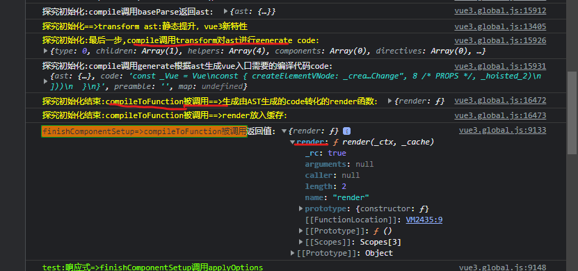
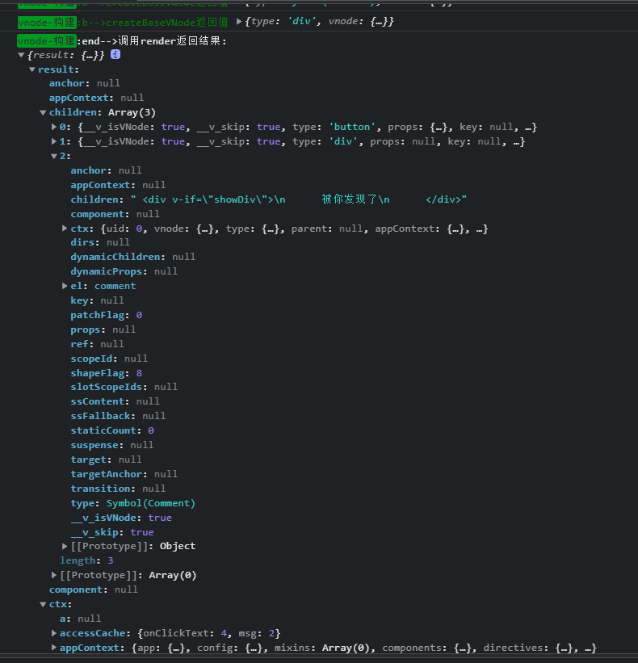

## 1. 应用入口


## 初始化


这个阶段`finishComponentSetup()`是重点函数，调用`compileToFunction()`返回了ast生成的函数
```js
  function finishComponentSetup(instance, isSSR, skipOptions) {
    const Component = instance.type;
    // ...
    if (!instance.render) {
      // only do on-the-fly compile if not in SSR - SSR on-the-fly compilation
      // is done by server-renderer
      if (!isSSR && compile && !Component.render) {
        const template = Component.template ||
          resolveMergedOptions(instance).template;
        if (template) {
          {
            startMeasure(instance, `compile`);
          }
          const { isCustomElement, compilerOptions } = instance.appContext.config;
          const { delimiters, compilerOptions: componentCompilerOptions } = Component;
          const finalCompilerOptions = extend(extend({
            isCustomElement,
            delimiters
          }, compilerOptions), componentCompilerOptions);
          console.log('finishComponentSetup=>compileToFunction被调用:', { template, finalCompilerOptions })
          // debugger
          Component.render = compile(template, finalCompilerOptions);
          {
            endMeasure(instance, `compile`);
          }
        }
      }

      // ...
      instance.render = (Component.render || NOOP);
    }
  }

  let compile;
  let installWithProxy;
  registerRuntimeCompiler(compileToFunction);
  /**
   * For runtime-dom to register the compiler.
   * Note the exported method uses any to avoid d.ts relying on the compiler types.
   */
  function registerRuntimeCompiler(_compile) {
    console.log('探究初始化==>registerRuntimeCompiler')
    compile = _compile;
    installWithProxy = i => {
      if (i.render._rc) {
        i.withProxy = new Proxy(i.ctx, RuntimeCompiledPublicInstanceProxyHandlers);
      }
    };
  }

  function compileToFunction(template, options) {
  console.log('compileToFunction被调用:', { template, options })
    // ...
  }
```


### 初始化源码
`patch`
```js
else if (shapeFlag & 6 /* ShapeFlags.COMPONENT */) {
  console.log(`%c运行时==>patch-->较为重点的2:COMPONENT:调用processComponent处理组件元素:`, 'color:red')
  processComponent(n1, n2, container, anchor, parentComponent, parentSuspense, isSVG, slotScopeIds, optimized);
}
```

`processComponent`
```js
const processComponent = (n1, n2, container, anchor, parentComponent, parentSuspense, isSVG, slotScopeIds, optimized) => {
  n2.slotScopeIds = slotScopeIds;
  if (n1 == null) {
    if (n2.shapeFlag & 512 /* ShapeFlags.COMPONENT_KEPT_ALIVE */) {
      parentComponent.ctx.activate(n2, container, anchor, isSVG, optimized);
    }
    else {
      console.log(`%cpath之processComponent:1调用mountComponent:`, 'color:magenta')
      mountComponent(n2, container, anchor, parentComponent, parentSuspense, isSVG, optimized);
    }
  }
  else {
    console.log(`%cpath之processComponent:2调用updateComponent:`, 'color:magenta')
    updateComponent(n1, n2, optimized);
  }
};
```

`mountComponent = (initialVNode`
```js
const mountComponent = (initialVNode, container, anchor, parentComponent, parentSuspense, isSVG, optimized) => {
  const instance = (initialVNode.component = createComponentInstance(initialVNode, parentComponent, parentSuspense));
  console.log(`%c组件挂载：mountComponent:1调用createComponentInstance创建组件实例:`, 'color:magenta', instance)
  if (instance.type.__hmrId) {
    registerHMR(instance);
  }
  {
    pushWarningContext(initialVNode);
    startMeasure(instance, `mount`);
  }
  // inject renderer internals for keepAlive
  // 将keepAlive注入渲染器内部
  if (isKeepAlive(initialVNode)) {
    instance.ctx.renderer = internals;
  }
  // resolve props and slots for setup context
  {
    {
      startMeasure(instance, `init`);
    }

    console.log(`%c组件挂载：mountComponent:2调用setupComponent设置组件实例:`, 'color:magenta')
    console.log('test:定义在data的响应式start==>mountComponent调用setupComponent')
    setupComponent(instance);
    {
      endMeasure(instance, `init`);
    }
  }
```

`handleSetupResult`-->`finishComponentSetup`
```js
function handleSetupResult(instance, setupResult, isSSR) {
  if (isFunction(setupResult)) {
    // setup returned an inline render function
    {
      instance.render = setupResult;
    }
  }
  else if (isObject(setupResult)) {
    if (isVNode(setupResult)) {
      warn$1(`setup() should not return VNodes directly - ` +
        `return a render function instead.`);
    }
    // setup returned bindings.
    // assuming a render function compiled from template is present.
    {
      instance.devtoolsRawSetupState = setupResult;
    }
    instance.setupState = proxyRefs(setupResult);
    {
      exposeSetupStateOnRenderContext(instance);
    }
  }
  else if (setupResult !== undefined) {
    warn$1(`setup() should return an object. Received: ${setupResult === null ? 'null' : typeof setupResult}`);
  }
  console.log('%ctest:响应式=>handleSetupResult调用finishComponentSetup', 'color:chartreuse')
  finishComponentSetup(instance, isSSR);
}
```

## 编译AST,转换AST为render()
参考：[编译AST-转换AST为render](./编译AST-转换AST为render)

## 收集和更新副作用：
调用patch处理组件元素为例
* 在mountComponent走reactive流程
```
见: 
00-3-vue3源码-响应式原理与reactive.md
```
* 在 componentUpdateFn 函数中，进行了组件的初始挂载和更新，生命周期函数就是在这些操作的前后触发执行的，在上面的源码中，使用 invokeArrayFns 函数进行生命周期函数的触发执行


## data更新


## 前言
* compiler表示template-->AST抽象语法树

* reactivity表示响应式,effect 副作用函数（Vue3中已经没有了watcher概念,由effect取而代之）
```
1. Vue3 用 ES6的Proxy 重构了响应式，new Proxy(target, handler)

2. Proxy 的 get handle 里 执行track() 用来收集依赖(收集 activeEffect，也就是 effect )
3. Proxy 的 set handle 里执行 trigger() 用来触发响应(执行收集的 effect)
```
* runtime表示运行时相关功能，虚拟DOM(即：VNode)、diff算法、真实DOM操作等


### 例子1：探究初始化:compile调用baseParse返回ast
```
00-辅-compile调用baseParse返回ast.json
```

### 例子2:生成由AST生成的code转化的render函数
```js
function render(_ctx, _cache) {
  with (_ctx) {
    const { createElementVNode: _createElementVNode, toDisplayString: _toDisplayString, openBlock: _openBlock, createElementBlock: _createElementBlock } = _Vue

    return (_openBlock(), _createElementBlock("div", null, [
      _createElementVNode("button", {
        onClick: onClickText,
        class: "btn"
      }, "Hello world,Click me", 8 /* PROPS */, _hoisted_1),
      _createElementVNode("div", null, [
        _createElementVNode("span", null, "ruo-" + _toDisplayString(msg), 1 /* TEXT */)
      ])
    ]))
  }
}
```

### 例子3:调用render返回vnode
注意：
```html
<div>
  <button class="btn">Hello world,Click me</button>
  <span>ruo-改变我</span>
  <!--
  注释节点也会被模板引擎编译
  <div v-if="showDiv">
    被你发现了
  </div>
  -->
</div>
```

不带注释代码



# 一. AST 创建
进行复杂的解析的目的是为了获得一棵关于源码的AST树

`变换AST的结构，使它在不失去原本的语义的情况下，对源码进行优化。`

code抽象语法树AST,对源代码的结构抽象。因此我们对该树进行语义分析，通过变换该抽象结构，而不改变原来的语义，达到优化的目的等等。
```
vue3新特性：transform中的hoistStatic发生静态提升

hoistStatic其会递归ast并发现一些不会变的节点与属性，给他们打上可以静态提升的标记。在生成代码字符串阶段，将其序列化成字符串、以减少编译和渲染成本。
```

1. 将compileToFunction()注册到 runtime,然后调用compileToFunction()
```js
console.log('探究初始化==>将编译函数注册到运行时')
registerRuntimeCompiler(compileToFunction);
```
2. compileToFunction()调用编辑器compile并返回结果code;
```js
function compileToFunction(template, options) {
  // 如果模板不是字符串,判断是否为dom的node节点，是的话取其innerHTML作为模板
  if (!isString(template)) {
    if (template.nodeType) {
      template = template.innerHTML;
    }
    else {
      warn$1(`invalid template option: `, template);
      return NOOP;
    }
  }

  // 如果有缓存渲染函数，返回缓存
  const key = template;
  const cached = compileCache[key];
  if (cached) {
    return cached;
  }

  if (template[0] === '#') {
    const el = document.querySelector(template);
    if (!el) {
      warn$1(`Template element not found or is empty: ${template}`);
    }
    // __UNSAFE__
    // Reason: potential execution of JS expressions in in-DOM template.
    // The user must make sure the in-DOM template is trusted. If it's rendered
    // by the server, the template should not contain any user data.
    template = el ? el.innerHTML : ``;
  }
  const opts = extend({
    hoistStatic: true,
    onError: onError,
    onWarn: e => onError(e, true)
  }, options);
  if (!opts.isCustomElement && typeof customElements !== 'undefined') {
    opts.isCustomElement = tag => !!customElements.get(tag);
  }

  console.log('探究初始化:compileToFunction==>：', { template: template })
  const { code } = compile$1(template, opts);
  console.log('%c探究初始化结束:compileToFunction==>调用compile$1 生成由AST生成的code：', "color:yellow", { code: code })

  function onError(err, asWarning = false) {
    const message = asWarning
      ? err.message
      : `Template compilation error: ${err.message}`;
    const codeFrame = err.loc &&
      generateCodeFrame(template, err.loc.start.offset, err.loc.end.offset);
    warn$1(codeFrame ? `${message}\n${codeFrame}` : message);
  }
  // The wildcard import results in a huge object with every export
  // with keys that cannot be mangled, and can be quite heavy size-wise.
  // In the global build we know `Vue` is available globally so we can avoid
  // the wildcard object.
  const render = (new Function(code)());
  render._rc = true;
  console.log('%c探究初始化结束:compileToFunction==>将 render code 转化为 function：', "color:yellow", { render: render })
  console.log('%c探究初始化结束:compileToFunction==>将 render放入缓存：', "color:yellow")
  return (compileCache[key] = render);
}
```


3. 如源码：将code传入Funtion生成匿名函数并调用
最终将匿名函数返回结果render进行key为源html字符串，value为render变量的缓存。
```js
const render = (new Function(code)())
```


### 1-1.模板元素解析例子：
```html
<div>
  <p>Hello World</p>
</div>
```


图片中是解析过程中，保存解析后节点的栈的存储情况,

图中的黄色矩形是一个栈，当开始解析时，parseChildren 首先会遇到 div 标签，开始调用的 parseElement 函数。通过 parseTag 函数解析出了 div 元素，并将它压入栈中，递归解析子节点。第二次调用 parseChildren 函数，遇见 p 元素，调用 parseElement 函数，将 p 标签压入栈中，此时栈中有 div 和 p 两个标签。再次解析 p 中的子节点，第三次调用 parseChildren 标签，这次不会匹配到任何标签，不会生成对应的 node，所以会通过 parseText 函数去生成文本，解析出 node 为 HelloWorld，并返回 node。

将这个文本类型的 node 添加进 p 标签的 children 属性后，此时 p 标签的子节点解析完毕，弹出祖先栈，完成结束标签的解析后，返回 p 标签对应的 element 对象。

p 标签对应的 node 节点生成，并在 parseChildren 函数中返回对应 node。

div 标签在接收到 p 标签的 node 后，添加进自身的 children 属性中，出栈。此时祖先栈中就空空如也了。而 div 的标签完成闭合解析的逻辑后，返回 element 元素。

最终 parseChildren 的第一次调用返回结果，生成了 div 对应的 node 对象，也返回了结果，将这个结果作为 createRoot 函数的 children 参数传入，生成根节点对象，完成 ast 解析。

## 第一步. compileToFunction 调用 compile$1

## 第二步. compile() 调用 baseCompile(),传入符合浏览器的CompilerOptions，并将结果返回
baseCompile 函数在执行过程中会生成 AST 抽象语法树,关键的一步，因为只有拿到生成的 AST 我们才能遍历 AST 的节点进行 transform 转换操作，比如解析 v-if、v-for 等各种指令，或者对节点进行分析将满足条件的节点静态提升，这些都依赖之前生成的 AST 抽象语法树。

compile就是符合浏览器平台的定制编译器，所谓的定制，就是传入特定的options可选项.
```js
function compile$1(template, options = {}) {
  return baseCompile(template, extend({}, parserOptions, options, {
    // nodeTransforms列表会对抽象语法树的node节点进行特定变换
    nodeTransforms: [
      ignoreSideEffectTags,
      ...DOMNodeTransforms,
      ...(options.nodeTransforms || [])
    ],
    // 关于指令的变换函数 
    // DOMDirectiveTransforms 包括v-html、v-text、v-model、v-on、v-show
    directiveTransforms: extend({}, DOMDirectiveTransforms, options.directiveTransforms || {}),
    transformHoist: null
  }));
}

function baseCompile(template, options = {}) {
  // ...
  ...
  // ...
  const ast = isString(template) ? baseParse(template, options) : template;

  console.log('探究初始化:compile$1 调用 baseParse 返回ast：', ast)
  // 根据前缀标识，获取预设转换函数
  const [nodeTransforms, directiveTransforms] = getBaseTransformPreset();
  // 对ast进行变换
  transform(ast, extend({}, options, {
    prefixIdentifiers,
    nodeTransforms: [
      ...nodeTransforms,
      ...(options.nodeTransforms || []) // user transforms
    ],
    directiveTransforms: extend({}, directiveTransforms, options.directiveTransforms || {} // user transforms
    )
  }));
  // 根据ast生成vue入口需要的编译代码code
  console.log('探究初始化:compile$1 调用 transform对ast进行转换：', ast)
  const generateAst = generate(ast, extend({}, options, {
    prefixIdentifiers
  }));

  console.log('探究初始化:compile$1 调用 generate根据ast生成vue入口需要的编译代码code：', generateAst)
  return generateAst
}
```

### 2-1.让我们深入baseCompile 可以根据它定制符合任意平台的编译器。
如上面baseCompile代码,ast 的生成有一个三目运算符的判断，如果传进来的 template 模板参数是一个字符串，那么则调用 baseParse 解析模板字符串，否则直接将 template 作为 ast 对象。baseParse 里做了什么事情才能生成 ast 呢？一起来看一下源码，

### 2-2.baseParse 调用createRoot()返回RootNode类型的根节点对象
baseParse涉及标签解析、属性解析、指令解析、插槽解析等等，只挑选一个例子进行剖析;

createRoot返回了一个 RootNode 类型的根节点对象，其中我们传入的 children 参数会被作为根节点的 children 参数。

所以生成 ast 的关键点就会聚焦到 parseChildren 这个函数上来。parseChildren 函数如果不去看它的源码，见文之意也可以大致了解这是一个解析子节点的函数。接下来我们就来一起来看一下 AST 解析中最关键的 parseChildren 函数
```js
function baseCompile(template, options = {}) {
  const ast = isString(template) ? baseParse(template, options) : template;
}

function baseParse(content, options = {}) {
  const context = createParserContext(content, options);
  const start = getCursor(context);
  return createRoot(parseChildren(context, 0 /* TextModes.DATA */, []), getSelection(context, start));
}

// 代码中，唯一难理解的是TextModes.DATA参数。因此在继续往下剖析之前，我们需要先了解TextModes枚举,TextModes即源码的类型,及其各个值得意义:
export const enum TextModes {
  // DATA类型即为元素（包括组件）
  DATA, //    | ✔        | ✔        | End tags of ancestors |
  // RCDATA是在<textarea>标签中的文本，在该标签中的空格和换行不会被浓缩；
  RCDATA, //  | ✘        | ✔        | End tag of the parent | <textarea>
  // RAWTEXT类型为<style>,<script>为中的代码，即JS与CSS；
  RAWTEXT, // | ✘        | ✘        | End tag of the parent | <style>,<script>
  // CDATA是普通前端比较少接触的<![CDATA[cdata]]>代码，这是使用于XML与XHTML中的注释，在该注释中的cdata代码将不会被解析器解析，而会当做普通文本处理;
  CDATA,
  // ATTRIBUTE_VALUE顾名思义，即是各个标签的属性。
  ATTRIBUTE_VALUE
}
```

## 第三步. parseChildren将正式进入解析阶段: AST解析中最关键的parseChildren()
parseChildren 函数接收三个参数，context：解析器上下文，mode：文本数据类型，ancestors：祖先节点数组。
```
而函数的执行中会首先从祖先节点中获取当前节点的父节点，确定命名空间，以及创建一个空数组，用来储存解析后的节点。之后会有一个 while 循环，判断是否到达了标签的关闭位置，如果不是需要关闭的标签，则在循环体内对源模板字符串进行分类解析。之后会有一段处理空白字符的逻辑，处理完成后返回解析好的 nodes 数组。在大家对于 parseChildren 的执行流程有一个初步理解之后，我们一起来看一下函数的核心，while 循环内的逻辑。

在 while 中解析器会判断文本数据的类型，只有当 TextModes 为 DATA 或 RCDATA 时会继续往下解析。

第一种情况就是判断是否需要解析 Vue 模板语法中的 “Mustache”语法 (双大括号) ，如果当前上下文中没有 v-pre 指令来跳过表达式，并且源模板字符串是以我们指定的分隔符开头的（此时 context.options.delimiters 中是双大括号），就会进行双大括号的解析。这里就可以发现，如果当你有特殊需求，不希望使用双大括号作为表达式插值，那么你只需要在编译前改变选项中的 delimiters 属性即可。

接下来会判断，如果第一个字符是 “<” 并且第二个字符是 '!'的话，会尝试解析注释标签，<!DOCTYPE 和 <!CDATA 这三种情况，对于 DOCTYPE 会进行忽略，解析成注释。

之后会判断当第二个字符是 “/” 的情况，“</” 已经满足了一个闭合标签的条件了，所以会尝试去匹配闭合标签。当第三个字符是 “>”，缺少了标签名字，会报错，并让解析器的进度前进三个字符，跳过 “</>”。

如果“</”开头，并且第三个字符是小写英文字符，解析器会解析结束标签。

如果源模板字符串的第一个字符是 “<”，第二个字符是小写英文字符开头，会调用 parseElement 函数来解析对应的标签。

当这个判断字符串字符的分支条件结束，并且没有解析出任何 node 节点，那么会将 node 作为文本类型，调用 parseText 进行解析。

最后将生成的节点添加进 nodes 数组，在函数结束时返回。
```

这就是 while 循环体内的逻辑，且是 parseChildren 中最重要的部分。在这个判断过程中，我们看到了双大括号语法的解析，看到了注释节点的怎样被解析的，也看到了开始标签和闭合标签的解析，以及文本内容的解析。

移除空白符的逻辑相对简单、且不是我们的重点。我们只需了解`RAWTEXT 和 RCDATA 类型的节点`，以及前文提到的`<pre>`标签中的文本（包括标签本身）和注释不会被去除空白符。其中RAWTEXT类型是JS和CSS代码，它们的空白符，是在进行生产构建时，由构建工具处理。

我们需要关注插值的解析与元素的解析部分。在判断是否插值的表达式中，我们可以注意到这样一个变量context.options.delimiters[0]。不知还有没印象，在上下文context中的options是我们在入口文件传入的自选项options，其中包括用户自定义选项。这说明，使用vue的开发者可以通过传入delimiters数组达到自定义定界符的目的，该参数的默认值是`["{{","}}"]`。
接着，我们继续剖析parseInterpolation解析函数，我们只讲解这一个解析案例，其他的解析函数都大同小异，若无特殊情况，都不再剖析其他解析函数。
```js
function parseChildren(context, mode, ancestors) {
  // 获取最后一个祖先节点，即父节点，在上一小节中传入空数组，即没有父节点
  const parent = last(ancestors);
  // 父节点的命名空间，父节点不存在就默认取HTML命名空间，即解析时，对应节点会被当做HTML节点处理
  const ns = parent ? parent.ns : 0 /* Namespaces.HTML */;
  // 当前父节点的子节点数组
  const nodes = [];
  /* 递归解析:
  当标签未闭合时，解析对应节点
  根据上下文、节点类型和祖先节点判断是否到达结尾
  */
  while (!isEnd(context, mode, ancestors)) {
    // 获取需要解析的源码
    const s = context.source;
    // 声明子节点
    let node = undefined;
    if (mode === 0 /* TextModes.DATA */ || mode === 1 /* TextModes.RCDATA */) {

      /* 如果标签没有 v-pre 指令，源模板字符串以双大括号 `{{` 开头，按双大括号语法解析 */
      if (!context.inVPre && startsWith(s, context.options.delimiters[0])) {
        // 如果没有使用v-pre指令，且源码以的delimiters[0]选项存在，默认为'{{'，则当做插值表达式进行解析
        console.log('探究初始化==>其中一个解析案例1:如果没有使用v-pre指令，且源码以的delimiters[0]选项存在，默认为"{{"，则当做插值表达式进行解析,parseChildren调用 parseInterpolation,返回AST节点描述对象')
        node = parseInterpolation(context, mode);
      }
      else if (mode === 0 /* TextModes.DATA */ && s[0] === '<') {
        // https://html.spec.whatwg.org/multipage/parsing.html#tag-open-state
        // 如果是dom标签，按照HTML官网规范解析，以下是HTML官方“开始标签”解析算法
        if (s.length === 1) {
          // 如果是源码的最后一个字符，报边界错误
          emitError(context, 5 /* ErrorCodes.EOF_BEFORE_TAG_NAME */, 1);
        }

        // 如果源模板字符串的第以个字符位置是 `!`
        else if (s[1] === '!') {
          // https://html.spec.whatwg.org/multipage/parsing.html#markup-declaration-open-state
          // 如果以 '<!--' 开头，按注释解析
          // '<'后接'!'则，当做注释进行解析，以HTML官方算法解析注释。
          // 注释类型包括'<!--'、 '<!DOCTYPE'、'<![CDATA['三种
          if (startsWith(s, '<!--')) {
            node = parseComment(context);
          }
          else if (startsWith(s, '<!DOCTYPE')) {
            // Ignore DOCTYPE by a limitation.
            // 如果以 '<!DOCTYPE' 开头，忽略 DOCTYPE，当做伪注释解析
            node = parseBogusComment(context);
          }

          // 如果以 '<![CDATA[' 开头，又在 HTML 环境中，解析 CDATA
          else if (startsWith(s, '<![CDATA[')) {
            if (ns !== 0 /* Namespaces.HTML */) {
              node = parseCDATA(context, ancestors);
            }
            else {
              emitError(context, 1 /* ErrorCodes.CDATA_IN_HTML_CONTENT */);
              node = parseBogusComment(context);
            }
          }
          else {
            emitError(context, 11 /* ErrorCodes.INCORRECTLY_OPENED_COMMENT */);
            node = parseBogusComment(context);
          }
        }
        // 如果源模板字符串的第二个字符位置是 '/'
        else if (s[1] === '/') {
          // https://html.spec.whatwg.org/multipage/parsing.html#end-tag-open-state
          //  如果是'</'当做结束标签进行解析，依然使用HTML官方算法
          if (s.length === 2) {
            emitError(context, 5 /* ErrorCodes.EOF_BEFORE_TAG_NAME */, 2);
          }
          // 如果源模板字符串的第三个字符位置是 '>'，那么就是自闭合标签，前进三个字符的扫描位置
          else if (s[2] === '>') {
            emitError(context, 14 /* ErrorCodes.MISSING_END_TAG_NAME */, 2);
            advanceBy(context, 3);
            continue;
          }
          // 如果第三个字符位置是英文字符，解析结束标签
          else if (/[a-z]/i.test(s[2])) {
            emitError(context, 23 /* ErrorCodes.X_INVALID_END_TAG */);
            parseTag(context, 1 /* TagType.End */, parent);
            continue;
          }
          // 如果不是上述情况，则当做伪注释解析
          else {
            emitError(context, 12 /* ErrorCodes.INVALID_FIRST_CHARACTER_OF_TAG_NAME */, 2);
            node = parseBogusComment(context);
          }
        }
        // 解析结束标签
        // 如果标签的第二个字符是小写英文字符，则当做元素标签解析
        else if (/[a-z]/i.test(s[1])) {
          console.log('探究初始化==>其中一个解析案例3,如果是以[a-z]开头的标签，当做元素进行解析（包括组件），')
          node = parseElement(context, ancestors);
        }
        // 对2.x中<template>的兼容。在3.x中，若没有vue的官方指令，会被当做原生的dom标签
        // 如果第二个字符是 '?'，当做伪注释解析
        else if (s[1] === '?') {
          // 如果是'<?'报不支持该类型的标签，且当做注释进行解析
          emitError(context, 21 /* ErrorCodes.UNEXPECTED_QUESTION_MARK_INSTEAD_OF_TAG_NAME */, 1);
          node = parseBogusComment(context);
        }
        else {
          // 都不是这些情况，则报出第一个字符不是合法标签字符的错误。
          // 报非法字符串错误
          emitError(context, 12 /* ErrorCodes.INVALID_FIRST_CHARACTER_OF_TAG_NAME */, 1);
        }
      }
    }

    // 如果上述的情况解析完毕后，没有创建对应的节点，则当做文本来解析
    if (!node) {
      node = parseText(context, mode);
    }

    // 如果节点是数组，则遍历添加进 nodes 数组中，否则直接添加
    if (isArray(node)) {
      for (let i = 0; i < node.length; i++) {
        pushNode(nodes, node[i]);
      }
    }
    else {
      pushNode(nodes, node);
    }
  }
  // Whitespace handling strategy like v2
  // 标记是否移除空格,处理空白字符，提高输出效率
  let removedWhitespace = false;
  if (mode !== 2 /* TextModes.RAWTEXT */ && mode !== 1 /* TextModes.RCDATA */) {
    const shouldCondense = context.options.whitespace !== 'preserve';
    for (let i = 0; i < nodes.length; i++) {
      const node = nodes[i];
      if (node.type === 2 /* NodeTypes.TEXT */) {
        if (!context.inPre) {
          if (!/[^\t\r\n\f ]/.test(node.content)) {
            const prev = nodes[i - 1];
            const next = nodes[i + 1];
            // Remove if:
            // - the whitespace is the first or last node, or:
            // - (condense mode) the whitespace is between twos comments, or:
            // - (condense mode) the whitespace is between comment and element, or:
            // - (condense mode) the whitespace is between two elements AND contains newline
            if (!prev ||
              !next ||
              (shouldCondense &&
                ((prev.type === 3 /* NodeTypes.COMMENT */ &&
                  next.type === 3 /* NodeTypes.COMMENT */) ||
                  (prev.type === 3 /* NodeTypes.COMMENT */ &&
                    next.type === 1 /* NodeTypes.ELEMENT */) ||
                  (prev.type === 1 /* NodeTypes.ELEMENT */ &&
                    next.type === 3 /* NodeTypes.COMMENT */) ||
                  (prev.type === 1 /* NodeTypes.ELEMENT */ &&
                    next.type === 1 /* NodeTypes.ELEMENT */ &&
                    /[\r\n]/.test(node.content))))) {
              removedWhitespace = true;
              nodes[i] = null;
            }
            else {
              // Otherwise, the whitespace is condensed into a single space
              node.content = ' ';
            }
          }
          else if (shouldCondense) {
            // in condense mode, consecutive whitespaces in text are condensed
            // down to a single space.
            node.content = node.content.replace(/[\t\r\n\f ]+/g, ' ');
          }
        }
        else {
          // #6410 normalize windows newlines in <pre>:
          // in SSR, browsers normalize server-rendered \r\n into a single \n
          // in the DOM
          node.content = node.content.replace(/\r\n/g, '\n');
        }
      }
      // Remove comment nodes if desired by configuration.
      else if (node.type === 3 /* NodeTypes.COMMENT */ && !context.options.comments) {
        removedWhitespace = true;
        nodes[i] = null;
      }
    }
    if (context.inPre && parent && context.options.isPreTag(parent.tag)) {
      // remove leading newline per html spec
      // https://html.spec.whatwg.org/multipage/grouping-content.html#the-pre-element
      const first = nodes[0];
      if (first && first.type === 2 /* NodeTypes.TEXT */) {
        first.content = first.content.replace(/^\r?\n/, '');
      }
    }
  }
  // 移除空白字符，返回解析后的节点数组
  return removedWhitespace ? nodes.filter(Boolean) : nodes;
}
```

### 3-1. parseInterpolation
```js
function parseInterpolation(context, mode) {
// 获取开始与结束定界符
const [open, close] = context.options.delimiters;
// 从开始定界符之后开始寻找结束定界符的索引
const closeIndex = context.source.indexOf(close, open.length);
// 如果找不到则报错
if (closeIndex === -1) {
  emitError(context, 25 /* ErrorCodes.X_MISSING_INTERPOLATION_END */);
  return undefined;
}
// 获取开始游标
const start = getCursor(context);
// 解析位置前进open.length长度，修改上下文context的source、offset、line、column
advanceBy(context, open.length);
// 插值表达式开始位置游标，初始化，之后修改
const innerStart = getCursor(context);
// 插值表达式结束位置游标，初始化，之后修改
const innerEnd = getCursor(context);
// 计算原生插值表达式长度
const rawContentLength = closeIndex - open.length;
// 获取原生插值表达式
const rawContent = context.source.slice(0, rawContentLength);
// DATA、RCDATA、ATTRIBUTE_VALUE类型且包含'&'，由自选项提供的decodeEntities函数进行解码，其他情况返回原文本
const preTrimContent = parseTextData(context, rawContentLength, mode);
// 获得去除前后空白符的表达式，用于之后计算原生表达式的开始与结束索引
const content = preTrimContent.trim();
// 获取前面空白符的最后索引作为偏移量
const startOffset = preTrimContent.indexOf(content);
// 如果偏移量大于零，根据原生插值与偏移量修改innerStart的位置描述
if (startOffset > 0) {
  advancePositionWithMutation(innerStart, rawContent, startOffset);
}
// 获取原生插值表达式的结束偏移量
const endOffset = rawContentLength - (preTrimContent.length - content.length - startOffset);
// 修改innerEnd位置描述
advancePositionWithMutation(innerEnd, rawContent, endOffset);
// context位置前进到结束定界符之后，结束解析
advanceBy(context, close.length);

console.log('探究初始化:其中一个解析案例:parseChildren调用 parseInterpolation 返回AST节点描述对象：')
return {
  type: 5 /* NodeTypes.INTERPOLATION */,
  content: {
    type: 4 /* NodeTypes.SIMPLE_EXPRESSION */,
    isStatic: false,
    // Set `isConstant` to false by default and will decide in transformExpression
    constType: 0 /* ConstantTypes.NOT_CONSTANT */,
    content,
    loc: getSelection(context, innerStart, innerEnd)
  },
  loc: getSelection(context, start)
};
}
```

### 3-1. 初步总结
通过这一小案列的解析，我们可以总结其他解析函数的工作流程，即抽取源码，改变上下文context的source以及位置信息，最后构建AST节点返回。AST节点除了type与loc属性必不可少之外，其他属性根据特定节点赋值。比如之后的标签解析，需要添加命名空间、标签名称、标签类型、标签属性、子AST节点数组、是否自闭合标签。其中type具有以下类型：
```js
export const enum NodeTypes {
ROOT,
ELEMENT,
TEXT,
COMMENT,
SIMPLE_EXPRESSION,
INTERPOLATION,
ATTRIBUTE,
DIRECTIVE,
// containers
COMPOUND_EXPRESSION,
IF,
IF_BRANCH,
FOR,
TEXT_CALL,
// codegen
VNODE_CALL,
JS_CALL_EXPRESSION,
JS_OBJECT_EXPRESSION,
JS_PROPERTY,
JS_ARRAY_EXPRESSION,
JS_FUNCTION_EXPRESSION,
JS_CONDITIONAL_EXPRESSION,
JS_CACHE_EXPRESSION,

// ssr codegen
JS_BLOCK_STATEMENT,
JS_TEMPLATE_LITERAL,
JS_IF_STATEMENT,
JS_ASSIGNMENT_EXPRESSION,
JS_SEQUENCE_EXPRESSION,
JS_RETURN_STATEMENT
}
```

### 3-3. parseElement:分为三步，解析开始标签 -> 递归解析子节点 -> 解析结束标签。
在 while 的循环内，各个分支判断分支内，我们能看到 node 会接收各种节点类型的解析函数的返回值。而这里我会详细的说一下 parseElement 这个解析元素的函数，因为这是我们在模板中用的最频繁的场景。

并始终在上下文context中维护inPre、inVPre字段，以此判断子节点是否处于pre标签内，或者具有v-pre指令的标签内。同时兼容2.x的inline-template属性，但是需要在自选项的compatConfig配置中显示配置COMPILER_INLINE_TEMPLATE为true或者声明MODE为非3版本(编译器的行为默认为3版本)，兼容属性才会被解析。由于inline-template在Vue3不再支持，小编也从未使用过inline-template，对其不是很了解，顾有兴趣的小伙伴可以到官网自行了解内联模板。
```js
function parseElement(context, ancestors) {
  // Start tag.
  const wasInPre = context.inPre;
  const wasInVPre = context.inVPre;
  // 解析起始标签
  const parent = last(ancestors);
  console.log('探究初始化==>parseElement解析parseTag')
  const element = parseTag(context, 0 /* TagType.Start */, parent);
  const isPreBoundary = context.inPre && !wasInPre;
  const isVPreBoundary = context.inVPre && !wasInVPre;
  // 如果是自闭合的标签或者是空标签，则直接返回。voidTag例如： ``, `<br>`, `<hr>`
  if (element.isSelfClosing || context.options.isVoidTag(element.tag)) {
    // #4030 self-closing <pre> tag
    if (isPreBoundary) {
      context.inPre = false;
    }
    if (isVPreBoundary) {
      context.inVPre = false;
    }
    return element;
  }
  // Children.
  // 递归的解析子节点
  ancestors.push(element);
  const mode = context.options.getTextMode(element, parent);
  const children = parseChildren(context, mode, ancestors);
  ancestors.pop();
  element.children = children;
  // End tag.
  // 解析结束标签
  if (startsWithEndTagOpen(context.source, element.tag)) {
    parseTag(context, 1 /* TagType.End */, parent);
  }
  else {
    emitError(context, 24 /* ErrorCodes.X_MISSING_END_TAG */, 0, element.loc.start);
    if (context.source.length === 0 && element.tag.toLowerCase() === 'script') {
      const first = children[0];
      if (first && startsWith(first.loc.source, '<!--')) {
        emitError(context, 8 /* ErrorCodes.EOF_IN_SCRIPT_HTML_COMMENT_LIKE_TEXT */);
      }
    }
  }
  element.loc = getSelection(context, element.loc.start);
  if (isPreBoundary) {
    context.inPre = false;
  }
  if (isVPreBoundary) {
    context.inVPre = false;
  }
  return element;
}
```

## 第四步. 进入整个解析的重点parseTag:parseTag()用来解析开始标签、自闭合标签与结束标签
不过我们只关注其开始标签的部分。首先我们会获取当前节点的父节点，然后调用 parseTag 函数解析。

parseTag 函数会按的执行大体是以下流程：
1. 首先匹配标签名。
2. 解析元素中的 attribute 属性，存储至 props 属性
3. 检测是否存在 v-pre 指令，若是存在的话，则修改 context 上下文中的 inVPre 属性为 true
4. 检测自闭合标签，如果是自闭合，则将 isSelfClosing 属性置为 true
5. 判断 tagType，是 ELEMENT 元素还是 COMPONENT 组件，或者 SLOT 插槽
6. 返回生成的 element 对象
```js
function parseTag(context, type, parent) {
console.log('探究初始化==>我们的重点在这,parseTag()用来解析开始标签、自闭合标签与结束标签')
// Tag open.
const start = getCursor(context);
const match = /^<\/?([a-z][^\t\r\n\f />]*)/i.exec(context.source);
if (!context.inVPre) {
  if (tag === 'slot') {
    tagType = 2 /* ElementTypes.SLOT */;
  }
  else if (tag === 'template') {
    if (props.some(p => p.type === 7 /* NodeTypes.DIRECTIVE */ && isSpecialTemplateDirective(p.name))) {
      tagType = 3 /* ElementTypes.TEMPLATE */;
    }
  }
  else if (isComponent(tag, props, context)) {
    tagType = 1 /* ElementTypes.COMPONENT */;
  }
}

  // ...
  ...
  // ...
  return {
  type: 1 /* NodeTypes.ELEMENT */,
  ns,
  tag,
  tagType,
  props,
  isSelfClosing,
  children: [],
  loc: getSelection(context, start),
  codegenNode: undefined // to be created during transform phase
};
}
```

### 4-1. parseTag()之isComponent vue是如何辨别组件与dom元素的

### 4-2. parseAttribute 解析阶段的核心，解析开始标签的属性。
包括一切属性、特性、指令、组件props。在parseAttribute上一层有parseAttributes函数、其主要作用是循环调用parseAttribute，并对解析出来的class空白符浓缩为一个空格，去除前后空白符。
```js
function parseAttributes(context, type) {
const props = [];
const attributeNames = new Set();
while (context.source.length > 0 &&
  !startsWith(context.source, '>') &&
  !startsWith(context.source, '/>')) {
  if (startsWith(context.source, '/')) {
    emitError(context, 22 /* ErrorCodes.UNEXPECTED_SOLIDUS_IN_TAG */);
    advanceBy(context, 1);
    advanceSpaces(context);
    continue;
  }
  if (type === 1 /* TagType.End */) {
    emitError(context, 3 /* ErrorCodes.END_TAG_WITH_ATTRIBUTES */);
  }
  const attr = parseAttribute(context, attributeNames);
  // Trim whitespace between class
  // https://github.com/vuejs/core/issues/4251
  if (attr.type === 6 /* NodeTypes.ATTRIBUTE */ &&
    attr.value &&
    attr.name === 'class') {
    attr.value.content = attr.value.content.replace(/\s+/g, ' ').trim();
  }
  if (type === 0 /* TagType.Start */) {
    props.push(attr);
  }
  if (/^[^\t\r\n\f />]/.test(context.source)) {
    emitError(context, 15 /* ErrorCodes.MISSING_WHITESPACE_BETWEEN_ATTRIBUTES */);
  }
  advanceSpaces(context);
}
return props;
}

// 调用parseAttribute
function parseAttribute(context, nameSet) {
// Name.
const start = getCursor(context);
const match = /^[^\t\r\n\f />][^\t\r\n\f />=]*/.exec(context.source);
const name = match[0];
if (nameSet.has(name)) {
  emitError(context, 2 /* ErrorCodes.DUPLICATE_ATTRIBUTE */);
}
nameSet.add(name);
if (name[0] === '=') {
  emitError(context, 19 /* ErrorCodes.UNEXPECTED_EQUALS_SIGN_BEFORE_ATTRIBUTE_NAME */);
}
{
  const pattern = /["'<]/g;
  let m;
  while ((m = pattern.exec(name))) {
    emitError(context, 17 /* ErrorCodes.UNEXPECTED_CHARACTER_IN_ATTRIBUTE_NAME */, m.index);
  }
}
advanceBy(context, name.length);
// Value
let value = undefined;
if (/^[\t\r\n\f ]*=/.test(context.source)) {
  advanceSpaces(context);
  advanceBy(context, 1);
  advanceSpaces(context);
  value = parseAttributeValue(context);
  if (!value) {
    emitError(context, 13 /* ErrorCodes.MISSING_ATTRIBUTE_VALUE */);
  }
}
const loc = getSelection(context, start);
/* 获取属性名，并对不合语法的属性名进行报错，包含="'< 字符的属性名不合法 */
/* 获取属性值value，允许=前后包含多个空白符 */

// 不在v-pre指令内，以V-、:、.、@、#开头的被认为vue指令、props与事件
if (!context.inVPre && /^(v-[A-Za-z0-9-]|:|\.|@|#)/.test(name)) {
  const match = /(?:^v-([a-z0-9-]+))?(?:(?::|^\.|^@|^#)(\[[^\]]+\]|[^\.]+))?(.+)?$/i.exec(name);
  let isPropShorthand = startsWith(name, '.');
  // 取V-后的指令名，但当使用简写时match[1]不存在、则根据简写，判别bind、on、slot指令
  let dirName = match[1] ||
    (isPropShorthand || startsWith(name, ':')
      ? 'bind'
      : startsWith(name, '@')
        ? 'on'
        : 'slot');
  let arg;

  // 指令参数，比如@click中的click、:props中的pros、v-slot:footer中的footer
  if (match[2]) {
    const isSlot = dirName === 'slot';
    const startOffset = name.lastIndexOf(match[2]);
    const loc = getSelection(context, getNewPosition(context, start, startOffset), getNewPosition(context, start, startOffset + match[2].length + ((isSlot && match[3]) || '').length));
    let content = match[2];
    let isStatic = true;
    if (content.startsWith('[')) {
      isStatic = false;
      if (!content.endsWith(']')) {
        emitError(context, 27 /* ErrorCodes.X_MISSING_DYNAMIC_DIRECTIVE_ARGUMENT_END */);
        content = content.slice(1);
      }
      else {
        content = content.slice(1, content.length - 1);
      }
    }
    else if (isSlot) {
      // #1241 special case for v-slot: vuetify relies extensively on slot
      // names containing dots. v-slot doesn't have any modifiers and Vue 2.x
      // supports such usage so we are keeping it consistent with 2.x.
      // 由于在v-slot没有修饰符、且vuetify广泛使用包含.的插槽名，所以如果是插槽指令点dots,不被认为是修饰符，而是插槽名的一部分
      content += match[3] || '';
    }
    arg = {
      type: 4 /* NodeTypes.SIMPLE_EXPRESSION */, // 因为是指令，所以类型为简单表达式
      content, // 指令参数
      isStatic, // 是否可静态提升
      constType: isStatic // 是否常量
        ? 3 /* ConstantTypes.CAN_STRINGIFY */
        : 0 /* ConstantTypes.NOT_CONSTANT */,
      loc
    };
  }
  if (value && value.isQuoted) {
    const valueLoc = value.loc;
    valueLoc.start.offset++;
    valueLoc.start.column++;
    valueLoc.end = advancePositionWithClone(valueLoc.start, value.content);
    valueLoc.source = valueLoc.source.slice(1, -1);
  }

  /* 修改属性值的位置信息 */
  // 获取修饰符数组
  const modifiers = match[3] ? match[3].slice(1).split('.') : [];
  // 如果v-bind指令的缩写不是:，而是点dot. ，则把添加修饰符prop
  if (isPropShorthand)
    modifiers.push('prop');
  return {
    type: 7 /* NodeTypes.DIRECTIVE */, // 属性类型为指令
    name: dirName, //指令名
    exp: value && {
      type: 4 /* NodeTypes.SIMPLE_EXPRESSION */, // 指令表达式
      content: value.content,
      isStatic: false, // 不可静态提升
      // Treat as non-constant by default. This can be potentially set to
      // other values by `transformExpression` to make it eligible for hoisting.
      constType: 0 /* ConstantTypes.NOT_CONSTANT */,
      loc: value.loc
    },
    arg,
    modifiers, //修饰符
    loc
  };
}
// missing directive name or illegal directive name
if (!context.inVPre && startsWith(name, 'v-')) {
  emitError(context, 26 /* ErrorCodes.X_MISSING_DIRECTIVE_NAME */);
}
return {
  type: 6 /* NodeTypes.ATTRIBUTE */,
  name,
  value: value && {
    type: 2 /* NodeTypes.TEXT */,
    content: value.content,
    loc: value.loc
  },
  loc
};
}
```

<br />

# 二. 编译之变换;transform中的hoistStatic发生静态提升
由于是对AST的变换，所以不会有返回值，所以在baseCompile的transform函数，只会传入ast抽象语法树和相应的变换选项。

另由于变换上下文，不像解析上下文一样简单，其包含非常多状态、选项以及辅助函数，所以不采取一次性讲解，而是在使用都相关成员时进行讲解。

变换还剩下最后的createRootCodegen。vue3先支持多个根节点，这个函数的作用是，判断根节点的数量是否大于1，若大于1，则在其外层再包一层节点，就如此简单。
```js
function transform(root, options) {
// 获取上下文
const context = createTransformContext(root, options);
// 变换AST
traverseNode(root, context);
console.log("%c探究初始化==>transform ast:静态提升，vue3新特性", 'color:yellow')
if (options.hoistStatic) {
  hoistStatic(root, context);
}
if (!options.ssr) {
  createRootCodegen(root, context);
}
// finalize meta information
// 变换后的AST完成元数据赋值
root.helpers = [...context.helpers.keys()];
root.components = [...context.components];
root.directives = [...context.directives];
root.imports = context.imports;
root.hoists = context.hoists;
root.temps = context.temps;
root.cached = context.cached;
}

function traverseNode(node, context) {
// 正在变换的ast节点
context.currentNode = node;
// apply transform plugins
const { nodeTransforms } = context;
// 用来存储变换函数的退出函数
const exitFns = [];
// 应用所有节点变换插件
for (let i = 0; i < nodeTransforms.length; i++) {
  const onExit = nodeTransforms[i](node, context);
  if (onExit) {
    if (isArray(onExit)) {
      exitFns.push(...onExit);
    }
    else {
      exitFns.push(onExit);
    }
  }
  if (!context.currentNode) {
    // node was removed
    // 变换函数可能移除原有的ast节点，则直接返回
    return;
  }
  else {
    // node may have been replaced
    // 经过变换后，ast节点可能被替换
    node = context.currentNode;
  }
}
switch (node.type) {
  case 3 /* NodeTypes.COMMENT */:
    if (!context.ssr) {
      // inject import for the Comment symbol, which is needed for creating
      // comment nodes with `createVNode`
      // 注入Comment symbol，用户生成代码阶段，生成需要的导入代码
      context.helper(CREATE_COMMENT);
    }
    break;
  case 5 /* NodeTypes.INTERPOLATION */:
    // no need to traverse, but we need to inject toString helper
    // {{express}} 插值表达式不需要变化，但是需要注入toString helper
    if (!context.ssr) {
      context.helper(TO_DISPLAY_STRING);
    }
    break;
  // for container types, further traverse downwards
  // 对于容器类型的，需要进一步向下遍历
  case 9 /* NodeTypes.IF */:
    // 对v-if的所有分支进行变换
    for (let i = 0; i < node.branches.length; i++) {
      traverseNode(node.branches[i], context);
    }
    break;
  case 10 /* NodeTypes.IF_BRANCH */:
  case 11 /* NodeTypes.FOR */:
  case 1 /* NodeTypes.ELEMENT */:
  case 0 /* NodeTypes.ROOT */:
    traverseChildren(node, context);
    break;
}
// exit transforms
// 退出变换函数
context.currentNode = node;
let i = exitFns.length;
while (i--) {
  exitFns[i]();
}
}
```

vue先进行一次遍历变换，更改具有v-if、v-else、v-else-if、v-for指令节点及其子节点的结构。

之后再重新遍历变换v-if的所有分支节点，以及递归变换其他类型节点。最后以出栈的方式逐一退出变换的函数。

由于变换函数众多且相当复杂，虽然用户也可以传入自己的变换函数，但99.99%的情况下并没有这种需求，我们只需了解到变换会更改解析出来的ast就行了，因此我们只取其中较为简单的v-once变换函数进行剖析，v-once可以使相关的表达式只渲染一次，而不会双向绑定。

其中 codegenNode 是用于后文baseCompile的最后一步generate,生成代码字符串用的节点描述对象。

```js
const transformOnce = (node, context) => {
// 元素节点上是否存在"v-once"指令
if (node.type === 1 /* NodeTypes.ELEMENT */ && findDir(node, 'once', true)) {
  // 本节点是否已执行或者处于`v-once`的子元素中
  if (seen.has(node) || context.inVOnce) {
    return;
  }
  // 缓存v-once节点
  seen.add(node);
  // 上下文修改为是在`v-once`节点当中
  context.inVOnce = true;
  // 添加辅助类型
  context.helper(SET_BLOCK_TRACKING);
  // 前文提到的`exitFn`，退出变换函数，用于修改上下文环境，更改codegenNode
  return () => {
    context.inVOnce = false;
    const cur = context.currentNode;
    if (cur.codegenNode) {
      cur.codegenNode = context.cache(cur.codegenNode, true /* isVNode */);
    }
  };
}
};
```

## vue3新特性：transform中的hoistStatic发生静态提升
hoistStatic其会递归ast并发现一些不会变的节点与属性，给他们打上可以静态提升的标记。在生成代码字符串阶段，将其序列化成字符串、以减少编译和渲染成本。

hoistStatic只调用了一个walk函数，这个函数是对其子节点的遍历检查，而非本节点。
```js
function hoistStatic(root, context) {
walk(root, context,
  // Root node is unfortunately non-hoistable due to potential parent
  // fallthrough attributes.
  isSingleElementRoot(root, root.children[0]));
}
```

walk函数很长，在阅读walk之前，我们需要先铺垫一些规则。
```js
/**
 * 静态类型有几种级别。
 * 高级别兼容低级别.例如 如果一个几点可以被序列化成字符串，
 * 那也一定可以被静态提升和跳过补丁。
 */
export const enum ConstantTypes {
NOT_CONSTANT = 0,
CAN_SKIP_PATCH,
CAN_HOIST,
CAN_STRINGIFY
}

function walk(node, context, doNotHoistNode = false) {
const { children } = node;
// 用于记录该子元素的数量
const originalCount = children.length;
// 被静态提升的子元素数量
let hoistedCount = 0;
// 遍历整个直接子元素
for (let i = 0; i < children.length; i++) {

// ...
... 
// ...

// 对静态节点进行变换，变换为字符串
if (hoistedCount && context.transformHoist) {
  context.transformHoist(children, context, node);
}
// all children were hoisted - the entire children array is hoistable.
// 如果静态提升的子元素个数等于原本子元素个数，则直接提升整个children数组
if (hoistedCount &&
  hoistedCount === originalCount &&
  node.type === 1 /* NodeTypes.ELEMENT */ &&
  node.tagType === 0 /* ElementTypes.ELEMENT */ &&
  node.codegenNode &&
  node.codegenNode.type === 13 /* NodeTypes.VNODE_CALL */ &&
  isArray(node.codegenNode.children)) {
  node.codegenNode.children = context.hoist(createArrayExpression(node.codegenNode.children));
}
}
```
只有纯元素与纯文本可以被静态提升

因为只有静态的内容才可以被静态提升，所以只有原生DOM元素和纯文本可以被静态提升。

至于getConstantType，主要是通过节点类型来判断是否可被提升，除了元素、文本、表达式以外其他都不是静态类型，而这三种还要似具体情况辨别其静态的类型。比如元素类型，需要检查其属性，子节点以及bind指令表达式是否静态，元素类型需要将其静态类型降到最低的属性、子节点、表达式的静态类型。


# 三. 编译终点-生成代码字符串:generate
代码生成阶段、会根据解析以及变换添加相应标记后的ast以及使用vue的环境，生成对应的用户生成虚拟节点的代码字符串。

generate虽略长，但不复杂。主要是根据不同的环境，nodejs、浏览器、ssr生成对应的代码格式。genNode更是简单，switch判别不同的ast节点类型，根据不同类型插入相应的运行时用于创建虚拟节点的函数的代码字符串。
```js
function generate(ast, options = {}) {
  // 获取代码生成器上下文
  const context = createCodegenContext(ast, options);
  // 生命周期回调,如果有
  if (options.onContextCreated)
    options.onContextCreated(context);
  const { mode, push, prefixIdentifiers, indent, deindent, newline, scopeId, ssr } = context;

  /* 解构获取取上下文用于生成代码的函数 */

  const hasHelpers = ast.helpers.length > 0;
  const useWithBlock = !prefixIdentifiers && mode !== 'module';
  // preambles
  // in setup() inline mode, the preamble is generated in a sub context
  // and returned separately.
  // 浏览器环境，修改成function模式的上下文
  const preambleContext = context;

  // ...
  ...
  // ...

  // 生成虚拟节点树表达式
  if (ast.codegenNode) {
    genNode(ast.codegenNode, context);
  }
  else {
    push(`null`);
  }
  if (useWithBlock) {
    deindent();
    push(`}`);
  }
  deindent();
  push(`}`);

  /* 一些完善语法的代码：缩进、添加'}'' */
  return {
    ast,
    code: context.code,
    preamble: ``,
    // SourceMapGenerator does have toJSON() method but it's not in the types
    map: context.map ? context.map.toJSON() : undefined
  };
}
```

```js
// 映射的运行时函数，包括创建虚拟节点，组件、指令与过滤函数的解析等等
export const helperNameMap: any = {
  [FRAGMENT]: `Fragment`,
  [TELEPORT]: `Teleport`,
  [SUSPENSE]: `Suspense`,
  [KEEP_ALIVE]: `KeepAlive`,
  [BASE_TRANSITION]: `BaseTransition`,
  [OPEN_BLOCK]: `openBlock`,
  [CREATE_BLOCK]: `createBlock`,
  [CREATE_ELEMENT_BLOCK]: `createElementBlock`,
  [CREATE_VNODE]: `createVNode`,
  [CREATE_ELEMENT_VNODE]: `createElementVNode`,
  [CREATE_COMMENT]: `createCommentVNode`,
  [CREATE_TEXT]: `createTextVNode`,
  [CREATE_STATIC]: `createStaticVNode`,
  [RESOLVE_COMPONENT]: `resolveComponent`,
  [RESOLVE_DYNAMIC_COMPONENT]: `resolveDynamicComponent`,
  [RESOLVE_DIRECTIVE]: `resolveDirective`,
  [RESOLVE_FILTER]: `resolveFilter`,
  [WITH_DIRECTIVES]: `withDirectives`,
  [RENDER_LIST]: `renderList`,
  [RENDER_SLOT]: `renderSlot`,
  [CREATE_SLOTS]: `createSlots`,
  [TO_DISPLAY_STRING]: `toDisplayString`,
  [MERGE_PROPS]: `mergeProps`,
  [NORMALIZE_CLASS]: `normalizeClass`,
  [NORMALIZE_STYLE]: `normalizeStyle`,
  [NORMALIZE_PROPS]: `normalizeProps`,
  [GUARD_REACTIVE_PROPS]: `guardReactiveProps`,
  [TO_HANDLERS]: `toHandlers`,
  [CAMELIZE]: `camelize`,
  [CAPITALIZE]: `capitalize`,
  [TO_HANDLER_KEY]: `toHandlerKey`,
  [SET_BLOCK_TRACKING]: `setBlockTracking`,
  [PUSH_SCOPE_ID]: `pushScopeId`,
  [POP_SCOPE_ID]: `popScopeId`,
  [WITH_CTX]: `withCtx`,
  [UNREF]: `unref`,
  [IS_REF]: `isRef`,
  [WITH_MEMO]: `withMemo`,
  [IS_MEMO_SAME]: `isMemoSame`
}
```

## 总结:编译结束,接下来运行时
至此，有关于编译的部分已大概剖析。其中的重点，比如v-if、v-for、slot等节点的变换，较为晦涩难懂，如若读者有兴趣可自行阅读。

我们在平时开发，使用的便是运行时包中的函数。让我们从vue应用的构建函数createApp开始。

# 四. vnode 创建
通过 VNode描述真实 DOM,可以渲染出页面中真实的 DOM

VNode 是通过组件的 render 函数创建出来的，我们平时在开发中，一般都是使用 template 字符串描述页面内容，这个模板字符串会被 Vue 的编译器编译成 render 函数(用于描述组件渲染内容的是 render 函数)，`在Vue的运行时，render函数会转化成vnode。`
* 1. 跨平台
* 2. 数据驱动视图提升开发效率
* 对于频繁通过JavaScript操作DOM的场景，VNode性能更优，因为它会等收集到足够的改变时，再将这些变化一次性应用到真实的DOM上。
```
频繁的去操作dom，会导致页面卡顿，性能差，如何去减少dom操作是性能优化的一个关键点。
```
* 组件挂载和更新和vnode的关系,diff算法提升效率

### 组件挂载和更新和vnode的关系
组件刚开始渲染的时候，首先需要通过组件的 render 函数结合当前的状态生成 vnode，然后通过 vnode 创建出对应的真实DOM 节点，最后把创建出来的DOM节点输出到页面中。

当组件中的状态发生了变化的时候，这个组件便会重新渲染，使用组件的 redner 函数结合最新的状态生成最新的 vnode，注意，这一次 Vue 不会直接使用新的 vnode 生成 DOM 节点输出到页面上，而是将本次生成的最新的 vnode 和上一次渲染使用的 vnode 进行比较（diff 算法）;

计算出哪些节点需要更新，然后到页面中去更新需要更新的节点，其他无需更新的节点则不需要做任何操作。通过这种方式，每次组件重新渲染的时候，都可以保证对真实 DOM 最小的操作量，以此来提高性能。

## 第一步createApp()-->ensureRenderer()
我们在平时开发，使用的便是运行时包中的构建函数createApp开始:
* 1.创建app实例，并返回该实例
* 2.重写mount方法
调用 ensureRenderer().createApp(...args) 创建一个 app 实例，然后重写 mount 方法挂载，返回这个实例

流程：
1. 执行 createApp 首先会创建渲染器，这里要注意的是存在2种渲染器类型，并且它们都是通过延迟创建的，主要目的是当用户只引用reactive响应式框架的时候，方便进行tree-shaking优化。且两种渲染器都是基于 baseCreateRender 方法来实现。

2. baseCreateRender 函数执行后会返回 render 渲染函数和 createApp 方法，其中 render 函数是组件创建、更新和卸载的主要核心逻辑实现。createApp则用于创建应用实例，进行应用实例的初始化。

3. createAppAPI用于生成默认的应用上下文 context，这里定义了应用实例具备的属性和方法，并通过重写扩展 context.app 属性，让用户能够进行对上下文的自定义操作，比如自定义组件、指令、mixin、插件安装等一系列操作。并存在mount方法完成将根组件转为虚拟节点 vNode，并通过render 函数完成对 vNode 的渲染。

ensureRenderer 是一个单例模式的函数，会返回一个 renderer，如果无 renderer 则会调用createRenderer 进行获取 renderer ，获得了一个 app 实例。

## 第二步：ensureRenderer()-->baseCreateRenderer(),这个函数非常长，定义了很多函数
baseCreateRenderer包含了组件渲染的核心逻辑,主要实现了：
* 实现了组件渲染的创建、更新、卸载等核心逻辑
* 返回渲染函数，以及创建应用实例方法，当然还有 hydrate
```
ensureRenderer函数返回包含render、createApp和hydrate三个函数的单例对象，其中hydrate水合函数与ssr有关，createApp需要使用到render、createApp。所以在解析render之前，我们先简单看下createAppAPI。
```

```js
const createApp = ((...args) => {
  console.log('%c运行时==>createApp：', 'color:yellow', ...args)
  const app = ensureRenderer().createApp(...args);
}

const render = ((...args) => {
  console.log('运行时==>render调用ensureRenderer().render(...args)')
  ensureRenderer().render(...args);
});

function ensureRenderer() {
  return (renderer ||
    (renderer = createRenderer(rendererOptions)));
}

function createRenderer(options) {
  return baseCreateRenderer(options);
}
```

### 2-1. 下面展示了baseCreateRenderer定义的函数:patch render
* 结尾return createAppAPI(render, hydrate)

组件挂载和更新的逻辑都写在渲染器中 patch

会根据 VNode 类型的不同使用不同的函数进行处理，如果当前的 VNode 表示的是组件的话，则会使用 processComponent 函数进行处理

```
见：
## 第一步. patch 阶段: render()-->patch()
```

```js
function baseCreateRenderer(options, createHydrationFns) {
  console.log('运行时==>baseCreateRenderer：', options, createHydrationFns)
  const { insert: hostInsert, remove: hostRemove, patchProp: hostPatchProp, createElement: hostCreateElement, createText: hostCreateText, createComment: hostCreateComment, setText: hostSetText, setElementText: hostSetElementText, parentNode: hostParentNode, nextSibling: hostNextSibling, setScopeId: hostSetScopeId = NOOP, insertStaticContent: hostInsertStaticContent } = options;
  // Note: functions inside this closure should use `const xxx = () => {}`
  // style in order to prevent being inlined by minifiers.
  const patch = (n1, n2, container, anchor = null, parentComponent = null, parentSuspense = null, isSVG = false, slotScopeIds = null, optimized = isHmrUpdating ? false : !!n2.dynamicChildren) => {
    /*
    n1,旧节点
    n2,新节点
    container,DOM容器，vNode渲染成dom会挂载到该节点下 
    */

    // 新旧节点是同一个对象，直接返回
    if (n1 === n2) {
      console.log(`%c运行时==>patch：新旧节点是同一个对象，直接返回:`, 'color:red')
      return;
    }
    // patching & not same type, unmount old tree
    // 不是相同类型的节点，直接卸载旧节点
    if (n1 && !isSameVNodeType(n1, n2)) {
      anchor = getNextHostNode(n1);
      unmount(n1, parentComponent, parentSuspense, true);
      n1 = null;
    }

    // 被打过BAIL类型标记的节点退出优化模式。
    // 比如非编译器生成，而是手动编写的渲染函数，认为总是新的，无法进行优化
    if (n2.patchFlag === -2 /* PatchFlags.BAIL */) {
      optimized = false;
      n2.dynamicChildren = null;
    }

    const { type, ref, shapeFlag } = n2;

    console.log(`%c运行时==>patch：开启patch,n1为旧节点、n2为新节点:`, 'color:yellow')
    // 根据vNode类型，执行不同的算法
    switch (type) {
      case Text:
        console.log(`%c运行时==>patch处理文本节点:`, 'color:red')
        processText(n1, n2, container, anchor);
        break;
      case Comment:
        console.log(`%c运行时==>patch处理注释节点:`, 'color:red')
        processCommentNode(n1, n2, container, anchor);
        break;
      case Static:
        console.log(`%c运行时==>patch处理静态节点:`, 'color:red')
        if (n1 == null) {
          mountStaticNode(n2, container, anchor, isSVG);
        }
        else {
          patchStaticNode(n1, n2, container, isSVG);
        }
        break;
      case Fragment:
        console.log(`%c运行时==>patch处理Fragment元素:`, 'color:red')
        processFragment(n1, n2, container, anchor, parentComponent, parentSuspense, isSVG, slotScopeIds, optimized);
        break;
      default:
        if (shapeFlag & 1 /* ShapeFlags.ELEMENT */) {
          console.log(`%c运行时==>patch-->较为重点的1:ELEMENT类型:调用processElement处理DOM元素:`, 'color:red')
          processElement(n1, n2, container, anchor, parentComponent, parentSuspense, isSVG, slotScopeIds, optimized);
        }
        else if (shapeFlag & 6 /* ShapeFlags.COMPONENT */) {
          console.log(`%c运行时==>patch-->较为重点的2:COMPONENT:调用processComponent处理组件元素:`, 'color:red')
          processComponent(n1, n2, container, anchor, parentComponent, parentSuspense, isSVG, slotScopeIds, optimized);
        }
        else if (shapeFlag & 64 /* ShapeFlags.TELEPORT */) {
          console.log(`%c运行时==>patch处理TELEPORT:`, 'color:red')
          type.process(n1, n2, container, anchor, parentComponent, parentSuspense, isSVG, slotScopeIds, optimized, internals);
        }
        else if (shapeFlag & 128 /* ShapeFlags.SUSPENSE */) {
          console.log(`%c运行时==>patch处理SUSPENSE:`, 'color:red')
          type.process(n1, n2, container, anchor, parentComponent, parentSuspense, isSVG, slotScopeIds, optimized, internals);
        }
        else {
          warn$1('Invalid VNode type:', type, `(${typeof type})`);
        }
    }
    // set ref
    if (ref != null && parentComponent) {
      setRef(ref, n1 && n1.ref, parentSuspense, n2 || n1, !n2);
    }
  };
  const render = (vnode, container, isSVG) => {
    if (vnode == null) {
      // 没有传入新的虚拟节点，当存在旧虚拟节点，则卸载旧虚拟节点
      if (container._vnode) {
        console.log('%crender:-->虚拟节点不存在，则销毁', 'color:red', '')
        unmount(container._vnode, null, null, true);
      }
    }
    else {
      // 创建、或者更新节点，创建的时候这里container._vnode是不存在的
      // 第一个参数: 旧的虚拟节点
      // 第二个参数：新的vnode
      // 第三个参数：vnode转化为dom，最终要挂载的dom容器
      console.log('%crender:-->存在新虚拟节点，则执行patch算法，比较新旧虚拟节点,虚拟节点存在，创建或更新', 'color:red')
      patch(container._vnode || null, vnode, container, null, null, null, isSVG);
    }
    flushPreFlushCbs();
    flushPostFlushCbs();
    // 缓存虚拟节点数据，作为已完成渲染的标识,容器指向新的虚拟的节点
    container._vnode = vnode;
  };
  const internals = {
    p: patch,
    um: unmount,
    m: move,
    r: remove,
    mt: mountComponent,
    mc: mountChildren,
    pc: patchChildren,
    pbc: patchBlockChildren,
    n: getNextHostNode,
    o: options
  };
  let hydrate;
  let hydrateNode;
  if (createHydrationFns) {
    [hydrate, hydrateNode] = createHydrationFns(internals);
  }

  console.log('运行时==>baseCreateRenderer调用createAppAPI：')

  return {
    render,
    hydrate,
    createApp: createAppAPI(render, hydrate)
  };
}
```

### 2-2. 下面展示了baseCreateRenderer定义的函数:processElement
```js
function baseCreateRenderer(options, createHydrationFns) {
  const processElement = (n1, n2, container, anchor, parentComponent, parentSuspense, isSVG, slotScopeIds, optimized) => {
    isSVG = isSVG || n2.type === 'svg';
    if (n1 == null) {
      console.log('%cpatch之processElement1:挂载dom元素的过程，调用mountElement', 'color:magenta')
      mountElement(n2, container, anchor, parentComponent, parentSuspense, isSVG, slotScopeIds, optimized);
    }
    else {
      console.log('%cpatch之processElement2:更新dom元素的过程，调用patchElement', 'color:magenta')
      patchElement(n1, n2, parentComponent, parentSuspense, isSVG, slotScopeIds, optimized);
    }
  };
}
```

### 2-3. 下面展示了baseCreateRenderer定义的函数:mountElement
```js
function baseCreateRenderer(options, createHydrationFns) {
  const mountElement = (vnode, container, anchor, parentComponent, parentSuspense, isSVG, slotScopeIds, optimized) => {
    let el;
    let vnodeHook;
    const { type, props, shapeFlag, transition, dirs } = vnode;

    el = vnode.el = hostCreateElement(vnode.type, isSVG, props && props.is, props);
    console.log('%c挂载dom元素mountElement调用hostCreateElement创建新元素', 'color:magenta', el)
    // mount children first, since some props may rely on child content
    // being already rendered, e.g. `<select value>`
    if (shapeFlag & 8 /* ShapeFlags.TEXT_CHILDREN */) {
      console.log('挂载dom元素mountElement:处理子节点是文本内容的情况')
      hostSetElementText(el, vnode.children);
    }
    else if (shapeFlag & 16 /* ShapeFlags.ARRAY_CHILDREN */) {
      console.log('挂载dom元素mountElement:处理子节点是数组的情况')
      mountChildren(vnode.children, el, null, parentComponent, parentSuspense, isSVG && type !== 'foreignObject', slotScopeIds, optimized);
    }
    if (dirs) {
      invokeDirectiveHook(vnode, null, parentComponent, 'created');
    }
    // props
    if (props) {
      console.log('挂载dom元素mountElement:当前元素el处理属性相关，如style/class/event等')
      for (const key in props) {
        if (key !== 'value' && !isReservedProp(key)) {
          hostPatchProp(el, key, null, props[key], isSVG, vnode.children, parentComponent, parentSuspense, unmountChildren);
        }
      }
      /**
       * Special case for setting value on DOM elements:
       * - it can be order-sensitive (e.g. should be set *after* min/max, #2325, #4024)
       * - it needs to be forced (#1471)
       * #2353 proposes adding another renderer option to configure this, but
       * the properties affects are so finite it is worth special casing it
       * here to reduce the complexity. (Special casing it also should not
       * affect non-DOM renderers)
       */
      if ('value' in props) {
        hostPatchProp(el, 'value', null, props.value);
      }
      if ((vnodeHook = props.onVnodeBeforeMount)) {
        console.log('挂载dom元素mountElement:处理节点挂载前的钩子函数')
        invokeVNodeHook(vnodeHook, parentComponent, vnode);
      }
    }
    // scopeId
    setScopeId(el, vnode, vnode.scopeId, slotScopeIds, parentComponent);
    {
      Object.defineProperty(el, '__vnode', {
        value: vnode,
        enumerable: false
      });
      Object.defineProperty(el, '__vueParentComponent', {
        value: parentComponent,
        enumerable: false
      });
    }
    if (dirs) {
      invokeDirectiveHook(vnode, null, parentComponent, 'beforeMount');
    }
    // #1583 For inside suspense + suspense not resolved case, enter hook should call when suspense resolved
    // #1689 For inside suspense + suspense resolved case, just call it
    const needCallTransitionHooks = (!parentSuspense || (parentSuspense && !parentSuspense.pendingBranch)) &&
      transition &&
      !transition.persisted;
    if (needCallTransitionHooks) {
      transition.beforeEnter(el);
    }

    console.log('%c挂载dom元素end==>mountElement调用hostInsert把元素挂载到容器上', 'color:magenta')
    hostInsert(el, container, anchor);
    if ((vnodeHook = props && props.onVnodeMounted) ||
      needCallTransitionHooks ||
      dirs) {
      queuePostRenderEffect(() => {
        vnodeHook && invokeVNodeHook(vnodeHook, parentComponent, vnode);
        needCallTransitionHooks && transition.enter(el);
        dirs && invokeDirectiveHook(vnode, null, parentComponent, 'mounted');
      }, parentSuspense);
    }
  };
}
```


### 2-4. 下面展示了baseCreateRenderer定义的函数:processComponent
```js
function baseCreateRenderer(options, createHydrationFns) {
  const processComponent = (n1, n2, container, anchor, parentComponent, parentSuspense, isSVG, slotScopeIds, optimized) => {
    n2.slotScopeIds = slotScopeIds;
    if (n1 == null) {
      if (n2.shapeFlag & 512 /* ShapeFlags.COMPONENT_KEPT_ALIVE */) {
        parentComponent.ctx.activate(n2, container, anchor, isSVG, optimized);
      }
      else {
        console.log(`%cpath之processComponent:1调用mountComponent:`, 'color:magenta')
        mountComponent(n2, container, anchor, parentComponent, parentSuspense, isSVG, optimized);
      }
    }
    else {
      console.log(`%cpath之processComponent:2调用updateComponent:`, 'color:magenta')
      updateComponent(n1, n2, optimized);
    }
  };
}
```

### 2-5. 下面展示了baseCreateRenderer定义的函数:mountComponent
```js
function baseCreateRenderer(options, createHydrationFns) {
    const mountComponent = (initialVNode, container, anchor, parentComponent, parentSuspense, isSVG, optimized) => {
      const instance = (initialVNode.component = createComponentInstance(initialVNode, parentComponent, parentSuspense));
      console.log(`%c组件挂载：mountComponent:1调用createComponentInstance创建组件实例:`, 'color:magenta', instance)
      if (instance.type.__hmrId) {
        registerHMR(instance);
      }
      {
        pushWarningContext(initialVNode);
        startMeasure(instance, `mount`);
      }
      // inject renderer internals for keepAlive
      // 将keepAlive注入渲染器内部
      if (isKeepAlive(initialVNode)) {
        instance.ctx.renderer = internals;
      }
      // resolve props and slots for setup context
      {
        {
          startMeasure(instance, `init`);
        }

        console.log(`%c组件挂载：mountComponent:2调用setupComponent设置组件实例:`, 'color:magenta')
        console.log('test:定义在data的响应式start==>mountComponent调用setupComponent')
        setupComponent(instance);
        {
          endMeasure(instance, `init`);
        }
      }
      // setup() is async. This component relies on async logic to be resolved
      // before proceeding
      if (instance.asyncDep) {
        parentSuspense && parentSuspense.registerDep(instance, setupRenderEffect);
        // Give it a placeholder if this is not hydration
        // TODO handle self-defined fallback
        if (!initialVNode.el) {
          const placeholder = (instance.subTree = createVNode(Comment));
          processCommentNode(null, placeholder, container, anchor);
        }
        return;
      }
      console.log(`%c组件挂载：==end mountComponent:3调用setupRenderEffect 执行带副作用的渲染函数setupRenderEffect:`, 'color:magenta')
      setupRenderEffect(instance, initialVNode, container, anchor, parentSuspense, isSVG, optimized);
      {
        popWarningContext();
        endMeasure(instance, `mount`);
      }
    };
}
```

### 2-6. 下面展示了baseCreateRenderer定义的函数:setupRenderEffect
```js
function baseCreateRenderer(options, createHydrationFns) {
  const setupRenderEffect = (instance, initialVNode, container, anchor, parentSuspense, isSVG, optimized) => {
    const componentUpdateFn = () => {
      console.log('effect.run==>:调用componentUpdateFn组件的初始挂载和更新')
      if (!instance.isMounted) {
        console.log('effect.run==>:componentUpdateFn之Mounte')
        let vnodeHook;
        const { el, props } = initialVNode;
        const { bm, m, parent } = instance;
        const isAsyncWrapperVNode = isAsyncWrapper(initialVNode);
        toggleRecurse(instance, false);
        // beforeMount hook
        if (bm) {
          console.log('effect.run==>:生命周期beforeMount')
          invokeArrayFns(bm);
        }
        // onVnodeBeforeMount
        if (!isAsyncWrapperVNode &&
          (vnodeHook = props && props.onVnodeBeforeMount)) {
          console.log('effect.run==>:生命周期onVnodeBeforeMount')
          invokeVNodeHook(vnodeHook, parent, initialVNode);
        }
        toggleRecurse(instance, true);
        if (el && hydrateNode) {
          // vnode has adopted host node - perform hydration instead of mount.
          const hydrateSubTree = () => {
            {
              startMeasure(instance, `render`);
            }
            console.log("effect.run==>:setupRenderEffect:1组件实例生成子树vnode")
            instance.subTree = renderComponentRoot(instance);
            {
              endMeasure(instance, `render`);
            }
            {
              startMeasure(instance, `hydrate`);
            }
            hydrateNode(el, instance.subTree, instance, parentSuspense, null);
            {
              endMeasure(instance, `hydrate`);
            }
          };
          if (isAsyncWrapperVNode) {
            initialVNode.type.__asyncLoader().then(
              // note: we are moving the render call into an async callback,
              // which means it won't track dependencies - but it's ok because
              // a server-rendered async wrapper is already in resolved state
              // and it will never need to change.
              () => !instance.isUnmounted && hydrateSubTree());
          }
          else {
            hydrateSubTree();
          }
        }
        else {
          {
            startMeasure(instance, `render`);
          }
          console.log('$ceffect.run==>执行renderComponentRoot，获取组件当前的 VNode,render会读取组件的响应式数据，这会触发依赖收集', 'color:chartreuse')
          const subTree = (instance.subTree = renderComponentRoot(instance));
          {
            endMeasure(instance, `render`);
          }
          {
            startMeasure(instance, `patch`);
          }
          console.log("effect.run==>调用patch进行组件内容的渲染,把子树挂载到container上")
          patch(null, subTree, container, anchor, instance, parentSuspense, isSVG);
          {
            endMeasure(instance, `patch`);
          }
          initialVNode.el = subTree.el;
        }
        // mounted hook
        if (m) {
          console.log('effect.run==>:生命周期mounted')
          queuePostRenderEffect(m, parentSuspense);
        }
        // onVnodeMounted
        if (!isAsyncWrapperVNode &&
          (vnodeHook = props && props.onVnodeMounted)) {
          const scopedInitialVNode = initialVNode;
          queuePostRenderEffect(() => invokeVNodeHook(vnodeHook, parent, scopedInitialVNode), parentSuspense);
        }
        // activated hook for keep-alive roots.
        // #1742 activated hook must be accessed after first render
        // since the hook may be injected by a child keep-alive
        if (initialVNode.shapeFlag & 256 /* ShapeFlags.COMPONENT_SHOULD_KEEP_ALIVE */ ||
          (parent &&
            isAsyncWrapper(parent.vnode) &&
            parent.vnode.shapeFlag & 256 /* ShapeFlags.COMPONENT_SHOULD_KEEP_ALIVE */)) {
          instance.a && queuePostRenderEffect(instance.a, parentSuspense);
        }
        console.log("%ceffect.run==>将组件实例的 isMounted 属性设为 true，表明当前的组件已经完成了挂载操作", 'color:red')
        instance.isMounted = true;
        {
          devtoolsComponentAdded(instance);
        }
        // #2458: deference mount-only object parameters to prevent memleaks
        initialVNode = container = anchor = null;
      }
      else {
        console.log('effect.run==>:componentUpdateFn之updateComponent')
        // updateComponent
        // This is triggered by mutation of component's own state (next: null)
        // OR parent calling processComponent (next: VNode)
        let { next, bu, u, parent, vnode } = instance;
        let originNext = next;
        let vnodeHook;
        {
          pushWarningContext(next || instance.vnode);
        }
        // Disallow component effect recursion during pre-lifecycle hooks.
        toggleRecurse(instance, false);
        if (next) {
          next.el = vnode.el;
          updateComponentPreRender(instance, next, optimized);
        }
        else {
          next = vnode;
        }
        // beforeUpdate hook
        if (bu) {
          console.log('effect.run==>:生命周期beforeUpdate')
          invokeArrayFns(bu);
        }
        // onVnodeBeforeUpdate
        if ((vnodeHook = next.props && next.props.onVnodeBeforeUpdate)) {
          invokeVNodeHook(vnodeHook, parent, next, vnode);
        }
        toggleRecurse(instance, true);
        // render
        {
          startMeasure(instance, `render`);
        }
        console.log('$ceffect.run==>执行renderComponentRoot，获取组件最新的 VNode,render会读取组件的响应式数据，这会触发依赖收集', 'color:chartreuse')
        const nextTree = renderComponentRoot(instance);
        {
          endMeasure(instance, `render`);
        }
        // 获取组件上次渲染的 VNode
        const prevTree = instance.subTree;
        instance.subTree = nextTree;
        {
          startMeasure(instance, `patch`);
        }
        console.log('effect.run==>:componentUpdateFn之updateComponent调用patch 函数进行组件的更新')
        patch(prevTree, nextTree,
          // parent may have changed if it's in a teleport
          hostParentNode(prevTree.el),
          // anchor may have changed if it's in a fragment
          getNextHostNode(prevTree), instance, parentSuspense, isSVG);
        {
          endMeasure(instance, `patch`);
        }
        next.el = nextTree.el;
        if (originNext === null) {
          // self-triggered update. In case of HOC, update parent component
          // vnode el. HOC is indicated by parent instance's subTree pointing
          // to child component's vnode
          updateHOCHostEl(instance, nextTree.el);
        }
        // updated hook
        if (u) {
          console.log('effect.run==>:生命周期updated')
          queuePostRenderEffect(u, parentSuspense);
        }
        // onVnodeUpdated
        if ((vnodeHook = next.props && next.props.onVnodeUpdated)) {
          console.log('effect.run==>:生命周期onVnodeUpdated')
          queuePostRenderEffect(() => invokeVNodeHook(vnodeHook, parent, next, vnode), parentSuspense);
        }
        {
          devtoolsComponentUpdated(instance);
        }
        {
          popWarningContext();
        }
      }
    };
    // create reactive effect for rendering
    console.log('依赖收集==>setupRenderEffect:3调用ReactiveEffect 创建一个副作用:', { componentUpdateFn })
    const effect = (instance.effect = new ReactiveEffect(componentUpdateFn, () => queueJob(update), instance.scope // track it in component's effect scope
    ));
    console.log('依赖收集==>a,关键：调用effect.run()为了触发一下依赖收集')
    const update = (instance.update = () => effect.run());
    update.id = instance.uid;
    // allowRecurse
    // #1801, #2043 component render effects should allow recursive updates
    toggleRecurse(instance, true);
    {
      effect.onTrack = instance.rtc
        ? e => invokeArrayFns(instance.rtc, e)
        : void 0;
      effect.onTrigger = instance.rtg
        ? e => invokeArrayFns(instance.rtg, e)
        : void 0;
      update.ownerInstance = instance;
    }
    update();
  };
}
```

## 第三步. baseCreateRenderer return {render,createApp:createAppAPI(render, hydrate)}调用createAppAPI(render, hydrate){return app}
`创建实例:createAppAPI() 调用了mount() render()`
1. 创建定义一个实例上下文context，包含属性和方法

2. 重写扩展context.app方法，实现用户可以对上下文相关属性的自定义操作，也就是应用实例暴露的api实现，比如自定义指令、混入mixin、组件等提供用户自定义实现。

3. 根据根组件和属性在 mount 方法中完成虚拟节点 vNode 的转换，并通过 render 完成渲染，关于渲染函数在 baseCreateRender 已经说过。

### 3-1. createAppAPI的重点的是mount挂载函数,在挂载时期主要做了三件事：
1. 基于createApp的参数创建虚拟节点。
2. 基于虚拟节点和容器元素进行进行渲染。
3. 最后返回虚拟节点component属性的代理对象，主要使根实例可以取得所有属性成员，比如refs等，顾不具体讲解。
```js
function createAppAPI(render, hydrate) {
  return function createApp(rootComponent, rootProps = null) {
    if (!isFunction(rootComponent)) {
      rootComponent = Object.assign({}, rootComponent);
    }
    // ...
    ...
    // ...
    directive(name, directive) {
      {
        validateDirectiveName(name);
      }
      if (!directive) {
        return context.directives[name];
      }
      if (context.directives[name]) {
        warn$1(`Directive "${name}" has already been registered in target app.`);
      }
      context.directives[name] = directive;
      return app;
    },
    mount(rootContainer, isHydrate, isSVG) {
      // 未挂载执行
      if (!isMounted) {
        // #5571
        if (rootContainer.__vue_app__) {
          warn$1(`There is already an app instance mounted on the host container.\n` +
            ` If you want to mount another app on the same host container,` +
            ` you need to unmount the previous app by calling \`app.unmount()\` first.`);
        }
        // 根据根组件创建虚拟节点
        console.log('%c运行时==>createAppAPI--未挂载执行,创建根虚拟节点,mount中调用createVNode:根据根组件创建虚拟节点：', 'color:yellow')
        const vnode = createVNode(rootComponent, rootProps);
        console.log('%c运行时==>createAppAPI--未挂载执行,根据根组件创建虚拟节点vnode结果：', 'color:yellow', vnode)
        // store app context on the root VNode.
        // this will be set on the root instance on initial mount.
        // 将app的上下文存储在根虚拟节点
        vnode.appContext = context;
        // HMR root reload
        {
          context.reload = () => {
            render(cloneVNode(vnode), rootContainer, isSVG);
          };
        }
        // 水合或者渲染虚拟节点
        if (isHydrate && hydrate) {
          hydrate(vnode, rootContainer);
        }
        else {
          console.log('%c运行时==>createAppAPI--mount中调用render:渲染虚拟节点：', 'color:red')
          render(vnode, rootContainer, isSVG);
        }
        // 设置isMounted,设置app容器
        isMounted = true;
        app._container = rootContainer;
        rootContainer.__vue_app__ = app;
        {
          app._instance = vnode.component;
          devtoolsInitApp(app, version);
        }
        return getExposeProxy(vnode.component) || vnode.component.proxy;
      }
      else {
        warn$1(`App has already been mounted.\n` +
          `If you want to remount the same app, move your app creation logic ` +
          `into a factory function and create fresh app instances for each ` +
          `mount - e.g. \`const createMyApp = () => createApp(App)\``);
      }
    },

    // ... 
    ...
    // ... 
    return app;
  };
}
```

### 3-2. mount() -->createVNode()
type 属性用于描述 VNode 的类型，VNode 的类型有很多种，这里我们看下 string 和 Component 类型，当 VNode 的 type 属性是字符串的时候，说明当前的 VNode 描述的是普通的元素，当 VNode 的 type 是 Component 的时候，说明当前的 VNode 描述的是一个组件。

在创建虚拟节点时，会进行一些类型检查、正规化、克隆、块树节点追踪、兼容Vue2等操作。最后只是单纯地返回了一个虚拟节点对象。总结，createVNode做了如下几件事：
1. 对属性props标准化
2. 将VNode类型信息进行编码为位图
3. 创建VNode对象
4. 对子节点进行标准化
```js
const createVNode = (createVNodeWithArgsTransform);

const createVNodeWithArgsTransform = (...args) => {
  return _createVNode(...(vnodeArgsTransformer
    ? vnodeArgsTransformer(args, currentRenderingInstance)
    : args));
};

function _createVNode(type, props = null, children = null, patchFlag = 0, dynamicProps = null, isBlockNode = false) {
  if (!type || type === NULL_DYNAMIC_COMPONENT) {
    if (!type) {
      warn$1(`Invalid vnode type when creating vnode: ${type}.`);
    }
    type = Comment;
    console.log('%cvnode-构建:a-->不传type，默认Comment类型的虚拟节点', 'color:green', type)
  }
  console.log('%cvnode-构建:a-->', 'color:green', type)
  if (isVNode(type)) {
    // createVNode receiving an existing vnode. This happens in cases like
    // <component :is="vnode"/>
    // #2078 make sure to merge refs during the clone instead of overwriting it
    const cloned = cloneVNode(type, props, true /* mergeRef: true */);
    if (children) {
      normalizeChildren(cloned, children);
    }
    if (isBlockTreeEnabled > 0 && !isBlockNode && currentBlock) {
      if (cloned.shapeFlag & 6 /* ShapeFlags.COMPONENT */) {
        currentBlock[currentBlock.indexOf(type)] = cloned;
      }
      else {
        currentBlock.push(cloned);
      }
    }
    cloned.patchFlag |= -2 /* PatchFlags.BAIL */;
    console.log('%ccvnode-构建:a-->已经是虚拟节点，则克隆一个，返回:', 'color:green', type)
    return cloned;
  }
  // class component normalization.
  if (isClassComponent(type)) {
    type = type.__vccOpts;
  }
  // class & style normalization.
  if (props) {
    console.log('%ccvnode-构建:a-->style和class标准化：', 'color:green', type)
    // for reactive or proxy objects, we need to clone it to enable mutation.
    props = guardReactiveProps(props);
    let { class: klass, style } = props;
    if (klass && !isString(klass)) {
      props.class = normalizeClass(klass);
    }
    if (isObject(style)) {
      // reactive state objects need to be cloned since they are likely to be
      // mutated
      if (isProxy(style) && !isArray(style)) {
        style = extend({}, style);
      }
      props.style = normalizeStyle(style);
    }
  }
  // encode the vnode type information into a bitmap
  // 将vnode类型信息编码为位图
  const shapeFlag = isString(type)
    ? 1 /* ShapeFlags.ELEMENT */
    : isSuspense(type)
      ? 128 /* ShapeFlags.SUSPENSE */
      : isTeleport(type)
        ? 64 /* ShapeFlags.TELEPORT */
        : isObject(type)
          ? 4 /* ShapeFlags.STATEFUL_COMPONENT */
          : isFunction(type)
            ? 2 /* ShapeFlags.FUNCTIONAL_COMPONENT */
            : 0;
  if (shapeFlag & 4 /* ShapeFlags.STATEFUL_COMPONENT */ && isProxy(type)) {
    type = toRaw(type);
    warn$1(`Vue received a Component which was made a reactive object. This can ` +
      `lead to unnecessary performance overhead, and should be avoided by ` +
      `marking the component with \`markRaw\` or using \`shallowRef\` ` +
      `instead of \`ref\`.`, `\nComponent that was made reactive: `, type);
  }
  // 创建虚拟节点
  return createBaseVNode(type, props, children, patchFlag, dynamicProps, shapeFlag, isBlockNode, true);
}
```

### 3-3. _createVNode()-->createBaseVNode()
```js
function createBaseVNode(type, props = null, children = null, patchFlag = 0, dynamicProps = null, shapeFlag = type === Fragment ? 0 : 1 /* ShapeFlags.ELEMENT */, isBlockNode = false, needFullChildrenNormalization = false) {
  const vnode = {
    __v_isVNode: true,
    __v_skip: true,
    type, // 传入的组件对象
    props, // 传递给组件对象的参数
    key: props && normalizeKey(props), // 取出所有传入的key
    ref: props && normalizeRef(props), // 对props进行ref正规化
    scopeId: currentScopeId, // 现在的作用域id 
    slotScopeIds: null,
    children, // 子节点
    component: null,
    suspense: null,
    ssContent: null,
    ssFallback: null,
    dirs: null,
    transition: null,
    el: null,
    anchor: null,
    target: null,
    targetAnchor: null,
    staticCount: 0,
    shapeFlag, // 虚拟节点类型标记
    patchFlag, // patch算法标记
    dynamicProps, // 动态Props
    dynamicChildren: null,
    appContext: null,
    ctx: currentRenderingInstance
  };
  if (needFullChildrenNormalization) {
    // 标准化子节点，把不同数据类型的 children 转成数组或者文本类型
    normalizeChildren(vnode, children);
    // normalize suspense children
    if (shapeFlag & 128 /* ShapeFlags.SUSPENSE */) {
      type.normalize(vnode);
    }
  }
  else if (children) {
    // compiled element vnode - if children is passed, only possible types are
    // string or Array.
    vnode.shapeFlag |= isString(children)
      ? 8 /* ShapeFlags.TEXT_CHILDREN */
      : 16 /* ShapeFlags.ARRAY_CHILDREN */;
  }
  // validate key
  if (vnode.key !== vnode.key) {
    warn$1(`VNode created with invalid key (NaN). VNode type:`, vnode.type);
  }
  // track vnode for block tree
  if (isBlockTreeEnabled > 0 &&
    // avoid a block node from tracking itself
    !isBlockNode &&
    // has current parent block
    currentBlock &&
    // presence of a patch flag indicates this node needs patching on updates.
    // component nodes also should always be patched, because even if the
    // component doesn't need to update, it needs to persist the instance on to
    // the next vnode so that it can be properly unmounted later.
    (vnode.patchFlag > 0 || shapeFlag & 6 /* ShapeFlags.COMPONENT */) &&
    // the EVENTS flag is only for hydration and if it is the only flag, the
    // vnode should not be considered dynamic due to handler caching.
    vnode.patchFlag !== 32 /* PatchFlags.HYDRATE_EVENTS */) {
    currentBlock.push(vnode);
  }

  console.log('%cvnode-构建:b-->createBaseVNode返回值', 'color:green', { type, vnode })
  return vnode;
}
```

## 第四步. 额外重点renderComponentRoot 执行构建出来的render() 生成vnode


```
1. effect.run()内部调用componentUpdateFn组件的初始挂载和更新

2. 调用renderComponentRoot
```

renderComponentRoot函数，传参为instance对象

renderComponentRoot函数内部首先通过render!.call(proxyToUse, ...)方法执行instance.render函数(本文开头已经展示了依本例模版解析后的render函数)，传参是proxyToUse(就是withProxy对象)和renderCache(空数组[])下面详细解析render函数的执行过程:
```
具体函数见
### 例子2:生成由AST生成的code转化的render函数
```

参考：https://juejin.cn/post/7006988485949128741
1. 整个函数体都在with(_ctx){}中，如果对with的用法不熟悉，可以了解下。简单来说就是在with花括号里面的属性不需要指定命名空间，会自动指向_ctx对象；with(Proxy){key}会触发Proxy代理的has钩子函数(_ctx对象就是withProxy对象，本文上面提到了withProxy就是instance.ctx对象通过Proxy代理后的对象)
2. const { ... } = _Vue对_Vue对象进行结构，首先会触发_ctx的has钩子函数(因为ctx上并没有_Vue属性，这里就忽略，后续再详细解析has钩子函数)。回顾到之前解析完成的render String开头部分，定义const _Vue = Vue，也就是_Vue就是全局的Vue对象。那解构出来的一系列方法就是全局的Vue暴露的方法(toDisplayString, createVNode, createTextVNode, Fragment, openBlock, createBlock)

```js
function renderComponentRoot(instance) {
  const { type: Component, vnode, proxy, withProxy, props, propsOptions: [propsOptions], slots, attrs, emit, render, renderCache, data, setupState, ctx, inheritAttrs } = instance;
  let result;
  let fallthroughAttrs;
  const prev = setCurrentRenderingInstance(instance);
  {
    accessedAttrs = false;
  }
  try {
    if (vnode.shapeFlag & 4 /* ShapeFlags.STATEFUL_COMPONENT */) {
      // withProxy is a proxy with a different `has` trap only for
      // runtime-compiled render functions using `with` block.
      const proxyToUse = withProxy || proxy;
      console.log('vnode-构建:调用render函数', { test: render })
      result = normalizeVNode(render.call(proxyToUse, proxyToUse, renderCache, props, setupState, data, ctx));
      console.log('vnode-构建:调用render返回结果:', { test: result })
      fallthroughAttrs = attrs;
    }

    // ...
    ...
    // ...
  }

  // ...
  ...
  // ...
}
```


3. 后续执行render函数中return的内容。首先是执行openBlock函数(无参数)
```js
// openBlock函数内部给全局的currentBlock变量赋值空数组[]，然后将这个变量push到另一个全局的空数组blockStack中，即blockStack=[[]]，后续创建VNode会使用这个全局数组
function openBlock(disableTracking = false) {
  blockStack.push((currentBlock = disableTracking ? null : []));
}
```
3. 解析动态数据(依赖收集至全局targetMap对象)
然后执行createBlock方法，其中第三个参数是数组，数组的第一项是createTextVNode函数的返回值，执行createTextVNode函数时参数有两个，第一个参数是toDisplayString方法的执行结果，参数是message。这里因为with(_ctx){message}会触发has钩子函数，看下has钩子函数的具体内部实现
```
判断属性名称key值不是以'_'开头的，并且不是特定的一些字符串，类似Object、Boolean等(具体可以去看下isGloballyWhitelisted方法的内部实现)，此时key值为message，所以has为true

之后获取messgae的值，_ctx.message会触发get钩子函数，先判断属性名是否等于Symbol.unscopables，此时key值为message，所以执行PublicInstanceProxyHandlers的get方法。一起看下PublicInstanceProxyHandlers内部get方法的具体实现
```

```js
const PublicInstanceProxyHandlers = {
  get({ _: instance }, key) {
    const { ctx, setupState, data, props, accessCache, type, appContext } = instance;
    // for internal formatters to know that this is a Vue instance
    if (key === '__isVue') {
      return true;
    }
    // data / props / ctx
    // This getter gets called for every property access on the render context
    // during render and is a major hotspot. The most expensive part of this
    // is the multiple hasOwn() calls. It's much faster to do a simple property
    // access on a plain object, so we use an accessCache object (with null
    // prototype) to memoize what access type a key corresponds to.
    let normalizedProps;
    if (key[0] !== '$') {
      const n = accessCache[key];
      if (n !== undefined) {
        switch (n) {
          case 1 /* AccessTypes.SETUP */:
            return setupState[key];
          case 2 /* AccessTypes.DATA */:
            return data[key];
          case 4 /* AccessTypes.CONTEXT */:
            return ctx[key];
          case 3 /* AccessTypes.PROPS */:
            return props[key];
          // default: just fallthrough
        }
      }
      else if (hasSetupBinding(setupState, key)) {
        accessCache[key] = 1 /* AccessTypes.SETUP */;
        return setupState[key];
      }
      else if (data !== EMPTY_OBJ && hasOwn(data, key)) {
        accessCache[key] = 2 /* AccessTypes.DATA */;
        return data[key];
      }
      else if (
        // only cache other properties when instance has declared (thus stable)
        // props
        (normalizedProps = instance.propsOptions[0]) &&
        hasOwn(normalizedProps, key)) {
        accessCache[key] = 3 /* AccessTypes.PROPS */;
        return props[key];
      }
      else if (ctx !== EMPTY_OBJ && hasOwn(ctx, key)) {
        accessCache[key] = 4 /* AccessTypes.CONTEXT */;
        return ctx[key];
      }
      else if (shouldCacheAccess) {
        accessCache[key] = 0 /* AccessTypes.OTHER */;
      }
    }
    const publicGetter = publicPropertiesMap[key];
    let cssModule, globalProperties;
    // public $xxx properties
    if (publicGetter) {
      if (key === '$attrs') {
        track(instance, "get" /* TrackOpTypes.GET */, key);
        markAttrsAccessed();
      }
      return publicGetter(instance);
    }
    else if (
      // css module (injected by vue-loader)
      (cssModule = type.__cssModules) &&
      (cssModule = cssModule[key])) {
      return cssModule;
    }
    else if (ctx !== EMPTY_OBJ && hasOwn(ctx, key)) {
      // user may set custom properties to `this` that start with `$`
      accessCache[key] = 4 /* AccessTypes.CONTEXT */;
      return ctx[key];
    }
    else if (
      // global properties
      ((globalProperties = appContext.config.globalProperties),
        hasOwn(globalProperties, key))) {
      {
        return globalProperties[key];
      }
    }
    else if (currentRenderingInstance &&
      (!isString(key) ||
        // #1091 avoid internal isRef/isVNode checks on component instance leading
        // to infinite warning loop
        key.indexOf('__v') !== 0)) {
      if (data !== EMPTY_OBJ && isReservedPrefix(key[0]) && hasOwn(data, key)) {
        warn$1(`Property ${JSON.stringify(key)} must be accessed via $data because it starts with a reserved ` +
          `character ("$" or "_") and is not proxied on the render context.`);
      }
      else if (instance === currentRenderingInstance) {
        warn$1(`Property ${JSON.stringify(key)} was accessed during render ` +
          `but is not defined on instance.`);
      }
    }
  },
  set({ _: instance }, key, value) {
    const { data, setupState, ctx } = instance;
    if (hasSetupBinding(setupState, key)) {
      setupState[key] = value;
      return true;
    }
    else if (setupState.__isScriptSetup &&
      hasOwn(setupState, key)) {
      warn$1(`Cannot mutate <script setup> binding "${key}" from Options API.`);
      return false;
    }
    else if (data !== EMPTY_OBJ && hasOwn(data, key)) {
      data[key] = value;
      return true;
    }
    else if (hasOwn(instance.props, key)) {
      warn$1(`Attempting to mutate prop "${key}". Props are readonly.`);
      return false;
    }
    if (key[0] === '$' && key.slice(1) in instance) {
      warn$1(`Attempting to mutate public property "${key}". ` +
        `Properties starting with $ are reserved and readonly.`);
      return false;
    }
    else {
      if (key in instance.appContext.config.globalProperties) {
        Object.defineProperty(ctx, key, {
          enumerable: true,
          configurable: true,
          value
        });
      }
      else {
        ctx[key] = value;
      }
    }
    return true;
  },
  has({ _: { data, setupState, accessCache, ctx, appContext, propsOptions } }, key) {
    let normalizedProps;
    return (!!accessCache[key] ||
      (data !== EMPTY_OBJ && hasOwn(data, key)) ||
      hasSetupBinding(setupState, key) ||
      ((normalizedProps = propsOptions[0]) && hasOwn(normalizedProps, key)) ||
      hasOwn(ctx, key) ||
      hasOwn(publicPropertiesMap, key) ||
      hasOwn(appContext.config.globalProperties, key));
  },
  defineProperty(target, key, descriptor) {
    if (descriptor.get != null) {
      // invalidate key cache of a getter based property #5417
      target._.accessCache[key] = 0;
    }
    else if (hasOwn(descriptor, 'value')) {
      this.set(target, key, descriptor.value, null);
    }
    return Reflect.defineProperty(target, key, descriptor);
  }
};
{
  PublicInstanceProxyHandlers.ownKeys = (target) => {
    warn$1(`Avoid app logic that relies on enumerating keys on a component instance. ` +
      `The keys will be empty in production mode to avoid performance overhead.`);
    return Reflect.ownKeys(target);
  };
}
const RuntimeCompiledPublicInstanceProxyHandlers = /*#__PURE__*/ extend({}, PublicInstanceProxyHandlers, {
  get(target, key) {
    // fast path for unscopables when using `with` block
    if (key === Symbol.unscopables) {
      return;
    }
    return PublicInstanceProxyHandlers.get(target, key, target);
  },
  has(_, key) {
    const has = key[0] !== '_' && !isGloballyWhitelisted(key);
    if (!has && PublicInstanceProxyHandlers.has(_, key)) {
      warn$1(`Property ${JSON.stringify(key)} should not start with _ which is a reserved prefix for Vue internals.`);
    }
    return has;
  }
});
```


```
首先会对target对象进行结构，获取'_'属性的值，target就是_ctx对象，本文前面提到了_ctx是instance.ctx的Proxy代理对象(关于instance.ctx对象上的_属性的值，在文章二"双向数据绑定"中提到了instance对象的创建，并新增_属性值为instance)。回归到get钩子函数中，判断属性名key(message)不是以'$'开头的，并且不存在于instance的accessCache缓存对象中，再判断instance.setupState属性不是空对象，并且message存在于setupState对象中(在文章三"双向数据绑定"中提到instance.setupState就是setup函数执行完成之后返回的结果再通过Proxy代理的对象)。本例中setupState不是空对象并且message也是此对象的属性，所以设置accessCache[message] = 0，最终返回setupState[message]的值。

因为setupState对象是setup函数返回值的Proxy对象，所以执行setupState[message]时会触发get钩子函数
```

首先通过Reflect方法获取setupState.message的值(文章三"双向数据绑定"中解析了message属性值是调用ref方法返回的RefImpl实例对象)。然后调用unref方法，判断入参的__v_isRef属性是否为true，本例中message符合，所以返回ref.value(message.value)。因为message是RefImpl的实例对象，所以获取属性时会触发get钩子函数

钩子函数内部先调用track函数收集依赖，函数内部先判断，targetMap(WeakMap对象)全局对象中是否存在target属性(初始化挂载是不存在的)，若不存在则执行targetMap.set(target, (depsMap = new Map()))，设置key=target，value=new Map()(空的Map对象)，然后获取depsMap(Map对象)中key=message的属性值，因为depsMap是新建的空Map对象，所以也不存在message属性，固执行depsMap.set(key, (dep = new Set()))，设置key=message，value=new Set()(空的Set对象)。因为dep是空的Set对象，所以往dep对象中新增activeEffect全局变量(本文上述解析过activeEffect就是reactiveEffect函数)，然后在reactiveEffect方法的deps数组中添加dep对象(Set对象)。后续在修改message的值之后触发set钩子函数时会执行依赖，更新DOM

5. createTextVNode创建文本vnode对象
回归到render函数中，根据一系列的Proxy代理得到message="测试数据"(以本例为模版解析)，开始执行toDisplayString('测试数据')

toDisplayString函数最终返回String(val)就是'测试数据'
```js
const toDisplayString = (val) => {
  return isString(val)
    ? val
    : val == null
      ? ''
      : isArray(val) ||
        (isObject(val) &&
          (val.toString === objectToString || !isFunction(val.toString)))
        ? JSON.stringify(val, replacer, 2)
        : String(val);
};
```

6. 接着开始执行createTextVNode函数，参数为"测试数据" 和 1

createTextVNode函数内部调用createVNode方法，参数为Symbol('Text')、null、'测试数据 '、1，在文章二"数据双向绑定"中已经简单解析了createVNode方法的作用，主要是生成一个VNode对象，在初始化执行app.mount时会使用，初始化执行时type是调用createApp传入的参数。现在是用来生成一个文本节点，看下createVNode内部的具体实现

首先根据type类型给shapeFlag赋值，因为type是Symbol('Text')，所以shapeFlag=0


创建vnode对象，其中patchFlag属性值为1


接着调用normalizeChildren函数，此函数主要是用来处理节点的children属性

```js
export function createTextVNode(text: string = ' ', flag: number = 0): VNode {
  return createVNode(Text, null, text, flag)
}
```

```js
export function normalizeChildren(vnode: VNode, children: unknown) {
  let type = 0
  const { shapeFlag } = vnode
  if (children == null) {}
  else if (isArray(children)) {}
  else if (typeof children === 'object') {}
  else if (isFunction(children)) {}
  else {
    children = String(children)
    // force teleport children to array so it can be moved around
    if (shapeFlag & ShapeFlags.TELEPORT) {
      type = ShapeFlags.ARRAY_CHILDREN
      children = [createTextVNode(children as string)]
    } else {
      type = ShapeFlags.TEXT_CHILDREN // 8
    } 
  }
  vnode.children = children as VNodeNormalizedChildren
  vnode.shapeFlag |= type
}
```

createVNode创建元素vnode对象

回归到render方法中，执行完文本节点之后开始执行元素节点(button节点，直接调用createVNode方法)，参数为"button", { onClick: modifyMessage }, '修改数据', 8。

7. 回归到render方法中，执行完文本节点之后开始执行元素节点(button节点，直接调用createVNode方法)，参数为"button", { onClick: modifyMessage }, '修改数据', 8。
```
根据type是字符串类型，所以shapeFlag赋值为1


创建vnode对象，赋值props属性为{ onClick: modifyMessage }，patchFlag为8


调用normalizeChildren处理children属性，此元素节点的children也是字符串，所以vnode.children='修改数据'，vnode.shapeFlag = 1 | 8 = 9，最后将vnode对象存入currentBlock数组中并返回vnode对象
```

createBlock创建根vnode对象
 
8. 回归到render函数中，当中括号的两个方法(createTextVNode、createVNode)执行完成后，最后执行createBlock方法生成根vnode对象

在createBlock内部首先是调用createVNode方法创建vnode节点，参数是Symbol('Fragment')、null、[文本vnode对象, 元素vnode对象]、64、true
```
createVNode方法中首先根据type是Symbol类型，shapeFlag赋值为0。创建vnode对象，patchFlag值为64


执行normalizeChildren函数，处理children属性时，因为children是数组，所以vnode.shapeFlag = 0 | 16 = 16


因为传入的isBlockNode=true，所以不会执行currentBlock.push(vnode)，最后返回vnode对象
```

```js
function createBlock(type, props, children, patchFlag, dynamicProps) {
  return setupBlock(createVNode(type, props, children, patchFlag, dynamicProps, true /* isBlock: prevent a block from tracking itself */));
}

export function closeBlock() {
  blockStack.pop()
  currentBlock = blockStack[blockStack.length - 1] || null
}
```

回归到createBlock函数中，将vnode.dynamicChildren属性赋值为currentBlock数组(数组中包含文本vnode对象 和 元素vnode对象两个元素，也就是vnode.children)。然后执行closeBlock

该方法内将blockStack数组中的最后一项移除。由本文上述解析可知，blockStack数组中只有一个元素，就是currentBlock数组，然后将currentBlock赋值为null。最后createBlock方法返回vnode对象，type为Symbol('Fragment')，children数组包含两个vnode对象，是type为Symbol('Text')的文本 和 type为'button'的元素。至此render函数的解析已经完全结束了。

### 总结
解析render函数的执行过程，首先解析动态数据message时触发get钩子函数，调用track方法进行依赖的收集(activeEffect变量收集到全局的targetMap对象中)；然后调用createTextVNode方法构建文本vnode对象；调用createVNode方法构建button元素的vnode对象；最后调用createBlock方法构建根vnode对象。后续将详细解析patch方法利用生成的vnode对象构建出真正的DOM元素


# 构建好了VNode，接下来是渲染
首先会创建虚拟节点VNode，然后执行渲染逻辑。若创建的VNode为null，则组件执行卸载过程，否则执行创建或者更新流程。

挂载元素的流程是：创建DOM元素->更新元素属性->递归挂载子节点，这里DOM相关操作

挂载组件的过程是，创建组件实例->设置组件实例->执行带副作用的渲染函数，渲染组件子树

render函数可以说是vue重点中的重点，根据传参决定是否销毁、还是创建或者更新组件。

因为vue的patch算法便是在这里执行，通过patch比较新旧虚拟节点的不同，有针对性的更新相关dom节点。

从源码可以看出，当新旧虚拟节点不同，会先卸载旧节点。
`查看：2-1. 下面展示了baseCreateRenderer定义的函数:patch render`
```js
function baseCreateRenderer(options, createHydrationFns) {
    const render = (vnode, container, isSVG) => {
      ...
    }
}
```

## 第一步. patch 阶段: render()-->patch()
在 patch 阶段，vNode存在八种不同的类型，会根据不同的 VNode 类型来执行不同的操作挂载DOM，或者更新DOM。

patch 的过程中主要完成以下几件事情：
* 创建需要新增的节点
* 移除已经废弃的节点
* 移动或修改需要更新的节点

1. 当新旧节点为同一个节点时，直接退出patch。
2. 当新旧节点不是同一个类型时直接卸载旧节点，isSameVNodeType的代码很简单，就只是n1.type === n2.type && n1.key === n2.key，即除了类型以外，还要判断key是否相同。
3. 当新节点被打上BAIL标记，则退出优化模式。
4. 根据节点的不同类型，执行不同的处理算法。

组件挂载和更新的逻辑都写在渲染器中 patch

会根据 VNode 类型的不同使用不同的函数进行处理，如果当前的 VNode 表示的是组件的话，则会使用 processComponent 函数进行处理


```js
function baseCreateRenderer(options, createHydrationFns) {
  const patch = (n1, n2, container, anchor = null, parentComponent = null, parentSuspense = null, isSVG = false, slotScopeIds = null, optimized = isHmrUpdating ? false : !!n2.dynamicChildren) => {
    ...
  }
}
```

## 第二步. 较为重点的COMPONENT和ELEMENT类型,又由于COMPONENT是由ELEMENT组成的，根节点是COMPONENT，我们先从processComponent开始

会根据 VNode 类型的不同使用不同的函数进行处理，如果当前的 VNode 表示的是组件的话，则会使用 processComponent 函数进行处理

判断 oldVNode 是否存在，如果存在的话，则执行 updateComponent 函数进行组件的更新，如果不存在的话，则执行 mountComponent 函数进行组件的挂载，我们首先看组件的挂载。

### 2-1. 例子1：processComponent
processComponent较为简单，考虑三种情况进行处理:
* 组件激活
* 全新组件挂载
* 变更组件更新。

由于activate函数由keep-alive组件定义，非patch算法的关键，在此不对组件缓存激活进行剖析。因此我们从组件首次挂载的情况开始。
1. 创建组件实例
2. 设置组件实例
3. 执行带副作用的渲染函数

从源码可以处理如下：
1. effect创建了一个副作用渲染函数 componentEffect，当组件数据变化时，该函数会重新执行一次。
2. 渲染组件生成子树subTree，并把子树挂载到
3. 将子树的根节点保存到当前节点
4. 整个组件挂载过程，执行了一些钩子函数，如beforeMount、Mount，以及 keep-alive 的处理。

```js
function baseCreateRenderer(options, createHydrationFns) {
  const processComponent = (n1, n2, container, anchor, parentComponent, parentSuspense, isSVG, slotScopeIds, optimized) => {
    ...
  }

  const mountComponent = (initialVNode, container, anchor, parentComponent, parentSuspense, isSVG, optimized) => {
    ...
  }
}
```

### 2-2. 例子1.组件的挂载:mountComponent
在mountComponent，首先创建组件的实例，每渲染一次组件，就会创建一个对应的实例，组件实例就是一个对象，这个对象维护着组件运行过程中的所有信息，例如：注册的生命周期函数、组件上次渲染的 VNode，组件状态等等。一个组件实例的内容如下所示：
```js
const instance: ComponentInternalInstance = {
  uid: uid++,
  vnode,
  type,
  parent,
  appContext,
  root: null!, // to be immediately set
  next: null,
  subTree: null!, // will be set synchronously right after creation
  effect: null!,
  update: null!, // will be set synchronously right after creation
  scope: new EffectScope(true /* detached */),
  render: null,
  proxy: null,
  exposed: null,
  exposeProxy: null,
  withProxy: null,
  provides: parent ? parent.provides : Object.create(appContext.provides),
  accessCache: null!,
  renderCache: [],
 
  // local resolved assets
  components: null,
  directives: null,
 
  // resolved props and emits options
  propsOptions: normalizePropsOptions(type, appContext),
  emitsOptions: normalizeEmitsOptions(type, appContext),
 
  // emit
  emit: null!, // to be set immediately
  emitted: null,
 
  // props default value
  propsDefaults: EMPTY_OBJ,
 
  // inheritAttrs
  inheritAttrs: type.inheritAttrs,
 
  // state
  ctx: EMPTY_OBJ,
  data: EMPTY_OBJ,
  props: EMPTY_OBJ,
  attrs: EMPTY_OBJ,
  slots: EMPTY_OBJ,
  refs: EMPTY_OBJ,
  setupState: EMPTY_OBJ,
  setupContext: null,
 
  // suspense related
  suspense,
  suspenseId: suspense ? suspense.pendingId : 0,
  asyncDep: null,
  asyncResolved: false,
 
  // lifecycle hooks
  // not using enums here because it results in computed properties
  isMounted: false,
  isUnmounted: false,
  isDeactivated: false,
  bc: null,
  c: null,
  bm: null,
  m: null,
  bu: null,
  u: null,
  um: null,
  bum: null,
  da: null,
  a: null,
  rtg: null,
  rtc: null,
  ec: null,
  sp: null
}
```

上面的对象包含着很多的状态信息，是实现组件化一个很重要的内容。

创建完组件实例后，Vue 使用 setupComponent 函数进行一些数据的解析和初始化，调用的 setupRenderEffect 函数是重点。

### 2-3. 例子1.组件的更新
当后续 render 函数依赖的响应式数据发生变化的时候，会再次触发执行 componentUpdateFn 函数进行组件的重新渲染

## 2-4. 组件生命周期的实现原理和setup()
主要分为两部分，
* 生命周期的注册以及
* 生命周期的执行。
```
生命周期函数触发的代码在 setupRenderEffect 函数中
```

首先说生命周期的注册，这里以 setup 函数中进行的生命周期注册为例。

在 setupStatefulComponent 函数中，获取用户编写的 setup 函数，执行它并获取 setup 函数的返回值 setupResult。

setup 函数只会在组件挂载的时候执行一次，setup 函数既可以返回一个对象，也可以返回一个函数，如果返回的是一个对象的话，这个对象中的数据可以像 data 和 props 一样使用，如果返回的是一个函数的话，这个函数会被当成组件的 render 函数。

setup 函数中执行 onMounted 等生命周期注册函数时，Vue 会将我们想要注册的生命周期函数保存到组件实例中，组件实例用于保存生命周期函数的属性如下所示：
```js
const instance: ComponentInternalInstance = {
  // lifecycle hooks
  bc: null,
  c: null,
  bm: null,
  m: null,
  bu: null,
  u: null,
  um: null,
  bum: null,
  da: null,
  a: null,
  rtg: null,
  rtc: null,
  ec: null,
  sp: null
}
```

接下来看生命周期注册函数的内容，以 onMounted 函数为例：
```js
export const onMounted = createHook(LifecycleHooks.MOUNTED)
 
export const createHook =
  <T extends Function = () => any>(lifecycle: LifecycleHooks) =>
  (hook: T, target: ComponentInternalInstance | null = currentInstance) =>
    // post-create lifecycle registrations are noops during SSR (except for serverPrefetch)
    (!isInSSRComponentSetup || lifecycle === LifecycleHooks.SERVER_PREFETCH) &&
    injectHook(lifecycle, hook, target)
 
export function injectHook(
  type: LifecycleHooks,
  hook: Function & { __weh?: Function },
  target: ComponentInternalInstance | null = currentInstance,
  prepend: boolean = false
): Function | undefined {
  if (target) {
    const hooks = target[type] || (target[type] = [])
    const wrappedHook =
      hook.__weh ||
      (hook.__weh = (...args: unknown[]) => {
        if (target.isUnmounted) {
          return
        }
        // disable tracking inside all lifecycle hooks
        // since they can potentially be called inside effects.
        pauseTracking()
        // Set currentInstance during hook invocation.
        // This assumes the hook does not synchronously trigger other hooks, which
        // can only be false when the user does something really funky.
        setCurrentInstance(target)
        const res = callWithAsyncErrorHandling(hook, target, type, args)
        unsetCurrentInstance()
        resetTracking()
        return res
      })
    if (prepend) {
      hooks.unshift(wrappedHook)
    } else {
      hooks.push(wrappedHook)
    }
    return wrappedHook
  }
}
```


### 2-4. 例子2：处理组件和DOM元素为例:mountElement
看挂载元素的过程，下面看看 mountElement 方法,整个过程如下：

1. 创建DOM元素，如果 vNode.el 非空且为静态虚拟节点，则直接克隆一个。
2. 先挂载元素子节点，因为当前节点可能依赖子节点的属性。如果子节点是文本节点，则直接设置节点内容；如果节点是数组，则遍历子节点，递归执行patch操作。相关代码，可自行查看。
3. 属性存在，则处理元素的相关属性。
4. 挂载元素到容器 container 上。

```js
function baseCreateRenderer(options, createHydrationFns) {
  const processElement = (n1, n2, container, anchor, parentComponent, parentSuspense, isSVG, slotScopeIds, optimized) => {
    ...
  }

  const mountElement = (vnode, container, anchor, parentComponent, parentSuspense, isSVG, slotScopeIds, optimized) => {
    ...
  }
}
```
