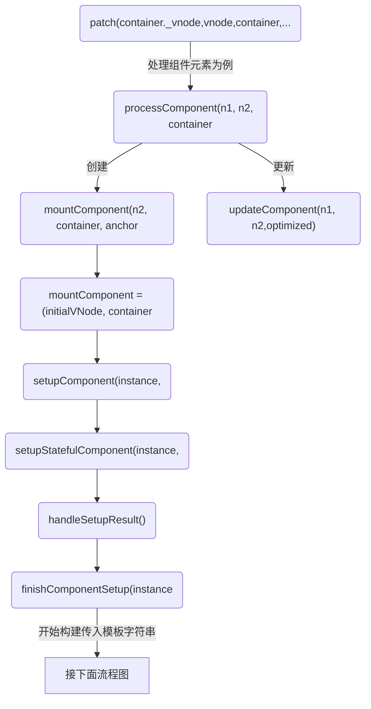
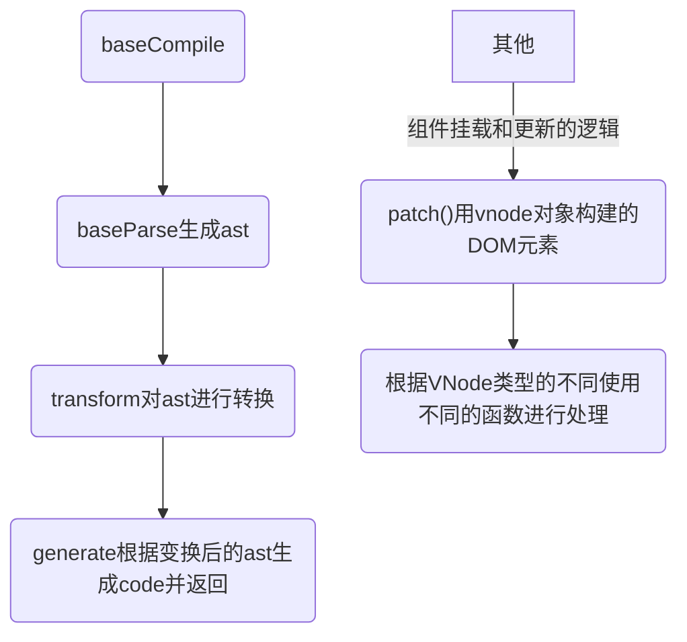
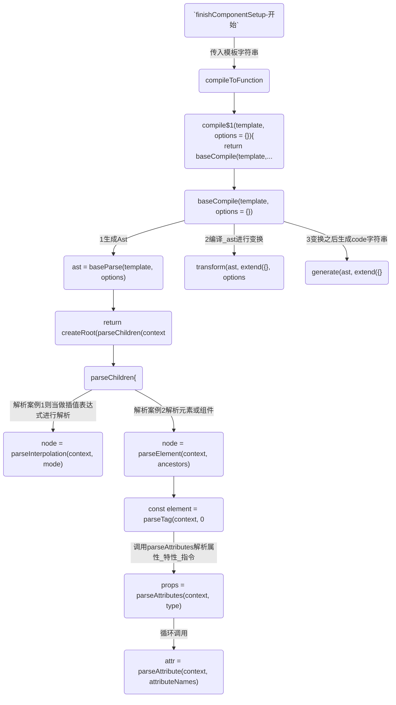
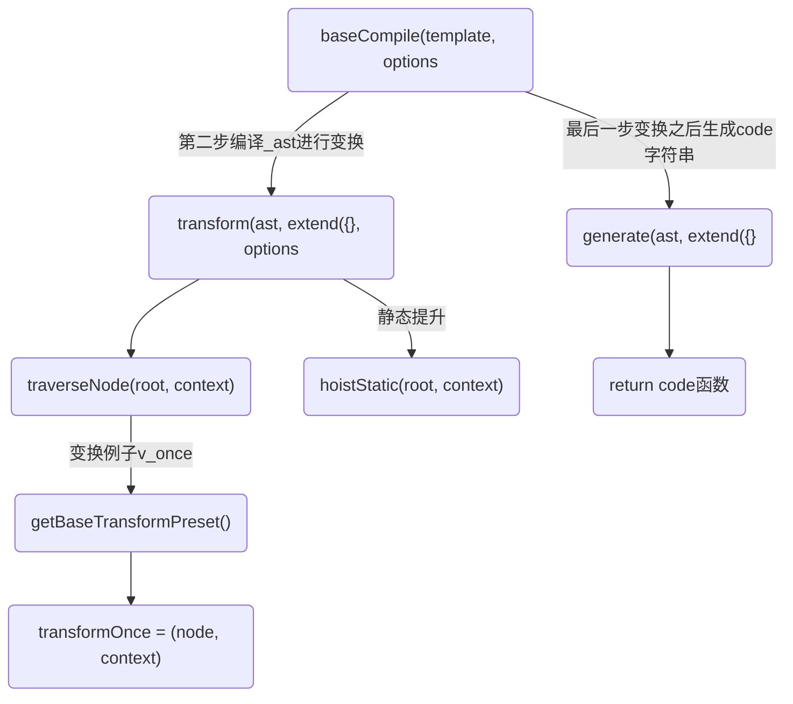

## 应用入口
```js
<script>
  const { ref, reactive, nextTick } = Vue

  Vue.createApp({
    data() {
      return {
        msg: '改变我',
        showDiv: false
      }
    },
    methods: {
      onClickText() {
        this.msg = '努力'
        this.showDiv = !this.showDiv
        this.info.msg2 = this.showDiv ? '直接点' : '其他选择'
        nextTick(() => {
          console.log('--nextTick--', this.showDiv, this.msg);
        })
      }
    },

    setup(props) {
      const refData = ref({
        myName: 'Ruo'
      })

      const info = reactive({
        msg2: 'hello',
      });

      nextTick(() => {
        console.log('--nextTick--');
      })

      Vue.onBeforeMount(() => {
        console.log('--1:组件挂载前 onBeforeMount-->')
      })

      Vue.onMounted(() => {
        console.log('--2:组件挂载后 onMounted-->')
      });

      return {
        info,
        refData
      };
    },

  }).mount('#root')
</script>
```

## 初始化


接：[首次渲染流程-patch函数](../../react-vue异同-vue)


这个阶段`finishComponentSetup()`是重点函数，调用`compileToFunction()`返回了ast生成的函数
```js
  function finishComponentSetup(instance, isSSR, skipOptions) {
    const Component = instance.type;
    // ...
    if (!instance.render) {
      // only do on-the-fly compile if not in SSR - SSR on-the-fly compilation
      // is done by server-renderer
      if (!isSSR && compile && !Component.render) {
        const template = Component.template ||
          resolveMergedOptions(instance).template;
        if (template) {
          {
            startMeasure(instance, `compile`);
          }
          const { isCustomElement, compilerOptions } = instance.appContext.config;
          const { delimiters, compilerOptions: componentCompilerOptions } = Component;
          const finalCompilerOptions = extend(extend({
            isCustomElement,
            delimiters
          }, compilerOptions), componentCompilerOptions);
          console.log('finishComponentSetup=>compileToFunction被调用:', { template, finalCompilerOptions })
          // debugger
          Component.render = compile(template, finalCompilerOptions);
          {
            endMeasure(instance, `compile`);
          }
        }
      }

      // ...
      instance.render = (Component.render || NOOP);
    }
  }

  let compile;
  let installWithProxy;
  registerRuntimeCompiler(compileToFunction);
  /**
   * For runtime-dom to register the compiler.
   * Note the exported method uses any to avoid d.ts relying on the compiler types.
   */
  function registerRuntimeCompiler(_compile) {
    console.log('探究初始化==>registerRuntimeCompiler')
    compile = _compile;
    installWithProxy = i => {
      if (i.render._rc) {
        i.withProxy = new Proxy(i.ctx, RuntimeCompiledPublicInstanceProxyHandlers);
      }
    };
  }

  function compileToFunction(template, options) {
  console.log('compileToFunction被调用:', { template, options })
    // ...
  }
```

## 编译AST-转换AST为render总结
* 生成ast对象
* 将ast对象作为参数传入transform函数，对 ast 节点进行转换操作
* 将ast对象作为参数传入generate函数，返回编译结果


### 接`初始化流程`,finishComponentSetup()开始执行
接上面的finishComponentSetup()开始执行，去构建ast:


### 第二步编译,根据ast-->生成code字符串


### 初始化源码
`patch`
```js
else if (shapeFlag & 6 /* ShapeFlags.COMPONENT */) {
  console.log(`%c运行时==>patch-->较为重点的2:COMPONENT:调用processComponent处理组件元素:`, 'color:red')
  processComponent(n1, n2, container, anchor, parentComponent, parentSuspense, isSVG, slotScopeIds, optimized);
}
```

`processComponent`
```js
const processComponent = (n1, n2, container, anchor, parentComponent, parentSuspense, isSVG, slotScopeIds, optimized) => {
  n2.slotScopeIds = slotScopeIds;
  if (n1 == null) {
    if (n2.shapeFlag & 512 /* ShapeFlags.COMPONENT_KEPT_ALIVE */) {
      parentComponent.ctx.activate(n2, container, anchor, isSVG, optimized);
    }
    else {
      console.log(`%cpath之processComponent:1调用mountComponent:`, 'color:magenta')
      mountComponent(n2, container, anchor, parentComponent, parentSuspense, isSVG, optimized);
    }
  }
  else {
    console.log(`%cpath之processComponent:2调用updateComponent:`, 'color:magenta')
    updateComponent(n1, n2, optimized);
  }
};
```

`mountComponent = (initialVNode`
```js
const mountComponent = (initialVNode, container, anchor, parentComponent, parentSuspense, isSVG, optimized) => {
  const instance = (initialVNode.component = createComponentInstance(initialVNode, parentComponent, parentSuspense));
  console.log(`%c组件挂载：mountComponent:1调用createComponentInstance创建组件实例:`, 'color:magenta', instance)
  if (instance.type.__hmrId) {
    registerHMR(instance);
  }
  {
    pushWarningContext(initialVNode);
    startMeasure(instance, `mount`);
  }
  // inject renderer internals for keepAlive
  // 将keepAlive注入渲染器内部
  if (isKeepAlive(initialVNode)) {
    instance.ctx.renderer = internals;
  }
  // resolve props and slots for setup context
  {
    {
      startMeasure(instance, `init`);
    }

    console.log(`%c组件挂载：mountComponent:2调用setupComponent设置组件实例:`, 'color:magenta')
    console.log('test:定义在data的响应式start==>mountComponent调用setupComponent')
    setupComponent(instance);
    {
      endMeasure(instance, `init`);
    }
  }
```

`handleSetupResult`-->`finishComponentSetup`
```js
function handleSetupResult(instance, setupResult, isSSR) {
  if (isFunction(setupResult)) {
    // setup returned an inline render function
    {
      instance.render = setupResult;
    }
  }
  else if (isObject(setupResult)) {
    if (isVNode(setupResult)) {
      warn$1(`setup() should not return VNodes directly - ` +
        `return a render function instead.`);
    }
    // setup returned bindings.
    // assuming a render function compiled from template is present.
    {
      instance.devtoolsRawSetupState = setupResult;
    }
    instance.setupState = proxyRefs(setupResult);
    {
      exposeSetupStateOnRenderContext(instance);
    }
  }
  else if (setupResult !== undefined) {
    warn$1(`setup() should return an object. Received: ${setupResult === null ? 'null' : typeof setupResult}`);
  }
  console.log('%ctest:响应式=>handleSetupResult调用finishComponentSetup', 'color:chartreuse')
  finishComponentSetup(instance, isSSR);
}
```

## 收集和更新副作用：
调用patch处理组件元素为例
* 在mountComponent走reactive流程

参考：[响应式原理与reactive](./响应式原理与reactive)

* 在 componentUpdateFn 函数中，进行了组件的初始挂载和更新，生命周期函数就是在这些操作的前后触发执行的，在上面的源码中，使用 invokeArrayFns 函数进行生命周期函数的触发执行


## render生成之后-vnode构建
参考：[vnode创建](./render生成之后-vnode构建)

## VNode构建之后-开始渲染
参考：[VNode构建之后-开始渲染](./VNode构建之后-开始渲染)
