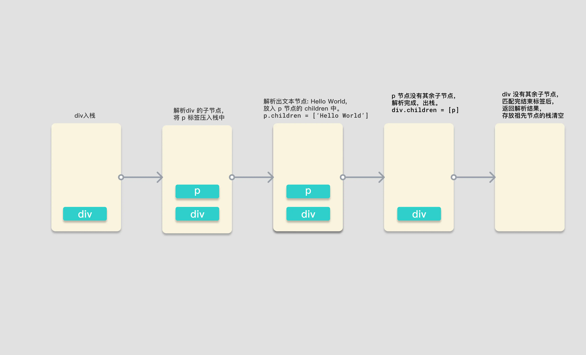
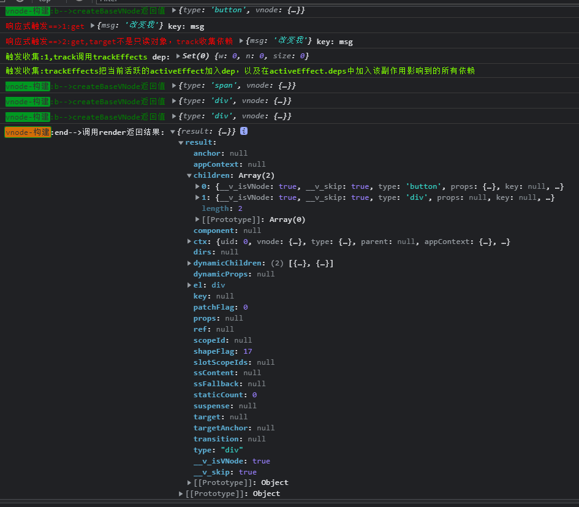
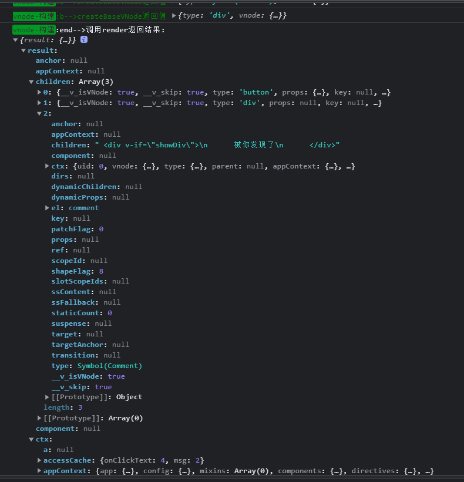

## 前言:模板引擎
从初始化data开始，到解析 template 模版，进行依赖收集。

从data改变，通知渲染 Effect 更新，到页面变化。

## AST-->render()
注意:如果在webpack：
```
用vue-loader将.vue文件编译成js，然后使用render函数渲染，打包的时候就编译成了render函数需要的格式，不需要在客户端编译;
```

Vue 文件是如何被 compile-core 编译核心模块编译成渲染函数的?

如果有配置，直接使用配置的render函数，如果没有，使用运行时编译器，把模板编译成render函数。

在执行render函数的过程中会搜集所有依赖，将来依赖发生变换时会执行updateComponent函数。

在执行`_update`的过程中，会触发patch函数，由于目前还没有旧的虚拟DOM tree，因此直接为当前的虚拟DOM tree的每一个节点生成对应elm属性，即真实DOM。

最终会把创建好的组件实例挂载到vnode的componentInstance属性中，以便复用。

## baseParse生成ast
进行复杂的解析的目的是为了获得一棵关于源码的AST树

`变换AST的结构，使它在不失去原本的语义的情况下，对源码进行优化。`

code抽象语法树AST,对源代码的结构抽象。因此我们对该树进行语义分析，通过变换该抽象结构，而不改变原来的语义，达到优化的目的等等。
```
vue3新特性：transform中的hoistStatic发生静态提升

hoistStatic其会递归ast并发现一些不会变的节点与属性，给他们打上可以静态提升的标记。在生成代码字符串阶段，将其序列化成字符串、以减少编译和渲染成本。
```

1. 将compileToFunction()注册到 runtime,然后调用compileToFunction()
```js
console.log('探究初始化==>将编译函数注册到运行时')
registerRuntimeCompiler(compileToFunction);
```
2. compileToFunction()调用编辑器compile并返回结果code;
```js
function compileToFunction(template, options) {
  // 如果模板不是字符串,判断是否为dom的node节点，是的话取其innerHTML作为模板
  if (!isString(template)) {
    if (template.nodeType) {
      template = template.innerHTML;
    }
    else {
      warn$1(`invalid template option: `, template);
      return NOOP;
    }
  }

  // 如果有缓存渲染函数，返回缓存
  const key = template;
  const cached = compileCache[key];
  if (cached) {
    return cached;
  }

  if (template[0] === '#') {
    const el = document.querySelector(template);
    if (!el) {
      warn$1(`Template element not found or is empty: ${template}`);
    }
    // __UNSAFE__
    // Reason: potential execution of JS expressions in in-DOM template.
    // The user must make sure the in-DOM template is trusted. If it's rendered
    // by the server, the template should not contain any user data.
    template = el ? el.innerHTML : ``;
  }
  const opts = extend({
    hoistStatic: true,
    onError: onError,
    onWarn: e => onError(e, true)
  }, options);
  if (!opts.isCustomElement && typeof customElements !== 'undefined') {
    opts.isCustomElement = tag => !!customElements.get(tag);
  }

  console.log('探究初始化:compileToFunction==>：', { template: template })
  const { code } = compile$1(template, opts);
  console.log('%c探究初始化结束:compileToFunction==>调用compile$1 生成由AST生成的code：', "color:yellow", { code: code })

  function onError(err, asWarning = false) {
    const message = asWarning
      ? err.message
      : `Template compilation error: ${err.message}`;
    const codeFrame = err.loc &&
      generateCodeFrame(template, err.loc.start.offset, err.loc.end.offset);
    warn$1(codeFrame ? `${message}\n${codeFrame}` : message);
  }
  // The wildcard import results in a huge object with every export
  // with keys that cannot be mangled, and can be quite heavy size-wise.
  // In the global build we know `Vue` is available globally so we can avoid
  // the wildcard object.
  const render = (new Function(code)());
  render._rc = true;
  console.log('%c探究初始化结束:compileToFunction==>将 render code 转化为 function：', "color:yellow", { render: render })
  console.log('%c探究初始化结束:compileToFunction==>将 render放入缓存：', "color:yellow")
  return (compileCache[key] = render);
}
```

3. 如源码：将code传入Function生成匿名函数并调用
最终将匿名函数返回结果render进行key为源html字符串，value为render变量的缓存。
```js
const render = (new Function(code)())
```

### 模板解析例子
```html
<div>
  <p>Hello World</p>
</div>
```


图片中是解析过程中，保存解析后节点的栈的存储情况,

图中的黄色矩形是一个栈，当开始解析时，parseChildren 首先会遇到 div 标签，开始调用的 parseElement 函数。通过 parseTag 函数解析出了 div 元素，并将它压入栈中，递归解析子节点。第二次调用 parseChildren 函数，遇见 p 元素，调用 parseElement 函数，将 p 标签压入栈中，此时栈中有 div 和 p 两个标签。再次解析 p 中的子节点，第三次调用 parseChildren 标签，这次不会匹配到任何标签，不会生成对应的 node，所以会通过 parseText 函数去生成文本，解析出 node 为 HelloWorld，并返回 node。

将这个文本类型的 node 添加进 p 标签的 children 属性后，此时 p 标签的子节点解析完毕，弹出祖先栈，完成结束标签的解析后，返回 p 标签对应的 element 对象。

p 标签对应的 node 节点生成，并在 parseChildren 函数中返回对应 node。

div 标签在接收到 p 标签的 node 后，添加进自身的 children 属性中，出栈。此时祖先栈中就空空如也了。而 div 的标签完成闭合解析的逻辑后，返回 element 元素。

最终 parseChildren 的第一次调用返回结果，生成了 div 对应的 node 对象，也返回了结果，将这个结果作为 createRoot 函数的 children 参数传入，生成根节点对象，完成 ast 解析。

### 第一步. compileToFunction 调用 compile$1

### 第二步. compile() 调用 baseCompile(),传入符合浏览器的CompilerOptions，并将结果返回
baseCompile 函数在执行过程中会生成 AST 抽象语法树,关键的一步，因为只有拿到生成的 AST 我们才能遍历 AST 的节点进行 transform 转换操作，比如解析 v-if、v-for 等各种指令，或者对节点进行分析将满足条件的节点静态提升，这些都依赖之前生成的 AST 抽象语法树。

compile就是符合浏览器平台的定制编译器，所谓的定制，就是传入特定的options可选项.
```js
function compile$1(template, options = {}) {
  return baseCompile(template, extend({}, parserOptions, options, {
    // nodeTransforms列表会对抽象语法树的node节点进行特定变换
    nodeTransforms: [
      ignoreSideEffectTags,
      ...DOMNodeTransforms,
      ...(options.nodeTransforms || [])
    ],
    // 关于指令的变换函数 
    // DOMDirectiveTransforms 包括v-html、v-text、v-model、v-on、v-show
    directiveTransforms: extend({}, DOMDirectiveTransforms, options.directiveTransforms || {}),
    transformHoist: null
  }));
}

function baseCompile(template, options = {}) {
  // ...
  ...
  // ...
  const ast = isString(template) ? baseParse(template, options) : template;

  console.log('探究初始化:compile$1 调用 baseParse 返回ast：', ast)
  // 根据前缀标识，获取预设转换函数
  const [nodeTransforms, directiveTransforms] = getBaseTransformPreset();
  // 对ast进行变换
  transform(ast, extend({}, options, {
    prefixIdentifiers,
    nodeTransforms: [
      ...nodeTransforms,
      ...(options.nodeTransforms || []) // user transforms
    ],
    directiveTransforms: extend({}, directiveTransforms, options.directiveTransforms || {} // user transforms
    )
  }));
  // 根据ast生成vue入口需要的编译代码code
  console.log('探究初始化:compile$1 调用 transform对ast进行转换：', ast)
  const generateAst = generate(ast, extend({}, options, {
    prefixIdentifiers
  }));

  console.log('探究初始化:compile$1 调用 generate根据ast生成vue入口需要的编译代码code：', generateAst)
  return generateAst
}
```

### 探究baseCompile 可以根据它定制符合任意平台的编译器
如上面baseCompile代码,ast 的生成有一个三目运算符的判断，如果传进来的 template 模板参数是一个字符串，那么则调用 baseParse 解析模板字符串，否则直接将 template 作为 ast 对象。baseParse 里做了什么事情才能生成 ast 呢？一起来看一下源码，

### baseParse 调用createRoot()返回RootNode类型的根节点对象
baseParse涉及标签解析、属性解析、指令解析、插槽解析等等，只挑选一个例子进行剖析;

createRoot返回了一个 RootNode 类型的根节点对象，其中我们传入的 children 参数会被作为根节点的 children 参数。

所以生成 ast 的关键点就会聚焦到 parseChildren 这个函数上来。parseChildren 函数如果不去看它的源码，见文之意也可以大致了解这是一个解析子节点的函数。接下来我们就来一起来看一下 AST 解析中最关键的 parseChildren 函数
```js
function baseCompile(template, options = {}) {
  const ast = isString(template) ? baseParse(template, options) : template;
}

function baseParse(content, options = {}) {
  const context = createParserContext(content, options);
  const start = getCursor(context);
  return createRoot(parseChildren(context, 0 /* TextModes.DATA */, []), getSelection(context, start));
}

// 代码中，唯一难理解的是TextModes.DATA参数。因此在继续往下剖析之前，我们需要先了解TextModes枚举,TextModes即源码的类型,及其各个值得意义:
export const enum TextModes {
  // DATA类型即为元素（包括组件）
  DATA, //    | ✔        | ✔        | End tags of ancestors |
  // RCDATA是在<textarea>标签中的文本，在该标签中的空格和换行不会被浓缩；
  RCDATA, //  | ✘        | ✔        | End tag of the parent | <textarea>
  // RAWTEXT类型为<style>,<script>为中的代码，即JS与CSS；
  RAWTEXT, // | ✘        | ✘        | End tag of the parent | <style>,<script>
  // CDATA是普通前端比较少接触的<![CDATA[cdata]]>代码，这是使用于XML与XHTML中的注释，在该注释中的cdata代码将不会被解析器解析，而会当做普通文本处理;
  CDATA,
  // ATTRIBUTE_VALUE顾名思义，即是各个标签的属性。
  ATTRIBUTE_VALUE
}
```


### 第三步.parseChildren将正式进入解析阶段: AST解析中最关键的parseChildren()
parseChildren 函数接收三个参数，context：解析器上下文，mode：文本数据类型，ancestors：祖先节点数组。
```
而函数的执行中会首先从祖先节点中获取当前节点的父节点，确定命名空间，以及创建一个空数组，用来储存解析后的节点。之后会有一个 while 循环，判断是否到达了标签的关闭位置，如果不是需要关闭的标签，则在循环体内对源模板字符串进行分类解析。之后会有一段处理空白字符的逻辑，处理完成后返回解析好的 nodes 数组。在大家对于 parseChildren 的执行流程有一个初步理解之后，我们一起来看一下函数的核心，while 循环内的逻辑。

在 while 中解析器会判断文本数据的类型，只有当 TextModes 为 DATA 或 RCDATA 时会继续往下解析。

第一种情况就是判断是否需要解析 Vue 模板语法中的 “Mustache”语法 (双大括号) ，如果当前上下文中没有 v-pre 指令来跳过表达式，并且源模板字符串是以我们指定的分隔符开头的（此时 context.options.delimiters 中是双大括号），就会进行双大括号的解析。这里就可以发现，如果当你有特殊需求，不希望使用双大括号作为表达式插值，那么你只需要在编译前改变选项中的 delimiters 属性即可。

接下来会判断，如果第一个字符是 “<” 并且第二个字符是 '!'的话，会尝试解析注释标签，<!DOCTYPE 和 <!CDATA 这三种情况，对于 DOCTYPE 会进行忽略，解析成注释。

之后会判断当第二个字符是 “/” 的情况，“</” 已经满足了一个闭合标签的条件了，所以会尝试去匹配闭合标签。当第三个字符是 “>”，缺少了标签名字，会报错，并让解析器的进度前进三个字符，跳过 “</>”。

如果“</”开头，并且第三个字符是小写英文字符，解析器会解析结束标签。

如果源模板字符串的第一个字符是 “<”，第二个字符是小写英文字符开头，会调用 parseElement 函数来解析对应的标签。

当这个判断字符串字符的分支条件结束，并且没有解析出任何 node 节点，那么会将 node 作为文本类型，调用 parseText 进行解析。

最后将生成的节点添加进 nodes 数组，在函数结束时返回。
```

这就是 while 循环体内的逻辑，且是 parseChildren 中最重要的部分。在这个判断过程中，我们看到了双大括号语法的解析，看到了注释节点的怎样被解析的，也看到了开始标签和闭合标签的解析，以及文本内容的解析。

移除空白符的逻辑相对简单、且不是我们的重点。我们只需了解`RAWTEXT 和 RCDATA 类型的节点`，以及前文提到的`<pre>`标签中的文本（包括标签本身）和注释不会被去除空白符。其中RAWTEXT类型是JS和CSS代码，它们的空白符，是在进行生产构建时，由构建工具处理。

我们需要关注插值的解析与元素的解析部分。在判断是否插值的表达式中，我们可以注意到这样一个变量context.options.delimiters[0]。不知还有没印象，在上下文context中的options是我们在入口文件传入的自选项options，其中包括用户自定义选项。这说明，使用vue的开发者可以通过传入delimiters数组达到自定义定界符的目的，该参数的默认值是`["{{","}}"]`。
接着，我们继续剖析parseInterpolation解析函数，我们只讲解这一个解析案例，其他的解析函数都大同小异，若无特殊情况，都不再剖析其他解析函数。
```js
function parseChildren(context, mode, ancestors) {
  // 获取最后一个祖先节点，即父节点，在上一小节中传入空数组，即没有父节点
  const parent = last(ancestors);
  // 父节点的命名空间，父节点不存在就默认取HTML命名空间，即解析时，对应节点会被当做HTML节点处理
  const ns = parent ? parent.ns : 0 /* Namespaces.HTML */;
  // 当前父节点的子节点数组
  const nodes = [];
  /* 递归解析:
  当标签未闭合时，解析对应节点
  根据上下文、节点类型和祖先节点判断是否到达结尾
  */
  while (!isEnd(context, mode, ancestors)) {
    // 获取需要解析的源码
    const s = context.source;
    // 声明子节点
    let node = undefined;
    if (mode === 0 /* TextModes.DATA */ || mode === 1 /* TextModes.RCDATA */) {

      /* 如果标签没有 v-pre 指令，源模板字符串以双大括号 `{{` 开头，按双大括号语法解析 */
      if (!context.inVPre && startsWith(s, context.options.delimiters[0])) {
        // 如果没有使用v-pre指令，且源码以的delimiters[0]选项存在，默认为'{{'，则当做插值表达式进行解析
        console.log('探究初始化==>其中一个解析案例1:如果没有使用v-pre指令，且源码以的delimiters[0]选项存在，默认为"{{"，则当做插值表达式进行解析,parseChildren调用 parseInterpolation,返回AST节点描述对象')
        node = parseInterpolation(context, mode);
      }
      else if (mode === 0 /* TextModes.DATA */ && s[0] === '<') {
        // https://html.spec.whatwg.org/multipage/parsing.html#tag-open-state
        // 如果是dom标签，按照HTML官网规范解析，以下是HTML官方“开始标签”解析算法
        if (s.length === 1) {
          // 如果是源码的最后一个字符，报边界错误
          emitError(context, 5 /* ErrorCodes.EOF_BEFORE_TAG_NAME */, 1);
        }

        // 如果源模板字符串的第以个字符位置是 `!`
        else if (s[1] === '!') {
          // https://html.spec.whatwg.org/multipage/parsing.html#markup-declaration-open-state
          // 如果以 '<!--' 开头，按注释解析
          // '<'后接'!'则，当做注释进行解析，以HTML官方算法解析注释。
          // 注释类型包括'<!--'、 '<!DOCTYPE'、'<![CDATA['三种
          if (startsWith(s, '<!--')) {
            node = parseComment(context);
          }
          else if (startsWith(s, '<!DOCTYPE')) {
            // Ignore DOCTYPE by a limitation.
            // 如果以 '<!DOCTYPE' 开头，忽略 DOCTYPE，当做伪注释解析
            node = parseBogusComment(context);
          }

          // 如果以 '<![CDATA[' 开头，又在 HTML 环境中，解析 CDATA
          else if (startsWith(s, '<![CDATA[')) {
            if (ns !== 0 /* Namespaces.HTML */) {
              node = parseCDATA(context, ancestors);
            }
            else {
              emitError(context, 1 /* ErrorCodes.CDATA_IN_HTML_CONTENT */);
              node = parseBogusComment(context);
            }
          }
          else {
            emitError(context, 11 /* ErrorCodes.INCORRECTLY_OPENED_COMMENT */);
            node = parseBogusComment(context);
          }
        }
        // 如果源模板字符串的第二个字符位置是 '/'
        else if (s[1] === '/') {
          // https://html.spec.whatwg.org/multipage/parsing.html#end-tag-open-state
          //  如果是'</'当做结束标签进行解析，依然使用HTML官方算法
          if (s.length === 2) {
            emitError(context, 5 /* ErrorCodes.EOF_BEFORE_TAG_NAME */, 2);
          }
          // 如果源模板字符串的第三个字符位置是 '>'，那么就是自闭合标签，前进三个字符的扫描位置
          else if (s[2] === '>') {
            emitError(context, 14 /* ErrorCodes.MISSING_END_TAG_NAME */, 2);
            advanceBy(context, 3);
            continue;
          }
          // 如果第三个字符位置是英文字符，解析结束标签
          else if (/[a-z]/i.test(s[2])) {
            emitError(context, 23 /* ErrorCodes.X_INVALID_END_TAG */);
            parseTag(context, 1 /* TagType.End */, parent);
            continue;
          }
          // 如果不是上述情况，则当做伪注释解析
          else {
            emitError(context, 12 /* ErrorCodes.INVALID_FIRST_CHARACTER_OF_TAG_NAME */, 2);
            node = parseBogusComment(context);
          }
        }
        // 解析结束标签
        // 如果标签的第二个字符是小写英文字符，则当做元素标签解析
        else if (/[a-z]/i.test(s[1])) {
          console.log('探究初始化==>其中一个解析案例3,如果是以[a-z]开头的标签，当做元素进行解析（包括组件），')
          node = parseElement(context, ancestors);
        }
        // 对2.x中<template>的兼容。在3.x中，若没有vue的官方指令，会被当做原生的dom标签
        // 如果第二个字符是 '?'，当做伪注释解析
        else if (s[1] === '?') {
          // 如果是'<?'报不支持该类型的标签，且当做注释进行解析
          emitError(context, 21 /* ErrorCodes.UNEXPECTED_QUESTION_MARK_INSTEAD_OF_TAG_NAME */, 1);
          node = parseBogusComment(context);
        }
        else {
          // 都不是这些情况，则报出第一个字符不是合法标签字符的错误。
          // 报非法字符串错误
          emitError(context, 12 /* ErrorCodes.INVALID_FIRST_CHARACTER_OF_TAG_NAME */, 1);
        }
      }
    }

    // 如果上述的情况解析完毕后，没有创建对应的节点，则当做文本来解析
    if (!node) {
      node = parseText(context, mode);
    }

    // 如果节点是数组，则遍历添加进 nodes 数组中，否则直接添加
    if (isArray(node)) {
      for (let i = 0; i < node.length; i++) {
        pushNode(nodes, node[i]);
      }
    }
    else {
      pushNode(nodes, node);
    }
  }
  // Whitespace handling strategy like v2
  // 标记是否移除空格,处理空白字符，提高输出效率
  let removedWhitespace = false;
  if (mode !== 2 /* TextModes.RAWTEXT */ && mode !== 1 /* TextModes.RCDATA */) {
    const shouldCondense = context.options.whitespace !== 'preserve';
    for (let i = 0; i < nodes.length; i++) {
      const node = nodes[i];
      if (node.type === 2 /* NodeTypes.TEXT */) {
        if (!context.inPre) {
          if (!/[^\t\r\n\f ]/.test(node.content)) {
            const prev = nodes[i - 1];
            const next = nodes[i + 1];
            // Remove if:
            // - the whitespace is the first or last node, or:
            // - (condense mode) the whitespace is between twos comments, or:
            // - (condense mode) the whitespace is between comment and element, or:
            // - (condense mode) the whitespace is between two elements AND contains newline
            if (!prev ||
              !next ||
              (shouldCondense &&
                ((prev.type === 3 /* NodeTypes.COMMENT */ &&
                  next.type === 3 /* NodeTypes.COMMENT */) ||
                  (prev.type === 3 /* NodeTypes.COMMENT */ &&
                    next.type === 1 /* NodeTypes.ELEMENT */) ||
                  (prev.type === 1 /* NodeTypes.ELEMENT */ &&
                    next.type === 3 /* NodeTypes.COMMENT */) ||
                  (prev.type === 1 /* NodeTypes.ELEMENT */ &&
                    next.type === 1 /* NodeTypes.ELEMENT */ &&
                    /[\r\n]/.test(node.content))))) {
              removedWhitespace = true;
              nodes[i] = null;
            }
            else {
              // Otherwise, the whitespace is condensed into a single space
              node.content = ' ';
            }
          }
          else if (shouldCondense) {
            // in condense mode, consecutive whitespaces in text are condensed
            // down to a single space.
            node.content = node.content.replace(/[\t\r\n\f ]+/g, ' ');
          }
        }
        else {
          // #6410 normalize windows newlines in <pre>:
          // in SSR, browsers normalize server-rendered \r\n into a single \n
          // in the DOM
          node.content = node.content.replace(/\r\n/g, '\n');
        }
      }
      // Remove comment nodes if desired by configuration.
      else if (node.type === 3 /* NodeTypes.COMMENT */ && !context.options.comments) {
        removedWhitespace = true;
        nodes[i] = null;
      }
    }
    if (context.inPre && parent && context.options.isPreTag(parent.tag)) {
      // remove leading newline per html spec
      // https://html.spec.whatwg.org/multipage/grouping-content.html#the-pre-element
      const first = nodes[0];
      if (first && first.type === 2 /* NodeTypes.TEXT */) {
        first.content = first.content.replace(/^\r?\n/, '');
      }
    }
  }
  // 移除空白字符，返回解析后的节点数组
  return removedWhitespace ? nodes.filter(Boolean) : nodes;
}
```

### 调用 parseInterpolation
```js
function parseInterpolation(context, mode) {
// 获取开始与结束定界符
const [open, close] = context.options.delimiters;
// 从开始定界符之后开始寻找结束定界符的索引
const closeIndex = context.source.indexOf(close, open.length);
// 如果找不到则报错
if (closeIndex === -1) {
  emitError(context, 25 /* ErrorCodes.X_MISSING_INTERPOLATION_END */);
  return undefined;
}
// 获取开始游标
const start = getCursor(context);
// 解析位置前进open.length长度，修改上下文context的source、offset、line、column
advanceBy(context, open.length);
// 插值表达式开始位置游标，初始化，之后修改
const innerStart = getCursor(context);
// 插值表达式结束位置游标，初始化，之后修改
const innerEnd = getCursor(context);
// 计算原生插值表达式长度
const rawContentLength = closeIndex - open.length;
// 获取原生插值表达式
const rawContent = context.source.slice(0, rawContentLength);
// DATA、RCDATA、ATTRIBUTE_VALUE类型且包含'&'，由自选项提供的decodeEntities函数进行解码，其他情况返回原文本
const preTrimContent = parseTextData(context, rawContentLength, mode);
// 获得去除前后空白符的表达式，用于之后计算原生表达式的开始与结束索引
const content = preTrimContent.trim();
// 获取前面空白符的最后索引作为偏移量
const startOffset = preTrimContent.indexOf(content);
// 如果偏移量大于零，根据原生插值与偏移量修改innerStart的位置描述
if (startOffset > 0) {
  advancePositionWithMutation(innerStart, rawContent, startOffset);
}
// 获取原生插值表达式的结束偏移量
const endOffset = rawContentLength - (preTrimContent.length - content.length - startOffset);
// 修改innerEnd位置描述
advancePositionWithMutation(innerEnd, rawContent, endOffset);
// context位置前进到结束定界符之后，结束解析
advanceBy(context, close.length);

console.log('探究初始化:其中一个解析案例:parseChildren调用 parseInterpolation 返回AST节点描述对象：')
return {
  type: 5 /* NodeTypes.INTERPOLATION */,
  content: {
    type: 4 /* NodeTypes.SIMPLE_EXPRESSION */,
    isStatic: false,
    // Set `isConstant` to false by default and will decide in transformExpression
    constType: 0 /* ConstantTypes.NOT_CONSTANT */,
    content,
    loc: getSelection(context, innerStart, innerEnd)
  },
  loc: getSelection(context, start)
};
}
```

### 初步总结
通过这一小案列的解析，我们可以总结其他解析函数的工作流程，即抽取源码，改变上下文context的source以及位置信息，最后构建AST节点返回。AST节点除了type与loc属性必不可少之外，其他属性根据特定节点赋值。比如之后的标签解析，需要添加命名空间、标签名称、标签类型、标签属性、子AST节点数组、是否自闭合标签。其中type具有以下类型：
```js
export const enum NodeTypes {
ROOT,
ELEMENT,
TEXT,
COMMENT,
SIMPLE_EXPRESSION,
INTERPOLATION,
ATTRIBUTE,
DIRECTIVE,
// containers
COMPOUND_EXPRESSION,
IF,
IF_BRANCH,
FOR,
TEXT_CALL,
// codegen
VNODE_CALL,
JS_CALL_EXPRESSION,
JS_OBJECT_EXPRESSION,
JS_PROPERTY,
JS_ARRAY_EXPRESSION,
JS_FUNCTION_EXPRESSION,
JS_CONDITIONAL_EXPRESSION,
JS_CACHE_EXPRESSION,

// ssr codegen
JS_BLOCK_STATEMENT,
JS_TEMPLATE_LITERAL,
JS_IF_STATEMENT,
JS_ASSIGNMENT_EXPRESSION,
JS_SEQUENCE_EXPRESSION,
JS_RETURN_STATEMENT
}
```

### 继续往下走：parseElement:分为三步，解析开始标签 -> 递归解析子节点 -> 解析结束标签。
在 while 的循环内，各个分支判断分支内，我们能看到 node 会接收各种节点类型的解析函数的返回值。而这里我会详细的说一下 parseElement 这个解析元素的函数，因为这是我们在模板中用的最频繁的场景。

并始终在上下文context中维护inPre、inVPre字段，以此判断子节点是否处于pre标签内，或者具有v-pre指令的标签内。同时兼容2.x的inline-template属性，但是需要在自选项的compatConfig配置中显示配置COMPILER_INLINE_TEMPLATE为true或者声明MODE为非3版本(编译器的行为默认为3版本)，兼容属性才会被解析。由于inline-template在Vue3不再支持，小编也从未使用过inline-template，对其不是很了解，顾有兴趣的小伙伴可以到官网自行了解内联模板。
```js
function parseElement(context, ancestors) {
  // Start tag.
  const wasInPre = context.inPre;
  const wasInVPre = context.inVPre;
  // 解析起始标签
  const parent = last(ancestors);
  console.log('探究初始化==>parseElement解析parseTag')
  const element = parseTag(context, 0 /* TagType.Start */, parent);
  const isPreBoundary = context.inPre && !wasInPre;
  const isVPreBoundary = context.inVPre && !wasInVPre;
  // 如果是自闭合的标签或者是空标签，则直接返回。voidTag例如： ``, `<br>`, `<hr>`
  if (element.isSelfClosing || context.options.isVoidTag(element.tag)) {
    // #4030 self-closing <pre> tag
    if (isPreBoundary) {
      context.inPre = false;
    }
    if (isVPreBoundary) {
      context.inVPre = false;
    }
    return element;
  }
  // Children.
  // 递归的解析子节点
  ancestors.push(element);
  const mode = context.options.getTextMode(element, parent);
  const children = parseChildren(context, mode, ancestors);
  ancestors.pop();
  element.children = children;
  // End tag.
  // 解析结束标签
  if (startsWithEndTagOpen(context.source, element.tag)) {
    parseTag(context, 1 /* TagType.End */, parent);
  }
  else {
    emitError(context, 24 /* ErrorCodes.X_MISSING_END_TAG */, 0, element.loc.start);
    if (context.source.length === 0 && element.tag.toLowerCase() === 'script') {
      const first = children[0];
      if (first && startsWith(first.loc.source, '<!--')) {
        emitError(context, 8 /* ErrorCodes.EOF_IN_SCRIPT_HTML_COMMENT_LIKE_TEXT */);
      }
    }
  }
  element.loc = getSelection(context, element.loc.start);
  if (isPreBoundary) {
    context.inPre = false;
  }
  if (isVPreBoundary) {
    context.inVPre = false;
  }
  return element;
}
```

### 第四步. 进入整个解析的重点parseTag:parseTag()用来解析开始标签、自闭合标签与结束标签
不过我们只关注其开始标签的部分。首先我们会获取当前节点的父节点，然后调用 parseTag 函数解析。

parseTag 函数会按的执行大体是以下流程：
1. 首先匹配标签名。
2. 解析元素中的 attribute 属性，存储至 props 属性
3. 检测是否存在 v-pre 指令，若是存在的话，则修改 context 上下文中的 inVPre 属性为 true
4. 检测自闭合标签，如果是自闭合，则将 isSelfClosing 属性置为 true
5. 判断 tagType，是 ELEMENT 元素还是 COMPONENT 组件，或者 SLOT 插槽
6. 返回生成的 element 对象
```js
function parseTag(context, type, parent) {
console.log('探究初始化==>我们的重点在这,parseTag()用来解析开始标签、自闭合标签与结束标签')
// Tag open.
const start = getCursor(context);
const match = /^<\/?([a-z][^\t\r\n\f />]*)/i.exec(context.source);
if (!context.inVPre) {
  if (tag === 'slot') {
    tagType = 2 /* ElementTypes.SLOT */;
  }
  else if (tag === 'template') {
    if (props.some(p => p.type === 7 /* NodeTypes.DIRECTIVE */ && isSpecialTemplateDirective(p.name))) {
      tagType = 3 /* ElementTypes.TEMPLATE */;
    }
  }
  else if (isComponent(tag, props, context)) {
    tagType = 1 /* ElementTypes.COMPONENT */;
  }
}

  // ...
  ...
  // ...
  return {
  type: 1 /* NodeTypes.ELEMENT */,
  ns,
  tag,
  tagType,
  props,
  isSelfClosing,
  children: [],
  loc: getSelection(context, start),
  codegenNode: undefined // to be created during transform phase
};
}
```

### 4-1.parseTag()之isComponent vue是如何辨别组件与dom元素的

### 4-2.parseAttribute 解析阶段的核心，解析开始标签的属性。
包括一切属性、特性、指令、组件props。在parseAttribute上一层有parseAttributes函数、其主要作用是循环调用parseAttribute，并对解析出来的class空白符浓缩为一个空格，去除前后空白符。
```js
function parseAttributes(context, type) {
const props = [];
const attributeNames = new Set();
while (context.source.length > 0 &&
  !startsWith(context.source, '>') &&
  !startsWith(context.source, '/>')) {
  if (startsWith(context.source, '/')) {
    emitError(context, 22 /* ErrorCodes.UNEXPECTED_SOLIDUS_IN_TAG */);
    advanceBy(context, 1);
    advanceSpaces(context);
    continue;
  }
  if (type === 1 /* TagType.End */) {
    emitError(context, 3 /* ErrorCodes.END_TAG_WITH_ATTRIBUTES */);
  }
  const attr = parseAttribute(context, attributeNames);
  // Trim whitespace between class
  // https://github.com/vuejs/core/issues/4251
  if (attr.type === 6 /* NodeTypes.ATTRIBUTE */ &&
    attr.value &&
    attr.name === 'class') {
    attr.value.content = attr.value.content.replace(/\s+/g, ' ').trim();
  }
  if (type === 0 /* TagType.Start */) {
    props.push(attr);
  }
  if (/^[^\t\r\n\f />]/.test(context.source)) {
    emitError(context, 15 /* ErrorCodes.MISSING_WHITESPACE_BETWEEN_ATTRIBUTES */);
  }
  advanceSpaces(context);
}
return props;
}

// 调用parseAttribute
function parseAttribute(context, nameSet) {
// Name.
const start = getCursor(context);
const match = /^[^\t\r\n\f />][^\t\r\n\f />=]*/.exec(context.source);
const name = match[0];
if (nameSet.has(name)) {
  emitError(context, 2 /* ErrorCodes.DUPLICATE_ATTRIBUTE */);
}
nameSet.add(name);
if (name[0] === '=') {
  emitError(context, 19 /* ErrorCodes.UNEXPECTED_EQUALS_SIGN_BEFORE_ATTRIBUTE_NAME */);
}
{
  const pattern = /["'<]/g;
  let m;
  while ((m = pattern.exec(name))) {
    emitError(context, 17 /* ErrorCodes.UNEXPECTED_CHARACTER_IN_ATTRIBUTE_NAME */, m.index);
  }
}
advanceBy(context, name.length);
// Value
let value = undefined;
if (/^[\t\r\n\f ]*=/.test(context.source)) {
  advanceSpaces(context);
  advanceBy(context, 1);
  advanceSpaces(context);
  value = parseAttributeValue(context);
  if (!value) {
    emitError(context, 13 /* ErrorCodes.MISSING_ATTRIBUTE_VALUE */);
  }
}
const loc = getSelection(context, start);
/* 获取属性名，并对不合语法的属性名进行报错，包含="'< 字符的属性名不合法 */
/* 获取属性值value，允许=前后包含多个空白符 */

// 不在v-pre指令内，以V-、:、.、@、#开头的被认为vue指令、props与事件
if (!context.inVPre && /^(v-[A-Za-z0-9-]|:|\.|@|#)/.test(name)) {
  const match = /(?:^v-([a-z0-9-]+))?(?:(?::|^\.|^@|^#)(\[[^\]]+\]|[^\.]+))?(.+)?$/i.exec(name);
  let isPropShorthand = startsWith(name, '.');
  // 取V-后的指令名，但当使用简写时match[1]不存在、则根据简写，判别bind、on、slot指令
  let dirName = match[1] ||
    (isPropShorthand || startsWith(name, ':')
      ? 'bind'
      : startsWith(name, '@')
        ? 'on'
        : 'slot');
  let arg;

  // 指令参数，比如@click中的click、:props中的pros、v-slot:footer中的footer
  if (match[2]) {
    const isSlot = dirName === 'slot';
    const startOffset = name.lastIndexOf(match[2]);
    const loc = getSelection(context, getNewPosition(context, start, startOffset), getNewPosition(context, start, startOffset + match[2].length + ((isSlot && match[3]) || '').length));
    let content = match[2];
    let isStatic = true;
    if (content.startsWith('[')) {
      isStatic = false;
      if (!content.endsWith(']')) {
        emitError(context, 27 /* ErrorCodes.X_MISSING_DYNAMIC_DIRECTIVE_ARGUMENT_END */);
        content = content.slice(1);
      }
      else {
        content = content.slice(1, content.length - 1);
      }
    }
    else if (isSlot) {
      // #1241 special case for v-slot: vuetify relies extensively on slot
      // names containing dots. v-slot doesn't have any modifiers and Vue 2.x
      // supports such usage so we are keeping it consistent with 2.x.
      // 由于在v-slot没有修饰符、且vuetify广泛使用包含.的插槽名，所以如果是插槽指令点dots,不被认为是修饰符，而是插槽名的一部分
      content += match[3] || '';
    }
    arg = {
      type: 4 /* NodeTypes.SIMPLE_EXPRESSION */, // 因为是指令，所以类型为简单表达式
      content, // 指令参数
      isStatic, // 是否可静态提升
      constType: isStatic // 是否常量
        ? 3 /* ConstantTypes.CAN_STRINGIFY */
        : 0 /* ConstantTypes.NOT_CONSTANT */,
      loc
    };
  }
  if (value && value.isQuoted) {
    const valueLoc = value.loc;
    valueLoc.start.offset++;
    valueLoc.start.column++;
    valueLoc.end = advancePositionWithClone(valueLoc.start, value.content);
    valueLoc.source = valueLoc.source.slice(1, -1);
  }

  /* 修改属性值的位置信息 */
  // 获取修饰符数组
  const modifiers = match[3] ? match[3].slice(1).split('.') : [];
  // 如果v-bind指令的缩写不是:，而是点dot. ，则把添加修饰符prop
  if (isPropShorthand)
    modifiers.push('prop');
  return {
    type: 7 /* NodeTypes.DIRECTIVE */, // 属性类型为指令
    name: dirName, //指令名
    exp: value && {
      type: 4 /* NodeTypes.SIMPLE_EXPRESSION */, // 指令表达式
      content: value.content,
      isStatic: false, // 不可静态提升
      // Treat as non-constant by default. This can be potentially set to
      // other values by `transformExpression` to make it eligible for hoisting.
      constType: 0 /* ConstantTypes.NOT_CONSTANT */,
      loc: value.loc
    },
    arg,
    modifiers, //修饰符
    loc
  };
}
// missing directive name or illegal directive name
if (!context.inVPre && startsWith(name, 'v-')) {
  emitError(context, 26 /* ErrorCodes.X_MISSING_DIRECTIVE_NAME */);
}
return {
  type: 6 /* NodeTypes.ATTRIBUTE */,
  name,
  value: value && {
    type: 2 /* NodeTypes.TEXT */,
    content: value.content,
    loc: value.loc
  },
  loc
};
}
```

## transform对ast进行转换,变换AST的结构
### 总览
因为只有拿到生成的 AST 我们才能遍历 AST 的节点进行 transform 转换操作，比如解析 v-if、v-for 等各种指令。
也能对源码进行优化:
vue3新特性：

vue3 在模板的compile-time做了的优化:比如提升不变的vNode(静态提升)，以及blockTree配合patchFlag靶向更新

transform中的hoistStatic发生静态提升,hoistStatic会递归ast并发现一些不会变的节点与属性，给他们打上可以静态提升的标记。在生成代码字符串阶段，将其序列化成字符串、以减少编译和渲染成本。

由于是对AST的变换，所以不会有返回值，所以在baseCompile的transform函数，只会传入ast抽象语法树和相应的变换选项。

另由于变换上下文，不像解析上下文一样简单，其包含非常多状态、选项以及辅助函数，所以不采取一次性讲解，而是在使用都相关成员时进行讲解。

变换还剩下最后的createRootCodegen。vue3先支持多个根节点，这个函数的作用是，判断根节点的数量是否大于1，若大于1，则在其外层再包一层节点，就如此简单。
```js
function transform(root, options) {
// 获取上下文
const context = createTransformContext(root, options);
// 变换AST
traverseNode(root, context);
console.log("%c探究初始化==>transform ast:静态提升，vue3新特性", 'color:yellow')
if (options.hoistStatic) {
  hoistStatic(root, context);
}
if (!options.ssr) {
  createRootCodegen(root, context);
}
// finalize meta information
// 变换后的AST完成元数据赋值
root.helpers = [...context.helpers.keys()];
root.components = [...context.components];
root.directives = [...context.directives];
root.imports = context.imports;
root.hoists = context.hoists;
root.temps = context.temps;
root.cached = context.cached;
}

function traverseNode(node, context) {
// 正在变换的ast节点
context.currentNode = node;
// apply transform plugins
const { nodeTransforms } = context;
// 用来存储变换函数的退出函数
const exitFns = [];
// 应用所有节点变换插件
for (let i = 0; i < nodeTransforms.length; i++) {
  const onExit = nodeTransforms[i](node, context);
  if (onExit) {
    if (isArray(onExit)) {
      exitFns.push(...onExit);
    }
    else {
      exitFns.push(onExit);
    }
  }
  if (!context.currentNode) {
    // node was removed
    // 变换函数可能移除原有的ast节点，则直接返回
    return;
  }
  else {
    // node may have been replaced
    // 经过变换后，ast节点可能被替换
    node = context.currentNode;
  }
}
switch (node.type) {
  case 3 /* NodeTypes.COMMENT */:
    if (!context.ssr) {
      // inject import for the Comment symbol, which is needed for creating
      // comment nodes with `createVNode`
      // 注入Comment symbol，用户生成代码阶段，生成需要的导入代码
      context.helper(CREATE_COMMENT);
    }
    break;
  case 5 /* NodeTypes.INTERPOLATION */:
    // no need to traverse, but we need to inject toString helper
    // {{express}} 插值表达式不需要变化，但是需要注入toString helper
    if (!context.ssr) {
      context.helper(TO_DISPLAY_STRING);
    }
    break;
  // for container types, further traverse downwards
  // 对于容器类型的，需要进一步向下遍历
  case 9 /* NodeTypes.IF */:
    // 对v-if的所有分支进行变换
    for (let i = 0; i < node.branches.length; i++) {
      traverseNode(node.branches[i], context);
    }
    break;
  case 10 /* NodeTypes.IF_BRANCH */:
  case 11 /* NodeTypes.FOR */:
  case 1 /* NodeTypes.ELEMENT */:
  case 0 /* NodeTypes.ROOT */:
    traverseChildren(node, context);
    break;
}
// exit transforms
// 退出变换函数
context.currentNode = node;
let i = exitFns.length;
while (i--) {
  exitFns[i]();
}
}
```

vue先进行一次遍历变换，更改具有v-if、v-else、v-else-if、v-for指令节点及其子节点的结构。

之后再重新遍历变换v-if的所有分支节点，以及递归变换其他类型节点。最后以出栈的方式逐一退出变换的函数。

### 解析`v-once`为例
由于变换函数众多且相当复杂，虽然用户也可以传入自己的变换函数，但99.99%的情况下并没有这种需求，我们只需了解到变换会更改解析出来的ast就行了，因此我们只取其中较为简单的v-once变换函数进行剖析，v-once可以使相关的表达式只渲染一次，而不会双向绑定。

其中 codegenNode 是用于后文baseCompile的最后一步generate,生成代码字符串用的节点描述对象。
```js
const transformOnce = (node, context) => {
// 元素节点上是否存在"v-once"指令
if (node.type === 1 /* NodeTypes.ELEMENT */ && findDir(node, 'once', true)) {
  // 本节点是否已执行或者处于`v-once`的子元素中
  if (seen.has(node) || context.inVOnce) {
    return;
  }
  // 缓存v-once节点
  seen.add(node);
  // 上下文修改为是在`v-once`节点当中
  context.inVOnce = true;
  // 添加辅助类型
  context.helper(SET_BLOCK_TRACKING);
  // 前文提到的`exitFn`，退出变换函数，用于修改上下文环境，更改codegenNode
  return () => {
    context.inVOnce = false;
    const cur = context.currentNode;
    if (cur.codegenNode) {
      cur.codegenNode = context.cache(cur.codegenNode, true /* isVNode */);
    }
  };
}
};
```

### vue3新特性：transform中的hoistStatic发生静态提升
hoistStatic其会递归ast并发现一些不会变的节点与属性，给他们打上可以静态提升的标记。在生成代码字符串阶段，将其序列化成字符串、以减少编译和渲染成本。

hoistStatic只调用了一个walk函数，这个函数是对其子节点的遍历检查，而非本节点。
```js
function hoistStatic(root, context) {
walk(root, context,
  // Root node is unfortunately non-hoistable due to potential parent
  // fallthrough attributes.
  isSingleElementRoot(root, root.children[0]));
}
```

walk函数很长，在阅读walk之前，我们需要先铺垫一些规则。
```js
/**
 * 静态类型有几种级别。
 * 高级别兼容低级别.例如 如果一个几点可以被序列化成字符串，
 * 那也一定可以被静态提升和跳过补丁。
 */
export const enum ConstantTypes {
NOT_CONSTANT = 0,
CAN_SKIP_PATCH,
CAN_HOIST,
CAN_STRINGIFY
}

function walk(node, context, doNotHoistNode = false) {
const { children } = node;
// 用于记录该子元素的数量
const originalCount = children.length;
// 被静态提升的子元素数量
let hoistedCount = 0;
// 遍历整个直接子元素
for (let i = 0; i < children.length; i++) {

// ...
... 
// ...

// 对静态节点进行变换，变换为字符串
if (hoistedCount && context.transformHoist) {
  context.transformHoist(children, context, node);
}
// all children were hoisted - the entire children array is hoistable.
// 如果静态提升的子元素个数等于原本子元素个数，则直接提升整个children数组
if (hoistedCount &&
  hoistedCount === originalCount &&
  node.type === 1 /* NodeTypes.ELEMENT */ &&
  node.tagType === 0 /* ElementTypes.ELEMENT */ &&
  node.codegenNode &&
  node.codegenNode.type === 13 /* NodeTypes.VNODE_CALL */ &&
  isArray(node.codegenNode.children)) {
  node.codegenNode.children = context.hoist(createArrayExpression(node.codegenNode.children));
}
}
```
只有纯元素与纯文本可以被静态提升

因为只有静态的内容才可以被静态提升，所以只有原生DOM元素和纯文本可以被静态提升。

至于getConstantType，主要是通过节点类型来判断是否可被提升，除了元素、文本、表达式以外其他都不是静态类型，而这三种还要似具体情况辨别其静态的类型。比如元素类型，需要检查其属性，子节点以及bind指令表达式是否静态，元素类型需要将其静态类型降到最低的属性、子节点、表达式的静态类型。


## 编译终点-生成代码字符串
根据变换后的转换AST生成render()函数

代码生成阶段、会根据解析以及变换添加相应标记后的ast以及使用vue的环境，生成对应的用户生成虚拟节点的代码字符串。

generate虽略长，但不复杂。主要是根据不同的环境，nodejs、浏览器、ssr生成对应的代码格式。genNode更是简单，switch判别不同的ast节点类型，根据不同类型插入相应的运行时用于创建虚拟节点的函数的代码字符串。
```js
function generate(ast, options = {}) {
  // 获取代码生成器上下文
  const context = createCodegenContext(ast, options);
  // 生命周期回调,如果有
  if (options.onContextCreated)
    options.onContextCreated(context);
  const { mode, push, prefixIdentifiers, indent, deindent, newline, scopeId, ssr } = context;

  /* 解构获取取上下文用于生成代码的函数 */

  const hasHelpers = ast.helpers.length > 0;
  const useWithBlock = !prefixIdentifiers && mode !== 'module';
  // preambles
  // in setup() inline mode, the preamble is generated in a sub context
  // and returned separately.
  // 浏览器环境，修改成function模式的上下文
  const preambleContext = context;

  // ...
  ...
  // ...

  // 生成虚拟节点树表达式
  if (ast.codegenNode) {
    genNode(ast.codegenNode, context);
  }
  else {
    push(`null`);
  }
  if (useWithBlock) {
    deindent();
    push(`}`);
  }
  deindent();
  push(`}`);

  /* 一些完善语法的代码：缩进、添加'}'' */
  return {
    ast,
    code: context.code,
    preamble: ``,
    // SourceMapGenerator does have toJSON() method but it's not in the types
    map: context.map ? context.map.toJSON() : undefined
  };
}
```

```js
// 映射的运行时函数，包括创建虚拟节点，组件、指令与过滤函数的解析等等
export const helperNameMap: any = {
  [FRAGMENT]: `Fragment`,
  [TELEPORT]: `Teleport`,
  [SUSPENSE]: `Suspense`,
  [KEEP_ALIVE]: `KeepAlive`,
  [BASE_TRANSITION]: `BaseTransition`,
  [OPEN_BLOCK]: `openBlock`,
  [CREATE_BLOCK]: `createBlock`,
  [CREATE_ELEMENT_BLOCK]: `createElementBlock`,
  [CREATE_VNODE]: `createVNode`,
  [CREATE_ELEMENT_VNODE]: `createElementVNode`,
  [CREATE_COMMENT]: `createCommentVNode`,
  [CREATE_TEXT]: `createTextVNode`,
  [CREATE_STATIC]: `createStaticVNode`,
  [RESOLVE_COMPONENT]: `resolveComponent`,
  [RESOLVE_DYNAMIC_COMPONENT]: `resolveDynamicComponent`,
  [RESOLVE_DIRECTIVE]: `resolveDirective`,
  [RESOLVE_FILTER]: `resolveFilter`,
  [WITH_DIRECTIVES]: `withDirectives`,
  [RENDER_LIST]: `renderList`,
  [RENDER_SLOT]: `renderSlot`,
  [CREATE_SLOTS]: `createSlots`,
  [TO_DISPLAY_STRING]: `toDisplayString`,
  [MERGE_PROPS]: `mergeProps`,
  [NORMALIZE_CLASS]: `normalizeClass`,
  [NORMALIZE_STYLE]: `normalizeStyle`,
  [NORMALIZE_PROPS]: `normalizeProps`,
  [GUARD_REACTIVE_PROPS]: `guardReactiveProps`,
  [TO_HANDLERS]: `toHandlers`,
  [CAMELIZE]: `camelize`,
  [CAPITALIZE]: `capitalize`,
  [TO_HANDLER_KEY]: `toHandlerKey`,
  [SET_BLOCK_TRACKING]: `setBlockTracking`,
  [PUSH_SCOPE_ID]: `pushScopeId`,
  [POP_SCOPE_ID]: `popScopeId`,
  [WITH_CTX]: `withCtx`,
  [UNREF]: `unref`,
  [IS_REF]: `isRef`,
  [WITH_MEMO]: `withMemo`,
  [IS_MEMO_SAME]: `isMemoSame`
}
```

## 编译AST-转换AST为render总结
baseCompile生成ast-静态提升-vnode-patch.md

## 接`初始化流程`,finishComponentSetup()开始执行
baseCompile生成ast-静态提升-vnode-patch.md

## 第二步编译,根据ast-->生成code字符串
baseCompile生成ast-静态提升-vnode-patch.md

## 例子
### 探究初始化:compile调用baseParse返回ast
<!-- 返回的ast：[compile调用baseParse返回ast](./mockData-compile调用baseParse返回ast) -->
返回的ast：[compile调用baseParse返回ast](https://github.com/huiruo/programming-tech-website/blob/main/programming-tech/React/02-mockData-babel%E8%BF%94%E5%9B%9E.json)

### 生成由AST生成的code转化的render函数
```js
function render(_ctx, _cache) {
  with (_ctx) {
    const { createElementVNode: _createElementVNode, toDisplayString: _toDisplayString, openBlock: _openBlock, createElementBlock: _createElementBlock } = _Vue

    return (_openBlock(), _createElementBlock("div", null, [
      _createElementVNode("button", {
        onClick: onClickText,
        class: "btn"
      }, "Hello world,Click me", 8 /* PROPS */, _hoisted_1),
      _createElementVNode("div", null, [
        _createElementVNode("span", null, "ruo-" + _toDisplayString(msg), 1 /* TEXT */)
      ])
    ]))
  }
}
```

### 调用render返回vnode
注意：
```html
<div>
  <button class="btn">Hello world,Click me</button>
  <span>ruo-改变我</span>
  <!--
  注释节点也会被模板引擎编译
  <div v-if="showDiv">
    被你发现了
  </div>
  -->
</div>
```

不带注释代码




## 编译结束,接下来运行时
至此，有关于编译的部分已大概剖析。其中的重点，比如v-if、v-for、slot等节点的变换，较为晦涩难懂，如若读者有兴趣可自行阅读。

我们在平时开发，使用的便是运行时包中的函数。让我们从vue应用的构建函数createApp开始。
