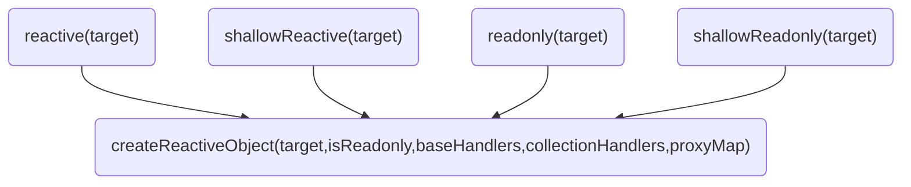
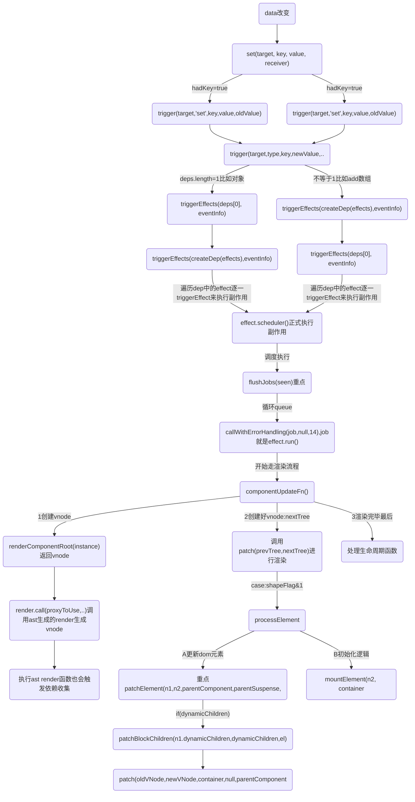
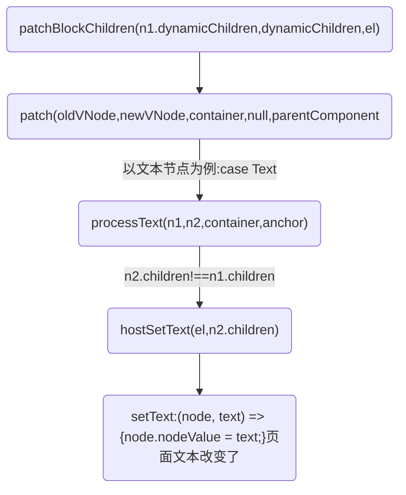

### 图-收集和触发概念和流程
```
初始化-->get-->track(追踪，依赖)

data改变-->set-->trigger(触发器)
```

1. 依赖收集
targetMap中有depsMap（以target为key）；depsMap中有许多dep（以targetMap的key为key）；简单理解为：在编译时根据target和key，创建副作用，将activeEffect指向新建的副作用，并存放到相关的依赖dep里的过程就是依赖收集。

2. 触发更新
触发target、key相关的dep中所有相关的副作用，通过各个副作用上的effect.scheduler()或者effect.run()来实现更新。

triggerEffect触发副作用从而更新。当触发更新的副作用effect允许自调用，且不是当前活跃的副作用时，通过调度器scheduler执行副作用或者直接执行run，是实际上触发更新的地方。

## 图-先来看首次渲染的依赖收集
下面函数都会触发收集


### 实例代码
```html
<body>
  <script src="./vue3.global.js"></script>
  <div id="root">
    <div>
      <button v-on:click='onClickText' class="btn">Hello world,Click me</button>
      <span>{{refData.myName}}-{{msg}}-{{info.msg2}}</span>
      <div v-if="showDiv">
        被你发现了
      </div>
    </div>
  </div>
  <script>
    const { ref, reactive, nextTick } = Vue

    const app = Vue.createApp({
      data() {
        return {
          msg: '改变我',
          showDiv: false
        }
      },
      methods: {
        onClickText() {
          this.msg = '努力'
          this.showDiv = !this.showDiv
          this.info.msg2 = this.showDiv ? '直接点' : '其他选择'
          nextTick(() => {
            console.log('--nextTick--', this.showDiv, this.msg);
          })
        }
      },

      setup(props) {
        const refData = ref({
          myName: 'Ruo'
        })

        const info = reactive({
          msg2: 'hello',
        });

        nextTick(() => {
          console.log('--nextTick--');
        })

        Vue.onBeforeMount(() => {
          console.log('--1:组件挂载前 onBeforeMount-->')
        })

        Vue.onMounted(() => {
          console.log('--2:组件挂载后 onMounted-->')
        });

        return {
          info,
          refData
        };
      },

    })

    console.log('app:', app)
    app.mount('#root')
  </script>
</body>
```

在执行setup()调用`reactive`,如上面的例子会调用4次`reactive()`,因为有4个data:
```js
function reactive(target) {
	// if trying to observe a readonly proxy, return the readonly version.
	// 如果试图去观察一个只读的代理对象，会直接返回只读版本
	if (isReadonly(target)) {
		return target;
	}
	// 创建一个代理对象并返回
	console.log('%c响应式A=>3:reactive->createReactiveObject创建一个代理对象并返回', 'color:chartreuse')
	return createReactiveObject(target, false, mutableHandlers, mutableCollectionHandlers, reactiveMap);
}
```

### 编译后的代码code
```js
const _Vue = Vue
const { createElementVNode: _createElementVNode, createCommentVNode: _createCommentVNode } = _Vue

const _hoisted_1 = ["onClick"]
const _hoisted_2 = { key: 0 }

return function render(_ctx, _cache) {
  with (_ctx) {
    const { createElementVNode: _createElementVNode, createCommentVNode: _createCommentVNode, toDisplayString: _toDisplayString, openBlock: _openBlock, createElementBlock: _createElementBlock } = _Vue

    return (_openBlock(), _createElementBlock("div", null, [
      _createElementVNode("button", {
        onClick: onClickText,
        class: "btn"
      }, "Hello world,Click me", 8 /* PROPS */, _hoisted_1),
      _createCommentVNode(" <span>{{refData.myName}}-{{msg}}-{{info.msg2}}</span> "),
      _createElementVNode("span", null, _toDisplayString(refData.myName) + "-" + _toDisplayString(msg), 1 /* TEXT */),
      showDiv
        ? (_openBlock(), _createElementBlock("div", _hoisted_2, " 被你发现了 "))
        : _createCommentVNode("v-if", true)
    ]))
  }
}
```

## 初始化-->get-->track
### track函数
track 函数接受三个参数：target 表示被追踪的目标对象，type 表示追踪类型，可以是 TrackOpTypes.GET 或 TrackOpTypes.HAS，key 表示被追踪的键。

如果 shouldTrack 为 false 或 activeEffect 为 undefined，则直接返回。shouldTrack 是一个标志位，用于控制是否进行依赖追踪。activeEffect 则表示当前正在执行的副作用函数。

通过 targetMap 变量获取 target 对应的依赖映射表 depsMap。如果 depsMap 不存在，则创建一个新的映射表，并将其设置为 targetMap 的值

然后，通过 depsMap 获取 key 对应的依赖集合 dep。如果 dep 不存在，则创建一个新的依赖集合，并将其设置为 depsMap 的值。

最后调用trackEffects
```
trackEffects 函数用于将当前正在收集依赖的 effect 添加到 Dep 实例的依赖列表中。其中，effect.dep 是一个数组，存储了与该 Dep 实例相关的所有 effect。将该 effect 添加到任务队列中，即调用 queueEffect 函数。
```

deps数组，用于存储该 effect 的依赖关系。当响应式数据对象发生变化时，对应的 Dep 实例会通知该 effect 更新，并将该 Dep 实例添加到 effect 的 deps 数组中。这样，Vue3 就可以根据组件实例和响应式数据对象来确定要更新的组件。


* 以目标对象target为key，depsMap为targetMap的值；以target的key为key，使用createDep()创建依赖dep为值，存放在target对应的depsMap中。
* 通过trackEffects(dep, eventInfo)来收集副作用。

track 收集依赖:
`createDep`
使用createDep创建一个新的dep。可以看到，dep是个Set实例，且添加了两个属性：
* w：wasTracked的首字母，表示当前依赖是否被收集；
* n：newlyTracked的首字母，表示当前依赖是否是新收集的。

`trackEffects`
trackEffects用于收集副作用。主要把当前活跃的activeEffect加入dep，以及在activeEffect.deps中加入该副作用影响到的所有依赖。

依赖收集就是把当前活跃的副作用activeEffect存入全局变量targetMap中的 (target对应的 depsMap) 中 （target的key）对应的 dep(类型为Set) 中，并把这个dep加入到受activeEffect副作用影响的所有依赖activeEffect.deps列表中。
```js
const targetMap = new WeakMap();

function track(target, type, key) {
  if (shouldTrack && activeEffect) {
    let depsMap = targetMap.get(target);
    if (!depsMap) {
      targetMap.set(target, (depsMap = new Map()));
    }
    let dep = depsMap.get(key);
    if (!dep) {
      depsMap.set(key, (dep = createDep()));
    }
    const eventInfo = { effect: activeEffect, target, type, key }
      ;
    console.log('%c=track&track=track触发收集:1,track调用trackEffects', 'color:chartreuse', 'dep:', dep)
    trackEffects(dep, eventInfo);
  }
}

let activeEffect;
function trackEffects(dep, debuggerEventExtraInfo) {
  console.log('%c触发收集:trackEffects把当前活跃的activeEffect加入dep，以及在activeEffect.deps中加入该副作用影响到的所有依赖', 'color:chartreuse')
  let shouldTrack = false;
  if (effectTrackDepth <= maxMarkerBits) {
    if (!newTracked(dep)) {
      dep.n |= trackOpBit; // set newly tracked
      shouldTrack = !wasTracked(dep);
    }
  } else {
    // Full cleanup mode.
    shouldTrack = !dep.has(activeEffect);
  }
  if (shouldTrack) {
    dep.add(activeEffect);
    activeEffect.deps.push(dep);
    if (activeEffect.onTrack) {
      activeEffect.onTrack(Object.assign({ effect: activeEffect }, debuggerEventExtraInfo));
    }
  }
}
```

### 如图：可见vnode构建的时候会触发handler的get
* beforeMount在vnode构建之前
* 调用render函数开始vnode构建
```
=vnode-构建:start-->调用Ast生成的render函数
```
* 触发get


## data改变-->set-->trigger(触发器)
### trigger 函数
```js
function trigger(target, type, key, newValue, oldValue, oldTarget) {
	const depsMap = targetMap.get(target);
	console.log('%c=track&trigger=trigger触发副作用:1开始判断', 'color:chartreuse', { target, type, key, newValue, oldValue, oldTarget, depsMap })
	if (!depsMap) {
		// never been tracked
		return;
	}
	let deps = [];
	if (type === "clear" /* TriggerOpTypes.CLEAR */) {
		// collection being cleared
		// trigger all effects for target
		console.log(`%c=track&trigger=trigger触发副作用2:type:${type}`, 'color:chartreuse')
		deps = [...depsMap.values()];
	}
	else if (key === 'length' && isArray(target)) {
		const newLength = toNumber(newValue);
		console.log(`%c=track&trigger=trigger触发副作用3:key === 'length' && isArray(target)`, 'color:chartreuse')
		depsMap.forEach((dep, key) => {
			if (key === 'length' || key >= newLength) {
				deps.push(dep);
			}
		});
	}
	else {
		// schedule runs for SET | ADD | DELETE
		if (key !== void 0) {
			console.log(`%c=track&trigger=trigger触发副作用4:`, 'color:chartreuse')
			deps.push(depsMap.get(key));
		}
		// also run for iteration key on ADD | DELETE | Map.SET
		switch (type) {
			case "add" /* TriggerOpTypes.ADD */:
				if (!isArray(target)) {
					deps.push(depsMap.get(ITERATE_KEY));
					console.log(`%c=track&trigger=trigger触发副作用5:`, 'color:chartreuse')
					if (isMap(target)) {
						deps.push(depsMap.get(MAP_KEY_ITERATE_KEY));
					}
				}
				else if (isIntegerKey(key)) {
					console.log(`%c=track&trigger=trigger触发副作用6:`, 'color:chartreuse')
					// new index added to array -> length changes
					deps.push(depsMap.get('length'));
				}
				break;
			case "delete" /* TriggerOpTypes.DELETE */:
				console.log(`%c=track&trigger=trigger触发副作用7:`, 'color:chartreuse')
				if (!isArray(target)) {
					console.log(`%c=track&trigger=trigger触发副作用7-1:`, 'color:chartreuse')
					deps.push(depsMap.get(ITERATE_KEY));
					if (isMap(target)) {
						console.log(`%c=track&trigger=trigger触发副作用7-2:`, 'color:chartreuse')
						deps.push(depsMap.get(MAP_KEY_ITERATE_KEY));
					}
				}
				break;
			case "set" /* TriggerOpTypes.SET */:
				console.log(`%c=track&trigger=trigger触发副作用8:`, 'color:chartreuse')
				if (isMap(target)) {
					console.log(`%c=track&trigger=trigger触发副作用8-1:`, 'color:chartreuse')
					deps.push(depsMap.get(ITERATE_KEY));
				}
				break;
		}
	}
	const eventInfo = { target, type, key, newValue, oldValue, oldTarget };
	if (deps.length === 1) {
		console.log(`%c=track&trigger=trigger触发副作用9:`, 'color:chartreuse')
		if (deps[0]) {
			console.log(`%c=track&trigger=trigger触发副作用9-1=执行triggerEffects:`, 'color:chartreuse')
			{
				triggerEffects(deps[0], eventInfo);
			}
		}
	}
	else {
		const effects = [];
		for (const dep of deps) {
			if (dep) {
				effects.push(...dep);
			}
		}
		{
			console.log(`%c=track&trigger=trigger触发副作用10=执行triggerEffects:`, 'color:chartreuse')
			triggerEffects(createDep(effects), eventInfo);
		}
	}
}
```

### trigger-->triggerEffects-->triggerEffect
```js
function triggerEffects(dep, debuggerEventExtraInfo) {
	console.log('%c=triggerEffects=触发更新=开始判断=triggerEffects接收一个dep和用于调试的额外信息。遍历dep中的effect，逐一使用triggerEffect来执行副作用', 'color:chartreuse', { dep })
	// spread into array for stabilization
	const effects = isArray(dep) ? dep : [...dep];
	for (const effect of effects) {
		if (effect.computed) {
			console.log('%c=triggerEffects=触发更新:a,triggerEffects->triggerEffect', 'color:chartreuse', 'effect:', effect)
			triggerEffect(effect, debuggerEventExtraInfo);
		}
	}
	for (const effect of effects) {
		if (!effect.computed) {
			console.log('%c=triggerEffects=触发更新:b,triggerEffects->triggerEffect', 'color:chartreuse', 'effect:', effect)
			triggerEffect(effect, debuggerEventExtraInfo);
		}
	}
}
```

### 重点：triggerEffect实际触发更新的地方
triggerEffect触发副作用从而更新。当触发更新的副作用effect允许自调用，且不是当前活跃的副作用时，通过调度器scheduler执行副作用或者直接执行run，是实际上触发更新的地方。
```js
function triggerEffect(effect, debuggerEventExtraInfo) {
	console.log('%c=triggerEffect正式执行副作用:开启判断逻辑=effect', 'color:cyan', 'effect:', effect)
	if (effect !== activeEffect || effect.allowRecurse) {
		if (effect.onTrigger) {
			effect.onTrigger(extend({ effect }, debuggerEventExtraInfo));
		}
		// 实际触发更新的地方,判断是否有scheduler, 有则执行，无则执行fn
		if (effect.scheduler) {
			console.log('%c=triggerEffect正式执行副作用:1=triggerEffect调用effect.scheduler', 'color:cyan')
			console.log('%c=队列4:triggerEffect调用effect.scheduler()', 'color:black', effect.scheduler)

			// debugger
			effect.scheduler();
		}
		else {
			console.log('%c=triggerEffect正式执行副作用:2=triggerEffect调用effect.run', 'color:cyan')
			effect.run();
		}
	}
}
```

## 流程图-data更新


更新的时候以处理文本节点为例子


### 流程解析:有一个需要注意点： 初始化的时候instance.data
```js
console.log('start响应式=>a:applyOptions-调用reactive,重点，响应式赋值给实例的data', 'color:magenta')

instance.data = reactive(data);
```
### 流程解析:第1步,所以副作用set的修改的也是instance.data的值,这样就生成的新的instance
下面debugger可以看到instance数据结构
```js
	debugger
	const nextTree = renderComponentRoot(instance);
	{
		endMeasure(instance, `render`);
	}
	// 获取组件上次渲染的 VNode
	const prevTree = instance.subTree;
	instance.subTree = nextTree;
```

但是我目前还不知道多个组件它是怎么处理instance.data的，得测试一下

### 流程解析:第2步,执行renderComponentRoot,也就是render函数生成最新的vnode
```js
console.log('$ceffect.run==>调用renderComponentRoot，获取组件最新的 VNode,render会读取组件的响应式数据，这会触发依赖收集', 'color:chartreuse')

const nextTree = renderComponentRoot(instance);
```

### 流程解析:第3步,执行patch 走diff流程
```js
const componentUpdateFn = () => {
	// 省略...
	console.log('$ceffect.run==>调用renderComponentRoot，获取组件最新的 VNode,render会读取组件的响应式数据，这会触发依赖收集', 'color:chartreuse')
	const nextTree = renderComponentRoot(instance);
	{
		endMeasure(instance, `render`);
	}
	// 获取组件上次渲染的 VNode
	const prevTree = instance.subTree;
	instance.subTree = nextTree;
	{
		startMeasure(instance, `patch`);
	}
	console.log('effect.run==>:componentUpdateFn之updateComponent调用patch 函数进行组件的更新')
	patch(prevTree, nextTree,
		// parent may have changed if it's in a teleport
		hostParentNode(prevTree.el),
		// anchor may have changed if it's in a fragment
		getNextHostNode(prevTree), instance, parentSuspense, isSVG);
	// 省略...
```
