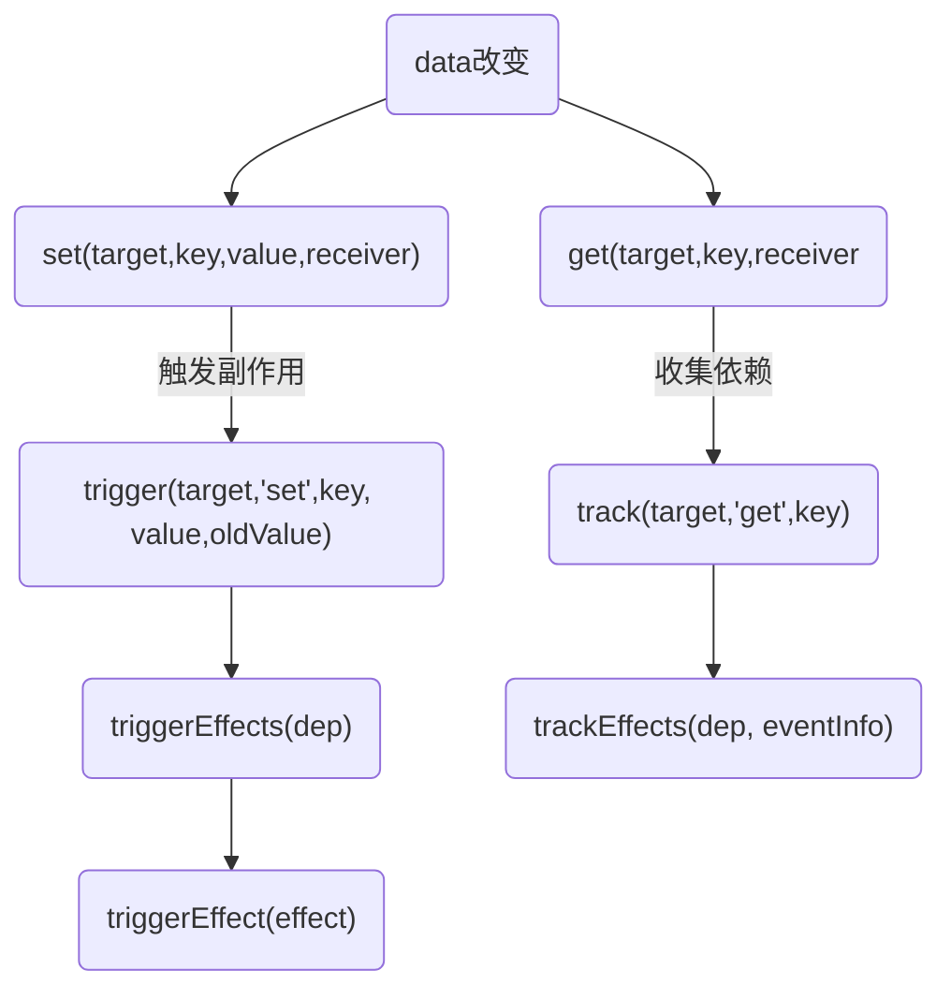
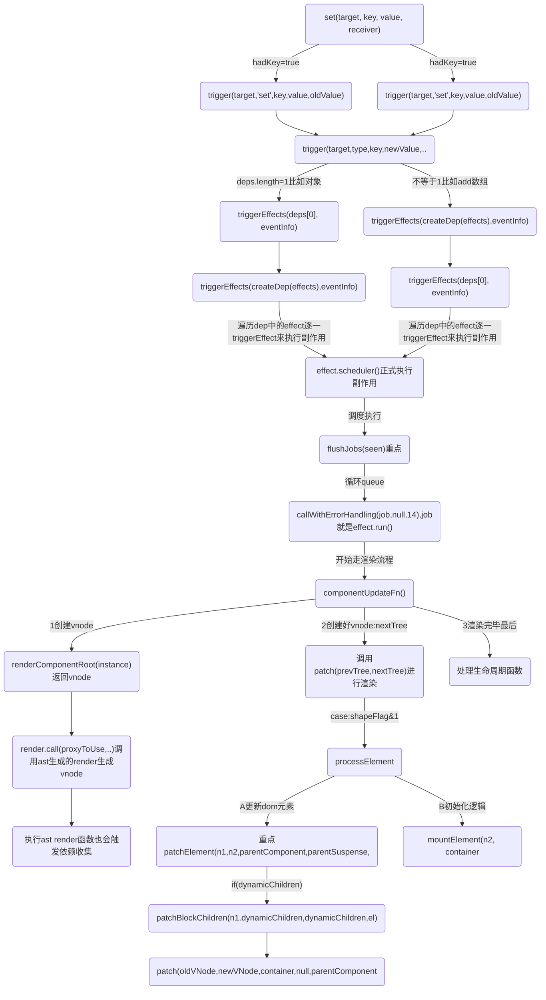
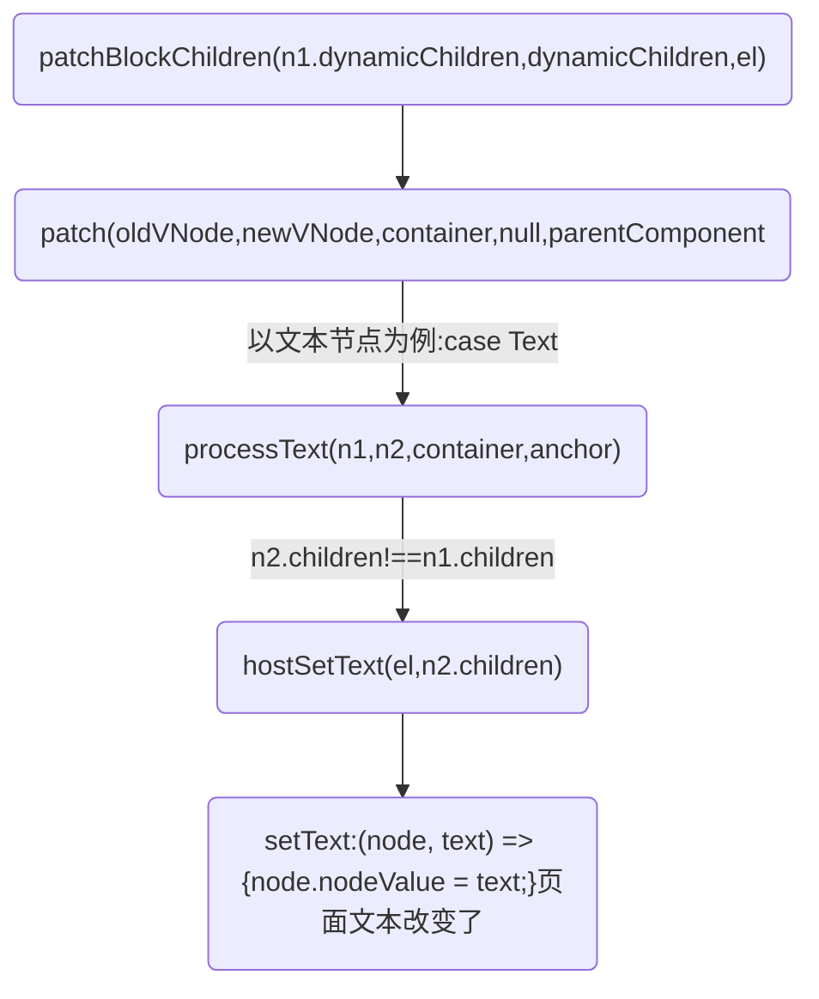

## data更新流程图




更新的时候以处理文本节点为例子


## 流程解析
有一个需要注意点： 初始化的时候instance.data
```js
console.log('start响应式=>a:applyOptions-调用reactive,重点，响应式赋值给实例的data', 'color:magenta')

instance.data = reactive(data);
```
### 第1步:所以副作用set的修改的也是instance.data的值,这样就生成的新的instance
下面debugger可以看到instance数据结构
```js
	debugger
	const nextTree = renderComponentRoot(instance);
	{
		endMeasure(instance, `render`);
	}
	// 获取组件上次渲染的 VNode
	const prevTree = instance.subTree;
	instance.subTree = nextTree;
```

但是我目前还不知道多个组件它是怎么处理instance.data的，得测试一下

### 第2步：执行renderComponentRoot,也就是render函数生成最新的vnode
```js
console.log('$ceffect.run==>调用renderComponentRoot，获取组件最新的 VNode,render会读取组件的响应式数据，这会触发依赖收集', 'color:chartreuse')

const nextTree = renderComponentRoot(instance);
```

### 第3步：执行patch 走diff流程
```js
const componentUpdateFn = () => {
	// 省略...
	console.log('$ceffect.run==>调用renderComponentRoot，获取组件最新的 VNode,render会读取组件的响应式数据，这会触发依赖收集', 'color:chartreuse')
	const nextTree = renderComponentRoot(instance);
	{
		endMeasure(instance, `render`);
	}
	// 获取组件上次渲染的 VNode
	const prevTree = instance.subTree;
	instance.subTree = nextTree;
	{
		startMeasure(instance, `patch`);
	}
	console.log('effect.run==>:componentUpdateFn之updateComponent调用patch 函数进行组件的更新')
	patch(prevTree, nextTree,
		// parent may have changed if it's in a teleport
		hostParentNode(prevTree.el),
		// anchor may have changed if it's in a fragment
		getNextHostNode(prevTree), instance, parentSuspense, isSVG);
	// 省略...
```