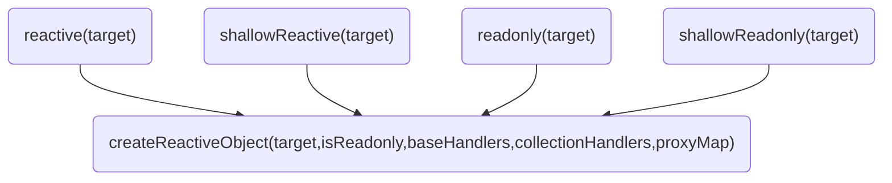
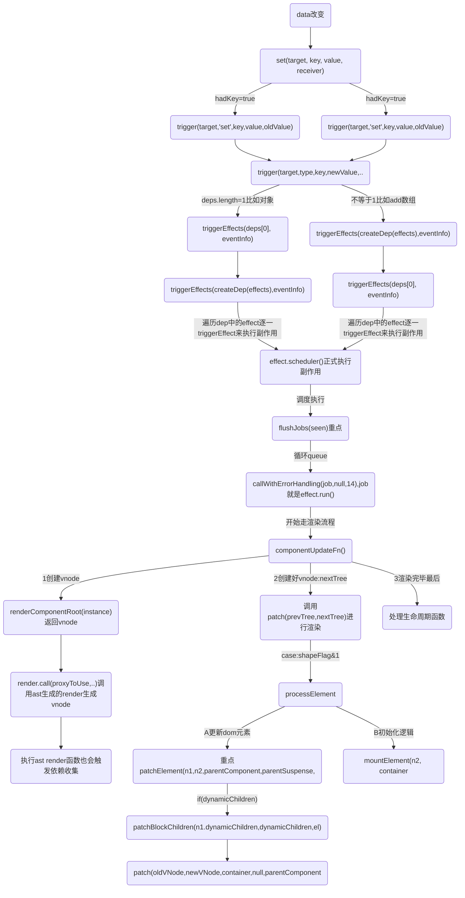
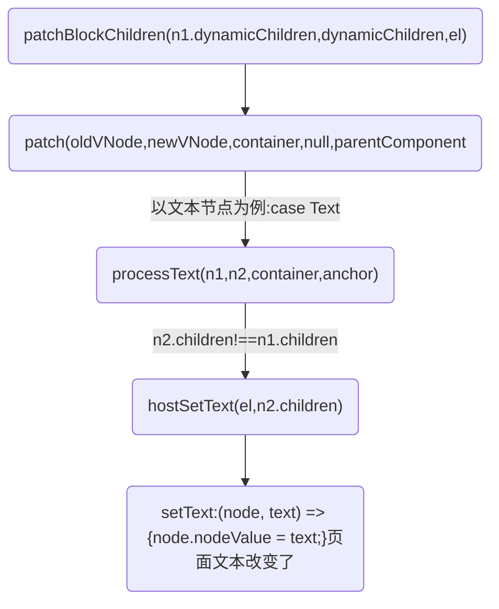

## 实例代码
```html
<body>
  <script src="./vue3.global.js"></script>
  <div id="root">
    <div>
      <button v-on:click='onClickText' class="btn">Hello world,Click me</button>
      <span>{{refData.myName}}-{{msg}}-{{info.msg2}}</span>
      <div v-if="showDiv">
        被你发现了
      </div>
    </div>
  </div>
  <script>
    const { ref, reactive, nextTick } = Vue

    const app = Vue.createApp({
      data() {
        return {
          msg: '改变我',
          showDiv: false
        }
      },
      methods: {
        onClickText() {
          this.msg = '努力'
          this.showDiv = !this.showDiv
          this.info.msg2 = this.showDiv ? '直接点' : '其他选择'
          nextTick(() => {
            console.log('--nextTick--', this.showDiv, this.msg);
          })
        }
      },

      setup(props) {
        const refData = ref({
          myName: 'Ruo'
        })

        const info = reactive({
          msg2: 'hello',
        });

        nextTick(() => {
          console.log('--nextTick--');
        })

        Vue.onBeforeMount(() => {
          console.log('--1:组件挂载前 onBeforeMount-->')
        })

        Vue.onMounted(() => {
          console.log('--2:组件挂载后 onMounted-->')
        });

        return {
          info,
          refData
        };
      },

    })

    console.log('app:', app)
    app.mount('#root')
  </script>
</body>
```

### 下面两个在setup会触发收集
```js
const refData = ref({
	myName: 'Ruo'
})

const info = reactive({
	msg2: 'hello',
});
```

### 如果实在data定义的初始化数据
```js
data() {
	return {
		msg: '改变我',
		showDiv: false
	}
}
```

[](../assets/img-vue/vue3-data的依赖触发.png)

### createReactiveObject
```js
function createReactiveObject(target, isReadonly, baseHandlers, collectionHandlers, proxyMap) {
	// 如果目标不是对象，直接返回原始值
	if (!isObject(target)) {
		{
			console.warn(`value cannot be made reactive: ${String(target)}`);
		}
		return target;
	}

	// target is already a Proxy, return it.
	// exception: calling readonly() on a reactive object
	// 如果目标已经是一个代理，直接返回
	// 除非对一个响应式对象执行 readonly
	if (target["__v_raw" /* ReactiveFlags.RAW */] &&
		!(isReadonly && target["__v_isReactive" /* ReactiveFlags.IS_REACTIVE */])) {
		return target;
	}
	// target already has corresponding Proxy
	// 目标已经存在对应的代理对象
	const existingProxy = proxyMap.get(target);
	if (existingProxy) {
		return existingProxy;
	}
	// only specific value types can be observed.
	// 只有白名单里的类型才能被创建响应式对象
	const targetType = getTargetType(target);
	if (targetType === 0 /* TargetType.INVALID */) {
		return target;
	}

	console.log('%c响应式=>2:正式开始createReactiveObject执行new Proxy', 'color:chartreuse', { targetType: targetType === 2 })
	const proxy = new Proxy(target, targetType === 2 /* TargetType.COLLECTION */ ? collectionHandlers : baseHandlers);
	proxyMap.set(target, proxy);
	return proxy;
}
```

### Proxy的handler
以上的依赖收集都是调用的reactive(target),reactive调用createReactiveObject的参数mutableHandlers参数就是baseHandlers
```js
function reactive(target) {
	// if trying to observe a readonly proxy, return the readonly version.
	// 如果试图去观察一个只读的代理对象，会直接返回只读版本
	if (isReadonly(target)) {
		return target;
	}
	// 创建一个代理对象并返回
	return createReactiveObject(target, false, mutableHandlers, mutableCollectionHandlers, reactiveMap);
}

const get = /*#__PURE__*/ createGetter();
const set = /*#__PURE__*/ createSetter();

const mutableHandlers = {
	get,
	set,
	deleteProperty,
	has,
	ownKeys
};
```

### Proxy的handler-get
```js
function createGetter(isReadonly = false, shallow = false) {
	console.log(`%c响应式get陷阱触发==>:createGetter`, 'color:red')
	return function get(target, key, receiver) {
		console.log(`%c响应式触发=>get-开始判断`, 'color:red', target, 'key:', key)
		// 如果 get 访问的 key 是 '__v_isReactive'，返回 createGetter 的 isReadonly 参数取反结果
		if (key === "__v_isReactive" /* ReactiveFlags.IS_REACTIVE */) {
			console.log(`%c响应式触发=>get:2=如果 get 访问的 key 是 '__v_isReactive'`, 'color:red')
			return !isReadonly;
		}
		// 如果 get 访问的 key 是 '__v_isReadonly'，返回 createGetter 的 isReadonly 参数
		else if (key === "__v_isReadonly" /* ReactiveFlags.IS_READONLY */) {
			console.log(`%c响应式触发=>get:3=如果 get 访问的 key 是 '__v_isReadonly'`, 'color:red')
			return isReadonly;
		}
		else if (key === "__v_isShallow" /* ReactiveFlags.IS_SHALLOW */) {
			console.log(`%c响应式触发=>get:4=`, 'color:red')
			return shallow;
		}
		// 如果 get 访问的 key 是 '__v_raw'，并且 receiver 与原始标识相等，则返回原始值
		else if (key === "__v_raw" /* ReactiveFlags.RAW */ &&
			receiver ===
			(isReadonly
				? shallow
					? shallowReadonlyMap
					: readonlyMap
				: shallow
					? shallowReactiveMap
					: reactiveMap).get(target)) {
			console.log(`%c响应式触发=>get:5=如果 get 访问的 key 是 '__v_raw'，并且 receiver 与原始标识相等，则返回原始值`, 'color:red')
			return target;
		}

		// 判断 target 是否是数组
		const targetIsArray = isArray(target);
		// 如果不是只读对象，并且目标对象是个数组，访问的 key 又在数组需要劫持的方法里，直接调用修改后的数组方法执行
		if (!isReadonly && targetIsArray && hasOwn(arrayInstrumentations, key)) {
			console.log(`%c响应式触发=>get:6=如果不是只读对象，并且目标对象是个数组，访问的 key 又在数组需要劫持的方法里，直接调用修改后的数组方法执行`, 'color:red')
			return Reflect.get(arrayInstrumentations, key, receiver);
		}

		// 获取 Reflect 执行的 get 默认结果
		const res = Reflect.get(target, key, receiver);
		// 如果是 key 是 Symbol，并且 key 是 Symbol 对象中的 Symbol 类型的 key
		// 或者 key 是不需要追踪的 key: __proto__,__v_isRef,__isVue,直接返回 get 结果
		if (isSymbol(key) ? builtInSymbols.has(key) : isNonTrackableKeys(key)) {
			console.log(`%c响应式触发=>get:7=如果是 key 是 Symbol，并且 key 是 Symbol 对象中的 Symbol 类型的 key`, 'color:red')
			return res;
		}
		// 不是只读对象，执行 track 收集依赖
		if (!isReadonly) {
			console.log(`%c响应式触发=>get:8=不return=target不是只读对象，track收集依赖`, 'color:red', target, 'key:', key)
			track(target, "get" /* TrackOpTypes.GET */, key);
		}
		// 如果是 shallow 浅层响应式，直接返回 get 结果
		if (shallow) {
			console.log(`%c响应式触发=>get:9=如果是 shallow 浅层响应式，直接返回 get 结果`, 'color:red')
			return res;
		}
		// 如果是 ref ，则返回解包后的值 - 当 target 是数组，key 是 int 类型时，不需要解包
		if (isRef(res)) {
			console.log(`%c响应式触发=>get:10=如果是 ref ，则返回解包后的值 - 当 target 是数组，key 是 int 类型时`, 'color:red')
			// ref unwrapping - skip unwrap for Array + integer key.
			return targetIsArray && isIntegerKey(key) ? res : res.value;
		}
		if (isObject(res)) {
			// 将返回的值也转换成代理，我们在这里做 isObject 的检查以避免无效值警告。
			// Convert returned value into a proxy as well. we do the isObject check
			// here to avoid invalid value warning. Also need to lazy access readonly
			// and reactive here to avoid circular dependency.
			console.log(`%c响应式触发=>get:11=调用reactive`, 'color:red')
			return isReadonly ? readonly(res) : reactive(res);
		}

		console.log(`%c响应式触发=>get:12=不是 object 类型则直接返回 get 结果`, 'color:red')
		return res;
	};
}
```

### Proxy的handler-set
```js
function createSetter(shallow = false) {
	console.log(`%c响应式陷阱触发==>:createSetter`, 'color:magenta')
	return function set(target, key, value, receiver) {
		console.log(`%c响应式触发==>1:set开始判断`, 'color:magenta', { target, key, value, receiver })
		let oldValue = target[key];
		if (isReadonly(oldValue) && isRef(oldValue) && !isRef(value)) {
			console.log(`%c响应式触发=>set:2=`, 'color:magenta')
			return false;
		}
		if (!shallow) {
			// 当不是 shallow 模式时，判断旧值是否是 Ref，如果是则直接更新旧值的 value
			// 因为 ref 有自己的 setter
			if (!isShallow(value) && !isReadonly(value)) {
				oldValue = toRaw(oldValue);
				value = toRaw(value);
				console.log(`%c响应式触发=>set:3=不return`, 'color:magenta')
			}
			if (!isArray(target) && isRef(oldValue) && !isRef(value)) {
				oldValue.value = value;
				console.log(`%c响应式触发=>set:4=`, 'color:magenta')
				return true;
			}
		}
		// 判断 target 中是否存在 key
		const hadKey = isArray(target) && isIntegerKey(key)
			? Number(key) < target.length
			: hasOwn(target, key);
		// Reflect.set 获取默认行为的返回值
		const result = Reflect.set(target, key, value, receiver);
		// don't trigger if target is something up in the prototype chain of original
		/*
		如果目标是原始对象原型链上的属性，则不会触发 trigger 派发更新
		当存在上述情形,第一次设置值时,由于子代理没有prop属性方法,
		会触发父代理的set方法。父代理的这个判断此时是false,算是一个优化,避免2个触发更新
		*/
		if (target === toRaw(receiver)) {
			// 使用 trigger 派发更新，根据 hadKey 区别调用事件
			if (!hadKey) {
				console.log(`%c响应式触发=>set:5=不return,并调用trigger,使用 trigger 派发更新，根据 hadKey:${hadKey}->add=调用事件`, 'color:magenta')
				trigger(target, "add" /* TriggerOpTypes.ADD */, key, value);
			}
			else if (hasChanged(value, oldValue)) {
				console.log(`%c响应式触发=>set:6=不return,并调用trigger,使用 trigger 派发更新，根据hadKey:${hadKey}->set=调用事件`, 'color:red', target, key, value, 'oldValue:', oldValue)
				trigger(target, "set" /* TriggerOpTypes.SET */, key, value, oldValue);
			}
		}
		return result;
	};
}
```

## 先来看首次渲染的依赖收集
下面函数都会触发收集


流程
```
初始化-->get-->track(追踪，依赖)
data改变-->set-->trigger(触发器)
```

编译代码code
```js
const _Vue = Vue
const { createElementVNode: _createElementVNode, createCommentVNode: _createCommentVNode } = _Vue

const _hoisted_1 = ["onClick"]
const _hoisted_2 = { key: 0 }

return function render(_ctx, _cache) {
  with (_ctx) {
    const { createElementVNode: _createElementVNode, createCommentVNode: _createCommentVNode, toDisplayString: _toDisplayString, openBlock: _openBlock, createElementBlock: _createElementBlock } = _Vue

    return (_openBlock(), _createElementBlock("div", null, [
      _createElementVNode("button", {
        onClick: onClickText,
        class: "btn"
      }, "Hello world,Click me", 8 /* PROPS */, _hoisted_1),
      _createCommentVNode(" <span>{{refData.myName}}-{{msg}}-{{info.msg2}}</span> "),
      _createElementVNode("span", null, _toDisplayString(refData.myName) + "-" + _toDisplayString(msg), 1 /* TEXT */),
      showDiv
        ? (_openBlock(), _createElementBlock("div", _hoisted_2, " 被你发现了 "))
        : _createCommentVNode("v-if", true)
    ]))
  }
}
```

## 如图：可见vnode构建的时候会触发handler的get
* beforeMount在vnode构建之前
* 调用render函数开始vnode构建
```
=vnode-构建:start-->调用Ast生成的render函数
```
* 触发get


## data更新流程图


更新的时候以处理文本节点为例子


## 流程解析
有一个需要注意点： 初始化的时候instance.data
```js
console.log('start响应式=>a:applyOptions-调用reactive,重点，响应式赋值给实例的data', 'color:magenta')

instance.data = reactive(data);
```
### 第1步:所以副作用set的修改的也是instance.data的值,这样就生成的新的instance
下面debugger可以看到instance数据结构
```js
	debugger
	const nextTree = renderComponentRoot(instance);
	{
		endMeasure(instance, `render`);
	}
	// 获取组件上次渲染的 VNode
	const prevTree = instance.subTree;
	instance.subTree = nextTree;
```

但是我目前还不知道多个组件它是怎么处理instance.data的，得测试一下

### 第2步：执行renderComponentRoot,也就是render函数生成最新的vnode
```js
console.log('$ceffect.run==>调用renderComponentRoot，获取组件最新的 VNode,render会读取组件的响应式数据，这会触发依赖收集', 'color:chartreuse')

const nextTree = renderComponentRoot(instance);
```

### 第3步：执行patch 走diff流程
```js
const componentUpdateFn = () => {
	// 省略...
	console.log('$ceffect.run==>调用renderComponentRoot，获取组件最新的 VNode,render会读取组件的响应式数据，这会触发依赖收集', 'color:chartreuse')
	const nextTree = renderComponentRoot(instance);
	{
		endMeasure(instance, `render`);
	}
	// 获取组件上次渲染的 VNode
	const prevTree = instance.subTree;
	instance.subTree = nextTree;
	{
		startMeasure(instance, `patch`);
	}
	console.log('effect.run==>:componentUpdateFn之updateComponent调用patch 函数进行组件的更新')
	patch(prevTree, nextTree,
		// parent may have changed if it's in a teleport
		hostParentNode(prevTree.el),
		// anchor may have changed if it's in a fragment
		getNextHostNode(prevTree), instance, parentSuspense, isSVG);
	// 省略...
```