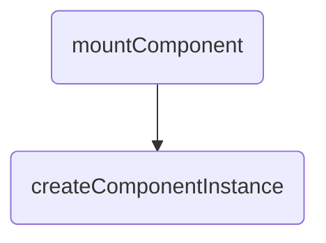
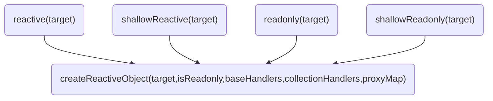
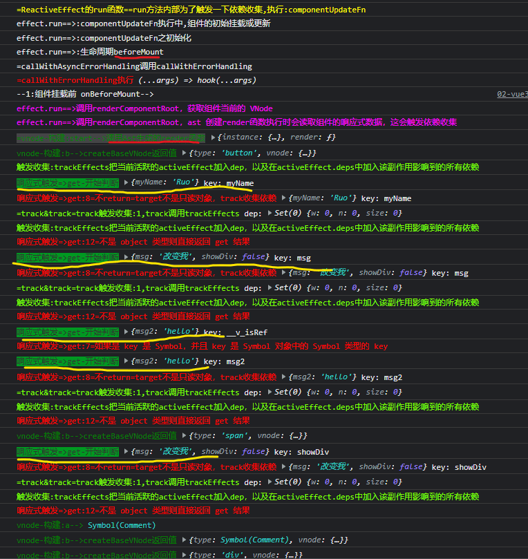
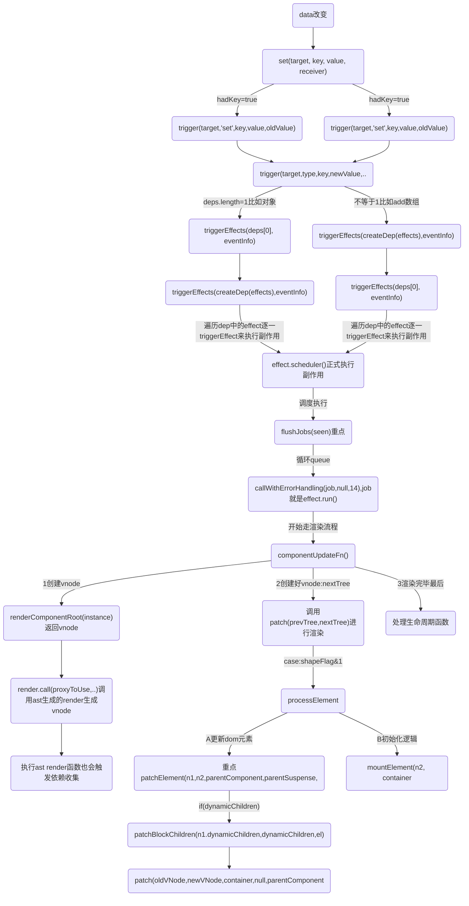
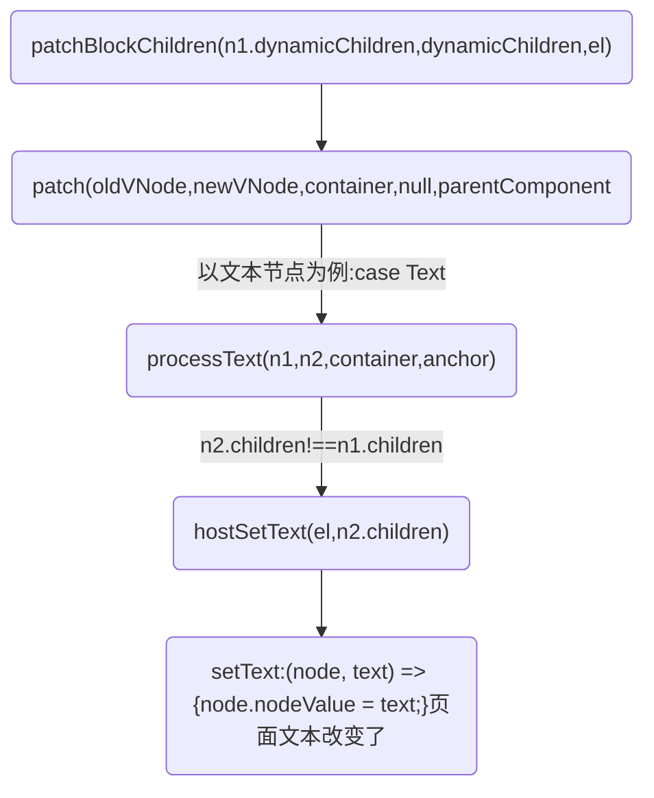

## Vue3的响应式-依赖收集来追踪数据变化和更新视图
### 具体实现过程如下：
在组件初始化时,Vue3 会分析模板中使用的响应式数据，并收集这些数据的依赖，建立响应式数据与组件实例之间的联系。

依赖收集的变化是通过响应式数据对象的 get 和 set 拦截器实现的。
```
在 get 拦截器中，Vue3 会检查当前是否存在正在执行的副作用函数，如果存在，则将该副作用函数与当前的响应式数据对象建立联系，并将该副作用函数加入到当前响应式数据对象的依赖列表中。

在 set 拦截器中，Vue3 会遍历当前响应式数据对象的所有依赖，触发这些依赖对应的副作用函数，实现自动更新。
```

当响应式数据发生变化时，Vue3 会触发相应的更新函数，并通知所有依赖该数据的组件进行更新。

具体来说，Vue3 会遍历该数据的所有依赖，找到与当前组件相关的依赖，并触发这些依赖对应的更新函数。

在虚拟 DOM 的更新过程中，会记录每个节点所属的组件实例，在渲染器更新视图时，只会更新与发生变化的组件相关的部分，而不是全部重新渲染。能够准确地知道哪个组件的哪些部分需要更新，并进行高效的局部更新，从而提高了应用的性能。这种局部更新的方式可以提高渲染效率，同时也能够避免不必要的 DOM 操作，从而减少浏览器的重排和重绘。

1. 在创建组件实例时，会调用 setup 函数。在 setup 函数中，会通过 reactive 函数将传入的数据对象转换为响应式对象，并返回该响应式对象。

2. 在 reactive 函数内部，首先会创建一个空对象 target，然后通过 Proxy 构造函数创建一个 Proxy 对象，并将 target 对象作为第一个参数传入。Proxy 对象的第二个参数是一个处理器对象 handler。

3. 在 handler 对象中，可以定义一些拦截操作的函数，比如 get、set、deleteProperty 等。当对响应式对象进行读写等操作时，会触发相应的拦截函数。

4. 当读取响应式对象的属性时，会触发 get 拦截函数。在 get 函数中，会先获取原始值，`然后通过 track 函数收集该属性的依赖，最后返回原始值`。

5. 当设置响应式对象的属性时，会触发 set 拦截函数。`在 set 函数中，会先将新值保存起来，然后通过 trigger 函数通知所有依赖该属性的地方进行更新`。

6. 当删除响应式对象的属性时，会触发 deleteProperty 拦截函数。在 deleteProperty 函数中，会先删除该属性，然后通过 trigger 函数通知所有依赖该属性的地方进行更新。

参考：[proxy](./proxy)
参考：[Reactivity简单例子](./Reactivity简单例子)

### 收集是为了什么
收集依赖的主要目的是为了建立响应式数据与副作用函数之间的联系，以便在响应式数据变化时自动触发副作用函数的更新。

当我们在副作用函数中使用了响应式数据对象时，Vue3 会在访问响应式数据对象时自动收集依赖，并在该响应式数据对象发生变化时自动触发对应的副作用函数更新。

* 这种自动触发更新的机制，避免了手动进行数据更新的复杂性和重复性，提高了开发效率
* 除了自动触发更新外，收集依赖还可以优化渲染性能。Vue3 中使用了基于 Proxy 的响应式数据实现，该实现支持精确跟踪响应式数据对象的属性变化，只会在发生实际变化时触发更新，避免了不必要的重复渲染操作。


### 什么时候会创建组件dep？收集后的数据存在哪里？
组件的 Dep 实例是在组件实例化时创建的。当组件实例被创建时，会对其响应式数据对象进行初始化，并将其对应的 Dep 实例添加到组件实例的`deps`数组中。

每个组件都会有自己独立的 Dep 实例来存储其响应式数据对象的依赖关系,换句话说，每个组件都会有自己独立的依赖收集系统。

当一个组件的响应式数据对象发生变化时，其对应的 Dep 实例会通知该组件的副作用函数更新，而不会触发其他组件的更新。这是通过在组件实例中创建名为`deps`的数组来实现的，每个响应式数据对象都会在组件实例中对应一个Dep实例，并添加到`deps`数组中。

createComponentInstance创建组件实例，在触发track的时候，而这个Dep会存在组件实例 effect 属性上, 每个响应式数据对象都对应一个 Dep 实例。


```js
function createComponentInstance(vnode, parent, suspense) {
  const type = vnode.type;
  // inherit parent app context - or - if root, adopt from root vnode
  const appContext = (parent ? parent.appContext : vnode.appContext) || emptyAppContext;
  const instance = {
    uid: uid$1++,
    vnode,
    type,
    parent,
    appContext,
    root: null,
    next: null,
    subTree: null,
    effect: null,
    update: null,
    scope: new EffectScope(true /* detached */),
    render: null,
    proxy: null,
    exposed: null,
    exposeProxy: null,
    withProxy: null,
    provides: parent ? parent.provides : Object.create(appContext.provides),
    accessCache: null,
    renderCache: [],
    // local resolved assets
    components: null,
    directives: null,
    // resolved props and emits options
    propsOptions: normalizePropsOptions(type, appContext),
    emitsOptions: normalizeEmitsOptions(type, appContext),
    // emit
    emit: null,
    emitted: null,
    // props default value
    propsDefaults: EMPTY_OBJ,
    // inheritAttrs
    inheritAttrs: type.inheritAttrs,
    // state
    ctx: EMPTY_OBJ,
    data: EMPTY_OBJ,
    props: EMPTY_OBJ,
    attrs: EMPTY_OBJ,
    slots: EMPTY_OBJ,
    refs: EMPTY_OBJ,
    setupState: EMPTY_OBJ,
    setupContext: null,
    // suspense related
    suspense,
    suspenseId: suspense ? suspense.pendingId : 0,
    asyncDep: null,
    asyncResolved: false,
    // lifecycle hooks
    // not using enums here because it results in computed properties
    isMounted: false,
    isUnmounted: false,
    isDeactivated: false,
    bc: null,
    c: null,
    bm: null,
    m: null,
    bu: null,
    u: null,
    um: null,
    bum: null,
    da: null,
    a: null,
    rtg: null,
    rtc: null,
    ec: null,
    sp: null
  };
  {
    instance.ctx = createDevRenderContext(instance);
  }
  instance.root = parent ? parent.root : instance;
  instance.emit = emit$1.bind(null, instance);
  // apply custom element special handling
  if (vnode.ce) {
    vnode.ce(instance);
  }
  return instance;
}
```

## reactive和effect API介绍
依赖收集的变化是通过reactive和effect这两个 API 实现的。reactive 用于创建响应式对象，effect 用于定义副作用函数。

当调用 reactive 创建一个响应式对象时，Vue3 会将该对象转换成代理对象，通过代理对象来拦截该对象的访问和修改操作，并在访问和修改时收集依赖。这些依赖会被保存在当前的副作用函数中，并在响应式数据变化时自动触发更新。

下面是一个简单的例子，演示了 reactive 和 effect API 的使用方式：

在上面的例子中，我们使用 reactive 创建了一个响应式对象 state，并使用 effect 定义了一个副作用函数，该函数会在 state 发生变化时自动触发更新。

点击按钮修改时，Vue3会自动触发更新函数，更新副作用函数中使用的msg2值，并在控制台打印出相应的日志。
```js
<body>
  <script src="./vue3.global.js"></script>
  <div id="root">
    <div>
      <button v-on:click='onClickText' class="btn">Hello world,Click me</button>
      <span>{{info.msg2}}</span>
    </div>
  </div>
  <script>
    const { ref, reactive, nextTick, effect } = Vue

    const app = Vue.createApp({
      methods: {
        onClickText() {
          this.info.msg2 = '直接点'
        }
      },

      setup(props) {
        const info = reactive({
          msg2: 'hello',
        });

        effect(() => {
          console.log(`effect函数: ${info.msg2}`)
        })

        return {
          info
        };
      },
    })
    app.mount('#root')
  </script>
</body>
```

## 依赖收集-componentUpdateFn-->new ReactiveEffect()
`componentUpdateFn`函数的内部会执行组件的render函数，render 函数会读取组件的响应式数据，这会触发依赖收集。

当后续 render 函数依赖的响应式数据发生变化的时候，会再次触发执行 componentUpdateFn 函数进行组件的重新渲染

```js
const componentUpdateFn = () => {
    console.log('依赖收集==>setupRenderEffect:3调用ReactiveEffect 创建一个副作用:', { componentUpdateFn })
    // const queueJobRes= () => queueJob(update)
    console.log('%c=队列1', 'color:black')
    const effect = (instance.effect = new ReactiveEffect(componentUpdateFn, () => queueJob(update), instance.scope // track it in component's effect scope
    ));
}
```

### 完整setupRenderEffect函数
```js
const setupRenderEffect = (instance, initialVNode, container, anchor, parentSuspense, isSVG, optimized) => {
  const componentUpdateFn = () => {
    console.log('effect.run==>:调用componentUpdateFn组件的初始挂载和更新')
    if (!instance.isMounted) {
      console.log('effect.run==>:componentUpdateFn之Mounte')
      let vnodeHook;
      const { el, props } = initialVNode;
      const { bm, m, parent } = instance;
      const isAsyncWrapperVNode = isAsyncWrapper(initialVNode);
      toggleRecurse(instance, false);
      // beforeMount hook
      if (bm) {
        console.log('effect.run==>:生命周期beforeMount')
        invokeArrayFns(bm);
      }
      // onVnodeBeforeMount
      if (!isAsyncWrapperVNode &&
        (vnodeHook = props && props.onVnodeBeforeMount)) {
        console.log('effect.run==>:生命周期onVnodeBeforeMount')
        invokeVNodeHook(vnodeHook, parent, initialVNode);
      }
      toggleRecurse(instance, true);
      if (el && hydrateNode) {
        // vnode has adopted host node - perform hydration instead of mount.
        const hydrateSubTree = () => {
          {
            startMeasure(instance, `render`);
          }
          console.log("effect.run==>:setupRenderEffect:1组件实例生成子树vnode")
          instance.subTree = renderComponentRoot(instance);
          {
            endMeasure(instance, `render`);
          }
          {
            startMeasure(instance, `hydrate`);
          }
          hydrateNode(el, instance.subTree, instance, parentSuspense, null);
          {
            endMeasure(instance, `hydrate`);
          }
        };
        if (isAsyncWrapperVNode) {
          initialVNode.type.__asyncLoader().then(
            // note: we are moving the render call into an async callback,
            // which means it won't track dependencies - but it's ok because
            // a server-rendered async wrapper is already in resolved state
            // and it will never need to change.
            () => !instance.isUnmounted && hydrateSubTree());
        }
        else {
          hydrateSubTree();
        }
      }
      else {
        {
          startMeasure(instance, `render`);
        }
        console.log('$ceffect.run==>执行renderComponentRoot，获取组件当前的 VNode,render会读取组件的响应式数据，这会触发依赖收集', 'color:chartreuse')
        const subTree = (instance.subTree = renderComponentRoot(instance));
        {
          endMeasure(instance, `render`);
        }
        {
          startMeasure(instance, `patch`);
        }
        console.log("effect.run==>调用patch进行组件内容的渲染,把子树挂载到container上")
        patch(null, subTree, container, anchor, instance, parentSuspense, isSVG);
        {
          endMeasure(instance, `patch`);
        }
        initialVNode.el = subTree.el;
      }
      // mounted hook
      if (m) {
        console.log('effect.run==>:生命周期mounted')
        queuePostRenderEffect(m, parentSuspense);
      }
      // onVnodeMounted
      if (!isAsyncWrapperVNode &&
        (vnodeHook = props && props.onVnodeMounted)) {
        const scopedInitialVNode = initialVNode;
        queuePostRenderEffect(() => invokeVNodeHook(vnodeHook, parent, scopedInitialVNode), parentSuspense);
      }
      // activated hook for keep-alive roots.
      // #1742 activated hook must be accessed after first render
      // since the hook may be injected by a child keep-alive
      if (initialVNode.shapeFlag & 256 /* ShapeFlags.COMPONENT_SHOULD_KEEP_ALIVE */ ||
        (parent &&
          isAsyncWrapper(parent.vnode) &&
          parent.vnode.shapeFlag & 256 /* ShapeFlags.COMPONENT_SHOULD_KEEP_ALIVE */)) {
        instance.a && queuePostRenderEffect(instance.a, parentSuspense);
      }
      console.log("%ceffect.run==>将组件实例的 isMounted 属性设为 true，表明当前的组件已经完成了挂载操作", 'color:red')
      instance.isMounted = true;
      {
        devtoolsComponentAdded(instance);
      }
      // #2458: deference mount-only object parameters to prevent memleaks
      initialVNode = container = anchor = null;
    }
    else {
      console.log('effect.run==>:componentUpdateFn之updateComponent')
      // updateComponent
      // This is triggered by mutation of component's own state (next: null)
      // OR parent calling processComponent (next: VNode)
      let { next, bu, u, parent, vnode } = instance;
      let originNext = next;
      let vnodeHook;
      {
        pushWarningContext(next || instance.vnode);
      }
      // Disallow component effect recursion during pre-lifecycle hooks.
      toggleRecurse(instance, false);
      if (next) {
        next.el = vnode.el;
        updateComponentPreRender(instance, next, optimized);
      }
      else {
        next = vnode;
      }
      // beforeUpdate hook
      if (bu) {
        console.log('effect.run==>:生命周期beforeUpdate')
        invokeArrayFns(bu);
      }
      // onVnodeBeforeUpdate
      if ((vnodeHook = next.props && next.props.onVnodeBeforeUpdate)) {
        invokeVNodeHook(vnodeHook, parent, next, vnode);
      }
      toggleRecurse(instance, true);
      // render
      {
        startMeasure(instance, `render`);
      }
      console.log('$ceffect.run==>执行renderComponentRoot，获取组件最新的 VNode,render会读取组件的响应式数据，这会触发依赖收集', 'color:chartreuse')
      const nextTree = renderComponentRoot(instance);
      {
        endMeasure(instance, `render`);
      }
      // 获取组件上次渲染的 VNode
      const prevTree = instance.subTree;
      instance.subTree = nextTree;
      {
        startMeasure(instance, `patch`);
      }
      console.log('effect.run==>:componentUpdateFn之updateComponent调用patch 函数进行组件的更新')
      patch(prevTree, nextTree,
        // parent may have changed if it's in a teleport
        hostParentNode(prevTree.el),
        // anchor may have changed if it's in a fragment
        getNextHostNode(prevTree), instance, parentSuspense, isSVG);
      {
        endMeasure(instance, `patch`);
      }
      next.el = nextTree.el;
      if (originNext === null) {
        // self-triggered update. In case of HOC, update parent component
        // vnode el. HOC is indicated by parent instance's subTree pointing
        // to child component's vnode
        updateHOCHostEl(instance, nextTree.el);
      }
      // updated hook
      if (u) {
        console.log('effect.run==>:生命周期updated')
        queuePostRenderEffect(u, parentSuspense);
      }
      // onVnodeUpdated
      if ((vnodeHook = next.props && next.props.onVnodeUpdated)) {
        console.log('effect.run==>:生命周期onVnodeUpdated')
        queuePostRenderEffect(() => invokeVNodeHook(vnodeHook, parent, next, vnode), parentSuspense);
      }
      {
        devtoolsComponentUpdated(instance);
      }
      {
        popWarningContext();
      }
    }
  };
  // create reactive effect for rendering
  console.log('依赖收集==>setupRenderEffect:3调用ReactiveEffect 创建一个副作用:', componentUpdateFn)
  const effect = (instance.effect = new ReactiveEffect(componentUpdateFn, () => queueJob(update), instance.scope // track it in component's effect scope
  ));
  console.log('依赖收集==>a,关键：调用effect.run()为了触发一下依赖收集')
  const update = (instance.update = () => effect.run());

  // ...
  ...
  // ...
  update();
};
}
```

## 重点函数ReactiveEffect-理解Effect
### ReactiveEffect 响应式对象中的订阅者
主要分为两大步，设置响应式对象和依赖收集

ReactiveEffect 作用是Vue2 中的 Watcher.
为什么要收集依赖(副作用对象)，因为在Vue3中，一个响应式变量的变化，往往会触发一些副作用，比如视图更新、计算属性变化等等，需要在响应式变量变化时去触发其它一些副作用函数。

它的本质就是当一个被用户关注的数据发生变化时，触发一系列相对应的动作，在 Vue 中这个动作通常是更新页面，这些动作在源码中被描述为 effect，官方用中文称作副作用,effect是ReactiveEffect的实例

effect的作用是在trigger的时候来收集当前的fn，并且对外提供一个run函数

effect 接收一个函数fn(),会在加载的时候执行一次，后续每次依赖发生更新，则会重新执行

ReactiveEffect 作为 vue3 响应式对象中的订阅者，他可以订阅响应式对象的变化并做出对应的变化
ReactiveEffect 对象会在这几种场景下创建：

1. computed（接受一个 getter 函数，返回一个只读的响应式 ref 对象，即 getter 函数的返回值。它也可以接受一个带有 get 和 set 函数的对象来创建一个可写的 ref 对象。）
2. watch （侦听一个或多个响应式数据源，并在数据源变化时调用所给的回调函数）
3. watchEffect （立即运行一个函数，同时响应式地追踪其依赖，并在依赖更改时重新执行。）
4. render （页面渲染）

依赖收集收集的是fn, 那么在执行run的时候是不是可以来进行收集呢？所以定义一个全局变量activeEffect，来保存，方便后续进行收集。

在构造器中初始化fn (执行run()的过程中调用) 、调度器scheduler，并通过recordEffectScope来记录实例的作用域；声明一些实例属性，以及run、stop两个方法：

* active：boolean类型，表示当前的effect是否起作用；
* deps：当前effect的依赖；
* parent：指向上一个活跃的effect，形成链表；
* computed：可选，在computed函数得到的ComputedRefImpl里的effect具有这个属性；
* allowRecurse，可选，表示是否允许自调用；
* deferStop：私有，可选，表示stop()是否延迟执行；
* onStop：可选，函数，在执行stop()时会调用onStop；
* onTrack
* onTrigger：这两个listener为调试用，分别在依赖收集和响应式更新时触发；
* run：effect最核心的方法。
* stop：调用cleanupEffect让effect停止起作用，如果是stop当前活跃的effect，也就是自己停止自己，则会将deferStop调为true，从而延迟停止的时机；触发onStop；将active调为false。


### ReactiveEffect用到了一些重要的全局变量。
* targetMap：弱映射，以目标对象target为key，其收集到的依赖集depsMap为值，因此通过目标对象target可以获取到对应的所有依赖；
* activeEffect：当前活跃的effect，随后会被收集起来；
* shouldTrack：用作暂停和恢复依赖收集的标志；
* trackStack：历史shouldTrack的记录栈。

targetMap对比reactive篇章中提到的proxyMap：
* 两者都是弱映射；
* 都以目标对象target为key；
* targetMap全局只有一个；而proxyMap有四种，分别对应reactive、shallowReactive、readonly、shallowReadonly；
* 一个target在一种proxyMap中最多只有一个对应的代理proxy，因此proxyMap的值为单个的proxy对象；
* 一个target可以由很多的依赖dep，因此targetMap的值为数据集Map
```js
class ReactiveEffect {
  constructor(fn, scheduler = null, scope) {
    console.log('依赖收集==>ReactiveEffect constructor')
    // 传入一个副作用函数
    this.fn = fn;
    this.scheduler = scheduler;
    // 是否活跃
    this.active = true;
    // dep 数组，在响应式对象收集依赖时也会将对应的依赖项添加到这个数组中
    this.deps = [];
    // 上一个 ReactiveEffect 的实例
    this.parent = undefined;
    // 标记作用域
    recordEffectScope(this, scope);
  }
  run() {
    // 如果当前effect已经被stop
    if (!this.active) {
      return this.fn();
    }
    // 如果当前活跃的effect就是这个effect本身，则直接返回
    let parent = activeEffect;
    let lastShouldTrack = shouldTrack;
    while (parent) {
      if (parent === this) {
        return;
      }
      parent = parent.parent;
    }
    // 依次活跃的effect形成链表，由parent属性连接
    try {
      // 保存上一个 activeEffect
      this.parent = activeEffect;
      activeEffect = this;
      shouldTrack = true;
      // trackOpBit: 根据深度生成 trackOpBit
      trackOpBit = 1 << ++effectTrackDepth;
      // 如果不超过最大嵌套深度，使用优化方案
      if (effectTrackDepth <= maxMarkerBits) {
        // 标记所有的 dep 为 was
        // 遍历 this.deps 将其中的effect设置为已捕获 tracked
        initDepMarkers(this);
      }
      else {
        // 层级溢出则清除当前副作用
        cleanupEffect(this);
      }
      // 执行过程中重新收集依赖标记新的 dep 为 new
      console.log(`%c=ReactiveEffect的run函数==run方法内部为了触发一下依赖收集,执行:${this.fn.name}`, 'color:yellow')
      return this.fn();
    }

    // 因为前面有return，因此当 try 的代码块发生异常时执行
    finally {
      if (effectTrackDepth <= maxMarkerBits) {
        // 优化方案：删除失效的依赖
        finalizeDepMarkers(this);
      }
      // 嵌套深度自 + 重置操作的位数
      trackOpBit = 1 << --effectTrackDepth;
      // 恢复上一个 activeEffect
      activeEffect = this.parent;
      shouldTrack = lastShouldTrack;
      this.parent = undefined;
      if (this.deferStop) {
        this.stop();
      }
    }
  }
  // 清除副作用
  stop() {
    // stopped while running itself - defer the cleanup
    if (activeEffect === this) {
      this.deferStop = true;
    }
    else if (this.active) {
      cleanupEffect(this);
      if (this.onStop) {
        this.onStop();
      }
      this.active = false;
    }
  }
}
```


## 实例代码
```html
<body>
  <script src="./vue3.global.js"></script>
  <div id="root">
    <div>
      <button v-on:click='onClickText' class="btn">Hello world,Click me</button>
      <span>{{refData.myName}}-{{msg}}-{{info.msg2}}</span>
      <div v-if="showDiv">
        被你发现了
      </div>
    </div>
  </div>
  <script>
    const { ref, reactive, nextTick } = Vue

    const app = Vue.createApp({
      data() {
        return {
          msg: '改变我',
          showDiv: false
        }
      },
      methods: {
        onClickText() {
          this.msg = '努力'
          this.showDiv = !this.showDiv
          this.info.msg2 = this.showDiv ? '直接点' : '其他选择'
          nextTick(() => {
            console.log('--nextTick--', this.showDiv, this.msg);
          })
        }
      },

      setup(props) {
        const refData = ref({
          myName: 'Ruo'
        })

        const info = reactive({
          msg2: 'hello',
        });

        nextTick(() => {
          console.log('--nextTick--');
        })

        Vue.onBeforeMount(() => {
          console.log('--1:组件挂载前 onBeforeMount-->')
        })

        Vue.onMounted(() => {
          console.log('--2:组件挂载后 onMounted-->')
        });

        return {
          info,
          refData
        };
      },

    })

    console.log('app:', app)
    app.mount('#root')
  </script>
</body>
```

### 下面两个在setup会触发收集
```js
const refData = ref({
	myName: 'Ruo'
})

const info = reactive({
	msg2: 'hello',
});
```

### 如果实在data定义的初始化数据
```js
data() {
	return {
		msg: '改变我',
		showDiv: false
	}
}
```

[](../assets/img-vue/vue3-data的依赖触发.png)

### 响应式初始化:reactive()-->createReactiveObject()
Proxy的handler
以上的依赖收集都是调用的reactive(target),reactive调用createReactiveObject的参数mutableHandlers参数就是baseHandlers

```js
const get = /*#__PURE__*/ createGetter();
const set = /*#__PURE__*/ createSetter();

const mutableHandlers = {
	get,
	set,
	deleteProperty,
	has,
	ownKeys
};

function reactive(target) {
	// if trying to observe a readonly proxy, return the readonly version.
	// 如果试图去观察一个只读的代理对象，会直接返回只读版本
	if (isReadonly(target)) {
		return target;
	}
	// 创建一个代理对象并返回
	return createReactiveObject(target, false, mutableHandlers, mutableCollectionHandlers, reactiveMap);
}
```

### createReactiveObject函数:new Proxy()
createReactiveObject 函数接受 5 个参数:
1. target：目标对象，想要生成响应式的原始对象。
2. isReadonly：生成的代理对象是否只读。
3. baseHandlers：生成代理对象的 handler 参数。当 target 类型是 Array 或 Object 时使用该 handler。
4. collectionHandlers：当 target 类型是 Map、Set、WeakMap、WeakSet 时使用该 handler。
5. proxyMap：存储生成代理对象后的 Map 对象

通过 TargetType 来判断 target 目标对象的类型，Vue3 仅会对 Array、Object、Map、Set、WeakMap、WeakSet 生成代理，其他对象会被标记为 INVALID，并返回原始值。

当目标对象通过类型校验后，会通过 new Proxy() 生成一个代理对象 proxy，handler 参数的传入也是与 targetType 相关，并最终返回已生成的 proxy 对象。

baseHandlers 和 collectionHandlers 的区别，这两个参数会根据 target 的类型进行判断，最终选择将哪个参数传入 Proxy 的构造函数，当做 handler 参数使用。
```js
function createReactiveObject(target, isReadonly, baseHandlers, collectionHandlers, proxyMap) {
	// 如果目标不是对象，直接返回原始值
	if (!isObject(target)) {
		{
			console.warn(`value cannot be made reactive: ${String(target)}`);
		}
		return target;
	}

	// target is already a Proxy, return it.
	// exception: calling readonly() on a reactive object
	// 如果目标已经是一个代理，直接返回
	// 除非对一个响应式对象执行 readonly
	if (target["__v_raw" /* ReactiveFlags.RAW */] &&
		!(isReadonly && target["__v_isReactive" /* ReactiveFlags.IS_REACTIVE */])) {
		return target;
	}
	// target already has corresponding Proxy
	// 目标已经存在对应的代理对象
	const existingProxy = proxyMap.get(target);
	if (existingProxy) {
		return existingProxy;
	}
	// only specific value types can be observed.
	// 只有白名单里的类型才能被创建响应式对象
	const targetType = getTargetType(target);
	if (targetType === 0 /* TargetType.INVALID */) {
		return target;
	}

	console.log('%c响应式=>2:正式开始createReactiveObject执行new Proxy', 'color:chartreuse', { targetType: targetType === 2 })
	const proxy = new Proxy(target, targetType === 2 /* TargetType.COLLECTION */ ? collectionHandlers : baseHandlers);
	proxyMap.set(target, proxy);
	return proxy;
}
```


### Proxy的handler-get
get 陷阱有 4 个类型，分别对应不同的响应式 API，从名称中就可以知道对应的 API 名称，非常一目了然。而所有的 get 都是由 createGetter 函数生成的。所以接下来我们着重看一下 createGetter 的逻辑。

createGetter 有 isReadonly 和 shallow 两个参数，让使用 get 陷阱的 api 按需使用。而函数的内部返回了一个 get 函数，使用高阶函数的方式返回将会传入 handlers 中 get 参数的函数。

但是在 get 中Vue3 就对这些 key 做了特殊处理，当我们在对象上访问这几个特殊的枚举值时，就会返回特定意义的结果。而可以关注一下 ReactiveFlags.IS_REACTIVE 这个 key 的判断方式，为什么是只读标识的取反呢？因为当一个对象的访问能触发这个 get 陷阱时，说明这个对象必然已经是一个 Proxy 对象了，所以只要不是只读的，那么就可以认为是响应式对象了。

接着看 get 的后续逻辑。

继续判断 target 是否是一个数组，如果代理对象不是只读的，并且 target 是一个数组，并且访问的 key 在数组需要特殊处理的方法里，就会直接调用特殊处理的数组函数执行结果，并返回。

arrayInstrumentations 是一个对象，对象内保存了若干个被特殊处理的数组方法，并以键值对的形式存储。

我们之前说过 Vue2 以原型链的方式劫持了数组，而在这里也有类似地作用，而数组的部分我们准备放在后续的文章中再介绍，下面是需要特殊处理的数组。
1. 对索引敏感的数组方法
```
includes、indexOf、lastIndexOf
```
2. 会改变自身长度的数组方法，需要避免 length 被依赖收集，因为这样可能会造成循环引用
```
push、pop、shift、unshift、splice
```

在处理完数组后，我们对 target 执行 Reflect.get 方法，获得默认行为的 get 返回值。

之后判断 当前 key 是否是 Symbol，或者是否是不需要追踪的 key，如果是的话直接返回 get 的结果 res。

下面几个 key 是不需要被依赖收集或者返回响应式结果的。
```
__proto__
_v_isRef
__isVue
```
接着判断当前代理对象是否是只读对象，如果不是只读的话，则运行笔者上文提及的 track 处理器函数收集依赖。

如果是 shallow 的浅层响应式，则不需要将内部的属性转换成代理，直接返回 res。

如果 res 是一个 Ref 类型的对象，就会自动解包返回，这里就能解释官方文档中提及的 ref 在 reactive 中会自动解包的特性了。而需要注意的是，当 target 是一个数组类型，并且 key 是 int 类型时，即使用索引访问数组元素时，不会被自动解包。

如果 res 是一个对象，就会将该对象转成响应式的 Proxy 代理对象返回，再结合我们之前分析的缓存已生成的 proxy 对象，可以知道这里的逻辑并不会重复生成相同的 res，也可以理解文档中提及的当我们访问 reactive 对象中的 key 是一个对象时，它也会自动的转换成响应式对象，而且由于在此处生成 reactive 或者 readonly 对象是一个延迟行为，不需要在第一时间就遍历 reactive 传入的对象中的所有 key，也对性能的提升是一个帮助。

当 res 都不满足上述条件时，直接返回 res 结果。例如基础数据类型就会直接返回结果，而不做特殊处理。

至此，get 陷阱的逻辑全部结束了。
```js
function createGetter(isReadonly = false, shallow = false) {
	console.log(`%c响应式get陷阱触发==>:createGetter`, 'color:red')
	return function get(target, key, receiver) {
		console.log(`%c响应式触发=>get-开始判断`, 'color:red', target, 'key:', key)
		// 如果 get 访问的 key 是 '__v_isReactive'，返回 createGetter 的 isReadonly 参数取反结果
		if (key === "__v_isReactive" /* ReactiveFlags.IS_REACTIVE */) {
			console.log(`%c响应式触发=>get:2=如果 get 访问的 key 是 '__v_isReactive'`, 'color:red')
			return !isReadonly;
		}
		// 如果 get 访问的 key 是 '__v_isReadonly'，返回 createGetter 的 isReadonly 参数
		else if (key === "__v_isReadonly" /* ReactiveFlags.IS_READONLY */) {
			console.log(`%c响应式触发=>get:3=如果 get 访问的 key 是 '__v_isReadonly'`, 'color:red')
			return isReadonly;
		}
		else if (key === "__v_isShallow" /* ReactiveFlags.IS_SHALLOW */) {
			console.log(`%c响应式触发=>get:4=`, 'color:red')
			return shallow;
		}
		// 如果 get 访问的 key 是 '__v_raw'，并且 receiver 与原始标识相等，则返回原始值
		else if (key === "__v_raw" /* ReactiveFlags.RAW */ &&
			receiver ===
			(isReadonly
				? shallow
					? shallowReadonlyMap
					: readonlyMap
				: shallow
					? shallowReactiveMap
					: reactiveMap).get(target)) {
			console.log(`%c响应式触发=>get:5=如果 get 访问的 key 是 '__v_raw'，并且 receiver 与原始标识相等，则返回原始值`, 'color:red')
			return target;
		}

		// 判断 target 是否是数组
		const targetIsArray = isArray(target);
		// 如果不是只读对象，并且目标对象是个数组，访问的 key 又在数组需要劫持的方法里，直接调用修改后的数组方法执行
		if (!isReadonly && targetIsArray && hasOwn(arrayInstrumentations, key)) {
			console.log(`%c响应式触发=>get:6=如果不是只读对象，并且目标对象是个数组，访问的 key 又在数组需要劫持的方法里，直接调用修改后的数组方法执行`, 'color:red')
			return Reflect.get(arrayInstrumentations, key, receiver);
		}

		// 获取 Reflect 执行的 get 默认结果
		const res = Reflect.get(target, key, receiver);
		// 如果是 key 是 Symbol，并且 key 是 Symbol 对象中的 Symbol 类型的 key
		// 或者 key 是不需要追踪的 key: __proto__,__v_isRef,__isVue,直接返回 get 结果
		if (isSymbol(key) ? builtInSymbols.has(key) : isNonTrackableKeys(key)) {
			console.log(`%c响应式触发=>get:7=如果是 key 是 Symbol，并且 key 是 Symbol 对象中的 Symbol 类型的 key`, 'color:red')
			return res;
		}
		// 不是只读对象，执行 track 收集依赖
		if (!isReadonly) {
			console.log(`%c响应式触发=>get:8=不return=target不是只读对象，track收集依赖`, 'color:red', target, 'key:', key)
			track(target, "get" /* TrackOpTypes.GET */, key);
		}
		// 如果是 shallow 浅层响应式，直接返回 get 结果
		if (shallow) {
			console.log(`%c响应式触发=>get:9=如果是 shallow 浅层响应式，直接返回 get 结果`, 'color:red')
			return res;
		}
		// 如果是 ref ，则返回解包后的值 - 当 target 是数组，key 是 int 类型时，不需要解包
		if (isRef(res)) {
			console.log(`%c响应式触发=>get:10=如果是 ref ，则返回解包后的值 - 当 target 是数组，key 是 int 类型时`, 'color:red')
			// ref unwrapping - skip unwrap for Array + integer key.
			return targetIsArray && isIntegerKey(key) ? res : res.value;
		}
		if (isObject(res)) {
			// 将返回的值也转换成代理，我们在这里做 isObject 的检查以避免无效值警告。
			// Convert returned value into a proxy as well. we do the isObject check
			// here to avoid invalid value warning. Also need to lazy access readonly
			// and reactive here to avoid circular dependency.
			console.log(`%c响应式触发=>get:11=调用reactive`, 'color:red')
			return isReadonly ? readonly(res) : reactive(res);
		}

		console.log(`%c响应式触发=>get:12=不是 object 类型则直接返回 get 结果`, 'color:red')
		return res;
	};
}
```

### Proxy的handler-set
set 也有一个 createSetter 的工厂函数

在 set 的过程中会首先获取新旧与旧值，当目前的代理对象不是浅层比较时，会判断旧值是否是一个 Ref，如果旧值不是数组且是一个 ref类型的对象，并且新值不是 ref 对象时，会直接修改旧值的 value。

看到这里可能会有疑问，为什么要更新旧值的 value？如果你使用过 ref 这个 api 就会知道，每个 ref 对象的值都是放在 value 里的，而 ref 与 reactive 的实现是有区别的，ref 其实是一个 class 实例，它的 value 有自己的 set ，所以就不会在这里继续进行 set 了。ref 的部分在后续的文章中会详细讲解。

在处理完 ref 类型的值后，会声明一个变量 hadKey，判断当前要 set 的 key 是否是对象中已有的属性。

接下来调用 Reflect.set 获取默认行为的 set 返回值 result。

然后会开始派发更新的过程，在派发更新前，需要保证 target 和原始的 receiver 相等，target 不能是一个原型链上的属性。

之后开始使用 trigger 处理器函数派发更新，如果 hadKey 不存在，则是一个新增属性，通过 TriggerOpTypes.ADD 枚举来标记。这里可以看到开篇分析 Proxy 强于 Object.defineProperty 的地方，会监测到任何一个新增的 key，让响应式系统更强大。

如果 key 是当前 target 上已经存在的属性，则比较一下新旧值，如果新旧值不一样，则代表属性被更新，通过 TriggerOpTypes.SET 来标记派发更新。

在更新派发完后，返回 set 的结果 result，至此 set 结束。
```js
function createSetter(shallow = false) {
	console.log(`%c响应式陷阱触发==>:createSetter`, 'color:magenta')
	return function set(target, key, value, receiver) {
		console.log(`%c响应式触发==>1:set开始判断`, 'color:magenta', { target, key, value, receiver })
		let oldValue = target[key];
		if (isReadonly(oldValue) && isRef(oldValue) && !isRef(value)) {
			console.log(`%c响应式触发=>set:2=`, 'color:magenta')
			return false;
		}
		if (!shallow) {
			// 当不是 shallow 模式时，判断旧值是否是 Ref，如果是则直接更新旧值的 value
			// 因为 ref 有自己的 setter
			if (!isShallow(value) && !isReadonly(value)) {
				oldValue = toRaw(oldValue);
				value = toRaw(value);
				console.log(`%c响应式触发=>set:3=不return`, 'color:magenta')
			}
			if (!isArray(target) && isRef(oldValue) && !isRef(value)) {
				oldValue.value = value;
				console.log(`%c响应式触发=>set:4=`, 'color:magenta')
				return true;
			}
		}
		// 判断 target 中是否存在 key
		const hadKey = isArray(target) && isIntegerKey(key)
			? Number(key) < target.length
			: hasOwn(target, key);
		// Reflect.set 获取默认行为的返回值
		const result = Reflect.set(target, key, value, receiver);
		// don't trigger if target is something up in the prototype chain of original
		/*
		如果目标是原始对象原型链上的属性，则不会触发 trigger 派发更新
		当存在上述情形,第一次设置值时,由于子代理没有prop属性方法,
		会触发父代理的set方法。父代理的这个判断此时是false,算是一个优化,避免2个触发更新
		*/
		if (target === toRaw(receiver)) {
			// 使用 trigger 派发更新，根据 hadKey 区别调用事件
			if (!hadKey) {
				console.log(`%c响应式触发=>set:5=不return,并调用trigger,使用 trigger 派发更新，根据 hadKey:${hadKey}->add=调用事件`, 'color:magenta')
				trigger(target, "add" /* TriggerOpTypes.ADD */, key, value);
			}
			else if (hasChanged(value, oldValue)) {
				console.log(`%c响应式触发=>set:6=不return,并调用trigger,使用 trigger 派发更新，根据hadKey:${hadKey}->set=调用事件`, 'color:red', target, key, value, 'oldValue:', oldValue)
				trigger(target, "set" /* TriggerOpTypes.SET */, key, value, oldValue);
			}
		}
		return result;
	};
}
```

## 概览-先来看首次渲染的依赖收集
下面函数都会触发收集


### 图-收集和触发概念和流程
```
初始化-->get-->track(追踪，依赖)

data改变-->set-->trigger(触发器)
```

1. 依赖收集
targetMap中有depsMap（以target为key）；depsMap中有许多dep（以targetMap的key为key）；简单理解为：在编译时根据target和key，创建副作用，将activeEffect指向新建的副作用，并存放到相关的依赖dep里的过程就是依赖收集。

2. 触发更新
触发target、key相关的dep中所有相关的副作用，通过各个副作用上的effect.scheduler()或者effect.run()来实现更新。

triggerEffect触发副作用从而更新。当触发更新的副作用effect允许自调用，且不是当前活跃的副作用时，通过调度器scheduler执行副作用或者直接执行run，是实际上触发更新的地方。

### 编译代码code
```js
const _Vue = Vue
const { createElementVNode: _createElementVNode, createCommentVNode: _createCommentVNode } = _Vue

const _hoisted_1 = ["onClick"]
const _hoisted_2 = { key: 0 }

return function render(_ctx, _cache) {
  with (_ctx) {
    const { createElementVNode: _createElementVNode, createCommentVNode: _createCommentVNode, toDisplayString: _toDisplayString, openBlock: _openBlock, createElementBlock: _createElementBlock } = _Vue

    return (_openBlock(), _createElementBlock("div", null, [
      _createElementVNode("button", {
        onClick: onClickText,
        class: "btn"
      }, "Hello world,Click me", 8 /* PROPS */, _hoisted_1),
      _createCommentVNode(" <span>{{refData.myName}}-{{msg}}-{{info.msg2}}</span> "),
      _createElementVNode("span", null, _toDisplayString(refData.myName) + "-" + _toDisplayString(msg), 1 /* TEXT */),
      showDiv
        ? (_openBlock(), _createElementBlock("div", _hoisted_2, " 被你发现了 "))
        : _createCommentVNode("v-if", true)
    ]))
  }
}
```

## 初始化-->get-->track
### track函数
track 函数接受三个参数：target 表示被追踪的目标对象，type 表示追踪类型，可以是 TrackOpTypes.GET 或 TrackOpTypes.HAS，key 表示被追踪的键。

如果 shouldTrack 为 false 或 activeEffect 为 undefined，则直接返回。shouldTrack 是一个标志位，用于控制是否进行依赖追踪。activeEffect 则表示当前正在执行的副作用函数。

通过 targetMap 变量获取 target 对应的依赖映射表 depsMap。如果 depsMap 不存在，则创建一个新的映射表，并将其设置为 targetMap 的值

然后，通过 depsMap 获取 key 对应的依赖集合 dep。如果 dep 不存在，则创建一个新的依赖集合，并将其设置为 depsMap 的值。

最后调用trackEffects
```
trackEffects 函数用于将当前正在收集依赖的 effect 添加到 Dep 实例的依赖列表中。其中，effect.dep 是一个数组，存储了与该 Dep 实例相关的所有 effect。将该 effect 添加到任务队列中，即调用 queueEffect 函数。
```

deps数组，用于存储该 effect 的依赖关系。当响应式数据对象发生变化时，对应的 Dep 实例会通知该 effect 更新，并将该 Dep 实例添加到 effect 的 deps 数组中。这样，Vue3 就可以根据组件实例和响应式数据对象来确定要更新的组件。


* 以目标对象target为key，depsMap为targetMap的值；以target的key为key，使用createDep()创建依赖dep为值，存放在target对应的depsMap中。
* 通过trackEffects(dep, eventInfo)来收集副作用。

track 收集依赖:
`createDep`
使用createDep创建一个新的dep。可以看到，dep是个Set实例，且添加了两个属性：
* w：wasTracked的首字母，表示当前依赖是否被收集；
* n：newlyTracked的首字母，表示当前依赖是否是新收集的。

`trackEffects`
trackEffects用于收集副作用。主要把当前活跃的activeEffect加入dep，以及在activeEffect.deps中加入该副作用影响到的所有依赖。

依赖收集就是把当前活跃的副作用activeEffect存入全局变量targetMap中的 (target对应的 depsMap) 中 （target的key）对应的 dep(类型为Set) 中，并把这个dep加入到受activeEffect副作用影响的所有依赖activeEffect.deps列表中。
```js
const targetMap = new WeakMap();

function track(target, type, key) {
  if (shouldTrack && activeEffect) {
    let depsMap = targetMap.get(target);
    if (!depsMap) {
      targetMap.set(target, (depsMap = new Map()));
    }
    let dep = depsMap.get(key);
    if (!dep) {
      depsMap.set(key, (dep = createDep()));
    }
    const eventInfo = { effect: activeEffect, target, type, key }
      ;
    console.log('%c=track&track=track触发收集:1,track调用trackEffects', 'color:chartreuse', 'dep:', dep)
    trackEffects(dep, eventInfo);
  }
}

let activeEffect;
function trackEffects(dep, debuggerEventExtraInfo) {
  console.log('%c触发收集:trackEffects把当前活跃的activeEffect加入dep，以及在activeEffect.deps中加入该副作用影响到的所有依赖', 'color:chartreuse')
  let shouldTrack = false;
  if (effectTrackDepth <= maxMarkerBits) {
    if (!newTracked(dep)) {
      dep.n |= trackOpBit; // set newly tracked
      shouldTrack = !wasTracked(dep);
    }
  } else {
    // Full cleanup mode.
    shouldTrack = !dep.has(activeEffect);
  }
  if (shouldTrack) {
    dep.add(activeEffect);
    activeEffect.deps.push(dep);
    if (activeEffect.onTrack) {
      activeEffect.onTrack(Object.assign({ effect: activeEffect }, debuggerEventExtraInfo));
    }
  }
}
```

## data改变-->set-->trigger(触发器)
### trigger 函数
```js
function trigger(target, type, key, newValue, oldValue, oldTarget) {
	const depsMap = targetMap.get(target);
	console.log('%c=track&trigger=trigger触发副作用:1开始判断', 'color:chartreuse', { target, type, key, newValue, oldValue, oldTarget, depsMap })
	if (!depsMap) {
		// never been tracked
		return;
	}
	let deps = [];
	if (type === "clear" /* TriggerOpTypes.CLEAR */) {
		// collection being cleared
		// trigger all effects for target
		console.log(`%c=track&trigger=trigger触发副作用2:type:${type}`, 'color:chartreuse')
		deps = [...depsMap.values()];
	}
	else if (key === 'length' && isArray(target)) {
		const newLength = toNumber(newValue);
		console.log(`%c=track&trigger=trigger触发副作用3:key === 'length' && isArray(target)`, 'color:chartreuse')
		depsMap.forEach((dep, key) => {
			if (key === 'length' || key >= newLength) {
				deps.push(dep);
			}
		});
	}
	else {
		// schedule runs for SET | ADD | DELETE
		if (key !== void 0) {
			console.log(`%c=track&trigger=trigger触发副作用4:`, 'color:chartreuse')
			deps.push(depsMap.get(key));
		}
		// also run for iteration key on ADD | DELETE | Map.SET
		switch (type) {
			case "add" /* TriggerOpTypes.ADD */:
				if (!isArray(target)) {
					deps.push(depsMap.get(ITERATE_KEY));
					console.log(`%c=track&trigger=trigger触发副作用5:`, 'color:chartreuse')
					if (isMap(target)) {
						deps.push(depsMap.get(MAP_KEY_ITERATE_KEY));
					}
				}
				else if (isIntegerKey(key)) {
					console.log(`%c=track&trigger=trigger触发副作用6:`, 'color:chartreuse')
					// new index added to array -> length changes
					deps.push(depsMap.get('length'));
				}
				break;
			case "delete" /* TriggerOpTypes.DELETE */:
				console.log(`%c=track&trigger=trigger触发副作用7:`, 'color:chartreuse')
				if (!isArray(target)) {
					console.log(`%c=track&trigger=trigger触发副作用7-1:`, 'color:chartreuse')
					deps.push(depsMap.get(ITERATE_KEY));
					if (isMap(target)) {
						console.log(`%c=track&trigger=trigger触发副作用7-2:`, 'color:chartreuse')
						deps.push(depsMap.get(MAP_KEY_ITERATE_KEY));
					}
				}
				break;
			case "set" /* TriggerOpTypes.SET */:
				console.log(`%c=track&trigger=trigger触发副作用8:`, 'color:chartreuse')
				if (isMap(target)) {
					console.log(`%c=track&trigger=trigger触发副作用8-1:`, 'color:chartreuse')
					deps.push(depsMap.get(ITERATE_KEY));
				}
				break;
		}
	}
	const eventInfo = { target, type, key, newValue, oldValue, oldTarget };
	if (deps.length === 1) {
		console.log(`%c=track&trigger=trigger触发副作用9:`, 'color:chartreuse')
		if (deps[0]) {
			console.log(`%c=track&trigger=trigger触发副作用9-1=执行triggerEffects:`, 'color:chartreuse')
			{
				triggerEffects(deps[0], eventInfo);
			}
		}
	}
	else {
		const effects = [];
		for (const dep of deps) {
			if (dep) {
				effects.push(...dep);
			}
		}
		{
			console.log(`%c=track&trigger=trigger触发副作用10=执行triggerEffects:`, 'color:chartreuse')
			triggerEffects(createDep(effects), eventInfo);
		}
	}
}
```

### trigger-->triggerEffects-->triggerEffect
```js
function triggerEffects(dep, debuggerEventExtraInfo) {
	console.log('%c=triggerEffects=触发更新=开始判断=triggerEffects接收一个dep和用于调试的额外信息。遍历dep中的effect，逐一使用triggerEffect来执行副作用', 'color:chartreuse', { dep })
	// spread into array for stabilization
	const effects = isArray(dep) ? dep : [...dep];
	for (const effect of effects) {
		if (effect.computed) {
			console.log('%c=triggerEffects=触发更新:a,triggerEffects->triggerEffect', 'color:chartreuse', 'effect:', effect)
			triggerEffect(effect, debuggerEventExtraInfo);
		}
	}
	for (const effect of effects) {
		if (!effect.computed) {
			console.log('%c=triggerEffects=触发更新:b,triggerEffects->triggerEffect', 'color:chartreuse', 'effect:', effect)
			triggerEffect(effect, debuggerEventExtraInfo);
		}
	}
}
```

### 重点：triggerEffect实际触发更新的地方
triggerEffect触发副作用从而更新。当触发更新的副作用effect允许自调用，且不是当前活跃的副作用时，通过调度器scheduler执行副作用或者直接执行run，是实际上触发更新的地方。
```js
function triggerEffect(effect, debuggerEventExtraInfo) {
	console.log('%c=triggerEffect正式执行副作用:开启判断逻辑=effect', 'color:cyan', 'effect:', effect)
	if (effect !== activeEffect || effect.allowRecurse) {
		if (effect.onTrigger) {
			effect.onTrigger(extend({ effect }, debuggerEventExtraInfo));
		}
		// 实际触发更新的地方,判断是否有scheduler, 有则执行，无则执行fn
		if (effect.scheduler) {
			console.log('%c=triggerEffect正式执行副作用:1=triggerEffect调用effect.scheduler', 'color:cyan')
			console.log('%c=队列4:triggerEffect调用effect.scheduler()', 'color:black', effect.scheduler)

			// debugger
			effect.scheduler();
		}
		else {
			console.log('%c=triggerEffect正式执行副作用:2=triggerEffect调用effect.run', 'color:cyan')
			effect.run();
		}
	}
}
```

## 如图：可见vnode构建的时候会触发handler的get
* beforeMount在vnode构建之前
* 调用render函数开始vnode构建
```
=vnode-构建:start-->调用Ast生成的render函数
```
* 触发get



## 流程图-data更新


更新的时候以处理文本节点为例子


## 流程解析
有一个需要注意点： 初始化的时候instance.data
```js
console.log('start响应式=>a:applyOptions-调用reactive,重点，响应式赋值给实例的data', 'color:magenta')

instance.data = reactive(data);
```
### 第1步:所以副作用set的修改的也是instance.data的值,这样就生成的新的instance
下面debugger可以看到instance数据结构
```js
	debugger
	const nextTree = renderComponentRoot(instance);
	{
		endMeasure(instance, `render`);
	}
	// 获取组件上次渲染的 VNode
	const prevTree = instance.subTree;
	instance.subTree = nextTree;
```

但是我目前还不知道多个组件它是怎么处理instance.data的，得测试一下

### 第2步：执行renderComponentRoot,也就是render函数生成最新的vnode
```js
console.log('$ceffect.run==>调用renderComponentRoot，获取组件最新的 VNode,render会读取组件的响应式数据，这会触发依赖收集', 'color:chartreuse')

const nextTree = renderComponentRoot(instance);
```

### 第3步：执行patch 走diff流程
```js
const componentUpdateFn = () => {
	// 省略...
	console.log('$ceffect.run==>调用renderComponentRoot，获取组件最新的 VNode,render会读取组件的响应式数据，这会触发依赖收集', 'color:chartreuse')
	const nextTree = renderComponentRoot(instance);
	{
		endMeasure(instance, `render`);
	}
	// 获取组件上次渲染的 VNode
	const prevTree = instance.subTree;
	instance.subTree = nextTree;
	{
		startMeasure(instance, `patch`);
	}
	console.log('effect.run==>:componentUpdateFn之updateComponent调用patch 函数进行组件的更新')
	patch(prevTree, nextTree,
		// parent may have changed if it's in a teleport
		hostParentNode(prevTree.el),
		// anchor may have changed if it's in a fragment
		getNextHostNode(prevTree), instance, parentSuspense, isSVG);
	// 省略...
```