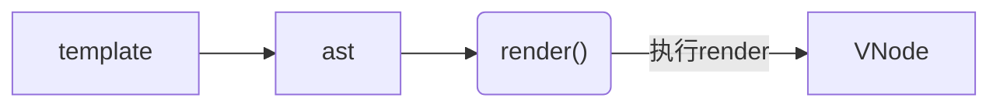

### 通过 VNode描述真实 DOM,可以渲染出页面中真实的 DOM

VNode 是通过组件的 render 函数创建出来的，我们平时在开发中，一般都是使用 template 字符串描述页面内容，这个模板字符串会被 Vue 的编译器编译成 render 函数(用于描述组件渲染内容的是 render 函数)，`在Vue的运行时，render函数会转化成vnode。`
* 1. 跨平台
* 2. 数据驱动视图提升开发效率
* 对于频繁通过JavaScript操作DOM的场景，VNode性能更优，因为它会等收集到足够的改变时，再将这些变化一次性应用到真实的DOM上。
```
频繁的去操作dom，会导致页面卡顿，性能差，如何去减少dom操作是性能优化的一个关键点。
```
* 组件挂载和更新和vnode的关系,diff算法提升效率

## 组件挂载和更新和vnode的关系
### 组件第一次渲染时
首先需要通过组件的 render 函数结合当前的状态生成 vnode，然后通过 vnode 创建出对应的真实DOM 节点，最后把创建出来的DOM节点输出到页面中。

### 当组件中的状态发生了变化时
组件便会重新渲染，使用组件的 render 函数结合最新的状态生成最新的 vnode，注意，这一次 Vue 不会直接使用新的 vnode 生成 DOM 节点输出到页面上，而是将本次生成的最新的 vnode 和上一次渲染使用的 vnode 进行比较（diff 算法）;

计算出哪些节点需要更新，然后到页面中去更新需要更新的节点，其他无需更新的节点则不需要做任何操作。通过这种方式，每次组件重新渲染的时候，都可以保证对真实 DOM 最小的操作量，以此来提高性能。

## 第一步createApp()-->ensureRenderer()
开发调用的是运行时包中的构建函数createApp开始:
### 1.创建app实例，并返回该实例
### 2.重写mount方法
调用 ensureRenderer().createApp(...args) 创建一个 app 实例，然后重写 mount 方法挂载，返回这个实例

流程：
1. 执行 createApp 首先会创建渲染器，这里要注意的是存在2种渲染器类型，并且它们都是通过延迟创建的，主要目的是当用户只引用reactive响应式框架的时候，方便进行tree-shaking优化。且两种渲染器都是基于 baseCreateRender 方法来实现。

2. baseCreateRender 函数执行后会返回 render 渲染函数和 createApp 方法，其中 render 函数是组件创建、更新和卸载的主要核心逻辑实现。createApp则用于创建应用实例，进行应用实例的初始化。

3. createAppAPI用于生成默认的应用上下文 context，这里定义了应用实例具备的属性和方法，并通过重写扩展 context.app 属性，让用户能够进行对上下文的自定义操作，比如自定义组件、指令、mixin、插件安装等一系列操作。并存在mount方法完成将根组件转为虚拟节点 vNode，并通过render 函数完成对 vNode 的渲染。

ensureRenderer 是一个单例模式的函数，会返回一个 renderer，如果无 renderer 则会调用createRenderer 进行获取 renderer ，获得了一个 app 实例。

## 第二步：ensureRenderer()-->baseCreateRenderer(),这个函数非常长，定义了很多函数
baseCreateRenderer包含了组件渲染的核心逻辑,主要实现了：
* 实现了组件渲染的创建、更新、卸载等核心逻辑
* 返回渲染函数，以及创建应用实例方法，当然还有 hydrate
```
ensureRenderer函数返回包含render、createApp和hydrate三个函数的单例对象，其中hydrate水合函数与ssr有关，createApp需要使用到render、createApp。所以在解析render之前，我们先简单看下createAppAPI。
```

```js
const createApp = ((...args) => {
  console.log('%c运行时==>createApp：', 'color:yellow', ...args)
  const app = ensureRenderer().createApp(...args);
}

const render = ((...args) => {
  console.log('运行时==>render调用ensureRenderer().render(...args)')
  ensureRenderer().render(...args);
});

function ensureRenderer() {
  return (renderer ||
    (renderer = createRenderer(rendererOptions)));
}

function createRenderer(options) {
  return baseCreateRenderer(options);
}
```

### 2-1. 下面展示了baseCreateRenderer定义的函数:patch render
* 结尾return createAppAPI(render, hydrate)

组件挂载和更新的逻辑都写在渲染器中 patch

会根据 VNode 类型的不同使用不同的函数进行处理，如果当前的 VNode 表示的是组件的话，则会使用 processComponent 函数进行处理

```
见：
## 第一步. patch 阶段: render()-->patch()
```

```js
function baseCreateRenderer(options, createHydrationFns) {
  console.log('运行时==>baseCreateRenderer：', options, createHydrationFns)
  const { insert: hostInsert, remove: hostRemove, patchProp: hostPatchProp, createElement: hostCreateElement, createText: hostCreateText, createComment: hostCreateComment, setText: hostSetText, setElementText: hostSetElementText, parentNode: hostParentNode, nextSibling: hostNextSibling, setScopeId: hostSetScopeId = NOOP, insertStaticContent: hostInsertStaticContent } = options;
  // Note: functions inside this closure should use `const xxx = () => {}`
  // style in order to prevent being inlined by minifiers.
  const patch = (n1, n2, container, anchor = null, parentComponent = null, parentSuspense = null, isSVG = false, slotScopeIds = null, optimized = isHmrUpdating ? false : !!n2.dynamicChildren) => {
    /*
    n1,旧节点
    n2,新节点
    container,DOM容器，vNode渲染成dom会挂载到该节点下 
    */

    // 新旧节点是同一个对象，直接返回
    if (n1 === n2) {
      console.log(`%c运行时==>patch：新旧节点是同一个对象，直接返回:`, 'color:red')
      return;
    }
    // patching & not same type, unmount old tree
    // 不是相同类型的节点，直接卸载旧节点
    if (n1 && !isSameVNodeType(n1, n2)) {
      anchor = getNextHostNode(n1);
      unmount(n1, parentComponent, parentSuspense, true);
      n1 = null;
    }

    // 被打过BAIL类型标记的节点退出优化模式。
    // 比如非编译器生成，而是手动编写的渲染函数，认为总是新的，无法进行优化
    if (n2.patchFlag === -2 /* PatchFlags.BAIL */) {
      optimized = false;
      n2.dynamicChildren = null;
    }

    const { type, ref, shapeFlag } = n2;

    console.log(`%c运行时==>patch：开启patch,n1为旧节点、n2为新节点:`, 'color:yellow')
    // 根据vNode类型，执行不同的算法
    switch (type) {
      case Text:
        console.log(`%c运行时==>patch处理文本节点:`, 'color:red')
        processText(n1, n2, container, anchor);
        break;
      case Comment:
        console.log(`%c运行时==>patch处理注释节点:`, 'color:red')
        processCommentNode(n1, n2, container, anchor);
        break;
      case Static:
        console.log(`%c运行时==>patch处理静态节点:`, 'color:red')
        if (n1 == null) {
          mountStaticNode(n2, container, anchor, isSVG);
        }
        else {
          patchStaticNode(n1, n2, container, isSVG);
        }
        break;
      case Fragment:
        console.log(`%c运行时==>patch处理Fragment元素:`, 'color:red')
        processFragment(n1, n2, container, anchor, parentComponent, parentSuspense, isSVG, slotScopeIds, optimized);
        break;
      default:
        if (shapeFlag & 1 /* ShapeFlags.ELEMENT */) {
          console.log(`%c运行时==>patch-->较为重点的1:ELEMENT类型:调用processElement处理DOM元素:`, 'color:red')
          processElement(n1, n2, container, anchor, parentComponent, parentSuspense, isSVG, slotScopeIds, optimized);
        }
        else if (shapeFlag & 6 /* ShapeFlags.COMPONENT */) {
          console.log(`%c运行时==>patch-->较为重点的2:COMPONENT:调用processComponent处理组件元素:`, 'color:red')
          processComponent(n1, n2, container, anchor, parentComponent, parentSuspense, isSVG, slotScopeIds, optimized);
        }
        else if (shapeFlag & 64 /* ShapeFlags.TELEPORT */) {
          console.log(`%c运行时==>patch处理TELEPORT:`, 'color:red')
          type.process(n1, n2, container, anchor, parentComponent, parentSuspense, isSVG, slotScopeIds, optimized, internals);
        }
        else if (shapeFlag & 128 /* ShapeFlags.SUSPENSE */) {
          console.log(`%c运行时==>patch处理SUSPENSE:`, 'color:red')
          type.process(n1, n2, container, anchor, parentComponent, parentSuspense, isSVG, slotScopeIds, optimized, internals);
        }
        else {
          warn$1('Invalid VNode type:', type, `(${typeof type})`);
        }
    }
    // set ref
    if (ref != null && parentComponent) {
      setRef(ref, n1 && n1.ref, parentSuspense, n2 || n1, !n2);
    }
  };
  const render = (vnode, container, isSVG) => {
    if (vnode == null) {
      // 没有传入新的虚拟节点，当存在旧虚拟节点，则卸载旧虚拟节点
      if (container._vnode) {
        console.log('%crender:-->虚拟节点不存在，则销毁', 'color:red', '')
        unmount(container._vnode, null, null, true);
      }
    }
    else {
      // 创建、或者更新节点，创建的时候这里container._vnode是不存在的
      // 第一个参数: 旧的虚拟节点
      // 第二个参数：新的vnode
      // 第三个参数：vnode转化为dom，最终要挂载的dom容器
      console.log('%crender:-->存在新虚拟节点，则执行patch算法，比较新旧虚拟节点,虚拟节点存在，创建或更新', 'color:red')
      patch(container._vnode || null, vnode, container, null, null, null, isSVG);
    }
    flushPreFlushCbs();
    flushPostFlushCbs();
    // 缓存虚拟节点数据，作为已完成渲染的标识,容器指向新的虚拟的节点
    container._vnode = vnode;
  };
  const internals = {
    p: patch,
    um: unmount,
    m: move,
    r: remove,
    mt: mountComponent,
    mc: mountChildren,
    pc: patchChildren,
    pbc: patchBlockChildren,
    n: getNextHostNode,
    o: options
  };
  let hydrate;
  let hydrateNode;
  if (createHydrationFns) {
    [hydrate, hydrateNode] = createHydrationFns(internals);
  }

  console.log('运行时==>baseCreateRenderer调用createAppAPI：')

  return {
    render,
    hydrate,
    createApp: createAppAPI(render, hydrate)
  };
}
```

### 2-2. 下面展示了baseCreateRenderer定义的函数:processElement
```js
function baseCreateRenderer(options, createHydrationFns) {
  const processElement = (n1, n2, container, anchor, parentComponent, parentSuspense, isSVG, slotScopeIds, optimized) => {
    isSVG = isSVG || n2.type === 'svg';
    if (n1 == null) {
      console.log('%cpatch之processElement1:挂载dom元素的过程，调用mountElement', 'color:magenta')
      mountElement(n2, container, anchor, parentComponent, parentSuspense, isSVG, slotScopeIds, optimized);
    }
    else {
      console.log('%cpatch之processElement2:更新dom元素的过程，调用patchElement', 'color:magenta')
      patchElement(n1, n2, parentComponent, parentSuspense, isSVG, slotScopeIds, optimized);
    }
  };
}
```

### 2-3. 下面展示了baseCreateRenderer定义的函数:mountElement
```js
function baseCreateRenderer(options, createHydrationFns) {
  const mountElement = (vnode, container, anchor, parentComponent, parentSuspense, isSVG, slotScopeIds, optimized) => {
    let el;
    let vnodeHook;
    const { type, props, shapeFlag, transition, dirs } = vnode;

    el = vnode.el = hostCreateElement(vnode.type, isSVG, props && props.is, props);
    console.log('%c挂载dom元素mountElement调用hostCreateElement创建新元素', 'color:magenta', el)
    // mount children first, since some props may rely on child content
    // being already rendered, e.g. `<select value>`
    if (shapeFlag & 8 /* ShapeFlags.TEXT_CHILDREN */) {
      console.log('挂载dom元素mountElement:处理子节点是文本内容的情况')
      hostSetElementText(el, vnode.children);
    }
    else if (shapeFlag & 16 /* ShapeFlags.ARRAY_CHILDREN */) {
      console.log('挂载dom元素mountElement:处理子节点是数组的情况')
      mountChildren(vnode.children, el, null, parentComponent, parentSuspense, isSVG && type !== 'foreignObject', slotScopeIds, optimized);
    }
    if (dirs) {
      invokeDirectiveHook(vnode, null, parentComponent, 'created');
    }
    // props
    if (props) {
      console.log('挂载dom元素mountElement:当前元素el处理属性相关，如style/class/event等')
      for (const key in props) {
        if (key !== 'value' && !isReservedProp(key)) {
          hostPatchProp(el, key, null, props[key], isSVG, vnode.children, parentComponent, parentSuspense, unmountChildren);
        }
      }
      /**
       * Special case for setting value on DOM elements:
       * - it can be order-sensitive (e.g. should be set *after* min/max, #2325, #4024)
       * - it needs to be forced (#1471)
       * #2353 proposes adding another renderer option to configure this, but
       * the properties affects are so finite it is worth special casing it
       * here to reduce the complexity. (Special casing it also should not
       * affect non-DOM renderers)
       */
      if ('value' in props) {
        hostPatchProp(el, 'value', null, props.value);
      }
      if ((vnodeHook = props.onVnodeBeforeMount)) {
        console.log('挂载dom元素mountElement:处理节点挂载前的钩子函数')
        invokeVNodeHook(vnodeHook, parentComponent, vnode);
      }
    }
    // scopeId
    setScopeId(el, vnode, vnode.scopeId, slotScopeIds, parentComponent);
    {
      Object.defineProperty(el, '__vnode', {
        value: vnode,
        enumerable: false
      });
      Object.defineProperty(el, '__vueParentComponent', {
        value: parentComponent,
        enumerable: false
      });
    }
    if (dirs) {
      invokeDirectiveHook(vnode, null, parentComponent, 'beforeMount');
    }
    // #1583 For inside suspense + suspense not resolved case, enter hook should call when suspense resolved
    // #1689 For inside suspense + suspense resolved case, just call it
    const needCallTransitionHooks = (!parentSuspense || (parentSuspense && !parentSuspense.pendingBranch)) &&
      transition &&
      !transition.persisted;
    if (needCallTransitionHooks) {
      transition.beforeEnter(el);
    }

    console.log('%c挂载dom元素end==>mountElement调用hostInsert把元素挂载到容器上', 'color:magenta')
    hostInsert(el, container, anchor);
    if ((vnodeHook = props && props.onVnodeMounted) ||
      needCallTransitionHooks ||
      dirs) {
      queuePostRenderEffect(() => {
        vnodeHook && invokeVNodeHook(vnodeHook, parentComponent, vnode);
        needCallTransitionHooks && transition.enter(el);
        dirs && invokeDirectiveHook(vnode, null, parentComponent, 'mounted');
      }, parentSuspense);
    }
  };
}
```

### 2-4. 下面展示了baseCreateRenderer定义的函数:processComponent
```js
function baseCreateRenderer(options, createHydrationFns) {
  const processComponent = (n1, n2, container, anchor, parentComponent, parentSuspense, isSVG, slotScopeIds, optimized) => {
    n2.slotScopeIds = slotScopeIds;
    if (n1 == null) {
      if (n2.shapeFlag & 512 /* ShapeFlags.COMPONENT_KEPT_ALIVE */) {
        parentComponent.ctx.activate(n2, container, anchor, isSVG, optimized);
      }
      else {
        console.log(`%cpath之processComponent:1调用mountComponent:`, 'color:magenta')
        mountComponent(n2, container, anchor, parentComponent, parentSuspense, isSVG, optimized);
      }
    }
    else {
      console.log(`%cpath之processComponent:2调用updateComponent:`, 'color:magenta')
      updateComponent(n1, n2, optimized);
    }
  };
}
```

### 2-5. 下面展示了baseCreateRenderer定义的函数:mountComponent
```js
function baseCreateRenderer(options, createHydrationFns) {
    const mountComponent = (initialVNode, container, anchor, parentComponent, parentSuspense, isSVG, optimized) => {
      const instance = (initialVNode.component = createComponentInstance(initialVNode, parentComponent, parentSuspense));
      console.log(`%c组件挂载：mountComponent:1调用createComponentInstance创建组件实例:`, 'color:magenta', instance)
      if (instance.type.__hmrId) {
        registerHMR(instance);
      }
      {
        pushWarningContext(initialVNode);
        startMeasure(instance, `mount`);
      }
      // inject renderer internals for keepAlive
      // 将keepAlive注入渲染器内部
      if (isKeepAlive(initialVNode)) {
        instance.ctx.renderer = internals;
      }
      // resolve props and slots for setup context
      {
        {
          startMeasure(instance, `init`);
        }

        console.log(`%c组件挂载：mountComponent:2调用setupComponent设置组件实例:`, 'color:magenta')
        console.log('test:定义在data的响应式start==>mountComponent调用setupComponent')
        setupComponent(instance);
        {
          endMeasure(instance, `init`);
        }
      }
      // setup() is async. This component relies on async logic to be resolved
      // before proceeding
      if (instance.asyncDep) {
        parentSuspense && parentSuspense.registerDep(instance, setupRenderEffect);
        // Give it a placeholder if this is not hydration
        // TODO handle self-defined fallback
        if (!initialVNode.el) {
          const placeholder = (instance.subTree = createVNode(Comment));
          processCommentNode(null, placeholder, container, anchor);
        }
        return;
      }
      console.log(`%c组件挂载：==end mountComponent:3调用setupRenderEffect 执行带副作用的渲染函数setupRenderEffect:`, 'color:magenta')
      setupRenderEffect(instance, initialVNode, container, anchor, parentSuspense, isSVG, optimized);
      {
        popWarningContext();
        endMeasure(instance, `mount`);
      }
    };
}
```

### 2-6. 下面展示了baseCreateRenderer定义的函数:setupRenderEffect
```js
function baseCreateRenderer(options, createHydrationFns) {
  const setupRenderEffect = (instance, initialVNode, container, anchor, parentSuspense, isSVG, optimized) => {
    const componentUpdateFn = () => {
      console.log('effect.run==>:调用componentUpdateFn组件的初始挂载和更新')
      if (!instance.isMounted) {
        console.log('effect.run==>:componentUpdateFn之Mounte')
        let vnodeHook;
        const { el, props } = initialVNode;
        const { bm, m, parent } = instance;
        const isAsyncWrapperVNode = isAsyncWrapper(initialVNode);
        toggleRecurse(instance, false);
        // beforeMount hook
        if (bm) {
          console.log('effect.run==>:生命周期beforeMount')
          invokeArrayFns(bm);
        }
        // onVnodeBeforeMount
        if (!isAsyncWrapperVNode &&
          (vnodeHook = props && props.onVnodeBeforeMount)) {
          console.log('effect.run==>:生命周期onVnodeBeforeMount')
          invokeVNodeHook(vnodeHook, parent, initialVNode);
        }
        toggleRecurse(instance, true);
        if (el && hydrateNode) {
          // vnode has adopted host node - perform hydration instead of mount.
          const hydrateSubTree = () => {
            {
              startMeasure(instance, `render`);
            }
            console.log("effect.run==>:setupRenderEffect:1组件实例生成子树vnode")
            instance.subTree = renderComponentRoot(instance);
            {
              endMeasure(instance, `render`);
            }
            {
              startMeasure(instance, `hydrate`);
            }
            hydrateNode(el, instance.subTree, instance, parentSuspense, null);
            {
              endMeasure(instance, `hydrate`);
            }
          };
          if (isAsyncWrapperVNode) {
            initialVNode.type.__asyncLoader().then(
              // note: we are moving the render call into an async callback,
              // which means it won't track dependencies - but it's ok because
              // a server-rendered async wrapper is already in resolved state
              // and it will never need to change.
              () => !instance.isUnmounted && hydrateSubTree());
          }
          else {
            hydrateSubTree();
          }
        }
        else {
          {
            startMeasure(instance, `render`);
          }
          console.log('$ceffect.run==>执行renderComponentRoot，获取组件当前的 VNode,render会读取组件的响应式数据，这会触发依赖收集', 'color:chartreuse')
          const subTree = (instance.subTree = renderComponentRoot(instance));
          {
            endMeasure(instance, `render`);
          }
          {
            startMeasure(instance, `patch`);
          }
          console.log("effect.run==>调用patch进行组件内容的渲染,把子树挂载到container上")
          patch(null, subTree, container, anchor, instance, parentSuspense, isSVG);
          {
            endMeasure(instance, `patch`);
          }
          initialVNode.el = subTree.el;
        }
        // mounted hook
        if (m) {
          console.log('effect.run==>:生命周期mounted')
          queuePostRenderEffect(m, parentSuspense);
        }
        // onVnodeMounted
        if (!isAsyncWrapperVNode &&
          (vnodeHook = props && props.onVnodeMounted)) {
          const scopedInitialVNode = initialVNode;
          queuePostRenderEffect(() => invokeVNodeHook(vnodeHook, parent, scopedInitialVNode), parentSuspense);
        }
        // activated hook for keep-alive roots.
        // #1742 activated hook must be accessed after first render
        // since the hook may be injected by a child keep-alive
        if (initialVNode.shapeFlag & 256 /* ShapeFlags.COMPONENT_SHOULD_KEEP_ALIVE */ ||
          (parent &&
            isAsyncWrapper(parent.vnode) &&
            parent.vnode.shapeFlag & 256 /* ShapeFlags.COMPONENT_SHOULD_KEEP_ALIVE */)) {
          instance.a && queuePostRenderEffect(instance.a, parentSuspense);
        }
        console.log("%ceffect.run==>将组件实例的 isMounted 属性设为 true，表明当前的组件已经完成了挂载操作", 'color:red')
        instance.isMounted = true;
        {
          devtoolsComponentAdded(instance);
        }
        // #2458: deference mount-only object parameters to prevent memleaks
        initialVNode = container = anchor = null;
      }
      else {
        console.log('effect.run==>:componentUpdateFn之updateComponent')
        // updateComponent
        // This is triggered by mutation of component's own state (next: null)
        // OR parent calling processComponent (next: VNode)
        let { next, bu, u, parent, vnode } = instance;
        let originNext = next;
        let vnodeHook;
        {
          pushWarningContext(next || instance.vnode);
        }
        // Disallow component effect recursion during pre-lifecycle hooks.
        toggleRecurse(instance, false);
        if (next) {
          next.el = vnode.el;
          updateComponentPreRender(instance, next, optimized);
        }
        else {
          next = vnode;
        }
        // beforeUpdate hook
        if (bu) {
          console.log('effect.run==>:生命周期beforeUpdate')
          invokeArrayFns(bu);
        }
        // onVnodeBeforeUpdate
        if ((vnodeHook = next.props && next.props.onVnodeBeforeUpdate)) {
          invokeVNodeHook(vnodeHook, parent, next, vnode);
        }
        toggleRecurse(instance, true);
        // render
        {
          startMeasure(instance, `render`);
        }
        console.log('$ceffect.run==>执行renderComponentRoot，获取组件最新的 VNode,render会读取组件的响应式数据，这会触发依赖收集', 'color:chartreuse')
        const nextTree = renderComponentRoot(instance);
        {
          endMeasure(instance, `render`);
        }
        // 获取组件上次渲染的 VNode
        const prevTree = instance.subTree;
        instance.subTree = nextTree;
        {
          startMeasure(instance, `patch`);
        }
        console.log('effect.run==>:componentUpdateFn之updateComponent调用patch 函数进行组件的更新')
        patch(prevTree, nextTree,
          // parent may have changed if it's in a teleport
          hostParentNode(prevTree.el),
          // anchor may have changed if it's in a fragment
          getNextHostNode(prevTree), instance, parentSuspense, isSVG);
        {
          endMeasure(instance, `patch`);
        }
        next.el = nextTree.el;
        if (originNext === null) {
          // self-triggered update. In case of HOC, update parent component
          // vnode el. HOC is indicated by parent instance's subTree pointing
          // to child component's vnode
          updateHOCHostEl(instance, nextTree.el);
        }
        // updated hook
        if (u) {
          console.log('effect.run==>:生命周期updated')
          queuePostRenderEffect(u, parentSuspense);
        }
        // onVnodeUpdated
        if ((vnodeHook = next.props && next.props.onVnodeUpdated)) {
          console.log('effect.run==>:生命周期onVnodeUpdated')
          queuePostRenderEffect(() => invokeVNodeHook(vnodeHook, parent, next, vnode), parentSuspense);
        }
        {
          devtoolsComponentUpdated(instance);
        }
        {
          popWarningContext();
        }
      }
    };
    // create reactive effect for rendering
    console.log('依赖收集==>setupRenderEffect:3调用ReactiveEffect 创建一个副作用:', { componentUpdateFn })
    const effect = (instance.effect = new ReactiveEffect(componentUpdateFn, () => queueJob(update), instance.scope // track it in component's effect scope
    ));
    console.log('依赖收集==>a,关键：调用effect.run()为了触发一下依赖收集')
    const update = (instance.update = () => effect.run());
    update.id = instance.uid;
    // allowRecurse
    // #1801, #2043 component render effects should allow recursive updates
    toggleRecurse(instance, true);
    {
      effect.onTrack = instance.rtc
        ? e => invokeArrayFns(instance.rtc, e)
        : void 0;
      effect.onTrigger = instance.rtg
        ? e => invokeArrayFns(instance.rtg, e)
        : void 0;
      update.ownerInstance = instance;
    }
    update();
  };
}
```

## 第三步. baseCreateRenderer return {render,createApp:createAppAPI(render, hydrate)}调用createAppAPI(render, hydrate){return app}
`创建实例:createAppAPI() 调用了mount() render()`
1. 创建定义一个实例上下文context，包含属性和方法

2. 重写扩展context.app方法，实现用户可以对上下文相关属性的自定义操作，也就是应用实例暴露的api实现，比如自定义指令、混入mixin、组件等提供用户自定义实现。

3. 根据根组件和属性在 mount 方法中完成虚拟节点 vNode 的转换，并通过 render 完成渲染，关于渲染函数在 baseCreateRender 已经说过。

### 3-1. createAppAPI的重点的是mount挂载函数,在挂载时期主要做了三件事：
1. 基于createApp的参数创建虚拟节点。
2. 基于虚拟节点和容器元素进行进行渲染。
3. 最后返回虚拟节点component属性的代理对象，主要使根实例可以取得所有属性成员，比如refs等，顾不具体讲解。
```js
function createAppAPI(render, hydrate) {
  return function createApp(rootComponent, rootProps = null) {
    if (!isFunction(rootComponent)) {
      rootComponent = Object.assign({}, rootComponent);
    }
    // ...
    ...
    // ...
    directive(name, directive) {
      {
        validateDirectiveName(name);
      }
      if (!directive) {
        return context.directives[name];
      }
      if (context.directives[name]) {
        warn$1(`Directive "${name}" has already been registered in target app.`);
      }
      context.directives[name] = directive;
      return app;
    },
    mount(rootContainer, isHydrate, isSVG) {
      // 未挂载执行
      if (!isMounted) {
        // #5571
        if (rootContainer.__vue_app__) {
          warn$1(`There is already an app instance mounted on the host container.\n` +
            ` If you want to mount another app on the same host container,` +
            ` you need to unmount the previous app by calling \`app.unmount()\` first.`);
        }
        // 根据根组件创建虚拟节点
        console.log('%c运行时==>createAppAPI--未挂载执行,创建根虚拟节点,mount中调用createVNode:根据根组件创建虚拟节点：', 'color:yellow')
        const vnode = createVNode(rootComponent, rootProps);
        console.log('%c运行时==>createAppAPI--未挂载执行,根据根组件创建虚拟节点vnode结果：', 'color:yellow', vnode)
        // store app context on the root VNode.
        // this will be set on the root instance on initial mount.
        // 将app的上下文存储在根虚拟节点
        vnode.appContext = context;
        // HMR root reload
        {
          context.reload = () => {
            render(cloneVNode(vnode), rootContainer, isSVG);
          };
        }
        // 水合或者渲染虚拟节点
        if (isHydrate && hydrate) {
          hydrate(vnode, rootContainer);
        }
        else {
          console.log('%c运行时==>createAppAPI--mount中调用render:渲染虚拟节点：', 'color:red')
          render(vnode, rootContainer, isSVG);
        }
        // 设置isMounted,设置app容器
        isMounted = true;
        app._container = rootContainer;
        rootContainer.__vue_app__ = app;
        {
          app._instance = vnode.component;
          devtoolsInitApp(app, version);
        }
        return getExposeProxy(vnode.component) || vnode.component.proxy;
      }
      else {
        warn$1(`App has already been mounted.\n` +
          `If you want to remount the same app, move your app creation logic ` +
          `into a factory function and create fresh app instances for each ` +
          `mount - e.g. \`const createMyApp = () => createApp(App)\``);
      }
    },

    // ... 
    ...
    // ... 
    return app;
  };
}
```

### 3-2. mount() -->createVNode()
type 属性用于描述 VNode 的类型，VNode 的类型有很多种，这里我们看下 string 和 Component 类型，当 VNode 的 type 属性是字符串的时候，说明当前的 VNode 描述的是普通的元素，当 VNode 的 type 是 Component 的时候，说明当前的 VNode 描述的是一个组件。

在创建虚拟节点时，会进行一些类型检查、正规化、克隆、块树节点追踪、兼容Vue2等操作。最后只是单纯地返回了一个虚拟节点对象。总结，createVNode做了如下几件事：
1. 对属性props标准化
2. 将VNode类型信息进行编码为位图
3. 创建VNode对象
4. 对子节点进行标准化
```js
const createVNode = (createVNodeWithArgsTransform);

const createVNodeWithArgsTransform = (...args) => {
  return _createVNode(...(vnodeArgsTransformer
    ? vnodeArgsTransformer(args, currentRenderingInstance)
    : args));
};

function _createVNode(type, props = null, children = null, patchFlag = 0, dynamicProps = null, isBlockNode = false) {
  if (!type || type === NULL_DYNAMIC_COMPONENT) {
    if (!type) {
      warn$1(`Invalid vnode type when creating vnode: ${type}.`);
    }
    type = Comment;
    console.log('%cvnode-构建:a-->不传type，默认Comment类型的虚拟节点', 'color:green', type)
  }
  console.log('%cvnode-构建:a-->', 'color:green', type)
  if (isVNode(type)) {
    // createVNode receiving an existing vnode. This happens in cases like
    // <component :is="vnode"/>
    // #2078 make sure to merge refs during the clone instead of overwriting it
    const cloned = cloneVNode(type, props, true /* mergeRef: true */);
    if (children) {
      normalizeChildren(cloned, children);
    }
    if (isBlockTreeEnabled > 0 && !isBlockNode && currentBlock) {
      if (cloned.shapeFlag & 6 /* ShapeFlags.COMPONENT */) {
        currentBlock[currentBlock.indexOf(type)] = cloned;
      }
      else {
        currentBlock.push(cloned);
      }
    }
    cloned.patchFlag |= -2 /* PatchFlags.BAIL */;
    console.log('%ccvnode-构建:a-->已经是虚拟节点，则克隆一个，返回:', 'color:green', type)
    return cloned;
  }
  // class component normalization.
  if (isClassComponent(type)) {
    type = type.__vccOpts;
  }
  // class & style normalization.
  if (props) {
    console.log('%ccvnode-构建:a-->style和class标准化：', 'color:green', type)
    // for reactive or proxy objects, we need to clone it to enable mutation.
    props = guardReactiveProps(props);
    let { class: klass, style } = props;
    if (klass && !isString(klass)) {
      props.class = normalizeClass(klass);
    }
    if (isObject(style)) {
      // reactive state objects need to be cloned since they are likely to be
      // mutated
      if (isProxy(style) && !isArray(style)) {
        style = extend({}, style);
      }
      props.style = normalizeStyle(style);
    }
  }
  // encode the vnode type information into a bitmap
  // 将vnode类型信息编码为位图
  const shapeFlag = isString(type)
    ? 1 /* ShapeFlags.ELEMENT */
    : isSuspense(type)
      ? 128 /* ShapeFlags.SUSPENSE */
      : isTeleport(type)
        ? 64 /* ShapeFlags.TELEPORT */
        : isObject(type)
          ? 4 /* ShapeFlags.STATEFUL_COMPONENT */
          : isFunction(type)
            ? 2 /* ShapeFlags.FUNCTIONAL_COMPONENT */
            : 0;
  if (shapeFlag & 4 /* ShapeFlags.STATEFUL_COMPONENT */ && isProxy(type)) {
    type = toRaw(type);
    warn$1(`Vue received a Component which was made a reactive object. This can ` +
      `lead to unnecessary performance overhead, and should be avoided by ` +
      `marking the component with \`markRaw\` or using \`shallowRef\` ` +
      `instead of \`ref\`.`, `\nComponent that was made reactive: `, type);
  }
  // 创建虚拟节点
  return createBaseVNode(type, props, children, patchFlag, dynamicProps, shapeFlag, isBlockNode, true);
}
```

### 3-3. `_createVNode()`-->createBaseVNode()
```js
function createBaseVNode(type, props = null, children = null, patchFlag = 0, dynamicProps = null, shapeFlag = type === Fragment ? 0 : 1 /* ShapeFlags.ELEMENT */, isBlockNode = false, needFullChildrenNormalization = false) {
  const vnode = {
    __v_isVNode: true,
    __v_skip: true,
    type, // 传入的组件对象
    props, // 传递给组件对象的参数
    key: props && normalizeKey(props), // 取出所有传入的key
    ref: props && normalizeRef(props), // 对props进行ref正规化
    scopeId: currentScopeId, // 现在的作用域id 
    slotScopeIds: null,
    children, // 子节点
    component: null,
    suspense: null,
    ssContent: null,
    ssFallback: null,
    dirs: null,
    transition: null,
    el: null,
    anchor: null,
    target: null,
    targetAnchor: null,
    staticCount: 0,
    shapeFlag, // 虚拟节点类型标记
    patchFlag, // patch算法标记
    dynamicProps, // 动态Props
    dynamicChildren: null,
    appContext: null,
    ctx: currentRenderingInstance
  };
  if (needFullChildrenNormalization) {
    // 标准化子节点，把不同数据类型的 children 转成数组或者文本类型
    normalizeChildren(vnode, children);
    // normalize suspense children
    if (shapeFlag & 128 /* ShapeFlags.SUSPENSE */) {
      type.normalize(vnode);
    }
  }
  else if (children) {
    // compiled element vnode - if children is passed, only possible types are
    // string or Array.
    vnode.shapeFlag |= isString(children)
      ? 8 /* ShapeFlags.TEXT_CHILDREN */
      : 16 /* ShapeFlags.ARRAY_CHILDREN */;
  }
  // validate key
  if (vnode.key !== vnode.key) {
    warn$1(`VNode created with invalid key (NaN). VNode type:`, vnode.type);
  }
  // track vnode for block tree
  if (isBlockTreeEnabled > 0 &&
    // avoid a block node from tracking itself
    !isBlockNode &&
    // has current parent block
    currentBlock &&
    // presence of a patch flag indicates this node needs patching on updates.
    // component nodes also should always be patched, because even if the
    // component doesn't need to update, it needs to persist the instance on to
    // the next vnode so that it can be properly unmounted later.
    (vnode.patchFlag > 0 || shapeFlag & 6 /* ShapeFlags.COMPONENT */) &&
    // the EVENTS flag is only for hydration and if it is the only flag, the
    // vnode should not be considered dynamic due to handler caching.
    vnode.patchFlag !== 32 /* PatchFlags.HYDRATE_EVENTS */) {
    currentBlock.push(vnode);
  }

  console.log('%cvnode-构建:b-->createBaseVNode返回值', 'color:green', { type, vnode })
  return vnode;
}
```

## 第四步. 额外重点renderComponentRoot 执行构建出来的render() 生成vnode


```
1. effect.run()内部调用componentUpdateFn组件的初始挂载和更新

2. 调用renderComponentRoot
```

renderComponentRoot函数，传参为instance对象

renderComponentRoot函数内部首先通过render!.call(proxyToUse, ...)方法执行instance.render函数(本文开头已经展示了依本例模版解析后的render函数)，传参是proxyToUse(就是withProxy对象)和renderCache(空数组[])下面详细解析render函数的执行过程:
```
具体函数见
### 例子2:生成由AST生成的code转化的render函数
```

参考：https://juejin.cn/post/7006988485949128741
1. 整个函数体都在with(_ctx){}中，如果对with的用法不熟悉，可以了解下。简单来说就是在with花括号里面的属性不需要指定命名空间，会自动指向_ctx对象；with(Proxy){key}会触发Proxy代理的has钩子函数(_ctx对象就是withProxy对象，本文上面提到了withProxy就是instance.ctx对象通过Proxy代理后的对象)
2. const { ... } = _Vue对_Vue对象进行结构，首先会触发_ctx的has钩子函数(因为ctx上并没有_Vue属性，这里就忽略，后续再详细解析has钩子函数)。回顾到之前解析完成的render String开头部分，定义const _Vue = Vue，也就是_Vue就是全局的Vue对象。那解构出来的一系列方法就是全局的Vue暴露的方法(toDisplayString, createVNode, createTextVNode, Fragment, openBlock, createBlock)

```js
function renderComponentRoot(instance) {
  const { type: Component, vnode, proxy, withProxy, props, propsOptions: [propsOptions], slots, attrs, emit, render, renderCache, data, setupState, ctx, inheritAttrs } = instance;
  let result;
  let fallthroughAttrs;
  const prev = setCurrentRenderingInstance(instance);
  {
    accessedAttrs = false;
  }
  try {
    if (vnode.shapeFlag & 4 /* ShapeFlags.STATEFUL_COMPONENT */) {
      // withProxy is a proxy with a different `has` trap only for
      // runtime-compiled render functions using `with` block.
      const proxyToUse = withProxy || proxy;
      console.log('vnode-构建:调用render函数', { test: render })
      result = normalizeVNode(render.call(proxyToUse, proxyToUse, renderCache, props, setupState, data, ctx));
      console.log('vnode-构建:调用render返回结果:', { test: result })
      fallthroughAttrs = attrs;
    }

    // ...
    ...
    // ...
  }

  // ...
  ...
  // ...
}
```


3. 后续执行render函数中return的内容。首先是执行openBlock函数(无参数)
```js
// openBlock函数内部给全局的currentBlock变量赋值空数组[]，然后将这个变量push到另一个全局的空数组blockStack中，即blockStack=[[]]，后续创建VNode会使用这个全局数组
function openBlock(disableTracking = false) {
  blockStack.push((currentBlock = disableTracking ? null : []));
}
```
3. 解析动态数据(依赖收集至全局targetMap对象)
然后执行createBlock方法，其中第三个参数是数组，数组的第一项是createTextVNode函数的返回值，执行createTextVNode函数时参数有两个，第一个参数是toDisplayString方法的执行结果，参数是message。这里因为with(_ctx){message}会触发has钩子函数，看下has钩子函数的具体内部实现
```
判断属性名称key值不是以'_'开头的，并且不是特定的一些字符串，类似Object、Boolean等(具体可以去看下isGloballyWhitelisted方法的内部实现)，此时key值为message，所以has为true

之后获取messgae的值，_ctx.message会触发get钩子函数，先判断属性名是否等于Symbol.unscopables，此时key值为message，所以执行PublicInstanceProxyHandlers的get方法。一起看下PublicInstanceProxyHandlers内部get方法的具体实现
```

```js
const PublicInstanceProxyHandlers = {
  get({ _: instance }, key) {
    const { ctx, setupState, data, props, accessCache, type, appContext } = instance;
    // for internal formatters to know that this is a Vue instance
    if (key === '__isVue') {
      return true;
    }
    // data / props / ctx
    // This getter gets called for every property access on the render context
    // during render and is a major hotspot. The most expensive part of this
    // is the multiple hasOwn() calls. It's much faster to do a simple property
    // access on a plain object, so we use an accessCache object (with null
    // prototype) to memoize what access type a key corresponds to.
    let normalizedProps;
    if (key[0] !== '$') {
      const n = accessCache[key];
      if (n !== undefined) {
        switch (n) {
          case 1 /* AccessTypes.SETUP */:
            return setupState[key];
          case 2 /* AccessTypes.DATA */:
            return data[key];
          case 4 /* AccessTypes.CONTEXT */:
            return ctx[key];
          case 3 /* AccessTypes.PROPS */:
            return props[key];
          // default: just fallthrough
        }
      }
      else if (hasSetupBinding(setupState, key)) {
        accessCache[key] = 1 /* AccessTypes.SETUP */;
        return setupState[key];
      }
      else if (data !== EMPTY_OBJ && hasOwn(data, key)) {
        accessCache[key] = 2 /* AccessTypes.DATA */;
        return data[key];
      }
      else if (
        // only cache other properties when instance has declared (thus stable)
        // props
        (normalizedProps = instance.propsOptions[0]) &&
        hasOwn(normalizedProps, key)) {
        accessCache[key] = 3 /* AccessTypes.PROPS */;
        return props[key];
      }
      else if (ctx !== EMPTY_OBJ && hasOwn(ctx, key)) {
        accessCache[key] = 4 /* AccessTypes.CONTEXT */;
        return ctx[key];
      }
      else if (shouldCacheAccess) {
        accessCache[key] = 0 /* AccessTypes.OTHER */;
      }
    }
    const publicGetter = publicPropertiesMap[key];
    let cssModule, globalProperties;
    // public $xxx properties
    if (publicGetter) {
      if (key === '$attrs') {
        track(instance, "get" /* TrackOpTypes.GET */, key);
        markAttrsAccessed();
      }
      return publicGetter(instance);
    }
    else if (
      // css module (injected by vue-loader)
      (cssModule = type.__cssModules) &&
      (cssModule = cssModule[key])) {
      return cssModule;
    }
    else if (ctx !== EMPTY_OBJ && hasOwn(ctx, key)) {
      // user may set custom properties to `this` that start with `$`
      accessCache[key] = 4 /* AccessTypes.CONTEXT */;
      return ctx[key];
    }
    else if (
      // global properties
      ((globalProperties = appContext.config.globalProperties),
        hasOwn(globalProperties, key))) {
      {
        return globalProperties[key];
      }
    }
    else if (currentRenderingInstance &&
      (!isString(key) ||
        // #1091 avoid internal isRef/isVNode checks on component instance leading
        // to infinite warning loop
        key.indexOf('__v') !== 0)) {
      if (data !== EMPTY_OBJ && isReservedPrefix(key[0]) && hasOwn(data, key)) {
        warn$1(`Property ${JSON.stringify(key)} must be accessed via $data because it starts with a reserved ` +
          `character ("$" or "_") and is not proxied on the render context.`);
      }
      else if (instance === currentRenderingInstance) {
        warn$1(`Property ${JSON.stringify(key)} was accessed during render ` +
          `but is not defined on instance.`);
      }
    }
  },
  set({ _: instance }, key, value) {
    const { data, setupState, ctx } = instance;
    if (hasSetupBinding(setupState, key)) {
      setupState[key] = value;
      return true;
    }
    else if (setupState.__isScriptSetup &&
      hasOwn(setupState, key)) {
      warn$1(`Cannot mutate <script setup> binding "${key}" from Options API.`);
      return false;
    }
    else if (data !== EMPTY_OBJ && hasOwn(data, key)) {
      data[key] = value;
      return true;
    }
    else if (hasOwn(instance.props, key)) {
      warn$1(`Attempting to mutate prop "${key}". Props are readonly.`);
      return false;
    }
    if (key[0] === '$' && key.slice(1) in instance) {
      warn$1(`Attempting to mutate public property "${key}". ` +
        `Properties starting with $ are reserved and readonly.`);
      return false;
    }
    else {
      if (key in instance.appContext.config.globalProperties) {
        Object.defineProperty(ctx, key, {
          enumerable: true,
          configurable: true,
          value
        });
      }
      else {
        ctx[key] = value;
      }
    }
    return true;
  },
  has({ _: { data, setupState, accessCache, ctx, appContext, propsOptions } }, key) {
    let normalizedProps;
    return (!!accessCache[key] ||
      (data !== EMPTY_OBJ && hasOwn(data, key)) ||
      hasSetupBinding(setupState, key) ||
      ((normalizedProps = propsOptions[0]) && hasOwn(normalizedProps, key)) ||
      hasOwn(ctx, key) ||
      hasOwn(publicPropertiesMap, key) ||
      hasOwn(appContext.config.globalProperties, key));
  },
  defineProperty(target, key, descriptor) {
    if (descriptor.get != null) {
      // invalidate key cache of a getter based property #5417
      target._.accessCache[key] = 0;
    }
    else if (hasOwn(descriptor, 'value')) {
      this.set(target, key, descriptor.value, null);
    }
    return Reflect.defineProperty(target, key, descriptor);
  }
};
{
  PublicInstanceProxyHandlers.ownKeys = (target) => {
    warn$1(`Avoid app logic that relies on enumerating keys on a component instance. ` +
      `The keys will be empty in production mode to avoid performance overhead.`);
    return Reflect.ownKeys(target);
  };
}
const RuntimeCompiledPublicInstanceProxyHandlers = /*#__PURE__*/ extend({}, PublicInstanceProxyHandlers, {
  get(target, key) {
    // fast path for unscopables when using `with` block
    if (key === Symbol.unscopables) {
      return;
    }
    return PublicInstanceProxyHandlers.get(target, key, target);
  },
  has(_, key) {
    const has = key[0] !== '_' && !isGloballyWhitelisted(key);
    if (!has && PublicInstanceProxyHandlers.has(_, key)) {
      warn$1(`Property ${JSON.stringify(key)} should not start with _ which is a reserved prefix for Vue internals.`);
    }
    return has;
  }
});
```


```
首先会对target对象进行结构，获取'_'属性的值，target就是_ctx对象，本文前面提到了_ctx是instance.ctx的Proxy代理对象(关于instance.ctx对象上的_属性的值，在文章二"双向数据绑定"中提到了instance对象的创建，并新增_属性值为instance)。回归到get钩子函数中，判断属性名key(message)不是以'$'开头的，并且不存在于instance的accessCache缓存对象中，再判断instance.setupState属性不是空对象，并且message存在于setupState对象中(在文章三"双向数据绑定"中提到instance.setupState就是setup函数执行完成之后返回的结果再通过Proxy代理的对象)。本例中setupState不是空对象并且message也是此对象的属性，所以设置accessCache[message] = 0，最终返回setupState[message]的值。

因为setupState对象是setup函数返回值的Proxy对象，所以执行setupState[message]时会触发get钩子函数
```

首先通过Reflect方法获取setupState.message的值(文章三"双向数据绑定"中解析了message属性值是调用ref方法返回的RefImpl实例对象)。然后调用unref方法，判断入参的__v_isRef属性是否为true，本例中message符合，所以返回ref.value(message.value)。因为message是RefImpl的实例对象，所以获取属性时会触发get钩子函数

钩子函数内部先调用track函数收集依赖，函数内部先判断，targetMap(WeakMap对象)全局对象中是否存在target属性(初始化挂载是不存在的)，若不存在则执行targetMap.set(target, (depsMap = new Map()))，设置key=target，value=new Map()(空的Map对象)，然后获取depsMap(Map对象)中key=message的属性值，因为depsMap是新建的空Map对象，所以也不存在message属性，固执行depsMap.set(key, (dep = new Set()))，设置key=message，value=new Set()(空的Set对象)。因为dep是空的Set对象，所以往dep对象中新增activeEffect全局变量(本文上述解析过activeEffect就是reactiveEffect函数)，然后在reactiveEffect方法的deps数组中添加dep对象(Set对象)。后续在修改message的值之后触发set钩子函数时会执行依赖，更新DOM

5. createTextVNode创建文本vnode对象
回归到render函数中，根据一系列的Proxy代理得到message="测试数据"(以本例为模版解析)，开始执行toDisplayString('测试数据')

toDisplayString函数最终返回String(val)就是'测试数据'
```js
const toDisplayString = (val) => {
  return isString(val)
    ? val
    : val == null
      ? ''
      : isArray(val) ||
        (isObject(val) &&
          (val.toString === objectToString || !isFunction(val.toString)))
        ? JSON.stringify(val, replacer, 2)
        : String(val);
};
```

6. 接着开始执行createTextVNode函数，参数为"测试数据" 和 1

createTextVNode函数内部调用createVNode方法，参数为Symbol('Text')、null、'测试数据 '、1，在文章二"数据双向绑定"中已经简单解析了createVNode方法的作用，主要是生成一个VNode对象，在初始化执行app.mount时会使用，初始化执行时type是调用createApp传入的参数。现在是用来生成一个文本节点，看下createVNode内部的具体实现

首先根据type类型给shapeFlag赋值，因为type是Symbol('Text')，所以shapeFlag=0


创建vnode对象，其中patchFlag属性值为1


接着调用normalizeChildren函数，此函数主要是用来处理节点的children属性

```js
export function createTextVNode(text: string = ' ', flag: number = 0): VNode {
  return createVNode(Text, null, text, flag)
}
```

```js
export function normalizeChildren(vnode: VNode, children: unknown) {
  let type = 0
  const { shapeFlag } = vnode
  if (children == null) {}
  else if (isArray(children)) {}
  else if (typeof children === 'object') {}
  else if (isFunction(children)) {}
  else {
    children = String(children)
    // force teleport children to array so it can be moved around
    if (shapeFlag & ShapeFlags.TELEPORT) {
      type = ShapeFlags.ARRAY_CHILDREN
      children = [createTextVNode(children as string)]
    } else {
      type = ShapeFlags.TEXT_CHILDREN // 8
    } 
  }
  vnode.children = children as VNodeNormalizedChildren
  vnode.shapeFlag |= type
}
```

createVNode创建元素vnode对象

回归到render方法中，执行完文本节点之后开始执行元素节点(button节点，直接调用createVNode方法)，参数为"button", { onClick: modifyMessage }, '修改数据', 8。

7. 回归到render方法中，执行完文本节点之后开始执行元素节点(button节点，直接调用createVNode方法)，参数为"button", { onClick: modifyMessage }, '修改数据', 8。
```
根据type是字符串类型，所以shapeFlag赋值为1


创建vnode对象，赋值props属性为{ onClick: modifyMessage }，patchFlag为8


调用normalizeChildren处理children属性，此元素节点的children也是字符串，所以vnode.children='修改数据'，vnode.shapeFlag = 1 | 8 = 9，最后将vnode对象存入currentBlock数组中并返回vnode对象
```

createBlock创建根vnode对象
 
8. 回归到render函数中，当中括号的两个方法(createTextVNode、createVNode)执行完成后，最后执行createBlock方法生成根vnode对象

在createBlock内部首先是调用createVNode方法创建vnode节点，参数是Symbol('Fragment')、null、[文本vnode对象, 元素vnode对象]、64、true
```
createVNode方法中首先根据type是Symbol类型，shapeFlag赋值为0。创建vnode对象，patchFlag值为64


执行normalizeChildren函数，处理children属性时，因为children是数组，所以vnode.shapeFlag = 0 | 16 = 16


因为传入的isBlockNode=true，所以不会执行currentBlock.push(vnode)，最后返回vnode对象
```

```js
function createBlock(type, props, children, patchFlag, dynamicProps) {
  return setupBlock(createVNode(type, props, children, patchFlag, dynamicProps, true /* isBlock: prevent a block from tracking itself */));
}

export function closeBlock() {
  blockStack.pop()
  currentBlock = blockStack[blockStack.length - 1] || null
}
```

回归到createBlock函数中，将vnode.dynamicChildren属性赋值为currentBlock数组(数组中包含文本vnode对象 和 元素vnode对象两个元素，也就是vnode.children)。然后执行closeBlock

该方法内将blockStack数组中的最后一项移除。由本文上述解析可知，blockStack数组中只有一个元素，就是currentBlock数组，然后将currentBlock赋值为null。最后createBlock方法返回vnode对象，type为Symbol('Fragment')，children数组包含两个vnode对象，是type为Symbol('Text')的文本 和 type为'button'的元素。至此render函数的解析已经完全结束了。

### 总结
解析render函数的执行过程，首先解析动态数据message时触发get钩子函数，调用track方法进行依赖的收集(activeEffect变量收集到全局的targetMap对象中)；然后调用createTextVNode方法构建文本vnode对象；调用createVNode方法构建button元素的vnode对象；最后调用createBlock方法构建根vnode对象。后续将详细解析patch方法利用生成的vnode对象构建出真正的DOM元素