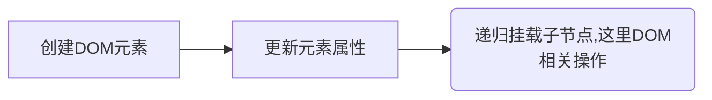
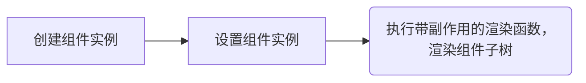

## 执行渲染逻辑
前面分析，创建虚拟节点VNode后，现在执行渲染逻辑。

* 若创建的VNode为null，则组件执行卸载，否则执行创建或者更新流程。

挂载元素的流程：


挂载组件的流程:


render函数可以说是vue重点中的重点，根据传参决定是否销毁、还是创建或者更新组件。

因为vue的patch算法便是在这里执行，通过patch比较新旧虚拟节点的不同，有针对性的更新相关dom节点。

从源码可以看出，当新旧虚拟节点不同，会先卸载旧节点。
`查看：2-1. 下面展示了baseCreateRenderer定义的函数:patch render`
```js
function baseCreateRenderer(options, createHydrationFns) {
    const render = (vnode, container, isSVG) => {
      ...
    }
}
```

## 第一步. patch 阶段: render()-->patch()
在 patch 阶段，vNode存在八种不同的类型，会根据不同的 VNode 类型来执行不同的操作挂载DOM，或者更新DOM。

patch 的过程中主要完成以下几件事情：
* 创建需要新增的节点
* 移除已经废弃的节点
* 移动或修改需要更新的节点

1. 当新旧节点为同一个节点时，直接退出patch。
2. 当新旧节点不是同一个类型时直接卸载旧节点，isSameVNodeType的代码很简单，就只是n1.type === n2.type && n1.key === n2.key，即除了类型以外，还要判断key是否相同。
3. 当新节点被打上BAIL标记，则退出优化模式。
4. 根据节点的不同类型，执行不同的处理算法。

组件挂载和更新的逻辑都写在渲染器中 patch,patch会根据 VNode 类型的不同使用不同的函数进行处理，如果当前的 VNode 表示的是组件的话，则会使用 processComponent 函数进行处理
```js
function baseCreateRenderer(options, createHydrationFns) {
  const patch = (n1, n2, container, anchor = null, parentComponent = null, parentSuspense = null, isSVG = false, slotScopeIds = null, optimized = isHmrUpdating ? false : !!n2.dynamicChildren) => {
    ...
  }
}
```

## 第二步
较为重点的COMPONENT和ELEMENT类型,又由于COMPONENT是由ELEMENT组成的，根节点是COMPONENT，我们先从processComponent开始

会根据 VNode 类型的不同使用不同的函数进行处理，如果当前的 VNode 表示的是组件的话，则会使用 processComponent 函数进行处理

判断 oldVNode 是否存在，如果存在的话，则执行 updateComponent 函数进行组件的更新，如果不存在的话，则执行 mountComponent 函数进行组件的挂载，我们首先看组件的挂载。

### 2-1. 例子1：processComponent
processComponent较为简单，考虑三种情况进行处理:
* 组件激活
* 全新组件挂载
* 变更组件更新。

由于activate函数由keep-alive组件定义，非patch算法的关键，在此不对组件缓存激活进行剖析。因此我们从组件首次挂载的情况开始。
1. 创建组件实例
2. 设置组件实例
3. 执行带副作用的渲染函数

从源码可以处理如下：
1. effect创建了一个副作用渲染函数 componentEffect，当组件数据变化时，该函数会重新执行一次。
2. 渲染组件生成子树subTree，并把子树挂载到
3. 将子树的根节点保存到当前节点
4. 整个组件挂载过程，执行了一些钩子函数，如beforeMount、Mount，以及 keep-alive 的处理。

```js
function baseCreateRenderer(options, createHydrationFns) {
  const processComponent = (n1, n2, container, anchor, parentComponent, parentSuspense, isSVG, slotScopeIds, optimized) => {
    ...
  }

  const mountComponent = (initialVNode, container, anchor, parentComponent, parentSuspense, isSVG, optimized) => {
    ...
  }
}
```

### 2-2. 例子1.组件的挂载:mountComponent
在mountComponent，首先创建组件的实例，每渲染一次组件，就会创建一个对应的实例，组件实例就是一个对象，这个对象维护着组件运行过程中的所有信息，例如：注册的生命周期函数、组件上次渲染的 VNode，组件状态等等。一个组件实例的内容如下所示：
```js
const instance: ComponentInternalInstance = {
  uid: uid++,
  vnode,
  type,
  parent,
  appContext,
  root: null!, // to be immediately set
  next: null,
  subTree: null!, // will be set synchronously right after creation
  effect: null!,
  update: null!, // will be set synchronously right after creation
  scope: new EffectScope(true /* detached */),
  render: null,
  proxy: null,
  exposed: null,
  exposeProxy: null,
  withProxy: null,
  provides: parent ? parent.provides : Object.create(appContext.provides),
  accessCache: null!,
  renderCache: [],
 
  // local resolved assets
  components: null,
  directives: null,
 
  // resolved props and emits options
  propsOptions: normalizePropsOptions(type, appContext),
  emitsOptions: normalizeEmitsOptions(type, appContext),
 
  // emit
  emit: null!, // to be set immediately
  emitted: null,
 
  // props default value
  propsDefaults: EMPTY_OBJ,
 
  // inheritAttrs
  inheritAttrs: type.inheritAttrs,
 
  // state
  ctx: EMPTY_OBJ,
  data: EMPTY_OBJ,
  props: EMPTY_OBJ,
  attrs: EMPTY_OBJ,
  slots: EMPTY_OBJ,
  refs: EMPTY_OBJ,
  setupState: EMPTY_OBJ,
  setupContext: null,
 
  // suspense related
  suspense,
  suspenseId: suspense ? suspense.pendingId : 0,
  asyncDep: null,
  asyncResolved: false,
 
  // lifecycle hooks
  // not using enums here because it results in computed properties
  isMounted: false,
  isUnmounted: false,
  isDeactivated: false,
  bc: null,
  c: null,
  bm: null,
  m: null,
  bu: null,
  u: null,
  um: null,
  bum: null,
  da: null,
  a: null,
  rtg: null,
  rtc: null,
  ec: null,
  sp: null
}
```

上面的对象包含着很多的状态信息，是实现组件化一个很重要的内容。

创建完组件实例后，Vue 使用 setupComponent 函数进行一些数据的解析和初始化，调用的 setupRenderEffect 函数是重点。

### 2-3. 例子1.组件的更新
当后续 render 函数依赖的响应式数据发生变化的时候，会再次触发执行 componentUpdateFn 函数进行组件的重新渲染

### 2-4. 组件生命周期的实现原理和setup()
主要分为两部分，
* 生命周期的注册以及
* 生命周期的执行。
```
生命周期函数触发的代码在 setupRenderEffect 函数中
```

首先说生命周期的注册，这里以 setup 函数中进行的生命周期注册为例。

在 setupStatefulComponent 函数中，获取用户编写的 setup 函数，执行它并获取 setup 函数的返回值 setupResult。

setup 函数只会在组件挂载的时候执行一次，setup 函数既可以返回一个对象，也可以返回一个函数，如果返回的是一个对象的话，这个对象中的数据可以像 data 和 props 一样使用，如果返回的是一个函数的话，这个函数会被当成组件的 render 函数。

setup 函数中执行 onMounted 等生命周期注册函数时，Vue 会将我们想要注册的生命周期函数保存到组件实例中，组件实例用于保存生命周期函数的属性如下所示：
```js
const instance: ComponentInternalInstance = {
  // lifecycle hooks
  bc: null,
  c: null,
  bm: null,
  m: null,
  bu: null,
  u: null,
  um: null,
  bum: null,
  da: null,
  a: null,
  rtg: null,
  rtc: null,
  ec: null,
  sp: null
}
```

接下来看生命周期注册函数的内容，以 onMounted 函数为例：
```js
export const onMounted = createHook(LifecycleHooks.MOUNTED)
 
export const createHook =
  <T extends Function = () => any>(lifecycle: LifecycleHooks) =>
  (hook: T, target: ComponentInternalInstance | null = currentInstance) =>
    // post-create lifecycle registrations are noops during SSR (except for serverPrefetch)
    (!isInSSRComponentSetup || lifecycle === LifecycleHooks.SERVER_PREFETCH) &&
    injectHook(lifecycle, hook, target)
 
export function injectHook(
  type: LifecycleHooks,
  hook: Function & { __weh?: Function },
  target: ComponentInternalInstance | null = currentInstance,
  prepend: boolean = false
): Function | undefined {
  if (target) {
    const hooks = target[type] || (target[type] = [])
    const wrappedHook =
      hook.__weh ||
      (hook.__weh = (...args: unknown[]) => {
        if (target.isUnmounted) {
          return
        }
        // disable tracking inside all lifecycle hooks
        // since they can potentially be called inside effects.
        pauseTracking()
        // Set currentInstance during hook invocation.
        // This assumes the hook does not synchronously trigger other hooks, which
        // can only be false when the user does something really funky.
        setCurrentInstance(target)
        const res = callWithAsyncErrorHandling(hook, target, type, args)
        unsetCurrentInstance()
        resetTracking()
        return res
      })
    if (prepend) {
      hooks.unshift(wrappedHook)
    } else {
      hooks.push(wrappedHook)
    }
    return wrappedHook
  }
}
```

### 2-4. 例子2：处理组件和DOM元素为例:mountElement
看挂载元素的过程，下面看看 mountElement 方法,整个过程如下：

1. 创建DOM元素，如果 vNode.el 非空且为静态虚拟节点，则直接克隆一个。
2. 先挂载元素子节点，因为当前节点可能依赖子节点的属性。如果子节点是文本节点，则直接设置节点内容；如果节点是数组，则遍历子节点，递归执行patch操作。相关代码，可自行查看。
3. 属性存在，则处理元素的相关属性。
4. 挂载元素到容器 container 上。

```js
function baseCreateRenderer(options, createHydrationFns) {
  const processElement = (n1, n2, container, anchor, parentComponent, parentSuspense, isSVG, slotScopeIds, optimized) => {
    ...
  }

  const mountElement = (vnode, container, anchor, parentComponent, parentSuspense, isSVG, slotScopeIds, optimized) => {
    ...
  }
}
```