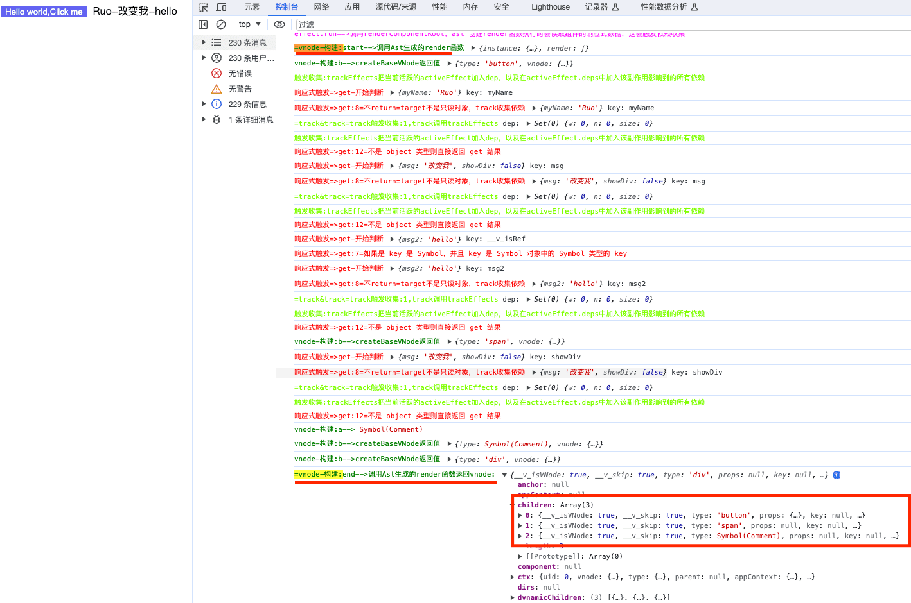

## 两个函数createVNode createBaseVNode,在创建vnode的贝调用
### createVNode 是用来创建虚拟节点的关键函数。这个函数的定义如下：

```js
const createVNodeWithArgsTransform = (...args) => {
  return _createVNode(
    ...(vnodeArgsTransformer
      ? vnodeArgsTransformer(args, currentRenderingInstance)
      : args)
  );
};

const createVNode = createVNodeWithArgsTransform;

function _createVNode(
  type,
  props = null,
  children = null,
  patchFlag = 0,
  dynamicProps = null,
  isBlockNode = false
) {
  if (!type || type === NULL_DYNAMIC_COMPONENT) {
    if (!type) {
      warn$1(`Invalid vnode type when creating vnode: ${type}.`);
    }
    type = Comment;
    console.log(
      "%cvnode-构建:a-->不传type，默认Comment类型的虚拟节点",
      "color:green",
      type
    );
  }

  // ..

  // 创建虚拟节点
  return createBaseVNode(type, props, children, patchFlag, dynamicProps, shapeFlag, isBlockNode, true);
}
```

> \_createVNode 是 Vue 3 内部实现的函数，用于创建虚拟节点（VNode）。虚拟节点是 Vue 中用于表示 DOM 元素或组件的对象，它们构成了虚拟 DOM 树的一部分，用于在数据变化时进行高效的 DOM 更新。
> 这是 \_createVNode 函数的签名：
> 以下是参数的含义：

- type: 虚拟节点的类型，可以是 HTML 标签名字符串（如 'div'），组件对象，或者特殊的类型如 Fragment、Portal 等。
- props: 虚拟节点的属性，包括元素的属性、指令、事件监听器等。
- children: 虚拟节点的子节点，可以是文本内容、其他虚拟节点、数组等。
- patchFlag: 一个标志，用于标记虚拟节点的更新策略，例如是否需要更新属性、子节点等。
- dynamicProps: 用于标记动态属性的数组。
- isBlockNode: 一个标志，用于标记是否是块节点（Block）。

在 Vue 3 源码中，\_createVNode 是一个内部函数，通常在编译器或 Vue 的核心代码中使用。它用于处理虚拟节点的创建和初始化，以便将它们用于渲染和更新 DOM。一般情况下，开发者不需要直接调用 \_createVNode，而是使用 Vue 提供的公开 API，如 createVNode 函数来创建虚拟节点。

### createBaseVNode建虚拟 DOM 树
createBaseVNode 函数的主要作用是根据传入的参数创建一个描述虚拟节点的 VNode 对象。这个对象会包含有关节点类型、属性、子节点等信息，以便 Vue 3 内部能够正确地渲染和更新页面。这是 Vue 3 渲染引擎的核心部分，负责构建虚拟 DOM 树和处理页面的渲染逻辑。
```js
exports.createElementVNode = createBaseVNode;

function createBaseVNode(
  type,
  props = null,
  children = null,
  patchFlag = 0,
  dynamicProps = null,
  shapeFlag = type === Fragment ? 0 : 1 /* ShapeFlags.ELEMENT */,
  isBlockNode = false,
  needFullChildrenNormalization = false
) {
  const vnode = {
    __v_isVNode: true,
    __v_skip: true,
    type, // 传入的组件对象
    props, // 传递给组件对象的参数
    key: props && normalizeKey(props), // 取出所有传入的key
    ref: props && normalizeRef(props), // 对props进行ref正规化
    scopeId: currentScopeId, // 现在的作用域id
    slotScopeIds: null,
    children, // 子节点
    component: null,
    suspense: null,
    ssContent: null,
    ssFallback: null,
    dirs: null,
    transition: null,
    el: null,
    anchor: null,
    target: null,
    targetAnchor: null,
    staticCount: 0,
    shapeFlag, // 虚拟节点类型标记
    patchFlag, // patch算法标记
    dynamicProps, // 动态Props
    dynamicChildren: null,
    appContext: null,
    ctx: currentRenderingInstance,
  };
  if (needFullChildrenNormalization) {
    // 标准化子节点，把不同数据类型的 children 转成数组或者文本类型
    normalizeChildren(vnode, children);
    // normalize suspense children
    if (shapeFlag & 128 /* ShapeFlags.SUSPENSE */) {
      type.normalize(vnode);
    }
  } else if (children) {
    // compiled element vnode - if children is passed, only possible types are
    // string or Array.
    vnode.shapeFlag |= isString(children)
      ? 8 /* ShapeFlags.TEXT_CHILDREN */
      : 16 /* ShapeFlags.ARRAY_CHILDREN */;
  }
  // validate key
  if (vnode.key !== vnode.key) {
    warn$1(`VNode created with invalid key (NaN). VNode type:`, vnode.type);
  }
  // track vnode for block tree
  if (
    isBlockTreeEnabled > 0 &&
    // avoid a block node from tracking itself
    !isBlockNode &&
    // has current parent block
    currentBlock &&
    // presence of a patch flag indicates this node needs patching on updates.
    // component nodes also should always be patched, because even if the
    // component doesn't need to update, it needs to persist the instance on to
    // the next vnode so that it can be properly unmounted later.
    (vnode.patchFlag > 0 || shapeFlag & 6) /* ShapeFlags.COMPONENT */ &&
    // the EVENTS flag is only for hydration and if it is the only flag, the
    // vnode should not be considered dynamic due to handler caching.
    vnode.patchFlag !== 32 /* PatchFlags.HYDRATE_EVENTS */
  ) {
    currentBlock.push(vnode);
  }

  console.log("%cvnode-构建:b-->createBaseVNode返回值", "color:green", {
    type,
    vnode,
  });
  return vnode;
}
```

## renderComponentRoot

```js
function renderComponentRoot(instance) {
  const { type: Component, vnode, proxy, withProxy, props, propsOptions: [propsOptions], slots, attrs, emit, render, renderCache, data, setupState, ctx, inheritAttrs } = instance;
  let result;
  let fallthroughAttrs;
  const prev = setCurrentRenderingInstance(instance);
  {
    accessedAttrs = false;
  }
  try {
    if (vnode.shapeFlag & 4 /* ShapeFlags.STATEFUL_COMPONENT */) {
      // withProxy is a proxy with a different `has` trap only for
      // runtime-compiled render functions using `with` block.
      const proxyToUse = withProxy || proxy;
      console.log('%c=vnode-构建:start-->调用Ast生成的render函数', 'color:green', { render, instance })

      result = normalizeVNode(render.call(proxyToUse, proxyToUse, renderCache, props, setupState, data, ctx));

      console.log('%c=vnode-构建:end-->调用Ast生成的render函数返回vnode:', 'color:green', result)
      fallthroughAttrs = attrs;
    }
    else {
      // ...
    }
  }
}
```


