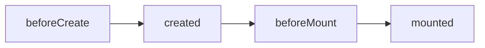
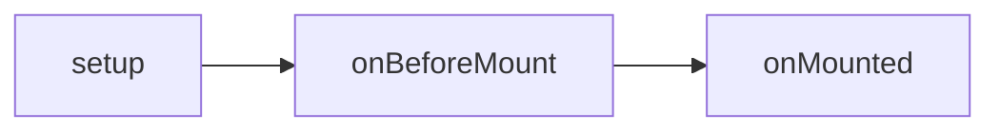

## 总结

- 性能提升 1：Vue.js 3 通过更好的模板编译器和优化算法，Vue3 编译器中增加了静态提升技术。
- 性能提升 2：Vue.js 3 的响应式系统进行了升级，现在支持 Proxy，可以更加精细地控制响应式数据。
>[理解reactive和effect](./理解reactive和effect)
[proxy-defineProperty区别](./proxy-defineProperty区别)

- 更好的 TypeScript 支持

- 更好的组合 API,Vue3 的设计模式给予开发者们按需引入需要使用的依赖包。这样一来就不需要多余的引用导致性能或者打包后太大的问题。
>全新的合成式 API（Composition API）可以提升代码的解耦程度 —— 特别是大型的前端应用，效果会更加明显。还有就是按需引用的有了更细微的可控性，让项目的性能和打包大小有更好的控制。

- Tree-shaking 优化：Vue3 中对于 Tree-shaking 做了优化，使得只有使用到的代码会被打包，减小应用程序的体积。

- Fragments（片段）：Vue3 中支持使用 Fragments（片段）来包裹多个子组件，而无需创建额外的包装器 div。只需要在 template 中使用`<template>`标签来包裹即可

```js
<template>
  <div>
    <h1>Hello World</h1>
    <template v-if="showSubTitle">
      <h2>Sub Title</h2>
    </template>
    <p>Some content here</p>
  </div>
</template>
```

- Teleport 组件：Vue3 中增加了 Teleport 组件，它可以让你将组件插入到 DOM 的任意位置，这对于模态框和弹出菜单等组件非常有用。<br/>
  Teleport 组件有两个属性：to 和 disabled。to 属性指定了 Teleport 组件的目标元素，可以是 CSS 选择器字符串、DOM 元素或一个返回 DOM 元素的函数。

```html
<template>
  <div>
    <button @click="showModal = true">Show Modal</button>
    <teleport to="body" v-if="showModal">
      <div class="modal">
        <h2>Modal Title</h2>
        <p>Modal Content</p>
        <button @click="showModal = false">Close Modal</button>
      </div>
    </teleport>
  </div>
</template>
```

## vue2 和 vue3 生命周期钩子
vue2:


vue3:


对比：vue3基本加了onXX
```js
beforeCreate()    <--> setup()
created()         <--> setup()
beforeMount()     <--> onBeforeMount()
mounted()         <--> onMounted()

// 界面还没更新 但是data里面的数据是最新的。即页面尚未和最新的data里面的数据包同步
beforeUpdate()    <--> onBeforeUpdate()
// 表示页面和data里面的数据已经保持同步了 都是最新的
updated()         <--> onUpdated()

// 当执行这个生命周期钩子的时候 vue的实例从运行阶段进入销毁阶段 此时实例身上的data 还有 methods处于可用的状态
beforeDestroy()   <--> onBeforeUnmount()
// 表示组件已经完全被销毁了 组件中所有的实例方法都是不能用了
destroyed()       <--> onUnmounted()
errorCaptured()   <--> onErrorCaptured()
```

vue3 完整钩子:

```js
onBeforeMount(() => {
  console.log("组件挂载前onBeforeMount");
});

onMounted(() => {
  console.log("组件挂载后onMounted");
});

onBeforeUpdate(() => {
  console.log("初次渲染不会执行:组件更新前onBeforeUpdate");
});

onUpdated(() => {
  console.log("初次渲染不会执行:组件更新后onUpdated");
});

onBeforeUnmount(() => {
  console.log("组件销毁前onBeforeUnmount");
});
onUnmounted(() => {
  console.log("组件销毁后onUnmounted");
});
```

### vue2:beforeCreate -> created:初始化 vue 实例，进行数据观测
created:
```
完成数据观测，属性与方法的运算，watch、event事件回调的配置

可调用methods中的方法，访问和修改data数据触发响应式渲染dom，可通过computed和watch完成数据计算

此时vm.$el 并没有被创建
```

- vue2 专有:beforeCreate()和 created()

```
1. 运行生命周期钩子函数 beforeCreate,在执行的时候，data还有methods都没有被初始化
2. 进入注入流程，处理属性，computed，methods，data，provide，inject，最后使用代理模式将这些属性挂载到实例中。
```

- vue3 专有:setup()，在组件被挂载之前被调用。创建的是 data 和 method

```
setup相当于组件编译的入口，setup在beforeCreate钩子执行前运行，此时只初始化了prop（属性）和context等，而data是在beforeCreate钩子之后created之前执行的。

注意：onMounted虽然写在setup函数中，但却是在组件挂载到父组件时才被调用的。

由于setup中不能使用this，因此需要使用getCurrentInstance 方法获得当前活跃的组件
```

### vue2-beforemount 在组件实例创建之前执行

此阶段 vm.el 已完成 DOM 初始化，但并未挂载在 el 选项上,组件的模板尚未渲染到 DOM 中。

作用:在渲染之前对组件进行必要的初始化工作。

- 组件挂载前 vue3:onBeforeMount()/vue2:beforeMount()
  updateComponent，该函数会运行 render 函数，并把 render 函数的返回结果 vnode 作为参数给

```
onBeforeMount()/beforeMount() 表示模板已经在内存中编辑完成了，但是尚未渲染到模板页面中。即页面中的元素，没有被真正的替换过来，只是之前写的一些模板字符串。
```

### vue2-mounted 在组件实例创建完成后立即执行

vm.el 已完成 DOM 的挂载与渲染, 此时组件的模板已经渲染到 DOM 中。

作用:在组件的渲染完成后对组件进行必要的初始化工作。

- 组件挂载后 vue3:onMounted()/ vue2:mounted()

```
表示内存中模板已经真实的挂载到页面中去了，用户可以看到渲染好的界面了
执行完这个函数表示 整个vue实例已经初始化完成了，组件脱离了创建阶段，进入运行阶段。
```

## 按需引用的有了更细微的可控性，让项目的性能和打包大小有更好的控制

## 接收 Props 不同,setup,this

接收组件 props 参数传递这一块为我们带来了 Vue2 和 Vue3 之间最大的区别。
—this 在 vue3 中与 vue2 代表着完全不一样的东西。

在 Vue2，this 代表的是当前组件，不是某一个特定的属性。所以我们可以直接使用 this 访问 prop 属性值。就比如下面的例子在挂载完成后打印处当前传入组件的参数 title。

```js
mounted () {
    console.log('title: ' + this.title)
}
```

但是在 Vue3 中，this 无法直接拿到 props 属性，emit events（触发事件）和组件内的其他属性。setup()方法可以接收两个参数：

1. props - 不可变的组件参数
2. context - Vue3 暴露出来的属性（emit，slots，attrs）

```js
<template>
  <div>{{ props.text }}</div>
</template>

<script>
import { defineComponent } from 'vue';

export default defineComponent({
  props: {
    text: { type: String, required: true },
    listSubProject: {
      type: Array,
      default: () => [],
    },
    isPm: {
      type: Boolean,
      default: false,
    },
  },
  setup(props) {
    // do something with `props.text` here
    onMounted(() => {
      console.log('title: ' + props.type)
    })
  }
})
</script>
```

## 事件-emit

在 Vue2 中自定义事件是非常直接的，但是在 Vue3 的话，我们会有更多的控制的自由度。
举例，现在我们想在点击提交按钮时触发一个 login 的事件。

### 在 Vue2 中我们会调用到`this.$emit`然后传入事件名和参数对象

```js
login () {
  this.$emit('login', {
    username: this.username,
    password: this.password
  })
}
```

### Vue3 中使用 emit

this 已经不是和 vue2 代表着这个组件了，所以我们需要不一样的自定义事件的方式

在 setup()中的第二个参数 content 对象中就有 emit，这个是和 this.$emit 是一样的。那么我们只要在 setup()接收第二个参数中使用分解对象法取出 emit 就可以在 setup 方法中随意使用了。

```js
setup (props, { emit }) {
    const login = () => {
      emit('login', {
        username: state.username,
        password: state.password
      })
    }
}
```

## keep-alive原理是什么?

使用 keep-alive 包裹动态组件时，会对组件进行缓存，避免组件重新创建

使用有两个场景，一个是动态组件，一个是 router-view

```
如果不需要缓存，直接返回虚拟节点。

如果需要缓存，就用组件的id和标签名，生成一个key，把当前vnode的instance作为value，存成一个对象。这就是缓存列表

如果设置了最大的缓存数，就删除第0个缓存。新增最新的缓存。

并且给组件添加一个keepAlive变量为true，当组件初始化的时候，不再初始化。
```

- include 使该标签作用于所有 name 属性的值跟此标签 include 的属性值一致的 vue 页面
- exclude 使该标签不作用于所有 name 属性的值跟此标签 exclude 的属性值一致的 vue 页面

### 注意：

- activated,deactivated 这两个生命周期函数一定是要在使用了 keep-alive 组件后才会有的，否则则不存在。
- exclude 不是用 route 的 name；而是组件的 name;

注意一定要给需要缓存的组件都写 name 属性的值。我一开始还以为是路由的 name 值，后来发现搞错了
当引入 keep-alive 的时候，页面第一次进入，钩子的触发顺序 created-> mounted-> activated，退出时触发 deactivated。
当再次进入（前进或者后退）时，只触发 activated。

```js
使用include/exclude 属性需要给所有vue类的name赋值（注意不是给route的name赋值），否则 include/exclude不生效。
export default {
 name:'a', // include 或 exclude所使用的name
 data () {
 return{
    }
  },
}
```

```html
<!-- 缓存name为a和b的组件 -->
<keep-alive include="a,b">
  <router-view />
</keep-alive>
```

### 实例：

```html
<keep-alive include="test-keep-alive">
  <!-- 将缓存name为test-keep-alive的组件 -->
  <component />
</keep-alive>

<keep-alive include="a,b">
  <!-- 将缓存name为a或者b的组件，结合动态组件使用 -->
  <component :is="view" />
</keep-alive>

<!-- 使用正则表达式，需使用v-bind -->
<keep-alive :include="/a|b/">
  <component :is="view" />
</keep-alive>

<!-- 动态判断 -->
<keep-alive :include="includedComponents">
  <router-view></router-view>
</keep-alive>

<keep-alive exclude="test-keep-alive">
  <!-- 将不缓存name为test-keep-alive的组件 -->
  <component />
</keep-alive>
```

## Vue.use 是干什么的?

Vue.use 是用来使用插件的。我们可以在插件中扩展全局组件、指令、原型方法等。 会调用 install 方法将 Vue 的构建函数默认传入，在插件中可以使用 vue，无需依赖 vue 库


增加 name 属性，会在 components 属性中增加组件本身，实现组件的递归调用。

可以表示组件的具体名称，方便调试和查找对应的组件。

## 如何理解自定义指令?

在生成 ast 语法树时，遇到指令会给当前元素添加 directives 属性

通过 genDirectives 生成指令代码

在 patch 前，将指令的钩子提取到 cbs 中，在 patch 过程中调用对应的钩子

当执行 cbs 对应的钩子时，调用对应指令定义方法
