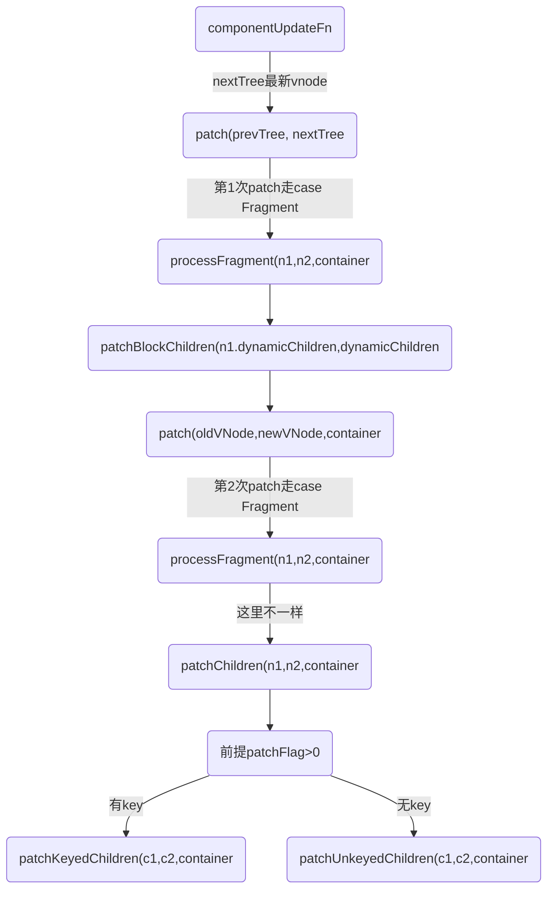

## 通过 key 管理状态
总结：添加key以后，vue会通过key来执行diff算法匹配新旧结点，计算出结点最大的复用，效率更高。

key给 Vue 一个提示，以便它可以跟踪每个节点的标识，从而重用和重新排序现有的元素;Vue 默认按照“就地更新”的策略来更新通过 v-for 渲染的元素列表。

### 有key无key的区别
* 每个循环渲染的元素都有一个唯一的key属性，这有助于Vue跟踪每个元素的身份。当数据列表发生变化时，Vue将会尽力将旧的元素与新的元素进行匹配，而不是重新创建和销毁元素。这意味着，如果您对数据列表进行了重新排序或更新，Vue会尽量保持元素的身份不变，从而提高性能。

* 在没有key的情况下，Vue将无法区分列表中的各个元素，因此在更新时，Vue将会销毁旧的元素并创建新的元素。这可能会导致性能下降，尤其是在大型列表的情况下，因为每次更新都需要重新渲染整个列表。

* 用index做key
>不稳定：如果数据列表的顺序发生变化，索引作为key的元素可能会出现不稳定的行为，可能导致性能问题或UI问题。
不适合有删除操作：如果您的列表中存在删除操作，使用索引作为key可能导致不正确的元素被删除。

## 相关函数
* 有key-->patchKeyedChildren
* 无key-->patchUnkeyedChildren

```html
<div id="root">
	<li v-for="item in list" :key="item.key">
		{{item.val}}{{item.key}}
	</li>
	<button v-on:click='onAdd' class="btn">Add</button>
	<button v-on:click='onChangeVal(0)' class="btn">Change</button>
</div>
<script>
Vue.createApp({
	data() {
		return {
			list: [
				{
					key: 1,
					val: 'li a',
					isShow: true
				},
			]
		}
	},
	methods: {
		onAdd() {
			console.log('=点击了按钮:', this.list)
			this.list.push({
				key: 4,
				val: 'li d',
				isShow: true
			})
		},
		onChangeVal(index) {
			console.log('=点击了按钮:', index)
			this.list[index].val = 'li zzz'
			this.list.push({
				key: 4,
				val: 'li d',
				isShow: true
			})
		}
	},
}).mount('#root')
</script>
```

## 更新流程:


```js
const processFragment = (n1, n2, container, anchor, parentComponent, parentSuspense, isSVG, slotScopeIds, optimized) => {
	// 省略..
	if (n1 == null) {
		// 初始化流程省略..
		mountChildren(n2.children, container, fragmentEndAnchor, parentComponent, parentSuspense, isSVG, slotScopeIds, optimized);
	}
	else {
		if (patchFlag > 0 &&
			patchFlag & 64 /* PatchFlags.STABLE_FRAGMENT */ &&
			dynamicChildren &&
			n1.dynamicChildren) {
			console.log('=processFragment调用patchBlockChildren=更新')
			patchBlockChildren(n1.dynamicChildren, dynamicChildren, container, parentComponent, parentSuspense, isSVG, slotScopeIds);
			if (parentComponent && parentComponent.type.__hmrId) {
				traverseStaticChildren(n1, n2);
			}
			else if (
				n2.key != null ||
				(parentComponent && n2 === parentComponent.subTree)) {
				traverseStaticChildren(n1, n2, true /* shallow */);
			}
		}
		else {
			patchChildren(n1, n2, container, fragmentEndAnchor, parentComponent, parentSuspense, isSVG, slotScopeIds, optimized);
		}
	}
}; 
```

## patchChildren执行有key和无key
```js
const patchChildren = (n1, n2, container, anchor, parentComponent, parentSuspense, isSVG, slotScopeIds, optimized = false) => {
		const c1 = n1 && n1.children;
		const prevShapeFlag = n1 ? n1.shapeFlag : 0;
		const c2 = n2.children;
		const { patchFlag, shapeFlag } = n2;
		// fast path
		if (patchFlag > 0) {
			if (patchFlag & 128 /* PatchFlags.KEYED_FRAGMENT */) {
				// this could be either fully-keyed or mixed (some keyed some not)
				// presence of patchFlag means children are guaranteed to be arrays
				console.log('=patchChildren调用1,有key->patchKeyedChildren',)
				patchKeyedChildren(c1, c2, container, anchor, parentComponent, parentSuspense, isSVG, slotScopeIds, optimized);
				return;
			}
			else if (patchFlag & 256 /* PatchFlags.UNKEYED_FRAGMENT */) {
				// unkeyed
				console.log('=patchChildren调用2,没key->patchUnkeyedChildren',)
				patchUnkeyedChildren(c1, c2, container, anchor, parentComponent, parentSuspense, isSVG, slotScopeIds, optimized);
				return;
			}
		}
		// children has 3 possibilities: text, array or no children.
		if (shapeFlag & 8 /* ShapeFlags.TEXT_CHILDREN */) {
			// text children fast path
			if (prevShapeFlag & 16 /* ShapeFlags.ARRAY_CHILDREN */) {
				unmountChildren(c1, parentComponent, parentSuspense);
			}
			if (c2 !== c1) {
				hostSetElementText(container, c2);
			}
		}
		else {
			if (prevShapeFlag & 16 /* ShapeFlags.ARRAY_CHILDREN */) {
				// prev children was array
				if (shapeFlag & 16 /* ShapeFlags.ARRAY_CHILDREN */) {
					// two arrays, cannot assume anything, do full diff
					patchKeyedChildren(c1, c2, container, anchor, parentComponent, parentSuspense, isSVG, slotScopeIds, optimized);
				}
				else {
					// no new children, just unmount old
					unmountChildren(c1, parentComponent, parentSuspense, true);
				}
			}
			else {
				// prev children was text OR null
				// new children is array OR null
				if (prevShapeFlag & 8 /* ShapeFlags.TEXT_CHILDREN */) {
					hostSetElementText(container, '');
				}
				// mount new if array
				if (shapeFlag & 16 /* ShapeFlags.ARRAY_CHILDREN */) {
					console.log('mountChildren=2')
					mountChildren(c2, container, anchor, parentComponent, parentSuspense, isSVG, slotScopeIds, optimized);
				}
			}
		}
	};
```
