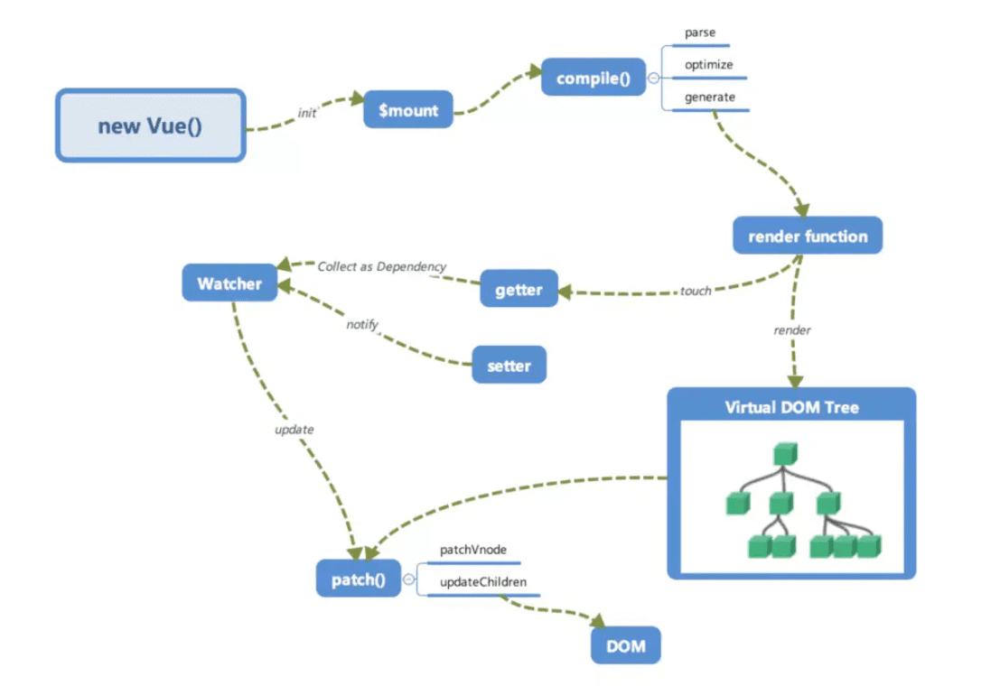

## vue渲染和更新方式
数据劫持结合发布者-订阅者模式的方式实现:数据-->视图的变化

通过过劫持可以精确响应更新,检测到data的改变就会重新渲染视图(vue 值会立刻改变，但是 DOM 是异步更新的)

创建 — 在组件创建时执行
挂载 — DOM 被挂载时执行
更新 — 当响应数据被修改时执行
销毁 — 在元素被销毁之前立即运行

##  实现数据的双向绑定4个步骤：
1. 实现一个监听器Observer，用来劫持并监听所有属性，如果有变动的，就通知订阅者。

在组件初始化时候Vue遍历data所有的属性，并使用defineProperty把这些属性全部转为getter/setter,实现了一个`监听器Observer`对所有属性进行劫持监听。如果属性发上变化了，执行`订阅者Watcher`;

2. 每一个`订阅者Watcher`都绑定一个更新函数，因为Watcher是有很多个，所以我们需要有一个`消息订阅器Dep`来专门收集这些订阅者，然后在`监听器Observer和`和`订阅者Watcher`之间进行统一管理的。，

3. watcher可以收到属性的变化通知并执行相应的函数，这里就涉及到`解析器Compile`从而更新视图。

6. `解析器Compile`，可以扫描和解析每个节点的相关指令（v-model，v-on等指令），如果节点存在v-model，v-on等指令，则解析器Compile初始化这类节点的模板数据，使之可以显示在视图上，然后将相关指令（如v-model，v-on）对应初始化成一个`订阅者Watcher`，并替换模板数据或者绑定相应的函数，此时当订阅者Watcher接收到相应属性的变化，执行updateComponent方法(异步),通过vm._render()更新vNode(新旧node对比),最后渲染到html中


```js
//observer:观察者
function observer(obj) {
	if (obj && typeof obj === 'object') {
		for (let key in obj) {
			if (!obj.hasOwnProperty(key)) break;
			defineReactive(obj, key, obj[key]);
		}
	}
}

function defineReactive(obj, key, value) {
	observer(value);
	Object.defineProperty(obj, key, {
		get() {
			return value;
		},
		set(newValue) {
			observer(newValue);
			if (value === newValue) return;
			value = newValue;
		}
	});
}

function $set(data, key, value) {
	defineReactive(data, key, value);
}
```