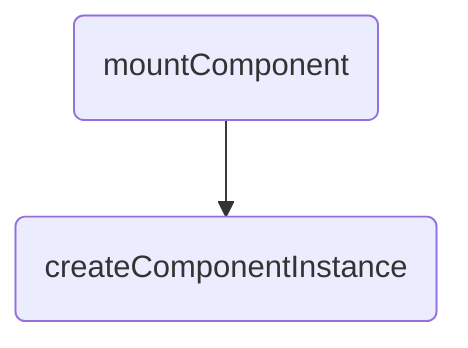

Vue3 的响应式系统使用了一种称为“依赖收集”的技术来追踪数据变化和更新视图。

在组件初始化时，Vue3 会分析模板中使用的响应式数据，并收集这些数据的依赖，建立响应式数据与组件实例之间的联系。

当响应式数据发生变化时，Vue3 会触发相应的更新函数，并通知所有依赖该数据的组件进行更新。具体来说，Vue3 会遍历该数据的所有依赖，找到与当前组件相关的依赖，并触发这些依赖对应的更新函数。

在虚拟 DOM 的更新过程中，会记录每个节点所属的组件实例，在渲染器更新视图时，只会更新与发生变化的组件相关的部分，而不是全部重新渲染。能够准确地知道哪个组件的哪些部分需要更新，并进行高效的局部更新，从而提高了应用的性能。这种局部更新的方式可以提高渲染效率，同时也能够避免不必要的 DOM 操作，从而减少浏览器的重排和重绘。

## 具体实现过程如下：
在 Vue3 中，通过使用 Proxy 对象来代理数据对象，当数据对象发生变化时，可以监听到变化并及时地更新视图。

1. 在创建组件实例时，会调用 setup 函数。在 setup 函数中，会通过 reactive 函数将传入的数据对象转换为响应式对象，并返回该响应式对象。

2. 在 reactive 函数内部，首先会创建一个空对象 target，然后通过 Proxy 构造函数创建一个 Proxy 对象，并将 target 对象作为第一个参数传入。Proxy 对象的第二个参数是一个处理器对象 handler。

3. 在 handler 对象中，可以定义一些拦截操作的函数，比如 get、set、deleteProperty 等。当对响应式对象进行读写等操作时，会触发相应的拦截函数。

4. 当读取响应式对象的属性时，会触发 get 拦截函数。在 get 函数中，会先获取原始值，`然后通过 track 函数收集该属性的依赖，最后返回原始值`。

5. 当设置响应式对象的属性时，会触发 set 拦截函数。`在 set 函数中，会先将新值保存起来，然后通过 trigger 函数通知所有依赖该属性的地方进行更新`。

6. 当删除响应式对象的属性时，会触发 deleteProperty 拦截函数。在 deleteProperty 函数中，会先删除该属性，然后通过 trigger 函数通知所有依赖该属性的地方进行更新。

## 收集是为了什么
收集依赖的主要目的是为了建立响应式数据与副作用函数之间的联系，以便在响应式数据变化时自动触发副作用函数的更新。
```
当我们在副作用函数中使用了响应式数据对象时，Vue3 会在访问响应式数据对象时自动收集依赖，并在该响应式数据对象发生变化时自动触发对应的副作用函数更新。
```

* 这种自动触发更新的机制，避免了手动进行数据更新的复杂性和重复性，提高了开发效率
* 除了自动触发更新外，收集依赖还可以优化渲染性能。Vue3 中使用了基于 Proxy 的响应式数据实现，该实现支持精确跟踪响应式数据对象的属性变化，只会在发生实际变化时触发更新，避免了不必要的重复渲染操作。

## 什么时候会创建组件dep？收集后的数据存在哪里？
组件的 Dep 实例是在组件实例化时创建的。当组件实例被创建时，会对其响应式数据对象进行初始化，并将其对应的 Dep 实例添加到组件实例的`deps`数组中。

每个组件都会有自己独立的 Dep 实例来存储其响应式数据对象的依赖关系,换句话说，每个组件都会有自己独立的依赖收集系统。

当一个组件的响应式数据对象发生变化时，其对应的 Dep 实例会通知该组件的副作用函数更新，而不会触发其他组件的更新。这是通过在组件实例中创建名为`deps`的数组来实现的，每个响应式数据对象都会在组件实例中对应一个Dep实例，并添加到`deps`数组中。

createComponentInstance创建组件实例，在触发track的时候，而这个Dep会存在组件实例 effect 属性上, 每个响应式数据对象都对应一个 Dep 实例。


```js
function createComponentInstance(vnode, parent, suspense) {
  const type = vnode.type;
  // inherit parent app context - or - if root, adopt from root vnode
  const appContext = (parent ? parent.appContext : vnode.appContext) || emptyAppContext;
  const instance = {
    uid: uid$1++,
    vnode,
    type,
    parent,
    appContext,
    root: null,
    next: null,
    subTree: null,
    effect: null,
    update: null,
    scope: new EffectScope(true /* detached */),
    render: null,
    proxy: null,
    exposed: null,
    exposeProxy: null,
    withProxy: null,
    provides: parent ? parent.provides : Object.create(appContext.provides),
    accessCache: null,
    renderCache: [],
    // local resolved assets
    components: null,
    directives: null,
    // resolved props and emits options
    propsOptions: normalizePropsOptions(type, appContext),
    emitsOptions: normalizeEmitsOptions(type, appContext),
    // emit
    emit: null,
    emitted: null,
    // props default value
    propsDefaults: EMPTY_OBJ,
    // inheritAttrs
    inheritAttrs: type.inheritAttrs,
    // state
    ctx: EMPTY_OBJ,
    data: EMPTY_OBJ,
    props: EMPTY_OBJ,
    attrs: EMPTY_OBJ,
    slots: EMPTY_OBJ,
    refs: EMPTY_OBJ,
    setupState: EMPTY_OBJ,
    setupContext: null,
    // suspense related
    suspense,
    suspenseId: suspense ? suspense.pendingId : 0,
    asyncDep: null,
    asyncResolved: false,
    // lifecycle hooks
    // not using enums here because it results in computed properties
    isMounted: false,
    isUnmounted: false,
    isDeactivated: false,
    bc: null,
    c: null,
    bm: null,
    m: null,
    bu: null,
    u: null,
    um: null,
    bum: null,
    da: null,
    a: null,
    rtg: null,
    rtc: null,
    ec: null,
    sp: null
  };
  {
    instance.ctx = createDevRenderContext(instance);
  }
  instance.root = parent ? parent.root : instance;
  instance.emit = emit$1.bind(null, instance);
  // apply custom element special handling
  if (vnode.ce) {
    vnode.ce(instance);
  }
  return instance;
}
```

### track函数
track 函数接受三个参数：target 表示被追踪的目标对象，type 表示追踪类型，可以是 TrackOpTypes.GET 或 TrackOpTypes.HAS，key 表示被追踪的键。

如果 shouldTrack 为 false 或 activeEffect 为 undefined，则直接返回。shouldTrack 是一个标志位，用于控制是否进行依赖追踪。activeEffect 则表示当前正在执行的副作用函数。

通过 targetMap 变量获取 target 对应的依赖映射表 depsMap。如果 depsMap 不存在，则创建一个新的映射表，并将其设置为 targetMap 的值

然后，通过 depsMap 获取 key 对应的依赖集合 dep。如果 dep 不存在，则创建一个新的依赖集合，并将其设置为 depsMap 的值。

最后调用trackEffects
```
trackEffects 函数用于将当前正在收集依赖的 effect 添加到 Dep 实例的依赖列表中。其中，effect.dep 是一个数组，存储了与该 Dep 实例相关的所有 effect。将该 effect 添加到任务队列中，即调用 queueEffect 函数。
```

deps数组，用于存储该 effect 的依赖关系。当响应式数据对象发生变化时，对应的 Dep 实例会通知该 effect 更新，并将该 Dep 实例添加到 effect 的 deps 数组中。这样，Vue3 就可以根据组件实例和响应式数据对象来确定要更新的组件。
```js
const targetMap = new WeakMap();

function track(target, type, key) {
  if (shouldTrack && activeEffect) {
    let depsMap = targetMap.get(target);
    if (!depsMap) {
      targetMap.set(target, (depsMap = new Map()));
    }
    let dep = depsMap.get(key);
    if (!dep) {
      depsMap.set(key, (dep = createDep()));
    }
    const eventInfo = { effect: activeEffect, target, type, key }
      ;
    console.log('%c=track&track=track触发收集:1,track调用trackEffects', 'color:chartreuse', 'dep:', dep)
    trackEffects(dep, eventInfo);
  }
}

let activeEffect;
function trackEffects(dep, debuggerEventExtraInfo) {
  console.log('%c触发收集:trackEffects把当前活跃的activeEffect加入dep，以及在activeEffect.deps中加入该副作用影响到的所有依赖', 'color:chartreuse')
  let shouldTrack = false;
  if (effectTrackDepth <= maxMarkerBits) {
    if (!newTracked(dep)) {
      dep.n |= trackOpBit; // set newly tracked
      shouldTrack = !wasTracked(dep);
    }
  } else {
    // Full cleanup mode.
    shouldTrack = !dep.has(activeEffect);
  }
  if (shouldTrack) {
    dep.add(activeEffect);
    activeEffect.deps.push(dep);
    if (activeEffect.onTrack) {
      activeEffect.onTrack(Object.assign({ effect: activeEffect }, debuggerEventExtraInfo));
    }
  }
}
```

### trigger triggerEffects
```js
  function triggerEffects(dep, debuggerEventExtraInfo) {
    console.log('%c=triggerEffects=触发更新=开始判断=triggerEffects接收一个dep和用于调试的额外信息。遍历dep中的effect，逐一使用triggerEffect来执行副作用', 'color:chartreuse', { dep })
    // spread into array for stabilization
    const effects = isArray(dep) ? dep : [...dep];
    for (const effect of effects) {
      if (effect.computed) {
        console.log('%c=triggerEffects=触发更新:a,triggerEffects->triggerEffect', 'color:chartreuse', 'effect:', effect)
        triggerEffect(effect, debuggerEventExtraInfo);
      }
    }
    for (const effect of effects) {
      if (!effect.computed) {
        console.log('%c=triggerEffects=触发更新:b,triggerEffects->triggerEffect', 'color:chartreuse', 'effect:', effect)
        triggerEffect(effect, debuggerEventExtraInfo);
      }
    }
  }
  function triggerEffect(effect, debuggerEventExtraInfo) {
    console.log('%c=triggerEffect正式执行副作用:开启判断逻辑=effect', 'color:cyan', 'effect:', effect)
    if (effect !== activeEffect || effect.allowRecurse) {
      if (effect.onTrigger) {
        effect.onTrigger(extend({ effect }, debuggerEventExtraInfo));
      }
      // 实际触发更新的地方,判断是否有scheduler, 有则执行，无则执行fn
      if (effect.scheduler) {
        console.log('%c=triggerEffect正式执行副作用:1=triggerEffect调用effect.scheduler', 'color:cyan')
        console.log('%c=队列4:triggerEffect调用effect.scheduler()', 'color:black', effect.scheduler)

        // debugger
        effect.scheduler();
      }
      else {
        console.log('%c=triggerEffect正式执行副作用:2=triggerEffect调用effect.run', 'color:cyan')
        effect.run();
      }
    }
  }
```

## reactive和effect
依赖收集的变化是通过reactive和effect这两个 API 实现的。reactive 用于创建响应式对象，effect 用于定义副作用函数。

当调用 reactive 创建一个响应式对象时，Vue3 会将该对象转换成代理对象，通过代理对象来拦截该对象的访问和修改操作，并在访问和修改时收集依赖。这些依赖会被保存在当前的副作用函数中，并在响应式数据变化时自动触发更新。

下面是一个简单的例子，演示了 reactive 和 effect API 的使用方式：

在上面的例子中，我们使用 reactive 创建了一个响应式对象 state，并使用 effect 定义了一个副作用函数，该函数会在 state 发生变化时自动触发更新。

点击按钮修改时，Vue3会自动触发更新函数，更新副作用函数中使用的msg2值，并在控制台打印出相应的日志。
```js
<body>
  <script src="./vue3.global.js"></script>
  <div id="root">
    <div>
      <button v-on:click='onClickText' class="btn">Hello world,Click me</button>
      <span>{{info.msg2}}</span>
    </div>
  </div>
  <script>
    const { ref, reactive, nextTick, effect } = Vue

    const app = Vue.createApp({
      methods: {
        onClickText() {
          this.info.msg2 = '直接点'
        }
      },

      setup(props) {
        const info = reactive({
          msg2: 'hello',
        });

        effect(() => {
          console.log(`effect函数: ${info.msg2}`)
        })

        return {
          info
        };
      },
    })
    app.mount('#root')
  </script>
</body>
```

在源码层面，依赖收集的变化是通过响应式数据对象的 get 和 set 拦截器实现的。

在 get 拦截器中，Vue3 会检查当前是否存在正在执行的副作用函数，如果存在，则将该副作用函数与当前的响应式数据对象建立联系，并将该副作用函数加入到当前响应式数据对象的依赖列表中。

在 set 拦截器中，Vue3 会遍历当前响应式数据对象的所有依赖，触发这些依赖对应的副作用函数，实现自动更新。


## componentUpdateFn-->effect
```js
  const componentUpdateFn = () => {
      console.log('依赖收集==>setupRenderEffect:3调用ReactiveEffect 创建一个副作用:', { componentUpdateFn })
      // const queueJobRes= () => queueJob(update)
      console.log('%c=队列1', 'color:black')
      const effect = (instance.effect = new ReactiveEffect(componentUpdateFn, () => queueJob(update), instance.scope // track it in component's effect scope
      ));
  }
```

```js
class ReactiveEffect {
  constructor(fn, scheduler = null, scope) {
    console.log('依赖收集==>ReactiveEffect constructor')
    // 传入一个副作用函数
    this.fn = fn;
    this.scheduler = scheduler;
    // 是否活跃
    this.active = true;
    // dep 数组，在响应式对象收集依赖时也会将对应的依赖项添加到这个数组中
    this.deps = [];
    // 上一个 ReactiveEffect 的实例
    this.parent = undefined;
    // 标记作用域
    recordEffectScope(this, scope);
  }
  run() {
    // 如果当前effect已经被stop
    if (!this.active) {
      return this.fn();
    }
    // 如果当前活跃的effect就是这个effect本身，则直接返回
    let parent = activeEffect;
    let lastShouldTrack = shouldTrack;
    while (parent) {
      if (parent === this) {
        return;
      }
      parent = parent.parent;
    }
    // 依次活跃的effect形成链表，由parent属性连接
    try {
      // 保存上一个 activeEffect
      this.parent = activeEffect;
      activeEffect = this;
      shouldTrack = true;
      // trackOpBit: 根据深度生成 trackOpBit
      trackOpBit = 1 << ++effectTrackDepth;
      // 如果不超过最大嵌套深度，使用优化方案
      if (effectTrackDepth <= maxMarkerBits) {
        // 标记所有的 dep 为 was
        // 遍历 this.deps 将其中的effect设置为已捕获 tracked
        initDepMarkers(this);
      }
      else {
        // 层级溢出则清除当前副作用
        cleanupEffect(this);
      }
      // 执行过程中重新收集依赖标记新的 dep 为 new
      console.log(`%c=ReactiveEffect的run函数==run方法内部为了触发一下依赖收集,执行:${this.fn.name}`, 'color:yellow')
      return this.fn();
    }

    // 因为前面有return，因此当 try 的代码块发生异常时执行
    finally {
      if (effectTrackDepth <= maxMarkerBits) {
        // 优化方案：删除失效的依赖
        finalizeDepMarkers(this);
      }
      // 嵌套深度自 + 重置操作的位数
      trackOpBit = 1 << --effectTrackDepth;
      // 恢复上一个 activeEffect
      activeEffect = this.parent;
      shouldTrack = lastShouldTrack;
      this.parent = undefined;
      if (this.deferStop) {
        this.stop();
      }
    }
  }
  // 清除副作用
  stop() {
    // stopped while running itself - defer the cleanup
    if (activeEffect === this) {
      this.deferStop = true;
    }
    else if (this.active) {
      cleanupEffect(this);
      if (this.onStop) {
        this.onStop();
      }
      this.active = false;
    }
  }
}
```