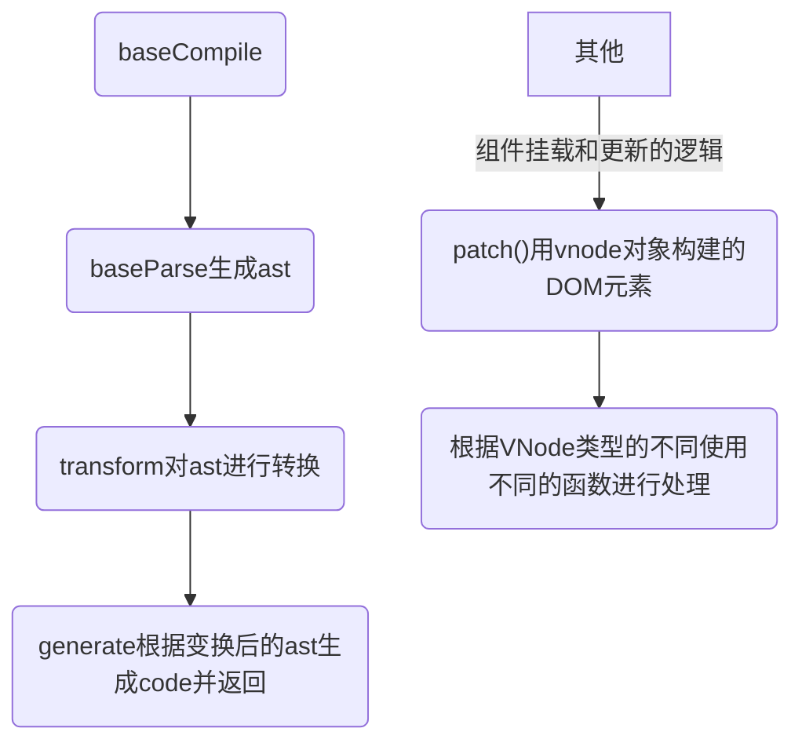
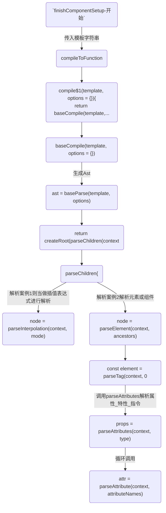
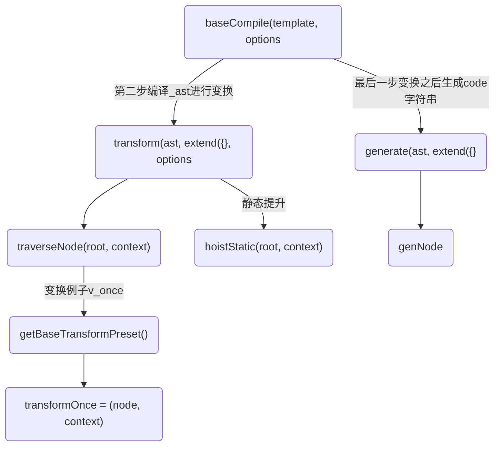

## 前言:模板引擎
从初始化data开始，到解析 template 模版，进行依赖收集。

从data改变，通知渲染 Effect 更新，到页面变化。

## AST-->render()
注意:如果在webpack：
```
用vue-loader将.vue文件编译成js，然后使用render函数渲染，打包的时候就编译成了render函数需要的格式，不需要在客户端编译;
```

Vue 文件是如何被 compile-core 编译核心模块编译成渲染函数的?

如果有配置，直接使用配置的render函数，如果没有，使用运行时编译器，把模板编译成render函数。

在执行render函数的过程中会搜集所有依赖，将来依赖发生变换时会执行updateComponent函数。

在执行`_update`的过程中，会触发patch函数，由于目前还没有旧的虚拟DOM tree，因此直接为当前的虚拟DOM tree的每一个节点生成对应elm属性，即真实DOM。

最终会把创建好的组件实例挂载到vnode的componentInstance属性中，以便复用。

### 1.baseParse生成ast

### 2.transform对ast进行转换,变换AST的结构
因为只有拿到生成的 AST 我们才能遍历 AST 的节点进行 transform 转换操作，比如解析 v-if、v-for 等各种指令。
也能对源码进行优化:
vue3新特性：

vue3 在模板的compile-time做了的优化:比如提升不变的vNode(静态提升)，以及blockTree配合patchFlag靶向更新

transform中的hoistStatic发生静态提升,hoistStatic会递归ast并发现一些不会变的节点与属性，给他们打上可以静态提升的标记。在生成代码字符串阶段，将其序列化成字符串、以减少编译和渲染成本。

### 3.generate根据变换后的转换AST生成render()函数

### 总结
* 生成ast对象
* 将ast对象作为参数传入transform函数，对 ast 节点进行转换操作
* 将ast对象作为参数传入generate函数，返回编译结果


## 接`初始化流程`,finishComponentSetup()开始执行
[接上面的`baseCompile生成ast-静态提升-vnode-patch`](./baseCompile生成ast-静态提升-vnode-patch),finishComponentSetup()开始执行，去构建ast:


### 第二步编译,根据ast-->生成code字符串
