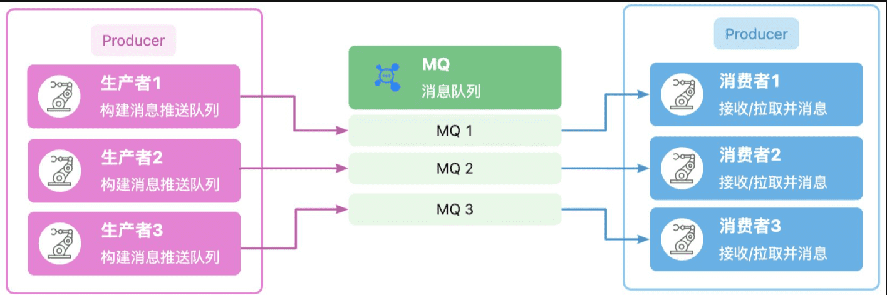

## 概念
我们可以把消息队列比作是一个存放消息的容器，当我们需要使用消息的时候可以取出消息供自己使用。消息队列是分布式系统中重要的组件，使用消息队列主要是为了通过异步处理提高系统性能和削峰、降低系统耦合性。

目前使用较多的消息队列有
* ActiveMQ
* RabbitMQ
* Kafka
* RocketMQ

消息队列是存储数据的一个中间件，可以理解为一个容器。生产者生产消息投递 到队列中，消费者可以拉取消息进行消费，如果消费者目前没有消费的打算，则消息队列会保留消息，直到消费者有消费的打算。

## 实现
### 生产者
* 连接 redis
* 向指定通道 通过 lpush 消息

### 消费者
* 连接 redis
* 死循环通过 brpop 阻塞式获取消息
* 拿到消息进行消费
* 循环拿去下一个消息
