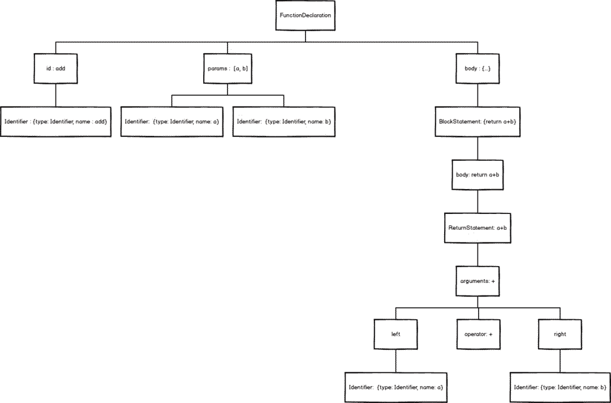

## 编译原理和AST

例如：
[babel编译器](./babel)

[astexplorer:查看js被转换为抽象语法树](https://astexplorer.net/)

大部分东西都是 嵌套结构：

各种网络协议的包格式，音频编码格式，视频h264......, html,xml, json, 文件夹，命令行，windows注册表，ini文件... 对象，字典,snmp oid.... 

所有的这些东西本质都是一回事。如果你掌控能力足够强是可以完全用if/else 加for 循环 加数组 这三个基本的东西实现上面的一切，但是遗憾的事大多人硬写的话掌控不住复杂的层层嵌套结构，进一步的技巧就是状态机，再进一步想做的更加体系化，就要有编译原理的支持。  

AST什么的说直白了很简单，就是对整个代码文本中每一个括号，token,进行一个描述，包括location(在文本中的位置） ，类型（函数还是变量....），括号的配对者位置（block scope).....等等。

可以尝试硬写一个png的格式解析器；能掌控住的话，尝试下h264格式解析；如果还能掌控住，那么可以尝试html；如果依然没问题，可以尝试pdf,或者解析js,总会到达一个需要编译原理理论支撑的阶段。

### 例如php是如何执行?
php是由解释器将脚本文件先翻译为操作码（opcode）, 然后从opcode找到对应的C函数，去执行该C函数。(这里的C函数在php安装成功之后就已经是机器码了。这块要分清楚。不要跟opcode混淆)

### 编译原理
编译原理在基础软件和平台类软件中运用得比较多。基础软件如编译器和数据库，平台类软件如大数据框架等。

举个例子，对于数据库和大数据框架如Spark SQL等各种xx sql，本质都是将某种DSL，先经过词法分析，语法分析，语义分析等转化为某种中间表达，再将这种中间表达生成具体的执行任务，在这个过程中会用各种优化算法，来让任务执行的性能更高。这里面都会使用到编译技术。

再比如，Java后端面试中常见的框架和中间件也用到了编译技术，Hibernate中HQL的解析，分库分表中间件如shardingsphere对DSL的解析，Spring中对注解的支持，Java字节码动态生成都使用了编译原理的知识。

学好编译原理，能让你更好更快更强地设计和实现这些软件。能让你在看一些面试八股文时，不仅仅是背诵，也更加清楚怎么设计（即使你原先不知道这个软件，但你知道这个软件的功能，就能猜出它的大概实现）

* Java程序员面试必备JVM底层原理，学好了编译原理，JVM，V8，Go运行时等等，都是编译原理的具体实现，不用背，都能举一反三

* 进一步加深对算法的理解。比如编译原理中使用了大量的树和图相关的算法，编译后端指令选择算法BURS 算法是一种动态规划算法等等

* 编译原理是连接：程序，操作系统和计算机组成原理（也就是软硬件接口）的桥梁

## 拆解Javascript

通过抽象语法树解析，我们可以像童年时拆解玩具一样，透视Javascript这台机器的运转，并且重新按着你的意愿来组装。
```js
function add(a, b) {
    return a + b
}
```


```json
{
  "type": "Program",
  "start": 0,
  "end": 39,
  "body": [
    {
      "type": "FunctionDeclaration",
      "start": 0,
      "end": 39,
      "id": {
        "type": "Identifier",
        "start": 9,
        "end": 12,
        "name": "add"
      },
      "expression": false,
      "generator": false,
      "async": false,
      "params": [
        {
          "type": "Identifier",
          "start": 13,
          "end": 14,
          "name": "a"
        },
        {
          "type": "Identifier",
          "start": 16,
          "end": 17,
          "name": "b"
        }
      ],
      "body": {
        "type": "BlockStatement",
        "start": 19,
        "end": 39,
        "body": [
          {
            "type": "ReturnStatement",
            "start": 25,
            "end": 37,
            "argument": {
              "type": "BinaryExpression",
              "start": 32,
              "end": 37,
              "left": {
                "type": "Identifier",
                "start": 32,
                "end": 33,
                "name": "a"
              },
              "operator": "+",
              "right": {
                "type": "Identifier",
                "start": 36,
                "end": 37,
                "name": "b"
              }
            }
          }
        ]
      }
    }
  ],
  "sourceType": "module"
}
```


第一步：
一个id，就是它的名字，即add
两个params，就是它的参数，即[a, b]
一块body，也就是大括号内的一堆东西

1. add没办法继续拆下去了，它是一个最基础Identifier（标志）对象，用来作为函数的唯一标志，就像人的姓名一样。
```js
{
    name: 'add'
    type: 'identifier'
    ...
}
```

2. params继续拆下去，其实是两个Identifier组成的数组。之后也没办法拆下去了。
```js
[
    {
        name: 'a'
        type: 'identifier'
        ...
    },
    {
        name: 'b'
        type: 'identifier'
        ...
    }
]
```
3. body其实是一个BlockStatement（块状域）对象，用来表示是{return a + b}<br/>打开Blockstatement，里面藏着一个ReturnStatement（Return域）对象，用来表示return a + b

### 继续打开ReturnStatement

里面是一个BinaryExpression(二项式)对象，用来表示a + b

继续打开BinaryExpression，它成了三部分，left，operator，right

operator 即+,left 里面装的，是Identifier对象 a right 里面装的，是Identifer对象 b

就这样，我们把一个简单的add函数拆解完毕，用图表示就是



## AST抽象语法树，树形结构来表示编程语句,对计算机来说更加友好的表现形式
抽象语法树(Abstract Syntax Tree)，是一种标准的树结构。

可以理解为可以将一串代码解析成一个树形结构，这个树形结构上面每个节点代表一种语法结构。

一个 AST 可以由单一的节点或是成百上千个节点构成。它们组合在一起可以描述用于静态分析的程序语法。

单层AST节点示例：
```js
{
  type: "BinaryExpression",
  operator: ...,
  left: {...},
  right: {...}
}
 
// type是节点的类型，比如"Program"、"FunctionDeclaration"、"ExpressionStatement"等，类型
// 有很多种，种节点类型会有一些附加的属性用于进一步描述该节点类型。
// 节点类型种类参见：https://blog.csdn.net/weixin_30576827/article/details/94938016
```

每个js引擎都有自己的AST语法解析器，比如chrome是v8引擎，node也是v8引擎
AST语法树每一层都拥有相同的结构，这样的每一层结构也被叫做 节点（Node）。

## JS Parser解析器,将JavaScript源码`转化为抽象语法树(AST)的工具叫做JS Parser解析器。`
### 常见的AST parser
- V8内置的parser
- Espree，基于esprima，用于eslint
- Acorn，号称是相对于esprima性能更优，体积更小
- Babylon，出自acorn，用于babel
- Babel-eslint，babel团队维护，用于配合使用ESLint

几个重要的包：
- 1.babylon 将js代码转化为ast语法树
```
Babylon 是一个解析器，它可以将 JavaScript 字符串转换为抽象语法树（AST）
```

- 2.转换 babel-traverse 
```
babel-traverse 模块允许你浏览、分析和修改抽象语法树（AST）。
```

- 3.生成 babel-generator 
最后，babel-generator 模块用来将转换后的抽象语法树（AST）转换为 JavaScript 字符串。

### JS Parser的解析过程包括两部分:
* 1.词法分析(Lexical Analysis)：将整个代码字符串分割成最小语法单元数组
```
语法单元是被解析语法当中具备实际意义的最小单元，简单的来理解就是自然语言中的词语。
```
* 2.语法分析(Syntax Analysis)：在分词基础上建立分析语法单元之间的关系

### JS Parser的解析：词法分析(Lexical Analysis)
Javascript 代码中的语法单元主要包括以下这么几种：
- 关键字：例如 var、let、const等

- 标识符：没有被引号括起来的连续字符，可能是一个变量，也可能是 if、else 这些关键字，又或者是 true、false 这些内置常量

- 运算符： +、-、 *、/ 等

- 数字：像十六进制，十进制，八进制以及科学表达式等

- 字符串：因为对计算机而言，字符串的内容会参与计算或显示

- 空格：连续的空格，换行，缩进等

- 注释：行注释或块注释都是一个不可拆分的最小语法单元

- 其他：大括号、小括号、分号、冒号等

### JS Parser的解析:语法分析(Syntax Analysis)
组合分词的结果，确定词语之间的关系，确定词语最终的表达含义，生成抽象语法树。

以赋值语句为例，使用esprima来解析：
```js
var a = 1;
```

`1.词法分析结果如下`，可以看到，分词的结果是一个数组，每一个元素都是一个最小的语法单元：
```json
[{
		"type": "Keyword",
		"value": "var"
	},
	{
		"type": "Identifier",
		"value": "a"
	},
	{
		"type": "Punctuator",
		"value": "="
	},
	{
		"type": "Numeric",
		"value": "1"
	},
	{
		"type": "Punctuator",
		"value": ";"
	}
]
```

`2.语法分析结果如下`，把分词的结果按照相互的关系组成一个树形结构：
```json
{
	"type": "Program",
	"body": [{
		"type": "VariableDeclaration",
		"declarations": [{
			"type": "VariableDeclarator",
			"id": {
				"type": "Identifier",
				"name": "a"
			},
			"init": {
				"type": "Literal",
				"value": 1,
				"raw": "1"
			}
		}],
		"kind": "var"
	}],
	"sourceType": "script"
}
```
