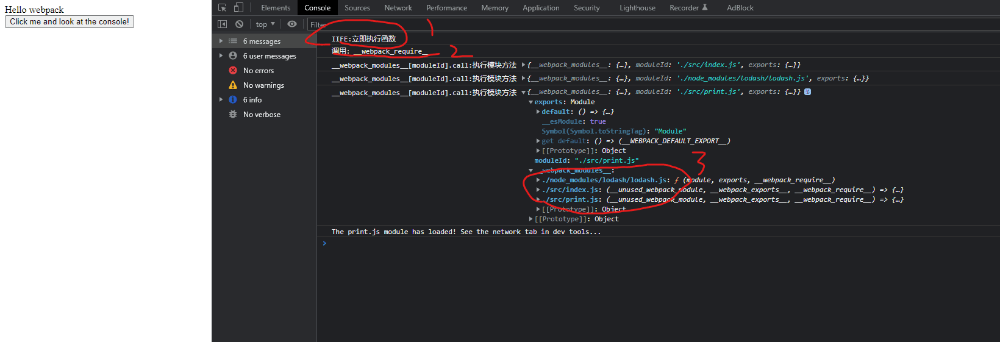

## 总览


## 编译前
[测试用例](https://github.com/huiruo/webpack-dynamic-import)

index.js
```js
import _ from 'lodash';
import print from './print'

function component() {
  const element = document.createElement('div');
  const button = document.createElement('button');
  const br = document.createElement('br');

  button.innerHTML = 'Click me and look at the console!';
  element.innerHTML = _.join(['Hello', 'webpack'], ' ');
  element.appendChild(br);
  element.appendChild(button);

  // 静态加载
  button.onclick = e => {
    print()
  };

  return element;
}

document.body.appendChild(component());

```

print.js 
```js
console.log(
  'The print.js module has loaded! See the network tab in dev tools...'
);

export default () => {
  console.log('Button Clicked: Here\'s "some text"!');
};
```

```html
<!DOCTYPE html>
<html>
<head>
  <meta charset="utf-8" />
  <title>Getting Started</title>
</head>

<body>
  <script src="../dist/index.bundle.js"></script>
</body>
</html>
```

## 打包后:IIFE(立即执行函数)
里面全都是立即执行函数
index.bundle.js
```js
(() => { // webpackBootstrap
  var __webpack_modules__ = ({

/***/ "./node_modules/lodash/lodash.js":
/***/ (function (module, exports, __webpack_require__) {

        eval("/* module decorator */ module = __webpack_require__.nmd(module);\nvar __WEBPACK_AMD_DEFINE_RESULT__;/**\n * @license\n * Lodash <https://lodash.com/>\n * Copyright OpenJS Foundation and other contributors <https://openjsf.org/>\n * Released under MIT license <https://lodash.com/license>\n * =====省略lodash代码===?");

        /***/
      }),

/***/ "./src/index.js":
/***/ ((__unused_webpack_module, __webpack_exports__, __webpack_require__) => {

        "use strict";
        eval("__webpack_require__.r(__webpack_exports__);\n/* harmony import */ var lodash__WEBPACK_IMPORTED_MODULE_0__ = __webpack_require__(/*! lodash */ \"./node_modules/lodash/lodash.js\");\n/* harmony import */ var lodash__WEBPACK_IMPORTED_MODULE_0___default = /*#__PURE__*/__webpack_require__.n(lodash__WEBPACK_IMPORTED_MODULE_0__);\n/* harmony import */ var _print__WEBPACK_IMPORTED_MODULE_1__ = __webpack_require__(/*! ./print */ \"./src/print.js\");\n\r\n\r\n\r\nfunction component() {\r\n  const element = document.createElement('div');\r\n  const button = document.createElement('button');\r\n  const br = document.createElement('br');\r\n\r\n  button.innerHTML = 'Click me and look at the console!';\r\n  element.innerHTML = lodash__WEBPACK_IMPORTED_MODULE_0___default().join(['Hello', 'webpack'], ' ');\r\n  element.appendChild(br);\r\n  element.appendChild(button);\r\n\r\n\r\n  // 动态加载\r\n  // button.onclick = e => import(/* webpackChunkName: \"print\" */ './print').then(module => {\r\n  //   const print = module.default;\r\n\r\n  //   print();\r\n  // });\r\n\r\n  // 静态加载\r\n  button.onclick = e => {\r\n    (0,_print__WEBPACK_IMPORTED_MODULE_1__[\"default\"])()\r\n  };\r\n\r\n  return element;\r\n}\r\n\r\ndocument.body.appendChild(component());\r\n\n\n//# sourceURL=webpack://webpack-helloworld/./src/index.js?");
      }),

/***/ "./src/print.js":
/***/ ((__unused_webpack_module, __webpack_exports__, __webpack_require__) => {

        "use strict";
        eval("__webpack_require__.r(__webpack_exports__);\n/* harmony export */ __webpack_require__.d(__webpack_exports__, {\n/* harmony export */   \"default\": () => (__WEBPACK_DEFAULT_EXPORT__)\n/* harmony export */ });\nconsole.log(\r\n  'The print.js module has loaded! See the network tab in dev tools...'\r\n);\r\n\r\n/* harmony default export */ const __WEBPACK_DEFAULT_EXPORT__ = (() => {\r\n  console.log('Button Clicked: Here\\'s \"some text\"!');\r\n});\n\n//# sourceURL=webpack://webpack-helloworld/./src/print.js?");

        /***/
      })
  });
  /************************************************************************/
  // The module cache
  var __webpack_module_cache__ = {};

  // The require function
  function __webpack_require__(moduleId) {
    // Check if module is in cache
    var cachedModule = __webpack_module_cache__[moduleId];
    if (cachedModule !== undefined) {
      return cachedModule.exports;
    }
    // Create a new module (and put it into the cache)
    var module = __webpack_module_cache__[moduleId] = {
      id: moduleId,
      loaded: false,
      exports: {}
    };

    // Execute the module function
    __webpack_modules__[moduleId].call(module.exports, module, module.exports, __webpack_require__);

    // Flag the module as loaded
    module.loaded = true;

    // Return the exports of the module
    return module.exports;
  }

  /************************************************************************/
  /* webpack/runtime/compat get default export */
  (() => {
    // getDefaultExport function for compatibility with non-harmony modules
    __webpack_require__.n = (module) => {
      var getter = module && module.__esModule ?
        () => (module['default']) :
        () => (module);
      __webpack_require__.d(getter, { a: getter });
      return getter;
    };
  })();

  /* webpack/runtime/define property getters */
  (() => {
    // define getter functions for harmony exports
    __webpack_require__.d = (exports, definition) => {
      for (var key in definition) {
        if (__webpack_require__.o(definition, key) && !__webpack_require__.o(exports, key)) {
          Object.defineProperty(exports, key, { enumerable: true, get: definition[key] });
        }
      }
    };
  })();

  /* webpack/runtime/global */
  (() => {
    __webpack_require__.g = (function () {
      if (typeof globalThis === 'object') return globalThis;
      try {
        return this || new Function('return this')();
      } catch (e) {
        if (typeof window === 'object') return window;
      }
    })();
  })();

  /* webpack/runtime/hasOwnProperty shorthand */
  (() => {
    __webpack_require__.o = (obj, prop) => (Object.prototype.hasOwnProperty.call(obj, prop))
  })();

  /* webpack/runtime/make namespace object */
  (() => {
    // define __esModule on exports
    __webpack_require__.r = (exports) => {
      if (typeof Symbol !== 'undefined' && Symbol.toStringTag) {
        Object.defineProperty(exports, Symbol.toStringTag, { value: 'Module' });
      }
      Object.defineProperty(exports, '__esModule', { value: true });
    };
  })();

  /* webpack/runtime/node module decorator */
  (() => {
    __webpack_require__.nmd = (module) => {
      module.paths = [];
      if (!module.children) module.children = [];
      return module;
    };
  })();

  var __webpack_exports__ = __webpack_require__("./src/index.js");

})();
```

### `__webpack_modules__`是一个对象
对象的 key 就是每个 js 模块的相对路径，value 就是一个函数（我们下面称之为模块函数）。

IIFE 末尾执行 会先 require 入口模块:
```js
var __webpack_exports__ = __webpack_require__("./src/index.js");
```

`__webpack_require__()`加载一个模块，并在最后返回模块 module.exports 变量,入口模块会在执行时 require 其他模块例如 lodash,以下为简化后的代码，从而不断的加载所依赖的模块，形成依赖树

如下的`./src/index.js`模块`__webpack_require__(..)`函数中就引用了其他的文件
* ./node_modules/lodash/lodash.js
* print.js
```js
/***/ "./src/index.js":
/***/ ((__unused_webpack_module, __webpack_exports__, __webpack_require__) => {

        "use strict";
        eval("__webpack_require__.r(__webpack_exports__);\n/* harmony import */ var lodash__WEBPACK_IMPORTED_MODULE_0__ = __webpack_require__(/*! lodash */ \"./node_modules/lodash/lodash.js\");\n/* harmony import */ var lodash__WEBPACK_IMPORTED_MODULE_0___default = /*#__PURE__*/__webpack_require__.n(lodash__WEBPACK_IMPORTED_MODULE_0__);\n/* harmony import */ var _print__WEBPACK_IMPORTED_MODULE_1__ = __webpack_require__(/*! ./print */ \"./src/print.js\");\n\r\n\r\n\r\nfunction component() {\r\n  const element = document.createElement('div');\r\n  const button = document.createElement('button');\r\n  const br = document.createElement('br');\r\n\r\n  button.innerHTML = 'Click me and look at the console!';\r\n  element.innerHTML = lodash__WEBPACK_IMPORTED_MODULE_0___default().join(['Hello', 'webpack'], ' ');\r\n  element.appendChild(br);\r\n  element.appendChild(button);\r\n\r\n\r\n  // 动态加载\r\n  // button.onclick = e => import(/* webpackChunkName: \"print\" */ './print').then(module => {\r\n  //   const print = module.default;\r\n\r\n  //   print();\r\n  // });\r\n\r\n  // 静态加载\r\n  button.onclick = e => {\r\n    (0,_print__WEBPACK_IMPORTED_MODULE_1__[\"default\"])()\r\n  };\r\n\r\n  return element;\r\n}\r\n\r\ndocument.body.appendChild(component());\r\n\n\n//# sourceURL=webpack://webpack-helloworld/./src/index.js?");
      })
  });
```


## webpack 是如何支持 ESM 的
可能大家已经发现，上面的写法是 ESM 的写法;对于模块化的一些方案的了解,Javascript 中的 CJS, AMD, UMD 和 ESM是什么？

就是为 '__webpack_exports__` 添加一个属性 __esModule，值为 true
```js
 	(() => {
 		// define __esModule on exports
 		__webpack_require__.r = (exports) => {
      console.log('__webpack_require__.r', exports)
 			if (typeof Symbol !== 'undefined' && Symbol.toStringTag) {
 				Object.defineProperty(exports, Symbol.toStringTag, { value: 'Module' });
        
      }
 			Object.defineProperty(exports, '__esModule', { value: true });
      
    };
    
  })();
```
`__webpack_require__.n`
```
__webpack_require__.n会判断module是否为es模块，当__esModule为 true 的时候，标识 module 为es 模块，默认返回module.default，否则返回module。

最后看 __webpack_require__.d，主要的工作就是将上面的 getter 函数绑定到 exports 中的属性 a 的 getter 上
```
```js
 	/* webpack/runtime/compat get default export */
 	(() => {
 		// getDefaultExport function for compatibility with non-harmony modules
 		__webpack_require__.n = (module) => {
 			var getter = module && module.__esModule ?
 				() => (module['default']) :
 				() => (module);
 			__webpack_require__.d(getter, { a: getter });
 			return getter;
      
    };
    
  })();
```