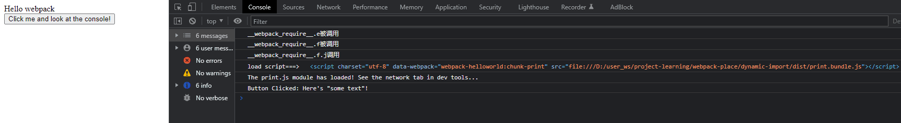

参考：
https://juejin.cn/post/7119647017009152013#heading-9

## 懒加载在页面上的应用
没有应用懒加载，webpack打包后，会放在一个单独的js文件中会造成这个页面非常大，造成进入首页时，会出现长时间的白屏，即使做了loading也是不利于用户体验

运用懒加载则可以将页面进行划分，需要的时候加载页面，可以有效的分担首页所承担的加载压力，减少首页加载用时。

### 在Webpack中常用的代码分离方法有三种：
* 入口起点：使用 entry 配置手动地分离代码。
* 防止重复：使用 Entry dependencies 或者 SplitChunksPlugin 去重和分离 chunk。
* 动态导入：通过模块的内联函数调用来分离代码。

### 当涉及到动态代码拆分时，Webpack 提供了两个类似的技术：
* 第一种借助ES6的动态加载模块 - import（）
```
import() 的语法十分简单。该函数只接受一个参数，就是引用模块的地址，并且使用 promise 式的回调获取加载的模块。

通过import()引用的子模块会被单独分离出来，打包成一个单独的文件。
```
借助import（），我们实现了子模块（子组件）的独立打包（children chunk）。

* 第二种，Webpack 的遗留功能，使用 Webpack 特定的 require.ensure (不推荐使用) ，本文不做探讨
现在，距离实现懒加载（按需加载）还差关键的一步 -- 如何正确使用独立打包的子模块文件（children chunk）实现懒加载。

## 懒加载原理
JavaScript函数的特性：
无论使用函数声明还是函数表达式创建函数，函数被创建后并不会立即执行函数内部的代码，只有等到函数被调用之后，才执行内部的代码。

只要将需要进行懒加载的子模块文件（children chunk）的引入语句（本文特指import（））放到一个函数内部。然后再需要加载的时候执行该函数。在浏览器运行到这一行代码时，就会自动请求这个资源，实现异步加载。
```js
button.onclick = e => import(/* webpackChunkName: "print" */ './print').then(module => {
  const print = module.default;

  print();
});
```

### 总结： 懒加载（按需加载）原理分为两步：
1. 将需要进行懒加载的子模块打包成独立的文件（children chunk）；
2. 借助函数来实现延迟执行子模块的加载代码；
是不是很简单呀！这里的技术难点就是如何将懒加载的子模块打包成独立的文件。好在ES6提供了import()。

## import和require 区别
1. import 是解构过程并且是编译时执行
2. require 是赋值过程并且是运行时才执行，也就是异步加载


## 原理分析
* 第一步：当点击按钮时，先通过 jsonp 的方式去加载 test.js 模块所对应的文件
* 第二步：加载回来后在浏览器中执行此JS脚本，将请求过来的模块定义合并到 main.js 中的 modules 中去
* 第三步：合并完后，去加载这个模块
* 第四步：拿到该模块导出的内容


```js
import _ from 'lodash';

function component() {
  const element = document.createElement('div');
  const button = document.createElement('button');
  const br = document.createElement('br');

  button.innerHTML = 'Click me and look at the console!';
  element.innerHTML = _.join(['Hello', 'webpack'], ' ');
  element.appendChild(br);
  element.appendChild(button);

  button.onclick = e => import(/* webpackChunkName: "print" */ './print').then(module => {
    const print = module.default;

    print();
  });

  return element;
}

document.body.appendChild(component());
```

打包后后可以看到点击按钮调用__webpack_require__.e()
```js
/***/ ((__unused_webpack_module, __webpack_exports__, __webpack_require__) => {

        "use strict";
        eval("__webpack_require__.r(__webpack_exports__);\n/* harmony import */ var lodash__WEBPACK_IMPORTED_MODULE_0__ = __webpack_require__(/*! lodash */ \"./node_modules/lodash/lodash.js\");\n/* harmony import */ var lodash__WEBPACK_IMPORTED_MODULE_0___default = /*#__PURE__*/__webpack_require__.n(lodash__WEBPACK_IMPORTED_MODULE_0__);\n\r\n\r\nfunction component() {\r\n  const element = document.createElement('div');\r\n  const button = document.createElement('button');\r\n  const br = document.createElement('br');\r\n\r\n  button.innerHTML = 'Click me and look at the console!';\r\n  element.innerHTML = lodash__WEBPACK_IMPORTED_MODULE_0___default().join(['Hello', 'webpack'], ' ');\r\n  element.appendChild(br);\r\n  element.appendChild(button);\r\n\r\n  // Note that because a network request is involved, some indication\r\n  // of loading would need to be shown in a production-level site/app.\r\n  button.onclick = e => __webpack_require__.e(/*! import() | print */ \"print\").then(__webpack_require__.bind(__webpack_require__, /*! ./print */ \"./src/print.js\")).then(module => {\r\n    const print = module.default;\r\n\r\n    print();\r\n  });\r\n\r\n  return element;\r\n}\r\n\r\ndocument.body.appendChild(component());\n\n//# sourceURL=webpack://webpack-helloworld/./src/index.js?");

        /***/
})
```



## 点击后按钮第一步
dynamic-import\dist\index.bundle.js
对应构建源码：02-构建动态组件源码.md
```js
 	/* webpack/runtime/ensure chunk */
 	(() => {
 		__webpack_require__.f = {};
 		// This file contains only the entry chunk.
 		// The chunk loading function for additional chunks
 		__webpack_require__.e = (chunkId) => {
      console.log('__webpack_require__.e被调用')
 			return Promise.all(Object.keys(__webpack_require__.f).reduce((promises, key) => {
        console.log('__webpack_require__.f被调用')
 				__webpack_require__.f[key](chunkId, promises);
 				return promises;
        
      }, []));
      
    };
    
  })();
```

## `__webpack_require__.f.j`调用`__webpack_require__.l`
```js
 		__webpack_require__.f.j = (chunkId, promises) => {
 				// JSONP chunk loading for javascript
 				var installedChunkData = __webpack_require__.o(installedChunks, chunkId) ? installedChunks[chunkId] : undefined;
 				if (installedChunkData !== 0) { // 0 means "already installed".

 					// a Promise means "currently loading".
 					if (installedChunkData) {
 						promises.push(installedChunkData[2]);
          
        } else {
 						if (true) { // all chunks have JS
 							// setup Promise in chunk cache
 							var promise = new Promise((resolve, reject) => (installedChunkData = installedChunks[chunkId] = [resolve, reject]));
 							promises.push(installedChunkData[2] = promise);

 							// start chunk loading
 							var url = __webpack_require__.p + __webpack_require__.u(chunkId);
 							// create error before stack unwound to get useful stacktrace later
 							var error = new Error();
 							var loadingEnded = (event) => {
 								if (__webpack_require__.o(installedChunks, chunkId)) {
 									installedChunkData = installedChunks[chunkId];
 									if (installedChunkData !== 0) installedChunks[chunkId] = undefined;
 									if (installedChunkData) {
 										var errorType = event && (event.type === 'load' ? 'missing' : event.type);
 										var realSrc = event && event.target && event.target.src;
 										error.message = 'Loading chunk ' + chunkId + ' failed.\n(' + errorType + ': ' + realSrc + ')';
 										error.name = 'ChunkLoadError';
 										error.type = errorType;
 										error.request = realSrc;
 										installedChunkData[1](error);
                  
                }
                
              }
              
            };
 							__webpack_require__.l(url, loadingEnded, "chunk-" + chunkId, chunkId);
            
          } else installedChunks[chunkId] = 0;
          
        }
        
      }
      
    };
```

## 这一步其实就是给promises数组赋值，并通过jsonp去加载文件，最后：执行`传入的回调loadingEnded`和执行`document.head.appendChild(script)`
通过 JSONP 去动态引入 chunk 文件，并根据引入的结果状态进行处理，那么我们怎么知道引入之后的状态呢？我们来看异步加载的 chunk 是怎样的

注意：比如当点击按钮时，只需第一次加载时去请求文件，后面加载时应该要去使用缓存。

* 对应build源码：02-构建动态组件源码.md

* build之后的源码：dynamic-import\dist\index.bundle.js
```html
<!-- 结果 -->
<script charset="utf-8" data-webpack="webpack-helloworld:chunk-print" src="file:///D:/user_ws/project-learning/webpack-place/dynamic-import/dist/print.bundle.js"></script>
```

可见赋值到`__webpack_require__.l`对象
```js
 	(() => {
 		var inProgress = {};
 		var dataWebpackPrefix = "webpack-helloworld:";
 		// loadScript function to load a script via script tag
 		__webpack_require__.l = (url, done, key, chunkId) => {
 			if (inProgress[url]) { inProgress[url].push(done); return; }
 			var script, needAttach;
 			if (key !== undefined) {
 				var scripts = document.getElementsByTagName("script");
 				for (var i = 0; i < scripts.length; i++) {
 					var s = scripts[i];
 					if (s.getAttribute("src") == url || s.getAttribute("data-webpack") == dataWebpackPrefix + key) { script = s; break; }
          
        }
        
      }
 			if (!script) {
 				needAttach = true;
 				script = document.createElement('script');

 				script.charset = 'utf-8';
 				script.timeout = 120;
 				if (__webpack_require__.nc) {
 					script.setAttribute("nonce", __webpack_require__.nc);
          
        }
 				script.setAttribute("data-webpack", dataWebpackPrefix + key);
 				script.src = url;
        console.log('load script===>', script)
        
      }
 			inProgress[url] = [done];
 			var onScriptComplete = (prev, event) => {
 				// avoid mem leaks in IE.
 				script.onerror = script.onload = null;
 				clearTimeout(timeout);
 				var doneFns = inProgress[url];
 				delete inProgress[url];
 				script.parentNode && script.parentNode.removeChild(script);
 				doneFns && doneFns.forEach((fn) => (fn(event)));
 				if (prev) return prev(event);
        
      }
 			var timeout = setTimeout(onScriptComplete.bind(null, undefined, { type: 'timeout', target: script }), 120000);
 			script.onerror = onScriptComplete.bind(null, script.onerror);
 			script.onload = onScriptComplete.bind(null, script.onload);
 			needAttach && document.head.appendChild(script);
      
    };
    
  })();
```
