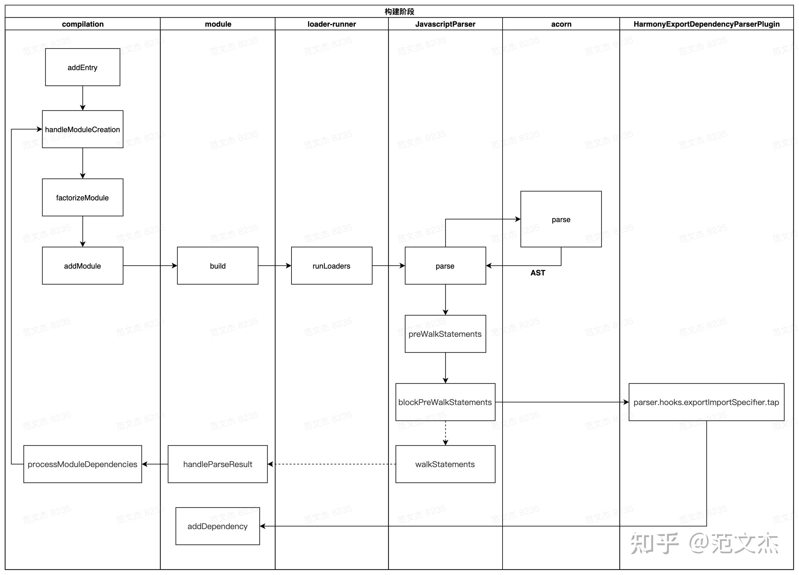
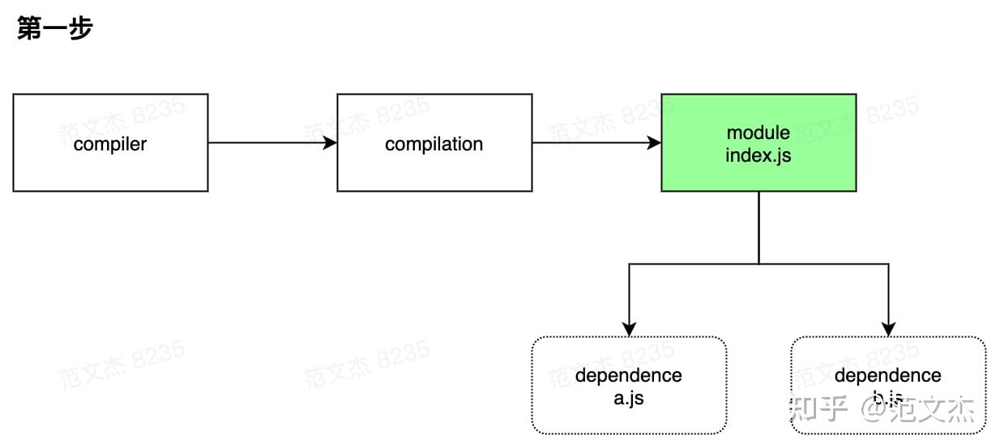

## Webpack
Webpack：将各种类型的资源，包括图片、css、js等，转译、组合、拼接、生成 JS 格式的 bundler 文件。

它能够根据配置的入口路径（entry），通过模块间的依赖关系（import/export），递归地构建出一张依赖关系图（dependency graph）。而由于webpack只理解 JavaScript 和 JSON 文件，过程中需要通过配置指定的加载器（loader）对相应文件进行转换，也可以通过配置指定的插件（plugins）对上下文进行优化输出（output）为代码块（chunk）


这个过程核心完成了 内容转换 + 资源合并 两种功能，实现上包含三个阶段：

## 1.初始化阶段
1. 初始化参数：从配置文件、 配置对象、Shell 参数中读取，与默认配置结合得出最终的参数
2. 创建编译器对象：用上一步得到的参数创建 Compiler 对象
3. 初始化编译环境：包括注入内置插件、注册各种模块工厂、初始化 RuleSet 集合、加载配置的插件等
4. 开始编译：执行 compiler 对象的 run 方法
5. 确定入口：根据配置中的 entry 找出所有的入口文件，调用 Compilation .addEntry 将入口文件转换为 dependence 对象
## 2.构建阶段：
1. 编译模块(make)：根据 entry 对应的 dependence 创建 module 对象，调用 loader 将模块转译为标准 JS 内容，调用 JS 解释器将内容转换为 AST 对象，从中找出该模块依赖的模块，再 递归 本步骤直到所有入口依赖的文件都经过了本步骤的处理
2. 完成模块编译：上一步递归处理所有能触达到的模块后，得到了每个模块被翻译后的内容以及它们之间的 依赖关系图

## 3.生成阶段：
1. 输出资源(seal)：根据入口和模块之间的依赖关系，组装成一个个包含多个模块的 Chunk，再把每个 Chunk 转换成一个单独的文件加入到输出列表，这步是可以修改输出内容的最后机会
2. 写入文件系统(emitAssets)：在确定好输出内容后，根据配置确定输出的路径和文件名，把文件内容写入到文件系统

## 单次构建过程自上而下按顺序执行,webpack 编译过程都是围绕着这些关键对象展开的
它能够根据配置的入口路径（entry），通过模块间的依赖关系（import/export），递归地构建出一张依赖关系图（dependency graph）。而由于webpack只理解 JavaScript 和 JSON 文件，过程中需要通过配置指定的加载器（loader）对相应文件进行转换，也可以通过配置指定的插件（plugins）对上下文进行优化输出（output）为代码块（chunk）

* Entry：编译入口，webpack 编译的起点

* Compiler：编译管理器，webpack 启动后会创建 compiler 对象，该对象一直存活知道结束退出

* Compilation：单次编辑过程的管理器，比如 watch = true 时，运行过程中只有一个 compiler 但每次文件变更触发重新编译时，都会创建一个新的 compilation 对象

* Dependence：依赖对象，webpack 基于该类型记录模块间依赖关系

* Module：webpack 内部所有资源都会以“module”对象形式存在，所有关于资源的操作、转译、合并都是以 “module” 为基本单位进行的

* Chunk：编译完成准备输出时，webpack 会将 module 按特定的规则组织成一个一个的 chunk，这些 chunk 某种程度上跟最终输出一一对应

* Loader：资源内容转换器，其实就是实现从内容 A 转换 B 的转换器
```
00-2-loader.md
```

* Plugin：webpack构建过程中，会在特定的时机广播对应的事件，插件监听这些事件，在特定时间点介入编译过程
```
插件可以用来处理各种特定的任务，比如代码的压缩，静态文件打包优化等等。如下面所示的自动生成 html 文件的插件:
```

* import/export 某个模块通过import导入其他模块的变量及对象，通过export导出自身的变量及对象，webpack内部通过import可以构建出模块关系图。

* source-map：打包后会生成 map 格式的文件，里面包含映射关系的代码
eval：用 eval 的方式生成映射关系代码，效率和性能最佳。但是当代码复杂时，提示信息可能不精确
```
开发环境：
devtool: 'cheap-module-eval-source-map',
生产环境
devtool: 'cheap-module-source-map',
```


## 初始化阶段
webpack 的初始化过程,从创建 compiler 实例到调用 make 钩子，逻辑链路很长,这个过程需要在 webpack 初始化的时候预埋下各种插件，经历 4 个文件，7次跳转才开始进入主题，前戏太足了，如果读者对 webpack 的概念、架构、组件没有足够了解时，源码阅读过程会很痛苦。

* 启动 webpack ，触发 lib/webpack.js 文件中 createCompiler 方法
* createCompiler 方法内部调用 WebpackOptionsApply 插件
* WebpackOptionsApply 定义在 lib/WebpackOptionsApply.js 文件，内部根据 entry 配置决定注入 entry 相关的插件，包括：DllEntryPlugin、DynamicEntryPlugin、EntryPlugin、PrefetchPlugin、ProgressPlugin、ContainerPlugin
* Entry 相关插件，如 lib/EntryPlugin.js 的 EntryPlugin 监听 compiler.make 钩子
* lib/compiler.js 的 compile 函数内调用 this.hooks.make.callAsync
* 触发 EntryPlugin 的 make 回调，在回调中执行 compilation.addEntry 函数
* compilation.addEntry 函数内部经过一坨与主流程无关的 hook 之后，再调用 handleModuleCreate 函数，正式开始构建内容


1. 将 process.args + webpack.config.js 合并成用户配置
2. 调用 validateSchema 校验配置
3. 调用 getNormalizedWebpackOptions + applyWebpackOptionsBaseDefaults 合并出最终配置
4. 创建 compiler 对象
5. 遍历用户定义的 plugins 集合，执行插件的 apply 方法
6. 调用 new WebpackOptionsApply().process 方法，加载各种内置插件

主要逻辑集中在 WebpackOptionsApply 类，webpack 内置了数百个插件，这些插件并不需要我们手动配置，WebpackOptionsApply 会在初始化阶段根据配置内容动态注入对应的插件，包括：
1. 注入 EntryOptionPlugin 插件，处理 entry 配置
2. 根据 devtool 值判断后续用那个插件处理 sourcemap，可选值：EvalSourceMapDevToolPlugin、SourceMapDevToolPlugin、EvalDevToolModulePlugin
3. 注入 RuntimePlugin ，用于根据代码内容动态注入 webpack 运行时

到这里，compiler 实例就被创建出来了，相应的环境参数也预设好了，紧接着开始调用 compiler.compile 函数：
```js
// webpack-helloworld\node_modules\webpack\lib\Compiler.js
compile(callback) {
  console.log('compile=====>',callback)
  const params = this.newCompilationParams();
  this.hooks.beforeCompile.callAsync(params, err => {
    // ...
    const compilation = this.newCompilation(params);
    this.hooks.make.callAsync(compilation, err => {
      // ...
      this.hooks.finishMake.callAsync(compilation, err => {
        // ...
        process.nextTick(() => {
          compilation.finish(err => {
            compilation.seal(err => {...});
          });
        });
      });
    });
  });
}
```

## 构建阶段
从 entry 开始递归解析资源与资源的依赖，在 compilation 对象内逐步构建出 module 集合以及 module 之间的依赖关系，核心流程：


解释一下，构建阶段从入口文件开始：
1. 调用 handleModuleCreate ，根据文件类型构建 module 子类
2. 调用 loader-runner 仓库的 runLoaders 转译 module 内容，通常是从各类资源类型转译为 JavaScript 文本
3. 调用 acorn 将 JS 文本解析为AST
4. 遍历 AST，触发各种钩子
```
1. 在 HarmonyExportDependencyParserPlugin 插件监听 exportImportSpecifier 钩子，解读 JS 文本对应的资源依赖
2. 调用 module 对象的 addDependency 将依赖对象加入到 module 依赖列表中
```
5. AST 遍历完毕后，调用 module.handleParseResult 处理模块依赖
6. 对于 module 新增的依赖，调用 handleModuleCreate ，控制流回到第一步
7. 所有依赖都解析完毕后，构建阶段结束


这个过程中数据流 module => ast => dependencies => module ，先转 AST 再从 AST 找依赖。这就要求 loaders 处理完的最后结果必须是可以被 acorn 处理的标准 JavaScript 语法，比如说对于图片，需要从图像二进制转换成类似于 export default "data:image/png;base64,xxx" 这类 base64 格式或者 export default "http://xxx" 这类 url 格式。


compilation 按这个流程递归处理，逐步解析出每个模块的内容以及 module 依赖关系，后续就可以根据这些内容打包输出。
### 示例：层级递进
假如有如下图所示的文件依赖树：


其中 index.js 为 entry 文件，依赖于 a/b 文件；a 依赖于 c/d 文件。初始化编译环境之后，EntryPlugin 根据 entry 配置找到 index.js 文件，调用 compilation.addEntry 函数触发构建流程，构建完毕后内部会生成这样的数据结构：



此时得到 module[index.js] 的内容以及对应的依赖对象 dependence[a.js] 、dependence[b.js] 。OK，这就得到下一步的线索：a.js、b.js，根据上面流程图的逻辑继续调用 module[index.js] 的 handleParseResult 函数，继续处理 a.js、b.js 文件，递归上述流程，进一步得到 a、b 模块：


从 a.js 模块中又解析到 c.js/d.js 依赖，于是再再继续调用 module[a.js] 的 handleParseResult ，再再递归上述流程：


到这里解析完所有模块后，发现没有更多新的依赖，就可以继续推进，进入下一步。

*  Webpack 编译过程会将源码解析为 AST 吗？webpack 与 babel 分别实现了什么？
```
构建阶段会读取源码，解析为 AST 集合。
Webpack 读出 AST 之后仅遍历 AST 集合；babel 则对源码做等价转换
```

* Webpack 编译过程中，如何识别资源对其他资源的依赖？
```
Webpack 遍历 AST 集合过程中，识别 require/ import 之类的导入语句，确定模块对其他资源的依赖关系
```

* 相对于 grant、gulp 等流式构建工具，为什么 webpack 会被认为是新一代的构建工具？
```
Grant、Gulp 仅执行开发者预定义的任务流；而 webpack 则深入处理资源的内容，功能上更强大
```

## 生成阶段
这一步的关键逻辑是将 module 按规则组织成 chunks ，webpack 内置的 chunk 封装规则比较简单：
* entry 及 entry 触达到的模块，组合成一个 chunk
* 使用动态引入语句引入的模块，各自组合成一个 chunk
```
chunk 是输出的基本单位，默认情况下这些 chunks 与最终输出的资源一一对应，那按上面的规则大致上可以推导出一个 entry 会对应打包出一个资源，而通过动态引入语句引入的模块，也对应会打包出相应的资源，我们来看个示例。
```

构建阶段围绕 module 展开，生成阶段则围绕 chunks 展开。经过构建阶段之后，webpack 得到足够的模块内容与模块关系信息，接下来开始生成最终资源了。代码层面，就是开始执行 compilation.seal 函数：
```js
// 取自 webpack/lib/compiler.js 
	compile(callback) {

		console.log('compile=====>', callback)

		const params = this.newCompilationParams();
		this.hooks.beforeCompile.callAsync(params, err => {
			if (err) return callback(err);

			this.hooks.compile.call(params);

			const compilation = this.newCompilation(params);

			const logger = compilation.getLogger("webpack.Compiler");

			logger.time("make hook");
			this.hooks.make.callAsync(compilation, err => {
				logger.timeEnd("make hook");
				if (err) return callback(err);

				logger.time("finish make hook");
				this.hooks.finishMake.callAsync(compilation, err => {
					logger.timeEnd("finish make hook");
					if (err) return callback(err);

					process.nextTick(() => {
						logger.time("finish compilation");
						compilation.finish(err => {
							logger.timeEnd("finish compilation");
							if (err) return callback(err);

							logger.time("seal compilation");
							compilation.seal(err => {
								logger.timeEnd("seal compilation");
								if (err) return callback(err);

								logger.time("afterCompile hook");
								this.hooks.afterCompile.callAsync(compilation, err => {
									logger.timeEnd("afterCompile hook");
									if (err) return callback(err);

									return callback(null, compilation);
								});
							});
						});
					});
				});
			});
		});
	}
```

seal 原意密封、上锁，我个人理解在 webpack 语境下接近于 “将模块装进蜜罐” 。seal 函数主要完成从 module 到 chunks 的转化，核心流程：
简单梳理一下：
1. 构建本次编译的 ChunkGraph 对象；
2. 遍历 compilation.modules 集合，将 module 按 entry/动态引入 的规则分配给不同的 Chunk 对象；
3. compilation.modules 集合遍历完毕后，得到完整的 chunks 集合对象，调用 createXxxAssets 方法
4. createXxxAssets 遍历 module/chunk ，调用 compilation.emitAssets 方法将资 assets 信息记录到 compilation.assets 对象中
5. 触发 seal 回调，控制流回到 compiler 对象


## 示例：多入口打包
假如有这样的配置：
```js
const path = require("path");

module.exports = {
  mode: "development",
  context: path.join(__dirname),
  entry: {
    a: "./src/index-a.js",
    b: "./src/index-b.js",
  },
  output: {
    filename: "[name].js",
    path: path.join(__dirname, "./dist"),
  },
  devtool: false,
  target: "web",
  plugins: [],
};
```

实例配置中有两个入口，对应的文件结构：


index-a 依赖于c，且动态引入了 e；index-b 依赖于 c/d 。根据上面说的规则：
* entry及entry触达到的模块，组合成一个 chunk
* 使用动态引入语句引入的模块，各自组合成一个 chunk

生成的 chunks 结构为：


也就是根据依赖关系，chunk[a] 包含了 index-a/c 两个模块；chunk[b] 包含了 c/index-b/d 三个模块；chunk[e-hash] 为动态引入 e 对应的 chunk。

不知道大家注意到没有，chunk[a] 与 chunk[b] 同时包含了 c，这个问题放到具体业务场景可能就是，一个多页面应用，所有页面都依赖于相同的基础库，那么这些所有页面对应的 entry 都会包含有基础库代码，这岂不浪费？为了解决这个问题，webpack 提供了一些插件如 CommonsChunkPlugin 、SplitChunksPlugin，在基本规则之外进一步优化 chunks 结构。

### SplitChunksPlugin 的作用
SplitChunksPlugin 是 webpack 架构高扩展的一个绝好的示例，我们上面说了 webpack 主流程里面是按 entry / 动态引入 两种情况组织 chunks 的，这必然会引发一些不必要的重复打包，webpack 通过插件的形式解决这个问题

回顾 compilation.seal 函数的代码，大致上可以梳理成这么4个步骤：
```
1.遍历 compilation.modules ，记录下模块与 chunk 关系
2.触发各种模块优化钩子，这一步优化的主要是模块依赖关系
3.遍历 module 构建 chunk 集合
4.触发各种优化钩子
```

webpack 插件架构的高扩展性，使得整个编译的主流程是可以固化下来的，分支逻辑和细节需求“外包”出去由第三方实现，这套规则架设起了庞大的 webpack 生态，关于插件架构的更多细节，下面 plugin 部分有详细介绍，这里先跳过。

## 写入文件系统
经过构建阶段后，compilation 会获知资源模块的内容与依赖关系，也就知道“输入”是什么；而经过 seal 阶段处理后， compilation 则获知资源输出的图谱，也就是知道怎么“输出”：哪些模块跟那些模块“绑定”在一起输出到哪里。seal 后大致的数据结构：
```js
compilation = {
  // ...
  modules: [
    /* ... */
  ],
  chunks: [
    {
      id: "entry name",
      files: ["output file name"],
      hash: "xxx",
      runtime: "xxx",
      entryPoint: {xxx}
      // ...
    },
    // ...
  ],
};
```
seal 结束之后，紧接着调用 compiler.emitAssets 函数，函数内部调用 compiler.outputFileSystem.writeFile 方法将 assets 集合写入文件系统，实现逻辑比较曲折，但是与主流程没有太多关系，所以这里就不展开讲了。

## 总结：资源形态流转
面已经把逻辑层面的构造主流程梳理完了，这里结合资源形态流转的角度重新考察整个过程，加深理解：


* compiler.make 阶段：
```
entry 文件以 dependence 对象形式加入 compilation 的依赖列表，dependence 对象记录有 entry 的类型、路径等信息

根据 dependence 调用对应的工厂函数创建 module 对象，之后读入 module 对应的文件内容，调用 loader-runner 对内容做转化，转化结果若有其它依赖则继续读入依赖资源，重复此过程直到所有依赖均被转化为 module
```

* compilation.seal 阶段：
```
遍历 module 集合，根据 entry 配置及引入资源的方式，将 module 分配到不同的 chunk

遍历 chunk 集合，调用 compilation.emitAsset 方法标记 chunk 的输出规则，即转化为 assets 集合
```

* compiler.emitAssets 阶段：将 assets 写入文件系统


## 什么是插件
从形态上看，插件通常是一个带有 apply 函数的类：
```js
class SomePlugin {
    apply(compiler) {
    }
}
```

apply 函数运行时会得到参数 compiler ，以此为起点可以调用 hook 对象注册各种钩子回调，例如： compiler.hooks.make.tapAsync ，这里面 make 是钩子名称，tapAsync 定义了钩子的调用方式，webpack 的插件架构基于这种模式构建而成，插件开发者可以使用这种模式在钩子回调中，插入特定代码。webpack 各种内置对象都带有 hooks 属性，比如 compilation 对象：
```js
class SomePlugin {
    apply(compiler) {
        compiler.hooks.thisCompilation.tap('SomePlugin', (compilation) => {
            compilation.hooks.optimizeChunkAssets.tapAsync('SomePlugin', ()=>{});
        })
    }
}
```
钩子的核心逻辑定义在 Tapable 仓库，内部定义了如下类型的钩子：
```js
const {
        SyncHook,
        SyncBailHook,
        SyncWaterfallHook,
        SyncLoopHook,
        AsyncParallelHook,
        AsyncParallelBailHook,
        AsyncSeriesHook,
        AsyncSeriesBailHook,
        AsyncSeriesWaterfallHook
 } = require("tapable");
```

不同类型的钩子根据其并行度、熔断方式、同步异步，调用方式会略有不同，插件开发者需要根据这些的特性，编写不同的交互逻辑，这部分内容也特别多，回头展开聊聊。

### 什么时候会触发钩子
了解 webpack 插件的基本形态之后，接下来需要弄清楚一个问题：webpack 会在什么时间节点触发什么钩子？这一块我认为是知识量最大的一部分，毕竟源码里面有237个钩子，但官网只介绍了不到100个，且官网对每个钩子的说明都太简短，就我个人而言看完并没有太大收获，所以有必要展开聊一下这个话题。先看几个例子：

compiler.hooks.compilation ：
时机：启动编译创建出 compilation 对象后触发
参数：当前编译的 compilation 对象
示例：很多插件基于此事件获取 compilation 实例

compiler.hooks.make：
时机：正式开始编译时触发
参数：同样是当前编译的 compilation 对象
示例：webpack 内置的 EntryPlugin 基于此钩子实现 entry 模块的初始化

compilation.hooks.optimizeChunks ：
时机： seal 函数中，chunk 集合构建完毕后触发
参数：chunks 集合与 chunkGroups 集合
示例： SplitChunksPlugin 插件基于此钩子实现 chunk 拆分优化

compiler.hooks.done：
时机：编译完成后触发
参数： stats 对象，包含编译过程中的各类统计信息
示例： webpack-bundle-analyzer 插件基于此钩子实现打包分析

