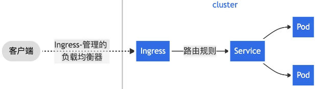

## k8s对象
在 K8S 中，所有资源都是通过声明式配置进行管理的，它们被称作 K8S 对象。以 namespace 为例：
```
 apiVersion: v1
 kind: Namespace
 metadata:
   name: demo-space
 spec:
   finalizers:
   - kubernetes
 status:
   phase: Active
```

常见的 K8S 对象包括 Namespace、Ingress、Service、Development、Pod。其中，Namespace 是一个虚拟的概念，用来对集群划分不同的命名空间。通常，同一个 Namespace 中的资源，其命名应该是唯一的。其他几种类型的资源的关系如下图所示：



不同类型的对象所需的配置不完全相同，但他们都应有如下几个基础配置：

* apiVersion - 创建该对象所使用的 Kubernetes API 的版本，不同的版本，对于 yaml 中可使用配置项的字段、格式有不同的要求。
* kind - 想要创建的对象的类别
* metadata - 帮助唯一性标识对象的一些数据
* spec - 你所期望的该对象的状态

## Ingress
通常一个集群会包含数台物理主机，它们都是集群的节点，这些节点需要一个统一的 IP 进行访问。Ingress 提供了这项能力，它是整个集群的流量入口。

Ingress 控制器有多种实现，比较常见的是基于 Nginx 实现的。

Ingress-nginx 文档：https://kubernetes.github.io/ingress-nginx/user-guide/nginx-configuration/annotations/

## Service 
流量从 Ingress 进入集群之后，应该被分配给不同的容器处理。但通常来说，容器的 IP 不是固定的，这是因为在 K8S 中，可以随时增减容器的数量，此时容器 IP 就是动态的。

Service 是一个抽象概念，它的作用是在 Ingress 和 Pod 之间解藕它们二者的关联。它会动态获取可用的 Pod 的信息，传递给 Ingress，以保证进行正确的负载均衡。

不论是正常的增减容器数量（扩缩容）还是容器自身因为意外重启，流量总会被分配到可用的容器上。

## Development
Development 是用于管理副本集和容器配置的。K8S 不建议用户直接操作副本集配置，所以 Development 通常是用户所需要接触的最基础的配置。
```
副本集一组以期望的规模稳定运行的容器集合。
```
通过 Development，可以实现如下功能：
* 修改副本数量，然后副本集会以修改后的数量自动增删容器
* 修改容器配置，此时会采用先启动新的容器，然后关闭旧的容器的方式，依次更新容器。这个阶段，服务一直会处于可用的状态。

## Pods
k8s 实际上是一个使用 Docker 容器进行编排的系统，主要围绕 pods 进行工作。

Pods 是 k8s 生态中最小的调度单位，可以包含一个或多个容器。
同一个 Pod 中的不同容器之间可以通过`localhost:<port>`的方式互相访问对方暴露出来的服务，同时，容器之间可以访问共同的数据卷。多容器的使用场景通常是一个主容器加上多个 sidecar，他们彼此配合，共同实现功能需求。


## kubectl 工具介绍
kubectl 是 K8S 提供的命令行工具，使得用户可以在本地对 K8S 集群发送操作指令。

安装完成后，创建配置文件：
```
touch $HOME/.kube/config
```

```
 apiVersion: v1
 # 集群配置，可以是多个；集群必须包含 server 字段
 clusters:
   - cluster:
       server: https://dami.net
     name: dami-c3
 # 上下文配置，可以是多个，每个上下文必须包含集群名称、namespace 名称、用户名
 contexts:
   - context:
       cluster: dami-c3
       namespace: demo-space
       user: manooog
     name: c3-demo-space-context
 # 当前默认的上下文配置，所有 kubectl 命令，都会默认使用这个上下文
 current-context: c3-demo-space-context
 kind: Config
 # 用户信息，包含用户名和对应的权限信息，可能是 token
 users:
   - name: manooog
     user:
       token: <yourToken>
```

### 保存好配置之后，就可以是使用 kubectl 命令对集群进行操作了
```
kubectl get ingress # 获取当前 context 中对应的 namespace 中的 Ingress 配置
```

kubectl 功能比较多，根据使用习惯的不同，同一个功能也有不同的使用方式。下面列举一些我使用得比较多的命令。

### 查看配置
```
kubectl get service/<xxx> -o yaml
```

### 应用配置文件
上面提到过，K8S 中一切资源都可以从声明式配置中得到。当我们想创建一个资源的时候，可以先创建对应的配置文件。然后使用以下命令使配置生效：
```
kubectl create -f service.yaml
kubectl apply -f service.yaml
```

以上命令都可以应用配置文件，区别就在在于，create 通常用于第一次创建，apply则用于修改已存在的配置文件。我更倾向于使用 apply 命令。


### 查看 Pod 输出:
```
kubectl logs <pod> <container-name>
```

获取 Pod 中对应的容器的输出信息。如果 Pod 中只有一个容器，container-name 可以省略。

### 进入容器内部命令行环境
如果 Pod 包含多个容器，同样需要使用 -c参数，指定需要进入的容器名称。
```
kubectl exec -it demo-5b7846d65b-nvnnm -- sh
```

## DEMO
https://zhuanlan.zhihu.com/p/445217118